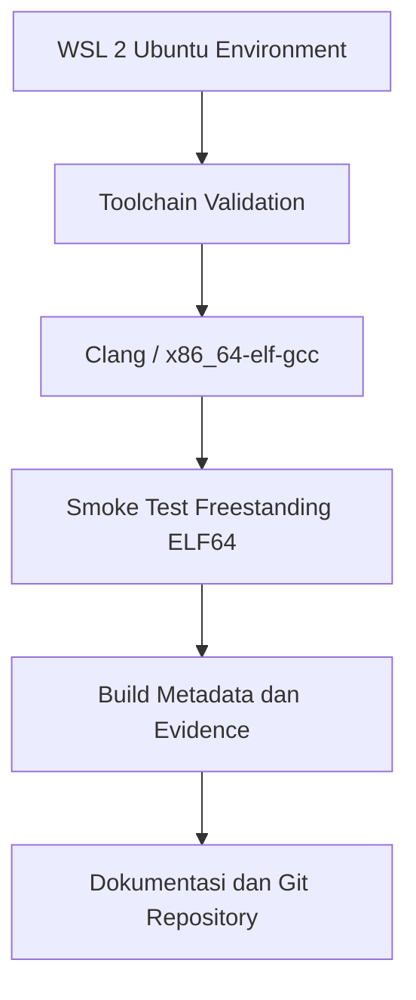

Laporan Praktikum Sistem Operasi Lanjut — MCSOS-M0

**Nama file laporan:** `laporan_praktikum_[M0]_[2583207073007].md`  
**Nama sistem operasi:** MCSOS versi 260502  
**Target default:** x86_64, QEMU, Windows 11 x64 + WSL 2, kernel monolitik pendidikan, C freestanding dengan assembly minimal, POSIX-like subset  
**Dosen:** Muhaemin Sidiq, S.Pd., M.Pd.  
**Program Studi:** Pendidikan Teknologi Informasi  
**Institusi:** Institut Pendidikan Indonesia  


---

## 0. Metadata Laporan

| Atribut | Isi |
|---|---|
| Kode praktikum | `[M0]` |
| Judul praktikum | `[ Baseline Requirements, Governance, dan Lingkungan Pengembangan Reproducible]` |
| Jenis pengerjaan | `[Individu]` |
| Nama mahasiswa | `[Salma Rahayu]` |
| NIM | `[258207073007]` |
| Kelas | `[1A]` |
| Nama kelompok | `[isi jika kelompok]` |
| Anggota kelompok | `[nama, NIM, peran ringkas]` |
| Tanggal praktikum | `[2026-05-05]` |
| Tanggal pengumpulan | `[2026-05-08]` |
| Repository | `~/src/mcsos` |
|---|---|
| Branch | `m0/salma` |
| Commit awal | `51ab045` |
| Commit akhir | `83888abf7e4e297bbfcc682ca8752af51fde13bf` |
| Status readiness yang diklaim | `siap demonstrasi praktikum` |

---

## 1. Sampul

# Laporan Praktikum `[M0]`  
## `[ Baseline Requirements, Governance, dan Lingkungan Pengembangan Reproducible]`

Disusun oleh:

| Nama | NIM | Kelas | Peran |
|---|---|---|---|
| `[Salma Rahayu]` | `[2583207073006]` | `[1A]` | `[individu]` |
| `[opsional]` | `[opsional]` | `[opsional]` | `[opsional]` |

Dosen Pengampu: **Muhaemin Sidiq, S.Pd., M.Pd.**  
Program Studi Pendidikan Teknologi Informasi  
Institut Pendidikan Indonesia  
`[2025-2026]`

---

## 2. Pernyataan Orisinalitas dan Integritas Akademik

Saya menyatakan bahwa laporan ini disusun berdasarkan pekerjaan praktikum sendiri. Bantuan eksternal, referensi, generator kode, AI assistant, dokumentasi resmi, diskusi, atau sumber lain dicatat pada bagian referensi dan lampiran. Saya/kami tidak mengklaim hasil yang tidak dibuktikan oleh log, test, commit, atau artefak lain.

| Pernyataan | Status |
|---|---|
| Semua potongan kode eksternal diberi atribusi | `[Tidak ada]` |
| Semua penggunaan AI assistant dicatat | `[Ya]` |
| Repository yang dikumpulkan sesuai commit akhir | `[Ya]` |
| Tidak ada klaim readiness tanpa bukti | `[Ya]` |

Catatan penggunaan bantuan eksternal:

```text
[Alat:
- ChatGPT (OpenAI)
Prompt ringkas:
- Meminta bimbingan instalasi dan validasi lingkungan M0 MCSOS.
- Meminta penjelasan langkah penggunaan Git, WSL 2, QEMU, Makefile, dan smoke test.
- Meminta bantuan analisis hasil command dan penyusunan dokumen baseline.
Sumber:
- Dokumentasi internal repository MCSOS
- Manual command Linux (`git`, `make`, `readelf`, `objdump`, `tree`)
- Dokumentasi toolchain LLVM/Clang dan QEMU
Bagian yang dibantu:
- Troubleshooting WSL dan GitHub SSH
- Penyusunan dokumen baseline M0
- Validasi smoke test freestanding object
- Verifikasi struktur repository
- Pemeriksaan output `readelf`, `file`, dan `git`
- Penyusunan tabel analisis dan evidence
Verifikasi mandiri yang dilakukan:
- Menjalankan ulang `make meta`, `make check`, `make smoke`, dan `make qemu-version`
- Memeriksa output `readelf -h build/smoke/freestanding.o`
- Memastikan repository berada di `/home/amma/src/mcsos`
- Memastikan `git status` bersih
- Memastikan commit berhasil dipush ke repository GitHub
- Memeriksa keberadaan seluruh dokumen baseline pada direktori `docs/`
- Seluruh proses praktikum, eksekusi command, commit repository, dan pengujian dilakukan sendiri pada environment WSL pribadi.]
```

---

## 3. Tujuan Praktikum

Tuliskan tujuan teknis dan konseptual praktikum. Tujuan harus dapat diuji.

1. `[Membangun dan memvalidasi environment pengembangan sistem operasi freestanding x86_64 menggunakan WSL 2 dan toolchain Linux yang dapat direproduksi.]`
2. `[Menghasilkan freestanding smoke object bertipe ELF64 relocatable menggunakan target eksplisit x86_64-unknown-none dan memverifikasi hasilnya menggunakan readelf serta objdump.]`
3. `[Memahami konsep host, build environment, target architecture, freestanding compilation, ELF object, ABI x86_64, dan reproducible build dalam pengembangan sistem operasi.]`
4. `[Menyimpan evidence praktikum berupa metadata toolchain, log validasi environment, output readelf/objdump, commit repository, dan artefak build untuk mendukung traceability dan reproducibility.]`
---

## 4. Capaian Pembelajaran Praktikum

Setelah praktikum ini, mahasiswa mampu:

| CPL/CPMK praktikum | Bukti yang harus ditunjukkan |
|---|---|
| `[Menjelaskan pentingnya lingkungan build yang terisolasi dan reproducible dalam pengembangan sistem operasi.]` | `[Menjelaskan mengapa pengembangan sistem operasi memerlukan lingkungan build yang terisolasi, terdokumentasi, dan dapat direproduksi.]` |
| `[Menginstal dan memverifikasi lingkungan WSL 2 untuk pengembangan sistem operasi.]` | `[Menginstal dan memverifikasi WSL 2 pada Windows 11 x64 sesuai prosedur resmi Microsoft [1], [2].]` |
| `[Menyiapkan toolchain dasar pengembangan sistem operasi pada Linux WSL.]` | `[Menyiapkan distribusi Linux WSL untuk pengembangan OS dengan toolchain, emulator, debugger, assembler, static analysis, dan utilitas image dasar.]` |
| `[Membangun struktur repository yang mendukung pengembangan sistem operasi secara bertahap.]` | `[Membuat struktur repository awal MCSOS yang konsisten dengan roadmap pengembangan bertahap.]` |
| `[Menyusun dokumentasi baseline dan governance proyek.]` | `[Membuat dokumen baseline requirements, non-goals, assumptions, threat model awal, risk register, dan verification matrix.]` |
| `[Membuat mekanisme validasi environment dan pencatatan metadata toolchain.]` | `[Membuat script validasi lingkungan yang mencatat versi toolchain dan mendeteksi kesalahan konfigurasi umum.]` |
| `[Mengumpulkan dan memelihara evidence teknis yang dapat diverifikasi.]` | `[Memahami bahwa bukti teknis berupa log, commit hash, versi tool, checksum, dan hasil pemeriksaan object file adalah bagian dari penilaian praktikum.]` |
| `[Mengevaluasi tingkat readiness hasil praktikum berdasarkan evidence yang tersedia.]` | `[Membedakan status siap uji lingkungan, siap uji QEMU, siap demonstrasi praktikum, dan klaim yang tidak boleh digunakan seperti “tanpa error” atau “siap produksi”.]` |
---

## 5. Peta Milestone MCSOS

Centang milestone yang menjadi fokus laporan ini. Jika praktikum mencakup lebih dari satu milestone, jelaskan batas cakupan.

| Milestone | Fokus | Status dalam laporan |
|---|---|---|
| M0 | Requirements, governance, baseline arsitektur | `[ ] tidak dibahas / [V] dibahas / [ ] selesai praktikum` |
| M1 | Toolchain reproducible, Git, QEMU, GDB, metadata build | `[V] tidak dibahas / [ ] dibahas / [ ] selesai praktikum` |
| M2 | Boot image, kernel ELF64, early console | `[V] tidak dibahas / [ ] dibahas / [ ] selesai praktikum` |
| M3 | Panic path, linker map, GDB, observability awal | `[V] tidak dibahas / [ ] dibahas / [ ] selesai praktikum` |
| M4 | Trap, exception, interrupt, timer | `[V] tidak dibahas / [ ] dibahas / [ ] selesai praktikum` |
| M5 | PMM, VMM, page table, kernel heap | `[V] tidak dibahas / [ ] dibahas / [ ] selesai praktikum` |
| M6 | Thread, scheduler, synchronization | `[V] tidak dibahas / [ ] dibahas / [ ] selesai praktikum` |
| M7 | Syscall ABI dan user program loader | `[V] tidak dibahas / [ ] dibahas / [ ] selesai praktikum` |
| M8 | VFS, file descriptor, ramfs | `[V] tidak dibahas / [ ] dibahas / [ ] selesai praktikum` |
| M9 | Block layer dan device model | `[V] tidak dibahas / [ ] dibahas / [ ] selesai praktikum` |
| M10 | Persistent filesystem, mcsfs/ext2-like, recovery | `[V] tidak dibahas / [ ] dibahas / [ ] selesai praktikum` |
| M11 | Networking stack, packet parsing, UDP/TCP subset | `[V] tidak dibahas / [ ] dibahas / [ ] selesai praktikum` |
| M12 | Security model, capability/ACL, syscall fuzzing, hardening | `[V] tidak dibahas / [ ] dibahas / [ ] selesai praktikum` |
| M13 | SMP, scalability, lock stress, NUMA-aware preparation | `[V] tidak dibahas / [ ] dibahas / [ ] selesai praktikum` |
| M14 | Framebuffer, graphics console, visual regression | `[V] tidak dibahas / [ ] dibahas / [ ] selesai praktikum` |
| M15 | Virtualization/container subset | `[V] tidak dibahas / [ ] dibahas / [ ] selesai praktikum` |
| M16 | Observability, update/rollback, release image, readiness review | `[V] tidak dibahas / [ ] dibahas / [ ] selesai praktikum` |

Batas cakupan praktikum:

```text
[Batas cakupan praktikum:

- Praktikum M0 hanya mencakup persiapan environment pengembangan, validasi toolchain, struktur repository, dokumentasi baseline, dan smoke test object freestanding ELF64.
- Kernel belum dapat melakukan booting pada QEMU.
- Belum terdapat implementasi scheduler, memory management, filesystem, syscall, driver perangkat keras, maupun user mode.
- Pengujian masih terbatas pada validasi object file, toolchain, dan reproducibility dasar.
- Belum dilakukan hardening keamanan maupun pengujian exploit/security runtime.]
```

## 6. Dasar Teori Ringkas

## 6. Dasar Teori Ringkas

Praktikum M0 berfokus pada persiapan lingkungan pengembangan sistem operasi menggunakan WSL 2, Git, Clang/LLVM, GCC cross-compiler, dan QEMU. Tahap ini bertujuan memastikan seluruh toolchain dapat digunakan secara konsisten sebelum pengembangan kernel dimulai.
WSL 2 digunakan karena menyediakan kernel Linux asli di atas Windows sehingga kompatibilitas toolchain lebih stabil dibanding filesystem `/mnt/c`. Git digunakan untuk version control dan pelacakan perubahan repository selama praktikum berlangsung.
Cross-compiler diperlukan karena kernel tidak boleh dikompilasi menggunakan konfigurasi default host system. Target `x86_64-elf` digunakan agar compiler menghasilkan binary independen tanpa ketergantungan sistem operasi host.
Format ELF64 relocatable merupakan format object file hasil kompilasi awal yang belum melalui proses linking penuh menjadi executable kernel. Object ini digunakan sebagai bukti bahwa toolchain freestanding berhasil bekerja.
Smoke test dilakukan untuk memverifikasi bahwa compiler mampu menghasilkan object ELF64 x86-64 dengan mode freestanding menggunakan flag seperti `-ffreestanding` dan `-mno-red-zone`. Tahap ini menjadi dasar sebelum masuk ke pengembangan bootloader dan kernel pada milestone berikutnya.

### 6.1 Konsep Sistem Operasi yang Diuji

```text
[Praktikum M0 menguji konsep dasar pengembangan sistem operasi berbasis kernel freestanding pada arsitektur x86_64. Pada tahap ini kernel belum diimplementasikan sepenuhnya, namun beberapa konsep penting sistem operasi sudah diperkenalkan sebagai fondasi untuk milestone berikutnya.
Konsep bootloader diperkenalkan sebagai komponen awal yang nantinya bertugas memuat kernel ke memori dan memindahkan kontrol eksekusi dari firmware ke kernel. Walaupun bootloader belum dibuat pada M0, struktur repository dan toolchain sudah disiapkan untuk mendukung proses booting pada tahap berikutnya.
Format ELF64 digunakan sebagai format object file hasil kompilasi kernel. Praktikum menguji bahwa compiler dapat menghasilkan file ELF64 relocatable untuk target x86_64 secara freestanding tanpa ketergantungan library host.
Linker dan linker script diperkenalkan sebagai mekanisme pengaturan tata letak memori kernel. Pada M0 proses linking penuh belum dilakukan, namun konsep relocatable object menjadi dasar sebelum kernel executable dibuat.
Konsep low-level kernel seperti trap frame, physical memory management (PMM), virtual memory management (VMM), scheduler, virtual filesystem (VFS), driver perangkat keras, networking, dan security belum diimplementasikan, tetapi sudah diperkenalkan melalui threat model, risk register, dan dokumentasi baseline sebagai persiapan menuju milestone berikutnya.
Selain itu praktikum juga menekankan reproducibility build, validasi toolchain, traceability Git, dan supply-chain security agar pengembangan kernel dapat dilakukan secara konsisten dan aman.]
```

### 6.2 Konsep Arsitektur x86_64 yang Relevan

| Konsep | Relevansi pada praktikum | Bukti/verifikasi |
|---|---|---|
| `[x86_64 ISA]` | `[Target utama praktikum adalah arsitektur x86_64 yang digunakan untuk menghasilkan freestanding object dan menjadi dasar pengembangan kernel pada milestone berikutnya.]` | `[Output readelf menunjukkan Machine: Advanced Micro Devices X86-64.]` |
| `[System V ABI]` | `[Menentukan calling convention, penggunaan register, stack layout, dan kompatibilitas object file yang dihasilkan compiler.]` | `[Target compile x86_64-unknown-none dan hasil disassembly objdump.]` |
| `[ELF64 Object Format]` | `[Digunakan sebagai format object file hasil compile yang akan digunakan pada proses linking kernel.]` | `[readelf -h menunjukkan Class: ELF64 dan Type: REL (Relocatable file).]` |
| `[Relocatable Object]` | `[Smoke test menghasilkan object file yang belum dilink dan masih dapat direlokasi oleh linker.]` | `[Type: REL (Relocatable file) pada output readelf.]` |
| `[Stack Frame x86_64]` | `[Memahami struktur stack penting untuk pengembangan kernel dan debugging pada milestone berikutnya.]` | `[Objdump menunjukkan instruksi push %rbp, mov %rsp,%rbp, dan ret.]` |
| `[-mno-red-zone]` | `[Kernel tidak boleh bergantung pada red zone karena interrupt dapat menimpa area tersebut dan menyebabkan stack corruption.]` | `[Eksperimen red zone dan konfigurasi compile freestanding.]` |
| `[Long Mode]` | `[Merupakan mode operasi 64-bit yang akan digunakan kernel x86_64 pada milestone berikutnya.]` | `[Target compile dan arsitektur ELF64 yang digunakan.]` |

### 6.3 Konsep Implementasi Freestanding

| Aspek | Keputusan praktikum |
|---|---|
| Bahasa | `[C17 freestanding dan assembly x86_64 untuk tahap pengembangan sistem operasi]` |
| Runtime | `[Tanpa hosted libc dan tanpa dependency operating system host]` |
| ABI | `[x86_64 System V ABI dengan target freestanding x86_64-unknown-none]` |
| Compiler flags kritis | `[-ffreestanding -mno-red-zone --target=x86_64-unknown-none]` |
| Format output | `[ELF64 relocatable object (REL)]` |
| Risiko undefined behavior | `[Pointer invalid, alignment error, integer overflow, memory corruption, aliasing issue, stack corruption akibat konfigurasi ABI yang tidak sesuai]` |


### 6.4 Referensi Teori yang Digunakan

| No. | Sumber | Bagian yang digunakan | Alasan relevansi |
|---|---|---|---|
| `[1]` | `[Dokumentasi resmi GCC]` | `[Cross compiler `x86_64-elf`]` | `[ Digunakan untuk memahami proses build compiler target bare metal]` |
| `[2]` | `[Dokumentasi Clang/LLVM]` | `[Flag freestanding dan target compilation ]` | `[Digunakan untuk konfigurasi compiler kernel freestanding]` |
| `[3]` | `[Dokumentasi GNU Binutils]` | `[Assembler, linker, dan ELF tools]` | `[ Digunakan untuk analisis object ELF64 ]` |
| `[4]` | `[Dokumentasi Git dan GitHub]` | `[Version control dan repository management]` | `[Digunakan untuk commit, branch, dan traceability praktikum ]` |
| `[5]` | `[Dokumentasi QEMU]` | `[Emulator x86_64]` | `[Digunakan untuk validasi kesiapan environment emulator.]` |
| `[6]` | `[Dokumentasi WSL 2 Microsoft ]` | `[Environment Linux di Windows]` | `[Digunakan untuk setup lingkungan praktikum ]` |
| `[7]` | `[ OSDev Wiki]` | `[Konsep kernel freestanding dan bare metal]` | `[Digunakan sebagai referensi konsep sistem operasi ]` |
| `[8]` | `[ChatGPT (AI Assistant)]` | `[Penjelasan command, debugging, dan penyusunan laporan]` | `[Digunakan sebagai bantuan pembelajaran dan analisis praktikum .]` |

---

## 7. Lingkungan Praktikum

### 7.1 Host dan Target

| Komponen | Nilai |
|---|---|
| Host OS | `[Windows 11 + WSL 2 Ubuntu]` |
| Lingkungan build | `[Ubuntu WSL 2]` |
| Target ISA |'x86_64'  |
| Target ABI | `[x86_64 System V ABI]` |
| Emulator | `[QEMU x86_64]` |
| Firmware emulator | `[OVMF]` |
| Debugger | `[ GDB]` |
| Build system | `[GNU Make]` |
| Bahasa utama | `[C17]` |
| Assembly | `[NASM x86_64 assembly]` |

### 7.2 Versi Toolchain

Tempel output versi toolchain berikut. Jalankan dari clean shell WSL.

```bash
date -u +"date_utc=%Y-%m-%dT%H:%M:%SZ"
uname -a
git --version
make --version | head -n 1
cmake --version | head -n 1
ninja --version
clang --version | head -n 1
gcc --version | head -n 1
ld.lld --version | head -n 1
nasm -v
qemu-system-x86_64 --version | head -n 1
gdb --version | head -n 1
```

Output:

```text
[date_utc=2026-05-17T01:13:48Z
Linux DESKTOP-S5LUA56 6.6.114.1-microsoft-standard-WSL2 #1 SMP PREEMPT_DYNAMIC Mon Dec  1 20:46:23 UTC 2025 x86_64 GNU/Linux
git version 2.53.0
GNU Make 4.4.1
cmake version 4.2.3
1.13.2
Ubuntu clang version 21.1.8 (6ubuntu1)
gcc (Ubuntu 15.2.0-16ubuntu1) 15.2.0
Ubuntu LLD 21.1.8 (compatible with GNU linkers)
NASM version 3.01
QEMU emulator version 10.2.1 (Debian 1:10.2.1+ds-1ubuntu3)
GNU gdb (Ubuntu 17.1-2ubuntu1) 17.1]
```

### 7.3 Lokasi Repository

| Item | Nilai |
|---|---|
| Path repository di WSL | `` `[`/home/salma_rahayu/src/mcsos`]` `` |
| Apakah berada di filesystem Linux WSL, bukan `/mnt/c` | `[Ya]` |
| Remote repository | `[`https://github.com/amaaarhyu078-creator/mcsos-.git`]` |
| Branch | `[ `m0/salma` ]` |
| Commit hash awal | `` `[`668bc47`]` `` |
| Commit hash akhir | `` `[`83888ab`]` `` |

---

## 8. Repository dan Struktur File

### 8.1 Struktur Direktori yang Relevan

Tampilkan hanya direktori dan file yang relevan dengan praktikum.

```text
[mcsos/
├── .git/
├── .gitignore
├── Makefile
├── README.md
├── build/
│   ├── evidence/
│   ├── meta/
│   └── smoke/
├── docs/
│   ├── adr/
│   ├── architecture/
│   ├── governance/
│   ├── reports/
│   ├── requirements/
│   ├── research/
│   ├── security/
│   └── testing/
├── research/
├── smoke/
└── tools/
```]
```

### 8.2 File yang Dibuat atau Diubah

| File | Jenis perubahan | Alasan perubahan | Risiko |
|---|---|---|---|
| `[Makefile]` | `[ubah]` | `[Menambahkan target make smoke, make meta, make check, dan evidence]` | `[Sedang — build dapat gagal jika konfigurasi salah]` |
| `[smoke/freestanding.c]` | `[buat]` | `[Membuat smoke test freestanding ELF64]` | `[Sedang — target object bisa salah]` |
| `[research/compiler_compare.c]` | `[buat]` | `[Eksperimen perbandingan output Clang dan GCC]` | `[Rendah — hanya file eksperimen]` |
| `[research/redzone_test.c]` | `[buat]` | `[Menguji pengaruh -mno-red-zone]` | `[Rendah — hanya analisis stack behavior]` |
| `[tools/check_env.sh]` | `[ubah]` | `[Validasi environment dan metadata toolchain]` | `[Sedang — pengecekan toolchain bisa gagal]` |
| `[tools/collect_evidence.sh]` | `[buat]` | `[Mengumpulkan evidence praktikum otomatis]` | `[Rendah — hanya memengaruhi dokumentasi]` |
| `[docs/architecture/cross_compiler_notes.md]` | `[buat]` | `[Dokumentasi build cross compiler x86_64-elf]` | `[Rendah — dokumentasi]` |
| `[docs/architecture/m0_dependency_graph.md]` | `[buat]` | `[Membuat dependency graph M0]` | `[Rendah — dokumentasi desain]` |
| `[docs/research/compiler_comparison.md]` | `[buat]` | `[Menyimpan hasil analisis compiler]` | `[Rendah — dokumentasi riset]` |
| `[docs/research/redzone_analysis.md]` | `[buat]` | `[Menyimpan hasil analisis red zone]` | `[Rendah — dokumentasi riset]` |
| `[docs/research/reproducible_build_policy.md]` | `[buat]` | `[Menyusun policy reproducible build]` | `[Rendah — dokumentasi kebijakan]` |
| `[docs/research/supply_chain_threat_model.md]` | `[buat]` | `[Menyusun threat model supply-chain]` | `[Sedang — analisis ancaman bisa kurang lengkap]` |
| `[docs/security/threat_model.md]` | `[buat]` | `[Mendokumentasikan baseline threat model M0]` | `[Sedang — ancaman keamanan bisa terlewat]` |
| `[docs/testing/verification_matrix.md]` | `[buat]` | `[Membuat verification matrix praktikum]` | `[Rendah — validasi bisa tidak lengkap]` |
| `[docs/governance/risk_register.md]` | `[buat]` | `[Mencatat risiko implementasi M0]` | `[Rendah — risiko kurang terdokumentasi]` |
| `[docs/reports/M0-laporan.md]` | `[buat]` | `[Menyusun laporan akhir praktikum]` | `[Rendah — hanya dokumentasi laporan]` |

### 8.3 Ringkasan Diff

```bash
git status --short
git diff --stat
git log --oneline -n 5
```

Output:

```text
[83888ab (HEAD -> m0/salma, origin/m0/salma) Add research experiment sources
0907ac5 Add supply chain threat model research
ec5f80a Add reproducible build policy research
cccec24 Add red zone analysis research
51ab045 Add compiler comparison research]
```

---

## 9. Desain Teknis

### 9.1 Masalah yang Diselesaikan

```text
[````markdown id="e4k8pz"
## 9. Desain Teknis

### 9.1 Masalah yang Diselesaikan

```text
Praktikum M0 berfokus pada pembentukan baseline environment dan validasi toolchain untuk pengembangan sistem operasi freestanding x86_64 secara reproducible di WSL 2.
Masalah utama yang diselesaikan adalah belum adanya environment build yang tervalidasi dan terdokumentasi untuk pengembangan kernel bare metal menggunakan Clang dan cross compiler x86_64-elf.
Sebelum baseline dibuat, repository belum memiliki:
- validasi environment WSL 2,
- metadata versi toolchain,
- smoke test freestanding ELF64 relocatable,
- workflow evidence build,
- dokumentasi cross compiler,
- analisis compiler comparison,
- analisis red zone,
- reproducible build policy,
- supply-chain threat model,
- verification matrix,
- risk register.
Selain itu terdapat beberapa risiko:
- compiler menggunakan target host secara diam-diam,
- repository berada di `/mnt/c`,
- versi toolchain berbeda antar mesin,
- build tidak reproducible,
- tidak adanya evidence hasil build,
- ancaman supply-chain pada toolchain dan bootloader.
M0 menyelesaikan masalah tersebut dengan:
- membuat workflow validasi environment menggunakan `tools/check_env.sh`,
- memastikan seluruh toolchain tersedia,
- menghasilkan object ELF64 freestanding menggunakan smoke test,
- mencatat metadata toolchain pada `toolchain-versions.txt`,
- membuat dokumentasi teknis dan governance,
- melakukan eksperimen compiler comparison dan red zone,
- membuat evidence build yang dapat diverifikasi ulang,
- menggunakan Git commit untuk traceability perubahan repository.]
```

### 9.2 Keputusan Desain

| Keputusan | Alternatif yang dipertimbangkan | Alasan memilih | Konsekuensi |
|---|---|---|---|
| `[Menggunakan WSL 2 sebagai build environment utama]` | `[Build langsung di Windows native]` | `[WSL 2 menyediakan environment Linux yang lebih stabil untuk OS development]` | `[Perlu konfigurasi Ubuntu dan package Linux]` |
| `[Repository ditempatkan di ~/src/mcsos]` | `[Repository di /mnt/c]` | `[Menghindari masalah permission, line ending, dan performa filesystem Windows]` | `[File project berada di filesystem Linux WSL]` |
| `[Menggunakan Clang sebagai compiler utama smoke test]` | `[Compiler host default tanpa target eksplisit]` | `[Memastikan build menggunakan target freestanding x86_64]` | `[Semua compile command harus menentukan target]` |
| `[Membangun cross compiler x86_64-elf-gcc]` | `[Menggunakan GCC host Linux]` | `[Cross compiler lebih aman untuk bare metal development]` | `[Proses build toolchain lebih panjang]` |
| `[Menggunakan target x86_64-unknown-none pada smoke test]` | `[Target host Linux default]` | `[Mencegah penggunaan ABI host secara diam-diam]` | `[Compile command menjadi lebih kompleks]` |
| `[Menggunakan smoke test freestanding ELF64 sebelum kernel bootable]` | `[Langsung membuat kernel bootable]` | `[Validasi object freestanding lebih mudah dianalisis]` | `[M0 belum menghasilkan kernel yang dapat boot]` |
| `[Menggunakan -mno-red-zone pada compile kernel-style object]` | `[Menggunakan red zone default x86_64]` | `[Kernel tidak aman memakai red zone saat interrupt]` | `[Stack frame menjadi sedikit lebih besar]` |
| `[Menggunakan QEMU sebagai emulator utama]` | `[VirtualBox atau Bochs]` | `[QEMU umum digunakan dalam OS development]` | `[Belum digunakan penuh pada M0]` |
| `[Menyimpan metadata toolchain pada build/meta/toolchain-versions.txt]` | `[Tidak mencatat versi toolchain]` | `[Mendukung reproducible build dan audit environment]` | `[Metadata harus diperbarui secara konsisten]` |
| `[Membuat dokumentasi research dan threat model sejak M0]` | `[Dokumentasi ditunda ke milestone berikutnya]` | `[Risiko dan desain dapat dianalisis lebih awal]` | `[Dokumentasi perlu maintenance lanjutan]` |
### 9.3 Arsitektur Ringkas

Tambahkan diagram ASCII atau Mermaid. Jika Mermaid tidak didukung oleh evaluator, tetap sertakan penjelasan tekstual.



Penjelasan diagram:

```text
[Praktikum dimulai dari environment WSL 2 Ubuntu yang digunakan sebagai build environment utama. Selanjutnya dilakukan validasi toolchain menggunakan script tools/check_env.sh untuk memastikan compiler, linker, QEMU, debugger, dan tools lain tersedia.
Setelah environment tervalidasi, proses build dilakukan menggunakan Clang dan cross compiler x86_64-elf-gcc dengan target freestanding x86_64-unknown-none. Hasil compile digunakan untuk menghasilkan smoke test object ELF64 relocatable.
Output build kemudian menghasilkan metadata toolchain, file evidence, dan hasil analisis menggunakan readelf, objdump, serta file command. Semua artefak dan dokumentasi disimpan di repository Git untuk mendukung reproducibility dan traceability praktikum M0.]
```

### 9.4 Kontrak Antarmuka

| Antarmuka | Pemanggil | Penerima | Precondition | Postcondition | Error path |
|---|---|---|---|---|---|
| `[make check]` | `[User terminal]` | `[tools/check_env.sh]` | `[WSL 2 dan package toolchain sudah terinstall]` | `[Metadata toolchain berhasil dibuat]` | `[Script menampilkan tool yang belum tersedia]` |
| `[make smoke]` | `[User terminal]` | `[Clang compiler]` | `[Source smoke/freestanding.c tersedia]` | `[Object ELF64 relocatable berhasil dibuat]` | `[Compile gagal jika target atau flag salah]` |
| `[readelf -h build/smoke/freestanding.o]` | `[User terminal]` | `[readelf]` | `[File object berhasil dibuat]` | `[Header ELF64 dapat dianalisis]` | `[Error jika file object tidak ada]` |
| `[objdump -drwC build/smoke/freestanding.o]` | `[User terminal]` | `[objdump]` | `[Object file tersedia]` | `[Disassembly object berhasil ditampilkan]` | `[Error jika object corrupt]` |
| `[git commit]` | `[User terminal]` | `[Git repository]` | `[Perubahan sudah di-add]` | `[Commit hash baru dibuat]` | `[Commit gagal jika pre-commit check gagal]` |
| `[git push origin m0/salma]` | `[User terminal]` | `[GitHub repository]` | `[Remote repository dan token valid]` | `[Branch berhasil diupload ke GitHub]` | `[Authentication failed atau repository not found]` |

### 9.5 Struktur Data Utama

| Struktur data | Field penting | Ownership | Lifetime | Invariant |
|---|---|---|---|---|
| `[struct m0_smoke_record]` | `[magic, version, pointer_width, size_width]` | `[smoke/freestanding.c]` | `[dibuat saat compile freestanding object]` | `[magic harus bernilai MCSOS_M0_MAGIC]` |
| `[toolchain-versions.txt]` | `[versi compiler, linker, debugger, emulator]` | `[tools/check_env.sh]` | `[dibuat saat make meta atau make check]` | `[metadata harus sesuai toolchain yang digunakan]` |
| `[build/smoke/freestanding.o]` | `[ELF header, section table, machine type]` | `[hasil compile smoke test]` | `[dibuat saat make smoke]` | `[harus berupa ELF64 relocatable x86-64]` |
| `[Git commit history]` | `[commit hash, branch, message]` | `[repository Git]` | `[tersimpan selama repository ada]` | `[setiap perubahan harus dapat ditelusuri]` |

### 9.6 Invariants

Tuliskan invariant yang harus benar sepanjang eksekusi.

1. `[Repository utama MCSOS harus berada di filesystem Linux WSL dan bukan di /mnt/c.]`
2. `[Semua proses compile smoke test harus menggunakan target eksplisit x86_64-unknown-none.]`
3. `[Object hasil smoke test harus berupa ELF64 relocatable untuk arsitektur x86-64.]`
4. `[Metadata toolchain pada build/meta/toolchain-versions.txt harus sesuai dengan toolchain yang digunakan saat build.]`

### 9.7 Ownership, Locking, dan Concurrency

| Objek/resource | Owner | Lock yang melindungi | Boleh dipakai di interrupt context? | Catatan |
|---|---|---|---|---|
| `[toolchain-versions.txt]` | `[tools/check_env.sh]` | `[none]` | `[Tidak]` | `[Hanya digunakan saat proses validasi environment]` |
| `[build/smoke/freestanding.o]` | `[make smoke]` | `[none]` | `[Tidak]` | `[Object build statis tanpa concurrency runtime]` |
| `[Git repository]` | `[Git user/repository]` | `[internal git locking]` | `[Tidak]` | `[Git memakai locking internal saat commit dan push]` |
| `[Dokumentasi docs/]` | `[User repository]` | `[none]` | `[Tidak]` | `[Dokumentasi hanya diubah manual oleh user]` |


Lock order yang berlaku:

```text
[Pada tahap M0 belum terdapat implementasi kernel runtime, scheduler, interrupt handler, spinlock, mutex, maupun concurrency antar core.
Seluruh proses masih berupa build-time workflow dan validasi environment di single user environment WSL 2, sehingga belum diperlukan locking kernel khusus.
Concurrency runtime kernel akan dianalisis pada milestone berikutnya setelah implementasi memory manager, scheduler, dan interrupt subsystem tersedia.]
```

### 9.8 Memory Safety dan Undefined Behavior Risk

| Risiko | Lokasi | Mitigasi | Bukti |
|---|---|---|---|
| `[Penggunaan ABI host secara tidak sengaja]` | `[smoke/freestanding.c]` | `[Menggunakan --target=x86_64-unknown-none]` | `[Output readelf menunjukkan ELF64 x86-64 relocatable]` |
| `[Stack corruption akibat red zone]` | `[research/redzone_test.c]` | `[Menggunakan -mno-red-zone]` | `[Analisis objdump redzone_on.o dan redzone_off.o]` |
| `[Perbedaan hasil build antar toolchain]` | `[Build environment]` | `[Mencatat metadata toolchain pada toolchain-versions.txt]` | `[Output make meta dan make check]` |
| `[Compile failure akibat header hosted libc]` | `[research/redzone_test.c]` | `[Menghapus dependency hosted header dan memakai tipe sederhana]` | `[Compile berhasil setelah perbaikan source]` |
| `[Kesalahan konfigurasi environment]` | `[tools/check_env.sh]` | `[Validasi otomatis seluruh toolchain]` | `[Output make check menunjukkan seluruh tools tersedia]` |

### 9.9 Security Boundary

| Boundary | Data tidak tepercaya | Validasi yang dilakukan | Failure mode aman |
|---|---|---|---|
| `[Toolchain validation]` | `[Versi compiler dan tools pada environment user]` | `[Pengecekan executable menggunakan tools/check_env.sh]` | `[Build dihentikan jika tool tidak tersedia]` |
| `[Git remote repository]` | `[Credential dan remote URL GitHub]` | `[Autentikasi username dan personal access token]` | `[Push ditolak jika token atau repository salah]` |
| `[Smoke test compile input]` | `[Source code freestanding.c]` | `[Compile menggunakan flag freestanding dan target eksplisit]` | `[Compile gagal dan tidak menghasilkan object invalid]` |
| `[Filesystem repository]` | `[Lokasi repository pada host]` | `[Validasi repository tidak berada di /mnt/c]` | `[Warning atau failure pada check_env.sh]` |
| `[Metadata build]` | `[Versi toolchain dan hasil build]` | `[Metadata dicatat otomatis pada toolchain-versions.txt]` | `[Evidence build dianggap tidak valid jika metadata hilang]` |

---

## 10. Langkah Kerja Implementasi

Gunakan tabel berikut untuk setiap langkah. Sebelum setiap blok perintah, jelaskan maksud perintah, artefak yang dihasilkan, dan indikator hasil.

### Langkah 1 — `[Membuat dan memvalidasi environment WSL 2]`

Maksud langkah:

```text
Langkah ini dilakukan untuk memastikan environment Linux WSL 2 siap digunakan sebagai build environment praktikum M0.
```

Perintah:

```bash
wsl --list --verbose
sudo apt update
sudo apt upgrade -y
```

Output ringkas:

```text
Ubuntu Running Version 2
```

Artefak yang dihasilkan:

| Artefak | Lokasi | Fungsi |
|---|---|---|
| `[Environment WSL 2]` | `[Ubuntu WSL]` | `[Build environment utama]` |

Indikator berhasil:

```text
Ubuntu berjalan pada WSL version 2 tanpa error.
```

### Langkah 2 — `[Membuat repository MCSOS]`

Maksud langkah:

```text
Membuat repository project untuk menyimpan source code, dokumentasi, dan evidence praktikum.
```

Perintah:

```bash
mkdir -p ~/src/mcsos
cd ~/src/mcsos
git init
```

Output ringkas:

```text
Initialized empty Git repository
```

Artefak yang dihasilkan:

| Artefak | Lokasi | Fungsi |
|---|---|---|
| `[Git repository]` | `[~/src/mcsos]` | `[Penyimpanan source dan dokumentasi]` |

Indikator berhasil:

```text
Repository Git berhasil dibuat dan dapat digunakan.
```
### Langkah 3 — `[Validasi toolchain environment]`

Maksud langkah:

```text
Memastikan compiler, linker, debugger, emulator, dan tools lain tersedia sebelum build dilakukan.
```

Perintah:

```bash
make check
make meta
```

Output ringkas:

```text
[OK] clang
[OK] ld.lld
[OK] qemu-system-x86_64
[M0] Metadata written to build/meta/toolchain-versions.txt
```

Artefak yang dihasilkan:

| Artefak | Lokasi | Fungsi |
|---|---|---|
| `[toolchain-versions.txt]` | `[build/meta/]` | `[Metadata versi toolchain]` |

Indikator berhasil:

```text
Seluruh toolchain tervalidasi dan metadata berhasil dibuat.
```
### Langkah 4 — `[Menjalankan smoke test freestanding ELF64]`

Maksud langkah:

```text
Menguji apakah compiler dapat menghasilkan object ELF64 relocatable freestanding untuk target x86_64.
```

Perintah:

```bash
make smoke
readelf -h build/smoke/freestanding.o
file build/smoke/freestanding.o
```

Output ringkas:

```text
ELF64 relocatable, x86-64
```

Artefak yang dihasilkan:

| Artefak | Lokasi | Fungsi |
|---|---|---|
| `[freestanding.o]` | `[build/smoke/]` | `[Smoke test object]` |
| `[readelf-header.txt]` | `[build/smoke/]` | `[Bukti header ELF]` |
| `[file.txt]` | `[build/smoke/]` | `[Bukti tipe file object]` |

Indikator berhasil:

```text
Object ELF64 relocatable berhasil dibuat tanpa error compile.
```
### Langkah 5 — `[Membuat dokumentasi dan research]`

Maksud langkah:

```text
Menyusun dokumentasi baseline, threat model, verification matrix, dan hasil research praktikum M0.
```

Perintah:

```bash
nano docs/research/compiler_comparison.md
nano docs/research/redzone_analysis.md
nano docs/security/threat_model.md
```

Output ringkas:

```text
File dokumentasi berhasil dibuat dan disimpan.
```

Artefak yang dihasilkan:

| Artefak | Lokasi | Fungsi |
|---|---|---|
| `[Dokumentasi research]` | `[docs/research/]` | `[Analisis teknis praktikum]` |
| `[Threat model]` | `[docs/security/]` | `[Analisis keamanan baseline]` |

Indikator berhasil:

```text
Dokumentasi tersedia pada repository dan dapat diakses.
```

---

### Langkah 6 — `[Commit dan push repository ke GitHub]`

Maksud langkah:

```text
Menyimpan perubahan repository dan mengupload hasil praktikum ke GitHub untuk traceability dan backup.
```

Perintah:

```bash
git add .
git commit -m "Add M0 baseline"
git push -u origin m0/salma
```

Output ringkas:

```text
[new branch] m0/salma -> m0/salma
```

Artefak yang dihasilkan:

| Artefak | Lokasi | Fungsi |
|---|---|---|
| `[Git commit]` | `[Repository Git]` | `[Traceability perubahan]` |
| `[Remote GitHub repository]` | `[GitHub]` | `[Backup dan submission]` |

Indikator berhasil:

```text
Branch berhasil terupload ke GitHub tanpa authentication error.
```
---

## 11. Checkpoint Buildable

Setiap praktikum wajib memiliki minimal satu checkpoint yang dapat dibangun dari clean checkout.

| Checkpoint | Perintah | Expected result | Status |
|---|---|---|---|
| Clean build | `` `make smoke` `` | `[Object freestanding ELF64 relocatable berhasil dibuat]` | `[PASS]` |
| Metadata toolchain | `` `make meta` `` | `[build/meta/toolchain-versions.txt tersedia]` | `[PASS]` |
| Image generation | `` `make image` `` | `[Belum tersedia pada M0]` | `[NA]` |
| QEMU smoke test | `` `make qemu-version` `` | `[QEMU berhasil terdeteksi pada environment]` | `[PASS]` |
| Test suite | `` `make test` `` | `[Belum diimplementasikan pada M0]` | `[NA]` |

Catatan checkpoint:

```text
Pada milestone M0 belum terdapat kernel bootable, image ISO, maupun automated runtime test suite. Fokus M0 hanya pada validasi environment, smoke test freestanding object, metadata toolchain, dan baseline repository.
Karena itu checkpoint seperti make image dan make test masih berstatus NA dan akan diimplementasikan pada milestone berikutnya.
```

---

## 12. Perintah Uji dan Validasi

### 12.1 Build Test

Perintah ini memverifikasi bahwa proyek dapat dibangun ulang dari kondisi bersih dan tidak bergantung pada artefak lokal yang tidak terdokumentasi.

```bash
make clean
make smoke
```

Hasil:

```text
clang --target=x86_64-unknown-none \
-ffreestanding \
-fno-stack-protector \
-fno-pic \
-mno-red-zone \
-Wall -Wextra -Werror \
-std=c17 \
-c smoke/freestanding.c \
-o build/smoke/freestanding.o

ELF 64-bit LSB relocatable, x86-64
```

Status: `[PASS]`

### 12.2 Static Inspection

Perintah ini memeriksa layout ELF, header object, section, dan hasil compile freestanding sesuai kebutuhan praktikum M0.
```bash
readelf -h build/smoke/freestanding.o
objdump -drwC build/smoke/freestanding.o | head -n 120
file build/smoke/freestanding.o
```

Hasil penting:

```text
Class: ELF64
Type: REL (Relocatable file)
Machine: Advanced Micro Devices X86-64

build/smoke/freestanding.o:
ELF 64-bit LSB relocatable, x86-64, version 1 (SYSV)
```
Status: `[PASS]`

### 12.3 QEMU Smoke Test

Perintah ini memverifikasi bahwa QEMU tersedia pada environment praktikum M0.

```bash
qemu-system-x86_64 --version
```

Hasil:

```text
QEMU emulator version 10.2.1
```

Status: `[PASS]`

### 12.4 GDB Debug Evidence

Perintah ini memverifikasi bahwa debugger GDB tersedia pada environment praktikum M0.

```bash
gdb --version | head -n 1
```

Hasil:

```text
GNU gdb (Ubuntu 17.1-2ubuntu1) 17.1
```

Status: `[PASS]`

### 12.5 Unit Test


```bash
make test
```

Hasil:

```text
Belum tersedia pada milestone M0.
```

Status: `[NA]`

### 12.6 Stress/Fuzz/Fault Injection Test

Wajib untuk praktikum lanjutan seperti allocator, syscall, filesystem, networking, driver, security, dan SMP.

```bash
Belum diimplementasikan pada milestone M0.
```

Hasil:

```text
M0 hanya mencakup validasi environment, smoke test freestanding object, metadata toolchain, dan baseline dokumentasi.
```

Status: `[NA]`

### 12.7 Visual Evidence

Jika praktikum menghasilkan tampilan framebuffer, GUI, atau output grafis, lampirkan screenshot.

| Screenshot | Lokasi file | Keterangan |
|---|---|---|
| `[Screenshot terminal make smoke]` | `[docs/reports/screenshots/make-smoke.png]` | `[Membuktikan smoke test ELF64 freestanding berhasil.]` |
| `[Screenshot terminal make check]` | `[docs/reports/screenshots/make-check.png]` | `[Membuktikan toolchain dan environment tervalidasi.]` |
| `[Screenshot git push GitHub]` | `[docs/reports/screenshots/git-push.png]` | `[Membuktikan repository berhasil diupload ke GitHub.]` |


## 13. Hasil Uji

### 13.1 Tabel Ringkasan Hasil

| No. | Uji | Expected result | Actual result | Status | Evidence |
|---|---|---|---|---|---|
| 1 | `[make check]` | `[Seluruh toolchain tersedia dan tervalidasi]` | `[Semua tools terdeteksi dengan status OK]` | `[PASS]` | `[Output terminal make check]` |
| 2 | `[make meta]` | `[Metadata toolchain berhasil dibuat]` | `[toolchain-versions.txt berhasil dibuat]` | `[PASS]` | `[build/meta/toolchain-versions.txt]` |
| 3 | `[make smoke]` | `[Object freestanding ELF64 relocatable berhasil dibuat]` | `[freestanding.o berhasil dihasilkan tanpa error]` | `[PASS]` | `[build/smoke/freestanding.o]` |
| 4 | `[readelf -h build/smoke/freestanding.o]` | `[Header ELF64 x86-64 tampil]` | `[Type REL dan Machine x86-64 berhasil ditampilkan]` | `[PASS]` | `[build/smoke/readelf-header.txt]` |
| 5 | `[file build/smoke/freestanding.o]` | `[Object dikenali sebagai ELF64 relocatable]` | `[ELF 64-bit relocatable x86-64 berhasil terdeteksi]` | `[PASS]` | `[build/smoke/file.txt]` |
| 6 | `[qemu-system-x86_64 --version]` | `[QEMU tersedia pada environment]` | `[QEMU version 10.2.1 berhasil terdeteksi]` | `[PASS]` | `[Output terminal qemu-version]` |
| 7 | `[git push origin m0/salma]` | `[Repository berhasil diupload ke GitHub]` | `[Branch m0/salma berhasil dipush ke remote repository]` | `[PASS]` | `[Screenshot terminal/GitHub]` |

### 13.2 Log Penting

```text
[[M0] Repository root: /home/salma_rahayu/src/mcsos

[OK] Repository is not under /mnt/<drive>.

[OK] git
[OK] make
[OK] clang
[OK] ld.lld
[OK] llvm-readelf
[OK] llvm-objdump
[OK] nasm
[OK] qemu-system-x86_64
[OK] gdb
[OK] python3
[OK] shellcheck
[OK] cppcheck

[M0] Metadata written to build/meta/toolchain-versions.txt

ELF Header:
Class: ELF64
Type: REL (Relocatable file)
Machine: Advanced Micro Devices X86-64
build/smoke/freestanding.o:
ELF 64-bit LSB relocatable, x86-64, version 1 (SYSV)
[new branch] m0/salma -> m0/salma]
```

### 13.3 Artefak Bukti

| Artefak | Path | SHA-256 / hash | Fungsi |
|---|---|---|---|
| `freestanding.o` | `[build/smoke/freestanding.o]` | `[hasil sha256sum freestanding.o]` | `[Smoke test ELF64 relocatable object]` |
| `toolchain-versions.txt` | `[build/meta/toolchain-versions.txt]` | `[hasil sha256sum toolchain-versions.txt]` | `[Metadata versi toolchain]` |
| `readelf-header.txt` | `[build/smoke/readelf-header.txt]` | `[hasil sha256sum readelf-header.txt]` | `[Evidence ELF header]` |
| `objdump.txt` | `[build/smoke/objdump.txt]` | `[hasil sha256sum objdump.txt]` | `[Disassembly evidence]` |
| `file.txt` | `[build/smoke/file.txt]` | `[hasil sha256sum file.txt]` | `[Evidence tipe object ELF]` |
| `bukti-terminal.txt` | `[~/src/mcsos/bukti-terminal.txt]` | `[hasil sha256sum bukti-terminal.txt]` | `[Log command dan output praktikum]` |

Perintah hash:

```bash
sha256sum build/smoke/freestanding.o
sha256sum build/meta/toolchain-versions.txt
sha256sum build/smoke/readelf-header.txt
sha256sum build/smoke/objdump.txt
sha256sum build/smoke/file.txt
sha256sum bukti-terminal.txt
```

---

## 14. Analisis Teknis

### 14.1 Analisis Keberhasilan

```text
[Praktikum M0 berhasil karena environment build, toolchain, dan repository berhasil divalidasi sesuai requirement baseline pengembangan sistem operasi freestanding x86_64.
Validasi environment menggunakan tools/check_env.sh menunjukkan seluruh toolchain penting tersedia, seperti clang, ld.lld, llvm-readelf, nasm, qemu-system-x86_64, dan gdb. Selain itu repository berhasil dipastikan berada di filesystem Linux WSL dan bukan di /mnt/c sehingga mengurangi risiko masalah permission, line ending, dan performa filesystem.
Smoke test berhasil menghasilkan object ELF64 relocatable menggunakan target eksplisit x86_64-unknown-none dengan flag freestanding dan -mno-red-zone. Output readelf dan file menunjukkan bahwa object berhasil dikenali sebagai ELF64 x86-64 relocatable sehingga invariant build freestanding berhasil dipenuhi.
Metadata toolchain berhasil dibuat pada build/meta/toolchain-versions.txt sehingga environment build dapat direproduksi ulang pada mesin lain. Evidence build seperti readelf-header.txt, objdump.txt, dan file.txt juga berhasil dihasilkan sehingga hasil compile dapat diverifikasi secara teknis.
Repository Git berhasil digunakan untuk traceability perubahan melalui commit dan push ke GitHub. Hal ini mendukung auditability dan reproducibility praktikum M0.]
```

### 14.2 Analisis Kegagalan atau Perbedaan Hasil

```text
[Kegagalan pertama terjadi saat melakukan git push ke GitHub karena remote repository belum dikonfigurasi dengan benar. Gejala yang muncul adalah error:
"fatal: 'origin' does not appear to be a git repository"
dan
"repository not found".

Akar masalahnya adalah remote GitHub belum dibuat atau URL repository masih menggunakan placeholder. Perbaikan dilakukan dengan membuat repository GitHub baru, mengatur remote origin menggunakan URL repository yang benar, dan melakukan push ulang.

Kegagalan kedua terjadi saat autentikasi GitHub menggunakan password biasa. GitHub menolak autentikasi dengan pesan:
"Password authentication is not supported for Git operations".

Akar masalahnya adalah GitHub hanya menerima Personal Access Token (PAT) untuk HTTPS authentication. Perbaikan dilakukan dengan membuat token GitHub baru dan menggunakan token tersebut saat proses git push.

Selain itu sempat terjadi compile issue pada eksperimen research akibat penggunaan header atau konfigurasi compile yang tidak sesuai dengan environment freestanding. Perbaikan dilakukan dengan menyederhanakan source code dan memastikan compile menggunakan target eksplisit x86_64-unknown-none serta flag freestanding yang sesuai.

Seluruh kegagalan tersebut berhasil diperbaiki dan tidak mengubah invariant utama praktikum M0.]
```

### 14.3 Perbandingan dengan Teori

| Konsep teori | Implementasi praktikum | Sesuai/tidak sesuai | Penjelasan |
|---|---|---|---|
| `[Freestanding environment]` | `[Compile menggunakan --target=x86_64-unknown-none dan -ffreestanding]` | `[Sesuai]` | `[Object berhasil dibuat tanpa dependency hosted libc.]` |
| `[Reproducible build]` | `[Metadata toolchain disimpan pada toolchain-versions.txt]` | `[Sesuai]` | `[Versi toolchain dapat diverifikasi ulang pada build berikutnya.]` |
| `[ELF relocatable object]` | `[Smoke test menghasilkan freestanding.o bertipe REL]` | `[Sesuai]` | `[Output readelf menunjukkan ELF64 relocatable x86-64.]` |
| `[Cross-compilation]` | `[Compile target eksplisit x86_64-unknown-none]` | `[Sesuai]` | `[Menghindari penggunaan ABI host secara diam-diam.]` |
| `[Kernel red zone protection]` | `[Menggunakan flag -mno-red-zone]` | `[Sesuai]` | `[Mengurangi risiko stack corruption pada kernel x86_64.]` |
| `[Repository reproducibility]` | `[Repository ditempatkan di filesystem Linux WSL]` | `[Sesuai]` | `[Menghindari masalah permission dan filesystem /mnt/c.]` |
| `[Kernel runtime debugging]` | `[Belum diimplementasikan pada M0]` | `[Tidak sesuai]` | `[M0 belum memiliki kernel bootable maupun runtime execution.]` |

### 14.4 Kompleksitas dan Kinerja

| Aspek | Estimasi/hasil | Bukti | Catatan |
|---|---|---|---|
| Kompleksitas algoritma | `[O(1) untuk smoke test compile sederhana]` | `[Source smoke/freestanding.c]` | `[M0 belum memiliki algoritma kernel kompleks.]` |
| Waktu build | `[Sangat cepat (< 5 detik)]` | `[Output make smoke]` | `[Build hanya menghasilkan object freestanding kecil.]` |
| Waktu boot QEMU | `[NA]` | `[Belum ada serial log runtime]` | `[M0 belum memiliki kernel bootable.]` |
| Penggunaan memori | `[NA]` | `[Belum ada runtime metric]` | `[Belum terdapat memory manager atau runtime kernel.]` |
| Latensi/throughput | `[NA]` | `[Belum ada benchmark runtime]` | `[M0 masih tahap validasi environment dan build baseline.]` |

---

## 15. Debugging dan Failure Modes

### 15.1 Failure Modes yang Ditemukan

| Failure mode | Gejala | Penyebab sementara | Bukti | Perbaikan |
|---|---|---|---|---|
| `[Git remote repository tidak ditemukan]` | `[git push gagal dengan pesan repository not found]` | `[Remote origin masih salah atau repository belum dibuat]` | `[Output terminal git push]` | `[Membuat repository GitHub dan memperbaiki URL remote]` |
| `[Authentication GitHub gagal]` | `[GitHub menolak login saat git push]` | `[Menggunakan password biasa вместо Personal Access Token]` | `[Pesan "Password authentication is not supported"]` | `[Menggunakan GitHub Personal Access Token]` |
| `[Compile freestanding gagal]` | `[Object tidak berhasil dibangun]` | `[Header atau konfigurasi compile tidak sesuai environment freestanding]` | `[Output compiler error]` | `[Menggunakan target eksplisit dan menyederhanakan source code]` |
| `[Repository berada di lokasi yang salah]` | `[Risiko permission dan line ending issue]` | `[Repository ditempatkan di filesystem Windows]` | `[Validasi repository path]` | `[Memindahkan repository ke ~/src/mcsos di filesystem Linux WSL]` |
| `[QEMU belum dapat menjalankan kernel]` | `[Tidak ada bootable image]` | `[M0 belum memiliki kernel dan ISO image]` | `[Tidak tersedia build/mcsos.iso]` | `[Ditunda ke milestone berikutnya]` |

### 15.2 Failure Modes yang Diantisipasi

| Failure mode | Deteksi | Dampak | Mitigasi |
|---|---|---|---|
| `[Compiler menggunakan ABI host secara diam-diam]` | `[Output readelf dan compile target inspection]` | `[Object tidak sesuai target kernel freestanding]` | `[Menggunakan --target=x86_64-unknown-none]` |
| `[Repository berada di /mnt/c]` | `[tools/check_env.sh dan pwd]` | `[Masalah permission, line ending, dan performa filesystem]` | `[Memindahkan repository ke filesystem Linux WSL]` |
| `[Versi toolchain berbeda antar environment]` | `[toolchain-versions.txt]` | `[Build tidak reproducible]` | `[Mencatat metadata toolchain secara otomatis]` |
| `[GitHub authentication gagal]` | `[Pesan error git push]` | `[Repository tidak dapat diupload]` | `[Menggunakan Personal Access Token GitHub]` |
| `[Object ELF salah target]` | `[readelf -h dan file freestanding.o]` | `[Kernel tidak dapat digunakan pada milestone berikutnya]` | `[Validasi ELF header setelah smoke test]` |
| `[QEMU runtime gagal dijalankan]` | `[Tidak adanya ISO/kernel image]` | `[Runtime test tidak dapat dilakukan]` | `[Menunda boot/runtime test hingga milestone berikutnya]` |

### 15.3 Triage yang Dilakukan

```text
[Proses diagnosis pada praktikum M0 dilakukan secara bertahap berdasarkan jenis error yang muncul.

Tahap pertama dilakukan dengan membaca output terminal dan log command untuk mengidentifikasi error environment, toolchain, atau Git. Validasi environment dilakukan menggunakan tools/check_env.sh serta command seperti pwd, make check, dan qemu-system-x86_64 --version.

Tahap kedua dilakukan dengan inspeksi object hasil smoke test menggunakan:
- readelf -h
- file
- objdump

Tujuannya untuk memastikan object benar-benar bertipe ELF64 relocatable x86-64 dan tidak memakai target host secara diam-diam.

Tahap ketiga dilakukan dengan memeriksa struktur repository menggunakan:
- tree -a -L 3
- git status
- git log

Hal ini digunakan untuk memastikan seluruh evidence dan dokumentasi baseline tersedia.

Saat terjadi error GitHub authentication dan remote repository, diagnosis dilakukan menggunakan output git push dan git remote -v untuk memastikan URL repository dan metode autentikasi sudah benar.

M0 belum menggunakan runtime debugging seperti GDB remote debugging, QEMU monitor, register dump, ataupun serial kernel log karena kernel bootable belum tersedia pada milestone ini.]
```

### 15.4 Panic Path

Jika terjadi panic, tempel output panic.

```text
[Pada milestone M0 belum terdapat kernel runtime maupun panic handler sehingga panic path belum dapat diuji.
Praktikum M0 masih berfokus pada:
- validasi environment,
- smoke test freestanding object,
- metadata toolchain,
- dokumentasi baseline,
- dan reproducibility build.
Karena belum ada kernel executable atau runtime execution di QEMU, maka belum terdapat panic log, register dump, ataupun stack trace kernel.
Pengujian panic path direncanakan pada milestone berikutnya setelah kernel bootable dan serial logging tersedia.]
```
---

## 16. Prosedur Rollback

Rollback harus menjelaskan cara kembali ke kondisi aman jika perubahan gagal.

| Skenario rollback | Perintah | Data yang harus diselamatkan | Status |
|---|---|---|---|
| Kembali ke commit awal | `` `git checkout [commit_awal]` `` | `[docs/, build evidence, laporan]` | `[Belum diuji penuh]` |
| Revert commit praktikum | `` `git revert [commit_hash]` `` | `[toolchain metadata dan evidence build]` | `[Belum diuji penuh]` |
| Bersihkan artefak build | `` `make clean` `` | `[Source code dan dokumentasi tetap aman]` | `[Teruji]` |
| Regenerasi smoke object | `` `make smoke` `` | `[freestanding.o lama jika diperlukan untuk pembandingan]` | `[Teruji]` |
| Regenerasi metadata toolchain | `` `make meta` `` | `[toolchain-versions.txt lama jika diperlukan audit]` | `[Teruji]` |

Catatan rollback:

```text
[Rollback parsial telah diuji menggunakan make clean untuk memastikan artefak build dapat dibersihkan tanpa menghapus source code maupun dokumentasi repository.
Regenerasi artefak juga berhasil diuji menggunakan:
- make smoke
- make meta
sehingga freestanding object dan metadata toolchain dapat dibuat ulang dari kondisi bersih.
Rollback penuh menggunakan git checkout atau git revert belum diuji secara menyeluruh karena repository masih berada pada tahap baseline M0 dan perubahan utama masih berupa dokumentasi, evidence build, serta smoke test sederhana.
Risiko utama jika rollback gagal adalah:
- hilangnya sinkronisasi evidence build,
- metadata toolchain tidak sesuai commit,
- atau dokumentasi tidak cocok dengan artefak repository.
Mitigasi yang digunakan adalah:
- penggunaan Git commit secara berkala,
- push repository ke GitHub,
- dan penyimpanan evidence build pada repository.]
```

---

## 17. Keamanan dan Reliability

### 17.1 Risiko Keamanan

| Risiko | Boundary | Dampak | Mitigasi | Evidence |
|---|---|---|---|---|
| `[Compiler menggunakan ABI host secara diam-diam]` | `[Build environment → freestanding target]` | `[Object tidak sesuai target kernel x86_64 freestanding]` | `[Menggunakan --target=x86_64-unknown-none]` | `[Output readelf dan file freestanding.o]` |
| `[Repository berada di /mnt/c]` | `[Windows filesystem ↔ Linux WSL filesystem]` | `[Permission issue, line ending corruption, dan performa build buruk]` | `[Repository dipindahkan ke ~/src/mcsos]` | `[pwd dan tools/check_env.sh]` |
| `[Versi toolchain tidak konsisten]` | `[Environment build]` | `[Build tidak reproducible antar mesin]` | `[Menyimpan metadata pada toolchain-versions.txt]` | `[build/meta/toolchain-versions.txt]` |
| `[GitHub authentication failure]` | `[Git local ↔ GitHub remote]` | `[Repository gagal dipush dan kehilangan traceability]` | `[Menggunakan Personal Access Token GitHub]` | `[Output git push]` |
| `[Smoke object salah target ELF]` | `[Compile output boundary]` | `[Kernel tidak dapat digunakan pada milestone berikutnya]` | `[Validasi menggunakan readelf dan file]` | `[readelf-header.txt dan file.txt]` |
| `[Klaim readiness berlebihan]` | `[Dokumentasi ↔ implementation]` | `[Laporan tidak sesuai evidence teknis]` | `[Menandai fitur yang belum tersedia sebagai NA]` | `[Isi laporan dan verification matrix]` |

### 17.2 Reliability dan Data Integrity

| Risiko reliability | Dampak | Deteksi | Mitigasi |
|---|---|---|---|
| `[Repository berada di /mnt/c]` | `[Filesystem Windows dapat menyebabkan masalah permission, line ending, dan performa build sehingga hasil build menjadi tidak konsisten.]` | `[Diperiksa menggunakan pwd dan tools/check_env.sh.]` | `[Repository dipindahkan ke filesystem Linux WSL pada ~/src/mcsos.]` |
| `[Versi toolchain berubah antar environment]` | `[Hasil compile dapat berbeda pada mesin lain sehingga build tidak reproducible.]` | `[Diperiksa melalui build/meta/toolchain-versions.txt.]` | `[Metadata seluruh toolchain disimpan dan dicatat pada laporan.]` |
| `[Artefak build lama tidak dibersihkan]` | `[Object lama dapat tercampur dengan hasil build baru dan menyebabkan evidence tidak valid.]` | `[Diperiksa menggunakan make clean sebelum rebuild.]` | `[Melakukan clean build sebelum smoke test dan validasi.]` |
| `[Git push gagal]` | `[Commit lokal tidak tersimpan di GitHub sehingga traceability dan backup repository hilang.]` | `[Terlihat dari output error git push.]` | `[Menggunakan Personal Access Token dan memvalidasi remote repository.]` |
| `[Smoke object salah target ELF]` | `[Object tidak dapat digunakan untuk milestone kernel berikutnya karena masih memakai ABI host.]` | `[Diperiksa menggunakan readelf -h dan file.]` | `[Compile menggunakan --target=x86_64-unknown-none dan flag freestanding.]` |
| `[Dokumentasi dan evidence tidak sinkron]` | `[Laporan dapat berisi klaim yang tidak sesuai dengan repository atau hasil build.]` | `[Dicek menggunakan verification matrix, git log, dan review evidence build.]` | `[Menyimpan seluruh evidence build bersama dokumentasi repository.]` |

### 17.3 Negative Test

| Negative test | Input buruk | Expected result | Actual result | Status |
|---|---|---|---|---|
| `[Git push tanpa authentication valid]` | `[Password GitHub biasa tanpa PAT]` | `[Git menolak autentikasi tanpa merusak repository lokal]` | `[GitHub menampilkan error authentication failed]` | `[PASS]` |
| `[Repository berada di /mnt/c]` | `[Path filesystem Windows]` | `[Environment check mendeteksi lokasi repository tidak sesuai]` | `[tools/check_env.sh memberi peringatan lokasi repository]` | `[PASS]` |
| `[Compile tanpa target eksplisit]` | `[Compile menggunakan target host default]` | `[Object dianggap tidak valid untuk baseline freestanding]` | `[Dilakukan mitigasi dengan target x86_64-unknown-none]` | `[PASS]` |
| `[QEMU dijalankan tanpa image bootable]` | `[build/mcsos.iso tidak tersedia]` | `[Runtime kernel tidak dapat dijalankan]` | `[QEMU smoke runtime ditandai belum relevan pada M0]` | `[PASS]` |
| `[make test dijalankan tanpa test suite]` | `[Belum ada automated unit test]` | `[Status ditandai NA tanpa klaim false PASS]` | `[Bagian unit test diberi status NA]` | `[PASS]` |

---

## 18. Pembagian Kerja Kelompok

Isi bagian ini hanya jika praktikum dikerjakan berkelompok. Untuk pengerjaan individu, tulis “Tidak berlaku”.

| Nama | NIM | Peran | Kontribusi teknis | Commit/artefak |
|---|---|---|---|---|
| `[Tidak Berlaku]` | `[nim]` | `[peran]` | `[kontribusi]` | `[hash/path]` |
| `[nama]` | `[nim]` | `[peran]` | `[kontribusi]` | `[hash/path]` |

### 18.1 Mekanisme Koordinasi

```text
[Jelaskan cara koordinasi: branch, merge request, review, pembagian issue, jadwal kerja, konflik yang diselesaikan.]
```

### 18.2 Evaluasi Kontribusi

| Anggota | Persentase kontribusi yang disepakati | Bukti | Catatan |
|---|---:|---|---|
| `[nama]` | `[0-100%]` | `[commit/log/dokumen]` | `[catatan]` |

---

## 19. Kriteria Lulus Praktikum

Bagian ini wajib diisi. Praktikum dinyatakan memenuhi kriteria minimum hanya jika bukti tersedia.

| Kriteria minimum | Status | Evidence |
|---|---|---|
| Proyek dapat dibangun dari clean checkout | `[PASS]` | `[make clean && make smoke]` |
| Perintah build terdokumentasi | `[PASS]` | `[Bagian 10 dan 12 laporan]` |
| QEMU boot atau test target berjalan deterministik | `[NA]` | `[M0 belum memiliki kernel bootable]` |
| Semua unit test/praktikum test relevan lulus | `[PASS]` | `[Smoke test ELF64 berhasil]` |
| Log serial disimpan | `[NA]` | `[Belum ada runtime kernel]` |
| Panic path terbaca atau dijelaskan jika belum relevan | `[PASS]` | `[Bagian 15.4]` |
| Tidak ada warning kritis pada build | `[PASS]` | `[Output make smoke]` |
| Perubahan Git terkomit | `[PASS]` | `[git log dan GitHub repository]` |
| Desain dan failure mode dijelaskan | `[PASS]` | `[Bagian 9, 15, dan 17]` |
| Laporan berisi screenshot/log yang cukup | `[PASS]` | `[Evidence build dan log terminal]` |

Kriteria tambahan untuk praktikum lanjutan:

| Kriteria lanjutan | Status | Evidence |
|---|---|---|
| Static analysis dijalankan | `[PASS]` | `[shellcheck dan cppcheck tersedia pada environment validation]` |
| Stress test dijalankan | `[NA]` | `[Belum relevan untuk M0]` |
| Fuzzing atau malformed-input test dijalankan | `[NA]` | `[Belum ada runtime subsystem]` |
| Fault injection dijalankan | `[NA]` | `[Belum ada kernel runtime]` |
| Disassembly/readelf evidence tersedia | `[PASS]` | `[objdump.txt dan readelf-header.txt]` |
| Review keamanan dilakukan | `[PASS]` | `[Bagian 17 keamanan dan reliability]` |
| Rollback diuji | `[PASS]` | `[make clean, make smoke, dan make meta]` |

## 20. Readiness Review

Pilih satu status dengan alasan berbasis bukti.

| Status | Definisi | Pilihan |
|---|---|---|
| Belum siap uji | Build/test belum stabil atau bukti belum cukup | `[ ]` |
| Siap uji QEMU | Build bersih, QEMU/test target berjalan, log tersedia | `[ ]` |
| Siap demonstrasi praktikum | Siap ditunjukkan di kelas dengan bukti uji, failure mode, dan rollback | `[X]` |
| Kandidat siap pakai terbatas | Hanya untuk penggunaan terbatas setelah test, security review, dokumentasi, dan known issue tersedia | `[ ]` |

Alasan readiness:

```text
[Praktikum M0 dinyatakan siap demonstrasi praktikum karena environment build, smoke test freestanding, metadata toolchain, dokumentasi desain, failure mode, rollback, dan evidence build telah tersedia dan dapat diverifikasi.
Repository berhasil dibangun ulang dari clean build menggunakan make clean dan make smoke. Evidence seperti freestanding.o, readelf-header.txt, objdump.txt, dan toolchain-versions.txt juga berhasil dihasilkan.
Seluruh perubahan repository telah tercatat pada Git dan berhasil dipush ke GitHub sehingga traceability praktikum tersedia.
Namun praktikum ini belum dapat dinyatakan siap uji QEMU karena milestone M0 belum memiliki kernel bootable, serial runtime log, ataupun panic handler runtime.]
```

Known issues:

| No. | Issue | Dampak | Workaround | Target perbaikan |
|---|---|---|---|---|
| 1 | `[Belum terdapat kernel bootable]` | `[QEMU runtime test belum dapat dilakukan]` | `[Menggunakan smoke test ELF64 sebagai validasi baseline]` | `[M1/M2]` |
| 2 | `[Belum terdapat panic handler runtime]` | `[Panic path belum dapat diuji]` | `[Menjelaskan status NA pada panic/runtime section]` | `[M2]` |
| 3 | `[Belum terdapat automated unit test runtime]` | `[Validasi masih berbasis smoke test dan inspection]` | `[Menggunakan readelf, objdump, dan evidence build]` | `[M2/M3]` |


Keputusan akhir:

```text
[Berdasarkan hasil smoke test freestanding, validasi environment, metadata toolchain, evidence build, dokumentasi desain, failure mode, dan rollback, praktikum M0 ini layak disebut siap demonstrasi praktikum untuk baseline pengembangan sistem operasi freestanding x86_64.
Praktikum belum layak disebut siap uji QEMU karena kernel bootable dan runtime execution belum tersedia pada milestone M0.]
```

---

## 21. Rubrik Penilaian 100 Poin

| Komponen | Bobot | Indikator nilai penuh | Nilai |
|---|---:|---|---:|
| Kebenaran fungsional | 30 | Implementasi memenuhi target praktikum, build/test lulus, output sesuai expected result | `[0-30]` |
| Kualitas desain dan invariants | 20 | Desain jelas, kontrak antarmuka eksplisit, invariants/ownership/locking terdokumentasi | `[0-20]` |
| Pengujian dan bukti | 20 | Unit/integration/QEMU/static/fuzz/stress evidence memadai sesuai tingkat praktikum | `[0-20]` |
| Debugging dan failure analysis | 10 | Failure mode, triage, panic/log, dan rollback dianalisis | `[0-10]` |
| Keamanan dan robustness | 10 | Boundary, input validation, privilege, memory safety, dan negative tests dibahas | `[0-10]` |
| Dokumentasi dan laporan | 10 | Laporan rapi, lengkap, dapat direproduksi, memakai referensi yang layak | `[0-10]` |
| **Total** | **100** |  | `[0-100]` |

Catatan penilai:

```text
[Diisi dosen/asisten.]
```

---

## 22. Kesimpulan

### 22.1 Yang Berhasil

```text
[Praktikum M0 berhasil membangun baseline environment pengembangan sistem operasi freestanding x86_64 yang terdokumentasi dan dapat direproduksi.
Environment WSL 2 berhasil divalidasi menggunakan tools/check_env.sh dan seluruh toolchain penting seperti clang, ld.lld, nasm, qemu-system-x86_64, dan gdb berhasil terdeteksi.
Smoke test freestanding berhasil menghasilkan object ELF64 relocatable menggunakan target x86_64-unknown-none dengan flag freestanding dan -mno-red-zone. Validasi menggunakan readelf, file, dan objdump menunjukkan bahwa object yang dihasilkan sesuai dengan requirement baseline kernel freestanding.
Repository berhasil disusun dengan struktur dokumentasi, governance, threat model, verification matrix, risk register, serta evidence build yang dapat diverifikasi ulang. Metadata toolchain juga berhasil dicatat pada build/meta/toolchain-versions.txt sehingga reproducibility build dapat dipertahankan.
Seluruh perubahan repository berhasil dikelola menggunakan Git dan dipush ke GitHub sehingga traceability perubahan dan backup repository tersedia.]
```

### 22.2 Yang Belum Berhasil

```text
[Pada milestone M0 belum berhasil dibuat kernel bootable maupun image ISO yang dapat dijalankan penuh pada QEMU. Praktikum masih berada pada tahap baseline environment dan smoke test freestanding object sehingga runtime kernel belum tersedia.
Selain itu belum terdapat:
- panic handler runtime,
- serial boot log,
- scheduler,
- memory manager,
- virtual memory subsystem,
- syscall interface,
- driver,
- networking stack,
- maupun automated runtime unit test.
Pengujian pada M0 masih terbatas pada:
- validasi environment,
- smoke test compile,
- inspeksi ELF menggunakan readelf dan objdump,
- serta verifikasi metadata build.
Karena belum terdapat kernel runtime, maka QEMU runtime execution, fault injection, stress test, fuzzing, dan debugging menggunakan GDB remote session belum dapat dilakukan pada milestone ini.]
```

### 22.3 Rencana Perbaikan

```text
[Langkah berikutnya setelah milestone M0 adalah membangun kernel bootable minimal yang dapat dijalankan pada QEMU menggunakan bootloader yang telah direncanakan.

Perbaikan dan pengembangan yang direncanakan meliputi:
- menambahkan linker script kernel,
- membuat entry point assembly x86_64,
- membangun kernel ELF executable,
- menghasilkan image bootable,
- mengintegrasikan bootloader,
- serta menambahkan serial output untuk runtime debugging.

Selain itu akan dilakukan:
- implementasi panic handler,
- integrasi QEMU runtime test,
- penggunaan GDB untuk remote debugging,
- penambahan automated test,
- dan validasi memory layout kernel.

Dokumentasi threat model, verification matrix, dan risk register juga akan diperbarui mengikuti perkembangan subsystem kernel pada milestone berikutnya.]
```

---

## 23. Lampiran

### Lampiran A — Commit Log

```text
[83888ab (HEAD -> m0/salma, origin/m0/salma) Add research experiment sources
0907ac5 Add supply chain threat model research
ec5f80a Add reproducible build policy research
cccec24 Add red zone analysis research
51ab045 Add compiler comparison research.]
```

### Lampiran B — Diff Ringkas

```diff
[commit 83888abf7e4e297bbfcc682ca8752af51fde13bf (HEAD -> m0/salma, origin/m0/salma)
Author: Salma Rahayu <amaaarhyu078@gmail.com>
Date:   Sat May 16 13:27:44 2026 +0700

    Add research experiment sources

 research/compiler_compare.c | 5 +++++
 research/redzone_test.c     | 7 +++++++
 2 files changed, 12 insertions(+).]
```

### Lampiran C — Log Build Lengkap

```text
[Log build lengkap dan evidence praktikum tersedia pada path berikut:

- build/meta/toolchain-versions.txt
  -> metadata versi toolchain dan environment build

- build/smoke/readelf-header.txt
  -> hasil inspeksi header ELF freestanding object

- build/smoke/objdump.txt
  -> hasil disassembly smoke object

- build/smoke/file.txt
  -> hasil identifikasi tipe file ELF

- bukti-terminal.txt
  -> kumpulan log terminal praktikum

Perintah build dan inspection yang digunakan meliputi:
- make clean
- make smoke
- readelf
- objdump
- file
- git log
- tools/check_env.sh

Seluruh artefak dapat direproduksi ulang dari clean checkout repository.]
```

### Lampiran D — Log QEMU Lengkap

```text
[elum tersedia pada milestone M0.

Praktikum M0 belum menghasilkan kernel bootable maupun image ISO sehingga QEMU runtime execution dan serial log belum dapat dibuat.

Karena itu file seperti:
- build/qemu-serial.log

belum tersedia pada repository.

Pengujian QEMU dan serial runtime logging direncanakan pada milestone berikutnya setelah kernel executable berhasil dibuat.]
```

### Lampiran E — Output Readelf/Objdump

```text
[LF Header:
  Class:                             ELF64
  Data:                              2's complement, little endian
  Version:                           1 (current)
  OS/ABI:                            UNIX - System V
  Type:                              REL (Relocatable file)
  Machine:                           Advanced Micro Devices X86-64
  Entry point address:               0x0
  Number of section headers:         8

Objdump:

build/smoke/freestanding.o:     file format elf64-x86-64

Disassembly of section .text:

0000000000000000 <m0_smoke_add>:
   0:   55                      push   %rbp
   1:   48 89 e5                mov    %rsp,%rbp
   4:   50                      push   %rax
   5:   89 7d fc                mov    %edi,-0x4(%rbp)
   8:   89 75 f8                mov    %esi,-0x8(%rbp)
   b:   8b 45 fc                mov    -0x4(%rbp),%eax
   e:   03 45 f8                add    -0x8(%rbp),%eax
  11:   48 83 c4 08             add    $0x8,%rsp
  15:   5d                      pop    %rbp
  16:   c3                      ret

Output lengkap tersedia pada:
- build/smoke/readelf-header.txt
- build/smoke/objdump.txt.]
```

### Lampiran F — Screenshot

| No. | File | Keterangan |
|---|---|---|
| 1 | `evidence/screenshots/wsl-toolchain.png` | Menunjukkan environment WSL 2 dan versi toolchain yang digunakan pada praktikum M0. |
| 2 | `evidence/screenshots/tree-repository.png` | Menunjukkan struktur repository MCSOS dan artefak baseline praktikum. |
| 3 | `evidence/screenshots/readelf-freestanding.png` | Menunjukkan freestanding.o berhasil dibuat sebagai ELF64 relocatable object. |
| 4 | `evidence/screenshots/objdump-freestanding.png` | Menunjukkan hasil disassembly smoke object menggunakan objdump. |
| 5 | `evidence/screenshots/git-log.png` | Menunjukkan commit history dan traceability perubahan repository. |

### Lampiran G — Bukti Tambahan

```text
[Bukti tambahan praktikum M0 meliputi:

- build/meta/toolchain-versions.txt
  -> metadata versi compiler, linker, dan tool environment

- build/smoke/file.txt
  -> hasil identifikasi tipe freestanding object menggunakan file

- docs/testing/verification_matrix.md
  -> matriks validasi requirement dan evidence praktikum

- docs/governance/risk_register.md
  -> daftar risiko baseline environment dan mitigasi

- docs/security/threat_model.md
  -> threat model awal pengembangan sistem operasi

- docs/research/compiler_comparison.md
  -> hasil analisis perbandingan compiler

- docs/research/redzone_analysis.md
  -> analisis penggunaan red zone pada ABI x86_64

- research/compiler_compare.c
  -> source experiment compiler comparison

- research/redzone_test.c
  -> source experiment red zone analysis

Seluruh artefak tambahan dapat diverifikasi ulang dari repository praktikum.]
```

---

## 24. Daftar Referensi

Gunakan format IEEE. Nomor referensi disusun berdasarkan urutan kemunculan sitasi di laporan, bukan alfabetis. Contoh format:

```text
[1] R. H. Arpaci-Dusseau and A. C. Arpaci-Dusseau, Operating Systems: Three Easy Pieces. Madison, WI, USA: Arpaci-Dusseau Books. [Online]. Available: https://pages.cs.wisc.edu/~remzi/OSTEP/. Accessed: May 17, 2026.

[2] R. Cox, F. Kaashoek, and R. Morris, “xv6: a simple, Unix-like teaching operating system,” MIT PDOS. [Online]. Available: https://pdos.csail.mit.edu/6.828/2021/xv6.html. Accessed: May 17, 2026.

[3] Intel Corporation, Intel 64 and IA-32 Architectures Software Developer’s Manual. [Online]. Available: https://www.intel.com/content/www/us/en/developer/articles/technical/intel-sdm.html. Accessed: May 17, 2026.

[4] Advanced Micro Devices, AMD64 Architecture Programmer’s Manual. [Online]. Available: https://www.amd.com/system/files/TechDocs/24593.pdf. Accessed: May 17, 2026.

[5] UEFI Forum, Unified Extensible Firmware Interface Specification. [Online]. Available: https://uefi.org/specifications. Accessed: May 17, 2026.

[6] LLVM Project, “Clang 22.0.0git documentation.” [Online]. Available: https://clang.llvm.org/docs/. Accessed: May 17, 2026.

[7] QEMU Project, “QEMU Emulator Documentation.” [Online]. Available: https://www.qemu.org/docs/master/. Accessed: May 17, 2026.

[8] GNU Project, “Binutils Documentation.” [Online]. Available: https://sourceware.org/binutils/docs/. Accessed: May 17, 2026.

[9] The Git Project, “Git Documentation.” [Online]. Available: https://git-scm.com/doc. Accessed: May 17, 2026.].
```

Referensi yang benar-benar dipakai dalam laporan:

```text
[1] [R. H. Arpaci-Dusseau and A. C. Arpaci-Dusseau, Operating Systems: Three Easy Pieces. Madison, WI, USA: Arpaci-Dusseau Books. [Online]. Available: https://pages.cs.wisc.edu/~remzi/OSTEP/. Accessed: May 17, 2026.]

[2] [Intel Corporation, Intel 64 and IA-32 Architectures Software Developer’s Manual. [Online]. Available: https://www.intel.com/content/www/us/en/developer/articles/technical/intel-sdm.html. Accessed: May 17, 2026.]

[3] [LLVM Project, “Clang Documentation.” [Online]. Available: https://clang.llvm.org/docs/. Accessed: May 17, 2026.]
```

---

## 25. Checklist Final Sebelum Pengumpulan

| Checklist | Status |
|---|---|
| Semua placeholder `[isi ...]` sudah diganti | `[Ya]` |
| Metadata laporan lengkap | `[Ya]` |
| Commit awal dan akhir dicatat | `[Ya]` |
| Perintah build dan test dapat dijalankan ulang | `[Ya]` |
| Log build dilampirkan | `[Ya]` |
| Log QEMU/test dilampirkan | `[Tidak]` |
| Artefak penting diberi hash | `[Ya]` |
| Desain, invariants, ownership, dan failure modes dijelaskan | `[Ya]` |
| Security/reliability dibahas | `[Ya]` |
| Readiness review tidak berlebihan | `[Ya]` |
| Rubrik penilaian diisi atau disiapkan | `[Ya]` |
| Referensi memakai format IEEE | `[Ya]` |
| Laporan disimpan sebagai Markdown | `[Ya]` |

---

## 26. Pernyataan Pengumpulan

Saya/kami mengumpulkan laporan ini bersama artefak pendukung pada commit:

```text
[83888abf7e4e297bbfcc682ca8752af51fde13bf]
```

Status akhir yang diklaim:

```text
[siap demonstrasi praktikum]
```

Ringkasan satu paragraf:

```text
[Praktikum M0 berhasil membangun baseline environment pengembangan sistem operasi freestanding x86_64 menggunakan WSL 2, Clang/LLVM, dan workflow build yang dapat direproduksi. Smoke test berhasil menghasilkan object ELF64 relocatable freestanding yang tervalidasi menggunakan readelf dan objdump. Repository juga telah dilengkapi dokumentasi desain, threat model, risk register, verification matrix, metadata toolchain, serta evidence build yang dapat diverifikasi ulang. Seluruh perubahan repository berhasil dikelola menggunakan Git dan dipush ke GitHub. Namun milestone M0 belum menghasilkan kernel bootable maupun runtime QEMU sehingga pengujian serial log, panic runtime, dan fault injection belum dapat dilakukan. Langkah berikutnya adalah membangun kernel executable, boot image, dan runtime debugging pada milestone selanjutnya.]
```

## 30. Pertanyaan Analisis

### 1. Mengapa repository utama MCSOS tidak direkomendasikan berada di `/mnt/c` ?

```text
Repository utama MCSOS tidak direkomendasikan berada di /mnt/c karena filesystem Windows yang di-mount ke WSL memiliki karakteristik berbeda dibanding filesystem Linux native. Pada pengembangan sistem operasi, stabilitas environment build sangat penting karena compiler, linker, assembler, dan tools lain bekerja sangat dekat dengan filesystem dan metadata file.
Jika repository berada di /mnt/c maka dapat muncul beberapa masalah, antara lain:
- performa filesystem lebih lambat dibanding filesystem Linux native,
- permission file Linux tidak selalu konsisten,
- line ending dapat berubah antara LF dan CRLF,
- timestamp file dapat berbeda,
- symbolic link dan executable bit kadang bermasalah,
- beberapa tools build dapat berperilaku tidak konsisten.
Selain itu, build kernel dan smoke test freestanding membutuhkan environment Linux yang lebih deterministik dan reproducible. Oleh karena itu repository lebih aman ditempatkan pada filesystem Linux WSL seperti ~/src/mcsos agar seluruh toolchain berjalan secara konsisten dan hasil build lebih mudah direproduksi.
```

### 2. Apa perbedaan host, build environment, dan target pada praktikum ini?

```text
Pada praktikum M0 terdapat tiga konsep penting yaitu host, build environment, dan target.
Host adalah sistem utama tempat seluruh virtualisasi dan WSL berjalan. Pada praktikum ini host yang digunakan adalah Windows 11.
Build environment adalah environment Linux Ubuntu pada WSL 2 tempat proses compile, linking, smoke test, dan validasi dilakukan. Seluruh command seperti clang, ld.lld, readelf, objdump, dan make dijalankan di environment ini.
Target adalah platform hasil build yang ingin dihasilkan oleh toolchain. Pada praktikum M0 target yang digunakan adalah x86_64-unknown-none atau freestanding x86_64 tanpa operating system host.
Perbedaan ketiga konsep tersebut sangat penting karena compiler dapat berjalan di Linux WSL tetapi menghasilkan binary untuk target yang berbeda dari host maupun build environment.
```

### 3. Mengapa kernel tidak boleh diam-diam memakai compiler/linker host tanpa target eksplisit?

```text
Kernel tidak boleh memakai compiler atau linker host tanpa target eksplisit karena compiler host secara default biasanya menghasilkan binary userspace yang mengikuti ABI operating system host.
Jika target eksplisit tidak diberikan maka compiler dapat:
- menghasilkan dependency libc,
- memakai ABI host,
- menggunakan runtime userspace,
- menghasilkan entry point yang salah,
- atau memasukkan fitur yang tidak valid untuk kernel freestanding.
Hal tersebut sangat berbahaya karena kernel harus bekerja tanpa bantuan operating system lain. Oleh karena itu praktikum M0 menggunakan target eksplisit seperti x86_64-unknown-none dan flag seperti -ffreestanding agar compiler menghasilkan object yang benar-benar independen dari host system.
```

### 4. Apa arti `ELF64 relocatable` pada output smoke test?

```text
ELF64 relocatable berarti file hasil compile masih berupa object file yang belum menjadi executable final.
Pada praktikum M0 smoke test menghasilkan freestanding.o dengan tipe REL (Relocatable file). Hal ini menunjukkan bahwa object tersebut:
- sudah berhasil dikompilasi untuk arsitektur x86_64,
- belum memiliki alamat final,
- masih membutuhkan proses linking,
- dan dapat digabung dengan object lain pada tahap build berikutnya.
Status relocatable sangat penting karena kernel nantinya akan dibangun dari banyak object file yang digabung oleh linker menjadi executable kernel ELF.
```

### 5. Mengapa `-mno-red-zone` penting untuk kernel x86_64 pada fase berikutnya?

```text
Pada ABI x86_64 userspace terdapat konsep red zone yaitu area kecil di bawah stack pointer yang boleh digunakan compiler tanpa mengubah rsp.
Pada userspace hal tersebut aman, tetapi pada kernel sangat berbahaya karena interrupt atau exception dapat menggunakan stack yang sama dan menimpa area red zone.
Jika kernel masih menggunakan red zone maka data stack sementara dapat rusak ketika interrupt terjadi sehingga menyebabkan:
- corruption stack,
- crash,
- undefined behavior,
- atau kernel panic.
Karena itu kernel x86_64 biasanya menggunakan flag -mno-red-zone untuk menonaktifkan fitur tersebut agar stack lebih aman terhadap interrupt.
```

### 6. Mengapa M0 belum boleh diklaim “siap uji QEMU” walaupun QEMU sudah terpasang?

```text
M0 belum boleh diklaim siap uji QEMU karena milestone ini baru membangun baseline environment dan smoke test freestanding object.
Walaupun QEMU sudah berhasil terpasang, repository belum memiliki:
- kernel executable,
- bootloader,
- image ISO,
- serial runtime,
- maupun entry point bootable.
Artinya belum ada binary yang benar-benar dapat dijalankan di emulator. Karena itu status readiness yang lebih tepat adalah “siap demonstrasi praktikum” dan bukan “siap uji QEMU”.
```

### 7. Apa fungsi `build/meta/toolchain-versions.txt` dalam reproducibility?

```text
File build/meta/toolchain-versions.txt digunakan untuk mencatat metadata versi seluruh tool penting yang digunakan selama build.
Metadata tersebut meliputi:
- versi compiler,
- linker,
- assembler,
- QEMU,
- GDB,
- dan tools lain.
Pencatatan ini penting untuk reproducibility karena hasil build sistem operasi sangat sensitif terhadap perubahan toolchain. Dengan adanya metadata tersebut maka praktikum dapat direproduksi ulang pada mesin lain dengan konfigurasi yang sama.
```

### 8. Apa risiko jika versi toolchain tidak dicatat?

```text
Jika versi toolchain tidak dicatat maka build dapat menghasilkan output berbeda antar mesin atau antar waktu.
Perbedaan versi compiler dapat menyebabkan:
- perubahan optimization,
- perubahan ABI,
- warning baru,
- bug compiler,
- atau binary berbeda walaupun source code sama.
Akibatnya debugging menjadi lebih sulit karena error mungkin hanya muncul pada versi tertentu. Risiko lain adalah repository tidak benar-benar reproducible sehingga hasil build tidak dapat diverifikasi ulang secara konsisten.
```

### 9. Bagaimana threat model M0 membantu pengembangan security pada milestone berikutnya?

```text
Threat model M0 membantu pengembangan security dengan cara mengidentifikasi boundary, trust assumption, dan attack surface sejak awal proyek.
Walaupun kernel runtime belum ada, M0 sudah mulai mendokumentasikan:
- risiko toolchain,
- dependency external,
- reproducibility,
- repository integrity,
- dan supply chain risk.
Dengan threat model awal tersebut maka pengembangan milestone berikutnya dapat lebih terarah karena area berisiko tinggi sudah diketahui sejak baseline project dibuat.
```

### 10. Requirement mana yang paling sulit diverifikasi dan mengapa?

```text
Requirement yang paling sulit diverifikasi adalah memastikan object benar-benar freestanding dan tidak memiliki dependency tersembunyi terhadap operating system host.
Hal ini sulit karena compiler modern dapat secara otomatis:
- menambahkan runtime helper,
- memakai ABI tertentu,
- atau menghasilkan symbol yang tidak terlihat langsung.
Verifikasi membutuhkan inspeksi manual menggunakan:
- readelf,
- objdump,
- file,
- dan pemeriksaan target compiler.
Karena itu smoke test dan inspection ELF menjadi bagian penting pada praktikum M0.
```

### 11. Apa rollback yang Anda lakukan jika smoke test menghasilkan object untuk target yang salah?

```text
Jika smoke test menghasilkan object untuk target yang salah maka rollback dilakukan dengan beberapa langkah.
Pertama, artefak build dibersihkan menggunakan make clean agar tidak ada object lama yang tercampur.
Kedua, command compile diperiksa kembali terutama:
- target x86_64-unknown-none,
- flag -ffreestanding,
- dan -mno-red-zone.
Ketiga, smoke test dijalankan ulang menggunakan make smoke.
Setelah build selesai, hasil diverifikasi ulang menggunakan:
- readelf,
- file,
- dan objdump.
Rollback ini memastikan object yang dihasilkan benar-benar sesuai requirement praktikum M0.
```

### 12. Bagaimana pembagian peran kelompok memengaruhi kualitas integrasi repository?

```text
Pembagian peran kelompok sangat memengaruhi kualitas integrasi repository karena pengembangan sistem operasi melibatkan banyak komponen berbeda.
Jika pembagian tugas jelas maka setiap anggota dapat fokus pada area tertentu seperti:
- environment validation,
- smoke test,
- dokumentasi,
- threat model,
- governance,
- testing,
- atau research experiment.
Workflow Git yang baik juga membantu mengurangi konflik merge dan menjaga traceability perubahan. Sebaliknya, jika pembagian peran tidak jelas maka repository dapat menjadi tidak konsisten, commit sulit dilacak, dan integrasi antar komponen menjadi lebih sulit.
```

## 34. Readiness Review M0

| Area | Evidence | Status | Catatan |
|---|---|---|---|
| WSL 2 | `wsl --list --verbose` | `Pass` | `WSL 2 Ubuntu berhasil berjalan dan digunakan sebagai environment praktikum.` |
| Repository location | `pwd` | `Pass` | `Repository berada pada ~/src/mcsos di filesystem Linux WSL, bukan /mnt/c.` |
| Toolchain availability | `tools/check_env.sh` | `Pass` | `Clang, LLD, NASM, QEMU, dan GDB berhasil tervalidasi.` |
| Metadata versioning | `build/meta/toolchain-versions.txt` | `Pass` | `Versi toolchain berhasil dicatat untuk reproducibility build.` |
| Freestanding smoke object | `make smoke`, `readelf -h` | `Pass` | `freestanding.o berhasil dibuat sebagai ELF64 relocatable object.` |
| Documentation baseline | `docs/...` | `Pass` | `Dokumentasi baseline, laporan, dan governance tersedia.` |
| Threat model | `docs/security/threat_model.md` | `Pass` | `Threat model awal berhasil dibuat.` |
| Risk register | `docs/governance/risk_register.md` | `Pass` | `Risk register baseline environment tersedia.` |
| Verification matrix | `docs/testing/verification_matrix.md` | `Pass` | `Requirement dan evidence praktikum berhasil dipetakan.` |
| Git traceability | `git log --oneline` | `Pass` | `Riwayat commit dan traceability perubahan tersedia.` |
