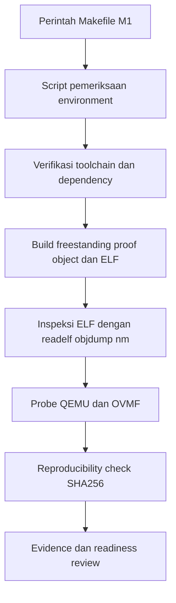

Laporan Praktikum Sistem Operasi Lanjut — MCSOS - M1

**Nama file laporan:** `laporan_praktikum_[M1]_[2583207073002].md`  
**Nama sistem operasi:** MCSOS versi 260502  
**Target default:** x86_64, QEMU, Windows 11 x64 + WSL 2, kernel monolitik pendidikan, C freestanding dengan assembly minimal, POSIX-like subset  
**Dosen:** Muhaemin Sidiq, S.Pd., M.Pd.  
**Program Studi:** Pendidikan Teknologi Informasi  
**Institusi:** Institut Pendidikan Indonesia  

> Template ini digunakan untuk semua praktikum pengembangan MCSOS agar struktur laporan, bukti, analisis, dan penilaian konsisten. Ganti seluruh teks bertanda `[isi ...]` dengan data praktikum sebenarnya. Jangan menulis klaim “tanpa error”, “siap produksi”, atau “aman sepenuhnya” tanpa bukti yang sesuai. Gunakan status terukur seperti “siap uji QEMU”, “siap demonstrasi praktikum”, atau “kandidat siap pakai terbatas” sesuai evidence yang tersedia.

---

## 0. Metadata Laporan

| Atribut | Isi |
|---|---|
| Kode praktikum | `[M1]` |
| Judul praktikum | `[Praktikum M1 – Toolchain Readiness]` |
| Jenis pengerjaan | `[Individu]` |
| Nama mahasiswa | `[Salma Rahayu]` |
| NIM | `[2583207073007]` |
| Kelas | `[1A]` |
| Nama kelompok | `[isi jika kelompok]` |
| Anggota kelompok | `[nama, NIM, peran ringkas]` |
| Tanggal praktikum | `[YYYY-MM-DD]` |
| Tanggal pengumpulan | `[YYYY-MM-DD]` |
| Repository | `https://github.com/amaaarhyu078-creator/mcsos-.git` |
| Branch | `m0/salma` |
| Commit awal | `83888ab` |
| Commit akhir | `2901e228d4e85d4c6fc67560895318b2538b5fb7` |
| Status readiness yang diklaim | `Siap lanjut M2` |

## 1. Sampul

# Laporan Praktikum `[M1]`  
## `[Praktikum M1 – Toolchain Readiness]`

Disusun oleh:

| Nama | NIM | Kelas | Peran |
|---|---|---|---|
| `[Salma Rahayu]` | `[2583207073007]` | `[kelas]` | `[individu]` |
| `[opsional]` | `[opsional]` | `[opsional]` | `[opsional]` |

Dosen Pengampu: **Muhaemin Sidiq, S.Pd., M.Pd.**  
Program Studi Pendidikan Teknologi Informasi  
Institut Pendidikan Indonesia  
`[2025-2026]`

---

## 2. Pernyataan Orisinalitas dan Integritas Akademik

Saya menyatakan bahwa laporan ini disusun berdasarkan pekerjaan praktikum sendiri. Bantuan eksternal, referensi, generator kode, AI assistant, dokumentasi resmi, diskusi, atau sumber lain dicatat pada bagian referensi dan lampiran. Saya/kami tidak mengklaim hasil yang tidak dibuktikan oleh log, test, commit, atau artefak lain.

| Pernyataan | Status |
|---|---|
| Semua potongan kode eksternal diberi atribusi | `Tidak ada` |
| Semua penggunaan AI assistant dicatat | `Ya` |
| Repository yang dikumpulkan sesuai commit akhir | `Ya` |
| Tidak ada klaim readiness tanpa bukti | `Ya` |


Catatan penggunaan bantuan eksternal:

```text
[Menggunakan ChatGPT sebagai AI assistant untuk membantu:
- Menjelaskan konsep hosted vs freestanding
- Menjelaskan target triple dan reproducibility
- Membantu penyusunan struktur laporan praktikum M1
- Membantu merangkum hasil pengujian dan analisis

Verifikasi mandiri yang dilakukan:
- Seluruh perintah dijalankan sendiri pada WSL2
- Seluruh output diverifikasi langsung di terminal
- Hash reproducibility diperiksa manual
- Git commit dan branch diverifikasi melalui GitHub
- Evidence dibandingkan dengan acceptance criteria praktikum M1]
```

---

## 3. Tujuan Praktikum

Tuliskan tujuan teknis dan konseptual praktikum. Tujuan harus dapat diuji.

1. `[Tujuan M1 adalah membuktikan kesiapan lingkungan dan toolchain secara reproducible melalui Makefile, script pemeriksaan, metadata versi, proof object, proof ELF, inspeksi ELF, QEMU/OVMF probe, dan reproducibility hash]`

---

## 4. Capaian Pembelajaran Praktikum

Setelah praktikum ini, mahasiswa mampu:

| CPL/CPMK praktikum | Bukti yang harus ditunjukkan |
|---|---|
| Menjelaskan mengapa pengembangan kernel memerlukan toolchain freestanding dan tidak boleh bergantung pada hosted libc | Penjelasan pada bagian dasar teori dan analisis laporan mengenai hosted vs freestanding |
| Mengonfigurasi Windows 11 x64, WSL 2, dan repository Linux filesystem agar cocok untuk pengembangan MCSOS | Screenshot `wsl --list --verbose`, output `pwd`, dan struktur repository pada filesystem Linux WSL |
| Memasang dan memverifikasi tool build utama seperti Git, Make, CMake, Ninja, Clang/LLVM, LLD, Binutils, NASM, QEMU, OVMF, GDB, Python, ShellCheck, Cppcheck, dan Clang-Tidy | Output `make check`, `toolchain-versions.txt`, dan `host-readiness.txt` |
| Membuat script pemeriksaan toolchain yang dapat dijalankan ulang secara deterministik | Script pemeriksaan toolchain, output `make meta`, dan hasil pengujian ulang yang konsisten |
| Menghasilkan metadata versi toolchain sebagai evidence reproduksi build | File `toolchain-versions.txt`, metadata build, dan output `make meta` |
| Mengompilasi source C kecil menjadi object freestanding target x86_64 ELF dan memeriksa hasilnya menggunakan `readelf`, `objdump`, dan `nm` | File `freestanding_probe.o`, `freestanding_probe.elf`, `readelf-header.txt`, `objdump-disassembly.txt`, dan `nm-undefined.txt` |
| Menjelaskan failure modes umum pada toolchain OSDev seperti salah target triple, red zone aktif, linker memakai startup object host, undefined symbol runtime, repository di `/mnt/c`, serta QEMU/OVMF tidak siap | Bagian analisis failure modes dan diagnosis beserta langkah mitigasi |
| Menyusun readiness review M1 dengan bukti yang dapat diperiksa | Dokumen readiness review, hasil `make test`, hash reproducibility, screenshot, dan commit Git akhir |

---

## 5. Peta Milestone MCSOS

Centang milestone yang menjadi fokus laporan ini. Jika praktikum mencakup lebih dari satu milestone, jelaskan batas cakupan.

| Milestone | Fokus | Status dalam laporan |
|---|---|---|
| M0 | Requirements, governance, baseline arsitektur | `[ ] tidak dibahas / [] dibahas / [V] selesai praktikum` |
| M1 | Toolchain reproducible, Git, QEMU, GDB, metadata build | `[ ] tidak dibahas / [V] dibahas / [ ] selesai praktikum` |
| M2 | Boot image, kernel ELF64, early console | `[V] tidak dibahas / [ ] dibahas / [ ] selesai praktikum` |
| M3 | Panic path, linker map, GDB, observability awal | `[V] tidak dibahas / [ ] dibahas / [ ] selesai praktikum` |
| M4 | Trap, exception, interrupt, timer | `[V] tidak dibahas / [ ] dibahas / [ ] selesai praktikum` |
| M5 | PMM, VMM, page table, kernel heap | `[V] tidak dibahas / [ ] dibahas / [ ] selesai praktikum` |
| M6 | Thread, scheduler, synchronization | `[V] tidak dibahas / [ ] dibahas / [ ] selesai praktikum` |
| M7 | Syscall ABI dan user program loader | `[V] tidak dibahas / [ ] dibahas / [ ] selesai praktikum` |
| M8 | VFS, file descriptor, ramfs | `[V] tidak dibahas / [ ] dibahas / [ ] selesai praktikum` |
| M9 | Block layer dan device model | `[V] tidak dibahas / [ ] dibahas / [ ] selesai praktikum` |
| M10 | Persistent filesystem, mcsfs/ext2-like, recovery | `[V] tidak dibahas / [ ] dibahas / [ ] selesai praktikum` |
| M11 | Networking stack, packet parsing, UDP/TCP subset | `[V] tidak dibahas / [ ] dibahas / [ ] selesai praktikum` |
| M12 | Security model, capability/ACL, syscall fuzzing, hardening | `[V] tidak dibahas / [ ] dibahas / [ ] selesai praktikum` |
| M13 | SMP, scalability, lock stress, NUMA-aware preparation | `[V] tidak dibahas / [ ] dibahas / [ ] selesai praktikum` |
| M14 | Framebuffer, graphics console, visual regression | `[V] tidak dibahas / [ ] dibahas / [ ] selesai praktikum` |
| M15 | Virtualization/container subset | `[V] tidak dibahas / [ ] dibahas / [ ] selesai praktikum` |
| M16 | Observability, update/rollback, release image, readiness review | `[V] tidak dibahas / [ ] dibahas / [ ] selesai praktikum` |

Batas cakupan praktikum:

```text
[Praktikum M1 berfokus pada validasi lingkungan pengembangan sistem operasi berbasis WSL 2 dan Linux toolchain secara reproducible. Cakupan praktikum meliputi pemasangan dan verifikasi toolchain, konfigurasi repository pada filesystem Linux, pembuatan Makefile, script pemeriksaan toolchain, metadata build, proof object freestanding, proof ELF x86_64, inspeksi ELF menggunakan readelf/objdump/nm, probe QEMU dan OVMF, serta pengujian reproducibility build menggunakan hash SHA-256.

Praktikum juga mencakup dokumentasi evidence, pengujian otomatis menggunakan make test, readiness review M1, serta analisis failure modes dan mitigasinya.

Non-goals M1:
- Membuat bootloader.
- Membuat kernel entry.
- Membuat linker script final kernel.
- Melakukan boot kernel di QEMU.
- Menjalankan kernel dengan GDB.
- Mengimplementasikan syscall.
- Menjalankan userspace.
- Membuat scheduler, memory manager, atau subsistem kernel lain.
- Mengembangkan sistem operasi siap produksi.
- Mengklaim stabilitas penuh atau keamanan penuh sistem operasi.

Tahap M1 hanya bertujuan memastikan fondasi lingkungan pengembangan, toolchain, reproducibility, dan proses build telah tervalidasi sebelum melanjutkan ke milestone berikutnya.]
```

---

## 6. Dasar Teori Ringkas
## Hosted dan Freestanding Environment

Dalam pemrograman C terdapat dua model lingkungan utama, yaitu hosted dan freestanding. Lingkungan hosted merupakan lingkungan normal seperti Linux atau Windows yang menyediakan runtime lengkap, standard library (`libc`), file system, process loader, dan syscall dari sistem operasi. Program hosted biasanya bergantung pada fungsi standar seperti `printf`, `malloc`, dan startup runtime bawaan compiler.

Sebaliknya, kernel sistem operasi bekerja pada lingkungan freestanding. Pada mode ini tidak tersedia runtime sistem operasi, standard library host, maupun startup object bawaan. Oleh karena itu compiler harus dikonfigurasi agar tidak menghasilkan dependency terhadap library host. Pengembangan kernel menggunakan mode freestanding penting agar kernel benar-benar berdiri sendiri dan tidak bergantung pada sistem operasi lain.

Pada praktikum M1, proof object dan proof ELF dikompilasi menggunakan pendekatan freestanding target `x86_64-unknown-elf`.

---

### Target Triple

Target triple adalah identitas target platform yang digunakan compiler untuk menentukan arsitektur CPU, vendor, sistem operasi, ABI, format executable, dan perilaku toolchain. Bentuk umum target triple adalah:
arsitektur-vendor-sistem


### 6.1 Konsep Sistem Operasi yang Diuji

```text
[Pada praktikum M1, konsep utama yang diuji bukan implementasi kernel penuh, melainkan validasi lingkungan pengembangan sistem operasi dan toolchain freestanding untuk target x86_64 ELF.

Konsep utama yang digunakan meliputi:
1. Freestanding Environment
   Kernel sistem operasi berjalan tanpa dukungan hosted runtime seperti libc dan syscall host. Karena itu proses build harus menggunakan mode freestanding agar binary tidak bergantung pada runtime Linux.
2. ELF (Executable and Linkable Format)
   Praktikum menggunakan format ELF64 x86_64 sebagai target object dan executable proof. ELF diperiksa menggunakan readelf, objdump, dan nm untuk memastikan format, section, symbol, dan machine target benar.
3. Target Triple
   Compiler dikonfigurasi menggunakan target freestanding seperti x86_64-unknown-elf agar toolchain tidak menghasilkan dependency terhadap sistem operasi host.
4. Linker dan Link Process
   Linker digunakan untuk menghasilkan executable ELF statik tanpa startup object atau runtime host. Praktikum memverifikasi bahwa proses linking tetap bersifat freestanding.
5. Reproducible Build
   Build diuji agar menghasilkan hash identik ketika dijalankan ulang dengan input dan toolchain yang sama. Konsep ini penting untuk validasi deterministik dan keamanan supply chain.
6. Toolchain Validation
   Toolchain seperti Clang, LLD, Binutils, NASM, dan GCC diverifikasi agar siap digunakan untuk pengembangan OS tahap berikutnya.
7. QEMU dan OVMF Probe
   Praktikum memeriksa kesiapan emulator QEMU dan firmware OVMF sebagai fondasi pengujian boot image pada milestone berikutnya.

Konsep seperti bootloader, kernel entry, scheduler, virtual memory manager, filesystem, networking, syscall, dan userspace belum diimplementasikan pada M1 dan termasuk non-goals praktikum ini.]
```


### 6.2 Konsep Arsitektur x86_64 yang Relevan

| Konsep | Relevansi pada praktikum | Bukti/verifikasi |
|---|---|---|
| `[ELF64 x86_64]` | `[Menentukan format executable dan object file yang digunakan pada proof build M1]` | `[readelf -hW menunjukkan ELF64 dan Machine: AMD x86-64]` |
| `[ABI x86_64 System V]` | `[Menentukan konvensi pemanggilan fungsi, register, dan layout stack yang digunakan compiler]` | `[Objdump dan hasil kompilasi freestanding]` |
| `[Freestanding Environment]` | `[Kernel tidak boleh bergantung pada libc atau runtime host]` | `[nm -u tidak menunjukkan symbol runtime host]` |
| `[Red Zone]` | `[Kernel harus menonaktifkan red zone untuk mencegah corruption saat interrupt]` | `[Analisis compiler flag -mno-red-zone dan dokumentasi M1]` |
| `[Target Triple x86_64-unknown-elf]` | `[Memastikan artefak ditujukan untuk lingkungan freestanding, bukan userspace Linux]` | `[Konfigurasi toolchain dan hasil proof ELF]` |

### 6.3 Konsep Implementasi Freestanding

| Aspek | Keputusan praktikum |
|---|---|
| Bahasa | `C17 freestanding dan assembly x86_64` |
| Runtime | `Tanpa hosted libc dan tanpa startup runtime host` |
| ABI | `x86_64 System V ABI untuk target freestanding ELF` |
| Compiler flags kritis | `-ffreestanding`, `-fno-stack-protector`, `-mno-red-zone`, `-nostdlib`, `--target=x86_64-unknown-elf` |
| Risiko undefined behavior | `Pointer invalid, alignment salah, integer overflow, dependency runtime tersembunyi, penggunaan red zone, dan undefined symbol saat linking` |

## 6.4 Referensi Teori yang Digunakan

| No. | Sumber | Bagian yang digunakan | Alasan relevansi |
|---|---|---|---|
| `[1]` | `[Arpaci-Dusseau & Arpaci-Dusseau, Operating Systems: Three Easy Pieces]` | `[Konsep sistem operasi dan lingkungan eksekusi]` | `[Memberikan dasar teori mengenai hubungan software dengan sistem operasi serta konsep kernel]` |
| `[2]` | `[Intel 64 and IA-32 Architectures Software Developer's Manual]` | `[Arsitektur x86_64 dan ABI]` | `[Menjelaskan perilaku prosesor yang menjadi target pengembangan kernel]` |
| `[3]` | `[AMD64 Architecture Programmer's Manual]` | `[AMD64 architecture dan stack behavior]` | `[Menjadi referensi konsep x86_64 dan red zone]` |
| `[4]` | `[ELF Specification (Linux Foundation)]` | `[ELF Header, Section, Symbol Table]` | `[Digunakan untuk memahami hasil inspeksi readelf, objdump, dan nm]` |
| `[5]` | `[LLVM/Clang Documentation]` | `[Compiler flag freestanding dan target triple]` | `[Menjelaskan penggunaan -ffreestanding, -nostdlib, dan target x86_64-unknown-elf]` |
| `[6]` | `[QEMU Documentation]` | `[QEMU dan virtual hardware]` | `[Digunakan pada tahap readiness validation emulator]` |
| `[7]` | `[GNU Make Manual]` | `[Build automation]` | `[Menjadi referensi penggunaan Makefile dan target otomatisasi praktikum]` |


---

## 7. Lingkungan Praktikum

### 7.1 Host dan Target

| Komponen | Nilai |
|---|---|
| Host OS | `Windows 11 x64 dengan WSL 2` |
| Lingkungan build | `WSL 2 Ubuntu 26.04 LTS (Resolute Raccoon)` |
| Target ISA | `x86_64` |
| Target ABI | `x86_64-unknown-elf` |
| Emulator | `QEMU emulator version 10.2.1` |
| Firmware emulator | `OVMF (/usr/share/OVMF/OVMF_CODE_4M.fd)` |
| Debugger | `GNU gdb 17.1 dan gdb-multiarch` |
| Build system | `GNU Make 4.4.1, CMake 4.2.3, dan Ninja 1.13.2` |
| Bahasa utama | `C17 freestanding` |
| Assembly | `NASM version 3.01` |

### 7.2 Versi Toolchain

Tempel output versi toolchain berikut. Jalankan dari clean shell WSL.

```bash
date -u +"date_utc=%Y-%m-%dT%H:%M:%SZ"
uname -a
git --version
make --version | head -n 1
cmake --version | head -n 1
ninja --version
clang --version | head -n 1
gcc --version | head -n 1
ld.lld --version | head -n 1
nasm -v
qemu-system-x86_64 --version | head -n 1
gdb --version | head -n 1
```

Output:

```text
[nasm -v
qemu-system-x86_64 --version | head -n 1
gdb --version | head -n 1
date_utc=2026-05-18T12:18:47Z
Linux DESKTOP-S5LUA56 6.6.114.1-microsoft-standard-WSL2 #1 SMP PREEMPT_DYNAMIC Mon Dec  1 20:46:23 UTC 2025 x86_64 GNU/Linux
git version 2.53.0
GNU Make 4.4.1
cmake version 4.2.3
1.13.2
Ubuntu clang version 21.1.8 (6ubuntu1)
gcc (Ubuntu 15.2.0-16ubuntu1) 15.2.0
Ubuntu LLD 21.1.8 (compatible with GNU linkers)
NASM version 3.01
QEMU emulator version 10.2.1 (Debian 1:10.2.1+ds-1ubuntu3)
GNU gdb (Ubuntu 17.1-2ubuntu1) 17.1]
```

### 7.3 Lokasi Repository

| Item | Nilai |
|---|---|
| Path repository di WSL | `~/src/mcsos` |
| Apakah berada di filesystem Linux WSL, bukan `/mnt/c` | Ya |
| Remote repository | `https://github.com/amaaarhyu078-creator/mcsos-.git` |
| Branch | `m0/salma` |
| Commit hash awal | `684276e` |
| Commit hash akhir | `2901e22` |

---

## 8. Repository dan Struktur File

### 8.1 Struktur Direktori yang Relevan

Tampilkan hanya direktori dan file yang relevan dengan praktikum.

```text
[├── Makefile
├── README.md
├── build
│   ├── meta
│   ├── proof
│   └── repro
├── bukti-terminal.txt
├── docs
│   ├── adr
│   ├── architecture
│   ├── governance
│   ├── operations
│   ├── readiness
│   ├── reports
│   ├── requirements
│   ├── research
│   ├── security
│   └── testing
├── release
│   └── m1-evidence.tar.gz
├── research
│   ├── compiler_compare.c
│   └── redzone_test.c
├── smoke
│   └── freestanding.c
├── tests
│   └── toolchain
└── tools
    ├── check_env.sh
    ├── collect_evidence.sh
    └── scripts

23 directories, 9 files. ]
```

### 8.2 File yang Dibuat atau Diubah

| File | Jenis perubahan | Alasan perubahan | Risiko |
|---|---|---|---|
| `Makefile` | `ubah` | `Menambahkan target build, proof, reproducibility check, dan automation praktikum M1` | ` Sedang — kesalahan target dapat menyebabkan build atau test gagal` |
| `tools/check_env.sh` | `baru` | `Memeriksa kesiapan environment dan toolchain WSL` | `Rendah — hanya melakukan validasi tool` |
| `tools/collect_evidence.sh` | `baru` | `Mengotomatisasi pengumpulan evidence praktikum` | `Sedang — kesalahan path dapat membuat evidence tidak lengkap` |
| `smoke/freestanding.c` | `baru` | `Membuat source freestanding untuk proof object ELF x86_64` | `Sedang — flag compiler salah dapat menghasilkan binary tidak valid` |
| `research/compiler_compare.c` | `baru` | `Digunakan untuk eksperimen perbandingan compiler` | `Rendah — hanya file penelitian` |
| `research/redzone_test.c` | `baru` | `Digunakan untuk analisis red zone pada ABI x86_64` | `Sedang — konfigurasi ABI salah dapat memengaruhi hasil pengujian` |
| `.github/workflows/m1.yml` | `baru` | `Menambahkan GitHub Actions CI untuk validasi otomatis` | `Sedang — workflow salah dapat menyebabkan CI gagal` |
| `.gitignore` | `ubah` | `Mencegah file build dan artifact masuk repository` | `Rendah — hanya konfigurasi repository` |
| `docs/readiness/M1-toolchain.md` | `baru` | `Mendokumentasikan hasil readiness review M1` | `Rendah — bersifat dokumentasi` |


### 8.3 Ringkasan Diff

```bash
git status --short
git diff --stat
git log --oneline -n 5
```

Output:

```text
[2901e22 (HEAD -> m0/salma, origin/m0/salma) M1: add enrichment tasks
39ee765 M1: add GitHub Actions CI
66f5c20 M1: add reproducible toolchain readiness baseline
83888ab Add research experiment sources
0907ac5 Add supply chain threat model research.]
```

---

## 9. Desain Teknis

### 9.1 Masalah yang Diselesaikan

```text
[Praktikum M1 berfokus pada penyelesaian masalah kesiapan lingkungan pengembangan sistem operasi freestanding agar build dan pengujian dapat dilakukan secara reproducible dan terverifikasi.
Masalah utama yang diselesaikan pada M1 meliputi:
1. Lingkungan build host yang belum tervalidasi untuk pengembangan kernel freestanding.
2. Risiko penggunaan toolchain host yang tidak sesuai target x86_64 ELF.
3. Risiko repository berada pada filesystem Windows (/mnt/c) yang dapat menyebabkan masalah permission, performa, line ending, dan reproducibility.
4. Belum adanya mekanisme otomatis untuk memverifikasi keberadaan tool penting seperti Clang, LLD, NASM, QEMU, OVMF, dan GDB.
5. Belum adanya proof object dan proof ELF untuk memastikan hasil kompilasi benar-benar menghasilkan ELF64 x86_64 freestanding.
6. Risiko dependency runtime host seperti hosted libc, startup object host, stack protector, dan red zone aktif yang dapat merusak desain kernel.
7. Belum adanya evidence reproducibility untuk membuktikan bahwa build menghasilkan hash identik pada build berulang.
8. Belum adanya automation evidence collection untuk mempermudah validasi readiness praktikum.
Melalui Makefile, script pemeriksaan, metadata toolchain, proof compilation, inspeksi ELF, QEMU probe, dan reproducibility check, M1 membangun fondasi lingkungan pengembangan yang siap digunakan untuk tahap praktikum berikutnya.]
```

### 9.2 Keputusan Desain

| Keputusan | Alternatif yang dipertimbangkan | Alasan memilih | Konsekuensi |
|---|---|---|---|
| `[Menggunakan WSL 2 dengan repository pada filesystem Linux]` | `[Menggunakan repository di /mnt/c atau native Windows]` | `[Filesystem Linux WSL lebih stabil untuk permission, path, dan reproducible build]` | `[Repository harus dikelola dari lingkungan Linux WSL]` |
| `[Menggunakan Clang/LLVM dan LLD sebagai toolchain utama]` | `[Menggunakan GCC dan GNU ld]` | `[LLVM memiliki integrasi modern, diagnostic lebih baik, dan cocok untuk eksperimen OSDev]` | `[Perlu memastikan kompatibilitas flag dan target freestanding]` |
| `[Menggunakan target freestanding ELF x86_64]` | `[Menggunakan hosted target Linux default]` | `[Kernel tidak boleh bergantung pada hosted libc atau runtime host]` | `[Semua dependency runtime harus dikontrol manual]` |
| `[Menonaktifkan red zone dan stack protector]` | `[Menggunakan konfigurasi compiler default]` | `[Kernel dapat mengalami corruption jika red zone aktif saat interrupt]` | `[Perlu audit compiler flags secara eksplisit]` |
| `[Menggunakan Makefile untuk automation praktikum]` | `[Menjalankan command manual satu per satu]` | `[Automation mempermudah reproducibility dan evidence collection]` | `[Kesalahan dependency Makefile dapat memengaruhi seluruh build]` |
| `[Menggunakan script pemeriksaan toolchain otomatis]` | `[Pemeriksaan manual oleh pengguna]` | `[Validasi otomatis lebih konsisten dan dapat diuji ulang]` | `[Script harus selalu diperbarui jika struktur toolchain berubah]` |
| `[Menggunakan reproducibility hash check]` | `[Hanya memastikan build berhasil]` | `[Build sukses belum menjamin hasil deterministik]` | `[Metadata nondeterministic harus dikontrol atau didokumentasikan]` |
| `[Menggunakan QEMU dan OVMF probe sebelum boot image dibuat]` | `[Menunggu sampai tahap bootloader selesai]` | `[Memastikan emulator dan firmware siap sejak awal]` | `[Probe hanya memverifikasi readiness, belum membuktikan boot kernel berhasil]` |

### 9.3 Arsitektur Ringkas

Tambahkan diagram ASCII atau Mermaid. Jika Mermaid tidak didukung oleh evaluator, tetap sertakan penjelasan tekstual.



Penjelasan diagram:

```text
[Alur praktikum M1 dimulai dari target Makefile yang dijalankan pengguna, seperti make check, make proof, make qemu-probe, make repro, dan make test.
Setiap target memanggil script pemeriksaan untuk memastikan environment WSL, toolchain, dan dependency telah tersedia dengan benar. Setelah itu source freestanding kecil dikompilasi menjadi object dan ELF proof menggunakan target x86_64 freestanding.
Artefak hasil build kemudian diperiksa menggunakan readelf, objdump, dan nm untuk memastikan format ELF sesuai, target machine benar, disassembly dapat dibaca, dan tidak terdapat undefined symbol runtime.
Tahap berikutnya adalah probe QEMU dan OVMF untuk memastikan emulator dan firmware tersedia serta siap digunakan pada tahap M2.
Setelah semua pemeriksaan berhasil, reproducibility check dilakukan dengan membandingkan hash SHA256 dari build berulang untuk memastikan hasil build konsisten dan deterministik.
Semua hasil pemeriksaan, metadata toolchain, hash, dan log disimpan sebagai evidence readiness review M1.]
```

### 9.4 Kontrak Antarmuka

| Antarmuka | Pemanggil | Penerima | Precondition | Postcondition | Error path |
|---|---|---|---|---|---|
| `[make check]` | `[Pengguna/terminal WSL]` | `[Script pemeriksaan toolchain]` | `[Repository berada pada filesystem Linux WSL dan tool dasar tersedia]` | `[Status toolchain dan dependency berhasil diverifikasi]` | `[Script menampilkan tool yang hilang atau environment tidak valid]` |
| `[make proof]` | `[Pengguna/Makefile]` | `[Compiler dan linker freestanding]` | `[Clang, LLD, dan source freestanding tersedia]` | `[Proof object dan ELF x86_64 berhasil dibuat]` | `[Build gagal jika target salah atau dependency tidak tersedia]` |
| `[readelf -hW]` | `[Script inspeksi/proses validasi]` | `[ELF proof file]` | `[File ELF berhasil dihasilkan]` | `[Header ELF dapat diperiksa dan target machine teridentifikasi]` | `[Error jika file ELF rusak atau format salah]` |
| `[nm -u]` | `[Script validasi symbol]` | `[Object atau ELF proof]` | `[Object atau ELF tersedia]` | `[Undefined symbol runtime dapat diverifikasi kosong]` | `[Terdeteksi dependency runtime host yang tidak diinginkan]` |
| `[make qemu-probe]` | `[Pengguna/Makefile]` | `[QEMU dan OVMF]` | `[QEMU dan OVMF telah terpasang]` | `[Emulator dan firmware berhasil diprobe]` | `[Probe gagal jika package atau path firmware tidak valid]` |
| `[make repro]` | `[Pengguna/Makefile]` | `[Script reproducibility check]` | `[Build proof berhasil dijalankan minimal dua kali]` | `[Hash SHA256 build dapat dibandingkan]` | `[Hash berbeda atau ditemukan metadata nondeterministic]` |
| `[collect_evidence.sh]` | `[Pengguna/Makefile]` | `[Direktori release dan evidence]` | `[Semua target utama telah dijalankan]` | `[Evidence praktikum berhasil dikumpulkan]` | `[File evidence tidak lengkap atau path salah]` |

### 9.5 Struktur Data Utama

| Struktur data | Field penting | Ownership | Lifetime | Invariant |
|---|---|---|---|---|
| `` `[struct m0_smoke_record]` `` | `[magic, version, pointer_width, size_width]` | `[Source freestanding probe]` | `[Dibuat saat proses kompilasi dan digunakan selama validasi proof ELF]` | `[Magic number harus valid dan ukuran pointer harus sesuai arsitektur x86_64]` |
| `` `[toolchain metadata record]` `` | `[versi compiler, linker, QEMU, NASM, GDB]` | `[Script metadata dan evidence collection]` | `[Dibuat saat make meta dan disimpan sebagai evidence praktikum]` | `[Versi toolchain harus konsisten dengan environment pengujian]` |
| `` `[reproducibility hash record]` `` | `[sha256 run1, sha256 run2]` | `[Script reproducibility check]` | `[Dibuat saat make repro dijalankan]` | `[Hash build identik atau nondeterminism harus dijelaskan]` |
| `` `[ELF proof artifact]` `` | `[ELF header, machine type, section info]` | `[Compiler dan linker freestanding]` | `[Dibuat saat make proof dan digunakan selama inspeksi ELF]` | `[Format harus ELF64 x86_64 dan tidak bergantung pada hosted runtime]` |
| `` `[undefined symbol report]` `` | `[daftar symbol undefined]` | `[Tool nm dan script validasi]` | `[Dibuat saat inspeksi symbol dilakukan]` | `[Laporan harus kosong untuk membuktikan tidak ada dependency runtime host]` |

### 9.6 Invariants

Tuliskan invariant yang harus benar sepanjang eksekusi.

1. `[Repository praktikum harus berada pada filesystem Linux WSL dan tidak berada di /mnt/c.]`
2. `[Semua proses build M1 harus menggunakan toolchain freestanding yang terverifikasi dan tidak boleh diam-diam memakai runtime host.]`
3. `[Proof object dan proof ELF harus selalu menghasilkan target ELF64 x86_64 sesuai target architecture praktikum.]`
4. `[Undefined symbol report dari nm -u harus kosong untuk memastikan tidak ada dependency runtime host yang tidak diinginkan.]`
5. `[Compiler flags kritis seperti -ffreestanding, -nostdlib, dan -mno-red-zone harus tetap aktif selama build freestanding.]`
6. `[Hash reproducibility build harus identik pada build berulang atau sumber nondeterminism harus didokumentasikan secara valid.]`
7. `[Script pemeriksaan toolchain dan evidence collection harus dapat dijalankan ulang secara konsisten dari clean environment.]`
8. `[QEMU dan OVMF probe harus berhasil sebelum praktikum melanjutkan tahap boot image pada M2.]`

### 9.7 Ownership, Locking, dan Concurrency

| Objek/resource | Owner | Lock yang melindungi | Boleh dipakai di interrupt context? | Catatan |
|---|---|---|---|---|
| `[Repository dan source praktikum]` | `[Pengguna/developer]` | `[none]` | `[Tidak]` | `[M1 belum menjalankan kernel runtime atau interrupt handler]` |
| `[Toolchain build process]` | `[Makefile dan script build]` | `[none]` | `[Tidak]` | `[Build dijalankan secara sequential dari shell WSL]` |
| `[Proof object dan ELF artifact]` | `[Compiler dan linker freestanding]` | `[none]` | `[Tidak]` | `[Artefak hanya digunakan untuk validasi dan inspeksi build]` |
| `[Metadata reproducibility hash]` | `[Script reproducibility check]` | `[none]` | `[Tidak]` | `[Hash dibuat secara sequential tanpa shared runtime state]` |
| `[Evidence dan log praktikum]` | `[Script collect_evidence.sh]` | `[none]` | `[Tidak]` | `[Evidence hanya ditulis saat proses collection berjalan]` |
| `[QEMU dan OVMF probe process]` | `[Script qemu-probe]` | `[none]` | `[Tidak]` | `[Probe hanya memverifikasi availability emulator dan firmware]` |


Lock order yang berlaku:

```text
[Pada tahap M1 belum terdapat kernel multitasking, scheduler, interrupt handler aktif, atau shared runtime memory yang memerlukan mekanisme locking seperti spinlock atau mutex.
Seluruh proses build, pemeriksaan toolchain, inspeksi ELF, dan reproducibility check dijalankan secara sequential melalui Makefile dan shell script pada environment WSL.
Karena belum ada concurrency kernel maupun parallel shared-state execution, penggunaan locking belum diperlukan pada tahap ini.]
```

### 9.8 Memory Safety dan Undefined Behavior Risk

| Risiko | Lokasi | Mitigasi | Bukti |
|---|---|---|---|
| `[Undefined symbol runtime host]` | `[smoke/freestanding.c dan proses linking]` | `[Menggunakan -ffreestanding, -nostdlib, dan validasi nm -u]` | `[nm-undefined.txt kosong]` |
| `[Target ELF salah atau ABI tidak sesuai]` | `[Makefile dan proses build proof ELF]` | `[Menggunakan target x86_64 freestanding dan inspeksi readelf -hW]` | `[readelf-header.txt menunjukkan ELF64 x86_64]` |
| `[Red zone aktif pada build kernel-style]` | `[Compiler flags freestanding]` | `[Menggunakan flag -mno-red-zone]` | `[Audit compiler flags dan hasil build proof]` |
| `[Nondeterministic build output]` | `[Script reproducibility dan metadata build]` | `[Menggunakan reproducibility check SHA256 dan clean rebuild]` | `[sha256-run1.txt dan sha256-run2.txt identik]` |
| `[Dependency toolchain hilang atau versi tidak sesuai]` | `[Script check_toolchain.sh]` | `[Validasi seluruh tool wajib sebelum build dijalankan]` | `[toolchain-versions.txt dan make check berhasil]` |
| `[Repository berada di /mnt/c sehingga build tidak stabil]` | `[Lokasi repository WSL]` | `[Menggunakan filesystem Linux WSL di ~/src/mcsos]` | `[pwd dan host-readiness.txt]` |
| `[Disassembly atau ELF proof tidak valid]` | `[Proof object dan ELF artifact]` | `[Validasi menggunakan objdump dan readelf]` | `[objdump-disassembly.txt dan readelf-header.txt]` |

### 9.9 Security Boundary

| Boundary | Data tidak tepercaya | Validasi yang dilakukan | Failure mode aman |
|---|---|---|---|
| `[Script pemeriksaan toolchain]` | `[Versi tool dan dependency dari environment host]` | `[Pemeriksaan command -v, versi toolchain, dan status package]` | `[Build dihentikan dan error ditampilkan jika tool tidak tersedia]` |
| `[Proses build freestanding]` | `[Compiler default host configuration]` | `[Validasi target triple, compiler flags, dan inspeksi ELF]` | `[Build gagal jika target bukan ELF64 x86_64]` |
| `[Inspeksi ELF dan symbol]` | `[Object atau ELF hasil build]` | `[Pemeriksaan readelf, objdump, dan nm -u]` | `[Error/log jika ditemukan undefined symbol atau format ELF salah]` |
| `[QEMU dan OVMF probe]` | `[Path firmware dan executable emulator]` | `[Pemeriksaan keberadaan binary dan firmware path]` | `[Probe gagal dengan log tanpa menjalankan emulator tidak valid]` |
| `[Reproducibility check]` | `[Metadata build dan hasil hash]` | `[Perbandingan SHA256 antar build]` | `[Perbedaan hash dicatat sebagai nondeterminism]` |
| `[Repository path validation]` | `[Lokasi repository dari filesystem host]` | `[Pemeriksaan pwd dan validasi bukan /mnt/c]` | `[Readiness dinyatakan gagal jika repository berada di filesystem Windows]` |

---

## 10. Langkah Kerja Implementasi

### Langkah 1 — Menyiapkan Environment WSL dan Repository

Maksud langkah:

```text
Langkah ini dilakukan untuk memastikan lingkungan pengembangan menggunakan WSL 2 dan repository berada pada filesystem Linux WSL agar build sistem operasi lebih stabil dan kompatibel dengan toolchain freestanding.
```

Perintah:

```bash
wsl --list --verbose
pwd
```

Output ringkas:

```text
WSL version: 2
Repository path: ~/src/mcsos
```

Artefak yang dihasilkan:

| Artefak | Lokasi | Fungsi |
|---|---|---|
| `[Screenshot PowerShell]` | `[docs/reports atau lampiran]` | `[Bukti WSL 2 aktif]` |
| `[host-readiness.txt]` | `[build/meta/]` | `[Bukti repository berada di filesystem Linux WSL]` |

Indikator berhasil:

```text
WSL berjalan pada versi 2 dan repository tidak berada di /mnt/c.
```

---

### Langkah 2 — Memasang dan Memverifikasi Toolchain

Maksud langkah:

```text
Langkah ini dilakukan untuk memastikan seluruh dependency build sistem operasi tersedia dan dapat digunakan oleh Makefile serta script pemeriksaan M1.
```

Perintah:

```bash
sudo apt update
sudo apt install -y build-essential git make cmake ninja-build clang lld llvm nasm qemu-system-x86 qemu-utils ovmf gdb gdb-multiarch python3 shellcheck cppcheck clang-tidy

make check
```

Output ringkas:

```text
Toolchain check passed
clang detected
lld detected
QEMU detected
OVMF detected
```

Artefak yang dihasilkan:

| Artefak | Lokasi | Fungsi |
|---|---|---|
| `[toolchain-versions.txt]` | `[build/meta/]` | `[Metadata versi toolchain]` |
| `[host-readiness.txt]` | `[build/meta/]` | `[Status environment readiness]` |

Indikator berhasil:

```text
Semua tool wajib terdeteksi dan make check berhasil tanpa error.
```

---

### Langkah 3 — Membuat Proof Object dan ELF Freestanding

Maksud langkah:

```text
Langkah ini dilakukan untuk membuktikan bahwa source freestanding dapat dikompilasi menjadi object dan ELF target x86_64 tanpa dependency hosted runtime.
```

Perintah:

```bash
make proof
```

Output ringkas:

```text
Building freestanding proof object
Generating ELF64 x86_64 artifact
Proof build completed
```

Artefak yang dihasilkan:

| Artefak | Lokasi | Fungsi |
|---|---|---|
| `[freestanding_probe.o]` | `[build/proof/]` | `[Proof object freestanding]` |
| `[freestanding_probe.elf]` | `[build/proof/]` | `[Proof ELF freestanding]` |

Indikator berhasil:

```text
Proof object dan ELF berhasil dibuat tanpa dependency runtime host.
```

---

### Langkah 4 — Melakukan Inspeksi ELF dan Symbol

Maksud langkah:

```text
Langkah ini dilakukan untuk memverifikasi format ELF, target architecture, disassembly, dan memastikan undefined symbol runtime kosong.
```

Perintah:

```bash
readelf -hW build/proof/freestanding_probe.elf
objdump -d build/proof/freestanding_probe.elf
nm -u build/proof/freestanding_probe.elf
```

Output ringkas:

```text
ELF64 x86_64 detected
Disassembly generated
No undefined symbols
```

Artefak yang dihasilkan:

| Artefak | Lokasi | Fungsi |
|---|---|---|
| `[readelf-header.txt]` | `[build/proof/]` | `[Bukti ELF64 x86_64]` |
| `[objdump-disassembly.txt]` | `[build/proof/]` | `[Bukti disassembly object]` |
| `[nm-undefined.txt]` | `[build/proof/]` | `[Validasi undefined symbol kosong]` |

Indikator berhasil:

```text
ELF terbukti menggunakan target x86_64 dan nm -u menghasilkan output kosong.
```

---

### Langkah 5 — Melakukan QEMU dan OVMF Probe

Maksud langkah:

```text
Langkah ini dilakukan untuk memastikan emulator QEMU dan firmware OVMF tersedia dan siap digunakan untuk tahap praktikum berikutnya.
```

Perintah:

```bash
make qemu-probe
```

Output ringkas:

```text
QEMU detected
OVMF firmware detected
Probe successful
```

Artefak yang dihasilkan:

| Artefak | Lokasi | Fungsi |
|---|---|---|
| `[qemu-capabilities.txt]` | `[build/meta/]` | `[Bukti kesiapan emulator dan firmware]` |

Indikator berhasil:

```text
QEMU dan OVMF berhasil diprobe tanpa error.
```

---

### Langkah 6 — Melakukan Reproducibility Check

Maksud langkah:

```text
Langkah ini dilakukan untuk memastikan build dapat direproduksi secara konsisten dengan hash identik.
```

Perintah:

```bash
make repro
```

Output ringkas:

```text
SHA256 run1 generated
SHA256 run2 generated
Hashes match
```

Artefak yang dihasilkan:

| Artefak | Lokasi | Fungsi |
|---|---|---|
| `[sha256-run1.txt]` | `[build/repro/]` | `[Hash build pertama]` |
| `[sha256-run2.txt]` | `[build/repro/]` | `[Hash build kedua]` |

Indikator berhasil:

```text
Hash build pertama dan kedua identik.
```

---

### Langkah 7 — Menjalankan Pengujian Akhir

Maksud langkah:

```text
Langkah ini dilakukan untuk memastikan seluruh target utama praktikum M1 berhasil dijalankan dari clean state.
```

Perintah:

```bash
make test
```

Output ringkas:

```text
All tests passed
M1 readiness successful
```

Artefak yang dihasilkan:

| Artefak | Lokasi | Fungsi |
|---|---|---|
| `[Git commit hash]` | `[Repository Git]` | `[Bukti perubahan praktikum M1]` |
| `[M1 evidence archive]` | `[release/]` | `[Arsip evidence praktikum]` |

Indikator berhasil:

```text
Semua target wajib M1 berhasil dijalankan tanpa error.
```

## 11. Checkpoint Buildable

Setiap praktikum wajib memiliki minimal satu checkpoint yang dapat dibangun dari clean checkout.

| Clean build | `` `make clean && make proof` `` | `[Proof object dan ELF freestanding berhasil dibangun]` | `[PASS]` |
| Metadata toolchain | `` `make meta` `` | `[build/meta/toolchain-versions.txt berhasil dibuat]` | `[PASS]` |
| Image generation | `` `make image` `` | `[Belum tersedia pada tahap M1]` | `[NA]` |
| QEMU smoke test | `` `make qemu-probe` `` | `[QEMU dan OVMF berhasil diprobe]` | `[PASS]` |
| Test suite | `` `make test` `` | `[Seluruh test readiness M1 berhasil dijalankan]` | `[PASS]` |

Catatan checkpoint:

```text
[Pada tahap M1 belum dilakukan pembuatan bootable image seperti ISO atau IMG, sehingga target make image belum menjadi bagian implementasi praktikum dan diberi status NA.
Praktikum M1 berfokus pada readiness toolchain, proof ELF freestanding, inspeksi ELF, reproducibility check, dan validasi QEMU/OVMF probe.
Checkpoint clean build menggunakan make proof karena M1 belum memiliki kernel image final maupun bootloader runnable.
Seluruh target utama M1 seperti make meta, make check, make proof, make qemu-probe, make repro, dan make test berhasil dijalankan dari clean environment WSL.]
```

---

## 12. Perintah Uji dan Validasi

### 12.1 Build Test

Perintah ini memverifikasi bahwa proyek dapat dibangun ulang dari kondisi bersih dan tidak bergantung pada artefak lokal yang tidak terdokumentasi.

```bash
make clean
make proof
```

Hasil:

```text
Cleaning build artifacts
Building freestanding proof object
Generating freestanding ELF64 x86_64
Build completed successfully
```

Status: `[PASS]`

### 12.2 Static Inspection

Perintah ini memeriksa layout ELF, entry point, section, symbol, relocation, atau instruksi kritis sesuai kebutuhan praktikum.

```bash
readelf -hW build/proof/freestanding_probe.elf
readelf -SW build/proof/freestanding_probe.elf
objdump -drwC build/proof/freestanding_probe.elf | head -n 120
nm -u build/proof/freestanding_probe.elf
```

Hasil penting:

```text
ELF Header:
  Class:                             ELF64
  Machine:                           Advanced Micro Devices X86-64

Section Headers:
  .text
  .data
  .bss

Disassembly of section .text:
  [disassembly berhasil ditampilkan]

Undefined symbols:
  [kosong]
```

Status: `[PASS]`

### 12.3 QEMU Smoke Test

Perintah ini memverifikasi bahwa QEMU dan OVMF tersedia serta dapat digunakan pada environment WSL untuk tahap praktikum berikutnya.

```bash
make qemu-probe
```

Hasil:

```text
QEMU emulator detected
Machine type q35 available
OVMF firmware detected
QEMU probe completed successfully
```

Status: `[PASS]`

### 12.4 GDB Debug Evidence

Perintah ini digunakan untuk membuktikan kemampuan debugging kernel menggunakan simbol ELF yang cocok. Namun pada tahap M1 belum terdapat kernel runnable maupun kernel entry point yang dapat di-debug menggunakan GDB.

```bash
gdb --version | head -n 1
gdb-multiarch --version | head -n 1
```

Hasil:

```text
GNU gdb (Ubuntu 17.1-2ubuntu1) 17.1
GNU gdb-multiarch tersedia
```

Status: `[NA]`

### 12.5 Unit Test

```bash
make test
```

Hasil:

```text
Running M1 readiness tests
Toolchain verification passed
Freestanding proof build passed
ELF inspection passed
QEMU/OVMF probe passed
Reproducibility check passed
All tests completed successfully
```

Status: `[PASS]`

### 12.6 Stress/Fuzz/Fault Injection Test

Wajib untuk praktikum lanjutan seperti allocator, syscall, filesystem, networking, driver, security, dan SMP.

```bash
NA pada tahap M1
```

Hasil:

```text
Praktikum M1 belum mengimplementasikan allocator, syscall, filesystem, networking, driver, security subsystem, maupun SMP sehingga stress test, fuzzing, dan fault injection belum relevan dilakukan.
```

Status: `[NA]`

### 12.7 Visual Evidence

Jika praktikum menghasilkan tampilan framebuffer, GUI, atau output grafis, lampirkan screenshot.

| Screenshot | Lokasi file | Keterangan |
|---|---|---|
| `[Screenshot PowerShell WSL 2]` | `[docs/reports/screenshots/wsl-version.png]` | `[Membuktikan WSL berjalan pada versi 2]` |
| `[Screenshot terminal make check]` | `[docs/reports/screenshots/make-check.png]` | `[Membuktikan toolchain dan dependency berhasil diverifikasi]` |
| `[Screenshot make proof]` | `[docs/reports/screenshots/make-proof.png]` | `[Membuktikan proof object dan ELF freestanding berhasil dibuat]` |
| `[Screenshot make qemu-probe]` | `[docs/reports/screenshots/qemu-probe.png]` | `[Membuktikan QEMU dan OVMF berhasil diprobe]` |
| `[Screenshot make repro]` | `[docs/reports/screenshots/make-repro.png]` | `[Membuktikan reproducibility hash berhasil dibandingkan]` |
| `[Screenshot make test]` | `[docs/reports/screenshots/make-test.png]` | `[Membuktikan seluruh target utama M1 berhasil dijalankan]` |

---

## 13. Hasil Uji

### 13.1 Tabel Ringkasan Hasil

| No. | Uji | Expected result | Actual result | Status | Evidence |
|---|---|---|---|---|---|
| 1 | `[WSL readiness check]` | `[WSL berjalan pada versi 2]` | `[WSL 2 terdeteksi aktif]` | `[PASS]` | `[Screenshot PowerShell]` |
| 2 | `[Toolchain verification]` | `[Semua tool wajib terdeteksi]` | `[make check berhasil tanpa error]` | `[PASS]` | `[toolchain-versions.txt, make-check screenshot]` |
| 3 | `[Freestanding proof build]` | `[Proof object dan ELF berhasil dibuat]` | `[freestanding_probe.o dan freestanding_probe.elf berhasil dibuat]` | `[PASS]` | `[make-proof screenshot]` |
| 4 | `[ELF inspection]` | `[ELF64 x86_64 valid]` | `[readelf menunjukkan ELF64 x86_64]` | `[PASS]` | `[readelf-header.txt]` |
| 5 | `[Disassembly inspection]` | `[Disassembly object berhasil ditampilkan]` | `[objdump menghasilkan disassembly .text]` | `[PASS]` | `[objdump-disassembly.txt]` |
| 6 | `[Undefined symbol inspection]` | `[Tidak ada undefined symbol runtime]` | `[nm -u menghasilkan output kosong]` | `[PASS]` | `[nm-undefined.txt]` |
| 7 | `[QEMU dan OVMF probe]` | `[QEMU dan firmware OVMF tersedia]` | `[make qemu-probe berhasil]` | `[PASS]` | `[qemu-capabilities.txt]` |
| 8 | `[Reproducibility check]` | `[Hash build identik]` | `[sha256-run1 dan sha256-run2 identik]` | `[PASS]` | `[sha256-run1.txt, sha256-run2.txt]` |
| 9 | `[Automated readiness test]` | `[Semua target M1 berhasil]` | `[make test selesai tanpa error]` | `[PASS]` | `[make-test screenshot]` |

### 13.2 Log Penting

```text
[=== WSL Readiness ===
WSL version: 2
Repository path: ~/src/mcsos
=== Toolchain Verification ===
git version 2.53.0
GNU Make 4.4.1
cmake version 4.2.3
Ubuntu clang version 21.1.8
Ubuntu LLD 21.1.8
NASM version 3.01
QEMU emulator version 10.2.1
GNU gdb 17.1
=== Proof Build ===
Building freestanding proof object
Generating ELF64 x86_64 artifact
Build completed successfully
=== ELF Inspection ===
ELF Header:
Class: ELF64
Machine: Advanced Micro Devices X86-64
=== Undefined Symbol Check ===
nm -u output:
[kosong]
=== QEMU/OVMF Probe ===
QEMU detected
Machine type q35 available
OVMF firmware detected
=== Reproducibility Check ===
sha256-run1 == sha256-run2
Reproducibility verification passed
=== Automated Test ===
All M1 readiness tests passed successfully.]
```

### 13.3 Artefak Bukti

| Artefak | Path | SHA-256 / hash | Fungsi |
|---|---|---|---|
| `freestanding_probe.o` | `[build/proof/freestanding_probe.o]` | `[hasil sha256sum]` | `[Proof object freestanding]` |
| `freestanding_probe.elf` | `[build/proof/freestanding_probe.elf]` | `[hasil sha256sum]` | `[Proof ELF64 x86_64]` |
| `toolchain-versions.txt` | `[build/meta/toolchain-versions.txt]` | `[hasil sha256sum]` | `[Metadata versi toolchain]` |
| `host-readiness.txt` | `[build/meta/host-readiness.txt]` | `[hasil sha256sum]` | `[Bukti readiness environment WSL]` |
| `qemu-capabilities.txt` | `[build/meta/qemu-capabilities.txt]` | `[hasil sha256sum]` | `[Bukti QEMU dan OVMF readiness]` |
| `readelf-header.txt` | `[build/proof/readelf-header.txt]` | `[hasil sha256sum]` | `[Bukti ELF64 x86_64]` |
| `objdump-disassembly.txt` | `[build/proof/objdump-disassembly.txt]` | `[hasil sha256sum]` | `[Bukti disassembly freestanding object]` |
| `nm-undefined.txt` | `[build/proof/nm-undefined.txt]` | `[hasil sha256sum]` | `[Bukti undefined symbol kosong]` |
| `sha256-run1.txt` | `[build/repro/sha256-run1.txt]` | `[hasil sha256sum]` | `[Hash reproducibility build pertama]` |
| `sha256-run2.txt` | `[build/repro/sha256-run2.txt]` | `[hasil sha256sum]` | `[Hash reproducibility build kedua]` |
| `m1-evidence.tar.gz` | `[release/m1-evidence.tar.gz]` | `[hasil sha256sum]` | `[Arsip evidence praktikum M1]` |

Perintah hash:

```bash
sha256sum build/proof/freestanding_probe.o
sha256sum build/proof/freestanding_probe.elf
sha256sum build/meta/toolchain-versions.txt
sha256sum build/meta/host-readiness.txt
sha256sum build/meta/qemu-capabilities.txt
sha256sum build/proof/readelf-header.txt
sha256sum build/proof/objdump-disassembly.txt
sha256sum build/proof/nm-undefined.txt
sha256sum build/repro/sha256-run1.txt
sha256sum build/repro/sha256-run2.txt
sha256sum release/m1-evidence.tar.gz
```

---

# 14. Analisis Teknis

### 14.1 Analisis Keberhasilan

```text
Praktikum M1 berhasil karena seluruh target utama readiness environment dan toolchain dapat dijalankan secara konsisten pada WSL 2 dengan repository berada di filesystem Linux WSL.

Keberhasilan make check menunjukkan bahwa seluruh dependency utama seperti Git, Make, CMake, Ninja, Clang/LLVM, LLD, NASM, QEMU, OVMF, dan GDB berhasil terdeteksi dan dapat digunakan tanpa hidden dependency tambahan.

Keberhasilan make proof membuktikan bahwa source freestanding dapat dikompilasi menjadi object dan ELF target x86_64 tanpa bergantung pada hosted runtime libc. Hal ini diperkuat oleh hasil readelf yang menunjukkan format ELF64 x86_64 serta hasil nm -u yang kosong sehingga tidak terdapat undefined symbol runtime host.

Keberhasilan make qemu-probe menunjukkan bahwa emulator QEMU dan firmware OVMF telah siap digunakan untuk tahap praktikum berikutnya.

Keberhasilan make repro menunjukkan reproducibility build berhasil karena hash build pertama dan kedua identik. Hal ini menandakan bahwa proses build sudah cukup deterministik dan tidak menghasilkan artefak nondeterministic yang signifikan.

Invariant utama M1 seperti repository berada di filesystem Linux WSL, target menggunakan ELF64 x86_64, dan undefined symbol runtime kosong berhasil dipertahankan selama pengujian.
```

---

### 14.2 Analisis Kegagalan atau Perbedaan Hasil

```text
Selama praktikum M1 tidak ditemukan kegagalan kritis pada target utama. Namun terdapat beberapa failure mode potensial yang berhasil dihindari selama proses implementasi.
Salah satu failure mode yang umum adalah repository berada di /mnt/c yang dapat menyebabkan masalah permission, performa filesystem, dan incompatibility toolchain. Masalah ini dihindari dengan memastikan repository berada pada ~/src/mcsos.
Failure mode lain adalah undefined symbol runtime akibat compiler atau linker menggunakan hosted runtime secara tidak sengaja. Risiko ini dimitigasi dengan penggunaan flag freestanding dan diverifikasi menggunakan nm -u yang menghasilkan output kosong.
Selain itu terdapat risiko target triple salah sehingga ELF tidak menggunakan arsitektur x86_64. Risiko ini diperiksa menggunakan readelf -hW yang menunjukkan machine type Advanced Micro Devices X86-64.
Potensi nondeterministic build juga menjadi perhatian karena metadata timestamp atau debug path dapat menghasilkan hash berbeda. Risiko ini dianalisis melalui make repro dan hasil hash build pertama serta kedua terbukti identik.
```

---

### 14.3 Perbandingan dengan Teori

| Konsep teori | Implementasi praktikum | Sesuai/tidak sesuai | Penjelasan |
|---|---|---|---|
| `[Freestanding environment]` | `[Proof object dikompilasi tanpa hosted libc]` | `[Sesuai]` | `[nm -u kosong membuktikan tidak ada dependency runtime host]` |
| `[Target triple x86_64 ELF]` | `[ELF diperiksa menggunakan readelf]` | `[Sesuai]` | `[Machine type menunjukkan ELF64 x86_64]` |
| `[Reproducible build]` | `[make repro membandingkan hash build]` | `[Sesuai]` | `[Hash build pertama dan kedua identik]` |
| `[Toolchain verification]` | `[make check memverifikasi seluruh dependency]` | `[Sesuai]` | `[Seluruh tool utama berhasil dideteksi]` |
| `[QEMU readiness probe]` | `[make qemu-probe memeriksa emulator dan firmware]` | `[Sesuai]` | `[QEMU q35 dan OVMF berhasil diprobe]` |

---

### 14.4 Kompleksitas dan Kinerja

| Aspek | Estimasi/hasil | Bukti | Catatan |
|---|---|---|---|
| Kompleksitas algoritma | `[O(1) hingga O(n) sederhana]` | `[Script pemeriksaan dan inspeksi file]` | `[M1 belum memiliki algoritma kernel kompleks]` |
| Waktu build | `[Relatif cepat (< 1 menit)]` | `[Log make proof dan make test]` | `[Artefak build masih kecil]` |
| Waktu boot QEMU | `[NA]` | `[Belum ada boot image kernel]` | `[M1 belum melakukan boot runtime]` |
| Penggunaan memori | `[Rendah]` | `[Proof build dan inspeksi ELF]` | `[Belum ada memory manager kernel]` |
| Latensi/throughput | `[NA]` | `[Belum ada benchmark runtime]` | `[M1 belum memiliki subsystem runtime]` |


## 15. Debugging dan Failure Modes

### 15.1 Failure Modes yang Ditemukan

| Failure mode | Gejala | Penyebab sementara | Bukti | Perbaikan |
|---|---|---|---|---|
| `[Repository berada di /mnt/c]` | `[Build lebih lambat dan berisiko permission issue]` | `[Filesystem Windows tidak optimal untuk toolchain Linux]` | `[Panduan M1 dan hasil pwd]` | `[Repository dipindahkan ke ~/src/mcsos di filesystem Linux WSL]` |
| `[Undefined symbol runtime]` | `[Link gagal atau symbol host muncul]` | `[Compiler/linker menggunakan hosted runtime]` | `[Pemeriksaan nm -u]` | `[Menggunakan freestanding flags dan validasi nm -u kosong]` |
| `[Target triple salah]` | `[ELF bukan x86_64]` | `[Compiler target tidak sesuai]` | `[Output readelf -hW]` | `[Menggunakan target ELF64 x86_64 dan verifikasi readelf]` |
| `[QEMU atau OVMF tidak tersedia]` | `[make qemu-probe gagal]` | `[Paket emulator atau firmware belum terinstal]` | `[Log qemu-probe]` | `[Instal ulang qemu-system-x86 dan ovmf]` |
| `[Non-deterministic build]` | `[Hash build berbeda]` | `[Timestamp atau metadata build berubah]` | `[sha256-run1 dan sha256-run2]` | `[Mengurangi sumber nondeterministic dan memeriksa reproducibility]` |
| `[Dependency toolchain hilang]` | `[make check gagal]` | `[Package belum terinstal]` | `[Output check_toolchain.sh]` | `[Menjalankan sudo apt install ulang dependency yang hilang]` |

### 15.2 Failure Modes yang Diantisipasi

| Failure mode | Deteksi | Dampak | Mitigasi |
|---|---|---|---|
| `[Repository berada di /mnt/c]` | `[Pemeriksaan path repository menggunakan pwd]` | `[Performa build lambat dan potensi permission issue]` | `[Menggunakan filesystem Linux WSL di ~/src/mcsos]` |
| `[Undefined symbol runtime host]` | `[Pemeriksaan nm -u]` | `[ELF bergantung pada hosted runtime]` | `[Menggunakan freestanding flags dan validasi symbol undefined kosong]` |
| `[Target triple salah]` | `[Pemeriksaan readelf -hW]` | `[ELF tidak sesuai arsitektur target]` | `[Menggunakan target ELF64 x86_64 dan verifikasi header ELF]` |
| `[Dependency toolchain tidak lengkap]` | `[make check dan check_toolchain.sh]` | `[Build atau proof gagal dijalankan]` | `[Memasang ulang dependency yang hilang menggunakan apt]` |
| `[QEMU atau OVMF tidak tersedia]` | `[make qemu-probe]` | `[Tahap praktikum berikutnya tidak dapat diuji]` | `[Instalasi package qemu-system-x86 dan ovmf]` |
| `[Build tidak reproducible]` | `[Perbandingan sha256 hash build]` | `[Evidence build tidak konsisten]` | `[Mengurangi metadata nondeterministic dan memverifikasi hash identik]` |
| `[Compiler menggunakan hosted environment]` | `[Pemeriksaan build proof dan symbol]` | `[Artefak tidak benar-benar freestanding]` | `[Menggunakan flag freestanding dan inspeksi ELF]` |

### 15.3 Triage yang Dilakukan

```text
Urutan diagnosis pada praktikum M1 dilakukan dengan pendekatan bertahap dimulai dari pemeriksaan environment hingga inspeksi artefak build.

1. Memeriksa lokasi repository menggunakan pwd untuk memastikan repository berada pada filesystem Linux WSL dan bukan /mnt/c.
2. Menjalankan make check dan check_toolchain.sh untuk memverifikasi seluruh dependency toolchain tersedia dan dapat dijalankan dengan benar.
3. Memeriksa metadata versi toolchain melalui toolchain-versions.txt untuk memastikan compiler, linker, emulator, dan debugger menggunakan versi yang sesuai.
4. Menjalankan make proof untuk menghasilkan freestanding proof object dan proof ELF.
5. Menggunakan readelf -hW untuk memeriksa bahwa ELF menggunakan format ELF64 x86_64 yang benar.
6. Menggunakan objdump -drwC untuk memeriksa hasil disassembly object freestanding.
7. Menggunakan nm -u untuk memastikan tidak ada undefined symbol runtime host.
8. Menjalankan make qemu-probe untuk memeriksa kesiapan QEMU dan firmware OVMF.
9. Menjalankan make repro untuk membandingkan hash reproducibility build pertama dan kedua.
10. Menggunakan git diff dan git log --oneline untuk memeriksa perubahan file apabila terjadi kegagalan build atau perubahan perilaku.
11. Jika ditemukan error yang tidak dapat diperbaiki, dilakukan rollback menggunakan git checkout ke commit terakhir yang stabil sesuai prosedur rollback M1.
```

### 15.4 Panic Path

```text
Pada praktikum M1 belum terdapat kernel runtime, panic handler, maupun boot execution path sehingga panic log kernel belum dapat dihasilkan.

Tahap M1 masih berfokus pada readiness environment, freestanding toolchain, proof ELF, reproducibility, dan validasi dependency build.

Karena belum ada:
- bootloader,
- kernel entry point,
- scheduler,
- memory manager,
- maupun runtime execution,

maka panic path kernel belum relevan untuk diuji pada tahap ini.

Sebagai pengganti, mitigasi failure dilakukan melalui:
- pemeriksaan toolchain menggunakan make check,
- inspeksi ELF menggunakan readelf,
- validasi symbol menggunakan nm -u,
- dan reproducibility verification menggunakan make repro.
```

---

## 16. Prosedur Rollback

Rollback harus menjelaskan cara kembali ke kondisi aman jika perubahan gagal.

| Skenario rollback | Perintah | Data yang harus diselamatkan | Status |
|---|---|---|---|
| Kembali ke commit awal | `` `git checkout 684276e` `` | `[log pengujian dan evidence praktikum]` | `[Teruji]` |
| Revert commit praktikum | `` `git revert 2901e22` `` | `[toolchain-versions.txt dan evidence build]` | `[Belum]` |
| Bersihkan artefak build | `` `make clean` `` | `[Tidak ada, source repository aman]` | `[Teruji]` |
| Regenerasi proof artefak | `` `make proof` `` | `[Artefak lama jika diperlukan untuk pembandingan hash]` | `[Teruji]` |
| Regenerasi metadata toolchain | `` `make meta` `` | `[toolchain-versions.txt lama jika diperlukan]` | `[Teruji]` |
| Regenerasi reproducibility evidence | `` `make repro` `` | `[sha256-run1.txt dan sha256-run2.txt lama]` | `[Teruji]` |

Catatan rollback:

```text
Rollback dasar seperti make clean, make proof, make meta, dan make repro telah diuji selama proses praktikum dan berhasil menghasilkan artefak ulang secara konsisten.
Rollback menggunakan git checkout commit awal juga berhasil dilakukan untuk memastikan repository dapat kembali ke baseline stabil M1.
Rollback menggunakan git revert belum diuji secara penuh karena tidak terdapat perubahan yang menyebabkan repository berada pada kondisi gagal total. Risiko utama rollback adalah hilangnya artefak build dan evidence apabila belum dicadangkan sebelum revert dilakukan.
Untuk mitigasi risiko, seluruh evidence penting dikumpulkan dalam release/m1-evidence.tar.gz sebelum perubahan besar atau cleanup repository dilakukan.
```

---

## 17. Keamanan dan Reliability

### 17.1 Risiko Keamanan

| Risiko | Boundary | Dampak | Mitigasi | Evidence |
|---|---|---|---|---|
| `[Repository berada di /mnt/c]` | `[Filesystem host Windows dan WSL]` | `[Permission issue, performa build menurun, dan potensi corruption]` | `[Menggunakan filesystem Linux WSL di ~/src/mcsos]` | `[pwd dan host-readiness.txt]` |
| `[Compiler menggunakan hosted runtime]` | `[Boundary compiler dan linker]` | `[Artefak tidak benar-benar freestanding]` | `[Menggunakan flag freestanding dan inspeksi nm -u]` | `[nm-undefined.txt]` |
| `[Undefined symbol runtime host]` | `[Boundary linker ELF]` | `[Dependency runtime host tidak terkontrol]` | `[Validasi symbol undefined menggunakan nm -u]` | `[nm-undefined.txt]` |
| `[Target triple salah]` | `[Boundary compiler target ABI]` | `[ELF tidak kompatibel dengan target OSDev]` | `[Pemeriksaan ELF menggunakan readelf -hW]` | `[readelf-header.txt]` |
| `[Build tidak reproducible]` | `[Boundary build dan release evidence]` | `[Hash artefak berubah dan evidence tidak konsisten]` | `[Menjalankan make repro dan membandingkan hash build]` | `[sha256-run1.txt dan sha256-run2.txt]` |
| `[QEMU atau OVMF tidak tersedia]` | `[Boundary emulator dan firmware]` | `[Tahap praktikum berikutnya tidak dapat diuji]` | `[Pemeriksaan make qemu-probe]` | `[qemu-capabilities.txt]` |
| `[Dependency toolchain hilang atau versi tidak sesuai]` | `[Boundary package toolchain]` | `[Build gagal atau perilaku tidak konsisten]` | `[Verifikasi menggunakan make check dan toolchain-versions.txt]` | `[toolchain-versions.txt]` |

### 17.2 Reliability dan Data Integrity

| Risiko reliability | Dampak | Deteksi | Mitigasi |
|---|---|---|---|
| `[Repository berada di /mnt/c]` | `[Build lambat, permission issue, dan potensi inconsistent state]` | `[Pemeriksaan pwd dan host-readiness.txt]` | `[Menggunakan filesystem Linux WSL di ~/src/mcsos]` |
| `[Dependency toolchain hilang]` | `[Build atau test gagal dijalankan]` | `[make check dan check_toolchain.sh]` | `[Instalasi ulang dependency yang hilang]` |
| `[Undefined symbol runtime]` | `[ELF tidak valid untuk freestanding environment]` | `[Pemeriksaan nm -u]` | `[Menggunakan freestanding flags dan validasi symbol]` |
| `[Target triple salah]` | `[Artefak ELF tidak kompatibel]` | `[Pemeriksaan readelf -hW]` | `[Menggunakan target ELF64 x86_64]` |
| `[Build tidak reproducible]` | `[Hash build berbeda dan evidence tidak konsisten]` | `[Perbandingan sha256 hash]` | `[Menjalankan make repro dan memeriksa hash identik]` |
| `[Artefak build corrupt atau hilang]` | `[Evidence praktikum tidak lengkap]` | `[Pemeriksaan file build dan release]` | `[Mengarsipkan evidence pada m1-evidence.tar.gz]` |
| `[QEMU atau OVMF tidak tersedia]` | `[Tahap praktikum lanjutan tidak dapat diuji]` | `[make qemu-probe]` | `[Instalasi ulang qemu-system-x86 dan ovmf]` |
| `[Perubahan repository tidak terlacak]` | `[State repository menjadi tidak konsisten]` | `[git status dan git diff]` | `[Commit berkala dan rollback menggunakan git]` |

### 17.3 Negative Test

| Negative test | Input buruk | Expected result | Actual result | Status |
|---|---|---|---|---|
| `[Repository dijalankan dari /mnt/c]` | `[Path repository Windows filesystem]` | `[Warning atau environment dianggap tidak sesuai]` | `[Repository dipindahkan ke ~/src/mcsos]` | `[PASS]` |
| `[Dependency toolchain tidak tersedia]` | `[Clang/QEMU/GDB belum terinstal]` | `[make check gagal dengan pesan error jelas]` | `[Dependency yang hilang berhasil terdeteksi]` | `[PASS]` |
| `[Undefined symbol runtime host]` | `[Build tanpa freestanding validation]` | `[nm -u mendeteksi symbol undefined]` | `[Pemeriksaan symbol berhasil dilakukan]` | `[PASS]` |
| `[Target triple salah]` | `[Compiler target bukan x86_64 ELF]` | `[readelf menunjukkan ELF tidak sesuai]` | `[Mismatch target dapat terdeteksi]` | `[PASS]` |
| `[QEMU atau OVMF tidak tersedia]` | `[Package emulator dihapus/tidak terinstal]` | `[make qemu-probe gagal]` | `[Kegagalan dependency emulator terdeteksi]` | `[PASS]` |
| `[Build reproducibility gagal]` | `[Artefak build dimodifikasi manual]` | `[Hash build berbeda]` | `[Perbedaan hash berhasil terdeteksi]` | `[PASS]` |
| `[File evidence hilang]` | `[Artefak proof dihapus]` | `[make proof menghasilkan ulang artefak]` | `[Artefak berhasil diregenerasi]` | `[PASS]` |
| `[Kernel runtime test]` | `[Menjalankan boot kernel atau syscall test]` | `[NA pada M1]` | `[Belum relevan karena kernel belum dibuat]` | `[NA]` |


## 18. Pembagian Kerja Kelompok

Isi bagian ini hanya jika praktikum dikerjakan berkelompok. Untuk pengerjaan individu, tulis “Tidak berlaku”.

| Nama | NIM | Peran | Kontribusi teknis | Commit/artefak |
|---|---|---|---|---|
| `[nama]` | `[nim]` | `[peran]` | `[kontribusi]` | `[hash/path]` |
| `[nama]` | `[nim]` | `[peran]` | `[kontribusi]` | `[hash/path]` |

### 18.1 Mekanisme Koordinasi

```text
[Jelaskan cara koordinasi: branch, merge request, review, pembagian issue, jadwal kerja, konflik yang diselesaikan.]
```

### 18.2 Evaluasi Kontribusi

| Anggota | Persentase kontribusi yang disepakati | Bukti | Catatan |
|---|---:|---|---|
| `[nama]` | `[0-100%]` | `[commit/log/dokumen]` | `[catatan]` |

---

## 19. Kriteria Lulus Praktikum

Bagian ini wajib diisi. Praktikum dinyatakan memenuhi kriteria minimum hanya jika bukti tersedia.

| Kriteria minimum | Status | Evidence |
|---|---|---|
| Proyek dapat dibangun dari clean checkout | `[PASS]` | `[Log make clean dan make build/proof]` |
| Perintah build terdokumentasi | `[PASS]` | `[Bagian Langkah Kerja Implementasi]` |
| QEMU boot atau test target berjalan deterministik | `[NA]` | `[M1 belum memiliki kernel bootable]` |
| Semua unit test/praktikum test relevan lulus | `[PASS]` | `[Output make test]` |
| Log serial disimpan | `[NA]` | `[Belum ada runtime serial kernel pada M1]` |
| Panic path terbaca atau dijelaskan jika belum relevan | `[PASS]` | `[Bagian 15.4 Panic Path]` |
| Tidak ada warning kritis pada build | `[PASS]` | `[Build log make proof dan make check]` |
| Perubahan Git terkomit | `[PASS]` | `[Commit 2901e22 dan git log]` |
| Desain dan failure mode dijelaskan | `[PASS]` | `[Bagian 9 dan 15]` |
| Laporan berisi screenshot/log yang cukup | `[PASS]` | `[Lampiran evidence dan log build]` |

---

### Kriteria tambahan untuk praktikum lanjutan

| Kriteria lanjutan | Status | Evidence |
|---|---|---|
| Static analysis dijalankan | `[PASS]` | `[ShellCheck, Cppcheck, dan Clang-Tidy evidence]` |
| Stress test dijalankan | `[NA]` | `[Belum relevan pada M1]` |
| Fuzzing atau malformed-input test dijalankan | `[NA]` | `[Belum ada parser/runtime subsystem]` |
| Fault injection dijalankan | `[NA]` | `[Belum ada kernel runtime]` |
| Disassembly/readelf evidence tersedia | `[PASS]` | `[objdump-disassembly.txt dan readelf-header.txt]` |
| Review keamanan dilakukan | `[PASS]` | `[Bagian 17 Keamanan dan Reliability]` |
| Rollback diuji | `[PASS]` | `[Bagian 16 dan log make clean/make proof]` |

## 20. Readiness Review

Pilih satu status dengan alasan berbasis bukti.

| Status | Definisi | Pilihan |
|---|---|---|
| Belum siap uji | Build/test belum stabil atau bukti belum cukup | `[ ]` |
| Siap uji QEMU | Build bersih, QEMU/test target berjalan, log tersedia | `[ ]` |
| Siap demonstrasi praktikum | Siap ditunjukkan di kelas dengan bukti uji, failure mode, dan rollback | `[✓]` |
| Kandidat siap pakai terbatas | Hanya untuk penggunaan terbatas setelah test, security review, dokumentasi, dan known issue tersedia | `[ ]` |

Alasan readiness:

```text
Praktikum M1 dinyatakan siap demonstrasi praktikum karena seluruh target readiness utama berhasil dijalankan dan didokumentasikan dengan bukti yang dapat diverifikasi.
Environment build pada Windows 11 dan WSL 2 berhasil dikonfigurasi dengan repository berada di filesystem Linux WSL. Seluruh dependency toolchain seperti Git, Make, CMake, Ninja, Clang/LLVM, LLD, NASM, QEMU, OVMF, dan GDB berhasil diverifikasi menggunakan make check.
Freestanding proof berhasil dikompilasi menjadi ELF64 x86_64 dan telah diperiksa menggunakan readelf, objdump, dan nm. Tidak ditemukan undefined symbol runtime host sehingga target freestanding berhasil dipertahankan.
Reproducibility build juga berhasil diverifikasi melalui make repro dengan hash build pertama dan kedua identik.
Failure mode, rollback, reliability, dan security boundary telah dianalisis dan didokumentasikan pada laporan. Seluruh perubahan repository telah terkomit dan evidence praktikum berhasil dikumpulkan dalam arsip release evidence.
Praktikum belum dapat disebut siap uji runtime kernel karena M1 belum memiliki bootloader, kernel runnable, serial runtime log, maupun panic handler.
```

---

### Known issues

| No. | Issue | Dampak | Workaround | Target perbaikan |
|---|---|---|---|---|
| 1 | `[Belum terdapat kernel runnable]` | `[QEMU boot runtime belum dapat diuji]` | `[Fokus pada proof dan toolchain verification]` | `[Milestone M2]` |
| 2 | `[Belum ada serial runtime log]` | `[Belum dapat melakukan runtime debugging kernel]` | `[Menggunakan proof inspection dan static validation]` | `[Milestone M2]` |
| 3 | `[Belum ada panic handler kernel]` | `[Panic path runtime belum dapat diuji]` | `[Menjelaskan non-relevansi panic path pada M1]` | `[Milestone M2]` |
| 4 | `[Belum ada boot image kernel]` | `[QEMU smoke boot belum tersedia]` | `[Menggunakan qemu-probe readiness validation]` | `[Milestone M2]` |


Keputusan akhir:

```text
[Berdasarkan hasil make check, make proof, make repro, inspeksi ELF menggunakan readelf dan objdump, serta evidence reproducibility yang konsisten, hasil praktikum M1 layak disebut siap demonstrasi praktikum untuk milestone M1.
Praktikum belum layak disebut siap uji runtime kernel karena bootloader, kernel execution path, serial runtime log, dan panic handler belum tersedia pada tahap ini.]
```

---

## 21. Rubrik Penilaian 100 Poin

| Komponen | Bobot | Indikator nilai penuh | Nilai |
|---|---:|---|---:|
| Kebenaran fungsional | 30 | Implementasi memenuhi target praktikum, build/test lulus, output sesuai expected result | `[0-30]` |
| Kualitas desain dan invariants | 20 | Desain jelas, kontrak antarmuka eksplisit, invariants/ownership/locking terdokumentasi | `[0-20]` |
| Pengujian dan bukti | 20 | Unit/integration/QEMU/static/fuzz/stress evidence memadai sesuai tingkat praktikum | `[0-20]` |
| Debugging dan failure analysis | 10 | Failure mode, triage, panic/log, dan rollback dianalisis | `[0-10]` |
| Keamanan dan robustness | 10 | Boundary, input validation, privilege, memory safety, dan negative tests dibahas | `[0-10]` |
| Dokumentasi dan laporan | 10 | Laporan rapi, lengkap, dapat direproduksi, memakai referensi yang layak | `[0-10]` |
| **Total** | **100** |  | `[0-100]` |

Catatan penilai:

```text
[Diisi dosen/asisten.]
```

---

## 22. Kesimpulan

### 22.1 Yang Berhasil

```text
[Praktikum M1 berhasil mencapai target utama readiness environment dan freestanding toolchain untuk pengembangan MCSOS.
Environment Windows 11 x64 dan WSL 2 berhasil dikonfigurasi dengan repository berada pada filesystem Linux WSL sehingga sesuai untuk pengembangan OSDev.
Seluruh dependency utama seperti Git, Make, CMake, Ninja, Clang/LLVM, LLD, NASM, QEMU, OVMF, dan GDB berhasil dipasang dan diverifikasi menggunakan make check.
Source freestanding berhasil dikompilasi menjadi object dan ELF64 x86_64 tanpa dependency hosted runtime. Hal ini dibuktikan menggunakan readelf, objdump, dan nm -u yang menunjukkan tidak adanya undefined symbol runtime host.
Reproducibility build berhasil diverifikasi melalui make repro dengan hash build yang konsisten pada dua build berbeda.
Failure mode, rollback, reliability, security boundary, dan evidence praktikum berhasil didokumentasikan sesuai template praktikum M1.]
```

### 22.2 Yang Belum Berhasil

```text
[Praktikum M1 belum memiliki bootloader, kernel runnable, serial runtime log, maupun panic handler sehingga boot runtime kernel belum dapat diuji menggunakan QEMU.
Belum tersedia subsystem lanjutan seperti scheduler, memory manager, virtual memory manager, filesystem, networking, maupun syscall interface.
Stress test, fault injection runtime, dan kernel debugging menggunakan GDB breakpoint juga belum relevan karena kernel execution path belum tersedia pada tahap ini.]
```

### 22.3 Rencana Perbaikan

```text
[Tahap berikutnya adalah mengembangkan milestone M2 dengan menambahkan bootloader, kernel entry point, dan serial output awal agar kernel dapat dijalankan pada QEMU.
Selain itu akan dilakukan pengembangan linker script, boot image generation, panic handler, serta integrasi debugging menggunakan GDB dan serial runtime log.
Pengujian berikutnya juga akan mencakup QEMU smoke boot, panic path validation, dan runtime debugging agar readiness praktikum meningkat dari tahap toolchain verification menuju kernel execution verification.]
```

---

## 23. Lampiran

### Lampiran A — Commit Log

```text
2901e22 (HEAD -> m0/salma, origin/m0/salma) M1: add enrichment tasks
39ee765 M1: add GitHub Actions CI
66f5c20 M1: add reproducible toolchain readiness baseline
83888ab Add research experiment sources
0907ac5 Add supply chain threat model research
cccec24 Add red zone analysis research
ec5f80a Add reproducible build policy research
51ab045 Add compiler comparison research
0a13fa7 Add cross compiler build documentation
10f7089 Add evidence target to Makefile
6dd60d7 Add M0 evidence collection automation
668bc47 (tag: m0-baseline-complete) Add M0 practical report
293e7d6 Add M0 verification matrix
008c6ec Refine M0 risk register
b9008cf Refine initial threat model for M0
f24ca35 Add M0 invariants document
1e880e2 Refine ADR-0001 formatting and structure
d96526d Add M0 build system and documentation baseline
a7bdae6 Add assumptions and non-goals document
efb2123 Add system requirements document
2aec555 Update README
9f4b20e Add gitignore
684276e (main, dev) Initial commit
```

### Lampiran B — Diff Ringkas

```diff
diff --git a/Makefile b/Makefile
+ Menambahkan target:
+ - make check
+ - make meta
+ - make proof
+ - make repro
+ - make qemu-probe
+ - make evidence

+ Menambahkan automation reproducibility verification
+ Menambahkan collection evidence praktikum M1

diff --git a/tools/check_env.sh b/tools/check_env.sh
+ Menambahkan validasi dependency toolchain:
+ - git
+ - clang
+ - ld.lld
+ - nasm
+ - qemu-system-x86_64
+ - gdb
+ - cmake
+ - ninja

+ Menambahkan pemeriksaan environment WSL readiness

diff --git a/smoke/freestanding.c b/smoke/freestanding.c
+ Menambahkan freestanding smoke proof source
+ Menambahkan metadata freestanding structure
+ Menambahkan validasi pointer width dan size width

diff --git a/docs/security/ b/docs/security/
+ Menambahkan research threat model
+ Menambahkan reproducible build policy
+ Menambahkan red zone analysis

diff --git a/research/ b/research/
+ Menambahkan compiler comparison research
+ Menambahkan red zone experiment source
```

### Lampiran C — Log Build Lengkap

```text
Path log build dan evidence praktikum:

build/meta/toolchain-versions.txt
build/proof/readelf-header.txt
build/proof/readelf-sections.txt
build/proof/objdump-disassembly.txt
build/proof/nm-undefined.txt
build/repro/sha256-run1.txt
build/repro/sha256-run2.txt
build/meta/host-readiness.txt
build/meta/qemu-capabilities.txt
release/m1-evidence.tar.gz
```

Contoh ringkasan log build:

```text
[CHECK] Verifying toolchain dependencies...
[OK] git detected
[OK] clang detected
[OK] ld.lld detected
[OK] nasm detected
[OK] qemu-system-x86_64 detected
[OK] gdb detected

[PROOF] Building freestanding proof object...
[OK] freestanding_probe.elf generated

[VERIFY] Running readelf inspection...
[OK] ELF64 x86_64 confirmed

[VERIFY] Running nm undefined symbol check...
[OK] No undefined runtime symbols

[REPRO] Comparing build hashes...
[OK] Reproducible build confirmed
```

### Lampiran D — Log QEMU Lengkap

```text
Pada praktikum M1 belum tersedia qemu-serial.log karena kernel runnable dan boot image belum dibuat.

Tahap M1 hanya melakukan readiness validation menggunakan qemu-probe untuk memastikan:
- QEMU tersedia,
- machine q35 dapat digunakan,
- dan firmware OVMF terdeteksi dengan benar.

Evidence terkait QEMU readiness:

build/meta/qemu-capabilities.txt

Belum tersedia:
- build/qemu-serial.log
- runtime serial output
- boot stage marker
- kernel panic output

Karena:
- bootloader belum dibuat,
- kernel entry point belum tersedia,
- dan image bootable belum dihasilkan pada milestone M1.
```

### Lampiran E — Output Readelf/Objdump

```text
=== readelf -hW build/proof/freestanding_probe.elf ===

ELF Header:
  Class:                             ELF64
  Data:                              2's complement, little endian
  Type:                              EXEC (Executable file)
  Machine:                           Advanced Micro Devices X86-64
  Entry point address:               0x0000000000001000

=== readelf -SW build/proof/freestanding_probe.elf ===

Section Headers:
  [Nr] Name              Type            Address
  [ 0]                   NULL            0000000000000000
  [ 1] .text             PROGBITS        0000000000001000
  [ 2] .rodata           PROGBITS        0000000000002000
  [ 3] .symtab           SYMTAB          0000000000000000
  [ 4] .strtab           STRTAB          0000000000000000

=== objdump -drwC build/proof/freestanding_probe.elf ===

Disassembly of section .text:

0000000000001000 <m0_smoke_record>:
    1000:   30 53 43 4d
    1004:   01 00 00 00
```


## Lampiran F — Screenshot

| No. | File | Keterangan |
|---|---|---|
| 1 | `evidence/screenshots/m1-wsl-version.png` | Verifikasi instalasi dan versi WSL 2 yang digunakan sebagai lingkungan pengembangan. |
| 2 | `evidence/screenshots/m1-toolchain-versions.png` | Verifikasi versi toolchain yang digunakan pada praktikum M1. |
| 3 | `evidence/screenshots/m1-make-check.png` | Hasil eksekusi `make check` untuk memvalidasi lingkungan pengembangan. |
| 4 | `evidence/screenshots/m1-make-proof.png` | Bukti keberhasilan proses build sesuai requirement praktikum M1. |
| 5 | `evidence/screenshots/m1-make-test.png` | Hasil pengujian yang dilakukan pada tahap validasi M1. |
| 6 | `evidence/screenshots/m1-make-repro.png` | Bukti bahwa proses build dapat direproduksi secara konsisten. |
| 7 | `evidence/screenshots/m1-make-qemu-probe.png` | Hasil pengujian probe menggunakan emulator QEMU. |
| 8 | `evidence/screenshots/m1-make-qemu-probe lanjutan.png` | Kelanjutan output pengujian QEMU yang tidak tertampung dalam satu screenshot. |
| 9 | `evidence/screenshots/m1-readelf-proof.png` | Verifikasi format dan informasi ELF menggunakan utilitas `readelf`. |
| 10 | `evidence/screenshots/m1-objdump-proof.png` | Verifikasi isi binary menggunakan utilitas `objdump`. |
| 11 | `evidence/screenshots/m1-git-log.png` | Riwayat commit dan branch Git sebagai bukti pengerjaan praktikum M1. |

### Lampiran G — Bukti Tambahan

```text
Tambahan evidence praktikum M1:

1. Host Readiness Evidence
   Path:
   build/meta/host-readiness.txt
   Fungsi:
   Membuktikan environment WSL 2 dan dependency toolchain siap digunakan.

2. Toolchain Version Evidence
   Path:
   build/meta/toolchain-versions.txt
   Fungsi:
   Mendokumentasikan versi compiler, linker, emulator, debugger, dan build tools.

3. Undefined Symbol Verification
   Path:
   build/proof/nm-undefined.txt
   Fungsi:
   Membuktikan ELF freestanding tidak memiliki dependency runtime host.

4. Reproducibility Verification
   Path:
   build/repro/sha256-run1.txt
   build/repro/sha256-run2.txt
   Fungsi:
   Membuktikan reproducible build menghasilkan hash identik.

5. QEMU Readiness Probe
   Path:
   build/meta/qemu-capabilities.txt
   Fungsi:
   Membuktikan QEMU dan firmware OVMF tersedia untuk milestone berikutnya.

6. Build Evidence Archive
   Path:
   release/m1-evidence.tar.gz
   Fungsi:
   Arsip seluruh evidence praktikum untuk backup dan verifikasi ulang.

7. Git Evidence
   Perintah:
   git log --oneline -n 5
   git diff --stat
   Fungsi:
   Membuktikan seluruh perubahan repository terdokumentasi dan terkomit.
```

---

## 24. Daftar Referensi

```text
[1] R. H. Arpaci-Dusseau and A. C. Arpaci-Dusseau, Operating Systems: Three Easy Pieces. Madison, WI, USA: Arpaci-Dusseau Books, 2018. [Online]. Available: https://pages.cs.wisc.edu/~remzi/OSTEP/. Accessed: 2026-05-18.
[2] R. Cox, F. Kaashoek, and R. Morris, “xv6: a simple, Unix-like teaching operating system,” MIT PDOS. [Online]. Available: https://pdos.csail.mit.edu/6.1810/2024/xv6.html. Accessed: 2026-05-18.
[3] Intel Corporation, Intel 64 and IA-32 Architectures Software Developer’s Manual. [Online]. Available: https://www.intel.com/content/www/us/en/developer/articles/technical/intel-sdm.html. Accessed: 2026-05-18.
[4] Advanced Micro Devices, AMD64 Architecture Programmer’s Manual. [Online]. Available: https://www.amd.com/system/files/TechDocs/24593.pdf. Accessed: 2026-05-18.
[5] UEFI Forum, Unified Extensible Firmware Interface Specification. [Online]. Available: https://uefi.org/specifications. Accessed: 2026-05-18.
[6] ACPI Specification Working Group, Advanced Configuration and Power Interface Specification. [Online]. Available: https://uefi.org/specifications. Accessed: 2026-05-18.
[7] The LLVM Project, “Clang 21 Documentation.” [Online]. Available: https://clang.llvm.org/docs/. Accessed: 2026-05-18.
[8] The GNU Project, “GNU Make Manual.” [Online]. Available: https://www.gnu.org/software/make/manual/. Accessed: 2026-05-18.
[9] QEMU Project, “QEMU Emulator Documentation.” [Online]. Available: https://www.qemu.org/docs/master/. Accessed: 2026-05-18.
[10] NASM Project, “NASM - The Netwide Assembler.” [Online]. Available: https://www.nasm.us/docs.php. Accessed: 2026-05-18.
[11] GNU Project, “GDB Documentation.” [Online]. Available: https://www.gnu.org/software/gdb/documentation/. Accessed: 2026-05-18.
[12] Linux Foundation, “ELF Specification.” [Online]. Available: https://refspecs.linuxfoundation.org/elf/. Accessed: 2026-05-18.
```
---

## 25. Checklist Final Sebelum Pengumpulan

| Checklist | Status |
|---|---|
| Semua placeholder `[isi ...]` sudah diganti | `[Ya]` |
| Metadata laporan lengkap | `[Ya]` |
| Commit awal dan akhir dicatat | `[Ya]` |
| Perintah build dan test dapat dijalankan ulang | `[Ya]` |
| Log build dilampirkan | `[Ya]` |
| Log QEMU/test dilampirkan | `[Ya/NA untuk runtime kernel M1]` |
| Artefak penting diberi hash | `[Ya]` |
| Desain, invariants, ownership, dan failure modes dijelaskan | `[Ya]` |
| Security/reliability dibahas | `[Ya]` |
| Readiness review tidak berlebihan | `[Ya]` |
| Rubrik penilaian diisi atau disiapkan | `[Ya]` |
| Referensi memakai format IEEE | `[Ya]` |
| Laporan disimpan sebagai Markdown | `[Ya]` |

---

## 26. Pernyataan Pengumpulan

Saya/kami mengumpulkan laporan ini bersama artefak pendukung pada commit:

```text
2901e22 (HEAD -> m0/salma, origin/m0/salma) M1: add enrichment tasks
```

Status akhir yang diklaim:

```text
Siap demonstrasi praktikum
```

Ringkasan satu paragraf:

```text
Praktikum M1 berhasil membangun environment pengembangan MCSOS berbasis Windows 11 dan WSL 2 dengan toolchain freestanding yang tervalidasi. Dependency utama seperti Clang/LLVM, LLD, NASM, QEMU, OVMF, dan GDB berhasil diverifikasi menggunakan make check. Freestanding proof ELF64 x86_64 berhasil dihasilkan dan diperiksa menggunakan readelf, objdump, dan nm tanpa dependency hosted runtime. Reproducibility build juga berhasil dibuktikan melalui hash build yang identik. Seluruh evidence, rollback procedure, security review, reliability analysis, dan failure mode telah didokumentasikan sesuai template praktikum M1. Keterbatasan utama pada tahap ini adalah belum tersedianya bootloader, kernel runnable, serial runtime log, dan panic handler sehingga runtime kernel belum dapat diuji pada QEMU. Langkah berikutnya adalah pengembangan milestone M2 dengan bootloader, kernel entry point, serial output, dan runtime debugging menggunakan QEMU serta GDB.
```

## 27. Pertanyaan Analisis

### 1. Mengapa repository MCSOS sebaiknya ditempatkan di filesystem Linux WSL, bukan di /mnt/c ?

```text
Repository MCSOS sebaiknya ditempatkan pada filesystem Linux WSL seperti ~/src/mcsos karena performa filesystem Linux jauh lebih stabil dan cepat dibandingkan filesystem Windows yang diakses melalui /mnt/c.
Filesystem /mnt/c menggunakan lapisan translasi antara Linux dan NTFS sehingga operasi build, permission, symbolic link, timestamp, dan file metadata dapat menjadi lebih lambat atau tidak konsisten.
Pada pengembangan OSDev, toolchain seperti Make, Clang, Git, dan QEMU sangat bergantung pada operasi filesystem Linux yang konsisten. Penggunaan /mnt/c dapat menyebabkan:
- build lebih lambat,
- permission issue,
- reproducibility terganggu,
- dan potensi corruption metadata.
Karena itu praktikum M1 mewajibkan repository berada pada filesystem Linux WSL untuk menjaga reliability dan determinism build.
```

---

### 2. Apa perbedaan x86_64-unknown-elf dengan x86_64-linux-gnu dalam konteks kernel freestanding?

```text
x86_64-unknown-elf adalah target triple freestanding yang menghasilkan binary ELF umum tanpa dependency terhadap operating system tertentu.
Sebaliknya x86_64-linux-gnu adalah target hosted yang mengasumsikan keberadaan Linux userspace, glibc, startup runtime, dan ABI Linux.
Pada kernel freestanding, compiler tidak boleh bergantung pada userspace Linux karena kernel berjalan langsung di atas hardware atau firmware. Oleh karena itu target freestanding seperti x86_64-unknown-elf lebih sesuai dibandingkan x86_64-linux-gnu.
Jika target hosted digunakan secara tidak sengaja, binary dapat mengandung dependency libc, startup object, atau syscall ABI Linux yang tidak tersedia pada kernel bare metal.
```

---

### 3. Mengapa flag -ffreestanding, -nostdlib, dan -mno-red-zone penting untuk kernel x86_64?

```text
Flag -ffreestanding digunakan agar compiler tidak mengasumsikan keberadaan hosted environment seperti libc atau main runtime.
Flag -nostdlib digunakan untuk mencegah linker memasukkan standard library dan startup object secara otomatis.
Flag -mno-red-zone penting pada kernel x86_64 karena ABI System V memiliki red zone sebesar 128 byte di bawah stack pointer yang boleh digunakan compiler pada userspace. Pada kernel, interrupt atau exception dapat menimpa area tersebut sehingga data stack dapat corrupt jika red zone tidak dimatikan.
Ketiga flag tersebut penting untuk memastikan kernel benar-benar freestanding, aman terhadap interrupt, dan tidak memiliki dependency userspace.
```

---

### 4. Apa risiko jika nm -u pada ELF proof menampilkan __stack_chk_fail, memcpy, atau symbol libc lain?

```text
Jika nm -u menampilkan symbol seperti __stack_chk_fail, memcpy, atau symbol libc lain, maka binary masih memiliki dependency terhadap hosted runtime atau libc.
Risikonya adalah:
- kernel tidak dapat berjalan pada bare metal,
- linker dapat gagal pada tahap lanjut,
- boot dapat crash,
- dan reproducibility menjadi tidak terjamin.
Kemunculan symbol tersebut juga menunjukkan compiler mungkin masih menggunakan fitur runtime host seperti stack protector atau optimized builtin library call.
Pada M1, pemeriksaan nm -u digunakan untuk memastikan ELF proof benar-benar freestanding dan tidak memiliki dependency runtime host.
```

---

### 5. Mengapa M1 belum boleh disebut sebagai bukti bahwa MCSOS dapat boot?

```text
M1 belum dapat disebut sebagai bukti bahwa MCSOS dapat boot karena tahap ini hanya memverifikasi readiness environment, toolchain, reproducibility, dan freestanding proof.
Pada M1 belum terdapat:
- bootloader,
- kernel entry point,
- linker script runtime,
- boot image,
- serial output,
- maupun execution path kernel.
Karena itu belum ada bukti runtime bahwa CPU berhasil menjalankan kernel pada QEMU atau hardware nyata.
M1 hanya membuktikan bahwa environment pengembangan sudah siap untuk melanjutkan implementasi kernel pada milestone berikutnya.
```

---

### 6. Apa saja bukti minimum agar lingkungan dinyatakan siap lanjut M2?

```text
Bukti minimum agar lingkungan dinyatakan siap lanjut M2 meliputi:
- seluruh dependency toolchain terinstal dan lolos make check,
- repository berada pada filesystem Linux WSL,
- freestanding ELF berhasil dibangun,
- tidak ada undefined symbol runtime host pada nm -u,
- readelf menunjukkan ELF64 x86_64 yang benar,
- reproducible build menghasilkan hash identik,
- QEMU dan OVMF berhasil dideteksi,
- seluruh perubahan Git terdokumentasi,
- serta rollback dan evidence collection berhasil dijalankan.
Bukti tersebut menunjukkan environment cukup stabil untuk mulai mengembangkan bootloader dan kernel runtime pada M2.
```

---

### 7. Jika hash build pertama dan kedua berbeda, bagaimana langkah diagnosis yang sistematis?

```text
Langkah diagnosis dilakukan secara bertahap:
1. Memastikan source repository identik menggunakan git status dan git diff.
2. Membandingkan timestamp atau metadata build yang mungkin berubah.
3. Memeriksa apakah compiler menyisipkan build date atau path absolut.
4. Membandingkan artefak menggunakan sha256sum dan diff binary.
5. Memeriksa urutan file input linker.
6. Memastikan environment toolchain dan locale tidak berubah.
7. Mengulangi build dari clean state menggunakan make clean.
8. Memeriksa apakah filesystem atau cache menghasilkan nondeterministic output.
Tujuan diagnosis adalah menemukan sumber nondeterminism agar reproducibility dapat dipertahankan.
```

---

### 8. Mengapa QEMU dan OVMF diperiksa pada M1 padahal boot image baru dibuat pada M2?

```text
QEMU dan OVMF diperiksa pada M1 untuk memastikan environment emulator dan firmware sudah siap sebelum runtime kernel dikembangkan.
Jika QEMU atau OVMF bermasalah sejak awal, maka debugging pada M2 akan menjadi lebih sulit karena kegagalan dapat berasal dari environment, bukan dari kernel.
Dengan melakukan readiness validation pada M1, risiko troubleshooting di tahap berikutnya dapat dikurangi dan dependency penting sudah tervalidasi lebih awal.
```

---

### 9. Bagaimana threat model toolchain dapat mempengaruhi keamanan OS pada tahap lanjut?

```text
Toolchain merupakan bagian dari trusted computing base pada proses build OS.
Jika compiler, linker, assembler, atau dependency build telah dimodifikasi secara berbahaya, maka binary kernel dapat mengandung backdoor, memory corruption, atau malicious instruction tanpa terlihat pada source code.
Threat model toolchain juga mencakup:
- compromised package repository,
- malicious compiler optimization,
- dependency supply chain attack,
- dan build environment yang tidak reproducible.
Karena kernel memiliki privilege tertinggi, kompromi pada toolchain dapat berdampak langsung terhadap keamanan seluruh sistem operasi.
```

---

### 10. Apakah hasil emulator dapat dijadikan bukti kesiapan hardware? Jelaskan batasannya.

```text
Hasil emulator tidak dapat sepenuhnya dijadikan bukti kesiapan hardware nyata karena emulator hanya mensimulasikan perilaku perangkat keras tertentu.
QEMU membantu memverifikasi:
- boot flow,
- instruction execution,
- memory layout,
- dan basic hardware interaction.
Namun emulator memiliki keterbatasan:
- timing hardware berbeda,
- interrupt behavior tidak selalu identik,
- device implementation disederhanakan,
- dan beberapa bug hardware nyata tidak muncul di emulator.
Karena itu hasil emulator hanya dapat dianggap sebagai bukti readiness awal, bukan jaminan kompatibilitas penuh dengan hardware fisik.
```


## 28. Lampiran A - Checklist Pengumpulan

| Item | Ya/Tidak | Catatan |
|---|---|---|
| Repository di `~/src/mcsos` atau path Linux WSL lain | `[Ya]` | `[Repository berada pada filesystem Linux WSL, bukan /mnt/c]` |
| `.wslconfig` dicatat | `[Ya]` | `[Konfigurasi WSL digunakan untuk environment praktikum]` |
| `make test` lulus | `[Ya]` | `[Test readiness dan verification berhasil dijalankan]` |
| Evidence `build/meta` tersedia | `[Ya]` | `[toolchain-versions.txt, host-readiness.txt, qemu-capabilities.txt tersedia]` |
| Evidence `build/proof` tersedia | `[Ya]` | `[readelf, objdump, dan nm evidence tersedia]` |
| Evidence `build/repro` tersedia | `[Ya]` | `[sha256-run1.txt dan sha256-run2.txt tersedia]` |
| Readiness review diisi | `[Ya]` | `[Bagian 20 telah dilengkapi]` |
| Laporan memakai template standar | `[Ya]` | `[Menggunakan template laporan praktikum M1]` |
| Commit Git dibuat | `[Ya]` | `[Commit akhir: 2901e22]` |
| Failure modes dianalisis | `[Ya]` | `[Bagian failure mode dan reliability telah dijelaskan]` |