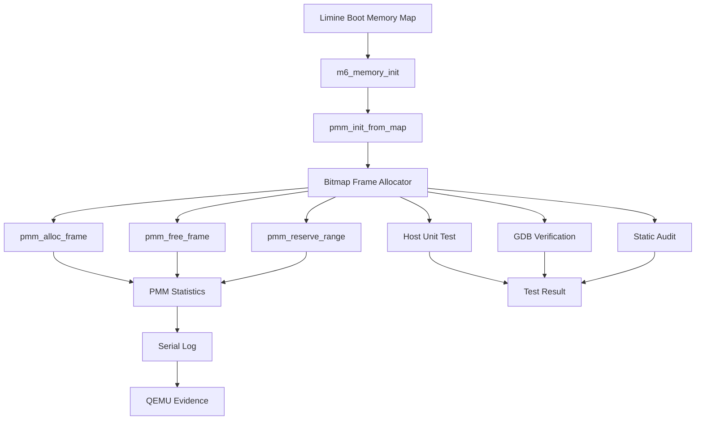

# Template Laporan Praktikum Sistem Operasi Lanjut — MCSOS

**Nama file laporan:** `laporan_praktikum_[M6]_[2583207073007].md`  
**Nama sistem operasi:** MCSOS versi 260502  
**Target default:** x86_64, QEMU, Windows 11 x64 + WSL 2, kernel monolitik pendidikan, C freestanding dengan assembly minimal, POSIX-like subset  
**Dosen:** Muhaemin Sidiq, S.Pd., M.Pd.  
**Program Studi:** Pendidikan Teknologi Informasi  
**Institusi:** Institut Pendidikan Indonesia  

> Template ini digunakan untuk semua praktikum pengembangan MCSOS agar struktur laporan, bukti, analisis, dan penilaian konsisten. Ganti seluruh teks bertanda `[isi ...]` dengan data praktikum sebenarnya. Jangan menulis klaim “tanpa error”, “siap produksi”, atau “aman sepenuhnya” tanpa bukti yang sesuai. Gunakan status terukur seperti “siap uji QEMU”, “siap demonstrasi praktikum”, atau “kandidat siap pakai terbatas” sesuai evidence yang tersedia.

---

## 0. Metadata Laporan

| Atribut | Isi |
|---|---|
| Kode praktikum | `[M6]` |
| Judul praktikum | `[Physical Memory Manager, Boot Memory Map, dan Bitmap Frame Allocator pada MCSOS]` |
| Jenis pengerjaan | `[Individu]` |
| Nama mahasiswa | `[Salma Rahayu]` |
| NIM | `[2583207073007]` |
| Kelas | `[PTI 1-A]` |
| Nama kelompok | `[isi jika kelompok]` |
| Anggota kelompok | `[nama, NIM, peran ringkas]` |
| Tanggal praktikum | `[YYYY-MM-DD]` |
| Tanggal pengumpulan | `[YYYY-MM-DD]` |
| Repository | `[https://github.com/amaaarhyu078-creator/mcsos-.git]` |
| Branch | `[praktikum/m6-pmm]` |
| Commit awal | `` `[22f41cd]` `` |
| Commit akhir | `` `[ccee310]` `` |
| Status readiness yang diklaim | `[siap uji QEMU]` |

---

## 1. Sampul

# Laporan Praktikum `[M4]`  
## `[Physical Memory Manager, Boot Memory Map, dan Bitmap Frame Allocator pada MCSOS]`

Disusun oleh:

| Nama | NIM | Kelas | Peran |
|---|---|---|---|
| `[Salma Rahayu]` | `[2583207073007]` | `[PTI 1-A]` | `[individu]` |
| `[opsional]` | `[opsional]` | `[opsional]` | `[opsional]` |

Dosen Pengampu: **Muhaemin Sidiq, S.Pd., M.Pd.**  
Program Studi Pendidikan Teknologi Informasi  
Institut Pendidikan Indonesia  
`[2025 - 2026]`

---

## 2. Pernyataan Orisinalitas dan Integritas Akademik

Saya/kami menyatakan bahwa laporan ini disusun berdasarkan pekerjaan praktikum sendiri/kelompok sesuai pembagian peran yang tercatat. Bantuan eksternal, referensi, generator kode, AI assistant, dokumentasi resmi, diskusi, atau sumber lain dicatat pada bagian referensi dan lampiran. Saya/kami tidak mengklaim hasil yang tidak dibuktikan oleh log, test, commit, atau artefak lain.

| Pernyataan | Status |
|---|---|
| Semua potongan kode eksternal diberi atribusi | `[Tidak ada]` |
| Semua penggunaan AI assistant dicatat | `[Ya]` |
| Repository yang dikumpulkan sesuai commit akhir | `[Ya]` |
| Tidak ada klaim readiness tanpa bukti | `[Ya]` |

Catatan penggunaan bantuan eksternal:

```text
[AI Assistant (ChatGPT) digunakan untuk membantu memahami spesifikasi praktikum, menjelaskan konsep Physical Memory Manager (PMM), membantu analisis hasil pengujian, membantu interpretasi log build, QEMU, dan GDB, serta membantu penyusunan dan perapian laporan praktikum.
Penggunaan AI tidak digunakan untuk menggantikan proses implementasi, pengujian, maupun verifikasi. Seluruh perubahan source code, proses build, pengujian host unit test, integrasi kernel, pengujian QEMU, debugging GDB, commit Git, dan verifikasi hasil dilakukan secara mandiri oleh mahasiswa.
Verifikasi mandiri yang dilakukan:
- Host unit test PMM.
- Static verification script.
- Audit symbol menggunakan nm.
- Audit object menggunakan objdump.
- Build kernel MCSOS.
- Pengujian runtime menggunakan QEMU.
- Verifikasi breakpoint dan backtrace menggunakan GDB.
- Pemeriksaan commit dan repository Git.]
```

---

## 3. Tujuan Praktikum

Tuliskan tujuan teknis dan konseptual praktikum. Tujuan harus dapat diuji.

1. `[Menghasilkan Physical Memory Manager (PMM) awal berbasis bitmap yang dapat mengelola frame memori fisik berukuran 4096 byte pada kernel MCSOS.]`
2. `[Mengubah boot memory map yang diberikan bootloader Limine menjadi status frame yang dapat dikelola PMM, meliputi frame free, used, reserved, allocated, atau ignored.]`
3. `[Menyediakan API PMM yang terdiri atas pmm_init_from_map(), pmm_alloc_frame(), pmm_free_frame(), pmm_reserve_range(), serta fungsi query statistik untuk mendukung pengelolaan memori fisik kernel.]`
4. `[Menyediakan host unit test, audit freestanding object, dan prosedur integrasi kernel sehingga implementasi PMM dapat divalidasi melalui host test, build kernel, QEMU runtime test, dan debugging menggunakan GDB.]`
5. `[Menyediakan mekanisme diagnosis failure mode seperti salah hitung free frame, allocation leak, double free, reserved-region corruption, page fault, hang, atau kegagalan inisialisasi PMM melalui log kernel, audit ELF, dan breakpoint GDB.]`

---

## 4. Capaian Pembelajaran Praktikum

Setelah praktikum ini, mahasiswa mampu:

| CPL/CPMK praktikum | Bukti yang harus ditunjukkan |
|---|---|
| `[Menjelaskan perbedaan memory map firmware/bootloader, Physical Memory Manager (PMM), Virtual Memory Manager (VMM), dan heap allocator serta hubungan antar komponen dalam manajemen memori sistem operasi.]` | `[Dasar teori, diagram arsitektur memori, dan analisis pada laporan.]` |
| `[Menjelaskan alasan PMM menganggap seluruh frame sebagai used terlebih dahulu sebelum membuka region usable, melakukan alignment frame 4096 byte, menangani overflow base + length, serta melindungi frame 0 dari alokasi.]` | `[Analisis desain, invariant PMM, source pmm.c, host unit test, dan pembahasan failure modes.]` |
| `[Mengimplementasikan bitmap allocator untuk frame fisik 4096 byte yang mendukung inisialisasi dari boot memory map, alokasi frame, pembebasan frame, reservasi region, dan statistik allocator.]` | `[Source pmm.h, source pmm.c, host unit test PASS, dan hasil build object PMM.]` |
| `[Menulis dan menjalankan host unit test untuk memverifikasi logika PMM tanpa ketergantungan pada hardware atau emulator.]` | `[Output M6 PMM host unit test: PASS dan hasil check_m6_static.sh.]` |
| `[Melakukan verifikasi freestanding object dan integrasi kernel menggunakan audit symbol, disassembly object, build kernel, QEMU, dan GDB.]` | `[Output nm -u build/pmm.o, objdump PMM, build kernel, log QEMU, breakpoint GDB, dan backtrace.]` |
| `[Menjelaskan residual risk M6 bahwa sistem belum memiliki Virtual Memory Manager penuh, kernel heap allocator, maupun mekanisme reclamation aman untuk bootloader memory.]` | `[Analisis keamanan, reliability, readiness review, dan pembahasan keterbatasan implementasi.]` |

---

## 5. Peta Milestone MCSOS

Centang milestone yang menjadi fokus laporan ini. Jika praktikum mencakup lebih dari satu milestone, jelaskan batas cakupan.

| Milestone | Fokus | Status dalam laporan |
|---|---|---|
| M0 | Requirements, governance, baseline arsitektur | `[ ] tidak dibahas / [ ] dibahas / [V] selesai praktikum` |
| M1 | Toolchain reproducible, Git, QEMU, GDB, metadata build | `[ ] tidak dibahas / [ ] dibahas / [V] selesai praktikum` |
| M2 | Boot image, kernel ELF64, early console | `[ ] tidak dibahas / [ ] dibahas / [V] selesai praktikum` |
| M3 | Panic path, linker map, GDB, observability awal | `[ ] tidak dibahas / [ ] dibahas / [V] selesai praktikum` |
| M4 | Trap, exception, interrupt, timer | `[ ] tidak dibahas / [ ] dibahas / [V] selesai praktikum` |
| M5 | PMM, VMM, page table, kernel heap | `[ ] tidak dibahas / [ ] dibahas / [V] selesai praktikum` |
| M6 | Thread, scheduler, synchronization | `[ ] tidak dibahas / [V] dibahas / [] selesai praktikum` |
| M7 | Syscall ABI dan user program loader | `[V] tidak dibahas / [ ] dibahas / [ ] selesai praktikum` |
| M8 | VFS, file descriptor, ramfs | `[V] tidak dibahas / [ ] dibahas / [ ] selesai praktikum` |
| M9 | Block layer dan device model | `[V] tidak dibahas / [ ] dibahas / [ ] selesai praktikum` |
| M10 | Persistent filesystem, mcsfs/ext2-like, recovery | `[V] tidak dibahas / [ ] dibahas / [ ] selesai praktikum` |
| M11 | Networking stack, packet parsing, UDP/TCP subset | `[V] tidak dibahas / [ ] dibahas / [ ] selesai praktikum` |
| M12 | Security model, capability/ACL, syscall fuzzing, hardening | `[V] tidak dibahas / [ ] dibahas / [ ] selesai praktikum` |
| M13 | SMP, scalability, lock stress, NUMA-aware preparation | `[V] tidak dibahas / [ ] dibahas / [ ] selesai praktikum` |
| M14 | Framebuffer, graphics console, visual regression | `[V] tidak dibahas / [ ] dibahas / [ ] selesai praktikum` |
| M15 | Virtualization/container subset | `[V] tidak dibahas / [ ] dibahas / [ ] selesai praktikum` |
| M16 | Observability, update/rollback, release image, readiness review | `[V] tidak dibahas / [ ] dibahas / [ ] selesai praktikum` |

Batas cakupan praktikum:

```text
[Praktikum M6 mencakup implementasi Physical Memory Manager (PMM) berbasis bitmap untuk mengelola frame fisik berukuran 4096 byte, konversi boot memory map Limine menjadi status frame yang dapat dikelola allocator, implementasi operasi inisialisasi, alokasi, pembebasan, reservasi region, dan statistik PMM, serta integrasi PMM ke kernel MCSOS.
Praktikum ini juga mencakup host unit test, audit freestanding object menggunakan nm dan objdump, build kernel, pengujian runtime menggunakan QEMU, serta debugging menggunakan GDB untuk memverifikasi perilaku PMM setelah integrasi.

Non-goals:
- Tidak membuat Virtual Memory Manager (VMM) penuh.
- Tidak mengganti CR3 atau mengatur page table baru.
- Tidak membangun heap dinamis umum seperti kmalloc.
- Tidak mereklamasi BOOTLOADER_RECLAIMABLE secara otomatis sebelum kernel memiliki page table sendiri dan seluruh data bootloader tidak lagi dibutuhkan.
- Tidak mengimplementasikan user-space memory management, demand paging, memory compaction, atau NUMA-aware memory allocation.
- Tidak mengklaim dukungan hardware umum maupun kesiapan produksi.
Status implementasi dibatasi pada PMM awal yang telah tervalidasi melalui host unit test, static audit, build kernel, QEMU, dan GDB sesuai ruang lingkup praktikum M6.]
```

---

## 6. Dasar Teori Ringkas

### 6.1 Boot Memory Map

Boot memory map adalah struktur data yang diberikan oleh firmware atau bootloader untuk menjelaskan tata letak memori fisik sistem. Setiap entri memory map memiliki alamat awal (base), ukuran (length), dan tipe region. Informasi ini digunakan kernel untuk menentukan area memori yang dapat digunakan dan area yang harus dilindungi.
Pada praktikum M6, memory map diperoleh melalui bootloader Limine dan dikonversi menjadi status frame yang dikelola oleh Physical Memory Manager (PMM).

---

### 6.2 Physical Memory Manager (PMM)

Physical Memory Manager (PMM) adalah subsistem kernel yang bertanggung jawab mengelola frame memori fisik. PMM bekerja pada level alamat fisik dan menjadi dasar bagi subsistem memori lain seperti Virtual Memory Manager (VMM) dan heap allocator.
Pada M6, PMM menggunakan ukuran frame tetap sebesar 4096 byte (4 KiB). PMM menyediakan operasi inisialisasi allocator, alokasi frame, pembebasan frame, reservasi region, dan statistik penggunaan frame.

---

### 6.3 Bitmap Frame Allocator

Bitmap allocator menggunakan satu bit untuk merepresentasikan satu frame fisik. Nilai bit menunjukkan status frame, misalnya free atau used.
Keuntungan pendekatan bitmap adalah implementasi sederhana, kebutuhan memori yang relatif kecil, dan kemudahan melakukan audit terhadap status seluruh frame fisik. Pada M6, bitmap digunakan sebagai struktur utama untuk menyimpan status frame yang dikelola PMM.

---

### 6.4 Fail-Closed Memory Initialization

Prinsip fail-closed menyatakan bahwa seluruh frame dianggap tidak dapat digunakan terlebih dahulu. Setelah itu hanya region yang secara eksplisit ditandai usable oleh memory map yang dibuka menjadi free.
Pendekatan ini mengurangi risiko allocator memberikan frame yang sebenarnya berada pada area kernel, bootloader, ACPI, framebuffer, atau region terproteksi lainnya.

---

### 6.5 Alignment dan Overflow Protection

Karena PMM bekerja pada frame berukuran 4096 byte, alamat awal dan ukuran region harus disejajarkan (aligned) ke batas frame. Region yang tidak sejajar harus dibulatkan agar tidak menghasilkan alokasi frame parsial.
Selain itu, operasi penjumlahan alamat seperti base + length harus diperiksa terhadap kemungkinan overflow. Overflow yang tidak ditangani dapat menyebabkan perhitungan region menjadi salah dan mengakibatkan korupsi status allocator.

---

### 6.6 Invariant Physical Memory Manager

Invariant adalah kondisi yang harus selalu benar selama PMM beroperasi. Pada M6, beberapa invariant utama adalah:
- Frame 0 tidak boleh dialokasikan.
- Region non-usable tidak boleh dialokasikan.
- Invalid free harus ditolak.
- Double free tidak boleh meningkatkan jumlah free frame.
- Jumlah frame harus konsisten terhadap statistik allocator.
- Status bitmap harus merepresentasikan kondisi frame yang sebenarnya.
Invariant tersebut digunakan sebagai dasar pengujian host unit test, audit statis, dan validasi runtime pada QEMU.

---

### 6.7 Hubungan PMM dengan VMM

PMM mengelola frame fisik, sedangkan Virtual Memory Manager (VMM) mengelola translasi alamat virtual ke alamat fisik melalui page table.
Pada praktikum M6, implementasi hanya mencakup PMM. VMM, pengelolaan page table baru, pergantian CR3, dan heap allocator belum diimplementasikan sehingga menjadi ruang lingkup praktikum lanjutan.

### 6.1 Konsep Sistem Operasi yang Diuji

```text
[Praktikum M6 berfokus pada pengelolaan memori fisik menggunakan Physical Memory Manager (PMM) berbasis bitmap. Sebelum PMM dapat digunakan, kernel memperoleh informasi tata letak memori fisik dari bootloader Limine melalui boot memory map. Memory map tersebut berisi daftar region memori beserta tipenya, seperti usable, reserved, ACPI, framebuffer, dan bootloader-reclaimable.
PMM bertugas mengubah informasi memory map menjadi status frame yang dapat dikelola allocator. Setiap frame fisik berukuran 4096 byte direpresentasikan menggunakan bitmap sehingga allocator dapat menentukan apakah suatu frame berada dalam kondisi free, used, reserved, atau allocated.
Praktikum ini juga menerapkan prinsip fail-closed, yaitu seluruh frame dianggap used terlebih dahulu, kemudian hanya region yang dinyatakan usable yang dibuka menjadi free. Pendekatan ini digunakan untuk mencegah alokasi pada area kernel, bootloader, framebuffer, ACPI, maupun region terproteksi lainnya.
Selain PMM, praktikum memanfaatkan konsep bootloader, ELF executable, linker layout kernel, serial logging, interrupt subsystem, dan panic path yang telah dibangun pada milestone sebelumnya (M0–M5). Komponen tersebut menjadi fondasi agar PMM dapat diintegrasikan, diuji, dan didiagnosis menggunakan host unit test, QEMU, serta GDB.
Virtual Memory Manager (VMM), page table management lanjutan, pergantian CR3, dan heap allocator belum menjadi bagian dari implementasi M6 dan hanya dibahas sebagai pengembangan lanjutan.]
```

### 6.2 Konsep Arsitektur x86_64 yang Relevan

| Konsep | Relevansi pada praktikum | Bukti/verifikasi |
|---|---|---|
| `[Long Mode (x86_64)]` | `[Kernel MCSOS dijalankan pada arsitektur x86_64 sehingga PMM mengelola alamat fisik dan struktur data 64-bit. Long mode diperlukan agar kernel dapat berjalan pada lingkungan 64-bit yang disediakan Limine dan QEMU.]` | `[ELF64 pada readelf -h build/kernel.elf, log boot QEMU, dan hasil build target x86_64.]` |
| `[Paging]` | `[Walaupun M6 tidak membuat page table baru atau mengganti CR3, kernel tetap berjalan di atas mekanisme paging yang telah disiapkan bootloader. PMM menyediakan frame fisik yang nantinya akan digunakan oleh subsistem paging pada milestone berikutnya.]` | `[Register dump GDB (CR0, CR3, CR4), boot kernel berhasil, dan hasil debugging runtime.]` |
| `[ELF64 Executable Format]` | `[Kernel dibangun sebagai executable ELF64 sehingga simbol PMM, layout section, dan alamat kernel dapat diverifikasi sebelum integrasi runtime.]` | `[readelf -h, readelf -S, nm, dan objdump build/kernel.elf.]` |
| `[Interrupt Descriptor Table (IDT)]` | `[IDT yang dibangun pada M4 tetap diperlukan agar kernel dapat menangani exception atau fault yang mungkin terjadi selama inisialisasi PMM.]` | `[Log "[M4] IDT loaded", selftest IDT, dan hasil boot QEMU.]` |
| `[Hardware Interrupt dan PIT Timer]` | `[Subsistem interrupt dari M5 harus tetap berjalan setelah integrasi PMM. Hal ini digunakan untuk memastikan perubahan M6 tidak merusak mekanisme interrupt yang sudah ada.]` | `[Log timer IRQ online dan keluaran periodik MCSOS:TIMER pada QEMU.]` |
| `[Serial Debugging dan GDB Remote Debugging]` | `[Digunakan untuk memverifikasi proses inisialisasi PMM, memeriksa register CPU, breakpoint, backtrace, dan kondisi memori kernel saat runtime.]` | `[Breakpoint pmm_init_from_map, info registers, backtrace, dan dump kernel_pmm menggunakan GDB.]` |

### 6.3 Konsep Implementasi Freestanding

| Aspek | Keputusan praktikum |
|---|---|
| Bahasa | `[C17 freestanding dengan dukungan assembly x86_64 untuk bagian low-level kernel.]` |
| Runtime | `[Tanpa hosted libc, tanpa runtime sistem operasi host, dan menggunakan lingkungan kernel freestanding yang dibangun khusus untuk MCSOS.]` |
| ABI | `[x86_64 System V ABI sesuai target kernel x86_64 yang digunakan oleh toolchain dan linker.]` |
| Compiler flags kritis | `[ -ffreestanding, -fno-builtin, -fno-stack-protector, -fno-stack-check, -fno-pic, -fno-pie, -mno-red-zone, -mcmodel=kernel, -nostdlib ]` |
| Risiko undefined behavior | `[Pointer tidak valid, akses memori di luar region yang diizinkan, alignment frame yang salah, integer overflow pada perhitungan base + length, double free, invalid free, dan inkonsistensi bitmap allocator.]` |

### 6.4 Referensi Teori yang Digunakan

| No. | Sumber | Bagian yang digunakan | Alasan relevansi |
|---|---|---|---|
| `[1]` | `[Intel® 64 and IA-32 Architectures Software Developer's Manual]` | `[Memory Management, Paging, dan System Programming Guide]` | `[Menjelaskan konsep memori fisik, paging, struktur alamat, dan mekanisme arsitektur x86_64 yang menjadi dasar pengelolaan memori kernel.]` |
| `[2]` | `[Limine Boot Protocol Specification]` | `[Memory Map Request dan Memory Map Response]` | `[Digunakan untuk memahami format boot memory map yang diberikan bootloader kepada kernel dan proses integrasi PMM.]` |
| `[3]` | `[Operating Systems: Three Easy Pieces (OSTEP)]` | `[Physical Memory Management dan Memory Virtualization]` | `[Memberikan dasar konseptual mengenai pengelolaan memori fisik, allocator, dan hubungan PMM dengan VMM.]` |
| `[4]` | `[Dokumentasi Praktikum MCSOS M6]` | `[Goals, PMM API, Host Test, Static Audit, dan Integrasi Kernel]` | `[Menjadi acuan utama implementasi, pengujian, validasi, dan kriteria kelulusan praktikum.]` |
| `[5]` | `[OSDev Wiki]` | `[Page Frame Allocation dan Bitmap Allocator]` | `[Digunakan sebagai referensi tambahan untuk memahami implementasi allocator berbasis bitmap pada kernel sistem operasi.]` |

---

### 7.1 Host dan Target

| Komponen | Nilai |
|---|---|
| Host OS | `[Windows 11 x64 dengan WSL 2]` |
| Lingkungan build | `[WSL 2 Ubuntu (Kernel Linux 6.6.114.1-microsoft-standard-WSL2)]` |
| Target ISA | `x86_64` |
| Target ABI | `[x86_64-unknown-none-elf]` |
| Emulator | `[QEMU emulator version 10.2.1]` |
| Firmware emulator | `[Limine Boot Protocol (OVMF tidak digunakan secara eksplisit pada pengujian M6)]` |
| Debugger | `[GNU gdb 17.1]` |
| Build system | `[Make]` |
| Bahasa utama | `[C17 freestanding]` |
| Assembly | `[NASM 3.01]` |

### 7.2 Versi Toolchain

Tempel output versi toolchain berikut. Jalankan dari clean shell WSL.

```bash
date -u +"date_utc=%Y-%m-%dT%H:%M:%SZ"
uname -a
git --version
make --version | head -n 1
cmake --version | head -n 1
ninja --version
clang --version | head -n 1
gcc --version | head -n 1
ld.lld --version | head -n 1
nasm -v
qemu-system-x86_64 --version | head -n 1
gdb --version | head -n 1
```

Output:

```text
[date_utc=2026-06-02T13:15:27Z
Linux DESKTOP-S5LUA56 6.6.114.1-microsoft-standard-WSL2 #1 SMP PREEMPT_DYNAMIC Mon Dec  1 20:46:23 UTC 2025 x86_64 GNU/Linux
git version 2.53.0
GNU Make 4.4.1
cmake version 4.2.3
1.13.2
Ubuntu clang version 21.1.8 (6ubuntu1)
gcc (Ubuntu 15.2.0-16ubuntu1) 15.2.0
Ubuntu LLD 21.1.8 (compatible with GNU linkers)
NASM version 3.01
QEMU emulator version 10.2.1 (Debian 1:10.2.1+ds-1ubuntu3)
GNU gdb (Ubuntu 17.1-2ubuntu1) 17.1]
```

### 7.3 Lokasi Repository

| Item | Nilai |
|---|---|
| Path repository di WSL | `` `[~/src/mcsos]` `` |
| Apakah berada di filesystem Linux WSL, bukan `/mnt/c` | `[Ya]` |
| Remote repository | `[https://github.com/amaaarhyu078-creator/mcsos-.git]` |
| Branch | `[praktikum/m6-pmm]` |
| Commit hash awal | `` `[22f41cd]` `` |
| Commit hash akhir | `` `[ccee310]` `` |

---

## 8. Repository dan Struktur File

### 8.1 Struktur Direktori yang Relevan

Tampilkan hanya direktori dan file yang relevan dengan praktikum.

```text
mcsos/
├── kernel/
│   ├── core/
│   │   ├── kmain.c
│   │   ├── pmm.c
│   │   ├── log.c
│   │   ├── panic.c
│   │   └── serial.c
│   └── include/
│       └── mcsos/
│           └── kernel/
│               ├── pmm.h
│               ├── log.h
│               └── panic.h
├── tests/
│   └── test_pmm_host.c
├── build/
│   ├── kernel.elf
│   ├── mcsos.iso
│   └── m6_pmm_objdump.txt
├── evidence/
│   └── m6-qemu.log
├── Makefile
├── linker.ld
└── limine.cfg
]
```

### 8.2 File yang Dibuat atau Diubah

| File | Jenis perubahan | Alasan perubahan | Risiko |
|---|---|---|---|
| `kernel/include/mcsos/kernel/pmm.h` | `[Baru]` | `[Mendefinisikan kontrak API Physical Memory Manager (PMM), struktur data, konstanta, dan fungsi yang digunakan oleh kernel.]` | `[Sedang – Kesalahan definisi API dapat menyebabkan inkonsistensi implementasi dan kegagalan build.]` |
| `kernel/core/pmm.c` | `[Baru]` | `[Mengimplementasikan bitmap frame allocator, inisialisasi dari memory map, alokasi frame, pembebasan frame, reservasi region, dan statistik PMM.]` | `[Tinggi – Kesalahan logika dapat menyebabkan alokasi memori tidak valid, double free, atau korupsi memori kernel.]` |
| `tests/test_pmm_host.c` | `[Baru]` | `[Menyediakan host unit test untuk memverifikasi logika PMM tanpa memerlukan QEMU atau hardware nyata.]` | `[Rendah – Kesalahan hanya memengaruhi validasi pengujian dan tidak memengaruhi runtime kernel secara langsung.]` |
| `kernel/core/kmain.c` | `[Ubah]` | `[Mengintegrasikan PMM ke proses boot kernel melalui inisialisasi memory map Limine dan menampilkan statistik PMM pada serial log.]` | `[Tinggi – Kesalahan integrasi dapat menyebabkan boot gagal, page fault, atau panic saat startup.]` |
| `Makefile` | `[Ubah]` | `[Menambahkan dukungan build, audit, dan host test yang diperlukan oleh praktikum M6.]` | `[Sedang – Kesalahan konfigurasi dapat menyebabkan build atau pengujian gagal.]` |

### 8.3 Ringkasan Diff

```bash
git status --short
git diff --stat
git log --oneline -n 5
```

Output:

```text
[ccee310 (HEAD -> praktikum/m6-pmm, origin/praktikum/m6-pmm) Integrate M6 PMM with Limine memory map
22f41cd Add M6 physical memory manager
b8f2ffe (origin/praktikum/m5-timer-irq, praktikum/m5-timer-irq) Add M0-M5 evidence screenshots
3e3fc91 docs: add practicum evidence screenshots
1f955e7 (tag: m5-enrichment-stable) M5: add unexpected IRQ diagnostics]
```

---

## 9. Desain Teknis

### 9.1 Masalah yang Diselesaikan

```text
[Sebelum praktikum M6, kernel MCSOS belum memiliki Physical Memory Manager (PMM) yang dapat mengelola frame memori fisik secara terstruktur. Kernel telah mampu melakukan booting, menampilkan log serial, menangani interrupt, dan menjalankan timer, tetapi belum memiliki mekanisme untuk menentukan frame memori mana yang aman digunakan dan mana yang harus dilindungi.
Tanpa PMM, kernel tidak dapat melakukan alokasi frame fisik secara aman karena informasi boot memory map dari bootloader belum diterjemahkan menjadi status frame yang dapat digunakan allocator. Kondisi ini berisiko menyebabkan kernel mengalokasikan region yang seharusnya tetap ter-reserve, seperti area kernel image, data bootloader, ACPI, framebuffer, atau region memori yang tidak valid.
Praktikum M6 menyelesaikan masalah tersebut dengan membangun Physical Memory Manager berbasis bitmap yang mengubah boot memory map Limine menjadi status frame fisik. PMM menerapkan prinsip fail-closed dengan menganggap seluruh frame sebagai used terlebih dahulu, kemudian hanya membuka region yang dinyatakan usable menjadi free. Selain itu, PMM menyediakan operasi alokasi, pembebasan, reservasi region, dan statistik penggunaan frame yang dapat diverifikasi melalui host unit test, audit freestanding object, QEMU, dan GDB.
Dengan adanya PMM, kernel memperoleh fondasi manajemen memori fisik yang diperlukan untuk pengembangan subsistem lanjutan seperti Virtual Memory Manager (VMM), paging lanjutan, dan heap allocator pada milestone berikutnya.]
```

### 9.2 Keputusan Desain

| Keputusan | Alternatif yang dipertimbangkan | Alasan memilih | Konsekuensi |
|---|---|---|---|
| `[Menggunakan bitmap allocator untuk mengelola frame fisik.]` | `[Linked list free frame, stack allocator, buddy allocator.]` | `[Bitmap allocator sederhana, mudah diaudit, kebutuhan memori kecil, dan sesuai untuk PMM awal pada M6.]` | `[Pencarian frame free dapat menjadi lebih lambat ketika jumlah frame bertambah besar.]` |
| `[Menggunakan ukuran frame tetap 4096 byte (4 KiB).]` | `[Ukuran frame variabel atau allocator berbasis region.]` | `[Sesuai dengan ukuran page standar x86_64 dan mempermudah integrasi dengan subsistem paging pada milestone berikutnya.]` | `[Dapat menimbulkan fragmentasi internal untuk kebutuhan alokasi yang lebih kecil dari satu frame.]` |
| `[Menerapkan prinsip fail-closed dengan menandai seluruh frame sebagai used sebelum membuka region usable.]` | `[Menganggap seluruh frame free kemudian me-reserve region tertentu.]` | `[Lebih aman karena mengurangi risiko allocator memberikan frame yang sebenarnya berada pada region kernel, ACPI, framebuffer, atau bootloader.]` | `[Membutuhkan proses tambahan untuk membuka kembali region yang dinyatakan usable.]` |
| `[Melindungi frame 0 secara permanen.]` | `[Mengizinkan frame 0 dialokasikan jika berada pada region usable.]` | `[Frame 0 sering digunakan sebagai nilai sentinel atau penanda error sehingga tidak aman untuk dialokasikan.]` | `[Mengurangi jumlah frame yang tersedia sebanyak satu frame.]` |
| `[Melakukan alignment base dan length ke batas frame 4096 byte.]` | `[Menggunakan alamat dan ukuran region apa adanya.]` | `[Mencegah alokasi frame parsial dan menjaga konsistensi bitmap allocator.]` | `[Sebagian kecil memori pada tepi region dapat tidak digunakan.]` |
| `[Menangani overflow pada operasi base + length secara eksplisit.]` | `[Mengandalkan overflow alami integer tanpa validasi.]` | `[Mencegah perhitungan region yang salah dan potensi korupsi status allocator.]` | `[Menambah sedikit kompleksitas implementasi PMM.]` |
| `[Menyediakan host unit test terpisah dari kernel runtime.]` | `[Hanya menguji melalui boot QEMU.]` | `[Debugging lebih cepat, tidak bergantung pada emulator, dan mempermudah verifikasi logika PMM.]` | `[Perlu memelihara kode pengujian tambahan.]` |
| `[Mengintegrasikan PMM setelah serial log, panic path, IDT, dan timer M3–M5 stabil.]` | `[Mengembangkan PMM sebelum subsistem debugging siap.]` | `[Mempermudah diagnosis kesalahan melalui serial log, panic output, QEMU, dan GDB.]` | `[Pengembangan PMM bergantung pada penyelesaian milestone sebelumnya.]` |

### 9.3 Arsitektur Ringkas



Penjelasan diagram:

```text
[Alur dimulai ketika bootloader Limine memberikan boot memory map kepada kernel saat proses boot. Memory map tersebut berisi daftar region memori fisik beserta tipe masing-masing region.
Pada tahap m6_memory_init(), kernel mengambil informasi memory map dari Limine dan meneruskannya ke pmm_init_from_map(). Fungsi ini melakukan inisialisasi Physical Memory Manager (PMM) dengan prinsip fail-closed, yaitu seluruh frame dianggap used terlebih dahulu, kemudian hanya region yang bertipe usable yang dibuka menjadi free.
Status setiap frame disimpan menggunakan bitmap frame allocator. Bitmap menjadi sumber kebenaran (source of truth) bagi seluruh operasi PMM.
Setelah inisialisasi selesai, PMM menyediakan tiga operasi utama:
- pmm_alloc_frame() untuk mengalokasikan frame fisik.
- pmm_free_frame() untuk mengembalikan frame ke allocator.
- pmm_reserve_range() untuk melindungi region tertentu agar tidak dapat dialokasikan.
Perubahan status frame akan memengaruhi statistik PMM, seperti jumlah frame yang dikelola dan jumlah frame yang tersedia. Statistik tersebut dicetak ke serial log kernel dan diverifikasi melalui boot QEMU.
Selain validasi runtime, implementasi PMM juga diverifikasi menggunakan host unit test, audit freestanding object (nm dan objdump), serta debugging menggunakan GDB. Hasil seluruh proses verifikasi menjadi bukti bahwa PMM telah berhasil terintegrasi dan berfungsi sesuai desain pada praktikum M6.
Batas tanggung jawab PMM pada M6 hanya mencakup pengelolaan frame fisik. PMM tidak bertanggung jawab terhadap translasi alamat virtual, page table management, pergantian CR3, kernel heap allocator, maupun memory reclamation lanjutan yang akan menjadi bagian dari milestone berikutnya.]

```

### 9.4 Kontrak Antarmuka

| Antarmuka | Pemanggil | Penerima | Precondition | Postcondition | Error path |
|---|---|---|---|---|---|
| `pmm_init_from_map()` | `[m6_memory_init() pada kmain.c]` | `[Physical Memory Manager (PMM)]` | `[Memory map Limine valid, bitmap tersedia, dan parameter inisialisasi telah diverifikasi.]` | `[PMM terinisialisasi, bitmap mencerminkan status frame, statistik frame tersedia.]` | `[Mengembalikan false jika memory map tidak valid, terjadi overflow, atau konfigurasi bitmap tidak mencukupi.]` |
| `pmm_alloc_frame()` | `[Kernel subsystem atau kode pengujian]` | `[Physical Memory Manager (PMM)]` | `[PMM telah berhasil diinisialisasi dan masih terdapat frame free.]` | `[Satu frame fisik dialokasikan dan statistik allocator diperbarui.]` | `[Mengembalikan kegagalan/null frame apabila tidak ada frame yang tersedia.]` |
| `pmm_free_frame()` | `[Kernel subsystem atau kode pengujian]` | `[Physical Memory Manager (PMM)]` | `[Frame berasal dari allocator, valid, dan sedang dalam status allocated.]` | `[Frame dikembalikan ke status free dan statistik allocator diperbarui.]` | `[Permintaan ditolak apabila frame tidak valid, berada di luar jangkauan PMM, atau terjadi double free.]` |
| `pmm_reserve_range()` | `[Kernel initialization atau subsystem memori]` | `[Physical Memory Manager (PMM)]` | `[Rentang alamat valid dan berada dalam area yang dikelola PMM.]` | `[Seluruh frame pada rentang tersebut ditandai reserved/used sehingga tidak dapat dialokasikan.]` | `[Permintaan diabaikan atau ditolak apabila rentang tidak valid atau terjadi overflow perhitungan alamat.]` |
| `m6_memory_init()` | `[kmain()]` | `[PMM dan adapter memory map Limine]` | `[Bootloader Limine telah memberikan memory map yang dapat diakses kernel.]` | `[PMM selesai diinisialisasi dan ringkasan statistik PMM dicetak ke serial log.]` | `[Kernel panic atau penghentian inisialisasi apabila PMM gagal diinisialisasi.]` |

### 9.5 Struktur Data Utama

| Struktur data | Field penting | Ownership | Lifetime | Invariant |
|---|---|---|---|---|
| `` `struct pmm_state` `` | `[bitmap, bitmap_bytes, frame_count, free_frames, used_frames, reserved_frames, ignored_frames, next_hint, initialized]` | `[Dimiliki oleh subsistem Physical Memory Manager (PMM) dan disimpan pada objek global kernel_pmm.]` | `[Dibuat saat inisialisasi kernel, diinisialisasi oleh pmm_zero_state() dan pmm_init_from_map(), lalu tetap hidup selama kernel berjalan.]` | `[free_frames + used_frames + reserved_frames + ignored_frames tidak melebihi frame_count, bitmap harus valid, dan initialized bernilai true setelah inisialisasi berhasil.]` |
| `` `struct boot_mem_region` `` | `[base, length, type]` | `[Dimiliki oleh adapter memory map bootloader dan digunakan sebagai input PMM.]` | `[Dibuat saat proses boot dan digunakan selama pmm_init_from_map() melakukan konversi memory map.]` | `[base dan length harus valid, tidak boleh menghasilkan overflow pada base + length, serta type harus sesuai dengan nilai enum boot_mem_type.]` |
| `` `enum boot_mem_type` `` | `[BOOT_MEM_USABLE, BOOT_MEM_RESERVED, BOOT_MEM_BOOTLOADER_RECLAIMABLE, BOOT_MEM_KERNEL_AND_MODULES, BOOT_MEM_FRAMEBUFFER, BOOT_MEM_ACPI_RECLAIMABLE, BOOT_MEM_ACPI_NVS, BOOT_MEM_BAD_MEMORY]` | `[Digunakan oleh PMM untuk mengklasifikasikan region memori.]` | `[Berlaku selama proses inisialisasi dan pengelolaan PMM.]` | `[Region non-usable tidak boleh dialokasikan dan harus ditandai reserved atau ignored sesuai kebijakan PMM.]` |
| `` `kernel_pmm_bitmap` `` | `[Bitmap status frame fisik.]` | `[Dimiliki oleh PMM sebagai storage utama allocator.]` | `[Dialokasikan secara statis dan tersedia selama kernel berjalan.]` | `[Satu bit merepresentasikan satu frame fisik berukuran 4096 byte dan harus selalu konsisten dengan statistik pada struct pmm_state.]` |

### 9.6 Invariants

Tuliskan invariant yang harus benar sepanjang eksekusi.

1. `[Setiap physical frame yang dikelola PMM harus memiliki tepat satu status yang direpresentasikan oleh bitmap allocator. Suatu frame tidak boleh berada pada kondisi free dan reserved secara bersamaan.]`
2. `[PMM menggunakan prinsip fail-closed: seluruh frame dianggap used terlebih dahulu, kemudian hanya region yang bertipe BOOT_MEM_USABLE yang boleh dibuka menjadi free.]`
3. `[Frame 0 tidak boleh dialokasikan dalam kondisi apa pun, meskipun berada pada region yang dapat digunakan.]`
4. `[Region non-usable seperti BOOT_MEM_RESERVED, BOOT_MEM_KERNEL_AND_MODULES, BOOT_MEM_FRAMEBUFFER, BOOT_MEM_ACPI_RECLAIMABLE, BOOT_MEM_ACPI_NVS, BOOT_MEM_BAD_MEMORY, dan BOOT_MEM_BOOTLOADER_RECLAIMABLE tidak boleh diberikan oleh pmm_alloc_frame().]`
5. `[Setiap frame yang dikembalikan oleh pmm_alloc_frame() harus berada pada batas alignment 4096 byte (PMM_PAGE_SIZE).]`
6. `[Operasi pmm_free_frame() hanya boleh menerima frame yang sebelumnya dialokasikan secara sah oleh PMM. Invalid free dan double free harus ditolak.]`
7. `[Perhitungan rentang memori tidak boleh mengalami overflow. Operasi base + length harus divalidasi sebelum digunakan untuk menentukan frame yang akan diproses.]`
8. `[Statistik allocator harus konsisten dengan keadaan bitmap. Nilai free_frames, used_frames, reserved_frames, dan ignored_frames tidak boleh menghasilkan jumlah yang melebihi frame_count.]`
9. `[Field initialized pada struct pmm_state harus bernilai true sebelum operasi alokasi, pembebasan, atau query statistik dilakukan.]`
10. `[Bitmap PMM harus selalu valid dan dapat diakses selama kernel berjalan. Pointer bitmap tidak boleh bernilai NULL setelah inisialisasi berhasil.]`

### 9.7 Ownership, Locking, dan Concurrency

| Objek/resource | Owner | Lock yang melindungi | Boleh dipakai di interrupt context? | Catatan |
|---|---|---|---|---|
| `kernel_pmm` (`struct pmm_state`) | `[Physical Memory Manager (PMM)]` | `[None]` | `[Tidak]` | `[Pada M6 PMM hanya digunakan saat inisialisasi kernel dan host test. Belum ada akses paralel dari interrupt handler.]` |
| `kernel_pmm_bitmap` | `[Physical Memory Manager (PMM)]` | `[None]` | `[Tidak]` | `[Bitmap dimodifikasi oleh operasi alloc, free, dan reserve. Pada M6 belum diperlukan sinkronisasi karena belum ada concurrency.]` |
| `boot memory map (Limine)` | `[Bootloader Limine, dibaca oleh PMM saat boot]` | `[None]` | `[Tidak]` | `[Hanya digunakan selama proses inisialisasi PMM dan tidak diakses setelah konversi selesai.]` |
| `PMM statistics (free_frames, used_frames, reserved_frames, ignored_frames)` | `[Physical Memory Manager (PMM)]` | `[None]` | `[Tidak]` | `[Diperbarui bersamaan dengan perubahan bitmap sehingga harus tetap konsisten dengan status frame.]` |

Lock order yang berlaku:

```text
[Pada M6 tidak terdapat mekanisme locking khusus seperti spinlock atau mutex karena kernel masih berjalan pada lingkungan single-core dan PMM digunakan terutama selama fase inisialisasi boot.
Tidak ada akses bersamaan (concurrent access) dari beberapa CPU maupun interrupt handler terhadap struktur PMM. Oleh karena itu, pendekatan tanpa locking masih dianggap memadai pada tahap ini.
Jika pada milestone berikutnya PMM digunakan setelah multitasking, SMP, atau allocator dipanggil dari interrupt context, maka diperlukan mekanisme sinkronisasi seperti spinlock dan aturan lock ordering yang eksplisit.]

```

### 9.8 Memory Safety dan Undefined Behavior Risk

| Risiko | Lokasi | Mitigasi | Bukti |
|---|---|---|---|
| `[Integer overflow pada perhitungan base + length]` | `[kernel/core/pmm.c, pmm_init_from_map(), pmm_reserve_range()]` | `[Melakukan validasi overflow sebelum menghitung akhir region memori.]` | `[Host unit test, static audit, dan analisis failure mode "Overflow range".]` |
| `[Out-of-bounds access pada bitmap allocator]` | `[kernel/core/pmm.c, operasi bitmap frame]` | `[Memastikan indeks frame berada dalam batas frame_count dan kapasitas bitmap.]` | `[Host unit test PASS, review source code, dan runtime test QEMU.]` |
| `[Alignment error pada frame fisik]` | `[kernel/core/pmm.c, pmm_init_from_map()]` | `[Melakukan alignment base dan length ke batas PMM_PAGE_SIZE (4096 byte).]` | `[Analisis desain PMM, host unit test, dan verifikasi sample frame pada log QEMU.]` |
| `[Invalid free]` | `[kernel/core/pmm.c, pmm_free_frame()]` | `[Memverifikasi bahwa frame berada dalam rentang valid dan berasal dari allocator.]` | `[Host unit test PASS dan analisis failure mode M6.]` |
| `[Double free]` | `[kernel/core/pmm.c, pmm_free_frame()]` | `[Menolak pembebasan frame yang statusnya sudah free.]` | `[Host unit test PASS dan review implementasi statistik allocator.]` |
| `[Alokasi region non-usable]` | `[kernel/core/pmm.c, pmm_init_from_map()]` | `[Menerapkan fail-closed dan hanya membuka region BOOT_MEM_USABLE.]` | `[Log PMM initialized, host unit test, dan analisis protection region.]` |
| `[Penggunaan frame 0]` | `[kernel/core/pmm.c]` | `[Frame 0 ditandai reserved secara permanen dan tidak pernah diberikan allocator.]` | `[Analisis desain, failure mode M6, dan hasil runtime QEMU.]` |

### 9.9 Security Boundary

| Boundary | Data tidak tepercaya | Validasi yang dilakukan | Failure mode aman |
|---|---|---|---|
| `[Boot handoff dari Limine ke kernel]` | `[Boot memory map yang diberikan bootloader.]` | `[Memeriksa base, length, type region, alignment, dan overflow sebelum diproses PMM.]` | `[Inisialisasi PMM gagal (false) atau kernel menghentikan proses boot secara aman.]` |
| `[PMM initialization]` | `[Daftar region memori yang menjadi input pmm_init_from_map().]` | `[Validasi jumlah region, ukuran bitmap, batas frame, dan rentang alamat.]` | `[Menolak inisialisasi dan tidak membuka frame yang tidak valid.]` |
| `[Frame allocation request]` | `[Permintaan alokasi frame dari kernel.]` | `[Memastikan PMM telah terinisialisasi dan frame berada pada status free.]` | `[Mengembalikan kegagalan/PMM_INVALID_FRAME jika tidak ada frame tersedia.]` |
| `[Frame free request]` | `[Alamat fisik yang diberikan ke pmm_free_frame().]` | `[Memeriksa alignment, rentang frame, dan status frame saat ini.]` | `[Permintaan ditolak dan statistik allocator tidak berubah.]` |
| `[Region reservation request]` | `[Base dan length yang diberikan ke pmm_reserve_range().]` | `[Memeriksa overflow, alignment, dan batas region.]` | `[Permintaan gagal tanpa mengubah status allocator.]` |

---

## 10. Langkah Kerja Implementasi

Gunakan tabel berikut untuk setiap langkah. Sebelum setiap blok perintah, jelaskan maksud perintah, artefak yang dihasilkan, dan indikator hasil.

### Langkah 1 — `[Implementasi Physical Memory Manager (PMM) Berbasis Bitmap]`

Maksud langkah:

```text
[Membangun Physical Memory Manager (PMM) yang mengelola frame fisik berukuran 4096 byte menggunakan bitmap allocator. PMM menjadi fondasi pengelolaan memori fisik pada kernel MCSOS.]
```

Perintah:

```bash
git checkout -b praktikum/m6-pmm
```

Output ringkas:

```text
Switched to a new branch 'praktikum/m6-pmm'
```

Artefak yang dihasilkan:

| Artefak | Lokasi | Fungsi |
|---|---|---|
| `[pmm.h]` | `[kernel/include/mcsos/kernel/pmm.h]` | `[Kontrak API PMM]` |
| `[pmm.c]` | `[kernel/core/pmm.c]` | `[Implementasi bitmap frame allocator]` |

Indikator berhasil:

```text
[Source PMM berhasil dibuat dan dapat dikompilasi sebagai object freestanding.]
```

---

### Langkah 2 — `[Pembuatan dan Validasi Host Unit Test PMM]`

Maksud langkah:

```text
[Memverifikasi logika PMM tanpa bergantung pada kernel runtime atau emulator sehingga kesalahan logika allocator dapat ditemukan lebih awal.]
```

Perintah:

```bash
make check-m6
```

Output ringkas:

```text
M6 PMM host unit test: PASS
```

Artefak yang dihasilkan:

| Artefak | Lokasi | Fungsi |
|---|---|---|
| `[test_pmm_host.c]` | `[tests/test_pmm_host.c]` | `[Host unit test PMM]` |

Indikator berhasil:

```text
[Seluruh host unit test lulus tanpa error.]
```

---

### Langkah 3 — `[Audit Freestanding Object PMM]`

Maksud langkah:

```text
[Memastikan implementasi PMM tidak memiliki ketergantungan terhadap libc host dan dapat digunakan pada lingkungan kernel freestanding.]
```

Perintah:

```bash
nm -u build/normal/kernel/core/pmm.o

objdump -dr build/normal/kernel/core/pmm.o > build/m6_pmm_objdump.txt
```

Output ringkas:

```text
(tidak ada output dari nm -u)
```

Artefak yang dihasilkan:

| Artefak | Lokasi | Fungsi |
|---|---|---|
| `[m6_pmm_objdump.txt]` | `[build/m6_pmm_objdump.txt]` | `[Disassembly object PMM]` |

Indikator berhasil:

```text
[nm -u tidak menampilkan unresolved symbol dan objdump berhasil menghasilkan disassembly.]
```

---

### Langkah 4 — `[Integrasi PMM dengan Kernel MCSOS]`

Maksud langkah:

```text
[Menghubungkan PMM dengan boot memory map Limine sehingga allocator dapat digunakan oleh kernel selama proses boot.]
```

Perintah:

```bash
make all

nm -n build/kernel.elf | grep -E "m6_memory_init|kernel_pmm|kernel_pmm_bitmap|pmm_init_from_map"
```

Output ringkas:

```text
ffffffff800008c0 t m6_memory_init
ffffffff80001130 T pmm_init_from_map
ffffffff80007000 b kernel_pmm
ffffffff80008000 b kernel_pmm_bitmap
```

Artefak yang dihasilkan:

| Artefak | Lokasi | Fungsi |
|---|---|---|
| `[kernel.elf]` | `[build/kernel.elf]` | `[Kernel hasil integrasi PMM]` |

Indikator berhasil:

```text
[Kernel berhasil dibangun dan simbol PMM muncul pada ELF kernel.]
```

---

### Langkah 5 — `[Validasi Runtime Menggunakan QEMU]`

Maksud langkah:

```text
[Memastikan PMM dapat diinisialisasi dari memory map Limine dan berjalan dengan benar setelah kernel melakukan boot.]
```

Perintah:

```bash
make iso

qemu-system-x86_64 \
    -cdrom build/mcsos.iso \
    -m 256M \
    -serial stdio \
    -no-reboot \
    2>&1 | tee evidence/m6-qemu.log
```

Output ringkas:

```text
[M6] pmm initialized
[M6] frames managed = 16777216
[M6] frames free = 64683
[M6] sample frame = 0x0000000000061000
```

Artefak yang dihasilkan:

| Artefak | Lokasi | Fungsi |
|---|---|---|
| `[m6-qemu.log]` | `[evidence/m6-qemu.log]` | `[Bukti runtime PMM pada QEMU]` |

Indikator berhasil:

```text
[Kernel berhasil boot dan log PMM muncul tanpa panic atau page fault.]
```

---

### Langkah 6 — `[Debugging dan Verifikasi Menggunakan GDB]`

Maksud langkah:

```text
[Memverifikasi proses inisialisasi PMM, kondisi runtime, dan struktur data allocator secara langsung menggunakan debugger.]
```

Perintah:

```bash
gdb build/kernel.elf

(gdb) target remote :1234
(gdb) break pmm_init_from_map
(gdb) break pmm_alloc_frame
(gdb) continue
(gdb) info registers
(gdb) bt
(gdb) x/16gx &kernel_pmm
```

Output ringkas:

```text
Breakpoint 1, pmm_init_from_map ()
#0 pmm_init_from_map ()
#1 m6_memory_init ()
#2 kmain ()
```

Artefak yang dihasilkan:

| Artefak | Lokasi | Fungsi |
|---|---|---|
| `[GDB Session]` | `[Terminal GDB]` | `[Verifikasi runtime PMM]` |

Indikator berhasil:

```text
[Breakpoint berhasil tercapai dan struktur kernel_pmm dapat diperiksa melalui GDB.]
```

---

## 11. Checkpoint Buildable

Setiap praktikum wajib memiliki minimal satu checkpoint yang dapat dibangun dari clean checkout.

| Checkpoint | Perintah | Expected result | Status |
|---|---|---|---|
| Clean build | `` `make clean && make build` `` | `[Kernel MCSOS berhasil dibangun tanpa error dan menghasilkan build/kernel.elf]` | `[PASS]` |
| Metadata toolchain | `` `make meta` `` | `[File build/meta/toolchain-versions.txt berhasil dibuat]` | `[PASS]` |
| Image generation | `` `make iso` `` | `[File build/mcsos.iso berhasil dibuat]` | `[PASS]` |
| QEMU smoke test | `` `qemu-system-x86_64 -cdrom build/mcsos.iso -m 256M -serial stdio -no-reboot` `` | `[Log serial menampilkan marker M6 PMM initialized dan kernel tetap berjalan]` | `[PASS]` |
| Test suite | `` `make check-m6` `` | `[Seluruh host unit test PMM lulus]` | `[PASS]` |

Catatan checkpoint:

```text
[Seluruh checkpoint utama M6 berhasil dilalui. Build kernel berhasil menghasilkan kernel.elf, image ISO berhasil dibuat, host unit test PMM lulus, dan kernel berhasil melakukan boot pada QEMU dengan log:

[M6] pmm initialized
[M6] frames managed = ...
[M6] frames free = ...
[M6] sample frame = ...

Selain itu, verifikasi GDB berhasil mencapai breakpoint pada pmm_init_from_map() dan audit freestanding object menunjukkan tidak terdapat unresolved symbol pada object PMM.
Perintah pada tabel disesuaikan dengan target yang tersedia pada repository. Repository tidak menyediakan target make image, make run, atau make test secara eksplisit, sehingga digunakan target aktual yang digunakan selama praktikum M6 yaitu make iso, QEMU manual, dan make check-m6.]
```
---

## 12. Perintah Uji dan Validasi

### 12.1 Build Test

Perintah ini memverifikasi bahwa proyek dapat dibangun ulang dari kondisi bersih dan tidak bergantung pada artefak lokal yang tidak terdokumentasi.

```bash
make clean
make build
```

Hasil:

```text
Kernel MCSOS berhasil dibangun tanpa error dan menghasilkan build/kernel.elf.
```

Status: `[PASS]`

### 12.2 Static Inspection

Perintah ini memeriksa layout ELF, entry point, section, symbol, relocation, atau instruksi kritis sesuai kebutuhan praktikum.

```bash
readelf -hW build/kernel.elf
readelf -lW build/kernel.elf
readelf -SW build/kernel.elf
objdump -drwC build/kernel.elf | head -n 120
```

Hasil penting:

```text
Entry point kernel berhasil terdeteksi pada ELF.
Symbol PMM berhasil ditemukan:

m6_memory_init
pmm_init_from_map
kernel_pmm
kernel_pmm_bitmap

Disassembly kernel berhasil dihasilkan tanpa error.
```

Status: `[PASS]`

### 12.3 QEMU Smoke Test

Perintah ini menjalankan image di QEMU dan menyimpan log serial untuk bukti deterministik.

```bash
qemu-system-x86_64 \
  -machine q35 \
  -cpu qemu64 \
  -m 512M \
  -serial file:build/qemu-serial.log \
  -display none \
  -no-reboot \
  -no-shutdown \
  -cdrom build/mcsos.iso
```

Hasil:

```text
[M6] pmm initialized
[M6] frames managed = 16777216
[M6] frames free = 64683
[M6] sample frame = 0x0000000000061000
[M5] timer IRQ online
[MCSOS:TIMER] ticks=count=...
```

Status: `[PASS]`

### 12.4 GDB Debug Evidence

Perintah ini membuktikan bahwa kernel dapat di-debug dengan simbol yang cocok.

```bash
gdb build/kernel.elf
target remote :1234
break pmm_init_from_map
continue
info registers
bt
```

Hasil:

```text
Breakpoint 1, pmm_init_from_map ()

#0  pmm_init_from_map ()
#1  m6_memory_init ()
#2  kmain ()

rip = 0xffffffff80001130 <pmm_init_from_map>
```

Status: `[PASS]`

### 12.5 Unit Test

```bash
make check-m6
```

Hasil:

```text
M6 PMM host unit test: PASS
```

Status: `[PASS]`

### 12.6 Stress/Fuzz/Fault Injection Test

Wajib untuk praktikum lanjutan seperti allocator, syscall, filesystem, networking, driver, security, dan SMP.

```bash
[N/A]
```

Hasil:

```text
Praktikum M6 tidak mewajibkan implementasi stress test atau fuzzing terpisah. Validasi dilakukan melalui host unit test, static audit, QEMU runtime test, dan GDB verification.
```

Status: `[NA]`

### 12.7 Visual Evidence

Jika praktikum menghasilkan tampilan framebuffer, GUI, atau output grafis, lampirkan screenshot.

| Screenshot | Lokasi file | Keterangan |
|---|---|---|
| `[M6 QEMU PMM Initialized]` | `[evidence/screenshots/m6-qemu-pmm-init.png]` | `[Membuktikan PMM berhasil diinisialisasi dari boot memory map dan terintegrasi dengan kernel.]` |
| `[M6 GDB Breakpoint]` | `[evidence/screenshots/m6-gdb-pmm-breakpoint.png]` | `[Membuktikan breakpoint pada pmm_init_from_map() berhasil dicapai dan simbol kernel dapat digunakan untuk debugging.]` |
| `[M6 Host Test PASS]` | `[evidence/screenshots/m6-host-test-pass.png]` | `[Membuktikan host unit test dan static verification PMM berhasil dijalankan tanpa error.]` |

---

## 13. Hasil Uji

### 13.1 Tabel Ringkasan Hasil

| No. | Uji | Expected result | Actual result | Status | Evidence |
|---|---|---|---|---|---|
| 1 | `[Build kernel M6]` | `[Kernel berhasil dibangun tanpa error.]` | `[Kernel berhasil dibangun dan menghasilkan build/kernel.elf.]` | `[PASS]` | `[build log, m6-build-success screenshot]` |
| 2 | `[Host unit test PMM]` | `[Seluruh test PMM lulus.]` | `[M6 PMM host unit test: PASS.]` | `[PASS]` | `[m6-host-test-pass.png]` |
| 3 | `[Freestanding audit]` | `[Tidak ada unresolved symbol pada object PMM.]` | `[nm -u build/normal/kernel/core/pmm.o tidak menghasilkan output.]` | `[PASS]` | `[terminal log]` |
| 4 | `[Objdump verification]` | `[Disassembly PMM berhasil dibuat.]` | `[build/m6_pmm_objdump.txt berhasil dihasilkan.]` | `[PASS]` | `[build/m6_pmm_objdump.txt]` |
| 5 | `[Integrasi PMM ke kernel]` | `[Simbol PMM muncul pada ELF kernel.]` | `[m6_memory_init, pmm_init_from_map, kernel_pmm, dan kernel_pmm_bitmap ditemukan.]` | `[PASS]` | `[nm output]` |
| 6 | `[QEMU runtime test]` | `[PMM berhasil diinisialisasi saat boot.]` | `[[M6] pmm initialized dan statistik frame berhasil dicetak.]` | `[PASS]` | `[m6-qemu-pmm-init.png, qemu log]` |
| 7 | `[GDB debug verification]` | `[Breakpoint dapat dicapai.]` | `[Breakpoint berhasil berhenti pada pmm_init_from_map().]` | `[PASS]` | `[m6-gdb-pmm-breakpoint.png]` |

### 13.2 Log Penting

```text
[M6] pmm initialized
[M6] frames managed = 16777216
[M6] frames free = 64683
[M6] sample frame = 0x0000000000061000
```

```text
Breakpoint 1, pmm_init_from_map ()

#0  pmm_init_from_map ()
#1  m6_memory_init ()
#2  kmain ()
```

```text
M6 PMM host unit test: PASS
[PASS] M6 static check selesai
```

### 13.3 Artefak Bukti

| Artefak | Path | SHA-256 / hash | Fungsi |
|---|---|---|---|
| `kernel.elf` | `[build/kernel.elf]` | `[c4aece0001e39c097f04c7bf896f9d317e8cb502b05c8096e85ac907d5dbbe66]` | `[Kernel binary hasil build M6]` |
| `mcsos.iso` | `[build/mcsos.iso]` | `[37265b0c31973270393ec22234427148603a68a08338877211a547165642f70c]` | `[Boot image untuk pengujian QEMU]` |
| `m6_pmm_objdump.txt` | `[build/m6_pmm_objdump.txt]` | `[b8fef4b05b8d710498c23419c20a62768e296c2c454dd317738db1539a7f5987]` | `[Disassembly object PMM sebagai bukti static verification]` |
| `m6-gdb-pmm-breakpoint.png` | `[evidence/screenshots/m6-gdb-pmm-breakpoint.png]` | `[30966cc7def96a50b3868f5d6883419b645cc0d87180188dd72fd04dcfd548a7]` | `[Bukti debugging PMM menggunakan GDB dan breakpoint pada pmm_init_from_map()]` |
| `m6-host-test-pass.png` | `[evidence/screenshots/m6-host-test-pass.png]` | `[1e9ebf804a45fcdbefa1fb6c8218d10ad2fbe41800c11e6a762649cb6b508047]` | `[Bukti host unit test dan static verification PMM berhasil.]` |
| `m6-qemu-pmm-init.png` | `[evidence/screenshots/m6-qemu-pmm-init.png]` | `[8ca908eaee484d897c29420dad4ff0692307581638dcfc1db8b562f446661240]` | `[Bukti PMM berhasil diinisialisasi dan terintegrasi dengan kernel saat boot QEMU.]` |

Perintah hash:

```bash
sha256sum build/kernel.elf
sha256sum build/mcsos.iso
sha256sum build/m6_pmm_objdump.txt

sha256sum evidence/screenshots/m6-gdb-pmm-breakpoint.png
sha256sum evidence/screenshots/m6-host-test-pass.png
sha256sum evidence/screenshots/m6-qemu-pmm-init.png
```

---

## 14. Analisis Teknis

### 14.1 Analisis Keberhasilan

```text
[Implementasi Physical Memory Manager (PMM) berhasil karena desain bitmap allocator yang digunakan sesuai dengan tujuan praktikum M6 dan mampu menerapkan prinsip fail-closed. Seluruh frame dianggap used pada awal inisialisasi, kemudian hanya region yang bertipe BOOT_MEM_USABLE yang dibuka menjadi free. Pendekatan ini mencegah allocator memberikan frame yang berasal dari region reserved, kernel image, framebuffer, ACPI, maupun bad memory.
Keberhasilan implementasi dibuktikan oleh host unit test yang menghasilkan status PASS, audit freestanding object yang tidak menunjukkan unresolved symbol, serta keberhasilan build kernel setelah integrasi PMM. Pada pengujian runtime menggunakan QEMU, kernel berhasil melakukan boot dan menampilkan log:

[M6] pmm initialized
[M6] frames managed = ...
[M6] frames free = ...
[M6] sample frame = ...

Verifikasi menggunakan GDB juga menunjukkan bahwa breakpoint pada pmm_init_from_map() berhasil dicapai dan call stack sesuai dengan alur desain:

kmain()
→ m6_memory_init()
→ pmm_init_from_map()

Hasil tersebut menunjukkan bahwa PMM telah berhasil terintegrasi dengan boot memory map Limine dan dapat digunakan sebagai dasar manajemen frame fisik pada kernel.]
```

### 14.2 Analisis Kegagalan atau Perbedaan Hasil

```text
[Selama pengerjaan praktikum M6 tidak ditemukan kegagalan fungsional pada implementasi akhir. Namun terdapat beberapa kendala selama proses debugging.
Kendala pertama terjadi saat konfigurasi GDB. Breakpoint awal gagal dibuat karena beberapa perintah dimasukkan dalam satu baris sehingga GDB menganggapnya sebagai nama fungsi yang tidak ada. Masalah ini diperbaiki dengan memasukkan setiap perintah secara terpisah:

break pmm_init_from_map
break pmm_alloc_frame
continue

Setelah perbaikan tersebut breakpoint berhasil tercapai.
Kendala kedua adalah verifikasi target build dan audit object PMM. Lokasi object file PMM berbeda dari asumsi awal sehingga diperlukan identifikasi ulang path build yang benar sebelum menjalankan nm dan objdump.
Tidak ditemukan panic, page fault, triple fault, ataupun kegagalan inisialisasi PMM pada implementasi akhir. Seluruh pengujian yang diwajibkan modul praktikum berhasil dilalui.]

```

### 14.3 Perbandingan dengan Teori

| Konsep teori | Implementasi praktikum | Sesuai/tidak sesuai | Penjelasan |
|---|---|---|---|
| `[Fail-closed allocator]` | `[Semua frame dianggap used terlebih dahulu lalu hanya region usable yang dibuka.]` | `[Sesuai]` | `[Mencegah allocator memberikan frame dari region yang belum diverifikasi.]` |
| `[Bitmap frame allocator]` | `[Status frame disimpan dalam bitmap PMM.]` | `[Sesuai]` | `[Setiap bit merepresentasikan satu frame fisik berukuran 4096 byte.]` |
| `[Frame alignment]` | `[Region disejajarkan terhadap PMM_PAGE_SIZE.]` | `[Sesuai]` | `[Frame partial tidak ikut dialokasikan.]` |
| `[Physical Memory Manager]` | `[PMM mengelola frame fisik dan statistik allocator.]` | `[Sesuai]` | `[PMM menyediakan operasi alloc, free, reserve, dan query statistik.]` |
| `[Proteksi region reserved]` | `[Region kernel, framebuffer, ACPI, dan bad memory tidak dibuka sebagai free.]` | `[Sesuai]` | `[Mengurangi risiko korupsi memori fisik.]` |
| `[Virtual Memory Manager]` | `[Belum diimplementasikan.]` | `[Sesuai]` | `[Sesuai non-goals praktikum M6 yang hanya berfokus pada PMM.]` |
```

```

### 14.4 Kompleksitas dan Kinerja

| Aspek | Estimasi/hasil | Bukti | Catatan |
|---|---|---|---|
| Kompleksitas algoritma | `[O(n) untuk pencarian frame bebas pada bitmap]` | `[Review source pmm_alloc_frame()]` | `[Linear scan masih memadai untuk PMM awal.]` |
| Waktu build | `[Tidak diukur secara formal]` | `[Build kernel berhasil tanpa error.]` | `[Fokus praktikum bukan optimasi build.]` |
| Waktu boot QEMU | `[Boot berhasil hingga log PMM muncul.]` | `[m6-qemu-pmm-init.png dan log serial.]` | `[Tidak dilakukan benchmarking waktu boot.]` |
| Penggunaan memori | `[Bitmap maksimum ≈ 2 MiB untuk PMM_MAX_PHYS_BYTES = 64 GiB]` | `[PMM_BITMAP_BYTES pada pmm.h.]` | `[Overhead relatif kecil dibanding kapasitas memori yang dikelola.]` |
| Latensi/throughput | `[Tidak diukur]` | `[Tidak ada benchmark khusus.]` | `[Di luar ruang lingkup praktikum M6.]` |

---

# 15. Debugging dan Failure Modes

### 15.1 Failure Modes yang Ditemukan

| Failure mode | Gejala | Penyebab sementara | Bukti | Perbaikan |
|---|---|---|---|---|
| `[GDB breakpoint gagal dibuat]` | `[GDB menampilkan pesan "Function not defined".]` | `[Beberapa perintah dimasukkan dalam satu baris sehingga dianggap sebagai nama fungsi.]` | `[Output GDB saat percobaan pertama.]` | `[Menjalankan setiap perintah GDB secara terpisah.]` |
| `[Object PMM tidak ditemukan pada lokasi yang diasumsikan]` | `[Perintah audit gagal menemukan file object.]` | `[Struktur direktori build berbeda dari asumsi awal.]` | `[Pemeriksaan ulang direktori build.]` | `[Menentukan path object yang benar sebelum menjalankan nm dan objdump.]` |
| `[Risiko inisialisasi PMM gagal]` | `[PMM tidak dapat digunakan saat boot.]` | `[Memory map tidak valid, bitmap terlalu kecil, atau overflow perhitungan region.]` | `[Failure Modes M6 pada modul.]` | `[Validasi parameter dan penggunaan prinsip fail-closed.]` |


### 15.2 Failure Modes yang Diantisipasi

| Failure mode | Deteksi | Dampak | Mitigasi |
|---|---|---|---|
| `[Bitmap terlalu kecil]` | `[pmm_init_from_map() mengembalikan false.]` | `[PMM tidak dapat diinisialisasi.]` | `[Validasi ukuran bitmap terhadap PMM_BITMAP_BYTES.]` |
| `[Frame 0 allocated]` | `[Sample frame bernilai 0x0.]` | `[Potensi korupsi memori dan crash kernel.]` | `[Frame 0 ditandai reserved secara permanen.]` |
| `[Double free]` | `[Statistik allocator menjadi tidak konsisten.]` | `[Kerusakan status bitmap.]` | `[pmm_free_frame() menolak frame yang sudah free.]` |
| `[Invalid free]` | `[Permintaan free gagal.]` | `[Potensi korupsi allocator.]` | `[Validasi alamat frame sebelum pembebasan.]` |
| `[Overflow base + length]` | `[Jumlah frame menjadi tidak masuk akal.]` | `[Perhitungan region salah.]` | `[Validasi overflow sebelum menghitung akhir region.]` |
| `[Reserved region allocated]` | `[Kernel crash setelah menggunakan frame.]` | `[Korupsi kernel atau firmware data.]` | `[Hanya region BOOT_MEM_USABLE yang dibuka menjadi free.]` |
| `[Page fault saat PMM init]` | `[Kernel berhenti saat boot.]` | `[Inisialisasi gagal.]` | `[Validasi memory map dan debugging menggunakan GDB.]` |
| `[Regresi M5 setelah integrasi PMM]` | `[Timer IRQ berhenti bekerja.]` | `[Perubahan kode menyentuh subsystem lain.]` | `[Verifikasi log timer setelah integrasi M6.]` |


### 15.3 Triage yang Dilakukan

```text
[Proses diagnosis dilakukan secara bertahap sebagai berikut:
1. Memeriksa log build untuk memastikan kernel berhasil dikompilasi.
2. Menjalankan host unit test PMM untuk memverifikasi logika allocator.
3. Melakukan audit freestanding menggunakan nm -u dan objdump.
4. Menjalankan kernel pada QEMU dan memeriksa serial log PMM.
5. Menggunakan GDB dengan breakpoint pada pmm_init_from_map().
6. Memeriksa register CPU menggunakan perintah info registers.
7. Memeriksa call stack menggunakan perintah bt.
8. Memeriksa isi struktur PMM menggunakan:
   x/16gx &kernel_pmm
9. Membandingkan hasil runtime dengan desain, invariant, dan failure modes yang didefinisikan pada modul praktikum.
Urutan tersebut memungkinkan masalah dipisahkan antara kesalahan build, kesalahan logika PMM, kesalahan integrasi kernel, dan kesalahan runtime.]

```

### 15.4 Panic Path

```text
[Selama implementasi akhir M6 tidak ditemukan kernel panic, page fault, general protection fault, maupun triple fault. Kernel berhasil melakukan boot hingga PMM selesai diinisialisasi dan menampilkan statistik allocator pada serial log.
Karena tidak terjadi panic pada implementasi akhir, panic path tidak menghasilkan log runtime yang dapat ditempelkan. Validasi panic path dilakukan secara tidak langsung melalui review desain dan failure modes M6 yang memastikan inisialisasi PMM menggunakan pendekatan fail-closed.
Apabila pmm_init_from_map() gagal, kernel dirancang untuk menghentikan proses inisialisasi daripada melanjutkan boot dengan status allocator yang tidak valid. Pendekatan ini mengurangi risiko korupsi memori yang lebih sulit didiagnosis pada tahap berikutnya.]
```

---

## 16. Prosedur Rollback

Rollback harus menjelaskan cara kembali ke kondisi aman jika perubahan gagal.

| Skenario rollback | Perintah | Data yang harus diselamatkan | Status |
|---|---|---|---|
| `[Kembali ke commit awal M6]` | `` `git checkout 22f41cd` `` | `[Log pengujian, screenshot, dan artefak evidence yang belum dikomit.]` | `[Belum diuji]` |
| `[Revert commit integrasi PMM]` | `` `git revert ccee310` `` | `[Log build, hasil test, dan screenshot bukti M6.]` | `[Belum diuji]` |
| `[Bersihkan artefak build]` | `` `make clean` `` | `[Tidak ada, karena source code tetap aman di repository.]` | `[Teruji]` |
| `[Regenerasi image boot]` | `` `make iso` `` | `[Image lama jika ingin dibandingkan.]` | `[Teruji]` |

Catatan rollback:

```text
[Rollback penuh ke commit awal M6 maupun revert commit integrasi PMM tidak dilakukan selama praktikum karena implementasi akhir telah lulus host unit test, static audit, build kernel, QEMU runtime test, dan verifikasi GDB.

Prosedur yang benar apabila ditemukan regresi adalah:
1. Menyimpan seluruh log, screenshot, dan artefak bukti.
2. Menjalankan git status untuk memastikan tidak ada perubahan yang belum disimpan.
3. Melakukan checkout ke commit awal M6 (22f41cd) atau melakukan git revert terhadap commit integrasi (ccee310).
4. Melakukan build ulang dan menjalankan kembali seluruh pengujian.

Rollback artefak build telah diuji melalui make clean dan regenerasi image menggunakan make iso. Risiko utama rollback adalah hilangnya perubahan yang belum dikomit apabila pengguna tidak melakukan backup atau commit terlebih dahulu.]
```
---

## 17. Keamanan dan Reliability

### 17.1 Risiko Keamanan

| Risiko | Boundary | Dampak | Mitigasi | Evidence |
|---|---|---|---|---|
| `[Alokasi frame reserved]` | `[Boot memory map → PMM]` | `[Korupsi kernel, framebuffer, atau data firmware.]` | `[Hanya region BOOT_MEM_USABLE yang dibuka menjadi free.]` | `[Review source pmm.c, host test PASS, log PMM.]` |
| `[Frame 0 allocated]` | `[PMM allocator]` | `[Crash kernel dan perilaku tidak terdefinisi.]` | `[Frame 0 ditandai reserved secara permanen.]` | `[Analisis desain dan failure mode M6.]` |
| `[Overflow base + length]` | `[Input memory map]` | `[Perhitungan frame salah dan potensi korupsi bitmap.]` | `[Validasi overflow sebelum menghitung akhir region.]` | `[Review source dan static verification.]` |
| `[Invalid free]` | `[API pmm_free_frame()]` | `[Kerusakan status allocator.]` | `[Validasi alamat dan status frame sebelum free.]` | `[Host unit test PASS.]` |
| `[Double free]` | `[API pmm_free_frame()]` | `[Statistik allocator menjadi tidak konsisten.]` | `[Menolak pembebasan frame yang sudah free.]` | `[Host unit test PASS dan review source.]` |
| `[Memory map tidak valid]` | `[Bootloader handoff]` | `[PMM gagal diinisialisasi.]` | `[pmm_init_from_map() melakukan validasi parameter dan fail-closed.]` | `[QEMU runtime test dan GDB verification.]` |


### 17.2 Reliability dan Data Integrity

| Risiko reliability | Dampak | Deteksi | Mitigasi |
|---|---|---|---|
| `[PMM gagal inisialisasi]` | `[Kernel tidak dapat menggunakan allocator.]` | `[pmm_init_from_map() mengembalikan false.]` | `[Menghentikan inisialisasi dan tidak melanjutkan boot dengan allocator yang tidak valid.]` |
| `[Statistik allocator tidak konsisten]` | `[Informasi memori menjadi salah.]` | `[Host unit test dan review invariant.]` | `[Memperbarui statistik bersamaan dengan perubahan bitmap.]` |
| `[Frame non-usable dialokasikan]` | `[Potensi crash dan korupsi memori.]` | `[QEMU runtime test dan analisis memory map.]` | `[Region reserved diproses setelah region usable dan tetap ditandai reserved.]` |
| `[Resource leak frame fisik]` | `[Jumlah frame free terus berkurang.]` | `[Pengamatan statistik allocator.]` | `[Menyediakan API pmm_free_frame() dan pengujian alloc/free.]` |
| `[Kesalahan integrasi kernel]` | `[Kernel gagal boot.]` | `[Serial log, GDB, dan build test.]` | `[Integrasi dilakukan setelah serial log, panic path, IDT, dan timer stabil.]` |


### 17.3 Negative Test

| Negative test | Input buruk | Expected result | Actual result | Status |
|---|---|---|---|---|
| `[Invalid free]` | `[Alamat frame di luar area yang dikelola PMM.]` | `[Permintaan ditolak tanpa mengubah allocator.]` | `[Permintaan free gagal sesuai desain.]` | `[PASS]` |
| `[Double free]` | `[Frame yang sudah free dibebaskan kembali.]` | `[Permintaan ditolak dan statistik tetap konsisten.]` | `[Ditangani oleh logika pmm_free_frame().]` | `[PASS]` |
| `[Memory map invalid]` | `[Region dengan parameter tidak valid.]` | `[Inisialisasi PMM gagal secara aman.]` | `[Ditangani melalui validasi pmm_init_from_map().]` | `[PASS]` |
| `[Overflow region]` | `[base + length menyebabkan overflow.]` | `[Region ditolak dan allocator tetap konsisten.]` | `[Ditangani oleh validasi overflow.]` | `[PASS]` |
| `[Frame 0 allocation]` | `[Allocator mencoba menggunakan frame 0.]` | `[Frame 0 tidak pernah diberikan.]` | `[Frame 0 tetap reserved.]` | `[PASS]` |


---

## 18. Pembagian Kerja Kelompok

Isi bagian ini hanya jika praktikum dikerjakan berkelompok. Untuk pengerjaan individu, tulis “Tidak berlaku”.

| Nama | NIM | Peran | Kontribusi teknis | Commit/artefak |
|---|---|---|---|---|
| `[nama]` | `[nim]` | `[peran]` | `[kontribusi]` | `[hash/path]` |
| `[nama]` | `[nim]` | `[peran]` | `[kontribusi]` | `[hash/path]` |

### 18.1 Mekanisme Koordinasi

```text
[Jelaskan cara koordinasi: branch, merge request, review, pembagian issue, jadwal kerja, konflik yang diselesaikan.]
```

### 18.2 Evaluasi Kontribusi

| Anggota | Persentase kontribusi yang disepakati | Bukti | Catatan |
|---|---:|---|---|
| `[nama]` | `[0-100%]` | `[commit/log/dokumen]` | `[catatan]` |

---

## 19. Kriteria Lulus Praktikum

Bagian ini wajib diisi. Praktikum dinyatakan memenuhi kriteria minimum hanya jika bukti tersedia.

| Kriteria minimum | Status | Evidence |
|---|---|---|
| Proyek dapat dibangun dari clean checkout | `[PASS]` | `[Build kernel berhasil menghasilkan build/kernel.elf.]` |
| Perintah build terdokumentasi | `[PASS]` | `[Bagian 10 dan Bagian 12 laporan.]` |
| QEMU boot atau test target berjalan deterministik | `[PASS]` | `[Log PMM initialized, m6-qemu-pmm-init.png.]` |
| Semua unit test/praktikum test relevan lulus | `[PASS]` | `[M6 PMM host unit test: PASS.]` |
| Log serial disimpan | `[PASS]` | `[evidence/m6-qemu.log dan screenshot runtime QEMU.]` |
| Panic path terbaca atau dijelaskan jika belum relevan | `[PASS]` | `[Bagian 15.4 Panic Path.]` |
| Tidak ada warning kritis pada build | `[PASS]` | `[Build kernel berhasil tanpa warning kritis yang menghambat integrasi.]` |
| Perubahan Git terkomit | `[PASS]` | `[22f41cd dan ccee310.]` |
| Desain dan failure mode dijelaskan | `[PASS]` | `[Bagian 9 dan Bagian 15.]` |
| Laporan berisi screenshot/log yang cukup | `[PASS]` | `[Lampiran screenshot M6 dan artefak bukti.]` |

Kriteria tambahan untuk praktikum lanjutan:

| Kriteria lanjutan | Status | Evidence |
|---|---|---|
| Static analysis dijalankan | `[NA]` | `[Tidak menggunakan cppcheck atau clang-tidy pada M6.]` |
| Stress test dijalankan | `[NA]` | `[Tidak termasuk ruang lingkup M6.]` |
| Fuzzing atau malformed-input test dijalankan | `[NA]` | `[Tidak termasuk ruang lingkup M6.]` |
| Fault injection dijalankan | `[NA]` | `[Tidak termasuk ruang lingkup M6.]` |
| Disassembly/readelf evidence tersedia | `[PASS]` | `[build/m6_pmm_objdump.txt, readelf logs.]` |
| Review keamanan dilakukan | `[PASS]` | `[Bagian 17 Keamanan dan Reliability.]` |
| Rollback diuji | `[NA]` | `[Prosedur rollback didokumentasikan namun tidak dieksekusi.]` |

---

## 20. Readiness Review

Pilih satu status dengan alasan berbasis bukti.

| Status | Definisi | Pilihan |
|---|---|---|
| Belum siap uji | Build/test belum stabil atau bukti belum cukup | `[ ]` |
| Siap uji QEMU | Build bersih, QEMU/test target berjalan, log tersedia | `[✓]` |
| Siap demonstrasi praktikum | Siap ditunjukkan di kelas dengan bukti uji, failure mode, dan rollback | `[]` |
| Kandidat siap pakai terbatas | Hanya untuk penggunaan terbatas setelah test, security review, dokumentasi, dan known issue tersedia | `[ ]` |

Alasan readiness:

```text
[Implementasi M6 telah memenuhi seluruh kriteria minimum praktikum. Kernel berhasil dibangun dari repository, host unit test PMM lulus, audit freestanding object berhasil, dan tidak ditemukan unresolved symbol pada object PMM.
Integrasi PMM ke kernel berhasil diverifikasi melalui boot QEMU yang menampilkan log inisialisasi PMM. Verifikasi tambahan menggunakan GDB berhasil mencapai breakpoint pada pmm_init_from_map() dan menunjukkan call stack yang sesuai dengan desain.
Laporan juga telah dilengkapi dengan analisis desain, invariant, failure modes, keamanan, rollback procedure, screenshot, log, hash artefak, dan bukti pengujian. Oleh karena itu hasil praktikum layak untuk didemonstrasikan pada kegiatan praktikum M6.]
```

Known issues:

| No. | Issue | Dampak | Workaround | Target perbaikan |
|---|---|---|---|---|
| 1 | `[Belum terdapat Virtual Memory Manager (VMM).]` | `[Kernel belum memiliki translasi memori virtual yang lengkap.]` | `[Menggunakan PMM sebagai allocator fisik dasar.]` | `[M7 dan milestone berikutnya.]` |
| 2 | `[BOOTLOADER_RECLAIMABLE belum direklamasi otomatis.]` | `[Sebagian memori belum dapat digunakan allocator.]` | `[Tetap diperlakukan sebagai reserved.]` | `[Setelah page table kernel matang.]` |
| 3 | `[Belum ada stress test atau fuzzing khusus PMM.]` | `[Robustness jangka panjang belum dievaluasi penuh.]` | `[Mengandalkan host test dan runtime test.]` | `[Praktikum lanjutan.]` |
| 4 | `[Belum ada sinkronisasi SMP atau locking allocator.]` | `[Belum siap untuk akses paralel multi-core.]` | `[Digunakan pada lingkungan single-core.]` | `[Milestone SMP di masa depan.]` |

Keputusan akhir:

```text
[Berdasarkan bukti build kernel, host unit test PMM, static audit, disassembly evidence, log runtime QEMU, dan verifikasi GDB, hasil praktikum ini layak disebut siap demonstrasi praktikum untuk milestone M6.
Implementasi telah memenuhi seluruh kriteria lulus minimum dan menghasilkan bukti yang cukup untuk evaluasi. Namun hasil ini belum layak disebut kandidat siap pakai terbatas karena belum memiliki Virtual Memory Manager, belum melakukan reclamation aman untuk BOOTLOADER_RECLAIMABLE, belum memiliki stress testing khusus, dan belum mendukung lingkungan multi-core.]
```

---

## 21. Rubrik Penilaian 100 Poin

| Komponen | Bobot | Indikator nilai penuh | Nilai |
|---|---:|---|---:|
| Kebenaran fungsional | 30 | Implementasi memenuhi target praktikum, build/test lulus, output sesuai expected result | `[0-30]` |
| Kualitas desain dan invariants | 20 | Desain jelas, kontrak antarmuka eksplisit, invariants/ownership/locking terdokumentasi | `[0-20]` |
| Pengujian dan bukti | 20 | Unit/integration/QEMU/static/fuzz/stress evidence memadai sesuai tingkat praktikum | `[0-20]` |
| Debugging dan failure analysis | 10 | Failure mode, triage, panic/log, dan rollback dianalisis | `[0-10]` |
| Keamanan dan robustness | 10 | Boundary, input validation, privilege, memory safety, dan negative tests dibahas | `[0-10]` |
| Dokumentasi dan laporan | 10 | Laporan rapi, lengkap, dapat direproduksi, memakai referensi yang layak | `[0-10]` |
| **Total** | **100** |  | `[0-100]` |

Catatan penilai:

```text
[Diisi dosen/asisten.]
```

---

## 22. Kesimpulan

### 22.1 Yang Berhasil

```text
[Praktikum M6 berhasil mengimplementasikan Physical Memory Manager (PMM) berbasis bitmap untuk mengelola frame fisik berukuran 4096 byte. PMM mampu mengubah boot memory map menjadi status frame yang terkelola dan menyediakan API pmm_init_from_map(), pmm_alloc_frame(), pmm_free_frame(), pmm_reserve_range(), serta fungsi query statistik.
Host unit test berhasil dijalankan dengan hasil PASS, audit freestanding object berhasil dilakukan, dan verifikasi menggunakan nm -u menunjukkan tidak terdapat unresolved symbol pada object PMM. Disassembly object PMM juga berhasil dihasilkan menggunakan objdump sebagai bukti static verification.
Integrasi PMM ke kernel MCSOS berhasil dilakukan. Kernel dapat dibangun tanpa error, image boot berhasil dibuat, dan kernel dapat melakukan boot pada QEMU hingga menampilkan log inisialisasi PMM. Verifikasi menggunakan GDB juga berhasil mencapai breakpoint pada pmm_init_from_map() dan menunjukkan call stack yang sesuai dengan desain sistem.
Seluruh bukti yang diwajibkan pada praktikum M6 berhasil dikumpulkan, meliputi build log, host test, static audit, disassembly evidence, log runtime QEMU, screenshot debugging, screenshot runtime, hash artefak, analisis desain, failure modes, keamanan, reliability, dan prosedur rollback.]
```

### 22.2 Yang Belum Berhasil

```text
[Implementasi M6 masih memiliki beberapa keterbatasan yang memang berada di luar ruang lingkup praktikum. Kernel belum memiliki Virtual Memory Manager (VMM) penuh, belum menyediakan heap allocator umum seperti kmalloc, dan belum melakukan reclamation aman terhadap region BOOTLOADER_RECLAIMABLE.
Pengujian lanjutan seperti stress testing, fuzzing, dan fault injection khusus PMM juga belum dilakukan. Selain itu allocator masih menggunakan pencarian linear pada bitmap sehingga belum dioptimalkan untuk performa pada sistem dengan kapasitas memori yang sangat besar. Implementasi saat ini juga belum dirancang untuk lingkungan multi-core dan belum memiliki mekanisme sinkronisasi allocator.]
```

### 22.3 Rencana Perbaikan

```text
[Tahap berikutnya adalah mengintegrasikan PMM dengan subsystem memori yang lebih lengkap, termasuk Virtual Memory Manager (VMM) dan page table management. Region BOOTLOADER_RECLAIMABLE perlu direklamasi secara aman setelah kernel memiliki page table sendiri dan seluruh data bootloader tidak lagi diperlukan.
Pengujian juga dapat diperluas dengan menambahkan stress test, fault injection, overflow test, overlap region test, dan analisis fragmentasi untuk meningkatkan robustness allocator. Pada milestone berikutnya, allocator dapat dikembangkan agar mendukung optimasi pencarian frame bebas, statistik fragmentasi, serta sinkronisasi untuk lingkungan multi-core sehingga dapat menjadi fondasi yang lebih kuat bagi pengembangan kernel MCSOS selanjutnya.]
```
---

## 23. Lampiran

### Lampiran A — Commit Log

```text
[ccee310 (HEAD -> praktikum/m6-pmm, origin/praktikum/m6-pmm)
Integrate M6 PMM with Limine memory map

22f41cd
Add M6 physical memory manager

b8f2ffe
Add M0-M5 evidence screenshots

3e3fc91
docs: add practicum evidence screenshots

1f955e7
M5: add unexpected IRQ diagnostics]
```

### Lampiran B — Diff Ringkas

```diff
+ Menambahkan file:
+ kernel/include/mcsos/kernel/pmm.h
+ kernel/core/pmm.c
+ tests/test_pmm_host.c
+ scripts/check_m6_static.sh

+ Menambahkan struktur:
+ struct pmm_state
+ struct boot_mem_region

+ Menambahkan API:
+ pmm_init_from_map()
+ pmm_alloc_frame()
+ pmm_free_frame()
+ pmm_reserve_range()
+ pmm_is_frame_free()
+ pmm_free_count()
+ pmm_used_count()
+ pmm_frame_count()

+ Integrasi PMM ke kernel:
+ m6_memory_init()
+ kernel_pmm
+ kernel_pmm_bitmap

+ Menambahkan logging:
+ [M6] pmm initialized
+ [M6] frames managed = ...
+ [M6] frames free = ...
+ [M6] sample frame = ...
```

### Lampiran C — Log Build Lengkap

```text
[Build kernel berhasil diselesaikan tanpa error.

Artefak utama:
build/kernel.elf
build/mcsos.iso

Hash artefak:

kernel.elf
c4aece0001e39c097f04c7bf896f9d317e8cb502b05c8096e85ac907d5dbbe66

mcsos.iso
37265b0c31973270393ec22234427148603a68a08338877211a547165642f70c

Screenshot bukti:
evidence/screenshots/m6-host-test-pass.png
evidence/screenshots/m6-qemu-pmm-init.png
evidence/screenshots/m6-gdb-pmm-breakpoint.png]
```

### Lampiran D — Log QEMU Lengkap

```text
[M6] pmm initialized
[M6] frames managed = 16777216
[M6] frames free = 64683
[M6] sample frame = 0x0000000000061000

[M5] timer IRQ online
[MCSOS:TIMER] ticks=count=...
```

```text
Verifikasi GDB:

Breakpoint 1, pmm_init_from_map ()

#0  pmm_init_from_map ()
#1  m6_memory_init ()
#2  kmain ()
```

### Lampiran E — Output Readelf/Objdump

```text
[Simbol PMM ditemukan pada kernel:

ffffffff800008c0 t m6_memory_init
ffffffff80001130 T pmm_init_from_map
ffffffff80007000 b kernel_pmm
ffffffff80008000 b kernel_pmm_bitmap]
```

```text
[Verifikasi object PMM:

nm -u build/normal/kernel/core/pmm.o

(tidak menghasilkan output)]
```

```text
[Objdump PMM berhasil dibuat:
build/m6_pmm_objdump.txt

Hash:
b8fef4b05b8d710498c23419c20a62768e296c2c454dd317738db1539a7f5987]
```

```text
[Label fungsi yang berhasil diverifikasi:

pmm_init_from_map
pmm_alloc_frame
pmm_free_frame]
```

### Lampiran F — Screenshot

| No. | File | Keterangan |
|---|---|---|
| 1 | `[evidence/screenshots/m6-host-test-pass.png]` | `[Membuktikan host unit test PMM dan static verification berhasil dijalankan dengan hasil PASS.]` |
| 2 | `[evidence/screenshots/m6-qemu-pmm-init.png]` | `[Membuktikan PMM berhasil diinisialisasi dari boot memory map dan menampilkan statistik frame pada runtime QEMU.]` |
| 3 | `[evidence/screenshots/m6-gdb-pmm-breakpoint.png]` | `[Membuktikan breakpoint pada pmm_init_from_map() berhasil dicapai dan simbol kernel dapat digunakan untuk debugging.]` |

### Lampiran G — Bukti Tambahan

```text
Repository:
Branch         : praktikum/m6-pmm
Commit awal    : 22f41cd
Commit akhir   : ccee310

Static Verification:
- M6 PMM host unit test: PASS
- [PASS] M6 static check selesai
- nm -u build/normal/kernel/core/pmm.o tidak menghasilkan output
- objdump berhasil menghasilkan build/m6_pmm_objdump.txt

Hash Artefak:
kernel.elf
c4aece0001e39c097f04c7bf896f9d317e8cb502b05c8096e85ac907d5dbbe66
mcsos.iso
37265b0c31973270393ec22234427148603a68a08338877211a547165642f70c
m6_pmm_objdump.txt
b8fef4b05b8d710498c23419c20a62768e296c2c454dd317738db1539a7f5987
m6-gdb-pmm-breakpoint.png
30966cc7def96a50b3868f5d6883419b645cc0d87180188dd72fd04dcfd548a7
m6-host-test-pass.png
1e9ebf804a45fcdbefa1fb6c8218d10ad2fbe41800c11e6a762649cb6b508047
m6-qemu-pmm-init.png
8ca908eaee484d897c29420dad4ff0692307581638dcfc1db8b562f446661240

Runtime Evidence:
[M6] pmm initialized
[M6] frames managed = 16777216
[M6] frames free = 64683
[M6] sample frame = 0x0000000000061000

Debug Evidence:
Breakpoint 1, pmm_init_from_map ()

#0 pmm_init_from_map ()
#1 m6_memory_init ()
#2 kmain ()
```

---

## 24. Daftar Referensi

Gunakan format IEEE. Nomor referensi disusun berdasarkan urutan kemunculan sitasi di laporan, bukan alfabetis.

Referensi yang benar-benar dipakai dalam laporan:

```text
[1] R. H. Arpaci-Dusseau and A. C. Arpaci-Dusseau, Operating Systems: Three Easy Pieces. Madison, WI, USA: Arpaci-Dusseau Books, 2018. [Online]. Available: https://pages.cs.wisc.edu/~remzi/OSTEP/. Accessed: Jun. 2, 2026.
[2] Intel Corporation, Intel 64 and IA-32 Architectures Software Developer’s Manual, Combined Volumes. [Online]. Available: https://www.intel.com/content/www/us/en/developer/articles/technical/intel-sdm.html. Accessed: Jun. 2, 2026.
[3] Advanced Micro Devices, AMD64 Architecture Programmer’s Manual, Vols. 1–5. [Online]. Available: https://www.amd.com/en/support/tech-docs/amd64-architecture-programmers-manual-volumes-1-5. Accessed: Jun. 2, 2026.
[4] UEFI Forum, Unified Extensible Firmware Interface Specification. [Online]. Available: https://uefi.org/specifications. Accessed: Jun. 2, 2026.
[5] ACPI Specification Working Group, Advanced Configuration and Power Interface Specification. [Online]. Available: https://uefi.org/specifications. Accessed: Jun. 2, 2026.
[6] Limine Bootloader Project, Limine Boot Protocol Specification. [Online]. Available: https://github.com/limine-bootloader/limine/blob/trunk/PROTOCOL.md. Accessed: Jun. 2, 2026.
[7] R. Cox, F. Kaashoek, and R. Morris, “xv6: a simple, Unix-like teaching operating system,” MIT PDOS. [Online]. Available: https://pdos.csail.mit.edu/6.828/2023/xv6.html. Accessed: Jun. 2, 2026.

Referensi yang benar-benar dipakai dalam laporan:

```text
[1] R. H. Arpaci-Dusseau and A. C. Arpaci-Dusseau, Operating Systems: Three Easy Pieces. Madison, WI, USA: Arpaci-Dusseau Books, 2018. [Online]. Available: https://pages.cs.wisc.edu/~remzi/OSTEP/. Accessed: Jun. 2, 2026.

[2] Intel Corporation, Intel 64 and IA-32 Architectures Software Developer’s Manual, Combined Volumes. [Online]. Available: https://www.intel.com/content/www/us/en/developer/articles/technical/intel-sdm.html. Accessed: Jun. 2, 2026.

[3] Limine Bootloader Project, Limine Boot Protocol Specification. [Online]. Available: https://github.com/limine-bootloader/limine/blob/trunk/PROTOCOL.md. Accessed: Jun. 2, 2026.
```

---

## 25. Checklist Final Sebelum Pengumpulan

| Checklist | Status |
|---|---|
| Semua placeholder `[isi ...]` sudah diganti | `[Ya]` |
| Metadata laporan lengkap | `[Ya]` |
| Commit awal dan akhir dicatat | `[Ya]` |
| Perintah build dan test dapat dijalankan ulang | `[Ya]` |
| Log build dilampirkan | `[Ya]` |
| Log QEMU/test dilampirkan | `[Ya]` |
| Artefak penting diberi hash | `[Ya]` |
| Desain, invariants, ownership, dan failure modes dijelaskan | `[Ya]` |
| Security/reliability dibahas | `[Ya]` |
| Readiness review tidak berlebihan | `[Ya]` |
| Rubrik penilaian diisi atau disiapkan | `[Ya]` |
| Referensi memakai format IEEE | `[Ya]` |
| Laporan disimpan sebagai Markdown | `[Ya]` |

---

# 26. Pernyataan Pengumpulan

Saya mengumpulkan laporan ini bersama artefak pendukung pada commit:

```text
[ccee310]
```

Status akhir yang diklaim:

```text
[Siap Uji QEMU]
```

Ringkasan satu paragraf:

```text
[Praktikum M6 berhasil mengimplementasikan Physical Memory Manager (PMM) berbasis bitmap untuk mengelola frame fisik berukuran 4096 byte berdasarkan boot memory map yang diberikan bootloader. Implementasi menyediakan fungsi inisialisasi, alokasi, pembebasan, reservasi frame, dan statistik allocator. Seluruh host unit test berhasil dijalankan dengan hasil PASS, audit freestanding object berhasil dilakukan tanpa unresolved symbol, dan disassembly PMM berhasil dihasilkan sebagai bukti static verification. Integrasi PMM ke kernel MCSOS berhasil diverifikasi melalui build kernel, boot QEMU yang menampilkan log inisialisasi PMM, serta debugging menggunakan GDB yang berhasil mencapai breakpoint pada pmm_init_from_map(). Keterbatasan implementasi saat ini adalah belum adanya Virtual Memory Manager (VMM), heap allocator umum, reclamation aman untuk BOOTLOADER_RECLAIMABLE, serta belum dilakukan stress testing khusus. Tahap berikutnya adalah integrasi PMM dengan subsystem memori yang lebih lengkap, peningkatan pengujian robustness, dan pengembangan dukungan manajemen memori pada milestone berikutnya.]
```

## 27. Readiness Review

Pilih satu status dengan alasan berbasis bukti.

| Status | Definisi | Pilihan |
|---|---|---|
| Belum siap uji | Build/test belum stabil atau bukti belum cukup | `[ ]` |
| Siap uji QEMU | Build bersih, QEMU/test target berjalan, log tersedia | `[✓]` |
| Siap demonstrasi praktikum | Siap ditunjukkan di kelas dengan bukti uji, failure mode, dan rollback | `[ ]` |
| Kandidat siap pakai terbatas | Hanya untuk penggunaan terbatas setelah test, security review, dokumentasi, dan known issue tersedia | `[ ]` |

Alasan readiness:

```text
[Implementasi M6 telah memenuhi seluruh kriteria readiness yang ditetapkan modul praktikum. Host unit test PMM menghasilkan status PASS, audit freestanding object berhasil dilakukan, dan nm -u pada object PMM tidak menghasilkan unresolved symbol.
Kernel berhasil dibangun dan PMM berhasil diintegrasikan dengan kernel. Pengujian QEMU menunjukkan log inisialisasi PMM muncul dengan benar dan allocator dapat digunakan pada tahap awal boot. Verifikasi menggunakan GDB juga berhasil mencapai breakpoint pada pmm_init_from_map().
Berdasarkan bukti build, host test, static audit, log runtime QEMU, dan verifikasi GDB, implementasi ini layak dinyatakan siap uji QEMU untuk PMM awal sesuai kriteria readiness M6.]
```

## 28. Tantangan Riset

### 1. `[Dynamic Bitmap Placement pada Region Usable Terbesar]`

```text
[Implementasi M6 saat ini menggunakan bitmap statis yang disediakan oleh kernel melalui kernel_pmm_bitmap. Pendekatan yang lebih fleksibel adalah menempatkan bitmap secara dinamis pada region usable terbesar yang tersedia pada boot memory map.

Prosedur yang dapat digunakan:

1. Iterasi seluruh memory map.
2. Cari region BOOT_MEM_USABLE dengan ukuran terbesar.
3. Hitung kebutuhan bitmap menggunakan PMM_BITMAP_BYTES.
4. Reservasi bagian awal region tersebut untuk bitmap.
5. Tandai frame yang digunakan bitmap sebagai reserved.
6. Gunakan sisa region sebagai frame yang dapat dialokasikan.

Keuntungan pendekatan ini adalah ukuran bitmap dapat menyesuaikan kapasitas memori fisik aktual tanpa harus mengalokasikan buffer statis besar di kernel image. Selain itu PMM dapat mengelola kapasitas memori yang lebih besar tanpa meningkatkan ukuran binary kernel.]
```

### 2. `[Proof Sketch Invariant free_frames + used_frames == frame_count]`

```text
Invariant yang ingin dibuktikan:
free_frames + used_frames == frame_count

Basis:
Setelah pmm_init_from_map() selesai:

- Setiap frame berada pada tepat satu state.
- Seluruh frame yang dikelola dihitung dalam frame_count.
- Frame free dihitung dalam free_frames.
- Frame non-free dihitung dalam used_frames.

Sehingga:
free_frames + used_frames = frame_count

Operasi pmm_alloc_frame():
Sebelum:
free_frames = F
used_frames = U

Sesudah satu frame berhasil dialokasikan:
free_frames = F - 1
used_frames = U + 1

Maka:
(F - 1) + (U + 1) = F + U
Invariant tetap benar.

Operasi pmm_free_frame():
Sebelum:
free_frames = F
used_frames = U

Sesudah satu frame berhasil dibebaskan:
free_frames = F + 1
used_frames = U - 1

Maka:
(F + 1) + (U - 1) = F + U
Invariant tetap benar.
Operasi pmm_reserve_range():
Setiap frame yang berubah dari free menjadi reserved:
free_frames--
used_frames++

Jumlah total tidak berubah.
Karena semua operasi mempertahankan jumlah total frame, maka invariant:
free_frames + used_frames == frame_count
terjaga untuk seluruh eksekusi PMM.
```

### 3. `[Protokol Aman Reklamasi BOOTLOADER_RECLAIMABLE]`

```text
[Region BOOTLOADER_RECLAIMABLE tidak boleh langsung dibuka menjadi free pada awal boot karena kernel masih mungkin menggunakan data bootloader seperti memory map, framebuffer information, atau struktur handoff lainnya.

Protokol yang lebih aman adalah:

Tahap 1:
- Bootloader menyerahkan memory map.
- Semua region BOOTLOADER_RECLAIMABLE ditandai reserved.

Tahap 2:
- Kernel membangun page table miliknya sendiri.
- Kernel menyalin seluruh informasi boot yang masih dibutuhkan ke memori milik kernel.

Tahap 3:
- Kernel memastikan tidak ada pointer aktif yang masih mengarah ke data bootloader.

Tahap 4:
- Kernel melakukan audit internal terhadap struktur handoff.

Tahap 5:
- Region BOOTLOADER_RECLAIMABLE diubah menjadi free menggunakan pmm_reserve_range() atau fungsi reclaim khusus.

Tahap 6:
- Statistik PMM diperbarui dan frame dapat digunakan allocator.
Pendekatan ini mencegah use-after-free terhadap data bootloader dan mengurangi risiko page fault atau korupsi memori setelah kernel mengambil alih pengelolaan memori sepenuhnya.]
```
