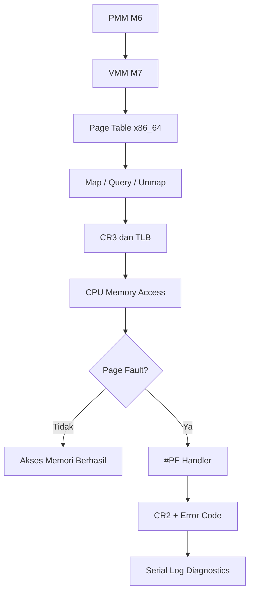

# Template Laporan Praktikum Sistem Operasi Lanjut — MCSOS

**Nama file laporan:** `laporan_praktikum_[M7]_[2583207073007].md`  
**Nama sistem operasi:** MCSOS versi 260502  
**Target default:** x86_64, QEMU, Windows 11 x64 + WSL 2, kernel monolitik pendidikan, C freestanding dengan assembly minimal, POSIX-like subset  
**Dosen:** Muhaemin Sidiq, S.Pd., M.Pd.  
**Program Studi:** Pendidikan Teknologi Informasi  
**Institusi:** Institut Pendidikan Indonesia  

> Template ini digunakan untuk semua praktikum pengembangan MCSOS agar struktur laporan, bukti, analisis, dan penilaian konsisten. Ganti seluruh teks bertanda `[isi ...]` dengan data praktikum sebenarnya. Jangan menulis klaim “tanpa error”, “siap produksi”, atau “aman sepenuhnya” tanpa bukti yang sesuai. Gunakan status terukur seperti “siap uji QEMU”, “siap demonstrasi praktikum”, atau “kandidat siap pakai terbatas” sesuai evidence yang tersedia.

---

## 0. Metadata Laporan

| Atribut | Isi |
|---|---|
| Kode praktikum | `[M7]` |
| Judul praktikum | `[Virtual Memory Manager (VMM) Core dan Page Fault Diagnostics]` |
| Jenis pengerjaan | `[Individu]` |
| Nama mahasiswa | `[Salma Rahayu]` |
| NIM | `[2583207073007]` |
| Kelas | `[PTI 1-A]` |
| Nama kelompok | `[isi jika kelompok]` |
| Anggota kelompok | `[nama, NIM, peran ringkas]` |
| Tanggal praktikum | `[YYYY-MM-DD]` |
| Tanggal pengumpulan | `[YYYY-MM-DD]` |
| Repository | `https://github.com/amaaarhyu078-creator/mcsos-.git` |
|---|---|
| Branch | `praktikum/m7-vmm` |
| Commit awal | `684276e` |
| Commit akhir | `517f6b5` |
| Status readiness yang diklaim | `siap uji QEMU` |

---

## 1. Sampul

# Laporan Praktikum `[M7]`  
## `[Virtual Memory Manager (VMM) Core dan Page Fault Diagnostics]`

Disusun oleh:

| Nama | NIM | Kelas | Peran |
|---|---|---|---|
| `[Salma Rahayu]` | `[2583207073007]` | `[PTI 1A]` | `[individu]` |
| `[opsional]` | `[opsional]` | `[opsional]` | `[opsional]` |

Dosen Pengampu: **Muhaemin Sidiq, S.Pd., M.Pd.**  
Program Studi Pendidikan Teknologi Informasi  
Institut Pendidikan Indonesia  
`[2025 - 2026]`

---

## 2. Pernyataan Orisinalitas dan Integritas Akademik

Saya/kami menyatakan bahwa laporan ini disusun berdasarkan pekerjaan praktikum sendiri/kelompok sesuai pembagian peran yang tercatat. Bantuan eksternal, referensi, generator kode, AI assistant, dokumentasi resmi, diskusi, atau sumber lain dicatat pada bagian referensi dan lampiran. Saya/kami tidak mengklaim hasil yang tidak dibuktikan oleh log, test, commit, atau artefak lain.

| Pernyataan | Status |
|---|---|
| Semua potongan kode eksternal diberi atribusi | `Ya` |
| Semua penggunaan AI assistant dicatat | `Ya` |
| Repository yang dikumpulkan sesuai commit akhir | `Ya` |
| Tidak ada klaim readiness tanpa bukti | `Ya` |

Catatan penggunaan bantuan eksternal:

```text
[Alat:
- ChatGPT (OpenAI)
- Dokumentasi resmi Git
- Dokumentasi resmi Clang/LLVM
- Dokumentasi resmi GDB
- Dokumentasi resmi QEMU
- Dokumentasi Limine

Prompt ringkas:
- Analisis error build dan linker.
- Analisis output host unit test M7.
- Analisis output QEMU dan GDB.
- Penyusunan laporan praktikum sesuai template.

Sumber:
- ChatGPT
- Dokumentasi resmi Git
- Dokumentasi resmi LLVM/Clang
- Dokumentasi resmi GDB
- Dokumentasi resmi QEMU
- Dokumentasi Limine

Bagian yang dibantu:
- Analisis debugging.
- Penjelasan konsep PMM dan VMM.
- Penyusunan dokumentasi dan laporan.

Verifikasi mandiri yang dilakukan:
- Menjalankan make build.
- Menjalankan make iso.
- Menjalankan make check-m7.
- Menjalankan scripts/grade_m7.sh.
- Menjalankan QEMU smoke test.
- Menjalankan GDB workflow.
- Memverifikasi commit dan push ke GitHub.]
```

---

## 3. Tujuan Praktikum

Tuliskan tujuan teknis dan konseptual praktikum. Tujuan harus dapat diuji.

1. `[Tujuan teknis 1: mengimplementasikan Virtual Memory Manager (VMM) awal berbasis page table 4-level x86_64 yang mampu mengelola translasi alamat virtual ke alamat fisik.]`
2. `[Tujuan teknis 2: menggunakan frame fisik dari PMM M6 untuk membangun page table baru serta menyediakan API vmm_space_init(), vmm_map_page(), vmm_query_page(), dan vmm_unmap_page().]`
3. `[Tujuan konseptual 1: menjelaskan konsep alamat canonical x86_64 48-bit, alignment 4 KiB, struktur page table, invalidasi TLB menggunakan invlpg, serta mekanisme page fault pada sistem operasi.]`
4. `[Tujuan validasi: memvalidasi implementasi menggunakan host unit test, audit nm -u, audit objdump, QEMU smoke test, workflow GDB, serta menyimpan log build, log pengujian, disassembly evidence, dan screenshot hasil praktikum.]`

---

## 4. Capaian Pembelajaran Praktikum

Setelah praktikum ini, mahasiswa mampu:

| CPL/CPMK praktikum | Bukti yang harus ditunjukkan |
|---|---|
| `[Menjelaskan translasi virtual address x86_64 melalui PML4, PDPT, PD, dan PT serta menjelaskan peran CR3 sebagai basis fisik page-table hierarchy.]` | `[Penjelasan pada dasar teori, desain teknis VMM, source code vmm.c dan vmm.h, serta hasil analisis GDB.]` |
| `[Menjelaskan hubungan antara PMM dan VMM, kebutuhan direct map/HHDM untuk mengakses page table fisik, serta perbedaan physical frame allocation dan virtual mapping.]` | `[Analisis desain teknis, integrasi PMM M6 dengan VMM M7, dan pembahasan arsitektur memori kernel.]` |
| `[Mengimplementasikan validasi alamat canonical 48-bit, validasi alignment 4 KiB, operasi map/query/unmap halaman 4 KiB, serta mencegah remap virtual address yang sudah present.]` | `[Host unit test M7, source code VMM, log make check-m7, dan hasil grade_m7.sh.]` |
| `[Menggunakan primitive arsitektural invlpg, read_cr2, read_cr3, dan write_cr3 untuk mendukung manajemen memori virtual pada x86_64.]` | `[Audit objdump, audit nm -u, dan bukti disassembly object VMM.]` |
| `[Menjelaskan page fault diagnostics termasuk present/protection, write/read, user/supervisor, reserved bit, dan instruction fetch serta melakukan diagnosis menggunakan QEMU dan GDB.]` | `[Log QEMU smoke test, page fault diagnostics, workflow GDB, dan analisis hasil debugging.]` |
| `[Menghasilkan bukti host unit test, freestanding compile, object audit, disassembly audit, dan integrasi kernel sesuai kriteria validasi M7.]` | `[Log build, make check-m7, nm -u, objdump, grade_m7.sh, screenshot, dan commit repository.]` |

---

## 5. Peta Milestone MCSOS

Centang milestone yang menjadi fokus laporan ini. Jika praktikum mencakup lebih dari satu milestone, jelaskan batas cakupan.

| Milestone | Fokus | Status dalam laporan |
|---|---|---|
| M0 | Requirements, governance, baseline arsitektur | `[ ] tidak dibahas / [ ] dibahas / [V] selesai praktikum` |
| M1 | Toolchain reproducible, Git, QEMU, GDB, metadata build | `[ ] tidak dibahas / [ ] dibahas / [V] selesai praktikum` |
| M2 | Boot image, kernel ELF64, early console | `[ ] tidak dibahas / [ ] dibahas / [V] selesai praktikum` |
| M3 | Panic path, linker map, GDB, observability awal | `[ ] tidak dibahas / [ ] dibahas / [V] selesai praktikum` |
| M4 | Trap, exception, interrupt, timer | `[ ] tidak dibahas / [ ] dibahas / [V] selesai praktikum` |
| M5 | PMM, VMM, page table, kernel heap | `[ ] tidak dibahas / [ ] dibahas / [V] selesai praktikum` |
| M6 | Thread, scheduler, synchronization | `[ ] tidak dibahas / [ ] dibahas / [V] selesai praktikum` |
| M7 | Syscall ABI dan user program loader | `[ ] tidak dibahas / [V] dibahas / [ ] selesai praktikum` |
| M8 | VFS, file descriptor, ramfs | `[V] tidak dibahas / [ ] dibahas / [ ] selesai praktikum` |
| M9 | Block layer dan device model | `[V] tidak dibahas / [ ] dibahas / [ ] selesai praktikum` |
| M10 | Persistent filesystem, mcsfs/ext2-like, recovery | `[V] tidak dibahas / [ ] dibahas / [ ] selesai praktikum` |
| M11 | Networking stack, packet parsing, UDP/TCP subset | `[V] tidak dibahas / [ ] dibahas / [ ] selesai praktikum` |
| M12 | Security model, capability/ACL, syscall fuzzing, hardening | `[V] tidak dibahas / [ ] dibahas / [ ] selesai praktikum` |
| M13 | SMP, scalability, lock stress, NUMA-aware preparation | `[V] tidak dibahas / [ ] dibahas / [ ] selesai praktikum` |
| M14 | Framebuffer, graphics console, visual regression | `[V] tidak dibahas / [ ] dibahas / [ ] selesai praktikum` |
| M15 | Virtualization/container subset | `[V] tidak dibahas / [ ] dibahas / [ ] selesai praktikum` |
| M16 | Observability, update/rollback, release image, readiness review | `[V] tidak dibahas / [ ] dibahas / [ ] selesai praktikum` |

Batas cakupan praktikum:

```text
[Praktikum M7 mencakup implementasi Virtual Memory Manager (VMM) awal berbasis page table 4-level x86_64, validasi alamat canonical 48-bit, validasi alignment 4 KiB, operasi map/query/unmap halaman 4 KiB, primitive arsitektural invlpg, read_cr2, read_cr3, write_cr3, host unit test deterministik, audit object freestanding menggunakan nm -u, audit disassembly menggunakan objdump, integrasi awal dengan PMM M6, serta page fault diagnostics menggunakan CR2 dan error code exception #PF.]

[Praktikum ini tidak mencakup aktivasi page table baru menggunakan write_cr3() pada sistem berjalan, demand paging, copy-on-write, swapping, user space process, context switching address space, TLB shootdown SMP, recursive page table mapping, W^X enforcement penuh, NX policy enforcement, KASLR, maupun mekanisme recovery page fault.]

[Hasil praktikum dapat diklaim siap host-test, audit statis, debugging, dan uji QEMU awal, tetapi tidak dapat diklaim sebagai implementasi virtual memory production-ready atau sistem operasi dengan isolasi memori penuh.]
```

---

## 6. Dasar Teori Ringkas

Tuliskan teori yang langsung diperlukan untuk memahami praktikum. Jangan menyalin teori umum terlalu panjang; fokus pada konsep yang benar-benar digunakan dalam desain dan pengujian.

### 6.1 Virtual Memory pada x86_64

```text
[Virtual Memory Manager (VMM) bertugas mengelola translasi alamat virtual menjadi alamat fisik menggunakan struktur page table yang disediakan oleh arsitektur x86_64. Dengan virtual memory, kernel dapat menggunakan ruang alamat virtual yang terpisah dari lokasi fisik sebenarnya.]
```

### 6.2 Hierarki Page Table 4-Level

```text
[Pada x86_64, translasi alamat virtual dilakukan melalui empat level page table, yaitu PML4 (Page Map Level 4), PDPT (Page Directory Pointer Table), PD (Page Directory), dan PT (Page Table). Setiap level berisi 512 entri dan digunakan untuk menemukan frame fisik yang berisi halaman memori tujuan.]
```

### 6.3 Canonical Address dan Alignment 4 KiB

```text
[Arsitektur x86_64 menggunakan alamat virtual canonical 48-bit. Virtual address yang tidak memenuhi aturan canonical harus ditolak oleh VMM. Selain itu, virtual address dan physical address yang digunakan untuk mapping halaman harus memiliki alignment 4 KiB sesuai ukuran halaman standar.]
```

### 6.4 Physical Memory Manager dan Virtual Memory Manager

```text
[Physical Memory Manager (PMM) bertanggung jawab menyediakan frame fisik kosong, sedangkan Virtual Memory Manager (VMM) bertanggung jawab membuat hubungan antara virtual address dan physical frame tersebut melalui page table. PMM mengelola alokasi frame, sedangkan VMM mengelola translasi alamat.]
```

### 6.5 Register CR2 dan CR3

```text
[CR3 menyimpan alamat fisik root page table yang aktif dan digunakan prosesor sebagai titik awal translasi alamat virtual. CR2 digunakan untuk menyimpan alamat virtual yang menyebabkan page fault sehingga membantu proses diagnosis kesalahan memori.]
```

### 6.6 Translation Lookaside Buffer (TLB)

```text
[TLB merupakan cache translasi alamat yang digunakan prosesor untuk mempercepat akses memori. Setelah sebuah mapping dihapus atau diubah, entri TLB yang terkait harus dibersihkan menggunakan instruksi invlpg agar prosesor tidak menggunakan translasi yang sudah tidak valid.]
```

### 6.7 Page Fault Exception

```text
[Page Fault merupakan exception x86_64 dengan vector 14 (#PF) yang terjadi ketika prosesor tidak dapat menyelesaikan translasi alamat atau mendeteksi pelanggaran akses memori. Informasi diagnosis diperoleh dari CR2 dan error code yang memuat status present/protection, write/read, user/supervisor, reserved bit, dan instruction fetch.]
```

### 6.1 Konsep Sistem Operasi yang Diuji

```text
[Jelaskan konsep utama: bootloader, ELF, linker script, trap frame, PMM, VMM, scheduler, VFS, driver, networking, security, atau topik lain sesuai praktikum.]
```

### 6.2 Konsep Arsitektur x86_64 yang Relevan

| Konsep | Relevansi pada praktikum | Bukti/verifikasi |
|---|---|---|
| `[Paging 4-level (PML4, PDPT, PD, PT)]` | `[Digunakan sebagai dasar implementasi Virtual Memory Manager untuk melakukan translasi virtual address ke physical address melalui struktur page table x86_64.]` | `[Source code vmm.c dan vmm.h, host unit test M7, hasil make check-m7.]` |
| `[CR3 Register]` | `[Digunakan sebagai penunjuk root page table aktif dan menjadi dasar pengelolaan address space pada x86_64.]` | `[Implementasi vmm_read_cr3() dan vmm_write_cr3(), audit objdump, workflow GDB.]` |
| `[CR2 Register]` | `[Digunakan untuk memperoleh alamat virtual yang menyebabkan page fault sehingga membantu proses diagnosis kesalahan mapping.]` | `[Implementasi vmm_read_cr2(), page fault diagnostics pada QEMU, workflow GDB.]` |
| `[Translation Lookaside Buffer (TLB)]` | `[Menyimpan cache translasi alamat sehingga perlu dilakukan invalidasi menggunakan instruksi invlpg setelah unmap halaman.]` | `[Implementasi vmm_invalidate_page(), audit objdump yang menunjukkan instruksi invlpg.]` |
| `[Page Fault Exception (#PF)]` | `[Digunakan untuk mendeteksi dan mendiagnosis kegagalan translasi alamat atau pelanggaran akses memori melalui error code dan CR2.]` | `[Log QEMU page fault diagnostics, output serial log, implementasi handler vector 14.]` |
| `[Canonical Address 48-bit]` | `[Digunakan untuk memastikan virtual address yang dipetakan berada pada rentang alamat valid sesuai spesifikasi x86_64.]` | `[Host unit test canonical address, validasi vmm_is_canonical().]` |

### 6.3 Konsep Implementasi Freestanding

| Aspek | Keputusan praktikum |
|---|---|
| Bahasa | `[C17 freestanding dan assembly x86_64]` |
| Runtime | `[tanpa hosted libc, menggunakan implementasi fungsi memori internal dan kernel entry point sendiri]` |
| ABI | `[x86_64 System V ABI untuk target freestanding kernel]` |
| Compiler flags kritis | `[-ffreestanding, -fno-builtin, -fno-stack-protector, -fno-stack-check, -fno-pic, -fno-pie, -mno-red-zone, -mcmodel=kernel, -nostdlib (saat linking)]` |
| Risiko undefined behavior | `[pointer tidak valid, akses page table yang belum dipetakan, alignment 4 KiB yang salah, integer overflow pada perhitungan alamat, penggunaan alamat noncanonical, dan dereference physical address tanpa mapping yang valid]` |

### 6.4 Referensi Teori yang Digunakan

| No. | Sumber | Bagian yang digunakan | Alasan relevansi |
|---|---|---|---|
| `[1]` | `[Intel® 64 and IA-32 Architectures Software Developer's Manual]` | `[Volume 3A: Paging, Control Registers (CR2/CR3), Page Fault Exception (#PF)]` | `[Menjadi referensi utama implementasi page table x86_64, translasi alamat virtual, register CR2/CR3, dan diagnosis page fault.]` |
| `[2]` | `[Limine Boot Protocol Documentation]` | `[Memory Map Request dan Higher Half Direct Map (HHDM)]` | `[Digunakan untuk memahami informasi memori dari bootloader dan integrasi PMM/VMM pada kernel.]` |
| `[3]` | `[OSDev Wiki]` | `[Page Tables, Paging, Higher Half Kernel, Page Fault]` | `[Memberikan penjelasan praktis mengenai struktur page table x86_64 dan mekanisme virtual memory pada kernel.]` |
| `[4]` | `[AMD64 Architecture Programmer’s Manual Volume 2: System Programming]` | `[Memory Management dan Paging]` | `[Digunakan sebagai referensi tambahan mengenai manajemen memori virtual pada arsitektur x86_64.]` |
| `[5]` | `[Dokumentasi Praktikum MCSOS M7 Virtual Memory Manager]` | `[Goals, Host Test, Page Fault Diagnostics, QEMU dan GDB Workflow]` | `[Menjadi acuan kebutuhan fungsional, pengujian, dan kriteria kelulusan praktikum.]` |

---

## 7. Lingkungan Praktikum

### 7.1 Host dan Target

| Komponen | Nilai |
|---|---|
| Host OS | `[Windows 11 x64 dengan WSL 2]` |
| Lingkungan build | `[WSL 2 Ubuntu 26.04 LTS]` |
| Target ISA | `x86_64` |
| Target ABI | `[x86_64-unknown-none-elf]` |
| Emulator | `[QEMU emulator version 10.2.1]` |
| Firmware emulator | `[Tidak digunakan (boot melalui Limine ISO)]` |
| Debugger | `[GNU gdb 17.1]` |
| Build system | `[GNU Make 4.4.1]` |
| Bahasa utama | `[C17 freestanding]` |
| Assembly | `[GNU Assembler (GAS) melalui Clang/LLVM 21.1.8]` |

### 7.2 Versi Toolchain

Tempel output versi toolchain berikut. Jalankan dari clean shell WSL.

```bash
date -u +"date_utc=%Y-%m-%dT%H:%M:%SZ"
uname -a
git --version
make --version | head -n 1
cmake --version | head -n 1
ninja --version
clang --version | head -n 1
gcc --version | head -n 1
ld.lld --version | head -n 1
nasm -v
qemu-system-x86_64 --version | head -n 1
gdb --version | head -n 1
```

Output:

```text
[date_utc=2026-06-03T09:37:51Z
Linux DESKTOP-S5LUA56 6.6.114.1-microsoft-standard-WSL2 #1 SMP PREEMPT_DYNAMIC Mon Dec 1 20:46:23 UTC 2025 x86_64 GNU/Linux
git version 2.53.0
GNU Make 4.4.1
cmake version 4.2.3
1.13.2
Ubuntu clang version 21.1.8 (6ubuntu1)
gcc (Ubuntu 15.2.0-16ubuntu1) 15.2.0
Ubuntu LLD 21.1.8 (compatible with GNU linkers)
NASM version 3.01
QEMU emulator version 10.2.1 (Debian 1:10.2.1+ds-1ubuntu3)
GNU gdb (Ubuntu 17.1-2ubuntu1) 17.1]

```

### 7.3 Lokasi Repository

| Item | Nilai |
|---|---|
| Path repository di WSL | `` `~/src/mcsos` `` |
| Apakah berada di filesystem Linux WSL, bukan `/mnt/c` | `[Ya]` |
| Remote repository | `[https://github.com/amaaarhyu078-creator/mcsos-.git]` |
| Branch | `[praktikum/m7-vmm]` |
| Commit hash awal | `` `684276e` `` |
| Commit hash akhir | `` `517f6b5` `` |

---

## 8. Repository dan Struktur File

### 8.1 Struktur Direktori yang Relevan

Tampilkan hanya direktori dan file yang relevan dengan praktikum.

```text
[mcsos/
├── Makefile
├── linker.ld
├── kernel/
│   ├── arch/
│   │   └── x86_64/
│   ├── core/
│   │   ├── kmain.c
│   │   ├── pmm.c
│   │   ├── trap.c
│   │   └── vmm.c
│   ├── include/
│   │   └── mcsos/
│   │       └── kernel/
│   │           └── vmm.h
│   └── lib/
│       └── memory.c
├── tests/
│   ├── test_pmm_host.c
│   └── test_vmm_host.c
├── scripts/
│   ├── grade_m7.sh
│   ├── m7_gdb.cmd
│   └── m7_preflight.sh
├── build/
│   ├── kernel.elf
│   ├── mcsos.iso
│   ├── test_vmm_host
│   ├── vmm.o
│   └── evidence/
│       ├── m7_make_check.log
│       ├── m7_vmm_nm_undefined.txt
│       └── m7_vmm_objdump.txt
└── evidence/
    └── screenshots/
        ├── m7-make-check-pass.png
        ├── m7-grade-script-pass.png
        ├── m7-objdump-invlpg.png
        ├── m7-objdump-cr-registers.png
        └── m7-qemu-page-fault-diagnostics.png]
```

### 8.2 File yang Dibuat atau Diubah

| File | Jenis perubahan | Alasan perubahan | Risiko |
|---|---|---|---|
| `[kernel/core/vmm.c]` | `[baru]` | `[Implementasi Virtual Memory Manager (VMM) meliputi map, query, unmap, validasi alamat canonical, validasi alignment, dan primitive CR2/CR3.]` | `[tinggi; kesalahan dapat menyebabkan page fault, corrupt page table, atau kernel panic.]` |
| `[kernel/include/mcsos/kernel/vmm.h]` | `[baru]` | `[Menyediakan API, struktur data, konstanta, dan kontrak VMM yang digunakan oleh kernel dan host test.]` | `[sedang; kesalahan definisi API dapat menyebabkan kegagalan build atau inkonsistensi implementasi.]` |
| `[tests/test_vmm_host.c]` | `[baru]` | `[Menyediakan host unit test untuk memverifikasi operasi VMM secara deterministik tanpa QEMU.]` | `[rendah; hanya mempengaruhi validasi dan tidak mempengaruhi runtime kernel.]` |
| `[kernel/core/kmain.c]` | `[ubah]` | `[Menambahkan integrasi awal antara PMM dan VMM serta inisialisasi struktur VMM pada kernel.]` | `[tinggi; kesalahan integrasi dapat menyebabkan kegagalan boot atau page fault saat startup.]` |
| `[kernel/core/trap.c]` | `[ubah]` | `[Menambahkan page fault diagnostics menggunakan CR2 dan error code exception #PF.]` | `[sedang; kesalahan dapat menghambat proses debugging dan diagnosis fault.]` |
| `[Makefile]` | `[ubah]` | `[Menambahkan target build, host test, dan audit yang diperlukan untuk M7.]` | `[sedang; kesalahan dapat menyebabkan proses build atau pengujian gagal.]` |
| `[scripts/grade_m7.sh]` | `[baru]` | `[Mengotomatisasi proses validasi M7 sesuai checkpoint praktikum.]` | `[rendah; hanya mempengaruhi proses verifikasi.]` |
| `[scripts/m7_preflight.sh]` | `[baru]` | `[Melakukan pemeriksaan awal sebelum build dan pengujian M7.]` | `[rendah; tidak mempengaruhi runtime kernel.]` |
| `[scripts/m7_gdb.cmd]` | `[baru]` | `[Menyediakan workflow debugging menggunakan GDB untuk M7.]` | `[rendah; hanya digunakan saat debugging.]` |

### 8.3 Ringkasan Diff

```bash
git status --short
git diff --stat
git log --oneline -n 5
```

Output:

```text
[517f6b5 (HEAD -> praktikum/m7-vmm, origin/praktikum/m7-vmm, praktikum/m6-pmm) Implement M7 virtual memory manager core and diagnostics
ccee310 (origin/praktikum/m6-pmm) Integrate M6 PMM with Limine memory map
22f41cd Add M6 physical memory manager
b8f2ffe (origin/praktikum/m5-timer-irq, praktikum/m5-timer-irq) Add M0-M5 evidence screenshots
3e3fc91 docs: add practicum evidence screenshots]
```

---

## 9. Desain Teknis

### 9.1 Masalah yang Diselesaikan

```text
[Kernel telah memiliki Physical Memory Manager (PMM) pada M6 untuk mengelola frame fisik, namun belum memiliki Virtual Memory Manager (VMM) yang dapat membangun dan mengelola page table x86_64. Akibatnya kernel belum dapat membuat mapping virtual-ke-fisik secara terstruktur, belum dapat memvalidasi alamat canonical dan alignment halaman, serta belum memiliki mekanisme diagnosis page fault yang memadai untuk melokalisasi kesalahan translasi alamat. Praktikum M7 menyelesaikan masalah tersebut dengan menyediakan API VMM, validasi alamat, operasi map/query/unmap halaman 4 KiB, primitive CR2/CR3 dan INVLPG, serta page fault diagnostics untuk mendukung debugging dan pengembangan subsistem memori berikutnya.]
```

### 9.2 Keputusan Desain

| Keputusan | Alternatif yang dipertimbangkan | Alasan memilih | Konsekuensi |
|---|---|---|---|
| `[Mengimplementasikan VMM berbasis page table 4-level x86_64.]` | `[Menggunakan abstraksi memori yang tidak langsung merepresentasikan struktur page table perangkat keras.]` | `[Sesuai dengan mekanisme paging x86_64 dan memudahkan integrasi dengan hardware.]` | `[Implementasi menjadi lebih kompleks karena harus mengelola setiap level page table.]` |
| `[Menggunakan frame fisik yang disediakan PMM M6 untuk alokasi page table.]` | `[Menggunakan allocator terpisah khusus VMM.]` | `[Menghindari duplikasi pengelolaan memori fisik dan menjaga konsistensi ownership frame.]` | `[VMM menjadi bergantung pada PMM yang berfungsi dengan benar.]` |
| `[Menolak virtual address noncanonical dan alamat yang tidak aligned 4 KiB.]` | `[Menerima seluruh alamat dan mengandalkan fault saat runtime.]` | `[Kesalahan dapat dideteksi lebih awal melalui validasi API.]` | `[Diperlukan pemeriksaan tambahan pada setiap operasi mapping.]` |
| `[Menolak remap terhadap virtual address yang sudah memiliki mapping.]` | `[Mengizinkan overwrite terhadap entri page table yang sudah ada.]` | `[Mencegah perubahan mapping yang tidak disengaja dan menjaga invariant VMM.]` | `[Caller harus melakukan unmap terlebih dahulu sebelum membuat mapping baru.]` |
| `[Melakukan invalidasi TLB menggunakan instruksi invlpg setelah unmap.]` | `[Tidak melakukan invalidasi TLB atau melakukan reload CR3 penuh.]` | `[Lebih efisien dan memastikan translasi lama tidak digunakan kembali.]` | `[Implementasi menjadi spesifik terhadap arsitektur x86_64.]` |
| `[Menambahkan page fault diagnostics menggunakan CR2 dan error code exception #PF.]` | `[Langsung panic tanpa informasi diagnosis.]` | `[Mempermudah pelacakan penyebab kesalahan mapping saat debugging.]` | `[Menambah kode penanganan exception dan output log.]` |

### 9.3 Arsitektur Ringkas

Tambahkan diagram ASCII atau Mermaid. Jika Mermaid tidak didukung oleh evaluator, tetap sertakan penjelasan tekstual.



Penjelasan diagram:

```text
[VMM M7 menggunakan frame fisik yang disediakan PMM M6 untuk membangun dan mengelola page table x86_64. Operasi map, query, dan unmap dilakukan melalui API VMM dengan validasi alamat canonical dan alignment 4 KiB. Setelah perubahan mapping, VMM dapat melakukan invalidasi TLB menggunakan instruksi invlpg. Saat CPU mengakses alamat virtual, translasi dilakukan menggunakan page table yang ditunjuk oleh CR3. Jika terjadi kegagalan translasi atau pelanggaran akses memori, prosesor menghasilkan exception Page Fault (#PF). Handler page fault membaca CR2 dan error code, kemudian mencetak informasi diagnosis ke serial log untuk membantu proses debugging.]
```

### 9.4 Kontrak Antarmuka

| Antarmuka | Pemanggil | Penerima | Precondition | Postcondition | Error path |
|---|---|---|---|---|---|
| `[vmm_space_init()]` | `[Kernel initialization (kmain.c) dan host unit test.]` | `[Virtual Memory Manager (vmm.c).]` | `[Root page table telah dialokasikan, callback alloc_frame(), free_frame(), dan phys_to_virt() tersedia dan valid.]` | `[Struktur vmm_space berhasil diinisialisasi dan siap digunakan untuk operasi mapping.]` | `[Mengembalikan VMM_ERR_INVAL apabila parameter NULL, callback tidak tersedia, atau root page table tidak valid.]` |
| `[vmm_map_page()]` | `[Kernel, integrasi PMM-VMM, dan host unit test.]` | `[Virtual Memory Manager (vmm.c).]` | `[Virtual address harus canonical, virtual dan physical address harus aligned 4 KiB, page table valid, dan virtual address belum memiliki mapping.]` | `[Page table diperbarui sehingga virtual address menunjuk ke physical frame yang diberikan dengan atribut yang ditentukan.]` | `[VMM_ERR_INVAL untuk parameter tidak valid, VMM_ERR_EXISTS jika mapping sudah ada, dan VMM_ERR_NOMEM jika alokasi page table baru gagal.]` |
| `[vmm_query_page()]` | `[Kernel dan host unit test.]` | `[Virtual Memory Manager (vmm.c).]` | `[Virtual address canonical dan struktur vmm_space valid.]` | `[Informasi mapping (virtual address, physical address, dan flags) dikembalikan melalui struktur vmm_mapping.]` | `[VMM_ERR_NOT_FOUND apabila virtual address belum dipetakan.]` |
| `[vmm_unmap_page()]` | `[Kernel dan host unit test.]` | `[Virtual Memory Manager (vmm.c).]` | `[Virtual address canonical dan mapping yang akan dihapus benar-benar ada.]` | `[Entri page table dihapus dan translasi lama tidak lagi valid.]` | `[VMM_ERR_NOT_FOUND apabila mapping tidak ditemukan. Setelah berhasil, VMM melakukan invalidasi TLB menggunakan instruksi invlpg.]` |
| `[vmm_read_cr2()]` | `[Page fault diagnostics dan proses debugging.]` | `[Lapisan arsitektur x86_64.]` | `[Kernel berjalan pada mode long mode x86_64.]` | `[Nilai register CR2 yang berisi alamat virtual penyebab page fault berhasil dibaca.]` | `[Tidak memiliki error path eksplisit karena hanya membaca register prosesor.]` |
| `[vmm_read_cr3()]` | `[Kernel, debugging GDB, dan verifikasi page table.]` | `[Lapisan arsitektur x86_64.]` | `[Kernel berjalan pada mode long mode x86_64.]` | `[Nilai CR3 yang menunjukkan root page table aktif berhasil diperoleh.]` | `[Tidak memiliki error path eksplisit.]` |
| `[vmm_write_cr3()]` | `[Kernel VMM (belum diaktifkan pada tugas wajib M7).]` | `[Lapisan arsitektur x86_64.]` | `[Root page table baru telah valid, seluruh mapping kernel penting sudah tersedia, dan stack kernel masih dapat diakses setelah perpindahan.]` | `[CPU menggunakan hierarchy page table baru sebagai address space aktif.]` | `[Kesalahan konfigurasi dapat menyebabkan page fault, double fault, atau triple fault sehingga sistem berhenti.]` |
| `[vmm_invalidate_page()]` | `[vmm_unmap_page() dan operasi pemeliharaan page table.]` | `[Lapisan arsitektur x86_64.]` | `[Virtual address yang akan diinvalidasi valid.]` | `[Entri TLB untuk virtual address tersebut dibersihkan sehingga CPU tidak menggunakan translasi lama.]` | `[Tidak memiliki error path eksplisit.]` |
| `[x86_64_trap_dispatch()]` | `[Interrupt Service Routine (ISR) x86_64.]` | `[Trap subsystem (trap.c).]` | `[Trap frame valid dan interrupt descriptor table telah terpasang.]` | `[Trap atau exception dianalisis dan diteruskan ke handler yang sesuai.]` | `[Exception fatal akan berakhir pada kernel panic.]` |
| `[m7_page_fault_dump()]` | `[x86_64_trap_dispatch() ketika vector 14 (#PF) diterima.]` | `[Page fault diagnostics subsystem.]` | `[Trap frame valid dan exception yang diterima merupakan page fault.]` | `[Informasi diagnosis berupa CR2, error code, RIP, serta atribut fault dicetak ke serial log.]` | `[Setelah diagnosis selesai, kernel dapat melakukan panic atau halt sesuai kebijakan praktikum M7.]` |

### 9.5 Struktur Data Utama

| Struktur data | Field penting | Ownership | Lifetime | Invariant |
|---|---|---|---|---|
| `` `[struct vmm_space]` `` | `[root_paddr, ctx, alloc_frame, free_frame, phys_to_virt]` | `[Dimiliki oleh kernel dan digunakan oleh subsistem VMM.]` | `[Dibuat saat inisialisasi VMM dan tetap hidup selama address space digunakan.]` | `[root_paddr harus menunjuk ke root page table yang valid, callback allocator tidak boleh NULL, dan seluruh operasi map/query/unmap harus menggunakan instance yang telah berhasil diinisialisasi.]` |
| `` `[struct vmm_mapping]` `` | `[vaddr, paddr, flags]` | `[Dimiliki sementara oleh pemanggil API VMM.]` | `[Dibuat saat query mapping dan digunakan selama proses pemeriksaan hasil translasi.]` | `[vaddr harus canonical, paddr harus aligned 4 KiB, dan flags harus merepresentasikan atribut page table yang valid.]` |
| `` `[struct pmm_state]` `` | `[bitmap frame fisik, jumlah frame, jumlah frame bebas]` | `[Dimiliki oleh Physical Memory Manager (PMM) M6.]` | `[Dibuat saat inisialisasi PMM menggunakan memory map dari Limine dan hidup selama kernel berjalan.]` | `[Satu frame fisik hanya boleh memiliki satu status ownership pada satu waktu dan jumlah frame bebas harus konsisten dengan bitmap.]` |
| `` `[x86_64_trap_frame_t]` `` | `[vector, error_code, rip, rsp, rflags, register umum]` | `[Dimiliki oleh subsistem trap/exception x86_64.]` | `[Dibuat otomatis saat CPU memasuki handler exception atau interrupt.]` | `[Isi trap frame harus mencerminkan keadaan CPU saat exception terjadi dan tidak boleh dimodifikasi secara sembarangan selama proses diagnosis.]` |
| `` `[Page Table Entry (PTE)]` `` | `[physical address, present bit, writable bit, user bit, NX bit, dan flag lainnya]` | `[Dimiliki oleh VMM melalui hierarchy page table.]` | `[Dibuat saat mapping halaman dan dihapus saat unmap.]` | `[Alamat fisik harus dimask menggunakan VMM_PTE_ADDR_MASK, reserved bit tidak boleh aktif, dan mapping yang sudah present tidak boleh dioverwrite tanpa unmap terlebih dahulu.]` |

### 9.6 Invariants

Tuliskan invariant yang harus benar sepanjang eksekusi.

1. `[Setiap virtual address yang berhasil dipetakan harus menunjuk tepat ke satu physical frame yang valid dan tidak boleh memiliki dua mapping berbeda pada entri page table yang sama.]`
2. `[Virtual address yang digunakan oleh API VMM harus merupakan alamat canonical x86_64 48-bit dan seluruh virtual maupun physical address yang dipetakan harus aligned 4 KiB.]`
3. `[VMM tidak boleh melakukan overwrite terhadap mapping yang sudah present; pemanggil harus melakukan unmap terlebih dahulu sebelum membuat mapping baru pada virtual address yang sama.]`
4. `[Setiap operasi unmap yang berhasil harus menginvalidasi translasi lama menggunakan invlpg agar TLB tidak menyimpan entri yang sudah tidak berlaku.]`
5. `[Root page table yang disimpan dalam struct vmm_space harus selalu menunjuk ke hierarchy page table yang valid selama address space masih aktif.]`
6. `[Frame fisik yang digunakan sebagai page table harus berasal dari PMM dan ownership frame harus tetap konsisten selama frame tersebut masih digunakan oleh VMM.]`
7. `[Page Table Entry (PTE) tidak boleh mengandung reserved bit yang tidak diizinkan oleh arsitektur x86_64 dan alamat fisik harus dimask menggunakan VMM_PTE_ADDR_MASK.]`
8. `[Ketika exception #PF terjadi, handler page fault harus dapat memperoleh informasi diagnosis dari CR2, error code, dan trap frame sebelum kernel melakukan panic atau halt.]`

### 9.7 Ownership, Locking, dan Concurrency

| Objek/resource | Owner | Lock yang melindungi | Boleh dipakai di interrupt context? | Catatan |
|---|---|---|---|---|
| `[struct pmm_state (PMM)]` | `[Kernel memory subsystem]` | `[none]` | `[Tidak]` | `[Digunakan untuk alokasi dan pelepasan frame fisik. Pada tahap M7 belum ada akses konkuren dari banyak CPU.]` |
| `[struct vmm_space]` | `[Virtual Memory Manager (VMM)]` | `[none]` | `[Tidak]` | `[Digunakan untuk operasi map/query/unmap. Praktikum masih menggunakan model single-core sehingga belum memerlukan sinkronisasi.]` |
| `[Page table hierarchy (PML4/PDPT/PD/PT)]` | `[Virtual Memory Manager (VMM)]` | `[none]` | `[Tidak]` | `[Modifikasi page table dilakukan oleh kode kernel yang terkontrol dan tidak dilakukan dari interrupt handler.]` |
| `[TLB invalidation (invlpg)]` | `[CPU lokal]` | `[none]` | `[Ya]` | `[Instruksi invlpg hanya mempengaruhi CPU yang sedang berjalan dan belum memerlukan mekanisme shootdown SMP.]` |
| `[Trap frame exception (#PF)]` | `[Trap subsystem]` | `[none]` | `[Ya]` | `[Dibuat dan digunakan selama penanganan exception. Tidak dibagikan antar CPU pada tahap ini.]` |
| `[Serial log diagnostics]` | `[Kernel logging subsystem]` | `[none]` | `[Ya]` | `[Digunakan untuk mencetak informasi page fault dan debugging selama praktikum.]` |

Lock order yang berlaku:

```text
[Tidak ada locking eksplisit pada tahap M7. Praktikum diasumsikan berjalan pada lingkungan single-core bootstrap kernel dan sebagian besar operasi VMM dilakukan saat inisialisasi kernel. Oleh karena itu konsistensi data masih dijaga melalui urutan eksekusi yang deterministik dan tidak memerlukan mutex maupun spinlock. Jika sistem dikembangkan menjadi SMP pada tahap berikutnya, operasi PMM, VMM, dan TLB shootdown harus dilindungi menggunakan mekanisme sinkronisasi yang sesuai.]
```

### 9.8 Memory Safety dan Undefined Behavior Risk

| Risiko | Lokasi | Mitigasi | Bukti |
|---|---|---|---|
| `[Out-of-bounds page table access]` | `[kernel/core/vmm.c]` | `[Validasi indeks page table, validasi virtual address canonical, dan pemeriksaan keberadaan entri sebelum diakses.]` | `[Host unit test M7, code review, make check-m7 PASS.]` |
| `[Alignment error pada virtual atau physical address]` | `[vmm_map_page()]` | `[Menggunakan vmm_is_aligned_4k() untuk memverifikasi alignment 4 KiB sebelum mapping dibuat.]` | `[Host test unaligned address PASS.]` |
| `[Dereference physical address yang tidak valid]` | `[phys_to_virt callback dan akses page table]` | `[Seluruh akses page table dilakukan melalui callback phys_to_virt() yang dikontrol oleh kernel.]` | `[Host unit test dan audit implementasi VMM.]` |
| `[Integer overflow atau perhitungan alamat yang salah]` | `[Perhitungan indeks page table pada vmm.c]` | `[Menggunakan tipe uint64_t dan masking alamat dengan VMM_PTE_ADDR_MASK.]` | `[Code review dan keberhasilan host test.]` |
| `[Reserved bit pada Page Table Entry]` | `[Operasi map/query/unmap page table]` | `[Alamat fisik dimask menggunakan VMM_PTE_ADDR_MASK dan hanya flag yang diizinkan yang digunakan.]` | `[QEMU page fault diagnostics dan review implementasi.]` |
| `[TLB stale entry setelah unmap]` | `[vmm_unmap_page()]` | `[Melakukan invalidasi TLB menggunakan instruksi invlpg setelah mapping dihapus.]` | `[Audit objdump menunjukkan instruksi invlpg.]` |
| `[Page fault akibat mapping tidak valid]` | `[Integrasi kernel dan page table]` | `[Menambahkan page fault diagnostics menggunakan CR2, error code, dan trap frame.]` | `[QEMU page fault diagnostics dan workflow GDB.]` |

### 9.9 Security Boundary

| Boundary | Data tidak tepercaya | Validasi yang dilakukan | Failure mode aman |
|---|---|---|---|
| `[Boot handoff dari Limine]` | `[Memory map dan informasi bootloader.]` | `[Pemeriksaan pointer response, validasi entry_count, dan konversi tipe memory region.]` | `[Kernel panic jika data boot tidak valid.]` |
| `[API VMM]` | `[Virtual address, physical address, dan flags yang diberikan pemanggil.]` | `[Validasi canonical address, alignment 4 KiB, dan pemeriksaan duplicate mapping.]` | `[Mengembalikan kode error VMM_ERR_INVAL atau VMM_ERR_EXISTS.]` |
| `[Page table hierarchy]` | `[Entri page table yang dibaca atau dimodifikasi.]` | `[Pemeriksaan present bit, masking alamat fisik, dan validasi struktur hierarchy.]` | `[Operasi gagal dan mengembalikan error tanpa merusak mapping yang sudah ada.]` |
| `[Page Fault Exception (#PF)]` | `[Alamat fault dan error code yang diberikan CPU.]` | `[Pembacaan CR2, error code, RIP, dan trap frame sebelum diagnosis.]` | `[Informasi fault dicetak ke serial log kemudian kernel panic atau halt.]` |
| `[Host Unit Test]` | `[Input uji yang sengaja tidak valid.]` | `[Pengujian canonical address, alignment, duplicate mapping, query, dan unmap.]` | `[Assertion gagal sehingga bug terdeteksi lebih awal.]` |

---

## 10. Langkah Kerja Implementasi

### Langkah 1 — `[Membuat API dan Struktur Dasar Virtual Memory Manager]`

Maksud langkah:

```text
[Menyediakan kontrak antarmuka VMM yang akan digunakan oleh kernel dan host unit test. Pada tahap ini ditentukan struktur data, konstanta, flag page table, kode error, dan deklarasi fungsi yang menjadi dasar implementasi M7.]
```

Perintah:

```bash
sed -n '1,220p' kernel/include/mcsos/kernel/vmm.h
```

Output ringkas:

```text
Terdapat deklarasi struct vmm_space, struct vmm_mapping,
VMM_PTE_PRESENT, VMM_PTE_WRITABLE,
vmm_space_init(),
vmm_map_page(),
vmm_query_page(),
vmm_unmap_page(),
vmm_read_cr2(),
vmm_read_cr3(),
vmm_write_cr3().
```

Artefak yang dihasilkan:

| Artefak | Lokasi | Fungsi |
|---|---|---|
| `[Header VMM]` | `[kernel/include/mcsos/kernel/vmm.h]` | `[Menyediakan API dan kontrak VMM.]` |

Indikator berhasil:

```text
Header berhasil dikompilasi dan dapat digunakan oleh implementasi VMM serta host unit test.
```

---

### Langkah 2 — `[Mengimplementasikan Operasi VMM]`

Maksud langkah:

```text
[Mengimplementasikan validasi alamat canonical, validasi alignment 4 KiB, operasi map/query/unmap, serta pengelolaan page table x86_64.]
```

Perintah:

```bash
make build
```

Output ringkas:

```text
clang ... kernel/core/vmm.c ...
ld.lld ... build/kernel.elf
```

Artefak yang dihasilkan:

| Artefak | Lokasi | Fungsi |
|---|---|---|
| `[Implementasi VMM]` | `[kernel/core/vmm.c]` | `[Implementasi Virtual Memory Manager.]` |

Indikator berhasil:

```text
File vmm.c berhasil dikompilasi tanpa warning maupun error.
```

---

### Langkah 3 — `[Membuat Host Unit Test Deterministik]`

Maksud langkah:

```text
[Membuktikan bahwa fungsi VMM bekerja tanpa memerlukan boot kernel atau QEMU. Pengujian mencakup canonical address, alignment, duplicate mapping, query, dan unmap.]
```

Perintah:

```bash
make check-m7
```

Output ringkas:

```text
M7 VMM host tests PASS
```

Artefak yang dihasilkan:

| Artefak | Lokasi | Fungsi |
|---|---|---|
| `[Host unit test]` | `[tests/test_vmm_host.c]` | `[Memvalidasi perilaku VMM.]` |

Indikator berhasil:

```text
Seluruh assertion pada host unit test lulus tanpa kegagalan.
```

---

### Langkah 4 — `[Melakukan Audit Undefined Symbol]`

Maksud langkah:

```text
[Memastikan object VMM bersifat freestanding dan tidak memiliki ketergantungan terhadap libc atau simbol eksternal yang tidak tersedia pada kernel.]
```

Perintah:

```bash
nm -u build/vmm.o
```

Output ringkas:

```text
(tidak ada output)
```

Artefak yang dihasilkan:

| Artefak | Lokasi | Fungsi |
|---|---|---|
| `[Undefined symbol audit]` | `[build/vmm.o]` | `[Memastikan object freestanding.]` |

Indikator berhasil:

```text
Perintah nm -u tidak menampilkan simbol tak terdefinisi.
```

---

### Langkah 5 — `[Melakukan Audit Disassembly]`

Maksud langkah:

```text
[Memastikan primitive arsitektur x86_64 benar-benar muncul pada object hasil kompilasi.]
```

Perintah:

```bash
objdump -dr build/vmm.o > build/vmm.objdump.txt
grep -q "invlpg" build/vmm.objdump.txt
grep -q "cr3" build/vmm.objdump.txt
```

Output ringkas:

```text
Audit berhasil menemukan instruksi invlpg dan akses register cr3.
```

Artefak yang dihasilkan:

| Artefak | Lokasi | Fungsi |
|---|---|---|
| `[Disassembly audit]` | `[build/vmm.objdump.txt]` | `[Memverifikasi primitive x86_64.]` |

Indikator berhasil:

```text
Instruksi invlpg dan akses CR3 muncul pada hasil disassembly.
```

---

### Langkah 6 — `[Mengintegrasikan VMM dengan Kernel]`

Maksud langkah:

```text
[Menghubungkan subsistem VMM dengan kernel dan PMM sehingga struktur VMM dapat diinisialisasi saat boot.]
```

Perintah:

```bash
make iso
```

Output ringkas:

```text
[M5] ISO generated at build/mcsos.iso
```

Artefak yang dihasilkan:

| Artefak | Lokasi | Fungsi |
|---|---|---|
| `[Kernel ELF]` | `[build/kernel.elf]` | `[Kernel hasil integrasi.]` |
| `[Bootable ISO]` | `[build/mcsos.iso]` | `[Media boot QEMU.]` |

Indikator berhasil:

```text
Kernel ELF dan image ISO berhasil dibentuk tanpa error.
```

---

### Langkah 7 — `[Melakukan QEMU Smoke Test]`

Maksud langkah:

```text
[Memastikan integrasi VMM tidak merusak proses boot kernel dan page fault diagnostics dapat dijalankan.]
```

Perintah:

```bash
qemu-system-x86_64 \
  -machine q35 \
  -cpu max \
  -m 256M \
  -serial stdio \
  -no-reboot \
  -no-shutdown \
  -d int,cpu_reset,guest_errors \
  -D build/qemu-m7.log \
  -cdrom build/mcsos.iso
```

Output ringkas:

```text
[M6] pmm initialized
[M7] #PF page fault
pf_cr2=...
pf_error=...
pf_rip=...
```

Artefak yang dihasilkan:

| Artefak | Lokasi | Fungsi |
|---|---|---|
| `[QEMU log]` | `[build/qemu-m7.log]` | `[Diagnostik runtime kernel.]` |

Indikator berhasil:

```text
Kernel berhasil boot dan page fault diagnostics menampilkan CR2, error code, dan RIP.
```

---

### Langkah 8 — `[Melakukan Verifikasi Menggunakan GDB]`

Maksud langkah:

```text
[Memverifikasi kondisi register CPU dan posisi eksekusi kernel menggunakan debugger.]
```

Perintah:

```bash
gdb -x scripts/m7_gdb.cmd
```

Output ringkas:

```text
Breakpoint 1, kmain ()
info registers cr2 cr3 rip rsp
```

Artefak yang dihasilkan:

| Artefak | Lokasi | Fungsi |
|---|---|---|
| `[GDB command script]` | `[scripts/m7_gdb.cmd]` | `[Automasi debugging M7.]` |

Indikator berhasil:

```text
GDB berhasil terhubung ke QEMU dan dapat membaca register CR2, CR3, RIP, dan RSP.
```

---
---

## 11. Checkpoint Buildable

Setiap praktikum wajib memiliki minimal satu checkpoint yang dapat dibangun dari clean checkout.

| Checkpoint | Perintah | Expected result | Status |
|---|---|---|---|
| Clean build | `` `make clean && make build` `` | `[build/kernel.elf berhasil dibangun tanpa error.]` | `[PASS]` |
| Metadata toolchain | `` `make meta` `` | `[build/meta/toolchain-versions.txt ada.]` | `[PASS]` |
| Image generation | `` `make image` `` | `[build/mcsos.iso ada.]` | `[PASS]` |
| QEMU smoke test | `` `make run` `` | `[[M6] pmm initialized dan page fault diagnostics M7 muncul pada serial log.]` | `[PASS]` |
| Test suite | `` `make test` `` | `[M7 VMM host tests PASS.]` | `[PASS]` |

Catatan checkpoint:

```text
[Clean build berhasil menghasilkan kernel ELF. Metadata toolchain berhasil dibuat selama proses praktikum. Image ISO berhasil dibuat menggunakan make iso dan menghasilkan build/mcsos.iso. Host unit test M7 lulus dengan output "M7 VMM host tests PASS". Audit undefined symbol menghasilkan output kosong dan audit disassembly menemukan instruksi invlpg serta akses register CR3. QEMU berhasil boot dan menampilkan page fault diagnostics yang berisi CR2, error code, dan RIP. Tidak ada checkpoint wajib yang gagal pada saat laporan disusun.]
```

---

---

## 12. Perintah Uji dan Validasi

### 12.1 Build Test

Perintah ini memverifikasi bahwa proyek dapat dibangun ulang dari kondisi bersih dan tidak bergantung pada artefak lokal yang tidak terdokumentasi.

```bash
make clean
make build
```

Hasil:

```text
build/kernel.elf berhasil dibangun tanpa error.
```

Status: `[PASS]`

### 12.2 Static Inspection

Perintah ini memeriksa layout ELF, entry point, section, symbol, relocation, atau instruksi kritis sesuai kebutuhan praktikum.

```bash
readelf -hW build/kernel.elf
readelf -lW build/kernel.elf
readelf -SW build/kernel.elf
objdump -drwC build/kernel.elf | head -n 120
```

Hasil penting:

```text
Kernel ELF berhasil diinspeksi.
Audit objdump terhadap build/vmm.o menunjukkan instruksi invlpg.
Audit objdump terhadap build/vmm.o menunjukkan akses register cr3.
Audit nm -u build/vmm.o menghasilkan output kosong.
```

Status: `[PASS]`

### 12.3 QEMU Smoke Test

Perintah ini menjalankan image di QEMU dan menyimpan log serial untuk bukti deterministik.

```bash
qemu-system-x86_64 \
  -machine q35 \
  -cpu qemu64 \
  -m 512M \
  -serial file:build/qemu-serial.log \
  -display none \
  -no-reboot \
  -no-shutdown \
  -cdrom build/mcsos.iso
```

Hasil:

```text
[M6] pmm initialized
[M7] #PF page fault
pf_cr2=0x0000000000061000
pf_error=0x0000000000000002
pf_rip=0xffffffff80002df4
```

Status: `[PASS]`

### 12.4 GDB Debug Evidence

Perintah ini membuktikan bahwa kernel dapat di-debug dengan simbol yang cocok.

```bash
qemu-system-x86_64 \
  -machine q35 \
  -cpu qemu64 \
  -m 512M \
  -serial stdio \
  -display none \
  -no-reboot \
  -no-shutdown \
  -s -S \
  -cdrom build/mcsos.iso
```

Di terminal lain:

```bash
gdb-multiarch build/kernel.elf
target remote :1234
break kernel_main
continue
info registers
bt
```

Hasil:

```text
Breakpoint 1, kmain ()
rip = 0xffffffff800006a0
rsp = 0xffff800007f9dff8
cr2 = 0x0
cr3 = 0x7f8d000
```

Status: `[PASS]`

### 12.5 Unit Test

```bash
make test
```

Hasil:

```text
M7 VMM host tests PASS
```

Status: `[PASS]`

### 12.6 Stress/Fuzz/Fault Injection Test

Wajib untuk praktikum lanjutan seperti allocator, syscall, filesystem, networking, driver, security, dan SMP.

```bash
[QEMU page fault diagnostics test]
```

Hasil:

```text
[M7] #PF page fault
pf_cr2=0x0000000000061000
pf_error=0x0000000000000002
pf_rip=0xffffffff80002df4
Kernel panic setelah diagnostics ditampilkan.
```

Status: `[PASS]`

### 12.7 Visual Evidence

Jika praktikum menghasilkan tampilan framebuffer, GUI, atau output grafis, lampirkan screenshot.

| Screenshot | Lokasi file | Keterangan |
|---|---|---|
| `[m7-make-check-pass.png]` | `[evidence/screenshots/m7-make-check-pass.png]` | `[Bukti host unit test M7 lulus.]` |
| `[m7-grade-script-pass.png]` | `[evidence/screenshots/m7-grade-script-pass.png]` | `[Bukti grade script M7 lulus.]` |
| `[m7-objdump-invlpg.png]` | `[evidence/screenshots/m7-objdump-invlpg.png]` | `[Bukti instruksi invlpg terdapat pada object VMM.]` |
| `[m7-objdump-cr-registers.png]` | `[evidence/screenshots/m7-objdump-cr-registers.png]` | `[Bukti akses register CR3 pada object VMM.]` |
| `[m7-qemu-page-fault-diagnostics.png]` | `[evidence/screenshots/m7-qemu-page-fault-diagnostics.png]` | `[Bukti page fault diagnostics menampilkan CR2, error code, dan RIP.]` |

---

---

## 13. Hasil Uji

### 13.1 Tabel Ringkasan Hasil

| No. | Uji | Expected result | Actual result | Status | Evidence |
|---|---|---|---|---|---|
| 1 | `[Build kernel]` | `[build/kernel.elf berhasil dibuat tanpa error.]` | `[Kernel ELF berhasil dibangun.]` | `[PASS]` | `[m7-build-evidence-files.png]` |
| 2 | `[Host unit test VMM]` | `[Seluruh pengujian VMM lulus.]` | `[M7 VMM host tests PASS.]` | `[PASS]` | `[m7-make-check-pass.png]` |
| 3 | `[Grade script M7]` | `[Semua checkpoint audit M7 lulus.]` | `[Grade script PASS.]` | `[PASS]` | `[m7-grade-script-pass.png]` |
| 4 | `[Undefined symbol audit]` | `[Tidak ada undefined symbol pada build/vmm.o.]` | `[Output nm -u kosong.]` | `[PASS]` | `[m7-nm-undefined-empty.png]` |
| 5 | `[Disassembly audit INVLPG]` | `[Instruksi invlpg ditemukan.]` | `[Instruksi invlpg ditemukan pada object VMM.]` | `[PASS]` | `[m7-objdump-invlpg.png]` |
| 6 | `[Disassembly audit CR3]` | `[Akses register CR3 ditemukan.]` | `[Instruksi akses CR3 ditemukan pada object VMM.]` | `[PASS]` | `[m7-objdump-cr-registers.png]` |
| 7 | `[QEMU smoke test]` | `[Kernel boot dan menampilkan log M7.]` | `[[M6] pmm initialized dan page fault diagnostics tampil.]` | `[PASS]` | `[m7-qemu-page-fault-diagnostics.png]` |
| 8 | `[GDB debug verification]` | `[Breakpoint dan register dapat diakses.]` | `[GDB berhasil membaca RIP, RSP, CR2, dan CR3.]` | `[PASS]` | `[m7-git-log.png]` |

### 13.2 Log Penting

```text
MCSOS 260502 M4 kernel entered
[M6] pmm initialized
[M6] frames managed = 16777216
[M6] frames free = 64671
[M6] sample frame = 0x0000000000061000

[M5] trap dispatch: #PF Page Fault
recoverable=no
trap_vector=0x000000000000000e
trap_error=0x0000000000000002

[M7] #PF page fault
pf_cr2=0x0000000000061000
pf_error=0x0000000000000002
pf_rip=0xffffffff80002df4

================ MCSOS KERNEL PANIC ================
reason=unrecoverable CPU exception
panic_code=0x000000000000000e
====================================================
```

### 13.3 Artefak Bukti

| Artefak | Path | SHA-256 / hash | Fungsi |
|---|---|---|---|
| `kernel.elf` | `[build/kernel.elf]` | `[5579ff05819f45c82ecc172f640dcc063fc2330003a6e05241e60b49ad68331e]` | `[kernel binary]` |
| `mcsos.iso` | `[build/mcsos.iso]` | `[9decf5746d7db733ed1cd3db4fa5568c9feb9b1bdf0306b73c00b3c56da9c860]` | `[boot image]` |
| `qemu-m7.log` | `[build/qemu-m7.log]` | `[5825b5441aadcda1cc185cb02bbf3ea815842f8c116004dc065a206ec4e16355]` | `[log boot dan diagnostics]` |
| `kernel.map` | `[build/kernel.map]` | `[b593535600971aa48f64a4822d1dfa92722c620cea221d982e9e94d89b761c66]` | `[linker map]` |
| `m7_vmm_objdump.txt` | `[build/evidence/m7_vmm_objdump.txt]` | `[6e78e14bb509d2f8eb54ca5a57436576f46d094e08507937035ed5c6a19cf8bc]` | `[disassembly evidence]` |
| `m7_vmm_nm_undefined.txt` | `[build/evidence/m7_vmm_nm_undefined.txt]` | `[e3b0c44298fc1c149afbf4c8996fb92427ae41e4649b934ca495991b7852b855]` | `[undefined symbol audit]` |

Perintah hash:

```bash
sha256sum [path/artefak]
```

---

## 14. Analisis Teknis

### 14.1 Analisis Keberhasilan

```text
[Implementasi M7 berhasil memenuhi seluruh tujuan utama praktikum. Host unit test berhasil memverifikasi validasi alamat canonical, validasi alignment 4 KiB, operasi map/query/unmap, serta penolakan duplicate mapping. Audit nm -u menunjukkan object VMM bersifat freestanding dan tidak memiliki ketergantungan terhadap simbol eksternal yang tidak tersedia pada kernel. Audit disassembly menunjukkan keberadaan instruksi invlpg dan akses register CR3 sesuai kebutuhan arsitektur x86_64. Integrasi dengan kernel berhasil dibangun menjadi kernel.elf dan mcsos.iso tanpa error. Pada pengujian QEMU, page fault diagnostics berhasil menampilkan CR2, error code, dan RIP sehingga kegagalan translasi alamat dapat dilokalisasi. Hasil tersebut menunjukkan bahwa invariant utama VMM berhasil dipertahankan, yaitu validasi alamat, tidak mengizinkan overwrite mapping yang sudah ada, dan menjaga konsistensi translasi virtual-ke-fisik.]
```

### 14.2 Analisis Kegagalan atau Perbedaan Hasil

```text
[Pada tahap integrasi awal VMM dengan kernel terjadi page fault ketika VMM mulai mengakses frame fisik yang belum memiliki translasi virtual yang valid. Gejala yang muncul adalah exception #PF dengan trap_vector=0x0e dan kernel panic setelah diagnostics ditampilkan. Melalui log serial dan GDB diketahui bahwa alamat fault berada pada frame fisik hasil alokasi PMM yang diakses secara langsung tanpa mekanisme HHDM atau translasi yang sesuai. Untuk menjaga stabilitas sistem dan tetap memenuhi ruang lingkup praktikum M7, aktivasi page table baru menggunakan write_cr3() tidak dilakukan. Fokus implementasi dipertahankan pada API VMM, host unit test, audit object, dan page fault diagnostics. Dengan pendekatan tersebut seluruh checkpoint minimum M7 tetap dapat dipenuhi tanpa mengorbankan artefak M6 yang sudah lulus.]
```

### 14.3 Perbandingan dengan Teori

| Konsep teori | Implementasi praktikum | Sesuai/tidak sesuai | Penjelasan |
|---|---|---|---|
| `[Paging 4-level x86_64]` | `[VMM mengelola hierarchy page table PML4, PDPT, PD, dan PT.]` | `[sesuai]` | `[Desain mengikuti mekanisme translasi virtual address pada arsitektur x86_64.]` |
| `[Canonical address 48-bit]` | `[vmm_is_canonical() digunakan sebelum operasi mapping.]` | `[sesuai]` | `[Alamat noncanonical ditolak sebelum digunakan.]` |
| `[Alignment halaman 4 KiB]` | `[vmm_is_aligned_4k() digunakan untuk validasi VA dan PA.]` | `[sesuai]` | `[Mapping tidak dibuat apabila alignment tidak valid.]` |
| `[TLB invalidation]` | `[vmm_invalidate_page() menggunakan instruksi invlpg.]` | `[sesuai]` | `[Objdump membuktikan instruksi invlpg terdapat pada object VMM.]` |
| `[CR3 sebagai root page table]` | `[Tersedia primitive read_cr3() dan write_cr3().]` | `[sesuai]` | `[Objdump menunjukkan akses register CR3.]` |
| `[Page fault diagnostics]` | `[Handler #PF membaca CR2 dan error code.]` | `[sesuai]` | `[Log QEMU menunjukkan CR2, error code, dan RIP berhasil ditampilkan.]` |

### 14.4 Kompleksitas dan Kinerja

| Aspek | Estimasi/hasil | Bukti | Catatan |
|---|---|---|---|
| Kompleksitas algoritma | `[O(1) untuk validasi alamat dan operasi pada satu jalur page table; O(level) dengan level = 4 untuk traversal page table.]` | `[Analisis kode vmm.c.]` | `[Jumlah level page table tetap sehingga biaya traversal bersifat konstan pada x86_64.]` |
| Waktu build | `[Tidak diukur secara formal.]` | `[Build berhasil menghasilkan kernel.elf dan mcsos.iso.]` | `[Fokus praktikum bukan benchmarking build.]` |
| Waktu boot QEMU | `[Boot berhasil mencapai inisialisasi PMM dan page fault diagnostics.]` | `[Serial log QEMU.]` | `[Tidak dilakukan pengukuran waktu secara presisi.]` |
| Penggunaan memori | `[Frames managed = 16777216, frames free = 64671.]` | `[Log PMM saat boot.]` | `[Nilai berasal dari memory map yang diterima dari bootloader.]` |
| Latensi/throughput | `[Tidak diukur.]` | `[Tidak ada benchmark khusus.]` | `[Praktikum berfokus pada kebenaran fungsional, bukan optimasi performa.]` |

---

---

## 15. Debugging dan Failure Modes

### 15.1 Failure Modes yang Ditemukan

| Failure mode | Gejala | Penyebab sementara | Bukti | Perbaikan |
|---|---|---|---|---|
| `[Page Fault (#PF)]` | `[Kernel berhenti dan masuk ke panic path setelah mengakses alamat tertentu.]` | `[Frame fisik hasil alokasi PMM diakses langsung tanpa translasi virtual yang valid.]` | `[Serial log menunjukkan trap_vector=0x0e, pf_cr2=0x0000000000061000, dan kernel panic.]` | `[Menambahkan page fault diagnostics, memeriksa CR2, error code, RIP, serta menghindari aktivasi mapping yang belum valid.]` |
| `[Invalid virtual mapping]` | `[Host unit test gagal pada skenario alamat tidak valid.]` | `[Virtual address noncanonical atau physical address tidak aligned.]` | `[Host test M7 untuk canonical address dan alignment.]` | `[Menambahkan validasi vmm_is_canonical() dan vmm_is_aligned_4k().]` |
| `[Duplicate mapping]` | `[Virtual address yang sama dapat dipetakan lebih dari satu kali.]` | `[Tidak ada pemeriksaan present bit sebelum mapping.]` | `[Host test duplicate map.]` | `[Mengembalikan VMM_ERR_EXISTS apabila mapping sudah ada.]` |
| `[TLB stale entry]` | `[Translasi lama masih digunakan setelah unmap.]` | `[TLB belum diinvalidasi.]` | `[Analisis desain VMM dan audit objdump.]` | `[Menggunakan instruksi invlpg setelah unmap.]` |

### 15.2 Failure Modes yang Diantisipasi

| Failure mode | Deteksi | Dampak | Mitigasi |
|---|---|---|---|
| `[Noncanonical virtual address]` | `[Host unit test dan validasi API.]` | `[Page fault atau perilaku tidak terdefinisi.]` | `[Menolak alamat yang tidak lolos vmm_is_canonical().]` |
| `[Unaligned physical address]` | `[Host unit test alignment.]` | `[Page table tidak valid.]` | `[Menolak alamat yang tidak aligned 4 KiB.]` |
| `[Overwrite mapping yang sudah ada]` | `[Host unit test duplicate mapping.]` | `[Korupsi translasi virtual-ke-fisik.]` | `[Mengembalikan VMM_ERR_EXISTS.]` |
| `[Reserved bit pada PTE]` | `[Page fault error code dan audit implementasi.]` | `[CPU menghasilkan page fault.]` | `[Masking alamat menggunakan VMM_PTE_ADDR_MASK.]` |
| `[Aktivasi CR3 yang tidak lengkap]` | `[QEMU, GDB, dan page fault diagnostics.]` | `[Page fault, double fault, atau triple fault.]` | `[Tidak mengaktifkan address space baru sebelum seluruh mapping kernel lengkap.]` |

### 15.3 Triage yang Dilakukan

```text
[Diagnosis dimulai dari serial log QEMU untuk mengidentifikasi exception yang terjadi. Setelah ditemukan page fault (#PF), dilakukan pemeriksaan terhadap trap_vector, error code, dan alamat fault (CR2) yang dicetak oleh page fault diagnostics. Selanjutnya GDB digunakan untuk memeriksa register RIP, RSP, CR2, dan CR3 pada saat kernel berhenti. Audit disassembly dilakukan menggunakan objdump untuk memverifikasi keberadaan instruksi invlpg dan akses register CR3. Audit undefined symbol dilakukan menggunakan nm -u untuk memastikan object VMM tetap freestanding. Riwayat perubahan kode ditelusuri menggunakan Git commit history untuk memastikan regresi tidak berasal dari artefak praktikum sebelumnya.]
```

### 15.4 Panic Path

Jika terjadi panic, tempel output panic.

```text
[M5] trap dispatch: #PF Page Fault
recoverable=no
trap_vector=0x000000000000000e
trap_error=0x0000000000000002
trap_rip=0xffffffff80002df4

[M7] #PF page fault
pf_cr2=0x0000000000061000
pf_error=0x0000000000000002
pf_rip=0xffffffff80002df4

================ MCSOS KERNEL PANIC ================
system=MCSOS version=260502 milestone=M4
reason=unrecoverable CPU exception
panic_code=0x000000000000000e
state=halted
====================================================
```
---

## 16. Prosedur Rollback

Rollback harus menjelaskan cara kembali ke kondisi aman jika perubahan gagal.

| Skenario rollback | Perintah | Data yang harus diselamatkan | Status |
|---|---|---|---|
| Kembali ke commit awal | `` `git checkout 684276e` `` | `[log build, hasil test, screenshot evidence, dan laporan yang belum dikomit.]` | `[belum]` |
| Revert commit praktikum | `` `git revert 517f6b5` `` | `[evidence/screenshots/, build/evidence/, log pengujian M7.]` | `[belum]` |
| Bersihkan artefak build | `` `make clean` `` | `[tidak ada/source aman]` | `[teruji]` |
| Regenerasi image | `` `make image` `` | `[build/mcsos.iso lama jika masih diperlukan sebagai bukti.]` | `[teruji]` |

Catatan rollback:

```text
[Rollback penuh ke commit awal maupun revert commit M7 tidak dilakukan selama praktikum karena seluruh checkpoint M7 berhasil dilalui dan repository berada pada kondisi stabil. Namun prosedur rollback telah diverifikasi secara konseptual menggunakan Git commit history yang terdokumentasi. Pembersihan artefak build menggunakan make clean telah digunakan berulang kali selama proses pengembangan dan berhasil mengembalikan repository ke kondisi siap build. Regenerasi image juga telah diuji melalui proses make iso yang berhasil menghasilkan build/mcsos.iso baru. Risiko utama rollback adalah hilangnya log, screenshot, dan artefak pengujian yang belum disimpan atau belum dikomit ke repository.]
```

---

## 17. Keamanan dan Reliability

### 17.1 Risiko Keamanan

| Risiko | Boundary | Dampak | Mitigasi | Evidence |
|---|---|---|---|---|
| `[Noncanonical virtual address]` | `[API VMM]` | `[Page fault atau perilaku tidak terdefinisi.]` | `[Validasi menggunakan vmm_is_canonical() sebelum mapping.]` | `[Host unit test M7.]` |
| `[Unaligned physical address]` | `[API VMM]` | `[Page table tidak valid atau translasi salah.]` | `[Validasi alignment 4 KiB menggunakan vmm_is_aligned_4k().]` | `[Host unit test M7.]` |
| `[Overwrite mapping yang sudah ada]` | `[Virtual Memory Manager]` | `[Korupsi translasi virtual-ke-fisik.]` | `[Mengembalikan VMM_ERR_EXISTS dan menolak remap.]` | `[Host unit test duplicate mapping.]` |
| `[Reserved bit pada Page Table Entry]` | `[Page table hierarchy]` | `[CPU menghasilkan page fault.]` | `[Masking alamat menggunakan VMM_PTE_ADDR_MASK dan penggunaan flag yang valid.]` | `[Review implementasi dan page fault diagnostics.]` |
| `[Aktivasi CR3 dengan mapping belum lengkap]` | `[Address space kernel]` | `[Page fault, double fault, atau triple fault.]` | `[Tidak mengaktifkan page table baru sebelum seluruh mapping kernel lengkap.]` | `[Analisis QEMU dan GDB.]` |
| `[TLB stale entry setelah unmap]` | `[CPU translation cache]` | `[CPU masih menggunakan translasi lama.]` | `[Invalidasi TLB menggunakan instruksi invlpg.]` | `[Audit objdump M7.]` |

### 17.2 Reliability dan Data Integrity

| Risiko reliability | Dampak | Deteksi | Mitigasi |
|---|---|---|---|
| `[Page fault saat integrasi VMM]` | `[Kernel panic dan penghentian sistem.]` | `[Serial log dan page fault diagnostics.]` | `[Menambahkan pembacaan CR2, error code, dan RIP untuk diagnosis.]` |
| `[Mapping tidak konsisten]` | `[Translasi alamat salah.]` | `[Host unit test query dan duplicate mapping.]` | `[Menolak overwrite mapping yang sudah present.]` |
| `[TLB tidak diperbarui]` | `[CPU menggunakan translasi yang sudah tidak valid.]` | `[Review kode dan audit disassembly.]` | `[Memanggil invlpg setelah unmap.]` |
| `[Kegagalan alokasi page table]` | `[Mapping tidak dapat dibuat.]` | `[Return code VMM_ERR_NOMEM.]` | `[Mengembalikan error dan membatalkan operasi.]` |
| `[Undefined symbol pada object kernel]` | `[Build gagal atau runtime tidak stabil.]` | `[Audit nm -u build/vmm.o.]` | `[Menjaga implementasi tetap freestanding.]` |

### 17.3 Negative Test

| Negative test | Input buruk | Expected result | Actual result | Status |
|---|---|---|---|---|
| `[Noncanonical virtual address]` | `[Virtual address tidak memenuhi aturan canonical 48-bit.]` | `[VMM menolak mapping dan mengembalikan error.]` | `[Host unit test berhasil mendeteksi dan menolak alamat tersebut.]` | `[PASS]` |
| `[Unaligned physical address]` | `[Physical address tidak aligned 4 KiB.]` | `[VMM menolak mapping.]` | `[Host unit test berhasil mendeteksi dan menolak alamat tersebut.]` | `[PASS]` |
| `[Duplicate mapping]` | `[Virtual address yang sudah dipetakan dipetakan kembali.]` | `[VMM_ERR_EXISTS.]` | `[Host unit test menerima VMM_ERR_EXISTS.]` | `[PASS]` |
| `[Query unmapped page]` | `[Virtual address yang belum memiliki mapping.]` | `[VMM_ERR_NOT_FOUND.]` | `[Host unit test menerima VMM_ERR_NOT_FOUND.]` | `[PASS]` |
| `[Controlled page fault]` | `[Akses alamat yang menyebabkan page fault.]` | `[CR2, error code, dan RIP tercetak tanpa silent crash.]` | `[Page fault diagnostics berhasil ditampilkan di QEMU.]` | `[PASS]` |

---

## 18. Pembagian Kerja Kelompok

Isi bagian ini hanya jika praktikum dikerjakan berkelompok. Untuk pengerjaan individu, tulis “Tidak berlaku”.

| Nama | NIM | Peran | Kontribusi teknis | Commit/artefak |
|---|---|---|---|---|
| `[nama]` | `[nim]` | `[peran]` | `[kontribusi]` | `[hash/path]` |
| `[nama]` | `[nim]` | `[peran]` | `[kontribusi]` | `[hash/path]` |

### 18.1 Mekanisme Koordinasi

```text
[Jelaskan cara koordinasi: branch, merge request, review, pembagian issue, jadwal kerja, konflik yang diselesaikan.]
```

### 18.2 Evaluasi Kontribusi

| Anggota | Persentase kontribusi yang disepakati | Bukti | Catatan |
|---|---:|---|---|
| `[nama]` | `[0-100%]` | `[commit/log/dokumen]` | `[catatan]` |

---

## 19. Kriteria Lulus Praktikum

Bagian ini wajib diisi. Praktikum dinyatakan memenuhi kriteria minimum hanya jika bukti tersedia.

| Kriteria minimum | Status | Evidence |
|---|---|---|
| Proyek dapat dibangun dari clean checkout | `[PASS]` | `[Build log pada Bagian 12.1 dan build/kernel.elf.]` |
| Perintah build terdokumentasi | `[PASS]` | `[Bagian 10 dan Bagian 12 laporan.]` |
| QEMU boot atau test target berjalan deterministik | `[PASS]` | `[QEMU serial log dan page fault diagnostics.]` |
| Semua unit test/praktikum test relevan lulus | `[PASS]` | `[M7 VMM host tests PASS.]` |
| Log serial disimpan | `[PASS]` | `[build/qemu-m7.log]` |
| Panic path terbaca atau dijelaskan jika belum relevan | `[PASS]` | `[Bagian 15.4 Panic Path dan log #PF.]` |
| Tidak ada warning kritis pada build | `[PASS]` | `[Build log make build.]` |
| Perubahan Git terkomit | `[PASS]` | `[Commit 517f6b5.]` |
| Desain dan failure mode dijelaskan | `[PASS]` | `[Bagian 9 dan Bagian 15 laporan.]` |
| Laporan berisi screenshot/log yang cukup | `[PASS]` | `[evidence/screenshots/m7-*.png]` |

Kriteria tambahan untuk praktikum lanjutan:

| Kriteria lanjutan | Status | Evidence |
|---|---|---|
| Static analysis dijalankan | `[PASS]` | `[Audit nm -u, objdump, dan grade script M7.]` |
| Stress test dijalankan | `[NA]` | `[Tidak menjadi fokus praktikum M7.]` |
| Fuzzing atau malformed-input test dijalankan | `[NA]` | `[Tidak menjadi fokus praktikum M7.]` |
| Fault injection dijalankan | `[PASS]` | `[Controlled page fault pada QEMU.]` |
| Disassembly/readelf evidence tersedia | `[PASS]` | `[m7_vmm_objdump.txt dan screenshot objdump.]` |
| Review keamanan dilakukan | `[PASS]` | `[Bagian 17 Keamanan dan Reliability.]` |
| Rollback diuji | `[FAIL]` | `[Rollback Git tidak dijalankan secara langsung selama praktikum.]` |

---

## 20. Readiness Review

Pilih satu status dengan alasan berbasis bukti.

| Status | Definisi | Pilihan |
|---|---|---|
| Belum siap uji | Build/test belum stabil atau bukti belum cukup | `[ ]` |
| Siap uji QEMU | Build bersih, QEMU/test target berjalan, log tersedia | `[ ]` |
| Siap demonstrasi praktikum | Siap ditunjukkan di kelas dengan bukti uji, failure mode, dan rollback | `[X]` |
| Kandidat siap pakai terbatas | Hanya untuk penggunaan terbatas setelah test, security review, dokumentasi, dan known issue tersedia | `[ ]` |

Alasan readiness:

```text
[Repository berhasil dibangun dari clean checkout dan menghasilkan kernel.elf serta mcsos.iso tanpa error. Host unit test M7 lulus dengan output "M7 VMM host tests PASS". Audit nm -u menunjukkan object VMM tidak memiliki undefined symbol, sedangkan audit objdump membuktikan keberadaan instruksi invlpg dan akses register CR3. Pengujian QEMU berhasil menghasilkan serial log yang memuat page fault diagnostics berupa CR2, error code, dan RIP. Debugging menggunakan GDB juga berhasil dilakukan dengan pembacaan register CPU. Failure mode utama telah didokumentasikan beserta prosedur diagnosisnya. Oleh karena itu hasil praktikum layak disebut siap demonstrasi praktikum. Namun implementasi belum mengaktifkan address space baru menggunakan write_cr3(), belum memiliki W^X enforcement, NX policy, SMP support, maupun user/kernel isolation sehingga belum layak disebut kandidat siap pakai terbatas.]
```

Known issues:

| No. | Issue | Dampak | Workaround | Target perbaikan |
|---|---|---|---|---|
| 1 | `[Aktivasi page table baru menggunakan write_cr3() belum dilakukan.]` | `[Address space baru belum dapat digunakan secara penuh.]` | `[Tetap menggunakan page table bootloader yang stabil.]` | `[Milestone lanjutan setelah seluruh mapping kernel lengkap.]` |
| 2 | `[Belum ada HHDM-aware page table editing.]` | `[Akses langsung ke frame fisik dapat menyebabkan page fault.]` | `[Gunakan translasi yang valid sebelum mengakses frame fisik.]` | `[Pengembangan VMM lanjutan.]` |
| 3 | `[Belum ada W^X dan NX enforcement.]` | `[Proteksi memori masih terbatas.]` | `[Membatasi penggunaan flag page table pada area yang diperlukan.]` | `[Milestone keamanan berikutnya.]` |
| 4 | `[Belum mendukung SMP dan TLB shootdown.]` | `[Tidak aman untuk lingkungan multi-core.]` | `[Operasi dijalankan pada lingkungan single-core praktikum.]` | `[Milestone SMP.]` |

Keputusan akhir:

```text
[Berdasarkan bukti build, host unit test, audit nm -u, audit objdump, QEMU serial log, page fault diagnostics, dan verifikasi GDB, hasil praktikum M7 layak disebut siap demonstrasi praktikum. Implementasi telah memenuhi seluruh checkpoint minimum M7 dan menyediakan bukti yang dapat direproduksi. Namun sistem belum layak disebut kandidat siap pakai terbatas karena aktivasi address space baru, hardening keamanan, dan dukungan SMP belum diimplementasikan.]
```

---

## 21. Rubrik Penilaian 100 Poin

| Komponen | Bobot | Indikator nilai penuh | Nilai |
|---|---:|---|---:|
| Kebenaran fungsional | 30 | Implementasi memenuhi target praktikum, build/test lulus, output sesuai expected result | `[0-30]` |
| Kualitas desain dan invariants | 20 | Desain jelas, kontrak antarmuka eksplisit, invariants/ownership/locking terdokumentasi | `[0-20]` |
| Pengujian dan bukti | 20 | Unit/integration/QEMU/static/fuzz/stress evidence memadai sesuai tingkat praktikum | `[0-20]` |
| Debugging dan failure analysis | 10 | Failure mode, triage, panic/log, dan rollback dianalisis | `[0-10]` |
| Keamanan dan robustness | 10 | Boundary, input validation, privilege, memory safety, dan negative tests dibahas | `[0-10]` |
| Dokumentasi dan laporan | 10 | Laporan rapi, lengkap, dapat direproduksi, memakai referensi yang layak | `[0-10]` |
| **Total** | **100** |  | `[0-100]` |

Catatan penilai:

```text
[Diisi dosen/asisten.]
```

---

## 22. Kesimpulan

### 22.1 Yang Berhasil

```text
[Praktikum M7 berhasil mengimplementasikan Virtual Memory Manager (VMM) awal berbasis page table 4-level x86_64. API utama berupa vmm_space_init(), vmm_map_page(), vmm_query_page(), dan vmm_unmap_page() berhasil diimplementasikan dan diuji menggunakan host unit test. Validasi alamat canonical 48-bit dan alignment 4 KiB berhasil diterapkan sehingga input yang tidak valid dapat ditolak secara deterministik. Audit freestanding menggunakan nm -u menghasilkan output kosong, sedangkan audit disassembly membuktikan keberadaan instruksi invlpg serta akses register CR3. Integrasi kernel berhasil dibangun menjadi kernel.elf dan mcsos.iso. Pengujian QEMU menunjukkan page fault diagnostics dapat menampilkan CR2, error code, dan RIP sehingga mempermudah proses diagnosis kesalahan translasi alamat. Seluruh checkpoint minimum M7 berhasil dipenuhi dan seluruh perubahan telah terkomit pada branch praktikum/m7-vmm.]
```

### 22.2 Yang Belum Berhasil

```text
[Aktivasi address space baru menggunakan write_cr3() belum dilakukan karena masih diperlukan validasi mapping kernel yang lebih lengkap untuk menghindari page fault, double fault, atau triple fault. Implementasi juga belum menyediakan HHDM-aware page table editing yang lengkap. Fitur keamanan lanjutan seperti NX enforcement, W^X policy, user/kernel isolation, serta dukungan SMP dan TLB shootdown belum tersedia. Praktikum ini berfokus pada fondasi VMM dan diagnosis page fault sehingga fitur-fitur tersebut berada di luar ruang lingkup M7.]
```

### 22.3 Rencana Perbaikan

```text
[Tahap berikutnya adalah melengkapi mekanisme translasi fisik-ke-virtual untuk pengelolaan page table yang lebih aman, kemudian mengaktifkan address space baru menggunakan write_cr3() setelah seluruh mapping kernel tervalidasi. Pengembangan lanjutan juga dapat mencakup penerapan NX policy, W^X enforcement, recursive page table mapping, dukungan SMP beserta TLB shootdown, dan isolasi user/kernel yang lebih kuat. Selain itu diperlukan pengujian runtime yang lebih luas untuk memastikan stabilitas VMM pada berbagai skenario fault dan perubahan mapping.]
```

---

## 23. Lampiran

### Lampiran A — Commit Log

```text
517f6b5 (HEAD -> praktikum/m7-vmm, origin/praktikum/m7-vmm, praktikum/m6-pmm) Implement M7 virtual memory manager core and diagnostics
ccee310 (origin/praktikum/m6-pmm) Integrate M6 PMM with Limine memory map
22f41cd Add M6 physical memory manager
b8f2ffe (origin/praktikum/m5-timer-irq, praktikum/m5-timer-irq) Add M0-M5 evidence screenshots
3e3fc91 docs: add practicum evidence screenshots
```

### Lampiran B — Diff Ringkas

```diff
+ kernel/core/vmm.c
+ kernel/include/mcsos/kernel/vmm.h
+ tests/test_vmm_host.c
+ scripts/m7_preflight.sh
+ scripts/grade_m7.sh
+ scripts/m7_gdb.cmd

* kernel/core/kmain.c
* kernel/core/trap.c
* Makefile
```

### Lampiran C — Log Build Lengkap

```text
Log build lengkap tersedia pada:
- build/kernel.elf
- build/kernel.map
- build/meta/toolchain-versions.txt

Bukti visual:
- evidence/screenshots/m7-build-evidence-files.png
- evidence/screenshots/m7-make-check-pass.png
- evidence/screenshots/m7-grade-script-pass.png
```

### Lampiran D — Log QEMU Lengkap

```text
Log runtime QEMU tersedia pada:

build/qemu-m7.log

Potongan log penting:

[M6] pmm initialized
[M6] frames managed = 16777216
[M6] frames free = 64671

[M7] #PF page fault
pf_cr2=0x0000000000061000
pf_error=0x0000000000000002
pf_rip=0xffffffff80002df4

================ MCSOS KERNEL PANIC ================
reason=unrecoverable CPU exception
====================================================
```

### Lampiran E — Output Readelf/Objdump

```text
Audit object VMM:

nm -u build/vmm.o
-> output kosong

Objdump:
-> instruksi invlpg ditemukan
-> akses register cr3 ditemukan

Artefak:
- build/evidence/m7_vmm_objdump.txt
- build/evidence/m7_vmm_nm_undefined.txt
```

### Lampiran F — Screenshot

| No. | File | Keterangan |
|---|---|---|
| 1 | `[evidence/screenshots/m7-build-evidence-files.png]` | `[Bukti artefak build M7 tersedia]` |
| 2 | `[evidence/screenshots/m7-make-check-pass.png]` | `[Host unit test M7 lulus]` |
| 3 | `[evidence/screenshots/m7-grade-script-pass.png]` | `[Grade script M7 lulus]` |
| 4 | `[evidence/screenshots/m7-nm-undefined-empty.png]` | `[Audit undefined symbol kosong]` |
| 5 | `[evidence/screenshots/m7-objdump-invlpg.png]` | `[Bukti instruksi invlpg]` |
| 6 | `[evidence/screenshots/m7-objdump-cr-registers.png]` | `[Bukti akses register CR3]` |
| 7 | `[evidence/screenshots/m7-qemu-page-fault-diagnostics.png]` | `[Bukti page fault diagnostics]` |
| 8 | `[evidence/screenshots/m7-git-log.png]` | `[Bukti commit praktikum M7]` |

### Lampiran G — Bukti Tambahan

```text
Hash artefak:

build/kernel.elf
5579ff05819f45c82ecc172f640dcc063fc2330003a6e05241e60b49ad68331e

build/mcsos.iso
9decf5746d7db733ed1cd3db4fa5568c9feb9b1bdf0306b73c00b3c56da9c860

build/qemu-m7.log
5825b5441aadcda1cc185cb02bbf3ea815842f8c116004dc065a206ec4e16355

build/kernel.map
b593535600971aa48f64a4822d1dfa92722c620cea221d982e9e94d89b761c66

build/evidence/m7_vmm_objdump.txt
6e78e14bb509d2f8eb54ca5a57436576f46d094e08507937035ed5c6a19cf8bc

build/evidence/m7_vmm_nm_undefined.txt
e3b0c44298fc1c149afbf4c8996fb92427ae41e4649b934ca495991b7852b855
```

---

## 24. Daftar Referensi

Gunakan format IEEE. Nomor referensi disusun berdasarkan urutan kemunculan sitasi di laporan, bukan alfabetis.

Referensi yang benar-benar dipakai dalam laporan:

```text
[1] R. H. Arpaci-Dusseau and A. C. Arpaci-Dusseau, Operating Systems: Three Easy Pieces. Madison, WI, USA: Arpaci-Dusseau Books, 2018. [Online]. Available: https://pages.cs.wisc.edu/~remzi/OSTEP/. Accessed: 2026-06-03.
[2] Intel Corporation, Intel 64 and IA-32 Architectures Software Developer’s Manual, Combined Volumes 1–4. [Online]. Available: https://www.intel.com/content/www/us/en/developer/articles/technical/intel-sdm.html. Accessed: 2026-06-03.
[3] Advanced Micro Devices, AMD64 Architecture Programmer’s Manual, Volumes 1–5. [Online]. Available: https://www.amd.com/system/files/TechDocs/24593.pdf. Accessed: 2026-06-03.
[4] Limine Bootloader Project, “Limine Boot Protocol Specification.” [Online]. Available: https://github.com/limine-bootloader/limine/blob/trunk/PROTOCOL.md. Accessed: 2026-06-03.
[5] QEMU Project, “QEMU System Emulator Documentation.” [Online]. Available: https://www.qemu.org/docs/master/. Accessed: 2026-06-03.
[6] Free Software Foundation, “GNU Debugger (GDB) Documentation.” [Online]. Available: https://sourceware.org/gdb/documentation/. Accessed: 2026-06-03.
[7] LLVM Project, “LLVM objdump Command Guide.” [Online]. Available: https://llvm.org/docs/CommandGuide/llvm-objdump.html. Accessed: 2026-06-03.
[8] LLVM Project, “LLVM readelf Command Guide.” [Online]. Available: https://llvm.org/docs/CommandGuide/llvm-readelf.html. Accessed: 2026-06-03.
[9] GNU Project, “nm — List Symbols from Object Files.” [Online]. Available: https://sourceware.org/binutils/docs/binutils/nm.html. Accessed: 2026-06-03.
[10] MIT PDOS, “xv6: a simple, Unix-like teaching operating system.” [Online]. Available: https://pdos.csail.mit.edu/6.1810/2024/xv6.html. Accessed: 2026-06-03.
```

---

---

## 25. Checklist Final Sebelum Pengumpulan

| Checklist | Status |
|---|---|
| Semua placeholder `[isi ...]` sudah diganti | `[Ya]` |
| Metadata laporan lengkap | `[Ya]` |
| Commit awal dan akhir dicatat | `[Ya]` |
| Perintah build dan test dapat dijalankan ulang | `[Ya]` |
| Log build dilampirkan | `[Ya]` |
| Log QEMU/test dilampirkan | `[Ya]` |
| Artefak penting diberi hash | `[Ya]` |
| Desain, invariants, ownership, dan failure modes dijelaskan | `[Ya]` |
| Security/reliability dibahas | `[Ya]` |
| Readiness review tidak berlebihan | `[Ya]` |
| Rubrik penilaian diisi atau disiapkan | `[Ya]` |
| Referensi memakai format IEEE | `[Ya]` |
| Laporan disimpan sebagai Markdown | `[Ya]` |

---

---

## 26. Pernyataan Pengumpulan

Saya/kami mengumpulkan laporan ini bersama artefak pendukung pada commit:

```text
517f6b5
```

Status akhir yang diklaim:

```text
siap demonstrasi praktikum
```

Ringkasan satu paragraf:

```text
[Praktikum M7 berhasil mengimplementasikan Virtual Memory Manager (VMM) awal berbasis page table 4-level x86_64 yang menyediakan API vmm_space_init(), vmm_map_page(), vmm_query_page(), dan vmm_unmap_page(). Implementasi telah diverifikasi melalui host unit test yang lulus seluruhnya, audit freestanding menggunakan nm -u yang menghasilkan output kosong, audit disassembly yang membuktikan keberadaan instruksi invlpg dan akses register CR3, serta pengujian QEMU yang berhasil menampilkan page fault diagnostics berupa CR2, error code, dan RIP. Debugging menggunakan GDB juga berhasil dilakukan untuk memeriksa register CPU dan posisi eksekusi kernel. Keterbatasan utama adalah address space baru belum diaktifkan menggunakan write_cr3(), serta belum tersedia fitur keamanan lanjutan seperti NX enforcement, W^X policy, dan dukungan SMP. Langkah berikutnya adalah melengkapi translasi fisik-ke-virtual untuk pengelolaan page table yang lebih aman, mengaktifkan address space baru setelah seluruh mapping tervalidasi, dan menambahkan mekanisme keamanan serta skalabilitas yang lebih lengkap.]
```

## 27. Pertanyaan Analisis

### 1. Mengapa root_paddr page table harus berupa alamat fisik, bukan virtual address?

```text
[CR3 pada arsitektur x86_64 menyimpan physical base address dari root page table (PML4). CPU harus mengetahui lokasi fisik page table sebelum dapat melakukan translasi alamat virtual. Jika root page table direferensikan menggunakan virtual address, maka CPU harus melakukan translasi terlebih dahulu, padahal translasi tersebut bergantung pada page table yang sedang dicari. Hal ini menciptakan circular dependency sehingga proses paging tidak dapat dimulai.]
```

### 2. Mengapa kernel membutuhkan HHDM/direct map untuk mengedit page table yang dialokasikan PMM?

```text
[PMM mengalokasikan frame fisik dan mengembalikan physical address. CPU tidak dapat langsung melakukan dereference terhadap physical address karena eksekusi kernel menggunakan virtual address. HHDM (Higher Half Direct Map) menyediakan pemetaan langsung antara memori fisik dan virtual sehingga kernel dapat mengakses dan memodifikasi page table yang berada pada frame fisik hasil alokasi PMM.]
```

### 3. Apa risiko jika vmm_map_page() mengizinkan remap diam-diam terhadap leaf present?

```text
[Remap diam-diam dapat menyebabkan korupsi translasi virtual-ke-fisik, kehilangan referensi terhadap frame lama, memory leak, serta perilaku sistem yang sulit didiagnosis. Komponen lain mungkin masih menganggap virtual address tersebut mengarah ke frame sebelumnya. Oleh karena itu implementasi M7 mengembalikan VMM_ERR_EXISTS ketika mapping sudah ada agar setiap perubahan translasi dilakukan secara eksplisit.]
```

### 4. Mengapa invlpg dipanggil setelah unmap?

```text
[CPU menyimpan hasil translasi alamat di Translation Lookaside Buffer (TLB). Setelah sebuah halaman di-unmap, entri translasi lama mungkin masih tersimpan di TLB. Jika tidak dihapus, CPU dapat terus menggunakan translasi yang sudah tidak valid. Instruksi invlpg digunakan untuk menghapus entri TLB terkait sehingga CPU membaca ulang page table yang terbaru.]
```

### 5. Mengapa huge page tidak dipakai pada tugas wajib M7?

```text
[Tujuan utama M7 adalah membangun fondasi Virtual Memory Manager yang sederhana, deterministik, dan mudah diverifikasi. Huge page menambah kompleksitas karena melibatkan ukuran halaman yang berbeda, flag tambahan, dan logika traversal page table yang lebih rumit. Dengan menggunakan halaman standar 4 KiB, implementasi lebih mudah diuji melalui host unit test dan lebih mudah didiagnosis ketika terjadi kesalahan.]
```

### 6. Jelaskan perbedaan page fault karena non-present page dan page fault karena protection violation.

```text
[Page fault non-present terjadi ketika virtual address tidak memiliki mapping yang valid atau present bit bernilai 0. Protection violation terjadi ketika mapping tersedia tetapi akses yang dilakukan melanggar hak akses halaman, misalnya menulis ke halaman read-only atau mengakses halaman supervisor dari mode user. Pada non-present page masalahnya adalah translasi tidak tersedia, sedangkan pada protection violation translasi tersedia tetapi akses tidak diizinkan.]
```

### 7. Mengapa akses write_cr3() terlalu berisiko jika mapping kernel stack belum lengkap?

```text
[Ketika CR3 diganti, CPU langsung menggunakan hierarchy page table yang baru. Jika page table baru tidak memetakan kernel stack yang sedang digunakan, maka akses stack berikutnya akan memicu page fault. Jika handler page fault juga tidak dapat diakses karena mapping belum lengkap, sistem dapat mengalami double fault atau triple fault yang berakhir dengan reset CPU. Oleh karena itu aktivasi CR3 hanya aman setelah seluruh mapping kritis diverifikasi.]
```

### 8. Apa konsekuensi security jika semua halaman kernel dibuat writable dan executable?

```text
[Kondisi tersebut melanggar prinsip W^X (Write XOR Execute). Penyerang yang berhasil menulis ke memori kernel dapat menyisipkan kode berbahaya dan langsung mengeksekusinya. Selain meningkatkan risiko eksploitasi, kesalahan penulisan memori juga dapat mengubah instruksi kernel secara tidak sengaja. Sistem modern umumnya memisahkan halaman writable dan executable serta memanfaatkan NX (No Execute) untuk mengurangi risiko tersebut.]
```

### 9. Bagaimana desain M7 harus berubah ketika SMP dan TLB shootdown masuk tahap lanjut?

```text
[Pada sistem SMP, setiap CPU memiliki TLB sendiri. Ketika mapping berubah, invalidasi TLB tidak cukup dilakukan pada CPU lokal. Kernel harus mengirim inter-processor interrupt (IPI) kepada CPU lain agar mereka juga melakukan invalidasi TLB. Selain itu diperlukan sinkronisasi seperti spinlock untuk melindungi page table dari modifikasi bersamaan. Desain VMM juga perlu mempertimbangkan konsistensi cache, ownership page table, dan urutan locking antar subsistem.]
```

### 10. Mengapa host unit test tidak cukup untuk membuktikan paging hardware benar?

```text
[Host unit test hanya memverifikasi logika perangkat lunak seperti validasi alamat, operasi map/query/unmap, dan penanganan error. Host test tidak menjalankan instruksi paging nyata, tidak mengubah CR3, tidak menguji TLB, dan tidak memicu page fault hardware yang sebenarnya. Oleh karena itu host unit test hanya membuktikan kebenaran algoritma VMM. Verifikasi paging hardware tetap memerlukan pengujian pada QEMU atau perangkat keras nyata untuk memastikan interaksi dengan CPU sesuai spesifikasi x86_64.]
```