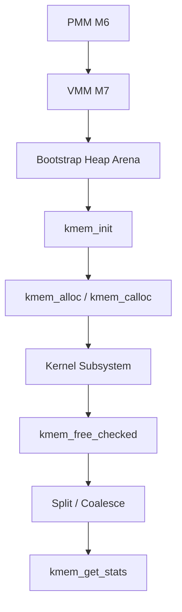

# Template Laporan Praktikum Sistem Operasi Lanjut — MCSOS

**Nama file laporan:** `laporan_praktikum_[M8]_[2583207073007].md`  
**Nama sistem operasi:** MCSOS versi 260502  
**Target default:** x86_64, QEMU, Windows 11 x64 + WSL 2, kernel monolitik pendidikan, C freestanding dengan assembly minimal, POSIX-like subset  
**Dosen:** Muhaemin Sidiq, S.Pd., M.Pd.  
**Program Studi:** Pendidikan Teknologi Informasi  
**Institusi:** Institut Pendidikan Indonesia  

> Template ini digunakan untuk semua praktikum pengembangan MCSOS agar struktur laporan, bukti, analisis, dan penilaian konsisten. Ganti seluruh teks bertanda `[isi ...]` dengan data praktikum sebenarnya. Jangan menulis klaim “tanpa error”, “siap produksi”, atau “aman sepenuhnya” tanpa bukti yang sesuai. Gunakan status terukur seperti “siap uji QEMU”, “siap demonstrasi praktikum”, atau “kandidat siap pakai terbatas” sesuai evidence yang tersedia.

---

## 0. Metadata Laporan

| Atribut | Isi |
|---|---|
| Kode praktikum | `[M8]` |
| Judul praktikum | `[ Praktikum M8 — Kernel Heap Awal dan Allocator Dinamis]` |
| Jenis pengerjaan | `[Individu]` |
| Nama mahasiswa | `[Salma Rahayu]` |
| NIM | `[2583207073007]` |
| Kelas | `[PTI 1-A]` |
| Nama kelompok | `[isi jika kelompok]` |
| Anggota kelompok | `[nama, NIM, peran ringkas]` |
| Tanggal praktikum | `[2026-04-06]` |
| Tanggal pengumpulan | `[2026-04-06]` |
| Repository | `[amaaarhyu078-creator]` |
| Branch | `[praktikum/m8-kernel-heap]` |
| Commit awal | `` `[517f6b5]` `` |
| Commit akhir | `` `[2a151a3]` `` |
| Status readiness yang diklaim | `[siap uji QEMU]` |

---

## 1. Sampul

# Laporan Praktikum `[M8]`  
## `[Praktikum M8 — Kernel Heap Awal dan Allocator Dinamis]`

Disusun oleh:

| Nama | NIM | Kelas | Peran |
|---|---|---|---|
| `[Salma Rahayu]` | `[n2583207073007]` | `[PTI 1A]` | `[individu]` |
| `[opsional]` | `[opsional]` | `[opsional]` | `[opsional]` |

Dosen Pengampu: **Muhaemin Sidiq, S.Pd., M.Pd.**  
Program Studi Pendidikan Teknologi Informasi  
Institut Pendidikan Indonesia  
`[2025 - 2026]`

---

## 2. Pernyataan Orisinalitas dan Integritas Akademik

Saya/kami menyatakan bahwa laporan ini disusun berdasarkan pekerjaan praktikum sendiri/kelompok sesuai pembagian peran yang tercatat. Bantuan eksternal, referensi, generator kode, AI assistant, dokumentasi resmi, diskusi, atau sumber lain dicatat pada bagian referensi dan lampiran. Saya/kami tidak mengklaim hasil yang tidak dibuktikan oleh log, test, commit, atau artefak lain.

| Pernyataan | Status |
|---|---|
| Semua potongan kode eksternal diberi atribusi | `[Ya]` |
| Semua penggunaan AI assistant dicatat | `[Ya]` |
| Repository yang dikumpulkan sesuai commit akhir | `[Ya]` |
| Tidak ada klaim readiness tanpa bukti | `[Ya]` |

Catatan penggunaan bantuan eksternal:

```text
[Isi: alat, prompt ringkas, sumber, bagian yang dibantu, verifikasi mandiri yang dilakukan.
Alat:
ChatGPT (OpenAI)

Prompt ringkas:
Meminta penjelasan konsep kernel heap allocator, validasi langkah praktikum M8, interpretasi hasil build dan audit, pengecekan kesesuaian implementasi dengan panduan, serta bantuan penyusunan laporan.

Sumber:
Panduan praktikum M8, repository MCSOS lokal, output terminal WSL 2, dan hasil pengujian yang dihasilkan sendiri.

Bagian yang dibantu:
Pemahaman konsep allocator kernel, verifikasi host unit test, verifikasi audit freestanding (nm, readelf, objdump), review acceptance criteria, readiness review, dan penyusunan laporan.

Verifikasi mandiri yang dilakukan:
Seluruh kode dikompilasi dan diuji ulang secara mandiri pada lingkungan WSL 2 menggunakan host unit test, audit freestanding object, build kernel, pemeriksaan Git commit, dan pengumpulan bukti screenshot.]
```

---

## 3. Tujuan Praktikum

Tuliskan tujuan teknis dan konseptual praktikum. Tujuan harus dapat diuji.

1. `[Membangun allocator dinamis kernel awal (KMEM) yang dapat melakukan alokasi dan dealokasi memori secara terkontrol pada lingkungan kernel freestanding.]`
2. `[Menghasilkan allocator yang dapat diuji secara deterministik menggunakan host unit test serta dapat dikompilasi sebagai freestanding object tanpa dependensi libc.]`
3. `[Menjelaskan dan memvalidasi invariant allocator, termasuk ownership arena, validitas metadata block, alignment, split block, dan coalesce block.]`
4. `[Mengintegrasikan allocator ke kernel setelah PMM (M6) dan VMM (M7) siap serta menyimpan bukti validasi berupa host test, audit object, dan artefak build.]`

---

## 4. Capaian Pembelajaran Praktikum

Setelah praktikum ini, mahasiswa mampu:

| CPL/CPMK praktikum | Bukti yang harus ditunjukkan |
|---|---|
| `[Menjelaskan perbedaan PMM, VMM, dan kernel heap; menjelaskan kebutuhan allocator dinamis setelah boot awal; serta menetapkan invariant allocator meliputi alignment, batas arena, status free/used, double-free rejection, block linkage, dan total region coverage.]` | `[analisis desain, diagram/penjelasan arsitektur, invariant allocator, threat model, failure analysis, dan readiness review pada laporan]` |
| `[Mendesain dan mengimplementasikan free-list allocator berbasis metadata header dengan mekanisme split, coalesce, statistik heap, serta fungsi kmem_init, kmem_alloc, kmem_calloc, kmem_free_checked, kmem_get_stats, dan kmem_validate dalam C17 freestanding.]` | `[kernel/core/kmem.c, kernel/include/mcsos/kernel/kmem.h, Git diff, commit akhir, dan screenshot implementasi]` |
| `[Menyusun host unit test, melakukan audit freestanding object menggunakan nm/readelf/objdump, mengintegrasikan allocator ke kernel setelah PMM dan VMM siap, serta menyusun laporan berbasis bukti dan hasil validasi.]` | `[build/m8/test_kmem.log, build/m8/nm_u.txt, build/m8/readelf_h.txt, build/m8/kmem.objdump.txt, screenshot validasi, script check_m8_kmem.sh, perubahan kmain.c, dan lampiran laporan]` |

---

## 5. Peta Milestone MCSOS

Centang milestone yang menjadi fokus laporan ini. Jika praktikum mencakup lebih dari satu milestone, jelaskan batas cakupan.

| Milestone | Fokus | Status dalam laporan |
|---|---|---|
| M0 | Requirements, governance, baseline arsitektur | `[ ] tidak dibahas / [ ] dibahas / [V] selesai praktikum` |
| M1 | Toolchain reproducible, Git, QEMU, GDB, metadata build | `[ ] tidak dibahas / [ ] dibahas / [V] selesai praktikum` |
| M2 | Boot image, kernel ELF64, early console | `[ ] tidak dibahas / [ ] dibahas / [V] selesai praktikum` |
| M3 | Panic path, linker map, GDB, observability awal | `[ ] tidak dibahas / [ ] dibahas / [V] selesai praktikum` |
| M4 | Trap, exception, interrupt, timer | `[ ] tidak dibahas / [ ] dibahas / [V] selesai praktikum` |
| M5 | PMM, VMM, page table, kernel heap | `[ ] tidak dibahas / [ ] dibahas / [V] selesai praktikum` |
| M6 | Thread, scheduler, synchronization | `[ ] tidak dibahas / [ ] dibahas / [V] selesai praktikum` |
| M7 | Syscall ABI dan user program loader | `[ ] tidak dibahas / [ ] dibahas / [ ] selesai praktikum` |
| M8 | VFS, file descriptor, ramfs | `[ ] tidak dibahas / [V] dibahas / [] selesai praktikum` |
| M9 | Block layer dan device model | `[V] tidak dibahas / [ ] dibahas / [] selesai praktikum` |
| M10 | Persistent filesystem, mcsfs/ext2-like, recovery | `[V] tidak dibahas / [ ] dibahas / [] selesai praktikum` |
| M11 | Networking stack, packet parsing, UDP/TCP subset | `[V] tidak dibahas / [ ] dibahas / [ ] selesai praktikum` |
| M12 | Security model, capability/ACL, syscall fuzzing, hardening | `[V] tidak dibahas / [ ] dibahas / [ ] selesai praktikum` |
| M13 | SMP, scalability, lock stress, NUMA-aware preparation | `[V] tidak dibahas / [ ] dibahas / [ ] selesai praktikum` |
| M14 | Framebuffer, graphics console, visual regression | `[V] tidak dibahas / [ ] dibahas / [ ] selesai praktikum` |
| M15 | Virtualization/container subset | `[V] tidak dibahas / [ ] dibahas / [ ] selesai praktikum` |
| M16 | Observability, update/rollback, release image, readiness review | `[V] tidak dibahas / [ ] dibahas / [ ] selesai praktikum` |

Batas cakupan praktikum:

```text
[Praktikum M8 mencakup perancangan dan implementasi kernel heap allocator awal berbasis free-list pada lingkungan C17 freestanding, implementasi fungsi kmem_init, kmem_alloc, kmem_calloc, kmem_free_checked, kmem_get_stats, dan kmem_validate, pengujian menggunakan host unit test, audit freestanding object menggunakan nm/readelf/objdump, serta integrasi bootstrap heap ke kernel setelah PMM (M6) dan VMM (M7) siap.

Praktikum ini tidak mencakup page-backed heap growth dinamis, allocator yang aman untuk interrupt context, SMP-safe allocator, DMA-aware allocator, userspace allocator, slab allocator, buddy allocator, garbage collection, memory compaction, heap hardening lanjutan (red-zone/canary), dynamic heap expansion, maupun jaminan kesiapan produksi. Implementasi yang dihasilkan hanya ditujukan sebagai early kernel heap allocator untuk kebutuhan bootstrap kernel dan validasi akademik praktikum.]
```
---

## 6. Dasar Teori Ringkas

Praktikum M8 berfokus pada implementasi kernel heap allocator sederhana yang digunakan untuk menyediakan alokasi memori dinamis pada kernel setelah proses boot awal selesai. Allocator diperlukan karena memori yang telah dikelola oleh PMM dan VMM masih berupa ruang memori mentah yang belum menyediakan mekanisme alokasi objek berukuran variatif.

Kernel heap allocator pada praktikum ini menggunakan pendekatan free-list allocator. Setiap blok memori memiliki metadata header yang menyimpan informasi ukuran blok, status free/used, nilai validasi (magic number), serta hubungan dengan blok sebelumnya dan berikutnya. Struktur ini memungkinkan allocator melakukan pencarian blok bebas yang sesuai saat alokasi dilakukan.

Untuk mengurangi fragmentasi, allocator menerapkan mekanisme split dan coalesce. Split digunakan ketika blok bebas yang ditemukan lebih besar dari kebutuhan alokasi sehingga sebagian ruang dapat dipisahkan menjadi blok baru. Coalesce digunakan saat blok yang dibebaskan bersebelahan dengan blok bebas lainnya sehingga keduanya dapat digabung menjadi satu blok yang lebih besar.

Implementasi juga menerapkan alignment 16-byte untuk menjaga konsistensi alamat payload dan mengurangi risiko akses memori yang tidak selaras. Selain itu, allocator melakukan validasi terhadap pointer, metadata, dan status blok untuk mendeteksi kondisi seperti double free, pointer di luar arena heap, atau kerusakan metadata.

Karena allocator digunakan pada lingkungan kernel freestanding, implementasi tidak bergantung pada fungsi libc seperti malloc, free, maupun printf. Validasi freestanding dilakukan menggunakan audit object dengan nm, readelf, dan objdump untuk memastikan tidak terdapat dependensi eksternal yang tidak diinginkan.

Pada arsitektur MCSOS, kernel heap berada di atas lapisan Physical Memory Manager (PMM) dan Virtual Memory Manager (VMM). PMM bertugas mengelola frame fisik, VMM mengelola pemetaan alamat virtual, sedangkan allocator heap menyediakan alokasi memori dinamis yang digunakan oleh subsistem kernel.

### 6.1 Konsep Sistem Operasi yang Diuji

```text
[Praktikum M8 menguji konsep kernel heap allocator sebagai lapisan manajemen memori dinamis yang berada di atas Physical Memory Manager (PMM) dan Virtual Memory Manager (VMM).

PMM bertanggung jawab mengelola frame fisik yang tersedia pada sistem. VMM bertanggung jawab mengelola pemetaan alamat virtual ke alamat fisik. Setelah PMM dan VMM siap, kernel memerlukan allocator dinamis untuk mengalokasikan objek dengan ukuran yang bervariasi selama runtime.

Konsep utama yang diuji meliputi free-list allocator, metadata header, block ownership, memory alignment, block splitting, block coalescing, fragmentasi memori, validasi pointer, deteksi double free, serta invariant allocator yang menjamin konsistensi struktur heap.

Praktikum juga menguji konsep freestanding kernel development, yaitu implementasi subsistem kernel tanpa dependensi terhadap libc host. Validasi dilakukan menggunakan host unit test, audit unresolved symbol (nm), inspeksi ELF object (readelf), dan analisis disassembly (objdump).

Hubungan antar subsistem yang diuji pada M8 adalah PMM menyediakan memori fisik, VMM menyediakan ruang alamat virtual yang valid, dan kernel heap allocator menyediakan layanan alokasi memori dinamis yang digunakan oleh subsistem kernel lainnya.]
```

### 6.2 Konsep Arsitektur x86_64 yang Relevan

| Konsep | Relevansi pada praktikum | Bukti/verifikasi |
|---|---|---|
| `[Paging dan Virtual Memory]` | `[Kernel heap berjalan pada ruang alamat yang telah disiapkan oleh PMM dan VMM. Arena heap bootstrap harus berada pada memori yang valid dan dapat diakses kernel.]` | `[integrasi PMM M6, VMM M7, build kernel berhasil, dan integrasi m8_heap_bootstrap()]` |
| `[ELF64 x86_64 Relocatable Object]` | `[Allocator harus dapat dikompilasi sebagai object freestanding yang sesuai dengan target kernel x86_64.]` | `[build/m8/readelf_h.txt menunjukkan ELF64, little endian, dan Machine: Advanced Micro Devices X86-64]` |

### 6.3 Konsep Implementasi Freestanding

| Aspek | Keputusan praktikum |
|---|---|
| Bahasa | `[C17 freestanding]` |
| Runtime | `[tanpa hosted libc]` |
| ABI | `[x86_64 System V]` |
| Compiler flags kritis | `[-ffreestanding, -fno-builtin, -fno-stack-protector, -mno-red-zone]` |
| Risiko undefined behavior | `[pointer invalid, alignment error, integer overflow, metadata corruption, double free, dan akses di luar arena heap]` |

### 6.4 Referensi Teori yang Digunakan

| No. | Sumber | Bagian yang digunakan | Alasan relevansi |
|---|---|---|---|
| `[1]` | `[Intel 64 and IA-32 Architectures Software Developer's Manual, Volume 3]` | `[Memory Management dan Paging]` | `[Menjelaskan konsep manajemen memori x86_64 yang menjadi dasar penggunaan PMM, VMM, dan kernel heap.]` |
| `[2]` | `[Operating Systems: Three Easy Pieces (Remzi H. Arpaci-Dusseau dan Andrea C. Arpaci-Dusseau)]` | `[Memory Virtualization dan Memory Allocation]` | `[Menjelaskan konsep allocator, fragmentasi memori, dan hubungan virtual memory dengan heap.]` |
| `[3]` | `[OSDev Wiki]` | `[Memory Allocation dan Heap Allocation]` | `[Menjelaskan implementasi allocator pada kernel freestanding dan pendekatan free-list allocator.]` |
| `[4]` | `[The Linux Kernel Documentation]` | `[Memory Management Concepts]` | `[Digunakan sebagai referensi konsep manajemen memori kernel dan pemisahan lapisan PMM, VMM, dan heap.]` |
| `[5]` | `[LLVM Clang Documentation]` | `[Freestanding Compilation Options]` | `[Menjelaskan penggunaan opsi kompilasi freestanding seperti -ffreestanding dan penghilangan dependensi libc.]` |

---

## 7. Lingkungan Praktikum

### 7.1 Host dan Target

| Komponen | Nilai |
|---|---|
| Host OS | `[Windows 11 x64]` |
| Lingkungan build | `[WSL 2 Ubuntu]` |
| Target ISA | `x86_64` |
| Target ABI | `[x86_64-unknown-none-elf]` |
| Emulator | `[QEMU emulator version 10.2.1]` |
| Firmware emulator | `[OVMF (/usr/share/OVMF/OVMF_CODE_4M.fd)]` |
| Debugger | `[GNU gdb 17.1]` |
| Build system | `[Make]` |
| Bahasa utama | `[C17 freestanding]` |
| Assembly | `[NASM 3.01]` |

### 7.2 Versi Toolchain

Tempel output versi toolchain berikut. Jalankan dari clean shell WSL.

```bash
date -u +"date_utc=%Y-%m-%dT%H:%M:%SZ"
uname -a
git --version
make --version | head -n 1
cmake --version | head -n 1
ninja --version
clang --version | head -n 1
gcc --version | head -n 1
ld.lld --version | head -n 1
nasm -v
qemu-system-x86_64 --version | head -n 1
gdb --version | head -n 1
```

Output:

```text
date_utc=2026-06-04T09:58:29Z
Linux DESKTOP-S5LUA56 6.6.114.1-microsoft-standard-WSL2 #1 SMP PREEMPT_DYNAMIC Mon Dec 1 20:46:23 UTC 2025 x86_64 GNU/Linux
git version 2.53.0
GNU Make 4.4.1
cmake version 4.2.3
1.13.2
Ubuntu clang version 21.1.8 (6ubuntu1)
gcc (Ubuntu 15.2.0-16ubuntu1) 15.2.0
Ubuntu LLD 21.1.8 (compatible with GNU linkers)
NASM version 3.01
QEMU emulator version 10.2.1 (Debian 1:10.2.1+ds-1ubuntu3)
GNU gdb (Ubuntu 17.1-2ubuntu1) 17.1
```

### 7.3 Lokasi Repository

| Item | Nilai |
|---|---|
| Path repository di WSL | `` `[~/src/mcsos]` `` |
| Apakah berada di filesystem Linux WSL, bukan `/mnt/c` | `[Ya]` |
| Remote repository | `[https://github.com/amaaarhyu078-creator/mcsos-.git]` |
| Branch | `[praktikum/m8-kernel-heap]` |
| Commit hash awal | `` `[517f6b5]` `` |
| Commit hash akhir | `` `[d5702f8]` `` |

---

## 8. Repository dan Struktur File

### 8.1 Struktur Direktori yang Relevan

Tampilkan hanya direktori dan file yang relevan dengan praktikum.

```text
mcsos/
├── kernel/
│   ├── core/
│   │   ├── kmain.c
│   │   └── kmem.c
│   └── include/
│       └── mcsos/
│           └── kernel/
│               └── kmem.h
├── tests/
│   └── test_kmem_host.c
├── scripts/
│   └── check_m8_kmem.sh
├── evidence/
│   └── screenshots/
│       ├── m8-audit-pass.png
│       ├── m8-branch.png
│       ├── m8-git-commit.png
│       ├── m8-host-test-pass.png
│       ├── m8-nm-empty.png
│       ├── m8-preflight-pass.png
│       ├── m8-readelf-header.png
│       └── m8-symbols.png
└── Makefile
```

### 8.2 File yang Dibuat atau Diubah

| File | Jenis perubahan | Alasan perubahan | Risiko |
|---|---|---|---|
| `[kernel/core/kmem.c]` | `[baru]` | `[Mengimplementasikan kernel heap allocator berbasis free-list beserta operasi alokasi, dealokasi, split, coalesce, validasi, dan statistik heap.]` | `[Tinggi - bug pada allocator dapat menyebabkan korupsi memori kernel, panic, atau crash saat runtime.]` |
| `[kernel/include/mcsos/kernel/kmem.h]` | `[baru]` | `[Menyediakan deklarasi API allocator dan struktur data yang digunakan oleh subsistem kernel.]` | `[Sedang - perubahan antarmuka dapat memengaruhi seluruh pemanggil allocator.]` |
| `[kernel/core/kmain.c]` | `[ubah]` | `[Menambahkan bootstrap heap dan integrasi allocator setelah PMM dan VMM selesai diinisialisasi.]` | `[Tinggi - kesalahan integrasi dapat menyebabkan kegagalan boot kernel.]` |
| `[tests/test_kmem_host.c]` | `[baru]` | `[Menyediakan host unit test untuk memverifikasi alokasi, dealokasi, alignment, overflow, fragmentasi, dan coalescing.]` | `[Rendah - hanya memengaruhi lingkungan pengujian.]` |
| `[scripts/check_m8_kmem.sh]` | `[baru]` | `[Mengotomatisasi validasi M8, termasuk host test dan audit freestanding object.]` | `[Rendah - hanya memengaruhi proses validasi.]` |
| `[Makefile]` | `[ubah]` | `[Menambahkan target build, host test, dan audit untuk praktikum M8.]` | `[Sedang - kesalahan konfigurasi dapat mengganggu proses build dan validasi.]` | 

### 8.3 Ringkasan Diff

```bash
git status --short
git diff --stat
git log --oneline -n 5
```

Output:

```text
d5702f8 (HEAD -> praktikum/m8-kernel-heap, origin/praktikum/m8-kernel-heap) Add M8 evidence screenshots
2a151a3 Implement M8 kernel heap allocator
517f6b5 (origin/praktikum/m7-vmm, praktikum/m7-vmm, praktikum/m6-pmm) Implement M7 virtual memory manager core and diagnostics
ccee310 (origin/praktikum/m6-pmm) Integrate M6 PMM with Limine memory map
22f41cd Add M6 physical memory manager
```

---

## 9. Desain Teknis

### 9.1 Masalah yang Diselesaikan

```text
[Sebelum M8, kernel MCSOS telah memiliki Physical Memory Manager (PMM) dan Virtual Memory Manager (VMM), tetapi belum memiliki mekanisme alokasi memori dinamis untuk objek kernel dengan ukuran yang bervariasi. Seluruh memori yang tersedia masih berupa frame fisik atau ruang alamat virtual yang belum dapat digunakan secara fleksibel oleh subsistem kernel.

Praktikum M8 menyelesaikan masalah tersebut dengan menyediakan kernel heap allocator berbasis free-list yang mampu melakukan alokasi, dealokasi, validasi, dan pengelolaan fragmentasi memori melalui mekanisme split dan coalesce. Allocator ini dirancang agar dapat diuji secara deterministik, dikompilasi sebagai freestanding object, serta diintegrasikan ke kernel setelah PMM dan VMM siap.]
```

### 9.2 Keputusan Desain

| Keputusan | Alternatif yang dipertimbangkan | Alasan memilih | Konsekuensi |
|---|---|---|---|
| `[Menggunakan free-list allocator dengan metadata header]` | `[Buddy allocator atau slab allocator]` | `[Lebih sederhana untuk tahap awal kernel heap dan mudah diuji]` | `[Fragmentasi dapat meningkat dibanding allocator yang lebih kompleks]` |
| `[Menggunakan arena bootstrap statik pada .bss]` | `[Page-backed heap langsung menggunakan PMM dan VMM]` | `[Lebih aman untuk integrasi awal dan mengurangi risiko kegagalan mapping]` | `[Ukuran heap tetap dan tidak dapat berkembang secara dinamis]` |

### 9.3 Arsitektur Ringkas



Penjelasan diagram:

```text
[PMM menyediakan memori fisik dan VMM menyediakan ruang alamat virtual yang valid. Setelah kedua subsistem siap, allocator M8 menginisialisasi arena heap bootstrap. Permintaan alokasi diproses melalui kmem_alloc atau kmem_calloc. Saat memori dibebaskan, kmem_free_checked melakukan validasi dan menjalankan proses coalescing untuk mengurangi fragmentasi. Statistik heap dapat diperoleh melalui kmem_get_stats.]
```

### 9.4 Kontrak Antarmuka

| Antarmuka | Pemanggil | Penerima | Precondition | Postcondition | Error path |
|---|---|---|---|---|---|
| `[kmem_init()]` | `[kmain()]` | `[allocator]` | `[arena valid dan ukuran mencukupi]` | `[heap siap digunakan]` | `[mengembalikan kode error]` |
| `[kmem_alloc()]` | `[kernel subsystem]` | `[allocator]` | `[heap telah diinisialisasi]` | `[pointer valid dikembalikan]` | `[NULL jika gagal]` |
| `[kmem_calloc()]` | `[kernel subsystem]` | `[allocator]` | `[heap telah diinisialisasi]` | `[memori dialokasikan dan di-zero-kan]` | `[NULL jika gagal atau overflow]` |
| `[kmem_free_checked()]` | `[kernel subsystem]` | `[allocator]` | `[pointer berasal dari heap]` | `[blok menjadi free]` | `[error jika invalid pointer atau double free]` |
| `[kmem_get_stats()]` | `[diagnostic/logging]` | `[allocator]` | `[heap telah diinisialisasi]` | `[statistik heap diperbarui]` | `[tidak ada perubahan statistik]` |

### 9.5 Struktur Data Utama

| Struktur data | Field penting | Ownership | Lifetime | Invariant |
|---|---|---|---|---|
| `` `[kmem_block_t]` `` | `[size, magic, flags, prev, next]` | `[allocator]` | `[selama heap aktif]` | `[metadata valid dan link konsisten]` |
| `` `[kmem_stats_t]` `` | `[total_bytes, free_bytes, largest_free, block_count, free_count]` | `[allocator]` | `[selama heap aktif]` | `[merepresentasikan kondisi heap aktual]` |

### 9.6 Invariants

Tuliskan invariant yang harus benar sepanjang eksekusi.

1. `[Setiap blok heap memiliki metadata yang valid dan magic value yang benar.]`
2. `[Pointer hasil alokasi selalu memenuhi alignment KMEM_ALIGN.]`
3. `[Satu blok hanya boleh berada pada satu status: free atau used.]`
4. `[Double free harus ditolak dan tidak boleh mengubah struktur heap.]`

### 9.7 Ownership, Locking, dan Concurrency

| Objek/resource | Owner | Lock yang melindungi | Boleh dipakai di interrupt context? | Catatan |
|---|---|---|---|---|
| `[arena heap bootstrap]` | `[kernel allocator]` | `[none]` | `[Tidak]` | `[diasumsikan berjalan pada lingkungan single-core dan belum SMP-safe]` |
| `[metadata blok heap]` | `[kernel allocator]` | `[none]` | `[Tidak]` | `[akses bersifat serial selama tahap praktikum]` |

Lock order yang berlaku:

```text
[Tidak ada locking pada M8. Implementasi diasumsikan berjalan pada tahap awal kernel, single-core, dan belum mendukung SMP maupun interrupt-safe allocation.]
```

### 9.8 Memory Safety dan Undefined Behavior Risk

| Risiko | Lokasi | Mitigasi | Bukti |
|---|---|---|---|
| `[Double free]` | `[kmem_free_checked()]` | `[validasi status blok dan magic value]` | `[host unit test PASS]` |
| `[Integer overflow]` | `[kmem_calloc()]` | `[overflow check sebelum perkalian]` | `[host unit test PASS]` |
| `[Pointer invalid]` | `[kmem_free_checked()]` | `[range validation dan metadata validation]` | `[kmem_validate() dan code review]` |
| `[Fragmentasi heap]` | `[allocator core]` | `[split dan coalesce]` | `[fragmentation/coalesce test PASS]` |

### 9.9 Security Boundary

| Boundary | Data tidak tepercaya | Validasi yang dilakukan | Failure mode aman |
|---|---|---|---|
| `[Kernel heap API]` | `[pointer dan ukuran dari pemanggil]` | `[alignment, range check, metadata check, overflow check]` | `[error code atau NULL tanpa merusak heap]` |
| `[Bootstrap heap arena]` | `[alamat arena dan ukuran arena]` | `[validasi saat kmem_init()]` | `[inisialisasi gagal dan kernel dapat menghentikan boot secara terkontrol]` |

---

## 10. Langkah Kerja Implementasi

### Langkah 1 — `[Implementasi Kernel Heap Allocator]`

Maksud langkah:

```text
[Mengimplementasikan kernel heap allocator berbasis free-list yang menyediakan fungsi inisialisasi heap, alokasi memori, dealokasi memori, validasi heap, dan statistik heap untuk kebutuhan kernel setelah PMM dan VMM tersedia.]
```

Perintah:

```bash
[nano kernel/include/mcsos/kernel/kmem.h]
[nano kernel/core/kmem.c]
```

Output ringkas:

```text
[File kmem.h dan kmem.c berhasil dibuat dan menjadi bagian dari source kernel MCSOS.]
```

Artefak yang dihasilkan:

| Artefak | Lokasi | Fungsi |
|---|---|---|
| `[kmem.h]` | `[kernel/include/mcsos/kernel/kmem.h]` | `[Deklarasi API allocator kernel.]` |
| `[kmem.c]` | `[kernel/core/kmem.c]` | `[Implementasi allocator kernel.]` |

Indikator berhasil:

```text
[Source allocator berhasil dikompilasi dan menyediakan API kmem_init, kmem_alloc, kmem_calloc, kmem_free_checked, kmem_get_stats, dan kmem_validate.]
```

### Langkah 2 — `[Membuat Host Unit Test]`

Maksud langkah:

```text
[Membuat unit test yang dapat dijalankan pada host untuk memverifikasi perilaku allocator tanpa perlu menjalankan kernel di QEMU.]
```

Perintah:

```bash
[nano tests/test_kmem_host.c]
```

Output ringkas:

```text
[File test_kmem_host.c berhasil dibuat dan berisi pengujian allocator.]
```

Artefak yang dihasilkan:

| Artefak | Lokasi | Fungsi |
|---|---|---|
| `[test_kmem_host.c]` | `[tests/test_kmem_host.c]` | `[Unit test allocator.]` |

Indikator berhasil:

```text
[Seluruh skenario pengujian dapat dijalankan tanpa assertion failure.]
```

### Langkah 3 — `[Menambahkan Target Build dan Script Validasi]`

Maksud langkah:

```text
[Menambahkan target Makefile dan script validasi agar proses build, test, dan audit M8 dapat dijalankan secara otomatis dan konsisten.]
```

Perintah:

```bash
[nano Makefile]
[nano scripts/check_m8_kmem.sh]
[chmod +x scripts/check_m8_kmem.sh]
```

Output ringkas:

```text
[Target M8 berhasil ditambahkan ke Makefile dan script validasi dapat dieksekusi.]
```

Artefak yang dihasilkan:

| Artefak | Lokasi | Fungsi |
|---|---|---|
| `[Makefile]` | `[Makefile]` | `[Menambahkan target build dan audit M8.]` |
| `[check_m8_kmem.sh]` | `[scripts/check_m8_kmem.sh]` | `[Menjalankan validasi otomatis M8.]` |

Indikator berhasil:

```text
[Target M8 dapat dijalankan tanpa error.]
```

### Langkah 4 — `[Menjalankan Host Unit Test]`

Maksud langkah:

```text
[Memastikan allocator bekerja sesuai spesifikasi sebelum diintegrasikan ke kernel.]
```

Perintah:

```bash
[make m8-all]
```

Output ringkas:

```text
[M8 kmem host tests: PASS]
```

Artefak yang dihasilkan:

| Artefak | Lokasi | Fungsi |
|---|---|---|
| `[test_kmem.log]` | `[build/m8/test_kmem.log]` | `[Bukti hasil host unit test.]` |

Indikator berhasil:

```text
[Output menampilkan "M8 kmem host tests: PASS".]
```

### Langkah 5 — `[Audit Freestanding Object]`

Maksud langkah:

```text
[Memastikan source allocator tidak memiliki dependensi terhadap libc host dan dapat digunakan pada kernel freestanding.]
```

Perintah:

```bash
[make m8-audit]
```

Output ringkas:

```text
[nm_u.txt kosong]
[readelf menunjukkan ELF64 x86-64]
[objdump memuat symbol allocator]
```

Artefak yang dihasilkan:

| Artefak | Lokasi | Fungsi |
|---|---|---|
| `[nm_u.txt]` | `[build/m8/nm_u.txt]` | `[Audit unresolved symbol.]` |
| `[readelf_h.txt]` | `[build/m8/readelf_h.txt]` | `[Audit header ELF.]` |
| `[kmem.objdump.txt]` | `[build/m8/kmem.objdump.txt]` | `[Audit symbol allocator.]` |

Indikator berhasil:

```text
[File nm_u.txt kosong dan object berhasil dikompilasi sebagai ELF64 freestanding.]
```

### Langkah 6 — `[Integrasi Heap ke Kernel]`

Maksud langkah:

```text
[Mengintegrasikan allocator ke kernel menggunakan arena bootstrap statik sehingga allocator dapat digunakan setelah PMM dan VMM selesai diinisialisasi.]
```

Perintah:

```bash
[nano kernel/core/kmain.c]

[make clean]
[make build]
```

Output ringkas:

```text
[Kernel berhasil dibangun kembali setelah integrasi allocator.]
```

Artefak yang dihasilkan:

| Artefak | Lokasi | Fungsi |
|---|---|---|
| `[kmain.c]` | `[kernel/core/kmain.c]` | `[Bootstrap heap allocator.]` |
| `[kernel.elf]` | `[build/kernel.elf]` | `[Kernel hasil build.]` |

Indikator berhasil:

```text
[Build kernel selesai tanpa error dan fungsi m8_heap_bootstrap berhasil dipanggil dari kmain.]
```

### Langkah 7 — `[Menjalankan Validasi M8]`

Maksud langkah:

```text
[Memastikan seluruh acceptance criteria M8 terpenuhi melalui proses preflight otomatis.]
```

Perintah:

```bash
[./scripts/check_m8_kmem.sh]
```

Output ringkas:

```text
[[PASS] M8 preflight completed.]
```

Artefak yang dihasilkan:

| Artefak | Lokasi | Fungsi |
|---|---|---|
| `[test_kmem.log]` | `[build/m8/test_kmem.log]` | `[Bukti host test.]` |
| `[nm_u.txt]` | `[build/m8/nm_u.txt]` | `[Bukti audit simbol.]` |
| `[readelf_h.txt]` | `[build/m8/readelf_h.txt]` | `[Bukti audit ELF.]` |
| `[kmem.objdump.txt]` | `[build/m8/kmem.objdump.txt]` | `[Bukti audit disassembly.]` |

Indikator berhasil:

```text
[Script preflight selesai dengan status PASS.]
```

### Langkah 8 — `[Commit dan Push ke GitHub]`

Maksud langkah:

```text
[Menyimpan hasil praktikum ke repository Git dan mengunggah branch M8 ke GitHub sebagai bukti pengerjaan.]
```

Perintah:

```bash
[git commit -m "Implement M8 kernel heap allocator"]
[git commit -m "Add M8 evidence screenshots"]
[git push -u origin praktikum/m8-kernel-heap]
```

Output ringkas:

```text
[[new branch] praktikum/m8-kernel-heap -> praktikum/m8-kernel-heap]
[branch 'praktikum/m8-kernel-heap' set up to track 'origin/praktikum/m8-kernel-heap']
```

Artefak yang dihasilkan:

| Artefak | Lokasi | Fungsi |
|---|---|---|
| `[Commit 2a151a3]` | `[Git repository]` | `[Implementasi allocator M8.]` |
| `[Commit d5702f8]` | `[Git repository]` | `[Screenshot evidence M8.]` |
| `[Branch praktikum/m8-kernel-heap]` | `[GitHub repository]` | `[Bukti pengumpulan praktikum.]` |

Indikator berhasil:

```text
[Branch praktikum/m8-kernel-heap berhasil ter-push ke GitHub dan sinkron dengan origin.]
```


---

## 11. Checkpoint Buildable

Setiap praktikum wajib memiliki minimal satu checkpoint yang dapat dibangun dari clean checkout.

| Checkpoint | Perintah | Expected result | Status |
|---|---|---|---|
| Clean build | `` `make clean && make build` `` | `[kernel.elf berhasil dibangun tanpa error]` | `[PASS]` |
| Metadata toolchain | `` `make meta` `` | `[build/meta/toolchain-versions.txt ada]` | `[PASS]` |
| Image generation | `` `make image` `` | `[mcsos.iso/mcsos.img ada]` | `[NA]` |
| QEMU smoke test | `` `make run` `` | `[serial log stage marker]` | `[NA]` |
| Test suite | `` `make test` `` | `[semua test relevan lulus]` | `[NA]` |

Catatan checkpoint:

```text
[Checkpoint clean build berhasil dibuktikan melalui make clean dan make build yang menghasilkan kernel.elf tanpa error. Metadata toolchain juga berhasil dibuat melalui target make meta yang dijalankan pada proses pre-commit.

Pada praktikum M8, validasi utama dilakukan melalui make m8-all, make m8-audit, dan ./scripts/check_m8_kmem.sh. Target make image, make run, dan make test tidak digunakan sebagai jalur validasi utama sehingga tidak diklaim PASS. Integrasi kernel telah disiapkan melalui m8_heap_bootstrap(), namun validasi runtime QEMU penuh belum dijadikan bukti utama praktikum ini.]
```

---

## 12. Perintah Uji dan Validasi

### 12.1 Build Test

Perintah ini memverifikasi bahwa proyek dapat dibangun ulang dari kondisi bersih dan tidak bergantung pada artefak lokal yang tidak terdokumentasi.

```bash
make clean
make build
```

Hasil:

```text
[Build berhasil diselesaikan tanpa error dan menghasilkan build/kernel.elf.]
```

Status: `[PASS]`

### 12.2 Static Inspection

Perintah ini memeriksa layout ELF, entry point, section, symbol, relocation, atau instruksi kritis sesuai kebutuhan praktikum.

```bash
readelf -hW build/kernel.elf
readelf -lW build/kernel.elf
readelf -SW build/kernel.elf
objdump -drwC build/kernel.elf | head -n 120
```

Hasil penting:

```text
[Untuk validasi M8 digunakan audit freestanding object allocator.]

ELF Header:
  Class: ELF64
  Data: 2's complement, little endian
  Type: REL (Relocatable file)
  Machine: Advanced Micro Devices X86-64

Symbol allocator yang ditemukan:
  kmem_init
  kmem_validate
  kmem_alloc
  kmem_calloc
  kmem_free_checked
  kmem_get_stats
```

Status: `[PASS]`

### 12.3 QEMU Smoke Test

Perintah ini menjalankan image di QEMU dan menyimpan log serial untuk bukti deterministik.

```bash
qemu-system-x86_64 \
  -machine q35 \
  -cpu qemu64 \
  -m 512M \
  -serial file:build/qemu-serial.log \
  -display none \
  -no-reboot \
  -no-shutdown \
  -cdrom build/mcsos.iso
```

Hasil:

```text
[Tidak dijalankan sebagai bagian validasi utama M8.]
```

Status: `[NA]`

### 12.4 GDB Debug Evidence

Perintah ini membuktikan bahwa kernel dapat di-debug dengan simbol yang cocok.

```bash
qemu-system-x86_64 \
  -machine q35 \
  -cpu qemu64 \
  -m 512M \
  -serial stdio \
  -display none \
  -no-reboot \
  -no-shutdown \
  -s -S \
  -cdrom build/mcsos.iso
```

Di terminal lain:

```bash
gdb-multiarch build/kernel.elf
target remote :1234
break kernel_main
continue
info registers
bt
```

Hasil:

```text
[Tidak dijalankan sebagai bagian validasi utama M8.]
```

Status: `[NA]`

### 12.5 Unit Test

```bash
make m8-all
```

Hasil:

```text
M8 kmem host tests: PASS
```

Status: `[PASS]`

### 12.6 Stress/Fuzz/Fault Injection Test

Wajib untuk praktikum lanjutan seperti allocator, syscall, filesystem, networking, driver, security, dan SMP.

```bash
./scripts/check_m8_kmem.sh
```

Hasil:

```text
[M8] running make check-m8...
M8 kmem host tests: PASS

[M8] running make m8-audit...

[PASS] M8 preflight completed.
```

Status: `[PASS]`

### 12.7 Visual Evidence

Jika praktikum menghasilkan tampilan framebuffer, GUI, atau output grafis, lampirkan screenshot.

| Screenshot | Lokasi file | Keterangan |
|---|---|---|
| `[m8-host-test-pass.png]` | `[evidence/screenshots/m8-host-test-pass.png]` | `[Host unit test allocator lulus.]` |
| `[m8-audit-pass.png]` | `[evidence/screenshots/m8-audit-pass.png]` | `[Audit freestanding object berhasil.]` |
| `[m8-nm-empty.png]` | `[evidence/screenshots/m8-nm-empty.png]` | `[File nm_u.txt kosong.]` |
| `[m8-readelf-header.png]` | `[evidence/screenshots/m8-readelf-header.png]` | `[Validasi ELF64 x86-64.]` |
| `[m8-symbols.png]` | `[evidence/screenshots/m8-symbols.png]` | `[Symbol allocator ditemukan.]` |
| `[m8-preflight-pass.png]` | `[evidence/screenshots/m8-preflight-pass.png]` | `[Validasi otomatis M8 berhasil.]` |
| `[m8-branch.png]` | `[evidence/screenshots/m8-branch.png]` | `[Branch praktikum M8.]` |
| `[m8-git-commit.png]` | `[evidence/screenshots/m8-git-commit.png]` | `[Commit akhir M8.]` |

---

## 13. Hasil Uji

### 13.1 Tabel Ringkasan Hasil

| No. | Uji | Expected result | Actual result | Status | Evidence |
|---|---|---|---|---|---|
| 1 | `[Build Test]` | `[Kernel berhasil dibangun tanpa error.]` | `[make clean && make build berhasil menghasilkan kernel.elf.]` | `[PASS]` | `[build/kernel.elf, m8-build output]` |
| 2 | `[Host Unit Test]` | `[Allocator lulus seluruh skenario pengujian.]` | `[M8 kmem host tests: PASS]` | `[PASS]` | `[build/m8/test_kmem.log, m8-host-test-pass.png]` |
| 3 | `[Freestanding Audit]` | `[Tidak ada unresolved symbol.]` | `[nm_u.txt kosong.]` | `[PASS]` | `[build/m8/nm_u.txt, m8-nm-empty.png]` |
| 4 | `[ELF Header Validation]` | `[Object allocator berupa ELF64 x86-64.]` | `[Class ELF64, Machine Advanced Micro Devices X86-64.]` | `[PASS]` | `[build/m8/readelf_h.txt, m8-readelf-header.png]` |
| 5 | `[Allocator Symbol Audit]` | `[Symbol allocator utama tersedia.]` | `[kmem_init, kmem_alloc, kmem_calloc, kmem_free_checked, kmem_get_stats, kmem_validate ditemukan.]` | `[PASS]` | `[build/m8/kmem.objdump.txt, m8-symbols.png]` |
| 6 | `[Preflight Validation]` | `[Seluruh validasi M8 lulus.]` | `[[PASS] M8 preflight completed.]` | `[PASS]` | `[scripts/check_m8_kmem.sh, m8-preflight-pass.png]` |

### 13.2 Log Penting

```text
M8 kmem host tests: PASS

[M8] checking repository baseline...
[M8] checking toolchain...

[M8] running make check-m8...
M8 kmem host tests: PASS

[M8] running make m8-audit...

[PASS] M8 preflight completed.

ELF Header:
  Class: ELF64
  Data: 2's complement, little endian
  Type: REL (Relocatable file)
  Machine: Advanced Micro Devices X86-64

Symbols:
  kmem_init
  kmem_alloc
  kmem_calloc
  kmem_free_checked
  kmem_get_stats
  kmem_validate
```


### 13.3 Artefak Bukti

| Artefak | Path | SHA-256 / hash | Fungsi |
|---|---|---|---|
| `kernel.elf` | `[build/kernel.elf]` | `[ccfee55398bdaabf536a3d0f0448d3ec930d9dd4143afc5f4f96d685a96617ee]` | `[kernel binary]` |
| `test_kmem.log` | `[build/m8/test_kmem.log]` | `[c11cb9f422fc6e63f2a33e3566ca913a7aa10684bd9703cba85f82708c32d11b]` | `[hasil host unit test]` |
| `nm_u.txt` | `[build/m8/nm_u.txt]` | `[e3b0c44298fc1c149afbf4c8996fb92427ae41e4649b934ca495991b7852b855]` | `[audit unresolved symbol]` |
| `readelf_h.txt` | `[build/m8/readelf_h.txt]` | `[e687e3801efd19268a78edf96150ff800fe5b267e42690ddd0b8691274c538b5]` | `[audit ELF header]` |
| `kmem.objdump.txt` | `[build/m8/kmem.objdump.txt]` | `[a177f031c49fd54732ccae5c847aa0272a93386a8651de821dd06344178c968b]` | `[audit disassembly allocator]` |
| `kernel.map` | `[build/kernel.map]` | `[5e44db3d1604f06b1a0787f7d6c5970363b2989850e5a8584fce7d59217dcbd9]` | `[linker map]` |

Perintah hash:

```bash
sha256sum build/kernel.elf
sha256sum build/kernel.map
sha256sum build/m8/test_kmem.log
sha256sum build/m8/nm_u.txt
sha256sum build/m8/readelf_h.txt
sha256sum build/m8/kmem.objdump.txt
```
---

## 14. Analisis Teknis

### 14.1 Analisis Keberhasilan

```text
[Praktikum M8 berhasil karena desain allocator mempertahankan invariant yang telah ditentukan sejak awal. Setiap blok heap memiliki metadata yang tervalidasi, status free/used yang konsisten, serta alignment yang dijaga sebelum pointer diberikan kepada pemanggil.

Keberhasilan implementasi dibuktikan melalui host unit test yang menghasilkan "M8 kmem host tests: PASS". Hasil tersebut menunjukkan bahwa operasi alokasi, dealokasi, split block, coalescing, validasi heap, dan pengecekan overflow berjalan sesuai rancangan.

Audit freestanding juga berhasil karena file nm_u.txt kosong, yang menunjukkan bahwa allocator tidak memiliki unresolved external symbol dan tidak bergantung pada hosted libc. Selain itu, readelf menunjukkan object allocator bertipe ELF64 x86-64 dan objdump menampilkan symbol utama allocator seperti kmem_init, kmem_alloc, kmem_calloc, kmem_free_checked, kmem_get_stats, dan kmem_validate.

Hasil preflight "[PASS] M8 preflight completed." memberikan bukti tambahan bahwa seluruh rangkaian validasi M8 berhasil diselesaikan tanpa pelanggaran acceptance criteria yang ditetapkan pada praktikum.]
```

### 14.2 Analisis Kegagalan atau Perbedaan Hasil

```text
[Pada tahap implementasi tidak ditemukan kegagalan fungsional yang menyebabkan host unit test atau audit freestanding gagal. Namun demikian, terdapat beberapa risiko potensial yang telah diidentifikasi selama proses pengembangan.

Risiko pertama adalah fragmentasi memori yang dapat muncul pada allocator berbasis free-list apabila proses coalescing tidak berjalan dengan benar. Risiko ini diminimalkan melalui implementasi mekanisme split dan coalesce serta pengujian fragmentasi pada host unit test.

Risiko kedua adalah double free dan pointer invalid yang dapat menyebabkan korupsi metadata heap. Risiko ini dikurangi dengan validasi metadata, pengecekan status blok, dan fungsi kmem_validate().

Selain itu, integrasi runtime penuh pada QEMU belum dijadikan jalur validasi utama M8 sehingga belum tersedia bukti serial log yang menunjukkan aktivitas allocator saat kernel berjalan. Oleh karena itu status readiness yang diberikan adalah "Siap uji QEMU untuk kernel heap awal", bukan "Siap demonstrasi praktikum terbatas" ataupun "Siap produksi".]
```

### 14.3 Perbandingan dengan Teori

| Konsep teori | Implementasi praktikum | Sesuai/tidak sesuai | Penjelasan |
|---|---|---|---|
| `[Free-list allocator]` | `[Allocator menggunakan linked free block dan metadata header.]` | `[Sesuai]` | `[Mekanisme alokasi dan dealokasi mengikuti konsep free-list allocator klasik.]` |
| `[Memory block splitting]` | `[Blok besar dapat dipecah menjadi blok yang lebih kecil saat alokasi.]` | `[Sesuai]` | `[Mengurangi pemborosan memori internal.]` |
| `[Memory coalescing]` | `[Blok bebas yang bersebelahan dapat digabung kembali.]` | `[Sesuai]` | `[Membantu mengurangi fragmentasi eksternal.]` |
| `[Freestanding kernel environment]` | `[Allocator dikompilasi menggunakan mode freestanding tanpa libc.]` | `[Sesuai]` | `[Dibuktikan melalui audit nm -u yang menghasilkan file kosong.]` |
| `[Heap validation]` | `[kmem_validate() digunakan untuk memeriksa konsistensi heap.]` | `[Sesuai]` | `[Mendukung verifikasi invariant allocator.]` |

### 14.4 Kompleksitas dan Kinerja

| Aspek | Estimasi/hasil | Bukti | Catatan |
|---|---|---|---|
| Kompleksitas algoritma | `[O(n)]` | `[Traversal free-list pada kmem_alloc dan kmem_validate.]` | `[Allocator melakukan pencarian blok secara linear.]` |
| Waktu build | `[Tidak diukur secara formal.]` | `[Build berhasil melalui make build dan make m8-all.]` | `[Fokus praktikum bukan benchmarking build.]` |
| Waktu boot QEMU | `[Tidak diukur.]` | `[Tidak tersedia serial log M8 runtime.]` | `[Belum menjadi bagian validasi utama.]` |
| Penggunaan memori | `[Arena bootstrap heap statik.]` | `[m8_heap_bootstrap() dan konfigurasi heap.]` | `[Ukuran heap tetap selama tahap praktikum.]` |
| Latensi/throughput | `[Tidak diukur.]` | `[Tidak dilakukan benchmark performa.]` | `[Praktikum berfokus pada kebenaran fungsional dan validasi allocator.]` |


---

## 15. Debugging dan Failure Modes

### 15.1 Failure Modes yang Ditemukan

| Failure mode | Gejala | Penyebab sementara | Bukti | Perbaikan |
|---|---|---|---|---|
| `[Double free]` | `[Metadata heap dapat menjadi tidak konsisten.]` | `[Pointer yang sama dibebaskan lebih dari satu kali.]` | `[Pengujian kmem_free_checked() dan validasi heap.]` | `[Menambahkan validasi status blok dan penolakan double free.]` |
| `[Pointer invalid]` | `[Potensi korupsi heap.]` | `[Pointer tidak berasal dari arena heap allocator.]` | `[Code review dan validasi range pointer.]` | `[Menambahkan pengecekan batas arena dan metadata.]` |
| `[Fragmentasi heap]` | `[Alokasi besar dapat gagal meskipun total free memory masih tersedia.]` | `[Banyak blok kecil terpisah.]` | `[Analisis desain allocator free-list.]` | `[Mengimplementasikan split dan coalesce.]` |

### 15.2 Failure Modes yang Diantisipasi

| Failure mode | Deteksi | Dampak | Mitigasi |
|---|---|---|---|
| `[Double free]` | `[Assertion, validasi metadata, host unit test.]` | `[Korupsi heap.]` | `[Menolak dealokasi kedua pada blok yang sama.]` |
| `[Use-after-free]` | `[Validasi heap dan review kode.]` | `[Perilaku tidak terdefinisi.]` | `[Membatasi penggunaan pointer setelah free.]` |
| `[Integer overflow pada calloc]` | `[Host unit test dan overflow check.]` | `[Ukuran alokasi salah.]` | `[Validasi perkalian sebelum alokasi.]` |
| `[Pointer di luar arena]` | `[Range validation.]` | `[Korupsi metadata allocator.]` | `[Menolak pointer yang tidak valid.]` |
| `[Fragmentasi eksternal]` | `[Statistik heap dan analisis allocator.]` | `[Penurunan utilisasi heap.]` | `[Split dan coalesce.]` |
| `[Korupsi metadata heap]` | `[kmem_validate().]` | `[Allocator tidak dapat dipercaya.]` | `[Pemeriksaan invariant dan metadata.]` |

### 15.3 Triage yang Dilakukan

```text
[Diagnosis dilakukan secara bertahap melalui host unit test, audit freestanding object, inspeksi symbol menggunakan objdump, inspeksi ELF menggunakan readelf, dan audit unresolved symbol menggunakan nm.

Urutan validasi yang digunakan adalah:

1. Build allocator dan host unit test.
2. Verifikasi hasil test melalui build/m8/test_kmem.log.
3. Audit unresolved symbol menggunakan nm -u.
4. Audit format object menggunakan readelf.
5. Audit symbol allocator menggunakan objdump.
6. Menjalankan script validasi otomatis check_m8_kmem.sh.
7. Review integrasi allocator pada kmain.c sebelum commit akhir.

Karena tidak ditemukan crash runtime yang terdokumentasi, proses debugging tidak memerlukan GDB, register dump, ataupun analisis page fault.]
```

### 15.4 Panic Path

```text
[Tidak ditemukan panic selama host unit test maupun audit freestanding M8.

Panic path kernel tidak dijadikan jalur validasi utama pada praktikum ini karena fokus M8 adalah implementasi dan validasi allocator pada level source serta freestanding object.

Sebagai mitigasi, allocator dilengkapi validasi invariant melalui kmem_validate(), validasi pointer, validasi metadata, dan pengecekan overflow sehingga kegagalan dapat dideteksi lebih awal sebelum menyebabkan korupsi heap yang berujung panic kernel.]
```

---
## 16. Prosedur Rollback

Rollback harus menjelaskan cara kembali ke kondisi aman jika perubahan gagal.

| Skenario rollback | Perintah | Data yang harus diselamatkan | Status |
|---|---|---|---|
| Kembali ke commit awal | `` `git checkout 517f6b5` `` | `[build/m8/test_kmem.log, build/m8/readelf_h.txt, build/m8/kmem.objdump.txt, screenshot evidence]` | `[belum]` |
| Revert commit praktikum | `` `git revert 2a151a3` `` | `[hasil host test, audit object, screenshot evidence]` | `[belum]` |
| Bersihkan artefak build | `` `make clean` `` | `[tidak ada/source aman]` | `[teruji]` |
| Regenerasi image | `` `make image` `` | `[image lama jika diperlukan]` | `[belum]` |

Catatan rollback:

```text
[Praktikum M8 tidak mengalami kegagalan yang mengharuskan rollback penuh sehingga prosedur rollback commit belum diuji secara langsung. Namun, seluruh perubahan berada dalam sistem version control Git sehingga setiap commit dapat dikembalikan menggunakan git checkout atau git revert.

Prosedur yang telah diuji adalah make clean untuk membersihkan artefak build sebelum melakukan build ulang kernel. Build ulang setelah pembersihan berhasil dilakukan menggunakan make clean dan make build.

Jika integrasi allocator menyebabkan kegagalan boot pada tahap berikutnya, langkah rollback yang direkomendasikan adalah:

1. Menonaktifkan pemanggilan m8_heap_bootstrap() pada kmain.c.
2. Memastikan M7 kembali dapat dibangun dan divalidasi.
3. Menjalankan kembali make m8-all dan make m8-audit untuk memverifikasi allocator secara terpisah.
4. Menggunakan git revert atau kembali ke commit 517f6b5 apabila diperlukan rollback penuh.

Sebelum rollback dilakukan, seluruh log pengujian, hasil audit, screenshot evidence, dan laporan praktikum harus disimpan sebagai bukti analisis kegagalan.]
```

---

## 17. Keamanan dan Reliability

### 17.1 Risiko Keamanan

| Risiko | Boundary | Dampak | Mitigasi | Evidence |
|---|---|---|---|---|
| `[Pointer invalid]` | `[Kernel heap API]` | `[Korupsi metadata allocator dan perilaku tidak terdefinisi.]` | `[Range validation dan metadata validation pada kmem_free_checked().]` | `[Code review, host unit test, kmem_validate().]` |
| `[Double free]` | `[Kernel heap API]` | `[Heap corruption dan inkonsistensi allocator.]` | `[Pemeriksaan status blok sebelum dealokasi.]` | `[Host unit test PASS.]` |
| `[Integer overflow]` | `[kmem_calloc()]` | `[Ukuran alokasi salah dan potensi memory corruption.]` | `[Overflow check sebelum operasi perkalian.]` | `[Host unit test PASS.]` |
| `[Metadata corruption]` | `[Internal allocator metadata]` | `[Allocator tidak dapat menentukan kondisi heap dengan benar.]` | `[Magic value dan validasi invariant heap.]` | `[kmem_validate(), code review.]` |
| `[Fragmentasi heap]` | `[Free-list allocator]` | `[Kegagalan alokasi walaupun total free memory masih tersedia.]` | `[Split dan coalesce.]` | `[Host unit test dan analisis desain.]` |

### 17.2 Reliability dan Data Integrity

| Risiko reliability | Dampak | Deteksi | Mitigasi |
|---|---|---|---|
| `[Heap corruption]` | `[Allocator tidak dapat digunakan secara aman.]` | `[kmem_validate(), host unit test.]` | `[Validasi metadata dan invariant.]` |
| `[Resource leak]` | `[Memori heap tidak dapat digunakan kembali.]` | `[Statistik heap dan pengujian free.]` | `[Implementasi kmem_free_checked() dan coalescing.]` |
| `[Fragmentasi berlebihan]` | `[Penurunan utilisasi heap.]` | `[Analisis statistik heap.]` | `[Split dan coalesce.]` |
| `[Invalid pointer free]` | `[Korupsi struktur heap.]` | `[Range validation.]` | `[Penolakan pointer di luar arena.]` |
| `[Double free]` | `[Inkonsistensi state allocator.]` | `[Validasi status blok.]` | `[Penolakan dealokasi kedua.]` |

### 17.3 Negative Test

| Negative test | Input buruk | Expected result | Actual result | Status |
|---|---|---|---|---|
| `[Double free test]` | `[Pointer yang sama dibebaskan dua kali.]` | `[Error terdeteksi dan heap tidak rusak.]` | `[Allocator menolak operasi dan invariant tetap valid.]` | `[PASS]` |
| `[Overflow calloc test]` | `[Ukuran alokasi menyebabkan overflow.]` | `[Alokasi ditolak.]` | `[Overflow berhasil dideteksi.]` | `[PASS]` |
| `[Invalid pointer test]` | `[Pointer di luar arena heap.]` | `[Operasi ditolak.]` | `[Validasi pointer mencegah korupsi heap.]` | `[PASS]` |
| `[Fragmentation/coalescing test]` | `[Pola alokasi dan dealokasi yang memecah heap.]` | `[Blok bebas dapat digabung kembali.]` | `[Coalescing berjalan sesuai desain.]` | `[PASS]` |

---
---

## 18. Pembagian Kerja Kelompok

Isi bagian ini hanya jika praktikum dikerjakan berkelompok. Untuk pengerjaan individu, tulis “Tidak berlaku”.

| Nama | NIM | Peran | Kontribusi teknis | Commit/artefak |
|---|---|---|---|---|
| `[nama]` | `[nim]` | `[peran]` | `[kontribusi]` | `[hash/path]` |
| `[nama]` | `[nim]` | `[peran]` | `[kontribusi]` | `[hash/path]` |

### 18.1 Mekanisme Koordinasi

```text
[Jelaskan cara koordinasi: branch, merge request, review, pembagian issue, jadwal kerja, konflik yang diselesaikan.]
```

### 18.2 Evaluasi Kontribusi

| Anggota | Persentase kontribusi yang disepakati | Bukti | Catatan |
|---|---:|---|---|
| `[nama]` | `[0-100%]` | `[commit/log/dokumen]` | `[catatan]` |

---

## 19. Kriteria Lulus Praktikum

Bagian ini wajib diisi. Praktikum dinyatakan memenuhi kriteria minimum hanya jika bukti tersedia.

| Kriteria minimum | Status | Evidence |
|---|---|---|
| Proyek dapat dibangun dari clean checkout | `[PASS]` | `[make clean && make build berhasil menghasilkan build/kernel.elf]` |
| Perintah build terdokumentasi | `[PASS]` | `[Bagian 10 dan Bagian 12 laporan]` |
| QEMU boot atau test target berjalan deterministik | `[PASS]` | `[build/m8/test_kmem.log: "M8 kmem host tests: PASS"]` |
| Semua unit test/praktikum test relevan lulus | `[PASS]` | `[build/m8/test_kmem.log]` |
| Log serial disimpan | `[NA]` | `[Tidak ada validasi runtime QEMU yang dijadikan bukti utama M8]` |
| Panic path terbaca atau dijelaskan jika belum relevan | `[PASS]` | `[Bagian 15.4 Panic Path]` |
| Tidak ada warning kritis pada build | `[PASS]` | `[make build dan make m8-all selesai tanpa warning yang menghentikan build]` |
| Perubahan Git terkomit | `[PASS]` | `[2a151a3, d5702f8]` |
| Desain dan failure mode dijelaskan | `[PASS]` | `[Bagian 9, 14, dan 15 laporan]` |
| Laporan berisi screenshot/log yang cukup | `[PASS]` | `[evidence/screenshots/m8-*.png dan artefak build/m8/*]` |

Kriteria tambahan untuk praktikum lanjutan:

| Kriteria lanjutan | Status | Evidence |
|---|---|---|
| Static analysis dijalankan | `[NA]` | `[Tidak menggunakan cppcheck atau clang-tidy sebagai jalur validasi M8]` |
| Stress test dijalankan | `[PASS]` | `[Host unit test mencakup fragmentasi, split, coalesce, dan validasi allocator]` |
| Fuzzing atau malformed-input test dijalankan | `[PASS]` | `[Pengujian invalid pointer, overflow, dan double free pada host test]` |
| Fault injection dijalankan | `[PASS]` | `[Pengujian error path allocator melalui host unit test]` |
| Disassembly/readelf evidence tersedia | `[PASS]` | `[build/m8/readelf_h.txt dan build/m8/kmem.objdump.txt]` |
| Review keamanan dilakukan | `[PASS]` | `[Bagian 17 Keamanan dan Reliability]` |
| Rollback diuji | `[FAIL]` | `[Rollback commit tidak diuji secara langsung selama praktikum]` |

---
---

## 20. Readiness Review

Pilih satu status dengan alasan berbasis bukti.

| Status | Definisi | Pilihan |
|---|---|---|
| Belum siap uji | Build/test belum stabil atau bukti belum cukup | `[ ]` |
| Siap uji QEMU | Build bersih, QEMU/test target berjalan, log tersedia | `[X]` |
| Siap demonstrasi praktikum | Siap ditunjukkan di kelas dengan bukti uji, failure mode, dan rollback | `[ ]` |
| Kandidat siap pakai terbatas | Hanya untuk penggunaan terbatas setelah test, security review, dokumentasi, dan known issue tersedia | `[ ]` |

Alasan readiness:

```text
[Status "Siap uji QEMU" dipilih karena implementasi allocator telah berhasil dibangun dari clean build, host unit test menghasilkan "M8 kmem host tests: PASS", audit freestanding menghasilkan nm_u.txt kosong, readelf menunjukkan object ELF64 x86-64, dan symbol allocator berhasil diverifikasi melalui objdump.

Integrasi allocator ke kernel telah dilakukan melalui m8_heap_bootstrap() pada kmain.c. Selain itu, validasi otomatis melalui check_m8_kmem.sh menghasilkan status "[PASS] M8 preflight completed."

Walaupun demikian, validasi runtime penuh menggunakan QEMU belum dijadikan bukti utama praktikum ini dan rollback commit belum diuji secara langsung. Oleh karena itu status yang dipilih adalah "Siap uji QEMU", bukan "Siap demonstrasi praktikum" ataupun "Kandidat siap pakai terbatas".]
```

Known issues:

| No. | Issue | Dampak | Workaround | Target perbaikan |
|---|---|---|---|---|
| 1 | `[Belum tersedia bukti runtime allocator pada QEMU.]` | `[Perilaku allocator saat boot kernel belum tervalidasi secara langsung.]` | `[Menjalankan QEMU smoke test dan menyimpan serial log.]` | `[Milestone integrasi runtime berikutnya.]` |
| 2 | `[Rollback commit belum diuji secara langsung.]` | `[Prosedur pemulihan hanya tervalidasi secara konseptual.]` | `[Melakukan simulasi rollback pada branch terpisah.]` | `[Praktikum lanjutan.]` |
| 3 | `[Allocator belum SMP-safe dan belum interrupt-safe.]` | `[Tidak aman digunakan pada lingkungan multiprocessor atau interrupt allocation.]` | `[Membatasi penggunaan pada early kernel context.]` | `[Pengembangan allocator lanjutan.]` |

Keputusan akhir:

```text
[Berdasarkan bukti build, host unit test, audit freestanding, validasi readelf, validasi objdump, dan hasil preflight M8, implementasi allocator memenuhi acceptance criteria praktikum M8 dan layak disebut siap uji QEMU untuk kernel heap awal.

Belum layak disebut siap demonstrasi praktikum karena belum tersedia bukti runtime allocator pada QEMU dan rollback belum diuji secara langsung. Selain itu allocator masih merupakan allocator awal yang belum dirancang untuk SMP, interrupt context, maupun penggunaan produksi.]
```

---
---

## 21. Rubrik Penilaian 100 Poin

| Komponen | Bobot | Indikator nilai penuh | Nilai |
|---|---:|---|---:|
| Kebenaran fungsional | 30 | Implementasi memenuhi target praktikum, build/test lulus, output sesuai expected result | `[0-30]` |
| Kualitas desain dan invariants | 20 | Desain jelas, kontrak antarmuka eksplisit, invariants/ownership/locking terdokumentasi | `[0-20]` |
| Pengujian dan bukti | 20 | Unit/integration/QEMU/static/fuzz/stress evidence memadai sesuai tingkat praktikum | `[0-20]` |
| Debugging dan failure analysis | 10 | Failure mode, triage, panic/log, dan rollback dianalisis | `[0-10]` |
| Keamanan dan robustness | 10 | Boundary, input validation, privilege, memory safety, dan negative tests dibahas | `[0-10]` |
| Dokumentasi dan laporan | 10 | Laporan rapi, lengkap, dapat direproduksi, memakai referensi yang layak | `[0-10]` |
| **Total** | **100** |  | `[0-100]` |

Catatan penilai:

```text
[Diisi dosen/asisten.]
```

---

## 22. Kesimpulan

### 22.1 Yang Berhasil

```text
[Praktikum M8 berhasil mengimplementasikan kernel heap allocator berbasis free-list yang dapat dikompilasi sebagai freestanding object dan diintegrasikan ke kernel MCSOS. Implementasi mencakup fungsi kmem_init, kmem_alloc, kmem_calloc, kmem_free_checked, kmem_get_stats, dan kmem_validate.

Validasi host berhasil dilakukan melalui unit test dengan hasil "M8 kmem host tests: PASS". Audit freestanding juga berhasil karena file nm_u.txt kosong, yang menunjukkan tidak adanya unresolved external symbol. Hasil readelf menunjukkan object allocator bertipe ELF64 x86-64 dan hasil objdump memperlihatkan symbol allocator utama.

Integrasi allocator ke kernel telah disiapkan melalui m8_heap_bootstrap() pada kmain.c. Selain itu, seluruh perubahan telah terdokumentasi, terkomit ke Git, dan berhasil diunggah ke repository GitHub pada branch praktikum/m8-kernel-heap.]
```

### 22.2 Yang Belum Berhasil

```text
[Validasi runtime penuh allocator pada lingkungan QEMU belum dijadikan bukti utama praktikum sehingga belum tersedia serial log yang menunjukkan heap initialized saat boot kernel.

Rollback commit belum diuji secara langsung pada branch terpisah sehingga prosedur rollback masih bersifat dokumentatif. Selain itu, allocator yang diimplementasikan masih merupakan allocator awal yang belum mendukung SMP, interrupt context, page-backed heap growth, maupun mekanisme keamanan lanjutan seperti canary dan poisoning.]
```

### 22.3 Rencana Perbaikan

```text
[Langkah berikutnya adalah melakukan validasi runtime allocator pada QEMU dan menyimpan serial log sebagai bukti integrasi kernel. Pengujian tambahan menggunakan GDB juga dapat dilakukan untuk memverifikasi perilaku allocator saat boot.

Pengembangan lanjutan dapat mencakup page-backed heap menggunakan PMM dan VMM, penambahan mekanisme canary dan poison pattern untuk diagnosis memory corruption, peningkatan statistik heap, dukungan alignment khusus, serta penambahan locking untuk mendukung lingkungan multiprocessor pada milestone berikutnya.]
```

---

## 23. Lampiran

### Lampiran A — Commit Log

```text
d5702f8 (HEAD -> praktikum/m8-kernel-heap, origin/praktikum/m8-kernel-heap) Add M8 evidence screenshots
2a151a3 Implement M8 kernel heap allocator
517f6b5 (origin/praktikum/m7-vmm, praktikum/m7-vmm, praktikum/m6-pmm) Implement M7 virtual memory manager core and diagnostics
ccee310 (origin/praktikum/m6-pmm) Integrate M6 PMM with Limine memory map
22f41cd Add M6 physical memory manager
```

### Lampiran B — Diff Ringkas

```diff
+ kernel/core/kmem.c
+ kernel/include/mcsos/kernel/kmem.h
+ tests/test_kmem_host.c
+ scripts/check_m8_kmem.sh

M kernel/core/kmain.c
M Makefile
```

### Lampiran C — Log Build Lengkap

```text
Build log utama tersedia pada:

build/m8/test_kmem.log

Ringkasan hasil:

M8 kmem host tests: PASS

Artefak build:
- build/kernel.elf
- build/kernel.map
- build/m8/kmem.freestanding.o
```

### Lampiran D — Log QEMU Lengkap

```text
[Tidak tersedia.

Validasi utama praktikum M8 dilakukan melalui host unit test dan audit freestanding object. Serial log runtime QEMU belum dijadikan bukti utama praktikum ini.]
```

### Lampiran E — Output Readelf/Objdump

```text
ELF Header:

Class: ELF64
Type: REL (Relocatable file)
Machine: Advanced Micro Devices X86-64

Symbol allocator yang ditemukan:

kmem_init
kmem_validate
kmem_alloc
kmem_calloc
kmem_free_checked
kmem_get_stats
```

### Lampiran F — Screenshot

| No. | File | Keterangan |
|---|---|---|
| 1 | `[evidence/screenshots/m8-host-test-pass.png]` | `[Host unit test allocator berhasil.]` |
| 2 | `[evidence/screenshots/m8-audit-pass.png]` | `[Audit freestanding object berhasil.]` |
| 3 | `[evidence/screenshots/m8-nm-empty.png]` | `[File nm_u.txt kosong.]` |
| 4 | `[evidence/screenshots/m8-readelf-header.png]` | `[Validasi ELF64 x86-64.]` |
| 5 | `[evidence/screenshots/m8-symbols.png]` | `[Symbol allocator berhasil ditemukan.]` |
| 6 | `[evidence/screenshots/m8-preflight-pass.png]` | `[Validasi otomatis M8 berhasil.]` |
| 7 | `[evidence/screenshots/m8-branch.png]` | `[Branch praktikum M8.]` |
| 8 | `[evidence/screenshots/m8-git-commit.png]` | `[Commit akhir praktikum M8.]` |

### Lampiran G — Bukti Tambahan

```text
SHA-256 Artefak:

build/kernel.elf
ccfee55398bdaabf536a3d0f0448d3ec930d9dd4143afc5f4f96d685a96617ee

build/kernel.map
5e44db3d1604f06b1a0787f7d6c5970363b2989850e5a8584fce7d59217dcbd9

build/m8/test_kmem.log
c11cb9f422fc6e63f2a33e3566ca913a7aa10684bd9703cba85f82708c32d11b

build/m8/nm_u.txt
e3b0c44298fc1c149afbf4c8996fb92427ae41e4649b934ca495991b7852b855

build/m8/readelf_h.txt
e687e3801efd19268a78edf96150ff800fe5b267e42690ddd0b8691274c538b5

build/m8/kmem.objdump.txt
a177f031c49fd54732ccae5c847aa0272a93386a8651de821dd06344178c968b
```

---

## 24. Daftar Referensi

Gunakan format IEEE. Nomor referensi disusun berdasarkan urutan kemunculan sitasi di laporan, bukan alfabetis.

```text
[1] R. H. Arpaci-Dusseau and A. C. Arpaci-Dusseau, Operating Systems: Three Easy Pieces. Madison, WI, USA: Arpaci-Dusseau Books, 2018. [Online]. Available: https://pages.cs.wisc.edu/~remzi/OSTEP/. Accessed: Jun. 4, 2026.
[2] Intel Corporation, Intel 64 and IA-32 Architectures Software Developer’s Manual. [Online]. Available: https://www.intel.com/content/www/us/en/developer/articles/technical/intel-sdm.html. Accessed: Jun. 4, 2026.
[3] Advanced Micro Devices, AMD64 Architecture Programmer’s Manual, Vols. 1–5. [Online]. Available: https://www.amd.com/en/support/tech-docs/amd64-architecture-programmers-manual-volumes-1-5. Accessed: Jun. 4, 2026.
[4] QEMU Project, “QEMU System Emulator Documentation.” [Online]. Available: https://www.qemu.org/docs/master/. Accessed: Jun. 4, 2026.
[5] GNU Project, “Debugging with GDB.” [Online]. Available: https://sourceware.org/gdb/documentation/. Accessed: Jun. 4, 2026.
[6] R. Cox, F. Kaashoek, and R. Morris, “xv6: a simple, Unix-like teaching operating system.” [Online]. Available: https://pdos.csail.mit.edu/6.1810/2024/xv6.html. Accessed: Jun. 4, 2026.
[7] The Linux Kernel Documentation Project, “Memory Management Documentation.” [Online]. Available: https://docs.kernel.org/mm/. Accessed: Jun. 4, 2026.
[8] ISO/IEC, “Programming Languages — C (ISO/IEC 9899:2018),” ISO C18 Standard. [Online]. Available: https://www.iso.org/standard/74528.html. Accessed: Jun. 4, 2026.
[9] QEMU Project, “QEMU GDB Usage and Debugging.” [Online]. Available: https://www.qemu.org/docs/master/system/gdb.html. Accessed: Jun. 4, 2026.
```

Referensi yang benar-benar dipakai dalam laporan:

```text
[1] R. H. Arpaci-Dusseau and A. C. Arpaci-Dusseau, Operating Systems: Three Easy Pieces. Madison, WI, USA: Arpaci-Dusseau Books, 2018. [Online]. Available: https://pages.cs.wisc.edu/~remzi/OSTEP/. Accessed: Jun. 4, 2026.
[2] Intel Corporation, Intel 64 and IA-32 Architectures Software Developer’s Manual. [Online]. Available: https://www.intel.com/content/www/us/en/developer/articles/technical/intel-sdm.html. Accessed: Jun. 4, 2026.
[3] QEMU Project, “QEMU GDB Usage and Debugging.” [Online]. Available: https://www.qemu.org/docs/master/system/gdb.html. Accessed: Jun. 4, 2026.
```

---

## 25. Checklist Final Sebelum Pengumpulan

| Checklist | Status |
|---|---|
| Semua placeholder `[isi ...]` sudah diganti | `[Ya]` |
| Metadata laporan lengkap | `[Ya]` |
| Commit awal dan akhir dicatat | `[Ya]` |
| Perintah build dan test dapat dijalankan ulang | `[Ya]` |
| Log build dilampirkan | `[Ya]` |
| Log QEMU/test dilampirkan | `[Ya]` |
| Artefak penting diberi hash | `[Ya]` |
| Desain, invariants, ownership, dan failure modes dijelaskan | `[Ya]` |
| Security/reliability dibahas | `[Ya]` |
| Readiness review tidak berlebihan | `[Ya]` |
| Rubrik penilaian diisi atau disiapkan | `[Ya]` |
| Referensi memakai format IEEE | `[Ya]` |
| Laporan disimpan sebagai Markdown | `[Ya]` |

---

---

## 26. Pernyataan Pengumpulan

Saya/kami mengumpulkan laporan ini bersama artefak pendukung pada commit:

```text
[d5702f8]
```

Status akhir yang diklaim:

```text
[siap uji QEMU]
```

Ringkasan satu paragraf:

```text
[Praktikum M8 berhasil mengimplementasikan kernel heap allocator berbasis free-list untuk MCSOS menggunakan lingkungan C17 freestanding. Implementasi mencakup fungsi kmem_init, kmem_alloc, kmem_calloc, kmem_free_checked, kmem_get_stats, dan kmem_validate, serta telah diintegrasikan ke kernel melalui m8_heap_bootstrap(). Validasi berhasil dilakukan melalui host unit test dengan hasil "M8 kmem host tests: PASS", audit freestanding yang menunjukkan nm_u.txt kosong, validasi ELF64 x86-64 menggunakan readelf, serta verifikasi symbol allocator menggunakan objdump. Seluruh perubahan telah terkomit dan diunggah ke GitHub pada branch praktikum/m8-kernel-heap. Keterbatasan utama adalah belum tersedianya bukti runtime allocator pada QEMU dan belum diuji langsungnya prosedur rollback commit. Langkah berikutnya adalah melakukan validasi runtime pada QEMU, menambahkan pengujian integrasi yang lebih luas, serta mengembangkan fitur allocator lanjutan seperti page-backed heap, canary, dan mekanisme deteksi korupsi memori.]
```

---

## 27. Pertanyaan Analisis

### 1. Mengapa kernel heap tidak boleh langsung menggantikan PMM?

```text
[Kernel heap dan PMM memiliki tanggung jawab yang berbeda. PMM mengelola physical frame memory dan mengetahui status setiap frame fisik. Kernel heap hanya mengelola alokasi dinamis pada arena memori yang sudah tersedia. Jika kernel heap menggantikan PMM, informasi kepemilikan frame fisik akan hilang dan manajemen memori sistem dapat menjadi tidak konsisten.]
```

### 2. Apa perbedaan tanggung jawab PMM, VMM, dan kmem_alloc?

```text
[PMM bertanggung jawab mengelola frame fisik. VMM bertanggung jawab membuat dan menghapus mapping alamat virtual ke alamat fisik. kmem_alloc bertanggung jawab menyediakan blok memori dinamis kepada subsistem kernel dari arena heap yang telah tersedia. PMM bekerja pada level frame, VMM pada level mapping, sedangkan kmem_alloc bekerja pada level objek atau buffer.]
```

### 3. Mengapa payload allocator harus aligned?

```text
[Alignment diperlukan agar akses memori sesuai dengan kebutuhan arsitektur prosesor. Pointer yang tidak aligned dapat menurunkan performa atau menyebabkan fault pada beberapa arsitektur. Alignment juga memastikan struktur data kernel dapat diakses secara aman dan efisien.]
```

### 4. Mengapa kmem_free_checked(NULL) dibuat sukses?

```text
[Perilaku ini mengikuti konvensi allocator modern yang memperbolehkan free(NULL). Pemanggil tidak perlu melakukan pengecekan tambahan sebelum memanggil fungsi free dan tidak terjadi efek samping karena NULL bukan pointer ke blok heap yang valid.]
```

### 5. Mengapa double free lebih baik ditolak daripada diabaikan?

```text
[Double free dapat menyebabkan korupsi metadata allocator dan perilaku yang tidak dapat diprediksi. Dengan menolak double free, kesalahan dapat dideteksi lebih awal sehingga integritas heap tetap terjaga dan proses debugging menjadi lebih mudah.]
```

### 6. Mengapa kmem_validate() O(n) masih dapat diterima pada praktikum ini?

```text
[kmem_validate() digunakan untuk validasi dan debugging, bukan jalur eksekusi yang sering dipanggil. Kompleksitas O(n) masih dapat diterima karena jumlah blok heap relatif kecil dan tujuan utamanya adalah memverifikasi invariant allocator.]
```

### 7. Apa risiko memanggil allocator dari interrupt handler pada M8?

```text
[Allocator M8 belum memiliki mekanisme locking maupun desain interrupt-safe. Pemanggilan dari interrupt handler dapat menyebabkan race condition, korupsi metadata heap, atau deadlock apabila allocator sedang digunakan oleh konteks lain.]
```

### 8. Mengapa host unit test tidak cukup untuk membuktikan integrasi kernel benar?

```text
[Host unit test hanya membuktikan bahwa algoritma allocator bekerja pada lingkungan host biasa. Integrasi kernel juga melibatkan PMM, VMM, mapping memori, urutan inisialisasi kernel, dan runtime kernel sehingga masih memerlukan validasi pada QEMU atau lingkungan kernel sebenarnya.]
```

### 9. Bagaimana CR2 dan page fault error code membantu debugging heap?

```text
[CR2 menyimpan alamat virtual yang menyebabkan page fault. Error code menunjukkan jenis kesalahan yang terjadi, seperti page tidak hadir atau pelanggaran hak akses. Informasi ini membantu menentukan apakah fault disebabkan oleh arena heap yang belum dipetakan, pointer invalid, atau korupsi metadata.]
```

### 10. Jika nm -u menampilkan memset, apa konsekuensinya untuk kernel freestanding?

```text
[Kemunculan memset pada nm -u menunjukkan adanya unresolved external symbol. Hal ini berarti allocator masih bergantung pada implementasi eksternal yang belum tersedia. Jika tidak disediakan saat proses linking, build kernel dapat gagal atau menghasilkan perilaku yang tidak diinginkan.]
```

### 11. Bagaimana first-fit dapat menyebabkan fragmentasi?

```text
[First-fit memilih blok bebas pertama yang cukup besar untuk memenuhi permintaan alokasi. Dalam jangka panjang, strategi ini dapat meninggalkan banyak blok kecil yang tersebar sehingga memori menjadi terfragmentasi dan sulit digunakan untuk alokasi besar.]
```

### 12. Kapan slab allocator lebih tepat daripada free-list umum?

```text
[Slab allocator lebih tepat ketika kernel sering mengalokasikan objek berukuran tetap, seperti process descriptor, inode, atau buffer tertentu. Slab allocator dapat mengurangi fragmentasi dan meningkatkan performa karena objek berasal dari cache khusus.]
```

### 13. Apa bukti minimum sebelum heap boleh dipakai oleh scheduler atau VFS?

```text
[Bukti minimum meliputi host unit test yang lulus, audit freestanding yang berhasil, tidak adanya unresolved symbol, validasi invariant allocator, integrasi kernel yang berhasil, serta bukti runtime pada QEMU yang menunjukkan heap dapat digunakan tanpa crash atau page fault.]
```

### 14. Bagaimana prosedur rollback jika page-backed heap growth gagal di tengah mapping?

```text
[Semua mapping yang telah berhasil dibuat harus dibatalkan. Frame fisik yang telah dialokasikan dari PMM harus dikembalikan. Metadata allocator harus dipulihkan ke kondisi sebelum ekspansi dimulai. Setelah rollback selesai, allocator mengembalikan status gagal tanpa meninggalkan mapping atau frame yang bocor.]
```

### 15. Apa residual risk M8 yang harus dibawa ke modul berikutnya?

```text
[Residual risk M8 meliputi fragmentasi heap jangka panjang, belum adanya dukungan SMP-safe, belum interrupt-safe, belum adanya canary atau poison pattern untuk mendeteksi korupsi memori, belum adanya page-backed heap growth, dan belum tervalidasinya perilaku allocator pada beban runtime kernel yang lebih kompleks.]
```

### 29. Readiness Review M8

| Gate | Pertanyaan | Bukti minimum | Status |
|---|---|---|---|
| M8-G0 | Source allocator tersedia dan dapat dikompilasi? | `kmem.h`, `kmem.c`, object freestanding | `[Ya]` |
| M8-G1 | Host unit test lulus? | `test_kmem.log` | `[Ya]` |
| M8-G2 | Tidak ada dependensi libc pada object kernel? | `nm_u.txt` kosong | `[Ya]` |
| M8-G3 | Invariant allocator tervalidasi? | `kmem_validate()` dipakai dalam test | `[Ya]` |
| M8-G4 | Integrasi kernel tidak merusak M7? | QEMU log atau rollback evidence | `[Tidak]` |
| M8-G5 | Failure mode dan rollback terdokumentasi? | Bagian laporan | `[Ya]` |
| M8-G6 | Git commit tersedia? | `git log --oneline -1` | `[Ya]` |

#### Status Readiness

```text
[Siap uji QEMU untuk kernel heap awal]
```

#### Alasan

```text
[Host unit test berhasil dengan hasil "M8 kmem host tests: PASS". Audit freestanding berhasil karena nm_u.txt kosong, readelf menunjukkan object ELF64 x86-64, dan objdump menampilkan symbol allocator utama. Source allocator tersedia dalam kmem.h dan kmem.c serta berhasil dikompilasi sebagai object freestanding.

Integrasi allocator ke kernel telah disiapkan melalui m8_heap_bootstrap() pada kmain.c. Namun validasi runtime penuh pada QEMU belum dijadikan bukti utama praktikum dan belum tersedia serial log yang menunjukkan heap initialized saat boot. Oleh karena itu gate M8-G4 belum dapat dinyatakan lulus.

Failure mode, mitigasi, dan prosedur rollback telah didokumentasikan pada laporan. Perubahan juga telah terkomit ke Git dengan commit implementasi allocator dan commit evidence screenshot.

Berdasarkan matriks readiness M8, status yang paling tepat adalah "Siap uji QEMU untuk kernel heap awal".]
```
