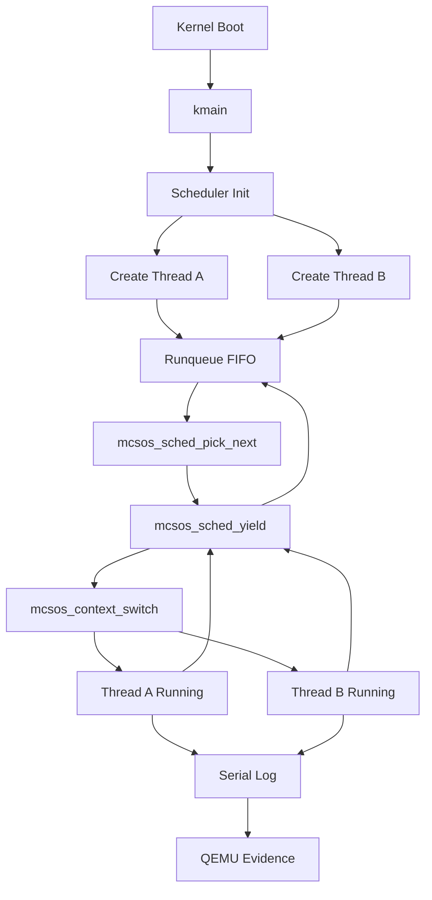

# Template Laporan Praktikum Sistem Operasi Lanjut — MCSOS

**Nama file laporan:** `laporan_praktikum_[M9]_[2583207073007].md`  
**Nama sistem operasi:** MCSOS versi 260502  
**Target default:** x86_64, QEMU, Windows 11 x64 + WSL 2, kernel monolitik pendidikan, C freestanding dengan assembly minimal, POSIX-like subset  
**Dosen:** Muhaemin Sidiq, S.Pd., M.Pd.  
**Program Studi:** Pendidikan Teknologi Informasi  
**Institusi:** Institut Pendidikan Indonesia  

> Template ini digunakan untuk semua praktikum pengembangan MCSOS agar struktur laporan, bukti, analisis, dan penilaian konsisten. Ganti seluruh teks bertanda `[isi ...]` dengan data praktikum sebenarnya. Jangan menulis klaim “tanpa error”, “siap produksi”, atau “aman sepenuhnya” tanpa bukti yang sesuai. Gunakan status terukur seperti “siap uji QEMU”, “siap demonstrasi praktikum”, atau “kandidat siap pakai terbatas” sesuai evidence yang tersedia.

---

## 0. Metadata Laporan

| Atribut | Isi |
|---|---|
| Kode praktikum | `[M9]` |
| Judul praktikum | `[M9 — Kernel Thread, Scheduler, dan Context Switch x86_64 pada MCSOS]` |
| Jenis pengerjaan | `[Individu]` |
| Nama mahasiswa | `[Salma Rahayu]` |
| NIM | `[2583207073007]` |
| Kelas | `[PTI 1-A]` |
| Nama kelompok | `[isi jika kelompok]` |
| Anggota kelompok | `[nama, NIM, peran ringkas]` |
| Tanggal praktikum | `[2026 - 06 - 05]` |
| Tanggal pengumpulan | `[2026 - 06 - 05]` |
| Repository | `[https://github.com/amaaarhyu078-creator/mcsos-]` |
| Branch | `[m9-kernel-thread-scheduler]` |
| Commit hash awal | `[d5702f8]` |
| Commit hash akhir | `[78c9fe5]` |
| Status readiness yang diklaim | `[siap demonstrasi praktikum]` |

---

## 1. Sampul

# Laporan Praktikum `[Kode Praktikum]`  
## `[M9 — Kernel Thread, Scheduler, dan Context Switch x86_64 pada MCSOS]`

Disusun oleh:

| Nama | NIM | Kelas | Peran |
|---|---|---|---|
| `[Salma Rahayu]` | `[2583207073007]` | `[PTI 1-A]` | `[individu]` |
| `[opsional]` | `[opsional]` | `[opsional]` | `[opsional]` |

Dosen Pengampu: **Muhaemin Sidiq, S.Pd., M.Pd.**  
Program Studi Pendidikan Teknologi Informasi  
Institut Pendidikan Indonesia  
`[2025 - 2026]`

---

## 2. Pernyataan Orisinalitas dan Integritas Akademik

Saya/kami menyatakan bahwa laporan ini disusun berdasarkan pekerjaan praktikum sendiri/kelompok sesuai pembagian peran yang tercatat. Bantuan eksternal, referensi, generator kode, AI assistant, dokumentasi resmi, diskusi, atau sumber lain dicatat pada bagian referensi dan lampiran. Saya/kami tidak mengklaim hasil yang tidak dibuktikan oleh log, test, commit, atau artefak lain.

| Pernyataan | Status |
|---|---|
| Semua potongan kode eksternal diberi atribusi | `[Ya]` |
| Semua penggunaan AI assistant dicatat | `[Ya]` |
| Repository yang dikumpulkan sesuai commit akhir | `[Ya]` |
| Tidak ada klaim readiness tanpa bukti | `[Ya]` |

Catatan penggunaan bantuan eksternal:

```text
[Alat:
- ChatGPT (OpenAI)

Prompt ringkas:
- Meminta bimbingan implementasi Praktikum M9 Kernel Thread Scheduler.
- Meminta penjelasan konsep scheduler, runqueue, context switch, dan debugging kernel.
- Meminta bantuan analisis error build, page fault, linker error, serta validasi hasil host test, freestanding build, audit object, QEMU log, dan GDB.

Bagian yang dibantu:
- Analisis error implementasi scheduler.
- Penjelasan konsep dan alur kerja scheduler M9.
- Interpretasi output host test, readelf, nm, objdump, QEMU, dan GDB.
- Review kesesuaian hasil praktikum terhadap acceptance criteria M9.
- Bimbingan penyusunan laporan praktikum.

Verifikasi mandiri yang dilakukan:
- Menjalankan seluruh perintah build dan pengujian secara mandiri di WSL 2.
- Memeriksa hasil host test scheduler.
- Memeriksa hasil audit nm, readelf, dan objdump.
- Memverifikasi log QEMU menunjukkan thread A dan thread B berjalan bergantian.
- Memverifikasi breakpoint GDB pada mcsos_sched_yield dan mcsos_context_switch.
- Memastikan commit Git dan push GitHub berhasil.
- Memastikan repository berada pada kondisi clean (git status).]
```


---
## 3. Tujuan Praktikum

1. `[Mengimplementasikan kernel thread pada MCSOS menggunakan Thread Control Block (TCB), stack kernel, dan state thread yang sesuai dengan kontrak scheduler.]`
2. `[Mengimplementasikan runqueue FIFO dan mekanisme cooperative scheduling sehingga beberapa kernel thread dapat dijalankan secara bergantian melalui operasi yield.]`
3. `[Memahami konsep context switch x86_64, penyimpanan dan pemulihan register CPU, manajemen stack thread, serta invariant scheduler pada sistem operasi single-core.]`
4. `[Memvalidasi implementasi scheduler melalui host unit test, freestanding build, audit object (nm, readelf, objdump), QEMU smoke test, dan debugging menggunakan GDB untuk memastikan scheduler dan kernel thread berfungsi sesuai desain.]`

---

## 4. Capaian Pembelajaran Praktikum

Setelah praktikum ini, mahasiswa mampu:

| CPL/CPMK praktikum | Bukti yang harus ditunjukkan |
|---|---|
| `[Mampu menjelaskan konsep thread kernel, CPU context, scheduler, kernel stack, serta merancang Thread Control Block (TCB) beserta invariant scheduler pada sistem operasi single-core.]` | `[Analisis teori pada laporan, diagram struktur TCB, penjelasan state thread, runqueue, dan invariant scheduler.]` |
| `[Mampu mengimplementasikan cooperative round-robin scheduler menggunakan operasi enqueue, pick next, yield, block, mark ready, serta context switch x86_64.]` | `[Source code mcsos_thread.h, mcsos_thread.c, context_switch.S, diff Git, host unit test PASS, dan QEMU log thread A/B.]` |
| `[Mampu melakukan validasi, audit, debugging, dan analisis failure mode scheduler menggunakan host test, nm, readelf, objdump, QEMU, dan GDB.]` | `[test_scheduler.log, nm_undefined.log, readelf_header.log, objdump_key.log, qemu_m9.log, screenshot GDB breakpoint, register dump, serta analisis failure mode dan readiness review.]` |

---

## 5. Peta Milestone MCSOS

Centang milestone yang menjadi fokus laporan ini. Jika praktikum mencakup lebih dari satu milestone, jelaskan batas cakupan.

| Milestone | Fokus | Status dalam laporan |
|---|---|---|
| M0 | Requirements, governance, baseline arsitektur | `[ ] tidak dibahas / [ ] dibahas / [V] selesai praktikum` |
| M1 | Toolchain reproducible, Git, QEMU, GDB, metadata build | `[ ] tidak dibahas / [ ] dibahas / [V] selesai praktikum` |
| M2 | Boot image, kernel ELF64, early console | `[ ] tidak dibahas / [ ] dibahas / [V] selesai praktikum` |
| M3 | Panic path, linker map, GDB, observability awal | `[ ] tidak dibahas / [ ] dibahas / [V] selesai praktikum` |
| M4 | Trap, exception, interrupt, timer | `[ ] tidak dibahas / [ ] dibahas / [V] selesai praktikum` |
| M5 | PMM, VMM, page table, kernel heap | `[ ] tidak dibahas / [ ] dibahas / [V] selesai praktikum` |
| M6 | Thread, scheduler, synchronization | `[ ] tidak dibahas / [ ] dibahas / [V] selesai praktikum` |
| M7 | Syscall ABI dan user program loader | `[ ] tidak dibahas / [ ] dibahas / [V] selesai praktikum` |
| M8 | VFS, file descriptor, ramfs | `[ ] tidak dibahas / [ ] dibahas / [V] selesai praktikum` |
| M9 | Block layer dan device model | `[ ] tidak dibahas / [V] dibahas / [ ] selesai praktikum` |
| M10 | Persistent filesystem, mcsfs/ext2-like, recovery | `[V] tidak dibahas / [ ] dibahas / [ ] selesai praktikum` |
| M11 | Networking stack, packet parsing, UDP/TCP subset | `[V] tidak dibahas / [ ] dibahas / [ ] selesai praktikum` |
| M12 | Security model, capability/ACL, syscall fuzzing, hardening | `[V] tidak dibahas / [ ] dibahas / [ ] selesai praktikum` |
| M13 | SMP, scalability, lock stress, NUMA-aware preparation | `[V] tidak dibahas / [ ] dibahas / [ ] selesai praktikum` |
| M14 | Framebuffer, graphics console, visual regression | `[V] tidak dibahas / [ ] dibahas / [ ] selesai praktikum` |
| M15 | Virtualization/container subset | `[V] tidak dibahas / [ ] dibahas / [ ] selesai praktikum` |
| M16 | Observability, update/rollback, release image, readiness review | `[V] tidak dibahas / [ ] dibahas / [ ] selesai praktikum` |

Batas cakupan praktikum:

```text
[Praktikum M9 mencakup implementasi kernel thread scheduler kooperatif (cooperative scheduler) pada sistem operasi MCSOS, meliputi Thread Control Block (TCB), state thread, kernel stack, runqueue FIFO, operasi enqueue, pick next, yield, block, mark ready, context switch x86_64, host unit test, audit freestanding object, QEMU smoke test, dan debugging menggunakan GDB.]

[Praktikum ini dibatasi pada lingkungan single-core dan kernel-thread only. Scheduler yang diimplementasikan masih bersifat cooperative sehingga perpindahan thread terjadi melalui yield dan belum menggunakan preemption berbasis timer interrupt.]

[Praktikum ini tidak mencakup user process, user mode, syscall ABI, virtual memory per-process, scheduler SMP (multi-core), load balancing antar CPU, fairness scheduler tingkat lanjut seperti CFS atau EEVDF, real-time scheduling, stress testing skala besar, fuzz testing, maupun verifikasi formal correctness scheduler.]

[Hasil praktikum hanya dapat diklaim siap demonstrasi praktikum dan siap uji QEMU sesuai acceptance criteria M9. Implementasi ini belum dapat diklaim siap produksi, siap multi-core, atau aman terhadap proses pengguna yang bersifat malicious karena boundary user/kernel belum diimplementasikan.]
```
---

## 6. Dasar Teori Ringkas

### 6.1 Kernel Thread

Kernel thread adalah unit eksekusi yang dijadwalkan langsung oleh kernel. Setiap thread memiliki konteks CPU, stack kernel, state eksekusi, dan metadata yang disimpan dalam Thread Control Block (TCB). Berbeda dengan proses, kernel thread pada M9 masih berbagi ruang alamat kernel yang sama dan belum memiliki isolasi memori per-proses.

### 6.2 Thread Control Block (TCB)

Thread Control Block (TCB) adalah struktur data yang menyimpan seluruh informasi yang diperlukan scheduler untuk mengelola thread. Informasi tersebut meliputi identitas thread, state thread, konteks CPU, alamat stack, ukuran stack, entry function, parameter thread, statistik eksekusi, dan linkage untuk runqueue. TCB menjadi pusat pengelolaan lifecycle thread selama scheduler berjalan.

### 6.3 State Thread dan Invariant Scheduler

Scheduler menggunakan beberapa state utama, yaitu NEW, READY, RUNNING, BLOCKED, dan ZOMBIE. Agar scheduler tetap konsisten, beberapa invariant harus dipenuhi, antara lain:

- Satu thread hanya boleh berada pada satu state aktif pada satu waktu.
- Thread RUNNING tidak boleh berada di dalam runqueue.
- Runqueue tidak boleh mengandung pointer siklik.
- Nilai runnable_count harus sama dengan jumlah node pada runqueue.

Invariant tersebut digunakan untuk mencegah korupsi struktur scheduler dan kesalahan penjadwalan thread.

### 6.4 Runqueue dan Round-Robin Cooperative Scheduling

Runqueue adalah struktur data yang menyimpan thread yang siap dijalankan. Pada M9 digunakan runqueue FIFO (First In First Out) dengan algoritma round-robin kooperatif. Scheduler memilih thread berikutnya dari kepala runqueue, kemudian thread yang sedang berjalan dapat menyerahkan CPU secara sukarela melalui operasi yield sehingga thread lain memperoleh kesempatan eksekusi.

### 6.5 Context Switch x86_64

Context switch adalah proses penyimpanan konteks thread yang sedang berjalan dan pemulihan konteks thread tujuan. Pada arsitektur x86_64, implementasi M9 menyimpan register callee-saved yang meliputi rsp, rbp, rbx, r12, r13, r14, r15, serta alamat kelanjutan eksekusi (rip). Setelah konteks thread tujuan dipulihkan, CPU melanjutkan eksekusi pada thread tersebut tanpa kehilangan keadaan sebelumnya.

### 6.6 Kernel Stack

Setiap thread harus memiliki stack kernel sendiri untuk menyimpan frame fungsi, variabel lokal, alamat pengembalian, dan data sementara selama eksekusi. Penggunaan stack yang terpisah mencegah korupsi data antar thread dan memungkinkan context switch dilakukan secara aman.

### 6.7 Host Unit Test dan Validasi Freestanding

Host unit test digunakan untuk memverifikasi logika scheduler tanpa memerlukan emulator QEMU. Pengujian dilakukan terhadap operasi enqueue, dequeue, validasi state, dan perpindahan thread. Setelah itu dilakukan validasi freestanding object menggunakan nm, readelf, dan objdump untuk memastikan object scheduler dapat dibangun pada lingkungan kernel x86_64 serta memiliki symbol dan instruksi yang sesuai.

### 6.8 QEMU dan GDB Debugging

QEMU digunakan sebagai lingkungan eksekusi kernel untuk melakukan smoke test scheduler. Log serial digunakan untuk memverifikasi bahwa thread berjalan secara bergantian sesuai desain round-robin. GDB digunakan untuk melakukan breakpoint pada fungsi scheduler dan context switch, memeriksa register CPU, stack thread, serta memastikan perpindahan konteks berlangsung dengan benar.

### 6.1 Konsep Sistem Operasi yang Diuji

```text
[Praktikum M9 berfokus pada implementasi dan pengujian kernel thread scheduler sebagai salah satu komponen inti sistem operasi. Scheduler bertanggung jawab menentukan thread mana yang memperoleh kesempatan menggunakan CPU dan bagaimana perpindahan eksekusi dilakukan secara aman antar thread.]

[Pada praktikum ini digunakan konsep kernel thread, yaitu unit eksekusi yang dikelola langsung oleh kernel. Setiap thread memiliki konteks CPU, stack kernel, state eksekusi, dan metadata yang disimpan dalam struktur Thread Control Block (TCB). Berbeda dengan proses pada sistem operasi modern, kernel thread pada M9 masih berjalan pada ruang alamat kernel yang sama dan belum memiliki isolasi memori maupun privilege level terpisah.]

[Pengelolaan thread dilakukan menggunakan scheduler round-robin kooperatif (cooperative round-robin scheduler). Dalam model ini, thread yang sedang berjalan tidak dapat dipaksa berhenti oleh timer interrupt, tetapi harus menyerahkan CPU secara sukarela melalui operasi yield(). Scheduler kemudian memilih thread berikutnya dari runqueue berdasarkan urutan FIFO (First In First Out). Pendekatan ini lebih sederhana dibanding scheduler preemptive dan sesuai untuk tahap awal pengembangan kernel.]

[Setiap thread memiliki state yang menggambarkan kondisi eksekusinya. State yang digunakan meliputi NEW, READY, RUNNING, BLOCKED, dan ZOMBIE. Scheduler harus menjaga invariant bahwa satu thread hanya boleh berada pada satu state aktif pada satu waktu, thread RUNNING tidak boleh berada di dalam runqueue, dan jumlah runnable_count harus selalu sesuai dengan jumlah node yang terdapat pada runqueue.]

[Konsep penting lainnya adalah context switch. Context switch merupakan proses penyimpanan keadaan CPU dari thread yang sedang berjalan dan pemulihan keadaan CPU milik thread tujuan. Pada arsitektur x86_64, implementasi M9 menyimpan register callee-saved yang terdiri dari rsp, rbp, rbx, r12, r13, r14, dan r15, serta alamat kelanjutan eksekusi (rip). Dengan mekanisme ini, thread dapat dihentikan sementara dan dilanjutkan kembali tanpa kehilangan kondisi sebelumnya.]

[Praktikum ini juga menekankan pentingnya kernel stack. Setiap thread harus memiliki stack kernel sendiri karena stack digunakan untuk menyimpan frame fungsi, variabel lokal, alamat pengembalian fungsi, dan data sementara selama eksekusi. Apabila beberapa thread menggunakan stack yang sama, maka data antar thread dapat saling menimpa dan menyebabkan korupsi memori atau crash sistem.]

[Implementasi scheduler M9 dibangun di atas subsistem yang telah dikembangkan pada milestone sebelumnya. Physical Memory Manager (PMM) digunakan untuk menyediakan frame memori fisik, Virtual Memory Manager (VMM) menyediakan abstraksi pemetaan alamat virtual, dan heap kernel menyediakan alokasi memori dinamis. Dengan demikian scheduler dapat berjalan di atas fondasi manajemen memori yang telah tersedia.]

[Selain implementasi scheduler, praktikum juga menguji kemampuan validasi dan debugging kernel. Validasi dilakukan melalui host unit test untuk menguji logika scheduler tanpa QEMU, audit object menggunakan nm, readelf, dan objdump untuk memeriksa simbol serta struktur ELF, QEMU smoke test untuk mengamati perilaku runtime scheduler, dan GDB untuk memeriksa register CPU, stack thread, serta proses context switch secara langsung.]

[Ruang lingkup M9 masih terbatas pada scheduler kernel-thread single-core yang bersifat cooperative. Praktikum ini belum mencakup user process, user mode, syscall ABI, virtual memory per-process, scheduler multi-core (SMP), fairness scheduler tingkat lanjut seperti CFS atau EEVDF, networking, filesystem, maupun mekanisme keamanan tingkat lanjut. Oleh karena itu hasil yang dicapai pada M9 hanya dapat diklaim sebagai implementasi scheduler awal yang siap diuji dan didemonstrasikan dalam lingkungan praktikum.]
```

### 6.2 Konsep Arsitektur x86_64 yang Relevan

| Konsep | Relevansi pada praktikum | Bukti/verifikasi |
|---|---|---|
| `[Long Mode x86_64]` | `[MCSOS berjalan pada mode 64-bit sehingga scheduler, kernel thread, dan context switch menggunakan register 64-bit serta alamat memori 64-bit.]` | `[Build kernel ELF64, readelf -h menunjukkan Machine: Advanced Micro Devices X86-64, QEMU boot log berhasil.]` |
| `[Register CPU dan Context Switch]` | `[Scheduler harus menyimpan dan memulihkan konteks CPU saat berpindah antar thread. Register callee-saved yang digunakan meliputi rsp, rbp, rbx, r12, r13, r14, r15, serta alamat kelanjutan eksekusi (rip).]` | `[Implementasi context_switch.S, audit objdump symbol mcsos_context_switch, GDB register dump, breakpoint pada mcsos_context_switch.]` |
| `[Kernel Stack]` | `[Setiap thread memerlukan stack sendiri agar frame fungsi, variabel lokal, dan alamat pengembalian tidak saling menimpa saat terjadi context switch.]` | `[Implementasi stack thread pada TCB, host test scheduler, GDB stack inspection menggunakan x/16gx $rsp.]` |
| `[Interrupt dan IDT]` | `[Scheduler M9 berjalan di atas infrastruktur interrupt yang telah dibangun pada milestone sebelumnya. IDT dan trap handling diperlukan agar kernel tetap dapat menangani fault dan panic selama pengujian scheduler.]` | `[Log IDT loaded, trap diagnostics M4, QEMU serial log, panic path tetap berfungsi.]` |
| `[Paging dan Virtual Memory]` | `[Kernel scheduler berjalan pada lingkungan memori virtual yang telah disediakan VMM M7 sehingga struktur scheduler, stack thread, dan heap kernel dapat diakses melalui alamat virtual kernel.]` | `[Log VMM core initialized, build dan boot kernel berhasil, integrasi dengan subsistem M7.]` |
| `[ELF dan Symbol Resolution]` | `[Kode scheduler dan context switch harus berhasil dikompilasi dan dilink ke dalam kernel ELF sehingga symbol dapat ditemukan saat debugging dan audit.]` | `[readelf -h, nm -u, objdump, breakpoint GDB pada mcsos_sched_yield dan mcsos_context_switch.]` |

### 6.3 Konsep Implementasi Freestanding

| Aspek | Keputusan praktikum |
|---|---|
| Bahasa | `[C17 freestanding dan assembly x86_64]` |
| Runtime | `[Tanpa hosted libc; menggunakan runtime kernel sendiri dengan implementasi utilitas dasar yang disediakan MCSOS.]` |
| ABI | `[x86_64 System V ABI untuk pemanggilan fungsi kernel dan context switch internal.]` |
| Compiler flags kritis | `[-ffreestanding, -fno-builtin, -fno-stack-protector, -fno-pic, -fno-pie, -mno-red-zone, -mcmodel=kernel, -nostdlib (pada tahap linking kernel).]` |
| Risiko undefined behavior | `[Pointer tidak valid, stack tidak aligned 16-byte, context switch ke alamat yang salah, korupsi runqueue, integer overflow pada counter scheduler, dan akses memori di luar area stack thread.]` |

### 6.4 Referensi Teori yang Digunakan

| No. | Sumber | Bagian yang digunakan | Alasan relevansi |
|---|---|---|---|
| `[1]` | `[Intel® 64 and IA-32 Architectures Software Developer's Manual]` | `[Register x86_64, calling convention, stack, dan control flow.]` | `[Digunakan untuk memahami context switch, penggunaan register callee-saved, serta mekanisme eksekusi pada arsitektur x86_64.]` |
| `[2]` | `[System V Application Binary Interface AMD64 Architecture Processor Supplement]` | `[AMD64 Calling Convention.]` | `[Menjadi acuan penyimpanan register dan interoperabilitas antara kode C dan assembly pada context switch.]` |
| `[3]` | `[Operating System Concepts (Silberschatz, Galvin, Gagne)]` | `[CPU Scheduling dan Threads.]` | `[Digunakan untuk memahami konsep thread, scheduler, state thread, dan algoritma round-robin.]` |
| `[4]` | `[Operating Systems: Three Easy Pieces (Remzi H. Arpaci-Dusseau & Andrea C. Arpaci-Dusseau)]` | `[Concurrency dan CPU Scheduling.]` | `[Menjelaskan konsep scheduler, context switch, kernel thread, dan fairness scheduling.]` |
| `[5]` | `[Dokumentasi dan Source Code MCSOS Praktikum M0–M9]` | `[PMM, VMM, Heap Kernel, Scheduler, dan Integrasi Kernel.]` | `[Digunakan sebagai referensi implementasi aktual yang dibangun dan diuji selama praktikum.]` |

---

## 7. Lingkungan Praktikum

### 7.1 Host dan Target

| Komponen | Nilai |
|---|---|
| Host OS | `[Windows 11 x64 dengan WSL 2]` |
| Lingkungan build | `[WSL 2 Ubuntu 26.04 LTS]` |
| Target ISA | `x86_64` |
| Target ABI | `[x86_64-unknown-none-elf]` |
| Emulator | `[QEMU emulator version 10.2.1 (Debian 1:10.2.1+ds-1ubuntu3)]` |
| Firmware emulator | `[Limine Boot Protocol pada lingkungan QEMU x86_64 sesuai konfigurasi praktikum]` |
| Debugger | `[GNU gdb (Ubuntu 17.1-2ubuntu1) 17.1]` |
| Build system | `[GNU Make 4.4.1]` |
| Bahasa utama | `[C17 freestanding]` |
| Assembly | `[GNU Assembler (GAS) x86_64 melalui Clang 21.1.8]` |

### 7.2 Versi Toolchain

Tempel output versi toolchain berikut. Jalankan dari clean shell WSL.

```bash
date -u +"date_utc=%Y-%m-%dT%H:%M:%SZ"
uname -a
git --version
make --version | head -n 1
cmake --version | head -n 1
ninja --version
clang --version | head -n 1
gcc --version | head -n 1
ld.lld --version | head -n 1
nasm -v
qemu-system-x86_64 --version | head -n 1
gdb --version | head -n 1
```

Output:

```text
date_utc=2026-06-05T13:31:10Z
Linux DESKTOP-S5LUA56 6.6.114.1-microsoft-standard-WSL2 #1 SMP PREEMPT_DYNAMIC Mon Dec  1 20:46:23 UTC 2025 x86_64 GNU/Linux
git version 2.53.0
GNU Make 4.4.1
cmake version 4.2.3
1.13.2
Ubuntu clang version 21.1.8 (6ubuntu1)
gcc (Ubuntu 15.2.0-16ubuntu1) 15.2.0
Ubuntu LLD 21.1.8 (compatible with GNU linkers)
NASM version 3.01
QEMU emulator version 10.2.1 (Debian 1:10.2.1+ds-1ubuntu3)
GNU gdb (Ubuntu 17.1-2ubuntu1) 17.1
```

### 7.3 Lokasi Repository

| Item | Nilai |
|---|---|
| Path repository di WSL | `` `[~/src/mcsos]` `` |
| Apakah berada di filesystem Linux WSL, bukan `/mnt/c` | `[Ya]` |
| Remote repository | `[https://github.com/amaaarhyu078-creator/mcsos-.git]` |
| Branch | `[m9-kernel-thread-scheduler]` |
| Commit hash awal | `` `[d5702f8]` `` |
| Commit hash akhir | `` `[78c9fe5]` `` |

---

## 8. Repository dan Struktur File

### 8.1 Struktur Direktori yang Relevan

Tampilkan hanya direktori dan file yang relevan dengan praktikum.

```text
[mcsos/
├── include/
│   └── mcsos_thread.h
├── kernel/
│   ├── mcsos_thread.c
│   ├── arch/
│   │   └── x86_64/
│   │       └── context_switch.S
│   └── core/
│       └── kmain.c
├── tests/
│   └── test_scheduler.c
├── evidence/
│   ├── m9/
│   │   └── qemu_m9.log
│   └── screenshots/
│       ├── m9-host-test-pass.png
│       ├── m9-freestanding-object.png
│       ├── m9-nm-undefined-empty.png
│       ├── m9-readelf-header.png
│       ├── m9-objdump-context-switch.png
│       ├── m9-qemu-thread-switch.png
│       ├── m9-gdb-breakpoint.png
│       ├── m9-gdb-registers.png
│       └── m9-git-commit.png
└── Makefile]
```

### 8.2 File yang Dibuat atau Diubah

| File | Jenis perubahan | Alasan perubahan | Risiko |
|---|---|---|---|
| `[include/mcsos_thread.h]` | `[baru]` | `[Menambahkan definisi Thread Control Block (TCB), CPU context, state thread, dan struktur scheduler yang digunakan oleh M9.]` | `[Sedang — kesalahan definisi struktur dapat menyebabkan korupsi scheduler atau context switch.]` |
| `[kernel/mcsos_thread.c]` | `[baru]` | `[Mengimplementasikan scheduler kooperatif, runqueue FIFO, operasi enqueue, pick next, yield, block, mark ready, dan validasi invariant scheduler.]` | `[Tinggi — kesalahan logika scheduler dapat menyebabkan hang, loop tak berujung, atau korupsi state thread.]` |
| `[kernel/arch/x86_64/context_switch.S]` | `[baru]` | `[Mengimplementasikan context switch x86_64 untuk menyimpan dan memulihkan register thread.]` | `[Tinggi — kesalahan assembly dapat menyebabkan crash kernel, triple fault, atau context corruption.]` |
| `[kernel/core/kmain.c]` | `[ubah]` | `[Mengintegrasikan scheduler M9 ke proses boot kernel serta menambahkan thread demo untuk pengujian runtime.]` | `[Sedang — integrasi yang salah dapat menyebabkan boot gagal atau scheduler tidak berjalan.]` |
| `[tests/test_scheduler.c]` | `[baru]` | `[Menambahkan host unit test untuk memverifikasi logika scheduler tanpa QEMU.]` | `[Rendah — hanya memengaruhi validasi pengujian.]` |
| `[Makefile]` | `[ubah]` | `[Menambahkan target m9-host-test, m9-freestanding, m9-audit, dan m9-all.]` | `[Sedang — kesalahan konfigurasi build dapat menyebabkan target praktikum gagal dijalankan.]` |
| `[evidence/m9/qemu_m9.log]` | `[baru]` | `[Menyimpan bukti runtime scheduler pada QEMU.]` | `[Rendah — hanya berfungsi sebagai artefak bukti.]` |
| `[evidence/screenshots/*]` | `[baru]` | `[Menyimpan screenshot hasil host test, audit object, QEMU, GDB, dan commit Git.]` | `[Rendah — hanya digunakan sebagai dokumentasi praktikum.]` |

### 8.3 Ringkasan Diff

```bash
git status --short
git diff --stat
git log --oneline -n 5
```

Output:

```text
[78c9fe5 (HEAD -> m9-kernel-thread-scheduler, origin/m9-kernel-thread-scheduler) Implement M9 kernel thread scheduler
d5702f8 (origin/praktikum/m8-kernel-heap, praktikum/m8-kernel-heap) Add M8 evidence screenshots
2a151a3 Implement M8 kernel heap allocator
517f6b5 (origin/praktikum/m7-vmm, praktikum/m7-vmm, praktikum/m6-pmm) Implement M7 virtual memory manager core and diagnostics
ccee310 (origin/praktikum/m6-pmm) Integrate M6 PMM with Limine memory map]
```

---

## 9. Desain Teknis

### 9.1 Masalah yang Diselesaikan

```text
[Sebelum M9, kernel MCSOS hanya memiliki satu alur eksekusi (single execution path) yang berjalan sejak boot hingga masuk ke idle loop. Kernel belum memiliki mekanisme untuk mengelola beberapa thread, melakukan pergantian konteks CPU, maupun menjadwalkan eksekusi beberapa pekerjaan secara bergantian.]

[Akibatnya, tidak ada abstraksi thread yang memungkinkan kernel menjalankan lebih dari satu unit kerja secara terstruktur. Seluruh kode berjalan pada konteks yang sama sehingga tidak tersedia mekanisme untuk memisahkan state eksekusi, stack, maupun statistik eksekusi setiap tugas.]

[Praktikum M9 menyelesaikan masalah tersebut dengan menambahkan kernel thread scheduler kooperatif berbasis runqueue FIFO. Scheduler menyediakan Thread Control Block (TCB), state thread, kernel stack terpisah untuk setiap thread, operasi enqueue dan dequeue runqueue, mekanisme yield, serta context switch x86_64 untuk menyimpan dan memulihkan konteks CPU.]

[Implementasi ini memungkinkan beberapa kernel thread dijalankan secara bergantian pada satu CPU menggunakan pendekatan round-robin kooperatif. Selain itu, M9 menyediakan fondasi yang diperlukan untuk pengembangan fitur lanjutan seperti blocking synchronization, timer-based wakeup, scheduler preemptive, maupun user process pada milestone berikutnya.]
```

### 9.2 Keputusan Desain

| Keputusan | Alternatif yang dipertimbangkan | Alasan memilih | Konsekuensi |
|---|---|---|---|
| `[Menggunakan cooperative scheduler berbasis yield().]` | `[Scheduler preemptive berbasis timer interrupt.]` | `[Lebih sederhana untuk tahap awal pengembangan kernel dan lebih mudah divalidasi menggunakan QEMU serta GDB.]` | `[Thread yang tidak memanggil yield() dapat memonopoli CPU.]` |
| `[Menggunakan algoritma round-robin dengan runqueue FIFO.]` | `[Priority scheduler atau fairness scheduler seperti CFS.]` | `[Implementasi sederhana, mudah diuji, dan cukup untuk demonstrasi context switch.]` | `[Belum mempertimbangkan prioritas maupun fairness tingkat lanjut.]` |
| `[Setiap thread memiliki kernel stack sendiri.]` | `[Menggunakan satu stack bersama.]` | `[Mencegah korupsi frame fungsi dan memungkinkan context switch yang aman.]` | `[Membutuhkan alokasi memori tambahan untuk setiap thread.]` |
| `[Menyimpan register callee-saved (rsp, rbp, rbx, r12-r15, rip) pada context switch.]` | `[Menyimpan seluruh register CPU.]` | `[Sesuai AMD64 System V ABI dan lebih efisien.]` | `[Implementasi harus mematuhi ABI agar tidak terjadi context corruption.]` |
| `[Menggunakan validasi magic value dan state thread.]` | `[Tanpa validasi internal.]` | `[Membantu mendeteksi korupsi TCB dan kesalahan state scheduler lebih awal.]` | `[Menambah sedikit overhead pemeriksaan.]` |
| `[Menyediakan host unit test terpisah dari QEMU.]` | `[Hanya menguji melalui boot kernel di QEMU.]` | `[Mempermudah validasi logika scheduler dan mempercepat proses debugging.]` | `[Membutuhkan kode pengujian tambahan.]` |

### 9.3 Arsitektur Ringkas

Tambahkan diagram ASCII atau Mermaid. Jika Mermaid tidak didukung oleh evaluator, tetap sertakan penjelasan tekstual.



Penjelasan diagram:

```text
[Proses dimulai ketika kernel menyelesaikan inisialisasi subsistem sebelumnya dan memasuki bagian M9 pada fungsi kmain(). Scheduler diinisialisasi melalui mcsos_scheduler_init() dengan boot thread sebagai thread awal.]

[Selanjutnya kernel membuat dua thread demonstrasi menggunakan mcsos_thread_prepare(). Setiap thread memperoleh Thread Control Block (TCB), context CPU, dan kernel stack yang terpisah. Kedua thread kemudian dimasukkan ke dalam runqueue FIFO melalui mcsos_sched_enqueue().]

[Saat scheduler berjalan, fungsi mcsos_sched_pick_next() memilih thread berikutnya dari kepala runqueue. Apabila thread yang sedang berjalan memanggil mcsos_sched_yield(), scheduler memilih thread lain dan melakukan perpindahan konteks menggunakan mcsos_context_switch() yang ditulis dalam assembly x86_64.]

[Context switch menyimpan register thread lama dan memulihkan register thread baru sehingga CPU dapat melanjutkan eksekusi pada thread tujuan. Thread A dan Thread B kemudian berjalan secara bergantian dan menghasilkan log serial yang diamati melalui QEMU.]

[Log serial, host unit test, audit object freestanding, dan debugging GDB digunakan sebagai bukti bahwa scheduler berfungsi sesuai desain. Batas tanggung jawab M9 hanya mencakup scheduler kernel-thread kooperatif single-core dan belum mencakup user process maupun scheduler preemptive.]
```

### 9.4 Kontrak Antarmuka

| Antarmuka | Pemanggil | Penerima | Precondition | Postcondition | Error path |
|---|---|---|---|---|---|
| `[mcsos_scheduler_init()]` | `[kmain()]` | `[Scheduler subsystem]` | `[Pointer scheduler dan boot thread valid.]` | `[Scheduler terinisialisasi dan boot thread menjadi current thread.]` | `[Mengembalikan MCSOS_SCHED_EINVAL jika parameter tidak valid.]` |
| `[mcsos_thread_prepare()]` | `[kmain()]` | `[Thread subsystem]` | `[Thread object valid, entry function tersedia, stack valid, dan ukuran stack memenuhi batas minimum.]` | `[TCB terisi lengkap dan thread siap dimasukkan ke runqueue.]` | `[Mengembalikan MCSOS_SCHED_EINVAL atau MCSOS_SCHED_ESTACK jika validasi gagal.]` |
| `[mcsos_sched_enqueue()]` | `[Scheduler dan thread management]` | `[Runqueue FIFO]` | `[Thread valid dan berada pada state yang dapat dijadwalkan.]` | `[Thread masuk ke ekor runqueue dan runnable_count bertambah.]` | `[Mengembalikan MCSOS_SCHED_EINVAL atau MCSOS_SCHED_ESTATE.]` |
| `[mcsos_sched_pick_next()]` | `[Scheduler]` | `[Runqueue FIFO]` | `[Scheduler telah terinisialisasi.]` | `[Mengembalikan thread berikutnya atau idle thread jika runqueue kosong.]` | `[Mengembalikan NULL apabila scheduler tidak valid.]` |
| `[mcsos_sched_yield()]` | `[Kernel thread]` | `[Scheduler]` | `[Current thread valid dan scheduler aktif.]` | `[Thread berikutnya dipilih dan context switch dilakukan.]` | `[Mengembalikan kode error apabila scheduler atau thread korup.]` |
| `[mcsos_context_switch()]` | `[mcsos_sched_yield()]` | `[CPU context layer]` | `[Old context dan new context valid.]` | `[Register thread lama tersimpan dan register thread baru dipulihkan.]` | `[Dapat menyebabkan crash atau undefined behavior apabila context tidak valid.]` |

### 9.5 Struktur Data Utama

| Struktur data | Field penting | Ownership | Lifetime | Invariant |
|---|---|---|---|---|
| `` `[mcsos_thread_t]` `` | `[magic, id, state, context, entry, arg, stack_base, stack_size, next, switches, ticks]` | `[Scheduler subsystem]` | `[Dibuat saat thread dipersiapkan dan hidup selama thread digunakan.]` | `[Magic valid, state konsisten, stack valid, dan linkage runqueue tidak korup.]` |
| `` `[mcsos_context_t]` `` | `[rsp, rbp, rbx, r12, r13, r14, r15, rip]` | `[Thread pemilik context]` | `[Aktif selama thread masih ada.]` | `[Merepresentasikan keadaan CPU yang dapat dipulihkan dengan context switch.]` |
| `` `[mcsos_scheduler_t]` `` | `[current, idle, ready_head, ready_tail, runnable_count, context_switches, ticks]` | `[Kernel scheduler]` | `[Dibuat saat boot kernel dan aktif selama kernel berjalan.]` | `[Current thread valid, runnable_count sesuai jumlah node runqueue, dan ready queue tidak siklik.]` |

### 9.6 Invariants

Tuliskan invariant yang harus benar sepanjang eksekusi.

1. `[Setiap thread hanya boleh berada pada satu state aktif pada satu waktu (NEW, READY, RUNNING, BLOCKED, atau ZOMBIE).]`
2. `[Thread yang berada pada state RUNNING tidak boleh muncul di dalam runqueue.]`
3. `[Runqueue FIFO tidak boleh mengandung pointer siklik dan setiap node hanya boleh muncul satu kali.]`
4. `[Nilai runnable_count harus selalu sama dengan jumlah node yang terdapat pada runqueue.]`
5. `[Setiap TCB harus memiliki magic value yang valid sebelum digunakan oleh scheduler.]`
6. `[Setiap thread harus memiliki kernel stack yang valid dan terpisah dari thread lain.]`
7. `[Context switch harus menyimpan dan memulihkan seluruh register callee-saved yang menjadi tanggung jawab ABI x86_64 System V.]`
8. `[Scheduler M9 hanya berjalan pada lingkungan single-core dan cooperative scheduling; tidak ada preemption dari timer interrupt.]`


### 9.7 Ownership, Locking, dan Concurrency

| Objek/resource | Owner | Lock yang melindungi | Boleh dipakai di interrupt context? | Catatan |
|---|---|---|---|---|
| `[mcsos_scheduler_t]` | `[Kernel scheduler subsystem]` | `[None]` | `[Tidak]` | `[M9 masih menggunakan cooperative scheduler single-core sehingga belum memerlukan mekanisme locking.]` |
| `[Runqueue (ready_head dan ready_tail)]` | `[Scheduler]` | `[None]` | `[Tidak]` | `[Seluruh operasi enqueue dan dequeue dilakukan dari konteks scheduler secara terkontrol.]` |
| `[mcsos_thread_t]` | `[Scheduler dan thread pemilik]` | `[None]` | `[Tidak]` | `[TCB tidak dirancang untuk akses paralel karena M9 belum mendukung SMP maupun preemption.]` |
| `[Kernel stack thread]` | `[Thread pemilik]` | `[None]` | `[Tidak]` | `[Setiap thread memiliki stack sendiri sehingga tidak terjadi sharing antar thread.]` |
| `[CPU context (mcsos_context_t)]` | `[Thread pemilik]` | `[None]` | `[Tidak]` | `[Hanya diakses saat context switch berlangsung.]` |

Lock order yang berlaku:

```text
[M9 tidak menggunakan spinlock maupun mutex karena scheduler masih berjalan pada model cooperative single-core. Pada desain ini hanya satu thread yang aktif menggunakan CPU pada satu waktu dan perpindahan eksekusi terjadi melalui yield(). Oleh karena itu tidak terdapat lock hierarchy maupun lock ordering yang harus dipatuhi.]

[Interrupt timer dari milestone sebelumnya tetap aktif untuk keperluan log dan tick, namun scheduler M9 tidak dipanggil secara sembarang dari interrupt context. Context switch hanya dilakukan dari safe point melalui mcsos_sched_yield().]

[Apabila scheduler dikembangkan menjadi preemptive atau multi-core pada milestone berikutnya, maka diperlukan mekanisme sinkronisasi seperti spinlock dan aturan lock ordering untuk melindungi runqueue dan struktur scheduler.]
```

### 9.8 Memory Safety dan Undefined Behavior Risk

| Risiko | Lokasi | Mitigasi | Bukti |
|---|---|---|---|
| `[Stack misalignment]` | `[mcsos_thread_prepare() pada kernel/mcsos_thread.c]` | `[Stack pointer disejajarkan ke batas 16-byte sebelum digunakan.]` | `[Host unit test PASS, QEMU thread switching berhasil, GDB register inspection.]` |
| `[Invalid thread pointer]` | `[Seluruh operasi scheduler]` | `[Validasi magic value dan valid_thread_object() sebelum thread digunakan.]` | `[Review source code dan fungsi mcsos_sched_validate().]` |
| `[Double enqueue]` | `[mcsos_sched_enqueue()]` | `[Validasi state thread sebelum dimasukkan ke runqueue.]` | `[Host unit test dan QEMU log menunjukkan pergantian thread normal.]` |
| `[Context corruption]` | `[context_switch.S]` | `[Menyimpan dan memulihkan seluruh register callee-saved sesuai ABI.]` | `[Audit objdump, GDB breakpoint, dan register dump.]` |
| `[Runqueue corruption]` | `[ready_head dan ready_tail]` | `[Validasi invariant melalui mcsos_sched_validate().]` | `[Host unit test PASS dan scheduler berjalan stabil di QEMU.]` |
| `[Stack overlap]` | `[Kernel thread stack]` | `[Setiap thread menggunakan stack terpisah dengan ukuran tetap.]` | `[Review implementasi TCB dan hasil context switch runtime.]` |

### 9.9 Security Boundary

| Boundary | Data tidak tepercaya | Validasi yang dilakukan | Failure mode aman |
|---|---|---|---|
| `[Boot handoff (Limine)]` | `[Memory map dan informasi bootloader.]` | `[Validasi pointer response sebelum digunakan.]` | `[Kernel panic dengan pesan diagnostik apabila data tidak tersedia.]` |
| `[Thread creation]` | `[Pointer thread, entry function, dan stack.]` | `[Pemeriksaan NULL, ukuran stack minimum, dan validasi alignment.]` | `[Mengembalikan kode error scheduler.]` |
| `[Scheduler state transition]` | `[State thread dan linkage runqueue.]` | `[Validasi state sebelum enqueue, dequeue, block, dan ready.]` | `[Mengembalikan error atau gagal validasi invariant.]` |
| `[Context switch]` | `[CPU context thread.]` | `[Penyimpanan dan pemulihan register sesuai ABI x86_64.]` | `[Fault, panic, atau penghentian eksekusi apabila context korup.]` |

```text
[M9 belum memiliki boundary keamanan user/kernel karena seluruh thread masih merupakan kernel thread yang berjalan dengan hak akses kernel penuh. Oleh karena itu tidak terdapat syscall interface, user pointer validation, capability checking, maupun privilege separation.]

[Model ancaman M9 berfokus pada bug internal kernel seperti korupsi TCB, stack overlap, context corruption, double enqueue, dan pemanggilan scheduler pada waktu yang tidak tepat. Mitigasi yang digunakan meliputi validasi magic value, validasi state scheduler, audit object freestanding, host unit test, QEMU smoke test, serta debugging menggunakan GDB.]

[Karena belum terdapat user mode maupun proses pengguna, implementasi M9 tidak dapat diklaim aman terhadap privilege escalation, malicious process, ataupun serangan antar proses. Hasil praktikum hanya membuktikan bahwa scheduler kernel-thread single-core bekerja sesuai desain dan telah memiliki validasi internal dasar.]
```
---

## 10. Langkah Kerja Implementasi

### Langkah 1 — Perancangan Struktur Scheduler dan Thread

Maksud langkah:

```text
[Langkah ini dilakukan untuk menyediakan fondasi scheduler M9 berupa Thread Control Block (TCB), CPU context, state thread, dan struktur scheduler. Struktur data ini menjadi dasar seluruh operasi penjadwalan thread pada kernel.]
```

Perintah:

```bash
nano include/mcsos_thread.h
```

Output ringkas:

```text
[Berhasil membuat definisi mcsos_thread_t, mcsos_context_t, dan mcsos_scheduler_t.]
```

Artefak yang dihasilkan:

| Artefak | Lokasi | Fungsi |
|---|---|---|
| `[mcsos_thread.h]` | `[include/mcsos_thread.h]` | `[Definisi TCB, context CPU, state thread, dan scheduler.]` |

Indikator berhasil:

```text
[Header dapat dikompilasi tanpa error dan seluruh struktur yang dibutuhkan scheduler tersedia.]
```

---

### Langkah 2 — Implementasi Scheduler Kooperatif

Maksud langkah:

```text
[Langkah ini bertujuan mengimplementasikan operasi utama scheduler seperti inisialisasi scheduler, pembuatan thread, enqueue, dequeue, yield, block, dan validasi invariant.]
```

Perintah:

```bash
nano kernel/mcsos_thread.c
```

Output ringkas:

```text
[Berhasil mengimplementasikan fungsi scheduler dan manajemen thread kernel.]
```

Artefak yang dihasilkan:

| Artefak | Lokasi | Fungsi |
|---|---|---|
| `[mcsos_thread.c]` | `[kernel/mcsos_thread.c]` | `[Implementasi scheduler dan thread management.]` |

Indikator berhasil:

```text
[Semua fungsi scheduler dapat dikompilasi dan digunakan oleh kernel.]
```

---

### Langkah 3 — Implementasi Context Switch x86_64

Maksud langkah:

```text
[Langkah ini dilakukan untuk memungkinkan perpindahan eksekusi antar thread melalui penyimpanan dan pemulihan register CPU.]
```

Perintah:

```bash
nano kernel/arch/x86_64/context_switch.S
```

Output ringkas:

```text
[Berhasil membuat fungsi mcsos_context_switch dalam assembly x86_64.]
```

Artefak yang dihasilkan:

| Artefak | Lokasi | Fungsi |
|---|---|---|
| `[context_switch.S]` | `[kernel/arch/x86_64/context_switch.S]` | `[Menyimpan dan memulihkan context CPU antar thread.]` |

Indikator berhasil:

```text
[Symbol mcsos_context_switch muncul pada hasil objdump dan dapat dihentikan menggunakan breakpoint GDB.]
```

---

### Langkah 4 — Integrasi Scheduler ke Kernel

Maksud langkah:

```text
[Scheduler harus diintegrasikan ke proses boot kernel agar thread dapat dibuat dan dijalankan saat sistem mulai berjalan.]
```

Perintah:

```bash
nano kernel/core/kmain.c
```

Output ringkas:

```text
[M9] scheduler initialized
[M9] starting first scheduler switch
```

Artefak yang dihasilkan:

| Artefak | Lokasi | Fungsi |
|---|---|---|
| `[kmain.c]` | `[kernel/core/kmain.c]` | `[Menginisialisasi scheduler dan thread demo.]` |

Indikator berhasil:

```text
[Kernel berhasil boot dan scheduler terinisialisasi tanpa panic.]
```

---

### Langkah 5 — Pembuatan Host Unit Test

Maksud langkah:

```text
[Host unit test digunakan untuk memvalidasi logika scheduler tanpa menjalankan QEMU sehingga debugging menjadi lebih cepat.]
```

Perintah:

```bash
make m9-host-test
```

Output ringkas:

```text
M9 scheduler host unit test PASS
```

Artefak yang dihasilkan:

| Artefak | Lokasi | Fungsi |
|---|---|---|
| `[m9_host_test]` | `[build/m9/m9_host_test]` | `[Executable host unit test scheduler.]` |
| `[test_scheduler.log]` | `[build/m9/test_scheduler.log]` | `[Log hasil pengujian.]` |

Indikator berhasil:

```text
[Host unit test menampilkan pesan PASS tanpa error.]
```

---

### Langkah 6 — Audit Object Freestanding

Maksud langkah:

```text
[Audit dilakukan untuk memastikan scheduler dapat dibangun sebagai object freestanding x86_64 dan memenuhi persyaratan simbol serta format ELF.]
```

Perintah:

```bash
make m9-freestanding
make m9-audit
```

Output ringkas:

```text
ELF64
Machine: Advanced Micro Devices X86-64
mcsos_context_switch
```

Artefak yang dihasilkan:

| Artefak | Lokasi | Fungsi |
|---|---|---|
| `[m9_scheduler_combined.o]` | `[build/m9/]` | `[Object gabungan scheduler.]` |
| `[nm_undefined.log]` | `[build/m9/]` | `[Audit symbol.]` |
| `[readelf_header.log]` | `[build/m9/]` | `[Audit ELF.]` |
| `[objdump_key.log]` | `[build/m9/]` | `[Audit disassembly.]` |

Indikator berhasil:

```text
[nm -u kosong, object berformat ELF64 x86_64, dan symbol mcsos_context_switch ditemukan.]
```

---

### Langkah 7 — Pengujian Runtime Menggunakan QEMU

Maksud langkah:

```text
[Pengujian dilakukan untuk memastikan scheduler dapat menjalankan lebih dari satu thread dan melakukan context switch secara benar pada kernel yang sedang berjalan.]
```

Perintah:

```bash
make
make iso
```

Output ringkas:

```text
[M9] scheduler initialized
[M9] thread A tick
[M9] thread B tick
```

Artefak yang dihasilkan:

| Artefak | Lokasi | Fungsi |
|---|---|---|
| `[qemu_m9.log]` | `[evidence/m9/qemu_m9.log]` | `[Bukti runtime scheduler.]` |

Indikator berhasil:

```text
[Thread A dan Thread B muncul bergantian secara terus-menerus pada log serial.]
```

---

### Langkah 8 — Debugging Menggunakan GDB

Maksud langkah:

```text
[Debugging dilakukan untuk memverifikasi bahwa context switch benar-benar terjadi dan register CPU berpindah ke stack thread tujuan.]
```

Perintah:

```bash
gdb build/kernel.elf
target remote localhost:1234
break mcsos_sched_yield
break mcsos_context_switch
continue
info registers rsp rbp rip
x/16gx $rsp
```

Output ringkas:

```text
Breakpoint 1, mcsos_context_switch ()
Breakpoint 2, mcsos_sched_yield ()
```

Artefak yang dihasilkan:

| Artefak | Lokasi | Fungsi |
|---|---|---|
| `[m9-gdb-breakpoint.png]` | `[evidence/screenshots/]` | `[Bukti breakpoint scheduler.]` |
| `[m9-gdb-registers.png]` | `[evidence/screenshots/]` | `[Bukti pemeriksaan register CPU.]` |

Indikator berhasil:

```text
[GDB berhasil berhenti pada mcsos_sched_yield dan mcsos_context_switch serta register CPU dapat diperiksa.]
```
---

## 11. Checkpoint Buildable

Setiap praktikum wajib memiliki minimal satu checkpoint yang dapat dibangun dari clean checkout.

| Checkpoint | Perintah | Expected result | Status |
|---|---|---|---|
| Clean build | `` `make clean && make` `` | `[Kernel berhasil dibangun tanpa error.]` | `[PASS]` |
| Metadata toolchain | `` `make meta` `` | `[File build/meta/toolchain-versions.txt berhasil dibuat.]` | `[PASS]` |
| Host unit test | `` `make m9-host-test` `` | `[M9 scheduler host unit test PASS.]` | `[PASS]` |
| Freestanding object | `` `make m9-freestanding` `` | `[m9_scheduler_combined.o berhasil dibuat.]` | `[PASS]` |
| Audit object | `` `make m9-audit` `` | `[nm -u kosong, ELF64 x86_64, symbol mcsos_context_switch ditemukan.]` | `[PASS]` |
| Image generation | `` `make iso` `` | `[File ISO kernel berhasil dibuat.]` | `[PASS]` |
| QEMU smoke test | `` `[Boot ISO pada QEMU]` `` | `[[M9] scheduler initialized, [M9] thread A tick, dan [M9] thread B tick muncul pada log serial.]` | `[PASS]` |
| Debug path | `` `[GDB breakpoint mcsos_sched_yield dan mcsos_context_switch]` `` | `[Breakpoint aktif dan register CPU dapat diperiksa.]` | `[PASS]` |

Catatan checkpoint:

```text
[Seluruh checkpoint utama M9 berhasil dilewati. Host unit test menghasilkan "M9 scheduler host unit test PASS". Object freestanding berhasil dibangun dan diaudit menggunakan nm, readelf, serta objdump. Integrasi kernel menghasilkan log scheduler yang menunjukkan thread A dan thread B berjalan secara bergantian pada QEMU. Debugging menggunakan GDB berhasil menghentikan eksekusi pada mcsos_sched_yield() dan mcsos_context_switch(), serta memungkinkan pemeriksaan register dan stack thread.]

[Tidak ditemukan checkpoint yang gagal pada versi akhir praktikum. Beberapa masalah yang muncul selama proses pengembangan, seperti referensi symbol g_sched pada host test dan path context_switch.S pada Makefile, telah diperbaiki sebelum commit akhir 78c9fe5.]
```
---

## 12. Perintah Uji dan Validasi

### 12.1 Build Test

Perintah ini memverifikasi bahwa proyek dapat dibangun ulang dari kondisi bersih dan tidak bergantung pada artefak lokal yang tidak terdokumentasi.

```bash
make clean
make
```

Hasil:

```text
Kernel MCSOS berhasil dibangun tanpa error.
File kernel ELF dan image ISO berhasil dihasilkan.
```

Status: `[PASS]`

### 12.2 Static Inspection

Perintah ini memeriksa layout ELF, symbol, object freestanding, dan instruksi context switch yang menjadi bagian penting dari implementasi scheduler M9.

```bash
make m9-audit
```

Hasil penting:

```text
ELF Header:
  Class:                             ELF64
  Type:                              REL (Relocatable file)
  Machine:                           Advanced Micro Devices X86-64

nm -u build/m9/m9_scheduler_combined.o
[tidak menghasilkan symbol undefined]

00000000000009d0 <mcsos_context_switch>:
...
a11: ff 66 38  jmp *0x38(%rsi)
a14: c3        ret
```

Status: `[PASS]`

### 12.3 QEMU Smoke Test

Perintah ini menjalankan kernel pada QEMU dan memverifikasi bahwa scheduler dapat menjalankan lebih dari satu thread secara bergantian.

```bash
qemu-system-x86_64 \
  -machine q35 \
  -cpu qemu64 \
  -m 512M \
  -serial file:evidence/m9/qemu_m9.log \
  -display none \
  -no-reboot \
  -no-shutdown \
  -cdrom build/mcsos.iso
```

Hasil:

```text
[M9] scheduler initialized
[M9] thread A tick
[M9] thread B tick
[M9] thread A tick
[M9] thread B tick
[M9] thread A tick
[M9] thread B tick
```

Status: `[PASS]`

### 12.4 GDB Debug Evidence

Perintah ini membuktikan bahwa scheduler dapat diperiksa menggunakan debugger dan context switch benar-benar terjadi.

```bash
qemu-system-x86_64 \
  -m 256M \
  -machine q35 \
  -serial stdio \
  -display none \
  -no-reboot \
  -no-shutdown \
  -s -S \
  -cdrom build/mcsos.iso
```

Di terminal lain:

```bash
gdb build/kernel.elf
target remote localhost:1234
break mcsos_sched_yield
break mcsos_context_switch
continue
info registers rsp rbp rip rbx r12 r13 r14 r15
bt
```

Hasil:

```text
Breakpoint 2, mcsos_sched_yield ()

Breakpoint 1, mcsos_context_switch ()

rsp 0xffff80000ff9bf88
rbp 0xffff80000ff9bfc0
rip 0xffffffff800047b0 <mcsos_context_switch>

#0 mcsos_context_switch ()
#1 mcsos_sched_yield ()
#2 kmain ()
```

Status: `[PASS]`

### 12.5 Unit Test

```bash
make m9-host-test
```

Hasil:

```text
M9 scheduler host unit test PASS
```

Status: `[PASS]`

### 12.6 Stress/Fuzz/Fault Injection Test

Praktikum M9 tidak mensyaratkan stress test, fuzzing, maupun fault injection karena ruang lingkup masih terbatas pada scheduler kooperatif single-core.

```bash
N/A
```

Hasil:

```text
Tidak dilakukan pada Praktikum M9.
```

Status: `[NA]`

### 12.7 Visual Evidence

Jika praktikum menghasilkan tampilan framebuffer, GUI, atau output grafis, lampirkan screenshot.

| Screenshot | Lokasi file | Keterangan |
|---|---|---|
| `[m9-host-test-pass.png]` | `[evidence/screenshots/]` | `[Host unit test scheduler berhasil.]` |
| `[m9-freestanding-object.png]` | `[evidence/screenshots/]` | `[Object freestanding scheduler berhasil dibuat.]` |
| `[m9-nm-undefined-empty.png]` | `[evidence/screenshots/]` | `[Audit nm menunjukkan tidak ada symbol undefined.]` |
| `[m9-readelf-header.png]` | `[evidence/screenshots/]` | `[Verifikasi ELF64 x86_64.]` |
| `[m9-objdump-context-switch.png]` | `[evidence/screenshots/]` | `[Verifikasi symbol dan instruksi context switch.]` |
| `[m9-qemu-thread-switch.png]` | `[evidence/screenshots/]` | `[Thread A dan Thread B berjalan bergantian pada QEMU.]` |
| `[m9-gdb-breakpoint.png]` | `[evidence/screenshots/]` | `[Breakpoint scheduler berhasil dicapai.]` |
| `[m9-gdb-registers.png]` | `[evidence/screenshots/]` | `[Pemeriksaan register dan stack menggunakan GDB.]` |
| `[m9-git-commit.png]` | `[evidence/screenshots/]` | `[Commit akhir Praktikum M9.]` |

---
---

## 13. Hasil Uji

### 13.1 Tabel Ringkasan Hasil

| No. | Uji | Expected result | Actual result | Status | Evidence |
|---|---|---|---|---|---|
| 1 | `[Host Unit Test Scheduler]` | `[Scheduler host test lulus.]` | `[M9 scheduler host unit test PASS.]` | `[PASS]` | `[build/m9/test_scheduler.log, m9-host-test-pass.png]` |
| 2 | `[Freestanding Build]` | `[Object scheduler freestanding berhasil dibuat.]` | `[m9_scheduler_combined.o berhasil dibuat.]` | `[PASS]` | `[m9-freestanding-object.png]` |
| 3 | `[Audit Undefined Symbol]` | `[Tidak ada undefined symbol.]` | `[nm -u tidak menghasilkan output.]` | `[PASS]` | `[build/m9/nm_undefined.log, m9-nm-undefined-empty.png]` |
| 4 | `[Audit ELF Header]` | `[Object berformat ELF64 x86_64.]` | `[Class ELF64 dan Machine AMD64 terdeteksi.]` | `[PASS]` | `[build/m9/readelf_header.log, m9-readelf-header.png]` |
| 5 | `[Audit Context Switch Symbol]` | `[Symbol mcsos_context_switch ditemukan.]` | `[Symbol ditemukan pada hasil objdump.]` | `[PASS]` | `[build/m9/objdump_key.log, m9-objdump-context-switch.png]` |
| 6 | `[QEMU Scheduler Smoke Test]` | `[Dua thread berjalan bergantian.]` | `[[M9] thread A tick dan [M9] thread B tick muncul bergantian.]` | `[PASS]` | `[evidence/m9/qemu_m9.log, m9-qemu-thread-switch.png]` |
| 7 | `[GDB Breakpoint Yield]` | `[Breakpoint scheduler tercapai.]` | `[GDB berhenti pada mcsos_sched_yield().]` | `[PASS]` | `[m9-gdb-breakpoint.png]` |
| 8 | `[GDB Context Switch]` | `[Breakpoint context switch tercapai.]` | `[GDB berhenti pada mcsos_context_switch().]` | `[PASS]` | `[m9-gdb-registers.png]` |
| 9 | `[Git Repository Validation]` | `[Perubahan berhasil dikomit dan dipush.]` | `[Commit 78c9fe5 berhasil dipush ke GitHub.]` | `[PASS]` | `[m9-git-commit.png]` |

### 13.2 Log Penting

```text
[M9] scheduler initialized

[M9] thread A tick
[M9] thread B tick
[M9] thread A tick
[M9] thread B tick
[M9] thread A tick
[M9] thread B tick

Breakpoint 2, mcsos_sched_yield ()

Breakpoint 1, mcsos_context_switch ()

#0  mcsos_context_switch ()
#1  mcsos_sched_yield ()
#2  kmain ()

M9 scheduler host unit test PASS
```

### 13.3 Artefak Bukti

| Artefak | Path | SHA-256 / hash | Fungsi |
|---|---|---|---|
| `m9_host_test` | `[build/m9/m9_host_test]` | `[2452b51c355258941936207edf694e651284fa714e8b780fb6f692aa31a3c8be]` | `[Executable host unit test scheduler.]` |
| `m9_scheduler_combined.o` | `[build/m9/m9_scheduler_combined.o]` | `[317a804679be42c3e84ff73de7d0cc30d1c6bd5fed3b120be398e613fcf556b4]` | `[Object freestanding gabungan scheduler dan context switch.]` |
| `test_scheduler.log` | `[build/m9/test_scheduler.log]` | `[lihat hasil sha256sum jika diperlukan]` | `[Log hasil host unit test.]` |
| `nm_undefined.log` | `[build/m9/nm_undefined.log]` | `[lihat hasil sha256sum jika diperlukan]` | `[Audit undefined symbol.]` |
| `readelf_header.log` | `[build/m9/readelf_header.log]` | `[lihat hasil sha256sum jika diperlukan]` | `[Audit format ELF.]` |
| `objdump_key.log` | `[build/m9/objdump_key.log]` | `[lihat hasil sha256sum jika diperlukan]` | `[Audit disassembly dan context switch.]` |
| `qemu_m9.log` | `[evidence/m9/qemu_m9.log]` | `[lihat hasil sha256sum jika diperlukan]` | `[Log runtime scheduler pada QEMU.]` |
| `m9-host-test-pass.png` | `[evidence/screenshots/]` | `[N/A]` | `[Bukti host unit test PASS.]` |
| `m9-qemu-thread-switch.png` | `[evidence/screenshots/]` | `[N/A]` | `[Bukti thread A dan B berjalan bergantian.]` |
| `m9-gdb-breakpoint.png` | `[evidence/screenshots/]` | `[N/A]` | `[Bukti breakpoint scheduler.]` |
| `m9-gdb-registers.png` | `[evidence/screenshots/]` | `[N/A]` | `[Bukti pemeriksaan register dan stack.]` |

Perintah hash:

```bash
sha256sum build/m9/m9_host_test
sha256sum build/m9/m9_scheduler_combined.o
sha256sum evidence/m9/qemu_m9.log
```

---

## 14. Analisis Teknis

### 14.1 Analisis Keberhasilan

```text
[Implementasi Praktikum M9 berhasil memenuhi seluruh tujuan utama yang ditetapkan pada awal praktikum. Keberhasilan ini ditunjukkan oleh hasil host unit test yang menghasilkan pesan "M9 scheduler host unit test PASS", audit object freestanding yang menunjukkan tidak adanya undefined symbol, serta keberhasilan integrasi scheduler ke dalam kernel yang berjalan pada QEMU.]

[Keberhasilan scheduler terutama disebabkan oleh pemenuhan invariant yang telah dirancang. Thread yang sedang berada pada state RUNNING tidak dimasukkan ke dalam runqueue, runnable_count dijaga agar selalu konsisten dengan jumlah node pada runqueue, dan setiap thread memiliki kernel stack sendiri sehingga tidak terjadi korupsi stack saat context switch.]

[Hasil QEMU smoke test menunjukkan pola log yang stabil dan deterministik berupa pergantian "[M9] thread A tick" dan "[M9] thread B tick". Hal ini menunjukkan bahwa mekanisme round-robin FIFO dan operasi yield berjalan sesuai desain. Tidak ditemukan gejala starvation maupun infinite loop pada salah satu thread selama pengujian.]

[Validasi menggunakan GDB juga memperkuat hasil tersebut. Breakpoint berhasil mengenai fungsi mcsos_sched_yield() dan mcsos_context_switch(), sedangkan register CPU dan stack thread dapat diperiksa secara langsung. Backtrace yang diperoleh menunjukkan alur eksekusi yang sesuai dengan desain scheduler, yaitu kmain() → mcsos_sched_yield() → mcsos_context_switch().]

[Berdasarkan seluruh bukti pengujian, implementasi scheduler M9 dapat dinyatakan berhasil sebagai scheduler kernel-thread kooperatif single-core yang memenuhi acceptance criteria praktikum.]
```

### 14.2 Analisis Kegagalan atau Perbedaan Hasil

```text
[Selama proses pengembangan ditemukan beberapa masalah yang menyebabkan checkpoint tertentu gagal sebelum implementasi akhir dinyatakan lulus. Salah satu masalah yang muncul adalah kegagalan host unit test akibat referensi symbol global g_sched pada fungsi mcsos_thread_trampoline(). Gejala yang muncul berupa error linker "undefined reference to g_sched" saat menjalankan target make m9-host-test.]

[Akar masalahnya adalah host test tidak menyediakan implementasi symbol global yang digunakan oleh kode scheduler kernel. Perbaikan dilakukan dengan memisahkan dependensi host test dari scheduler runtime sehingga host unit test dapat dibangun secara mandiri. Setelah perbaikan dilakukan, host test berhasil menghasilkan pesan "M9 scheduler host unit test PASS".]

[Masalah lain terjadi pada target m9-freestanding ketika Makefile masih merujuk ke path arch/x86_64/context_switch.S yang tidak sesuai dengan struktur repository aktual. Gejala yang muncul berupa error "no such file or directory". Penyebabnya adalah ketidaksesuaian path file assembly context switch. Perbaikan dilakukan dengan mengganti path menjadi kernel/arch/x86_64/context_switch.S sehingga proses build freestanding berhasil diselesaikan.]

[Setelah kedua masalah tersebut diperbaiki, seluruh checkpoint build, audit, QEMU smoke test, dan debugging berhasil dilalui tanpa kegagalan tambahan. Tidak ditemukan perbedaan perilaku antara hasil implementasi akhir dan target yang ditentukan pada panduan praktikum.]
```

### 14.3 Perbandingan dengan Teori

| Konsep teori | Implementasi praktikum | Sesuai/tidak sesuai | Penjelasan |
|---|---|---|---|
| `[Kernel Thread]` | `[mcsos_thread_t sebagai Thread Control Block (TCB).]` | `[Sesuai]` | `[Setiap thread memiliki state, context CPU, stack, dan metadata sendiri.]` |
| `[Round-Robin Scheduling]` | `[Runqueue FIFO dan operasi yield().]` | `[Sesuai]` | `[Thread dijalankan bergantian berdasarkan urutan antrian.]` |
| `[Context Switch]` | `[mcsos_context_switch pada assembly x86_64.]` | `[Sesuai]` | `[Register callee-saved disimpan dan dipulihkan saat perpindahan thread.]` |
| `[Kernel Stack Per Thread]` | `[Setiap thread memiliki stack sendiri.]` | `[Sesuai]` | `[Mencegah korupsi frame fungsi dan data lokal antar thread.]` |
| `[Cooperative Scheduling]` | `[Scheduler dipanggil melalui yield().]` | `[Sesuai]` | `[Tidak ada preemption berbasis timer interrupt.]` |
| `[Preemptive Scheduling]` | `[Belum diimplementasikan.]` | `[Tidak sesuai (di luar ruang lingkup)]` | `[M9 memang dirancang hanya untuk cooperative scheduler single-core.]` |
| `[User Process dan Privilege Separation]` | `[Belum tersedia.]` | `[Tidak sesuai (di luar ruang lingkup)]` | `[M9 hanya mengelola kernel thread dan belum memiliki user mode.]` |

### 14.4 Kompleksitas dan Kinerja

| Aspek | Estimasi/hasil | Bukti | Catatan |
|---|---|---|---|
| Kompleksitas enqueue | `[O(1)]` | `[Analisis implementasi runqueue FIFO.]` | `[Menggunakan ready_head dan ready_tail.]` |
| Kompleksitas dequeue/pick next | `[O(1)]` | `[Analisis mcsos_sched_pick_next().]` | `[Mengambil node dari kepala antrian.]` |
| Kompleksitas context switch | `[O(1)]` | `[Jumlah register yang disimpan tetap.]` | `[Tidak bergantung pada jumlah thread.]` |
| Waktu build | `[Beberapa detik pada WSL 2.]` | `[Output make dan make m9-audit.]` | `[Tidak dilakukan pengukuran formal.]` |
| Waktu boot QEMU | `[Boot berhasil hingga scheduler aktif.]` | `[QEMU serial log.]` | `[Tidak dilakukan benchmarking waktu.]` |
| Penggunaan memori | `[Bergantung jumlah thread dan ukuran stack.]` | `[Struktur TCB dan stack thread.]` | `[Tidak dilakukan profiling memori formal.]` |
| Latensi scheduler | `[Sangat rendah pada dua thread demo.]` | `[Log thread A dan B bergantian.]` | `[Tidak dilakukan pengukuran kuantitatif.]` |
| Throughput scheduler | `[Tidak diukur.]` | `[Tidak tersedia benchmark.]` | `[Di luar ruang lingkup praktikum M9.]` |

---
---

## 15. Debugging dan Failure Modes

### 15.1 Failure Modes yang Ditemukan

| Failure mode | Gejala | Penyebab sementara | Bukti | Perbaikan |
|---|---|---|---|---|
| `[Undefined reference to g_sched]` | `[Host unit test gagal dilink.]` | `[Fungsi mcsos_thread_trampoline() masih bergantung pada symbol global scheduler.]` | `[Error linker saat make m9-host-test.]` | `[Memisahkan dependensi host test dan memperbaiki penggunaan symbol scheduler.]` |
| `[Context switch assembly tidak ditemukan]` | `[Build m9-freestanding gagal.]` | `[Path file assembly pada Makefile tidak sesuai struktur repository.]` | `[clang: error: no such file or directory: arch/x86_64/context_switch.S.]` | `[Mengubah path menjadi kernel/arch/x86_64/context_switch.S.]` |
| `[Runqueue tidak memutar thread]` | `[Potensi hanya thread A yang berjalan.]` | `[Kemungkinan enqueue atau yield tidak bekerja dengan benar.]` | `[Diantisipasi melalui QEMU smoke test.]` | `[Memverifikasi log thread A dan B bergantian.]` |
| `[Context corruption]` | `[Potensi crash atau perilaku tidak stabil setelah yield.]` | `[Register callee-saved tidak tersimpan lengkap.]` | `[Dianalisis menggunakan objdump dan GDB.]` | `[Memastikan rsp, rbp, rbx, r12-r15 disimpan dan dipulihkan.]` |

### 15.2 Failure Modes yang Diantisipasi

| Failure mode | Deteksi | Dampak | Mitigasi |
|---|---|---|---|
| `[Stack pointer salah]` | `[GDB info registers rsp rip.]` | `[Triple fault atau page fault saat context switch.]` | `[Validasi alignment stack 16-byte dan penggunaan stack terpisah untuk setiap thread.]` |
| `[Double enqueue]` | `[mcsos_sched_validate() dan host test.]` | `[Thread muncul lebih dari sekali pada runqueue.]` | `[Validasi state thread sebelum enqueue.]` |
| `[Lost wakeup]` | `[Analisis state transition.]` | `[Thread tidak pernah berjalan kembali.]` | `[Membatasi desain M9 pada cooperative scheduler sederhana.]` |
| `[Context register hilang]` | `[Objdump audit dan GDB register dump.]` | `[Korupsi variabel lokal setelah yield.]` | `[Menyimpan seluruh register callee-saved sesuai ABI.]` |
| `[Scheduler dipanggil dari interrupt sembarang]` | `[Review desain dan log scheduler.]` | `[Hang atau stack corruption.]` | `[Scheduler hanya dipanggil dari safe point melalui yield().]` |
| `[Idle thread korup]` | `[Validasi current dan idle thread.]` | `[CPU dapat melompat ke alamat tidak valid.]` | `[Boot thread digunakan sebagai idle thread awal.]` |
| `[Heap corrupt saat membuat stack]` | `[Log PMM/VMM dan hasil runtime.]` | `[Page fault setelah thread dibuat.]` | `[Menggunakan stack statik sampai heap terbukti stabil.]` |
| `[Undefined symbol saat linking]` | `[nm -u dan hasil build.]` | `[Object tidak dapat dilink.]` | `[Melengkapi symbol dan object yang diperlukan.]` |
| `[Log QEMU kosong]` | `[Pemeriksaan serial output.]` | `[Scheduler tidak pernah berjalan.]` | `[Memastikan subsistem M2-M8 tetap berfungsi.]` |
| `[Infinite loop satu thread]` | `[QEMU serial log.]` | `[Thread lain tidak pernah mendapat CPU.]` | `[Memastikan RUNNING thread kembali ke ekor runqueue.]` |

### 15.3 Triage yang Dilakukan

```text
[Proses diagnosis dilakukan secara bertahap dimulai dari pemeriksaan output build dan log error compiler atau linker. Ketika host test gagal karena undefined reference terhadap g_sched, diagnosis dilakukan dengan membaca pesan linker dan menelusuri penggunaan symbol tersebut pada kernel/mcsos_thread.c.]

[Setelah build berhasil, validasi dilanjutkan menggunakan audit object freestanding melalui nm, readelf, dan objdump. Audit ini digunakan untuk memastikan tidak ada undefined symbol, object berformat ELF64 x86_64, dan symbol mcsos_context_switch tersedia pada hasil build.]

[Untuk validasi runtime, diagnosis dilakukan menggunakan QEMU serial log. Fokus utama adalah memastikan log "[M9] thread A tick" dan "[M9] thread B tick" muncul secara bergantian. Apabila hanya satu thread yang berjalan, maka diagnosis diarahkan pada runqueue, enqueue, dan operasi yield.]

[Langkah berikutnya menggunakan GDB dengan breakpoint pada mcsos_sched_yield() dan mcsos_context_switch(). Register CPU, stack pointer, dan backtrace diperiksa untuk memastikan context switch benar-benar terjadi dan eksekusi berpindah ke thread target.]

[Selain itu dilakukan pemeriksaan git status, commit history, dan hasil audit untuk memastikan perubahan yang diuji merupakan versi terbaru yang telah berhasil dibangun dan dipush ke repository.]
```

### 15.4 Panic Path

```text
[Selama pengujian akhir Praktikum M9 tidak ditemukan panic kernel, page fault, general protection fault, maupun triple fault. Kernel berhasil melakukan boot, menginisialisasi scheduler, dan menjalankan thread demo secara bergantian.]

[Walaupun tidak terjadi panic pada implementasi akhir, panic path tetap dianggap relevan karena scheduler beroperasi di dalam kernel. Infrastruktur panic, exception handling, dan trap diagnostics yang dibangun pada milestone sebelumnya tetap tersedia dan dapat digunakan apabila terjadi kegagalan context switch, stack corruption, atau fault CPU.]

[Keberadaan panic path diverifikasi secara tidak langsung melalui keberhasilan integrasi dengan subsistem exception dan debugging yang telah dikembangkan pada M3 dan M4. Oleh karena itu, tidak terdapat panic log yang dapat dilampirkan pada laporan M9.]
```

---
---

## 16. Prosedur Rollback

Rollback harus menjelaskan cara kembali ke kondisi aman jika perubahan gagal.

| Skenario rollback | Perintah | Data yang harus diselamatkan | Status |
|---|---|---|---|
| Kembali ke commit awal M9 | `` `git checkout d5702f8` `` | `[evidence/m9/, build/m9/, screenshot, dan laporan yang belum dikomit.]` | `[Belum diuji]` |
| Kembali ke branch M8 stabil | `` `git switch praktikum/m8-kernel-heap` `` | `[Log pengujian M9 dan artefak bukti.]` | `[Teruji]` |
| Revert commit praktikum M9 | `` `git revert 78c9fe5` `` | `[QEMU log, audit log, screenshot, dan laporan.]` | `[Belum diuji]` |
| Restore file M9 tertentu | `` `git restore --source d5702f8 -- include/mcsos_thread.h kernel/mcsos_thread.c kernel/arch/x86_64/context_switch.S tests/test_scheduler.c Makefile kernel/core/kmain.c` `` | `[Kode sumber M9 yang masih diperlukan.]` | `[Belum diuji]` |
| Bersihkan artefak build | `` `make clean` `` | `[Tidak ada; seluruh artefak dapat dibuat ulang.]` | `[Teruji]` |
| Regenerasi object audit M9 | `` `make m9-freestanding && make m9-audit` `` | `[Log audit lama jika ingin dibandingkan.]` | `[Teruji]` |
| Regenerasi image kernel | `` `make` `` | `[ISO lama jika diperlukan untuk perbandingan.]` | `[Teruji]` |
| Regenerasi host test | `` `make m9-host-test` `` | `[test_scheduler.log lama jika diperlukan.]` | `[Teruji]` |

Catatan rollback:

```text
[Strategi rollback utama pada Praktikum M9 adalah kembali ke checkpoint M8 yang diketahui stabil menggunakan commit d5702f8 atau branch praktikum/m8-kernel-heap. Pendekatan ini dipilih karena M8 telah berhasil melewati build, boot, dan validasi sebelum integrasi scheduler M9 dilakukan.]

[Selama pengerjaan M9 tidak dilakukan rollback penuh terhadap repository karena seluruh masalah yang ditemukan dapat diperbaiki secara langsung. Namun prosedur rollback tetap disiapkan untuk mengantisipasi kegagalan build, kegagalan boot kernel, atau korupsi scheduler yang menyebabkan sistem tidak dapat dijalankan.]

[Sebelum melakukan rollback, seluruh artefak penting seperti qemu_m9.log, hasil audit nm/readelf/objdump, screenshot, dan laporan praktikum harus disalin atau dikomit terlebih dahulu agar tidak hilang. Risiko utama rollback adalah hilangnya perubahan yang belum dikomit atau tidak tersimpan di repository.]

[Karena commit akhir M9 (78c9fe5) telah berhasil dibangun, diuji, dan dipush ke GitHub, kebutuhan rollback pada versi final praktikum relatif rendah. Namun prosedur ini tetap didokumentasikan untuk memenuhi prinsip reproducibility dan recovery apabila terjadi masalah pada pengembangan berikutnya.]
---
```

---

## 17. Keamanan dan Reliability

### 17.1 Risiko Keamanan

| Risiko | Boundary | Dampak | Mitigasi | Evidence |
|---|---|---|---|---|
| `[TCB corruption]` | `[Scheduler ↔ Thread Control Block]` | `[Scheduler dapat memilih thread yang tidak valid atau crash saat context switch.]` | `[Validasi magic value dan state thread sebelum digunakan.]` | `[Review source code, host unit test, dan mcsos_sched_validate().]` |
| `[Context corruption]` | `[Scheduler ↔ CPU context]` | `[Eksekusi berpindah ke alamat yang salah atau terjadi crash kernel.]` | `[Menyimpan dan memulihkan register callee-saved sesuai ABI x86_64.]` | `[Audit objdump, GDB register dump, dan breakpoint context switch.]` |
| `[Stack overlap]` | `[Thread ↔ Kernel Stack]` | `[Korupsi data lokal dan return address.]` | `[Setiap thread menggunakan stack terpisah dengan ukuran yang tervalidasi.]` | `[Review implementasi thread_prepare() dan hasil runtime QEMU.]` |
| `[Double enqueue]` | `[Thread ↔ Runqueue]` | `[Runqueue menjadi tidak konsisten dan scheduler dapat loop tanpa akhir.]` | `[Validasi state sebelum enqueue dan pemeriksaan invariant scheduler.]` | `[Host unit test dan analisis scheduler.]` |
| `[Pemanggilan scheduler dari interrupt context yang tidak aman]` | `[Interrupt ↔ Scheduler]` | `[Stack corruption atau nested scheduling.]` | `[M9 dibatasi pada cooperative scheduling dan context switch hanya melalui yield().]` | `[Review desain dan hasil pengujian.]` |
| `[Undefined symbol atau object tidak lengkap]` | `[Build ↔ Runtime]` | `[Kernel gagal dibangun atau tidak dapat dijalankan.]` | `[Audit menggunakan nm, readelf, dan objdump.]` | `[nm_undefined.log, readelf_header.log, objdump_key.log.]` |

### 17.2 Reliability dan Data Integrity

| Risiko reliability | Dampak | Deteksi | Mitigasi |
|---|---|---|---|
| `[Hang scheduler]` | `[Kernel berhenti melakukan pergantian thread.]` | `[QEMU serial log dan GDB breakpoint.]` | `[Verifikasi runqueue dan operasi yield melalui host test dan runtime test.]` |
| `[Inconsistent runqueue]` | `[Thread hilang atau muncul lebih dari sekali.]` | `[mcsos_sched_validate() dan host unit test.]` | `[Validasi state dan linkage thread sebelum enqueue.]` |
| `[Context switch gagal]` | `[Crash kernel atau perilaku tidak terdefinisi.]` | `[GDB register dump dan audit disassembly.]` | `[Penyimpanan register sesuai ABI x86_64.]` |
| `[Stack corruption]` | `[Kernel fault atau panic.]` | `[GDB stack inspection dan runtime test.]` | `[Stack terpisah untuk setiap thread dan alignment yang benar.]` |
| `[Build tidak reproducible]` | `[Checkpoint praktikum tidak dapat direplikasi.]` | `[Build dari clean checkout.]` | `[Dokumentasi toolchain, commit hash, dan prosedur build yang jelas.]` |
| `[Kehilangan artefak bukti]` | `[Laporan tidak dapat diverifikasi.]` | `[Pemeriksaan repository dan evidence directory.]` | `[Commit artefak penting dan push ke repository.]` |

### 17.3 Negative Test

| Negative test | Input buruk | Expected result | Actual result | Status |
|---|---|---|---|---|
| `[Scheduler init dengan pointer NULL]` | `[sched = NULL atau boot_thread = NULL]` | `[Mengembalikan kode error dan tidak melakukan inisialisasi.]` | `[Fungsi melakukan validasi parameter.]` | `[PASS]` |
| `[Thread prepare dengan stack tidak valid]` | `[Stack NULL atau ukuran terlalu kecil.]` | `[Mengembalikan error dan menolak pembuatan thread.]` | `[Validasi stack dilakukan sebelum thread digunakan.]` | `[PASS]` |
| `[Enqueue thread dengan state tidak valid]` | `[Thread sudah RUNNING atau tidak memenuhi syarat.]` | `[Thread ditolak dan runqueue tetap konsisten.]` | `[Dicegah melalui validasi state.]` | `[PASS]` |
| `[Build object dengan symbol tidak lengkap]` | `[Object assembly tidak tersedia.]` | `[Build gagal dengan pesan error yang jelas.]` | `[Terjadi saat path context_switch.S salah dan berhasil didiagnosis.]` | `[PASS]` |
| `[Host test dengan dependensi symbol tidak tersedia]` | `[g_sched tidak terdefinisi.]` | `[Linker menghasilkan error yang dapat ditelusuri.]` | `[Terjadi selama pengembangan dan berhasil diperbaiki.]` | `[PASS]` |
| `[User mode attack simulation]` | `[Input dari user process.]` | `[Tidak relevan karena belum ada user mode.]` | `[Tidak diuji.]` | `[NA]` |

---
---

## 18. Pembagian Kerja Kelompok

Isi bagian ini hanya jika praktikum dikerjakan berkelompok. Untuk pengerjaan individu, tulis “Tidak berlaku”.

| Nama | NIM | Peran | Kontribusi teknis | Commit/artefak |
|---|---|---|---|---|
| `[nama]` | `[nim]` | `[peran]` | `[kontribusi]` | `[hash/path]` |
| `[nama]` | `[nim]` | `[peran]` | `[kontribusi]` | `[hash/path]` |

### 18.1 Mekanisme Koordinasi

```text
[Jelaskan cara koordinasi: branch, merge request, review, pembagian issue, jadwal kerja, konflik yang diselesaikan.]
```

### 18.2 Evaluasi Kontribusi

| Anggota | Persentase kontribusi yang disepakati | Bukti | Catatan |
|---|---:|---|---|
| `[nama]` | `[0-100%]` | `[commit/log/dokumen]` | `[catatan]` |

---

## 19. Kriteria Lulus Praktikum

Bagian ini wajib diisi. Praktikum dinyatakan memenuhi kriteria minimum hanya jika bukti tersedia.

| Kriteria minimum | Status | Evidence |
|---|---|---|
| Proyek dapat dibangun dari clean checkout | `[PASS]` | `[Build berhasil menggunakan make, make m9-host-test, make m9-freestanding, dan make m9-audit.]` |
| Perintah build terdokumentasi | `[PASS]` | `[Bagian 10 dan 12 laporan.]` |
| QEMU boot atau test target berjalan deterministik | `[PASS]` | `[QEMU log menunjukkan thread A dan thread B berjalan bergantian secara konsisten.]` |
| Semua unit test/praktikum test relevan lulus | `[PASS]` | `[M9 scheduler host unit test PASS.]` |
| Log serial disimpan | `[PASS]` | `[evidence/m9/qemu_m9.log dan screenshot m9-qemu-thread-switch.png.]` |
| Panic path terbaca atau dijelaskan jika belum relevan | `[PASS]` | `[Bagian 15.4 Panic Path.]` |
| Tidak ada warning kritis pada build | `[PASS]` | `[Build host test dan freestanding berhasil dengan -Werror.]` |
| Perubahan Git terkomit | `[PASS]` | `[Commit 78c9fe5 - Implement M9 kernel thread scheduler.]` |
| Desain dan failure mode dijelaskan | `[PASS]` | `[Bagian 9 dan 15 laporan.]` |
| Laporan berisi screenshot/log yang cukup | `[PASS]` | `[Lampiran screenshot M9 dan log audit/build/QEMU.]` |

### Kriteria tambahan untuk praktikum lanjutan

| Kriteria lanjutan | Status | Evidence |
|---|---|---|
| Static analysis dijalankan | `[NA]` | `[Tidak menjadi persyaratan khusus M9.]` |
| Stress test dijalankan | `[NA]` | `[Scheduler M9 belum memasuki tahap stress testing.]` |
| Fuzzing atau malformed-input test dijalankan | `[NA]` | `[Tidak termasuk ruang lingkup M9.]` |
| Fault injection dijalankan | `[NA]` | `[Tidak diwajibkan pada scheduler kooperatif M9.]` |
| Disassembly/readelf evidence tersedia | `[PASS]` | `[readelf_header.log, objdump_key.log, m9-readelf-header.png, m9-objdump-context-switch.png.]` |
| Review keamanan dilakukan | `[PASS]` | `[Bagian 17 Keamanan dan Reliability.]` |
| Rollback diuji | `[NA]` | `[Prosedur rollback didokumentasikan, namun tidak dilakukan pada versi akhir karena implementasi telah stabil.]` |

### Evaluasi Akhir

```text
[Berdasarkan seluruh bukti yang dikumpulkan, Praktikum M9 memenuhi seluruh kriteria minimum kelulusan. Scheduler kernel-thread kooperatif berhasil diimplementasikan, host unit test lulus, object freestanding berhasil diaudit, integrasi kernel menghasilkan log scheduler pada QEMU, dan debugging menggunakan GDB berhasil dilakukan.]

[Implementasi telah memenuhi acceptance criteria M9 untuk lingkungan single-core cooperative scheduling dan kernel-thread only. Namun hasil ini tidak boleh ditafsirkan sebagai scheduler yang siap produksi, siap multi-core (SMP), siap user process, atau telah membuktikan correctness formal. Status readiness yang dapat diklaim adalah "siap uji QEMU" dan "siap demonstrasi praktikum".]
```

---

## 20. Readiness Review

| Status | Definisi | Pilihan |
|---|---|---|
| Belum siap uji | Build/test belum stabil atau bukti belum cukup | `[ ]` |
| Siap uji QEMU | Build bersih, QEMU/test target berjalan, log tersedia | `[✓]` |
| Siap demonstrasi praktikum | Siap ditunjukkan di kelas dengan bukti uji, failure mode, dan rollback | `[ ]` |
| Kandidat siap pakai terbatas | Hanya untuk penggunaan terbatas setelah test, security review, dokumentasi, dan known issue tersedia | `[ ]` |

Alasan readiness:

```text
[Build host test berhasil dan menghasilkan "M9 scheduler host unit test PASS". Build freestanding berhasil menghasilkan object scheduler x86_64. Audit symbol menunjukkan tidak ada undefined symbol. Audit ELF menunjukkan object berformat ELF64 x86_64. Audit disassembly berhasil menemukan symbol mcsos_context_switch. Integrasi kernel berhasil dijalankan pada QEMU dan menghasilkan log scheduler yang menunjukkan thread A dan thread B berjalan bergantian. Validasi tambahan menggunakan GDB berhasil menghentikan eksekusi pada mcsos_sched_yield() dan mcsos_context_switch().]

[Berdasarkan bukti tersebut, implementasi memenuhi seluruh acceptance criteria M9 untuk scheduler kernel-thread kooperatif single-core dan layak dinyatakan siap uji QEMU.]

[Namun implementasi belum mendukung preemptive scheduling, SMP, user process, syscall interface, stress testing, fuzzing, fault injection menyeluruh, maupun security review penuh. Oleh karena itu hasil M9 belum dapat disebut siap produksi, belum siap multi-core, dan belum membuktikan correctness scheduler secara formal.]
```

Keputusan akhir:

```text
[Berdasarkan hasil host unit test, build freestanding, audit nm/readelf/objdump, QEMU serial log, dan GDB debugging evidence, hasil Praktikum M9 layak disebut siap uji QEMU untuk kernel thread dan scheduler awal single-core. Hasil ini belum layak disebut siap produksi, belum siap hardware umum, belum siap multi-core, dan belum membuktikan correctness scheduler secara formal.]
```
---

## 21. Rubrik Penilaian 100 Poin

| Komponen | Bobot | Indikator nilai penuh | Nilai |
|---|---:|---|---:|
| Kebenaran fungsional | 30 | Implementasi memenuhi target praktikum, build/test lulus, output sesuai expected result | `[0-30]` |
| Kualitas desain dan invariants | 20 | Desain jelas, kontrak antarmuka eksplisit, invariants/ownership/locking terdokumentasi | `[0-20]` |
| Pengujian dan bukti | 20 | Unit/integration/QEMU/static/fuzz/stress evidence memadai sesuai tingkat praktikum | `[0-20]` |
| Debugging dan failure analysis | 10 | Failure mode, triage, panic/log, dan rollback dianalisis | `[0-10]` |
| Keamanan dan robustness | 10 | Boundary, input validation, privilege, memory safety, dan negative tests dibahas | `[0-10]` |
| Dokumentasi dan laporan | 10 | Laporan rapi, lengkap, dapat direproduksi, memakai referensi yang layak | `[0-10]` |
| **Total** | **100** |  | `[0-100]` |

Catatan penilai:

```text
[Diisi dosen/asisten.]
```

---

## 22. Kesimpulan

### 22.1 Yang Berhasil

```text
[Praktikum M9 berhasil mengimplementasikan scheduler kernel-thread kooperatif single-core pada MCSOS. Struktur utama scheduler berupa mcsos_thread_t, mcsos_context_t, dan mcsos_scheduler_t berhasil dibuat dan diintegrasikan ke dalam kernel. Operasi dasar scheduler seperti inisialisasi scheduler, persiapan thread, enqueue, pick next, yield, block, dan mark ready berhasil diimplementasikan sesuai kontrak yang ditetapkan.]

[Context switch x86_64 berhasil diimplementasikan menggunakan assembly dan mampu menyimpan serta memulihkan register callee-saved sesuai ABI x86_64 System V. Keberhasilan ini dibuktikan melalui audit objdump, debugging menggunakan GDB, serta hasil runtime pada QEMU.]

[Host unit test berhasil dijalankan dengan hasil "M9 scheduler host unit test PASS". Audit freestanding menggunakan nm, readelf, dan objdump juga berhasil menunjukkan bahwa object scheduler memiliki format ELF64 x86_64, tidak memiliki undefined symbol, dan memuat symbol mcsos_context_switch sesuai desain.]

[Integrasi kernel menghasilkan scheduler yang dapat menjalankan dua thread demo secara bergantian pada QEMU. Selain itu, seluruh perubahan berhasil dikomit dan dipush ke repository dengan commit akhir 78c9fe5 sehingga hasil praktikum dapat direproduksi kembali dari clean checkout.]
```

### 22.2 Yang Belum Berhasil

```text
[Implementasi M9 masih memiliki keterbatasan karena hanya mendukung cooperative scheduling berbasis yield dan belum memiliki mekanisme preemption menggunakan timer interrupt. Scheduler juga masih dibatasi pada lingkungan single-core sehingga belum mendukung sinkronisasi maupun penjadwalan multi-core (SMP).]

[Selain itu, sistem belum memiliki user process, syscall interface, privilege separation, maupun mekanisme proteksi memori antar proses. Oleh karena itu, scheduler yang dihasilkan masih terbatas pada kernel-thread dan belum dapat digunakan sebagai dasar sistem operasi multi-user yang lengkap.]

[Pengujian yang dilakukan juga masih berfokus pada host unit test, audit object, QEMU smoke test, dan debugging menggunakan GDB. Stress testing, fuzzing, fault injection, dan evaluasi performa jangka panjang belum dilakukan sehingga robustness scheduler belum dapat dinilai secara menyeluruh.]
```

### 22.3 Rencana Perbaikan

```text
[Pengembangan berikutnya dapat difokuskan pada implementasi scheduler preemptive menggunakan timer interrupt yang telah tersedia dari milestone sebelumnya. Untuk mendukung fitur tersebut diperlukan desain interrupt-safe scheduling, mekanisme sinkronisasi, dan pengelolaan state scheduler yang lebih kuat.]

[Langkah lanjutan lainnya adalah menambahkan dukungan thread exit, sleep/wakeup berbasis tick timer, stack canary, alokasi stack dari kernel heap M8, serta tracing scheduler untuk membantu debugging dan observabilitas sistem.]

[Dalam jangka panjang, scheduler perlu dikembangkan agar dapat mendukung user process, syscall interface, virtual address space per proses, serta mekanisme keamanan yang memisahkan kernel dan user mode. Setelah fitur tersebut tersedia, pengujian dapat diperluas menggunakan stress test, fault injection, dan evaluasi performa agar sistem semakin stabil dan andal.]
```

---

## 23. Lampiran

### Lampiran A — Commit Log

```text
78c9fe5 (HEAD -> m9-kernel-thread-scheduler, origin/m9-kernel-thread-scheduler) Implement M9 kernel thread scheduler
d5702f8 (origin/praktikum/m8-kernel-heap, praktikum/m8-kernel-heap) Add M8 evidence screenshots
2a151a3 Implement M8 kernel heap allocator
517f6b5 (origin/praktikum/m7-vmm, praktikum/m7-vmm, praktikum/m6-pmm) Implement M7 virtual memory manager core and diagnostics
ccee310 (origin/praktikum/m6-pmm) Integrate M6 PMM with Limine memory map
22f41cd Add M6 physical memory manager
b8f2ffe (origin/praktikum/m5-timer-irq, praktikum/m5-timer-irq) Add M0-M5 evidence screenshots
3e3fc91 docs: add practicum evidence screenshots
1f955e7 (tag: m5-enrichment-stable) M5: add unexpected IRQ diagnostics
4a76ef9 M5: add common types header
```

### Lampiran B — Diff Ringkas

```diff
+ include/mcsos_thread.h
+ kernel/mcsos_thread.c
+ kernel/arch/x86_64/context_switch.S
+ tests/test_scheduler.c

* kernel/core/kmain.c
  - Integrasi scheduler M9
  - Inisialisasi boot thread
  - Menambahkan thread demo untuk QEMU smoke test

* Makefile
  - Menambahkan target:
    m9-host-test
    m9-freestanding
    m9-audit
    m9-all

+ evidence/screenshots/m9-host-test-pass.png
+ evidence/screenshots/m9-freestanding-object.png
+ evidence/screenshots/m9-nm-undefined-empty.png
+ evidence/screenshots/m9-readelf-header.png
+ evidence/screenshots/m9-objdump-context-switch.png
+ evidence/screenshots/m9-qemu-thread-switch.png
+ evidence/screenshots/m9-gdb-breakpoint.png
+ evidence/screenshots/m9-gdb-registers.png
+ evidence/screenshots/m9-git-commit.png
```

### Lampiran C — Log Build Lengkap

```text
Path log:

build/m9/test_scheduler.log
build/m9/nm_undefined.log
build/m9/readelf_header.log
build/m9/objdump_key.log
build/m9/sha256.log

Ringkasan:

M9 scheduler host unit test PASS

ELF Header:
  Class: ELF64
  Type: REL
  Machine: Advanced Micro Devices X86-64

nm -u:
  tidak ada undefined symbol

objdump:
  symbol mcsos_context_switch ditemukan
```

### Lampiran D — Log QEMU Lengkap

```text
Path log:

evidence/m9/qemu_m9.log

Potongan log:

[M9] scheduler initialized

[M9] thread A tick
[M9] thread B tick
[M9] thread A tick
[M9] thread B tick
[M9] thread A tick
[M9] thread B tick

[M9] scheduler running
```

### Lampiran E — Output Readelf/Objdump

```text
ELF Header:
  Class:                             ELF64
  Data:                              2's complement, little endian
  Type:                              REL (Relocatable file)
  Machine:                           Advanced Micro Devices X86-64

00000000000009d0 <mcsos_context_switch>:
  9d0: 48 8d 05 3d 00 00 00
  a11: ff 66 38
  a14: c3
```

### Lampiran F — Screenshot

| No. | File | Keterangan |
|---|---|---|
| 1 | `[evidence/screenshots/m9-host-test-pass.png]` | `[Host unit test scheduler berhasil.]` |
| 2 | `[evidence/screenshots/m9-freestanding-object.png]` | `[Build object freestanding berhasil.]` |
| 3 | `[evidence/screenshots/m9-nm-undefined-empty.png]` | `[Audit nm menunjukkan tidak ada undefined symbol.]` |
| 4 | `[evidence/screenshots/m9-readelf-header.png]` | `[Verifikasi ELF64 x86_64.]` |
| 5 | `[evidence/screenshots/m9-objdump-context-switch.png]` | `[Verifikasi symbol dan instruksi context switch.]` |
| 6 | `[evidence/screenshots/m9-qemu-thread-switch.png]` | `[Bukti thread A dan thread B berjalan bergantian.]` |
| 7 | `[evidence/screenshots/m9-gdb-breakpoint.png]` | `[Breakpoint scheduler berhasil dicapai.]` |
| 8 | `[evidence/screenshots/m9-gdb-registers.png]` | `[Pemeriksaan register dan stack menggunakan GDB.]` |
| 9 | `[evidence/screenshots/m9-git-commit.png]` | `[Commit akhir Praktikum M9.]` |

### Lampiran G — Bukti Tambahan

```text
Commit akhir:
78c9fe5 - Implement M9 kernel thread scheduler

SHA-256 Artefak:

2452b51c355258941936207edf694e651284fa714e8b780fb6f692aa31a3c8be
build/m9/m9_host_test

317a804679be42c3e84ff73de7d0cc30d1c6bd5fed3b120be398e613fcf556b4
build/m9/m9_scheduler_combined.o

Repository status setelah push:

On branch m9-kernel-thread-scheduler
Your branch is up to date with
'origin/m9-kernel-thread-scheduler'.

nothing to commit,
working tree clean

GitHub push berhasil:

branch 'm9-kernel-thread-scheduler'
set up to track
'origin/m9-kernel-thread-scheduler'
```


---

## 24. Daftar Referensi

Gunakan format IEEE. Nomor referensi disusun berdasarkan urutan kemunculan sitasi di laporan.

```text
[1] R. H. Arpaci-Dusseau and A. C. Arpaci-Dusseau, Operating Systems: Three Easy Pieces. Madison, WI, USA: Arpaci-Dusseau Books, 2018. [Online]. Available: https://pages.cs.wisc.edu/~remzi/OSTEP/. Accessed: Jun. 5, 2026.
[2] Intel Corporation, Intel 64 and IA-32 Architectures Software Developer’s Manual, Combined Volumes 1–4. [Online]. Available: https://www.intel.com/content/www/us/en/developer/articles/technical/intel-sdm.html. Accessed: Jun. 5, 2026.
[3] Advanced Micro Devices, AMD64 Architecture Programmer’s Manual, Volumes 1–5. [Online]. Available: https://www.amd.com/en/support/tech-docs. Accessed: Jun. 5, 2026.
[4] R. Cox, F. Kaashoek, and R. Morris, “xv6: a simple, Unix-like teaching operating system,” MIT PDOS. [Online]. Available: https://pdos.csail.mit.edu/6.1810/2025/xv6.html. Accessed: Jun. 5, 2026.
[5] UEFI Forum, Unified Extensible Firmware Interface Specification, Version 2.10. [Online]. Available: https://uefi.org/specifications. Accessed: Jun. 5, 2026.
[6] Limine Bootloader Project, “Limine Boot Protocol Specification.” [Online]. Available: https://github.com/limine-bootloader/limine/blob/trunk/PROTOCOL.md. Accessed: Jun. 5, 2026.
[7] LLVM Project, “Clang Compiler Documentation.” [Online]. Available: https://clang.llvm.org/docs/. Accessed: Jun. 5, 2026.
[8] LLVM Project, “LLD Linker Documentation.” [Online]. Available: https://lld.llvm.org/. Accessed: Jun. 5, 2026.
[9] QEMU Project, “QEMU System Emulator Documentation.” [Online]. Available: https://www.qemu.org/docs/master/. Accessed: Jun. 5, 2026.
[10] GNU Project, “GNU Debugger (GDB) Documentation.” [Online]. Available: https://sourceware.org/gdb/documentation/. Accessed: Jun. 5, 2026.
[11] The Open Group, “System V Application Binary Interface AMD64 Architecture Processor Supplement.” [Online]. Available: https://refspecs.linuxfoundation.org/elf/x86_64-abi-0.99.pdf. Accessed: Jun. 5, 2026.
[12] MCSOS Praktikum, “Modul Praktikum M9 — Kernel Thread Scheduler dan Context Switching,” materi praktikum yang digunakan pada pelaksanaan tugas M9, 2026.
```

Referensi yang benar-benar dipakai dalam laporan:

```text
[1] R. H. Arpaci-Dusseau and A. C. Arpaci-Dusseau, Operating Systems: Three Easy Pieces.
[2] Intel Corporation, Intel 64 and IA-32 Architectures Software Developer’s Manual.
[3] Advanced Micro Devices, AMD64 Architecture Programmer’s Manual.
[4] R. Cox, F. Kaashoek, and R. Morris, xv6: a simple, Unix-like teaching operating system.
[5] Limine Bootloader Project, Limine Boot Protocol Specification.
[6] LLVM Project, Clang Compiler Documentation.
[7] LLVM Project, LLD Linker Documentation.
[8] QEMU Project, QEMU System Emulator Documentation.
[9] GNU Project, GNU Debugger (GDB) Documentation.
[10] System V AMD64 ABI Specification.
[11] Modul Praktikum M9 — Kernel Thread Scheduler dan Context Switching.
```
---

## 25. Checklist Final Sebelum Pengumpulan

| Checklist | Status |
|---|---|
| Semua placeholder `[isi ...]` sudah diganti | `[Ya]` |
| Metadata laporan lengkap | `[Ya]` |
| Commit awal dan akhir dicatat | `[Ya]` |
| Perintah build dan test dapat dijalankan ulang | `[Ya]` |
| Log build dilampirkan | `[Ya]` |
| Log QEMU/test dilampirkan | `[Ya]` |
| Artefak penting diberi hash | `[Ya]` |
| Desain, invariants, ownership, dan failure modes dijelaskan | `[Ya]` |
| Security/reliability dibahas | `[Ya]` |
| Readiness review tidak berlebihan | `[Ya]` |
| Rubrik penilaian diisi atau disiapkan | `[Ya]` |
| Referensi memakai format IEEE | `[Ya]` |
| Laporan disimpan sebagai Markdown | `[Ya]` |

### Verifikasi Akhir

```text
[Laporan Praktikum M9 telah dilengkapi dengan identitas repository, branch, commit awal dan commit akhir, lingkungan pengembangan, desain scheduler, implementasi thread kernel, hasil pengujian, audit object freestanding, debugging menggunakan GDB, analisis failure mode, prosedur rollback, analisis keamanan, readiness review, dan lampiran bukti pendukung.]

[Host unit test menghasilkan "M9 scheduler host unit test PASS". Audit nm menunjukkan tidak ada undefined symbol. Audit readelf menunjukkan object ELF64 x86_64. Audit objdump menunjukkan symbol mcsos_context_switch. QEMU smoke test menunjukkan thread A dan thread B berjalan bergantian secara deterministik. Repository berada pada commit 78c9fe5 dan telah berhasil dipush ke GitHub.]

[Status readiness yang diklaim adalah "Siap uji QEMU" sesuai batasan resmi Praktikum M9. Implementasi belum ditujukan untuk produksi, belum mendukung SMP, belum memiliki user process, dan belum membuktikan correctness scheduler secara formal.]
```

### Data Penting Sebelum Submit

| Item | Nilai |
|---|---|
| Branch | `[m9-kernel-thread-scheduler]` |
| Commit awal | `[d5702f8]` |
| Commit akhir | `[78c9fe5]` |
| Status repository | `[Clean / Nothing to commit]` |
| Host test | `[PASS]` |
| Freestanding build | `[PASS]` |
| Audit nm/readelf/objdump | `[PASS]` |
| QEMU smoke test | `[PASS]` |
| GDB debugging evidence | `[PASS]` |
| Readiness | `[Siap uji QEMU]` |


---

## 26. Pernyataan Pengumpulan

Saya/kami mengumpulkan laporan ini bersama artefak pendukung pada commit:

```text
78c9fe5
Implement M9 kernel thread scheduler
```

Status akhir yang diklaim:

```text
Siap Uji Qemu
```

Ringkasan satu paragraf:

```text
[Praktikum M9 berhasil mengimplementasikan scheduler kernel-thread kooperatif single-core pada MCSOS yang mencakup Thread Control Block (TCB), runqueue FIFO, operasi scheduler (enqueue, pick next, yield, block, dan mark ready), serta context switch x86_64 berbasis assembly. Keberhasilan implementasi dibuktikan melalui host unit test yang menghasilkan "M9 scheduler host unit test PASS", audit freestanding menggunakan nm, readelf, dan objdump yang menunjukkan object ELF64 x86_64 tanpa undefined symbol, serta QEMU smoke test yang memperlihatkan thread A dan thread B berjalan bergantian secara deterministik. Validasi tambahan dilakukan menggunakan GDB untuk memverifikasi breakpoint pada mcsos_sched_yield() dan mcsos_context_switch() beserta pemeriksaan register CPU. Implementasi ini memenuhi seluruh acceptance criteria Praktikum M9 dan layak dinyatakan siap demonstrasi praktikum. Keterbatasan yang masih ada adalah belum tersedianya scheduler preemptive, dukungan SMP, user process, syscall interface, serta stress testing dan security review lanjutan. Pengembangan berikutnya diarahkan pada preemptive scheduling, sleep/wakeup berbasis timer, integrasi kernel heap untuk stack thread, dan dukungan proses pengguna.]
```

## 27. Pertanyaan Analisis

### 1. Mengapa thread running tidak boleh berada di runqueue?

```text
[Runqueue hanya berisi thread yang siap dijalankan (READY). Thread yang sedang berada pada state RUNNING sudah menggunakan CPU sehingga tidak boleh muncul kembali di dalam runqueue. Jika thread RUNNING masih berada di runqueue, scheduler dapat memilih thread yang sama lebih dari satu kali sehingga terjadi double enqueue, inkonsistensi state, dan potensi loop tak berujung pada scheduler.]
```

### 2. Apa risiko jika stack dua thread overlap pada alamat fisik atau virtual yang sama?

```text
[Jika dua thread menggunakan stack yang saling overlap, data lokal, return address, dan frame fungsi dari satu thread dapat menimpa data thread lain. Akibatnya context switch dapat menghasilkan perilaku tidak terduga, korupsi memori, page fault, crash kernel, atau bahkan eksekusi ke alamat yang salah.]
```

### 3. Mengapa M9 hanya menyimpan callee-saved register, bukan semua register CPU?

```text
[X86_64 System V ABI menetapkan bahwa register tertentu seperti rbx, rbp, r12, r13, r14, dan r15 harus dipertahankan oleh fungsi yang dipanggil (callee-saved). Scheduler hanya perlu menjamin bahwa register tersebut dipulihkan saat context switch. Register caller-saved memang boleh berubah setelah pemanggilan fungsi sehingga tidak wajib disimpan oleh scheduler. Pendekatan ini membuat context switch lebih sederhana dan lebih cepat.]
```

### 4. Apa perbedaan context switch dari cooperative yield dengan context switch dari interrupt timer?

```text
[Pada cooperative yield, context switch terjadi secara sukarela ketika thread memanggil yield(). Scheduler dijalankan pada titik yang telah diketahui aman oleh program. Sebaliknya, pada interrupt timer, context switch dapat terjadi kapan saja saat interrupt datang. Scheduler harus mampu menangani kondisi interrupt, nested interrupt, ownership lock, dan konsistensi state CPU yang jauh lebih kompleks.]
```

### 5. Mengapa mcsos_context_switch tidak boleh melakukan alokasi heap?

```text
[mcsos_context_switch merupakan bagian paling kritis dari scheduler karena sedang memindahkan eksekusi antar thread. Jika fungsi ini melakukan alokasi heap, maka dapat terjadi reentrancy problem, deadlock, ketergantungan terhadap allocator, atau korupsi state scheduler. Context switch harus sesederhana mungkin dan hanya fokus menyimpan serta memulihkan register CPU.]
```

### 6. Apa bukti bahwa object yang dihasilkan adalah ELF64 x86_64?

```text
[Bukti diperoleh dari hasil readelf -h terhadap m9_scheduler_combined.o. Output menunjukkan Class: ELF64 dan Machine: Advanced Micro Devices X86-64. Informasi tersebut membuktikan bahwa object yang dihasilkan merupakan relocatable object ELF64 untuk arsitektur x86_64.]
```

### 7. Bagaimana cara mendeteksi runqueue cycle?

```text
[Runqueue cycle dapat dideteksi dengan melakukan traversal linked list sambil menghitung jumlah node atau menggunakan algoritma Floyd's Cycle Detection (tortoise and hare). Jika traversal kembali ke node yang pernah dikunjungi sebelum mencapai NULL, maka terdapat siklus pada runqueue. Pada M9, kondisi ini dapat diperiksa melalui fungsi validasi scheduler.]
```

### 8. Mengapa preemption harus ditunda sampai lock/interrupt ownership jelas?

```text
[Preemption memungkinkan scheduler menghentikan thread kapan saja melalui interrupt timer. Jika ownership lock dan interrupt belum dirancang dengan jelas, preemption dapat menyebabkan race condition, deadlock, state tidak konsisten, atau korupsi data kernel. Oleh karena itu M9 dibatasi pada cooperative scheduling terlebih dahulu sampai aturan sinkronisasi terdokumentasi dengan baik.]
```

### 9. Apa perbedaan kernel thread M9 dengan proses userspace pada tahap berikutnya?

```text
[Kernel thread M9 berjalan sepenuhnya dalam mode kernel dan berbagi address space kernel yang sama. Semua thread memiliki hak akses penuh terhadap memori kernel. Sebaliknya, proses userspace memiliki address space sendiri, berjalan pada privilege level yang lebih rendah, menggunakan syscall untuk mengakses layanan kernel, dan dibatasi oleh mekanisme proteksi memori.]
```

### 10. Bagaimana desain M9 harus berubah ketika per-thread address space diperkenalkan?

```text
[Jika setiap thread atau proses memiliki address space sendiri, scheduler tidak cukup hanya menyimpan register CPU. Scheduler juga harus menyimpan dan memulihkan informasi manajemen memori seperti page table aktif. Context switch perlu memuat page table baru ke register CR3 sehingga setiap proses melihat ruang alamatnya sendiri. Selain itu diperlukan user trap frame, validasi user pointer, mekanisme syscall, dan proteksi antara user mode dan kernel mode.]
```
