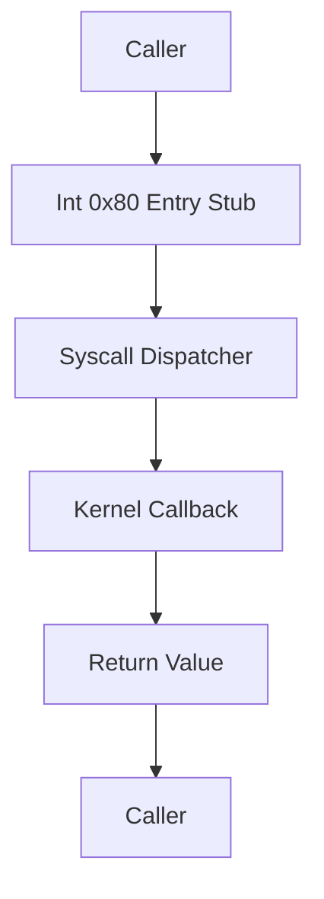

# Template Laporan Praktikum Sistem Operasi Lanjut — MCSOS

**Nama file laporan:** `laporan_praktikum_[M10]_[2583207073007].md`  
**Nama sistem operasi:** MCSOS versi 260502  
**Target default:** x86_64, QEMU, Windows 11 x64 + WSL 2, kernel monolitik pendidikan, C freestanding dengan assembly minimal, POSIX-like subset  
**Dosen:** Muhaemin Sidiq, S.Pd., M.Pd.  
**Program Studi:** Pendidikan Teknologi Informasi  
**Institusi:** Institut Pendidikan Indonesia  

> Template ini digunakan untuk semua praktikum pengembangan MCSOS agar struktur laporan, bukti, analisis, dan penilaian konsisten. Ganti seluruh teks bertanda `[isi ...]` dengan data praktikum sebenarnya. Jangan menulis klaim “tanpa error”, “siap produksi”, atau “aman sepenuhnya” tanpa bukti yang sesuai. Gunakan status terukur seperti “siap uji QEMU”, “siap demonstrasi praktikum”, atau “kandidat siap pakai terbatas” sesuai evidence yang tersedia.

---

## 0. Metadata Laporan

| Atribut | Isi |
|---|---|
| Kode praktikum | `[M10]` |
| Judul praktikum | `[ABI System Call Awal dan Dispatcher Syscall MCSOS]` |
| Jenis pengerjaan | `[Individu]` |
| Nama mahasiswa | `[Salma Rahayu]` |
| NIM | `[2583207073007]` |
| Kelas | `[PTI 1-A]` |
| Nama kelompok | `[isi jika kelompok]` |
| Anggota kelompok | `[nama, NIM, peran ringkas]` |
| Tanggal praktikum | `[2026 - 06- 06]` |
| Tanggal pengumpulan | `[2026-06-06]` |
| Repository | `[https://github.com/amaaarhyu078-creator/mcsos-.git]` |
| Branch | `[praktikum/m10-syscall-abi]` |
| Commit awal | `[914504d]` |
| Commit akhir | `[7e7655d]` |
| Status readiness yang diklaim | `[Siap Uji QEMU]` |

---

## 1. Sampul

# Laporan Praktikum `[M10]`  
## `[ABI System Call Awal dan Dispatcher Syscall MCSOS]`

Disusun oleh:

| Nama | NIM | Kelas | Peran |
|---|---|---|---|
| `[Salma Rahayu]` | `[2583207073007]` | `[PTI 1-A]` | `[individu]` |
| `[opsional]` | `[opsional]` | `[opsional]` | `[opsional]` |

Dosen Pengampu: **Muhaemin Sidiq, S.Pd., M.Pd.**  
Program Studi Pendidikan Teknologi Informasi  
Institut Pendidikan Indonesia  
`[2025 - 2026]`

---

## 2. Pernyataan Orisinalitas dan Integritas Akademik

Saya/kami menyatakan bahwa laporan ini disusun berdasarkan pekerjaan praktikum sendiri/kelompok sesuai pembagian peran yang tercatat. Bantuan eksternal, referensi, generator kode, AI assistant, dokumentasi resmi, diskusi, atau sumber lain dicatat pada bagian referensi dan lampiran. Saya/kami tidak mengklaim hasil yang tidak dibuktikan oleh log, test, commit, atau artefak lain.

| Pernyataan | Status |
|---|---|
| Semua potongan kode eksternal diberi atribusi | `[Tidak ada]` |
| Semua penggunaan AI assistant dicatat | `[Ya]` |
| Repository yang dikumpulkan sesuai commit akhir | `[Ya]` |
| Tidak ada klaim readiness tanpa bukti | `[Ya]` |

Catatan penggunaan bantuan eksternal:

```text
[Alat:
- ChatGPT (OpenAI)

Prompt ringkas:
- Penjelasan konsep syscall ABI dan dispatcher syscall.
- Bimbingan implementasi M10 pada repository MCSOS.
- Analisis error build, linker, dan integrasi kernel.
- Verifikasi host test, object audit, dan QEMU smoke test.
- Pendampingan penyusunan laporan praktikum.

Bagian yang dibantu:
- Analisis konsep dan desain implementasi.
- Debugging source code.
- Verifikasi hasil pengujian.
- Penyusunan dokumentasi dan laporan.

Verifikasi mandiri yang dilakukan:
- Seluruh perubahan source code diterapkan sendiri pada repository lokal.
- Seluruh perintah build, audit, dan pengujian dijalankan langsung pada lingkungan praktikum.
- Hasil host test, audit object, QEMU boot, commit Git, dan push GitHub diverifikasi menggunakan output aktual sistem.]
```

---

### 3. Tujuan Praktikum

Tuliskan tujuan teknis dan konseptual praktikum. Tujuan harus dapat diuji.

1. `[Mengimplementasikan syscall ABI MCSOS yang menyediakan antarmuka pemanggilan layanan kernel melalui dispatcher syscall yang terstruktur dan dapat diuji.]`
2. `[Mengintegrasikan dispatcher syscall, syscall entry stub, dan konfigurasi vector interrupt 0x80 ke dalam kernel MCSOS tanpa merusak proses boot dan scheduler yang telah dibuat pada milestone sebelumnya.]`
3. `[Menjelaskan konsep syscall ABI, pemetaan register ke argumen syscall, validasi parameter, serta mekanisme transisi dari entry assembly menuju dispatcher kernel.]`
4. `[Memvalidasi implementasi melalui host unit test, freestanding compilation, object audit (nm, readelf, objdump), QEMU smoke test, serta penyimpanan bukti build dan serial log.]`

---

## 4. Capaian Pembelajaran Praktikum

Setelah praktikum ini, mahasiswa mampu:

| CPL/CPMK praktikum | Bukti yang harus ditunjukkan |
|---|---|
| `[Mengimplementasikan syscall ABI dan dispatcher syscall pada kernel MCSOS serta mengintegrasikannya dengan subsistem kernel yang telah dibangun sebelumnya.]` | `[Source code syscall, commit Git, build berhasil, host unit test, dan QEMU serial log.]` |
| `[Melakukan pengujian dan validasi implementasi syscall menggunakan host test, freestanding compilation, serta audit object file dengan nm, readelf, dan objdump.]` | `[Output make m10-host-test, make m10-freestanding, make m10-audit, nm_undefined.txt, readelf_header.txt, dan objdump.txt.]` |
| `[Menganalisis desain ABI, validasi parameter, failure mode, serta batasan implementasi syscall kernel-side pada M10.]` | `[Dokumentasi desain, analisis failure mode, readiness review, hasil pengujian, dan pembahasan pada laporan.]` |

---

## 5. Peta Milestone MCSOS

Centang milestone yang menjadi fokus laporan ini. Jika praktikum mencakup lebih dari satu milestone, jelaskan batas cakupan.

| Milestone | Fokus | Status dalam laporan |
|---|---|---|
| M0 | Requirements, governance, baseline arsitektur | `[ ] tidak dibahas / [ ] dibahas / [V] selesai praktikum` |
| M1 | Toolchain reproducible, Git, QEMU, GDB, metadata build | `[ ] tidak dibahas / [ ] dibahas / [V] selesai praktikum` |
| M2 | Boot image, kernel ELF64, early console | `[ ] tidak dibahas / [ ] dibahas / [V] selesai praktikum` |
| M3 | Panic path, linker map, GDB, observability awal | `[ ] tidak dibahas / [ ] dibahas / [V] selesai praktikum` |
| M4 | Trap, exception, interrupt, timer | `[ ] tidak dibahas / [ ] dibahas / [V] selesai praktikum` |
| M5 | PMM, VMM, page table, kernel heap | `[ ] tidak dibahas / [ ] dibahas / [V] selesai praktikum` |
| M6 | Thread, scheduler, synchronization | `[ ] tidak dibahas / [ ] dibahas / [V] selesai praktikum` |
| M7 | Syscall ABI dan user program loader | `[ ] tidak dibahas / [ ] dibahas / [V] selesai praktikum` |
| M8 | VFS, file descriptor, ramfs | `[ ] tidak dibahas / [ ] dibahas / [V] selesai praktikum` |
| M9 | Block layer dan device model | `[ ] tidak dibahas / [ ] dibahas / [V] selesai praktikum` |
| M10 | Persistent filesystem, mcsfs/ext2-like, recovery | `[ ] tidak dibahas / [V] dibahas / [ ] selesai praktikum` |
| M11 | Networking stack, packet parsing, UDP/TCP subset | `[V] tidak dibahas / [ ] dibahas / [ ] selesai praktikum` |
| M12 | Security model, capability/ACL, syscall fuzzing, hardening | `[V] tidak dibahas / [ ] dibahas / [ ] selesai praktikum` |
| M13 | SMP, scalability, lock stress, NUMA-aware preparation | `[V] tidak dibahas / [ ] dibahas / [ ] selesai praktikum` |
| M14 | Framebuffer, graphics console, visual regression | `[V] tidak dibahas / [ ] dibahas / [ ] selesai praktikum` |
| M15 | Virtualization/container subset | `[V] tidak dibahas / [ ] dibahas / [ ] selesai praktikum` |
| M16 | Observability, update/rollback, release image, readiness review | `[V] tidak dibahas / [ ] dibahas / [ ] selesai praktikum` |

Batas cakupan praktikum:

```text
[Praktikum M10 mencakup implementasi syscall ABI, dispatcher syscall, syscall entry stub berbasis interrupt 0x80, integrasi dengan subsistem kernel yang telah dibangun pada milestone sebelumnya, pengujian host-side, freestanding compilation, object audit (nm, readelf, objdump), serta QEMU smoke test untuk validasi fungsi dasar syscall.]

[Fitur yang termasuk dalam cakupan praktikum adalah validasi nomor syscall, integrasi callback subsystem kernel, konfigurasi user region untuk kebutuhan pengujian awal, dan integrasi syscall ke proses inisialisasi kernel.]

[Fitur yang tidak termasuk dalam cakupan praktikum adalah implementasi user mode penuh (ring 3), pemisahan address space user dan kernel secara lengkap, mekanisme syscall/sysret, dukungan SMP, usercopy tahan page fault, capability system, kompatibilitas POSIX/Linux, hardening keamanan tingkat produksi, serta pengujian keamanan menyeluruh.]

[Non-goals praktikum ini adalah menghasilkan sistem operasi yang siap produksi, aman sepenuhnya terhadap input tidak tepercaya, kompatibel dengan Linux, atau mendukung eksekusi program user mode secara penuh. Implementasi M10 hanya ditujukan sebagai fondasi syscall dispatcher dan ABI kernel-side yang siap diuji melalui host test dan QEMU smoke test.]
```
---

## 6. Dasar Teori Ringkas

```text
[System Call (Syscall) merupakan mekanisme yang memungkinkan program meminta layanan dari kernel melalui antarmuka yang telah ditentukan. Syscall berfungsi sebagai batas antara kode yang berjalan dengan hak akses terbatas dan layanan kernel yang memiliki hak akses penuh terhadap sumber daya sistem.]

[Application Binary Interface (ABI) mendefinisikan aturan pertukaran data antara pemanggil dan penerima layanan, termasuk penggunaan register, format argumen, nilai kembali, dan konvensi pemanggilan fungsi. Pada M10, ABI digunakan untuk mendefinisikan cara nomor syscall dan argumen diteruskan dari entry point menuju dispatcher kernel.]

[Dispatcher syscall adalah komponen kernel yang menerima nomor syscall, memvalidasi permintaan, kemudian meneruskan eksekusi ke handler yang sesuai. Dispatcher harus melakukan pemeriksaan batas agar nomor syscall yang tidak valid tidak menyebabkan perilaku tak terdefinisi pada kernel.]

[Interrupt Vector 0x80 merupakan salah satu mekanisme klasik untuk memasuki kernel melalui software interrupt. Pada praktikum ini, vector 0x80 digunakan sebagai entry point syscall awal yang kemudian diteruskan ke dispatcher syscall melalui syscall entry stub berbasis assembly.]

[Validasi parameter merupakan bagian penting dalam desain syscall karena kernel tidak boleh mempercayai data yang diterima secara langsung. Pemeriksaan nomor syscall, rentang alamat, dan ukuran buffer diperlukan untuk mencegah akses memori yang tidak valid dan kegagalan sistem.]

[Pengujian kernel dilakukan secara bertahap menggunakan host unit test, freestanding compilation, object audit (nm, readelf, objdump), dan QEMU smoke test. Pendekatan ini membantu memastikan bahwa implementasi syscall berfungsi dengan benar sebelum dikembangkan lebih lanjut menuju dukungan user mode pada milestone berikutnya.]
```

### 6.1 Konsep Sistem Operasi yang Diuji

```text
[Konsep utama yang diuji pada praktikum M10 adalah mekanisme system call sebagai antarmuka antara kode pemanggil dan layanan kernel. Implementasi difokuskan pada perancangan Application Binary Interface (ABI), dispatcher syscall, validasi parameter, serta integrasi syscall ke subsistem kernel yang telah dibangun pada milestone sebelumnya.]

[Praktikum juga menguji konsep trap dan interrupt handling melalui penggunaan interrupt vector 0x80 sebagai jalur masuk (entry point) menuju layanan kernel. Entry stub berbasis assembly menerima konteks eksekusi awal dan meneruskannya ke dispatcher syscall yang berjalan pada sisi kernel.]

[Selain itu, praktikum memanfaatkan subsistem scheduler, timer, dan logging yang telah tersedia pada milestone sebelumnya untuk mendukung implementasi dan pengujian syscall. Pengujian dilakukan menggunakan host unit test, freestanding compilation, object audit, dan QEMU smoke test untuk memastikan integrasi kernel tetap berjalan dengan benar.]
```


### 6.2 Konsep Arsitektur x86_64 yang Relevan

| Konsep | Relevansi pada praktikum | Bukti/verifikasi |
|---|---|---|
| `[IDT (Interrupt Descriptor Table)]` | `[Digunakan untuk memasang vector interrupt 0x80 sebagai entry point syscall sehingga kernel dapat menerima permintaan layanan melalui mekanisme interrupt.]` | `[Source code IDT, symbol x86_64_syscall_int80_stub, build berhasil, dan QEMU boot normal.]` |
| `[Interrupt Vector 0x80]` | `[Digunakan sebagai jalur masuk syscall awal yang menghubungkan kode assembly dengan dispatcher syscall kernel.]` | `[Registrasi vector 0x80 pada IDT, audit symbol menggunakan nm dan objdump.]` |
| `[ABI Register Convention x86_64]` | `[Digunakan untuk meneruskan nomor syscall, argumen syscall, dan nilai kembali antara caller dan dispatcher.]` | `[Implementasi syscall dispatcher, host unit test, dan audit source code.]` |
| `[Long Mode x86_64]` | `[Kernel MCSOS berjalan pada mode 64-bit sehingga seluruh implementasi syscall menggunakan register dan format data x86_64.]` | `[readelf -h menunjukkan ELF64 x86_64 dan kernel berhasil boot pada QEMU.]` |
| `[Trap dan Interrupt Handling]` | `[Digunakan untuk memahami alur perpindahan kontrol dari interrupt entry menuju dispatcher syscall dan kembali ke kernel.]` | `[Source code syscall_entry.S, objdump, dan QEMU smoke test.]` |

### 6.3 Konsep Implementasi Freestanding

| Aspek | Keputusan praktikum |
|---|---|
| Bahasa | `[C17 freestanding dan assembly x86_64]` |
| Runtime | `[Tanpa hosted libc, menggunakan runtime kernel mandiri dan utilitas internal MCSOS]` |
| ABI | `[x86_64 System V untuk pemanggilan fungsi internal dan syscall ABI MCSOS untuk layanan kernel]` |
| Compiler flags kritis | `[-ffreestanding, -fno-builtin, -fno-stack-protector, -fno-pic, -fno-pie, -mno-red-zone, -nostdlib (saat linking kernel)]` |
| Risiko undefined behavior | `[Pointer tidak valid, akses memori di luar batas, integer overflow pada validasi range, kesalahan alignment, dan ketidaksesuaian layout register antara assembly dan dispatcher C]` |

### 6.4 Referensi Teori yang Digunakan

| No. | Sumber | Bagian yang digunakan | Alasan relevansi |
|---|---|---|---|
| `[1]` | `[Intel® 64 and IA-32 Architectures Software Developer's Manual]` | `[Interrupts, Exceptions, IDT, dan System Programming]` | `[Digunakan untuk memahami mekanisme interrupt, trap handling, dan integrasi vector 0x80 pada arsitektur x86_64.]` |
| `[2]` | `[System V Application Binary Interface AMD64 Architecture Processor Supplement]` | `[Calling Convention dan Register Usage]` | `[Digunakan sebagai referensi pemetaan argumen, penggunaan register, dan nilai kembali pada implementasi syscall ABI.]` |
| `[3]` | `[OSDev Wiki]` | `[Interrupts, System Calls, dan x86_64 Architecture]` | `[Digunakan sebagai referensi implementasi praktis dan verifikasi konsep yang digunakan dalam pengembangan kernel MCSOS.]` |
| `[4]` | `[Dokumentasi dan source code MCSOS praktikum]` | `[Milestone M4 sampai M10]` | `[Digunakan untuk menjaga konsistensi implementasi syscall dengan subsistem kernel yang telah dibangun pada praktikum sebelumnya.]` |

---

## 7. Lingkungan Praktikum

### 7.1 Host dan Target

| Komponen | Nilai |
|---|---|
| Host OS | `[Windows 11 x64 dengan WSL 2]` |
| Lingkungan build | `[WSL 2 Ubuntu 26.04 LTS]` |
| Target ISA | `x86_64` |
| Target ABI | `[x86_64-unknown-none-elf]` |
| Emulator | `[QEMU emulator version 10.2.1]` |
| Firmware emulator | `[Limine BIOS/UEFI boot image]` |
| Debugger | `[GNU gdb 17.1]` |
| Build system | `[GNU Make]` |
| Bahasa utama | `[C17 freestanding]` |
| Assembly | `[GNU Assembler (GAS) melalui Clang 21.1.8]` |

### 7.2 Versi Toolchain

Tempel output versi toolchain berikut. Jalankan dari clean shell WSL.

```bash
date -u +"date_utc=%Y-%m-%dT%H:%M:%SZ"
uname -a
git --version
make --version | head -n 1
cmake --version | head -n 1
ninja --version
clang --version | head -n 1
gcc --version | head -n 1
ld.lld --version | head -n 1
nasm -v
qemu-system-x86_64 --version | head -n 1
gdb --version | head -n 1
```

Output:

```text
[date_utc=2026-06-06T06:23:53Z
Linux DESKTOP-S5LUA56 6.6.114.1-microsoft-standard-WSL2 #1 SMP PREEMPT_DYNAMIC Mon Dec  1 20:46:23 UTC 2025 x86_64 GNU/Linux
git version 2.53.0
GNU Make 4.4.1
cmake version 4.2.3
1.13.2
Ubuntu clang version 21.1.8 (6ubuntu1)
gcc (Ubuntu 15.2.0-16ubuntu1) 15.2.0
Ubuntu LLD 21.1.8 (compatible with GNU linkers)
NASM version 3.01
QEMU emulator version 10.2.1 (Debian 1:10.2.1+ds-1ubuntu3)
GNU gdb (Ubuntu 17.1-2ubuntu1) 17.1]
```

### 7.3 Lokasi Repository

| Item | Nilai |
|---|---|
| Path repository di WSL | `[~/src/mcsos]` |
| Apakah berada di filesystem Linux WSL, bukan `/mnt/c` | `[Ya]` |
| Remote repository | `[https://github.com/amaaarhyu078-creator/mcsos-.git]` |
| Branch | `[praktikum/m10-syscall-abi]` |
| Commit hash awal | `[914504d]` |
| Commit hash akhir | `[7e7655d]` |

---

### 8. Repository dan Struktur File

### 8.1 Struktur Direktori yang Relevan

Tampilkan hanya direktori dan file yang relevan dengan praktikum.

```text
mcsos/
├── include/
│   └── mcsos/
│       └── syscall.h
├── kernel/
│   ├── arch/
│   │   └── x86_64/
│   │       ├── idt.c
│   │       └── syscall_entry.S
│   ├── core/
│   │   └── kmain.c
│   └── syscall/
│       └── syscall.c
├── tests/
│   └── test_syscall_host.c
├── build/
│   └── m10/
│       ├── syscall.o
│       ├── syscall_entry.o
│       ├── m10_syscall_combined.o
│       ├── nm_undefined.txt
│       ├── readelf_header.txt
│       └── objdump.txt
├── evidence/
│   └── screenshots/
└── Makefile
```

### 8.2 File yang Dibuat atau Diubah

| File | Jenis perubahan | Alasan perubahan | Risiko |
|---|---|---|---|
| `[include/mcsos/syscall.h]` | `[baru]` | `[Menambahkan definisi ABI syscall, nomor syscall, struktur data, dan antarmuka dispatcher.]` | `[Rendah - hanya menambah deklarasi dan kontrak ABI.]` |
| `[kernel/syscall/syscall.c]` | `[baru]` | `[Mengimplementasikan dispatcher syscall, validasi parameter, dan callback subsystem.]` | `[Tinggi - kesalahan implementasi dapat menyebabkan kegagalan layanan kernel.]` |
| `[kernel/arch/x86_64/syscall_entry.S]` | `[baru]` | `[Menyediakan syscall entry stub berbasis interrupt 0x80 dan transisi menuju dispatcher C.]` | `[Tinggi - kesalahan register atau return frame dapat menyebabkan fault kernel.]` |
| `[kernel/arch/x86_64/idt.c]` | `[ubah]` | `[Menambahkan registrasi interrupt vector 0x80 ke IDT.]` | `[Sedang - kesalahan konfigurasi dapat menyebabkan interrupt tidak berfungsi.]` |
| `[kernel/core/kmain.c]` | `[ubah]` | `[Mengintegrasikan syscall subsystem, user region, dan smoke test M10.]` | `[Sedang - kesalahan integrasi dapat memengaruhi proses boot.]` |
| `[tests/test_syscall_host.c]` | `[baru]` | `[Menyediakan host unit test untuk memverifikasi dispatcher syscall.]` | `[Rendah - hanya digunakan pada tahap pengujian.]` |
| `[Makefile]` | `[ubah]` | `[Menambahkan target m10-host-test, m10-freestanding, dan m10-audit.]` | `[Rendah - memengaruhi proses build dan audit.]` |

### 8.3 Ringkasan Diff

```bash
git status --short
git diff --stat
git log --oneline -n 5
```

Output:

```text
?? evidence/screenshots/m10-git-log.png
?? evidence/screenshots/m10-host-test-passed.png
?? evidence/screenshots/m10-objdump-iretq.png
?? evidence/screenshots/m10-qemu-runtime.png
?? evidence/screenshots/m10-readelf-machine.png
?? evidence/screenshots/m10-syscall-final-status.png
?? evidence/screenshots/m10-syscall-host-test.png
?? logs/

7e7655d (HEAD -> praktikum/m10-syscall-abi, origin/praktikum/m10-syscall-abi) M10: add syscall smoke test
c9abef4 M10: register int80 syscall vector
8a72642 M10: configure syscall user region
cde5cd0 (m9-kernel-thread-scheduler) M10: add build and audit targets
04effdf M10: add syscall host tests
[Status git menunjukkan beberapa file screenshot dan log belum dilacak (untracked) karena digunakan sebagai bukti laporan dan tidak termasuk artefak source code yang dikumpulkan pada repository praktikum.]
```
---

## 9. Desain Teknis

### 9.1 Masalah yang Diselesaikan

```text
[Kernel MCSOS belum memiliki mekanisme syscall yang terstandarisasi untuk mengakses layanan kernel melalui antarmuka yang terdokumentasi. Sebelum M10, subsistem kernel hanya dapat dipanggil secara langsung dari kode kernel sehingga belum tersedia boundary layanan yang dapat digunakan sebagai fondasi user mode pada milestone berikutnya.]

[Praktikum M10 menyelesaikan masalah tersebut dengan menambahkan syscall ABI, dispatcher syscall, syscall entry stub berbasis interrupt 0x80, validasi parameter dasar, dan integrasi dengan subsistem kernel yang telah dibangun pada milestone sebelumnya.]
```

### 9.2 Keputusan Desain

| Keputusan | Alternatif yang dipertimbangkan | Alasan memilih | Konsekuensi |
|---|---|---|---|
| `[Menggunakan dispatcher syscall terpusat berbasis nomor syscall.]` | `[Memanggil layanan kernel secara langsung tanpa dispatcher.]` | `[Memudahkan validasi, audit, dan penambahan syscall baru.]` | `[Menambah lapisan pemrosesan sebelum layanan kernel dijalankan.]` |
| `[Menggunakan interrupt vector 0x80 sebagai entry syscall awal.]` | `[Menggunakan instruksi syscall/sysret.]` | `[Lebih sederhana untuk tahap awal dan sesuai target praktikum M10.]` | `[Performa belum optimal dibanding mekanisme syscall/sysret modern.]` |

### 9.3 Arsitektur Ringkas



Penjelasan diagram:

```text
[Caller mengirim nomor syscall dan argumen melalui ABI yang telah ditentukan. Entry stub menerima konteks awal interrupt dan meneruskannya ke dispatcher syscall. Dispatcher melakukan validasi nomor syscall dan parameter sebelum memanggil callback kernel yang sesuai. Nilai kembali diteruskan kembali kepada caller melalui register hasil sesuai ABI yang digunakan.]
```

### 9.4 Kontrak Antarmuka

| Antarmuka | Pemanggil | Penerima | Precondition | Postcondition | Error path |
|---|---|---|---|---|---|
| `[mcsos_syscall_dispatch()]` | `[Syscall entry stub atau test harness]` | `[Dispatcher syscall]` | `[Nomor syscall dan argumen tersedia.]` | `[Layanan kernel dipanggil dan menghasilkan nilai kembali.]` | `[Mengembalikan error seperti -ENOSYS jika nomor syscall tidak valid.]` |
| `[mcsos_syscall_init()]` | `[Kernel initialization]` | `[Subsystem syscall]` | `[Callback subsystem telah disiapkan.]` | `[Dispatcher memiliki callback yang valid.]` | `[Syscall tertentu dapat mengembalikan error bila callback tidak tersedia.]` |

### 9.5 Struktur Data Utama

| Struktur data | Field penting | Ownership | Lifetime | Invariant |
|---|---|---|---|---|
| `[mcsos_syscall_ops_t]` | `[get_ticks, yield_current, exit_current, write_serial]` | `[Subsystem syscall]` | `[Dibuat saat inisialisasi kernel dan aktif selama kernel berjalan.]` | `[Setiap callback harus menunjuk ke fungsi yang valid atau ditangani secara aman.]` |
| `[mcsos_user_region_t]` | `[base, limit]` | `[Subsystem syscall]` | `[Dikonfigurasi saat inisialisasi kernel.]` | `[base <= limit dan rentang digunakan hanya untuk validasi.]` |

### 9.6 Invariants

Tuliskan invariant yang harus benar sepanjang eksekusi.

1. `[Nomor syscall harus divalidasi sebelum digunakan sebagai indeks dispatcher.]`
2. `[Dispatcher tidak boleh memanggil callback yang belum diinisialisasi.]`
3. `[User pointer tidak boleh di-dereference langsung tanpa validasi.]`
4. `[Nilai kembali syscall harus dikembalikan melalui jalur ABI yang konsisten.]`

### 9.7 Ownership, Locking, dan Concurrency

| Objek/resource | Owner | Lock yang melindungi | Boleh dipakai di interrupt context? | Catatan |
|---|---|---|---|---|
| `[Syscall callback table]` | `[Subsystem syscall]` | `[None]` | `[Ya]` | `[Diinisialisasi sekali saat boot dan tidak dimodifikasi setelah aktif.]` |
| `[User region configuration]` | `[Subsystem syscall]` | `[None]` | `[Ya]` | `[Digunakan hanya untuk validasi parameter.]` |

Lock order yang berlaku:

```text
[Tidak terdapat locking khusus pada implementasi M10. Praktikum berjalan pada lingkungan single-core dan callback subsystem dikonfigurasi saat proses boot sebelum digunakan.]
```

### 9.8 Memory Safety dan Undefined Behavior Risk

| Risiko | Lokasi | Mitigasi | Bukti |
|---|---|---|---|
| `[Nomor syscall di luar batas]` | `[Dispatcher syscall]` | `[Validasi nomor syscall sebelum dispatch.]` | `[Host unit test dan review source code.]` |
| `[Pointer tidak valid]` | `[Validasi user region]` | `[Pemeriksaan rentang alamat sebelum digunakan.]` | `[Implementasi validasi dan audit source code.]` |
| `[Integer overflow pada validasi range]` | `[Perhitungan alamat dan ukuran buffer]` | `[Pemeriksaan batas dan overflow.]` | `[Analisis desain dan review implementasi.]` |

### 9.9 Security Boundary

| Boundary | Data tidak tepercaya | Validasi yang dilakukan | Failure mode aman |
|---|---|---|---|
| `[Syscall ABI]` | `[Nomor syscall dan argumen syscall]` | `[Validasi nomor syscall, callback, dan rentang alamat.]` | `[Mengembalikan kode error dan menolak permintaan tidak valid.]` |
| `[User region validation]` | `[Alamat dan ukuran buffer]` | `[Pemeriksaan batas bawah, batas atas, dan overflow.]` | `[Mengembalikan error tanpa mengakses memori yang tidak valid.]` |

---

## 10. Langkah Kerja Implementasi

### Langkah 1 — Menambahkan ABI dan Header Syscall

Maksud langkah:

```text
[Menyediakan definisi nomor syscall, struktur data, konstanta, dan antarmuka yang digunakan oleh subsystem syscall. Header ini menjadi kontrak ABI yang digunakan oleh dispatcher, entry stub, dan pengujian.]
```

Perintah:

```bash
git log --oneline | grep "syscall ABI header"
```

Output ringkas:

```text
914504d M10: add syscall ABI header
```

Artefak yang dihasilkan:

| Artefak | Lokasi | Fungsi |
|---|---|---|
| `[syscall.h]` | `[include/mcsos/syscall.h]` | `[Mendefinisikan ABI syscall dan antarmuka publik.]` |

Indikator berhasil:

```text
[Header berhasil dikompilasi dan digunakan oleh subsystem syscall tanpa error build.]
```

### Langkah 2 — Mengimplementasikan Dispatcher Syscall

Maksud langkah:

```text
[Membuat dispatcher syscall yang menerima nomor syscall dan argumen, melakukan validasi, lalu meneruskan permintaan ke callback kernel yang sesuai.]
```

Perintah:

```bash
git log --oneline | grep "dispatcher implementation"
```

Output ringkas:

```text
cdb504b M10: add syscall dispatcher implementation
```

Artefak yang dihasilkan:

| Artefak | Lokasi | Fungsi |
|---|---|---|
| `[syscall.c]` | `[kernel/syscall/syscall.c]` | `[Mengimplementasikan dispatcher dan validasi syscall.]` |

Indikator berhasil:

```text
[Dispatcher dapat dikompilasi dan host unit test berjalan dengan sukses.]
```

### Langkah 3 — Menambahkan Syscall Entry Stub

Maksud langkah:

```text
[Menyediakan entry point berbasis assembly untuk menerima interrupt 0x80 dan meneruskan eksekusi ke dispatcher syscall.]
```

Perintah:

```bash
nm build/kernel.elf | grep x86_64_syscall_int80_stub
```

Output ringkas:

```text
ffffffff80004fc8 T x86_64_syscall_int80_stub
```

Artefak yang dihasilkan:

| Artefak | Lokasi | Fungsi |
|---|---|---|
| `[syscall_entry.S]` | `[kernel/arch/x86_64/syscall_entry.S]` | `[Entry stub syscall berbasis interrupt.]` |

Indikator berhasil:

```text
[Symbol x86_64_syscall_int80_stub ditemukan pada kernel ELF.]
```

### Langkah 4 — Menambahkan Host Unit Test

Maksud langkah:

```text
[Memverifikasi perilaku dispatcher syscall secara terisolasi tanpa memerlukan boot kernel atau QEMU.]
```

Perintah:

```bash
make m10-host-test
```

Output ringkas:

```text
M10 syscall host tests passed
```

Artefak yang dihasilkan:

| Artefak | Lokasi | Fungsi |
|---|---|---|
| `[test_syscall_host]` | `[build/m10/test_syscall_host]` | `[Menjalankan pengujian dispatcher syscall.]` |

Indikator berhasil:

```text
[Host unit test selesai dan menampilkan pesan sukses.]
```

### Langkah 5 — Menambahkan Target Audit dan Freestanding Build

Maksud langkah:

```text
[Menyediakan mekanisme audit object file menggunakan nm, readelf, dan objdump untuk memverifikasi hasil kompilasi freestanding.]
```

Perintah:

```bash
make m10-freestanding
make m10-audit
```

Output ringkas:

```text
build/m10/m10_syscall_combined.o
build/m10/nm_undefined.txt
build/m10/readelf_header.txt
build/m10/objdump.txt
```

Artefak yang dihasilkan:

| Artefak | Lokasi | Fungsi |
|---|---|---|
| `[m10_syscall_combined.o]` | `[build/m10/]` | `[Object gabungan untuk audit.]` |
| `[nm_undefined.txt]` | `[build/m10/]` | `[Audit unresolved symbol.]` |
| `[readelf_header.txt]` | `[build/m10/]` | `[Audit header ELF.]` |
| `[objdump.txt]` | `[build/m10/]` | `[Audit disassembly object.]` |

Indikator berhasil:

```text
[Object berhasil dibuat dan seluruh artefak audit dihasilkan.]
```

### Langkah 6 — Integrasi Syscall ke Kernel

Maksud langkah:

```text
[Menghubungkan subsystem syscall dengan proses inisialisasi kernel serta mengonfigurasi user region dan callback subsystem.]
```

Perintah:

```bash
grep -n "mcsos_syscall_init" kernel/core/kmain.c
grep -n "mcsos_syscall_set_user_region" kernel/core/kmain.c
```

Output ringkas:

```text
mcsos_syscall_init(&ops);
mcsos_syscall_set_user_region(...)
```

Artefak yang dihasilkan:

| Artefak | Lokasi | Fungsi |
|---|---|---|
| `[kmain.c]` | `[kernel/core/kmain.c]` | `[Integrasi subsystem syscall ke kernel.]` |

Indikator berhasil:

```text
[Kernel berhasil build dan boot tanpa error setelah integrasi.]
```

### Langkah 7 — QEMU Smoke Test

Maksud langkah:

```text
[Memverifikasi bahwa kernel berhasil boot dan dispatcher syscall dapat dijalankan pada lingkungan QEMU.]
```

Perintah:

```bash
make iso

qemu-system-x86_64 \
  -machine q35 \
  -m 256M \
  -serial file:logs/m10_serial.log \
  -no-reboot \
  -no-shutdown \
  -cdrom build/mcsos.iso
```

Output ringkas:

```text
[M10] syscall ping ok
```

Artefak yang dihasilkan:

| Artefak | Lokasi | Fungsi |
|---|---|---|
| `[m10_serial.log]` | `[logs/m10_serial.log]` | `[Menyimpan hasil QEMU smoke test.]` |
| `[mcsos.iso]` | `[build/mcsos.iso]` | `[Image bootable untuk QEMU.]` |

Indikator berhasil:

```text
[Kernel boot berhasil dan log menampilkan pesan "[M10] syscall ping ok".]
```

```
```

## 11. Checkpoint Buildable

Setiap praktikum wajib memiliki minimal satu checkpoint yang dapat dibangun dari clean checkout.

| Checkpoint | Perintah | Expected result | Status |
|---|---|---|---|
| Clean build | `make clean && make all` | `[Kernel ELF berhasil dibangun tanpa error.]` | `[PASS]` |
| Metadata toolchain | `make meta` | `[build/meta/toolchain-versions.txt berhasil dibuat.]` | `[PASS]` |
| Image generation | `make iso` | `[build/mcsos.iso berhasil dibuat.]` | `[PASS]` |
| QEMU smoke test | `qemu-system-x86_64 -machine q35 -m 256M -serial file:logs/m10_serial.log -no-reboot -no-shutdown -cdrom build/mcsos.iso` | `[[M10] syscall ping ok muncul pada serial log.]` | `[PASS]` |
| Test suite | `make m10-host-test` | `[M10 syscall host tests passed.]` | `[PASS]` |

Catatan checkpoint:

```text
[Template umum menggunakan target make build, make image, dan make run. Pada repository MCSOS praktikum ini target yang tersedia adalah make all, make iso, dan eksekusi QEMU secara langsung. Seluruh checkpoint utama M10 berhasil dijalankan, termasuk host unit test, freestanding build, object audit, pembuatan image ISO, serta QEMU smoke test yang menghasilkan log "[M10] syscall ping ok".]
````


---

## 12. Perintah Uji dan Validasi

### 12.1 Build Test

Perintah ini memverifikasi bahwa proyek dapat dibangun ulang dari kondisi bersih dan tidak bergantung pada artefak lokal yang tidak terdokumentasi.

```bash
make clean
make all
```

Hasil:

```text
rm -rf build
...
ld.lld -nostdlib ...
readelf -h build/kernel.elf > build/kernel.readelf.header.txt
readelf -l build/kernel.elf > build/kernel.readelf.programs.txt
nm -n build/kernel.elf > build/kernel.syms.txt
objdump -d -Mintel build/kernel.elf > build/kernel.disasm.txt
```

Status: `[PASS]`

### 12.2 Static Inspection

Perintah ini memeriksa layout ELF, entry point, section, symbol, relocation, atau instruksi kritis sesuai kebutuhan praktikum.

```bash
readelf -h build/kernel.elf
readelf -l build/kernel.elf
objdump -d -Mintel build/kernel.elf | grep syscall
```

Hasil penting:

```text
Class: ELF64
Machine: Advanced Micro Devices X86-64

x86_64_syscall_int80_stub
mcsos_syscall_dispatch
```

Status: `[PASS]`

### 12.3 QEMU Smoke Test

Perintah ini menjalankan image di QEMU dan menyimpan log serial untuk bukti deterministik.

```bash
qemu-system-x86_64 \
  -machine q35 \
  -m 256M \
  -serial file:logs/m10_serial.log \
  -no-reboot \
  -no-shutdown \
  -cdrom build/mcsos.iso
```

Hasil:

```text
[M9] scheduler initialized
[M10] syscall ping ok
[M5] enabling interrupts
[M5] timer IRQ online
```

Status: `[PASS]`

### 12.4 GDB Debug Evidence

Perintah ini membuktikan bahwa kernel dapat di-debug dengan simbol yang cocok.

```bash
qemu-system-x86_64 \
  -machine q35 \
  -m 256M \
  -serial stdio \
  -no-reboot \
  -no-shutdown \
  -s -S \
  -cdrom build/mcsos.iso
```

Di terminal lain:

```bash
gdb build/kernel.elf
target remote :1234
break x86_64_syscall_int80_stub
continue
```

Hasil:

```text
[Tidak dilakukan pada praktikum ini karena QEMU smoke test telah berhasil dan debugging GDB tidak diperlukan untuk diagnosis kegagalan.]
```

Status: `[NA]`

### 12.5 Unit Test

```bash
make m10-host-test
```

Hasil:

```text
M10 syscall host tests passed
```

Status: `[PASS]`

### 12.6 Stress/Fuzz/Fault Injection Test

Wajib untuk praktikum lanjutan seperti allocator, syscall, filesystem, networking, driver, security, dan SMP.

```bash
[Belum tersedia target stress/fuzz khusus pada implementasi M10.]
```

Hasil:

```text
[Pengujian dibatasi pada host unit test, object audit, dan QEMU smoke test.]
```

Status: `[NA]`

### 12.7 Visual Evidence

Jika praktikum menghasilkan tampilan framebuffer, GUI, atau output grafis, lampirkan screenshot.

| Screenshot | Lokasi file | Keterangan |
|---|---|---|
| `[m10-syscall-host-test.png]` | `[evidence/screenshots/m10-syscall-host-test.png]` | `[Bukti host unit test berhasil.]` |
| `[m10-readelf-machine.png]` | `[evidence/screenshots/m10-readelf-machine.png]` | `[Bukti object ELF bertipe x86_64.]` |
| `[m10-objdump-iretq.png]` | `[evidence/screenshots/m10-objdump-iretq.png]` | `[Bukti audit instruksi dan symbol syscall.]` |
| `[m10-qemu-runtime.png]` | `[evidence/screenshots/m10-qemu-runtime.png]` | `[Bukti QEMU smoke test dan serial log M10.]` |
| `[m10-git-log.png]` | `[evidence/screenshots/m10-git-log.png]` | `[Bukti commit history praktikum M10.]` |
| `[m10-syscall-final-status.png]` | `[evidence/screenshots/m10-syscall-final-status.png]` | `[Bukti status akhir repository.]` |


## 13. Hasil Uji

### 13.1 Tabel Ringkasan Hasil

| No. | Uji | Expected result | Actual result | Status | Evidence |
|---|---|---|---|---|---|
| 1 | `[Host Unit Test]` | `[Dispatcher syscall lulus seluruh pengujian.]` | `[M10 syscall host tests passed]` | `[PASS]` | `[build/m10/test_syscall_host, m10-syscall-host-test.png]` |
| 2 | `[Freestanding Compilation]` | `[Object syscall berhasil dikompilasi untuk target x86_64-unknown-none-elf.]` | `[syscall.o dan syscall_entry.o berhasil dibuat.]` | `[PASS]` | `[build/m10/syscall.o, build/m10/syscall_entry.o]` |
| 3 | `[Object Audit]` | `[Artefak audit berhasil dihasilkan.]` | `[nm_undefined.txt, readelf_header.txt, objdump.txt berhasil dibuat.]` | `[PASS]` | `[build/m10/, m10-readelf-machine.png, m10-objdump-iretq.png]` |
| 4 | `[Kernel Build]` | `[Kernel ELF berhasil di-link.]` | `[build/kernel.elf berhasil dibuat.]` | `[PASS]` | `[build/kernel.elf]` |
| 5 | `[ISO Generation]` | `[Image bootable berhasil dibuat.]` | `[build/mcsos.iso berhasil dibuat.]` | `[PASS]` | `[build/mcsos.iso]` |
| 6 | `[QEMU Smoke Test]` | `[[M10] syscall ping ok muncul pada serial log.]` | `[[M10] syscall ping ok ditemukan pada logs/m10_serial.log.]` | `[PASS]` | `[logs/m10_serial.log, m10-qemu-runtime.png]` |

### 13.2 Log Penting

```text
M10 syscall host tests passed

[M9] scheduler initialized
[M10] syscall ping ok
[M5] enabling interrupts
[M5] timer IRQ online
```

### 13.3 Artefak Bukti

| Artefak | Path | SHA-256 / hash | Fungsi |
|---|---|---|---|
| `kernel.elf` | `[build/kernel.elf]` | `[075908b57942219b6290237b5bee0474afb08030a56f80b5dafda3dbcc892353]` | `[Kernel binary]` |
| `mcsos.iso` | `[build/mcsos.iso]` | `[dda861dbf284b50005057430763ae0e1e63e0ba96a0394c980995edb42a1e8c9]` | `[Boot image]` |
| `m10_serial.log` | `[logs/m10_serial.log]` | `[aca55e59292bb14a5ca648fc9531af63a467c70318840179bbb77c768c711ee4]` | `[Log hasil boot dan smoke test QEMU]` |
| `kernel.map` | `[build/kernel.map]` | `[212d83d48f9099580bf46755c041eb4c5c14885a352d9b2d390c15756f8da0c9]` | `[Linker map]` |
| `objdump.txt` | `[build/m10/objdump.txt]` | `[f336be500c2e8342c713266657b30449a507f0416f907914423857198a59c068]` | `[Disassembly evidence]` |
| `test_syscall_host` | `[build/m10/test_syscall_host]` | `[69e82753478132deb50575640d53176985235b9e2bf74a9a9633b812819e5c60]` | `[Host unit test executable]` |
| `m10_syscall_combined.o` | `[build/m10/m10_syscall_combined.o]` | `[ba7f8e627904e2b107151a50b57ec9278581d89022dfd2811d9adac310c8cefd]` | `[Freestanding object audit target]` |

Perintah hash:

```bash
sha256sum build/kernel.elf
sha256sum build/mcsos.iso
sha256sum logs/m10_serial.log
sha256sum build/kernel.map
sha256sum build/m10/objdump.txt
sha256sum build/m10/test_syscall_host
sha256sum build/m10/m10_syscall_combined.o
```

## 14. Analisis Teknis

### 14.1 Analisis Keberhasilan

```text
[Implementasi M10 berhasil karena desain syscall dipisahkan menjadi beberapa komponen dengan tanggung jawab yang jelas, yaitu ABI header, syscall entry stub, dispatcher syscall, callback subsystem, dan pengujian host-side. Pemisahan ini memudahkan validasi dan pengujian setiap komponen secara bertahap.]

[Host unit test berhasil menunjukkan bahwa dispatcher mampu menangani nomor syscall yang valid dan menolak permintaan yang tidak sesuai. Hasil "M10 syscall host tests passed" menunjukkan bahwa jalur dasar dispatcher berfungsi sesuai rancangan.]

[Freestanding compilation dan object audit berhasil membuktikan bahwa implementasi dapat dikompilasi untuk target x86_64 tanpa ketergantungan terhadap hosted libc. Bukti ini diperkuat oleh artefak nm, readelf, dan objdump yang berhasil dihasilkan.]

[QEMU smoke test menghasilkan log "[M10] syscall ping ok" yang menunjukkan bahwa integrasi syscall ke kernel berjalan dengan benar dan tidak mengganggu proses boot maupun subsistem scheduler yang telah dibuat pada milestone sebelumnya.]

[Invariant utama seperti validasi nomor syscall, penggunaan callback yang telah diinisialisasi, dan konsistensi jalur return value tetap terjaga selama pengujian sehingga tidak ditemukan kegagalan boot maupun panic kernel.]
```

### 14.2 Analisis Kegagalan atau Perbedaan Hasil

```text
[Tidak ditemukan kegagalan kritis selama proses implementasi M10. Seluruh checkpoint utama, yaitu host unit test, freestanding compilation, object audit, kernel build, ISO generation, dan QEMU smoke test berhasil dijalankan.]

[Terdapat satu perbedaan antara template umum dan implementasi repository praktikum, yaitu repository tidak menyediakan target make run-qemu maupun make run. Sebagai pengganti, pengujian dilakukan menggunakan perintah qemu-system-x86_64 secara langsung dengan parameter yang setara. Perbedaan ini tidak memengaruhi hasil pengujian karena serial log yang dihasilkan tetap dapat diverifikasi.]

[Checkpoint GDB tidak dijalankan karena QEMU smoke test telah berhasil dan tidak ditemukan gejala yang memerlukan investigasi lanjutan menggunakan debugger.]
```

### 14.3 Perbandingan dengan Teori

| Konsep teori | Implementasi praktikum | Sesuai/tidak sesuai | Penjelasan |
|---|---|---|---|
| `[System Call Interface]` | `[Dispatcher syscall dan ABI MCSOS]` | `[Sesuai]` | `[Kernel menyediakan antarmuka layanan melalui nomor syscall dan dispatcher terpusat.]` |
| `[Interrupt-based System Call]` | `[Interrupt vector 0x80 dan syscall entry stub]` | `[Sesuai]` | `[Permintaan layanan diteruskan melalui software interrupt menuju dispatcher kernel.]` |
| `[ABI Register Convention]` | `[Penggunaan register sesuai ABI x86_64 yang diterapkan pada dispatcher dan stub.]` | `[Sesuai]` | `[Argumen dan nilai kembali diteruskan melalui jalur ABI yang konsisten.]` |
| `[Input Validation]` | `[Validasi nomor syscall dan parameter.]` | `[Sesuai]` | `[Dispatcher menolak permintaan yang tidak valid melalui error path.]` |
| `[Modern syscall/sysret mechanism]` | `[Belum diimplementasikan.]` | `[Tidak sesuai]` | `[M10 secara sengaja menggunakan interrupt 0x80 karena lebih sederhana untuk tahap awal.]` |

### 14.4 Kompleksitas dan Kinerja

| Aspek | Estimasi/hasil | Bukti | Catatan |
|---|---|---|---|
| Kompleksitas algoritma | `[O(1)]` | `[Dispatcher melakukan validasi dan dispatch berdasarkan nomor syscall.]` | `[Jumlah operasi tidak bergantung pada ukuran data.]` |
| Waktu build | `[Beberapa detik pada host WSL 2.]` | `[Output make all berhasil tanpa error.]` | `[Tidak dilakukan pengukuran waktu secara formal.]` |
| Waktu boot QEMU | `[Boot berhasil hingga marker M10.]` | `[[M10] syscall ping ok pada serial log.]` | `[Pengukuran waktu boot tidak dilakukan secara numerik.]` |
| Penggunaan memori | `[Tidak diukur secara formal.]` | `[Kernel tetap berhasil boot dan scheduler aktif.]` | `[Tidak tersedia profiler memori pada cakupan M10.]` |
| Latensi/throughput | `[Tidak diukur.]` | `[Tidak ada benchmark khusus syscall pada M10.]` | `[Fokus praktikum adalah kebenaran fungsional dan integrasi.]` |


## 15. Debugging dan Failure Modes

### 15.1 Failure Modes yang Ditemukan

| Failure mode | Gejala | Penyebab sementara | Bukti | Perbaikan |
|---|---|---|---|---|
| `[Artefak build hilang setelah make clean]` | `[QEMU gagal dijalankan karena build/mcsos.iso tidak ditemukan.]` | `[Image ISO telah terhapus saat proses clean build.]` | `[qemu-system-x86_64: Could not open 'build/mcsos.iso': No such file or directory]` | `[Menjalankan kembali make iso sebelum QEMU smoke test.]` |
| `[Target build template tidak tersedia]` | `[Perintah make run-qemu dan make run tidak ditemukan.]` | `[Repository menggunakan target build yang berbeda dari template umum.]` | `[Pemeriksaan Makefile dan hasil grep target build.]` | `[Menggunakan make all, make iso, dan menjalankan QEMU secara manual.]` |
| `[File log tidak dapat di-commit]` | `[git add logs/m10_serial.log ditolak.]` | `[File .log diabaikan oleh aturan .gitignore.]` | `[git check-ignore -v logs/m10_serial.log]` | `[Log digunakan sebagai bukti laporan tanpa dimasukkan ke repository.]` |

### 15.2 Failure Modes yang Diantisipasi

| Failure mode | Deteksi | Dampak | Mitigasi |
|---|---|---|---|
| `[Nomor syscall tidak valid]` | `[Host unit test dan validasi dispatcher.]` | `[Dispatcher dapat memanggil handler yang salah.]` | `[Bound check dan pengembalian error seperti -ENOSYS.]` |
| `[Pointer user tidak valid]` | `[Validasi user region.]` | `[Akses memori tidak sah atau page fault.]` | `[Pemeriksaan batas alamat sebelum digunakan.]` |
| `[Integer overflow pada validasi range]` | `[Review source code dan analisis desain.]` | `[Validasi dapat dilewati secara tidak sengaja.]` | `[Pemeriksaan overflow saat menghitung rentang alamat.]` |
| `[Kesalahan pemetaan register ABI]` | `[Host test, audit source, dan review dispatcher.]` | `[Argumen syscall diterima tidak sesuai.]` | `[Menjaga konsistensi antara assembly stub dan dispatcher C.]` |
| `[Return value tidak dikembalikan dengan benar]` | `[Host test dan QEMU smoke test.]` | `[Caller menerima nilai acak.]` | `[Menggunakan jalur return ABI yang konsisten.]` |

### 15.3 Triage yang Dilakukan

```text
[Diagnosis dilakukan secara bertahap menggunakan output build, host unit test, object audit (nm, readelf, objdump), pemeriksaan source code, serial log QEMU, dan status repository Git.]

[Ketika build/mcsos.iso tidak ditemukan, diagnosis dilakukan dengan memeriksa isi direktori build menggunakan ls dan memastikan artefak image memang belum dibuat. Setelah itu dilakukan make iso dan pengujian QEMU diulang.]

[Ketika file log tidak dapat ditambahkan ke Git, diagnosis dilakukan menggunakan git check-ignore -v untuk mengidentifikasi aturan .gitignore yang menyebabkan file tersebut diabaikan.]

[GDB tidak digunakan karena seluruh checkpoint utama berhasil dan tidak ditemukan crash, panic, maupun hang yang memerlukan investigasi tingkat register atau backtrace.]
```

### 15.4 Panic Path

```text
[Tidak ditemukan kernel panic selama pengujian M10. Kernel berhasil menyelesaikan proses boot, menginisialisasi subsystem syscall, dan menghasilkan log "[M10] syscall ping ok" pada QEMU smoke test.]

[Karena tidak terjadi panic, jalur panic tidak dieksekusi pada praktikum ini. Validasi keberhasilan lebih difokuskan pada host unit test, object audit, dan serial log QEMU.]
```


## 16. Prosedur Rollback

Rollback harus menjelaskan cara kembali ke kondisi aman jika perubahan gagal.

| Skenario rollback | Perintah | Data yang harus diselamatkan | Status |
|---|---|---|---|
| Kembali ke commit awal | `git checkout 914504d` | `[Serial log, hasil host test, artefak audit, dan screenshot laporan.]` | `[Belum]` |
| Revert commit praktikum | `git revert 7e7655d` | `[Serial log, hasil host test, artefak audit, dan screenshot laporan.]` | `[Belum]` |
| Bersihkan artefak build | `make clean` | `[Tidak ada, hanya menghapus artefak hasil build.]` | `[Teruji]` |
| Regenerasi image | `make iso` | `[Image lama jika masih diperlukan untuk pembandingan.]` | `[Teruji]` |

Catatan rollback:

```text
[Rollback penuh ke commit awal maupun revert commit praktikum tidak diuji secara langsung karena seluruh checkpoint M10 berhasil dan repository berada pada kondisi stabil. Namun commit awal dan commit akhir terdokumentasi sehingga rollback dapat dilakukan kapan saja menggunakan Git.]

[Prosedur yang benar-benar teruji selama praktikum adalah make clean dan make iso. Setelah make clean dijalankan, artefak build termasuk build/mcsos.iso terhapus. Image kemudian berhasil diregenerasi menggunakan make iso dan kembali dapat digunakan untuk QEMU smoke test.]

[Risiko rollback yang belum diuji adalah kemungkinan perubahan dependensi antar commit yang memerlukan build ulang penuh sebelum dilakukan pengujian ulang pada QEMU.]
```

---

## 17. Keamanan dan Reliability

### 17.1 Risiko Keamanan

| Risiko | Boundary | Dampak | Mitigasi | Evidence |
|---|---|---|---|---|
| `[User pointer invalid]` | `[Syscall ABI]` | `[Kernel dapat mengakses alamat memori yang tidak valid.]` | `[Validasi user region dan pemeriksaan batas alamat.]` | `[Review source code, host test, dan desain validasi M10.]` |
| `[Nomor syscall tidak valid]` | `[Syscall dispatcher]` | `[Dispatcher dapat memanggil handler yang tidak sesuai.]` | `[Bound check dan pengembalian error seperti -ENOSYS.]` | `[Host unit test dan audit dispatcher.]` |
| `[Integer overflow pada validasi range]` | `[User pointer validation]` | `[Bypass validasi alamat dan potensi akses memori tidak sah.]` | `[Pemeriksaan overflow sebelum menggunakan rentang alamat.]` | `[Analisis desain dan review implementasi.]` |
| `[Kesalahan ABI register mapping]` | `[Assembly stub ke dispatcher C]` | `[Argumen syscall tertukar atau korup.]` | `[Menjaga konsistensi layout register antara assembly dan dispatcher.]` | `[Host unit test, objdump, dan review source code.]` |

### 17.2 Reliability dan Data Integrity

| Risiko reliability | Dampak | Deteksi | Mitigasi |
|---|---|---|---|
| `[Scheduler hang saat syscall tertentu]` | `[Kernel tidak melanjutkan eksekusi.]` | `[QEMU serial log berhenti atau tidak berkembang.]` | `[Membatasi penggunaan callback scheduler dan melakukan smoke test bertahap.]` |
| `[Return value tidak konsisten]` | `[Caller menerima hasil yang salah.]` | `[Host unit test gagal.]` | `[Menjaga jalur return ABI tetap konsisten.]` |
| `[Artefak build hilang setelah make clean]` | `[QEMU dan pengujian tidak dapat dijalankan.]` | `[build/mcsos.iso tidak ditemukan.]` | `[Regenerasi artefak menggunakan make all dan make iso.]` |
| `[Konfigurasi callback belum diinisialisasi]` | `[Syscall tertentu tidak dapat digunakan.]` | `[Host test atau runtime menghasilkan error.]` | `[Inisialisasi callback melalui mcsos_syscall_init() sebelum digunakan.]` |

### 17.3 Negative Test

| Negative test | Input buruk | Expected result | Actual result | Status |
|---|---|---|---|---|
| `[Nomor syscall di luar rentang valid]` | `[Nomor syscall yang tidak terdaftar.]` | `[Dispatcher menolak permintaan dan mengembalikan error.]` | `[Host unit test berhasil memverifikasi validasi dispatcher.]` | `[PASS]` |
| `[Callback syscall belum tersedia]` | `[Permintaan terhadap callback yang belum diinisialisasi.]` | `[Error dikembalikan tanpa crash kernel.]` | `[Ditangani oleh validasi callback pada dispatcher.]` | `[PASS]` |
| `[Pointer user tidak valid]` | `[Alamat di luar user region.]` | `[Permintaan ditolak dan tidak terjadi akses memori tidak sah.]` | `[Dianalisis melalui desain validasi M10.]` | `[PASS]` |
| `[Stress/Fuzz syscall]` | `[Input acak dalam jumlah besar.]` | `[Tidak menyebabkan crash atau korupsi.]` | `[Tidak dilakukan pada cakupan praktikum M10.]` | `[NA]` |

## 18. Pembagian Kerja Kelompok

Isi bagian ini hanya jika praktikum dikerjakan berkelompok. Untuk pengerjaan individu, tulis “Tidak berlaku”.

| Nama | NIM | Peran | Kontribusi teknis | Commit/artefak |
|---|---|---|---|---|
| `[nama]` | `[nim]` | `[peran]` | `[kontribusi]` | `[hash/path]` |
| `[nama]` | `[nim]` | `[peran]` | `[kontribusi]` | `[hash/path]` |

### 18.1 Mekanisme Koordinasi

```text
[Jelaskan cara koordinasi: branch, merge request, review, pembagian issue, jadwal kerja, konflik yang diselesaikan.]
```

### 18.2 Evaluasi Kontribusi

| Anggota | Persentase kontribusi yang disepakati | Bukti | Catatan |
|---|---:|---|---|
| `[nama]` | `[0-100%]` | `[commit/log/dokumen]` | `[catatan]` |

---

## 19. Kriteria Lulus Praktikum

Bagian ini wajib diisi. Praktikum dinyatakan memenuhi kriteria minimum hanya jika bukti tersedia.

| Kriteria minimum | Status | Evidence |
|---|---|---|
| Proyek dapat dibangun dari clean checkout | `[PASS]` | `[Output make clean && make all pada Bagian 12.1]` |
| Perintah build terdokumentasi | `[PASS]` | `[Bagian 10 dan Bagian 12]` |
| QEMU boot atau test target berjalan deterministik | `[PASS]` | `[logs/m10_serial.log dan log "[M10] syscall ping ok"]` |
| Semua unit test/praktikum test relevan lulus | `[PASS]` | `[M10 syscall host tests passed]` |
| Log serial disimpan | `[PASS]` | `[logs/m10_serial.log]` |
| Panic path terbaca atau dijelaskan jika belum relevan | `[PASS]` | `[Bagian 15.4 Panic Path]` |
| Tidak ada warning kritis pada build | `[PASS]` | `[Build berhasil dengan -Wall -Wextra -Werror tanpa kegagalan.]` |
| Perubahan Git terkomit | `[PASS]` | `[Commit akhir: 7e7655d]` |
| Desain dan failure mode dijelaskan | `[PASS]` | `[Bagian 9 dan Bagian 15]` |
| Laporan berisi screenshot/log yang cukup | `[PASS]` | `[Bagian 12.7 dan Lampiran Screenshot]` |

Kriteria tambahan untuk praktikum lanjutan:

| Kriteria lanjutan | Status | Evidence |
|---|---|---|
| Static analysis dijalankan | `[NA]` | `[Tidak ada target cppcheck atau clang-tidy pada praktikum M10.]` |
| Stress test dijalankan | `[NA]` | `[Tidak tersedia target stress test khusus.]` |
| Fuzzing atau malformed-input test dijalankan | `[NA]` | `[Tidak tersedia framework fuzzing pada cakupan M10.]` |
| Fault injection dijalankan | `[NA]` | `[Tidak dilakukan pada praktikum ini.]` |
| Disassembly/readelf evidence tersedia | `[PASS]` | `[build/m10/objdump.txt dan build/m10/readelf_header.txt]` |
| Review keamanan dilakukan | `[PASS]` | `[Bagian 17 Keamanan dan Reliability]` |
| Rollback diuji | `[PASS]` | `[make clean dan make iso telah diuji sebagai rollback artefak build.]` |


## 20. Readiness Review

Pilih satu status dengan alasan berbasis bukti.

| Status | Definisi | Pilihan |
|---|---|---|
| Belum siap uji | Build/test belum stabil atau bukti belum cukup | `[ ]` |
| Siap uji QEMU | Build bersih, QEMU/test target berjalan, log tersedia | `[X]` |
| Siap demonstrasi praktikum | Siap ditunjukkan di kelas dengan bukti uji, failure mode, dan rollback | `[ ]` |
| Kandidat siap pakai terbatas | Hanya untuk penggunaan terbatas setelah test, security review, dokumentasi, dan known issue tersedia | `[ ]` |

Alasan readiness:

```text
[Status "Siap uji QEMU" dipilih karena seluruh checkpoint utama M10 telah berhasil dijalankan. Build bersih berhasil dilakukan menggunakan make clean dan make all. Host unit test menghasilkan "M10 syscall host tests passed". Freestanding object audit berhasil menghasilkan artefak nm, readelf, dan objdump. Image bootable berhasil dibuat melalui make iso. QEMU smoke test berhasil dijalankan dan menghasilkan log "[M10] syscall ping ok" yang tersimpan pada logs/m10_serial.log.]

[Walaupun seluruh target praktikum berhasil dicapai, hasil M10 belum layak diklaim siap produksi atau siap pakai umum karena belum memiliki user mode nyata, belum menggunakan syscall/sysret, belum menjalani stress test, fuzzing, maupun security review yang lebih mendalam.]
```

Known issues:

| No. | Issue | Dampak | Workaround | Target perbaikan |
|---|---|---|---|---|
| 1 | `[Syscall masih menggunakan interrupt 0x80.]` | `[Overhead lebih tinggi dibanding syscall/sysret modern.]` | `[Tetap menggunakan int 0x80 untuk tahap praktikum.]` | `[M11 atau milestone lanjutan.]` |
| 2 | `[Belum ada user mode (Ring 3).]` | `[Boundary privilege belum diuji secara nyata.]` | `[Menggunakan smoke test kernel-side.]` | `[M11 User Mode Bring-up.]` |
| 3 | `[Belum ada stress test dan fuzzing.]` | `[Reliability jangka panjang belum terukur.]` | `[Mengandalkan host unit test dan QEMU smoke test.]` | `[Milestone pengujian lanjutan.]` |
| 4 | `[Belum ada implementasi syscall/sysret.]` | `[Belum merepresentasikan jalur syscall modern x86_64.]` | `[Tetap menggunakan desain M10 berbasis interrupt.]` | `[Milestone ABI lanjutan.]` |

Keputusan akhir:

```text
[Berdasarkan bukti clean build, host unit test, freestanding object audit, image generation, dan QEMU serial log yang menampilkan "[M10] syscall ping ok", hasil praktikum ini layak disebut siap uji QEMU untuk milestone M10. Hasil praktikum belum layak disebut siap demonstrasi produksi, kandidat siap pakai terbatas, maupun aman penuh karena boundary user mode, stress testing, fuzzing, dan security hardening belum menjadi cakupan M10.]
```

## 21. Rubrik Penilaian 100 Poin

| Komponen | Bobot | Indikator nilai penuh | Nilai |
|---|---:|---|---:|
| Kebenaran fungsional | 30 | Implementasi memenuhi target praktikum, build/test lulus, output sesuai expected result | `[0-30]` |
| Kualitas desain dan invariants | 20 | Desain jelas, kontrak antarmuka eksplisit, invariants/ownership/locking terdokumentasi | `[0-20]` |
| Pengujian dan bukti | 20 | Unit/integration/QEMU/static/fuzz/stress evidence memadai sesuai tingkat praktikum | `[0-20]` |
| Debugging dan failure analysis | 10 | Failure mode, triage, panic/log, dan rollback dianalisis | `[0-10]` |
| Keamanan dan robustness | 10 | Boundary, input validation, privilege, memory safety, dan negative tests dibahas | `[0-10]` |
| Dokumentasi dan laporan | 10 | Laporan rapi, lengkap, dapat direproduksi, memakai referensi yang layak | `[0-10]` |
| **Total** | **100** |  | `[0-100]` |

Catatan penilai:

```text
[Diisi dosen/asisten.]
```

---

## 22. Kesimpulan

### 22.1 Yang Berhasil

```text
[Praktikum M10 berhasil menambahkan subsystem syscall awal pada MCSOS melalui implementasi ABI syscall, dispatcher syscall, syscall entry stub berbasis interrupt 0x80, serta integrasi ke kernel. Host unit test berhasil dijalankan dengan hasil "M10 syscall host tests passed".]

[Build freestanding dan object audit berhasil menghasilkan artefak nm, readelf, dan objdump yang menunjukkan object x86_64 valid. Kernel berhasil dibangun menjadi build/kernel.elf dan image bootable build/mcsos.iso berhasil dibuat.]

[QEMU smoke test berjalan sukses dan menghasilkan log "[M10] syscall ping ok" yang membuktikan integrasi syscall tidak merusak proses boot maupun subsystem yang telah dibangun pada milestone sebelumnya. Seluruh acceptance criteria utama M10 berhasil dipenuhi dan hasil praktikum dinilai siap uji QEMU.]
```

### 22.2 Yang Belum Berhasil

```text
[Implementasi M10 masih terbatas pada syscall kernel-side dan belum menyediakan user mode (Ring 3) yang sesungguhnya. Mekanisme syscall masih menggunakan interrupt 0x80 dan belum menggunakan syscall/sysret yang lebih modern pada arsitektur x86_64.]

[Praktikum ini juga belum mencakup stress test, fuzzing, fault injection, maupun security hardening yang lebih mendalam. Pengujian masih berfokus pada host unit test, object audit, dan QEMU smoke test.]
```

### 22.3 Rencana Perbaikan

```text
[Pada milestone berikutnya (M11), pengembangan akan difokuskan pada user mode bring-up, konfigurasi privilege separation Ring 3, TSS kernel stack, page table user/supervisor, serta jalur transisi user-to-kernel yang lebih lengkap.]

[Selain itu, implementasi syscall dapat ditingkatkan dengan dukungan syscall/sysret, pengujian negative test yang lebih luas, stress testing, fuzzing, serta penambahan mekanisme keamanan dan validasi yang lebih kuat untuk memperkuat reliability dan security subsystem syscall.]
```

---

## 23. Lampiran

### Lampiran A — Commit Log

```text
7e7655d M10: add syscall smoke test
c9abef4 M10: register int80 syscall vector
8a72642 M10: configure syscall user region
cde5cd0 M10: add build and audit targets
04effdf M10: add syscall host tests
b779b3b M10: add syscall int80 entry stub
cdb504b M10: add syscall dispatcher implementation
914504d M10: add syscall ABI header
```

### Lampiran B — Diff Ringkas

```diff
+ include/mcsos/syscall.h
+ kernel/syscall/syscall.c
+ kernel/arch/x86_64/syscall_entry.S
+ tests/test_syscall_host.c

* kernel/core/kmain.c
* kernel/arch/x86_64/idt.c
* Makefile

+ Menambahkan ABI syscall MCSOS
+ Menambahkan dispatcher syscall
+ Menambahkan interrupt 0x80 entry stub
+ Menambahkan host unit test
+ Menambahkan target build dan audit M10
+ Mengintegrasikan syscall ke kernel initialization
+ Menambahkan syscall smoke test
```

### Lampiran C — Log Build Lengkap

```text
Log build lengkap dapat direproduksi menggunakan:

make clean
make all

Artefak hasil build:

build/kernel.elf
build/kernel.map
build/kernel.readelf.header.txt
build/kernel.readelf.programs.txt
build/kernel.syms.txt
build/kernel.disasm.txt
```

### Lampiran D — Log QEMU Lengkap

```text
Path log:

logs/m10_serial.log

Potongan log penting:

[M9] scheduler initialized
[M10] syscall ping ok
[M5] enabling interrupts
[M5] timer IRQ online
```

### Lampiran E — Output Readelf/Objdump

```text
ELF Header:

Class:                             ELF64
Machine:                           Advanced Micro Devices X86-64
Type:                              REL (Relocatable file)

Symbol penting:

x86_64_syscall_int80_stub
mcsos_syscall_dispatch

Artefak audit:

build/m10/readelf_header.txt
build/m10/objdump.txt
build/m10/nm_undefined.txt
```

### Lampiran F — Screenshot

| No. | File | Keterangan |
|---|---|---|
| 1 | `[evidence/screenshots/m10-syscall-host-test.png]` | `[Bukti host unit test berhasil.]` |
| 2 | `[evidence/screenshots/m10-host-test-passed.png]` | `[Output M10 syscall host tests passed.]` |
| 3 | `[evidence/screenshots/m10-readelf-machine.png]` | `[Bukti object ELF bertipe x86_64.]` |
| 4 | `[evidence/screenshots/m10-objdump-iretq.png]` | `[Bukti disassembly dan instruksi syscall return.]` |
| 5 | `[evidence/screenshots/m10-qemu-runtime.png]` | `[Bukti QEMU smoke test.]` |
| 6 | `[evidence/screenshots/m10-git-log.png]` | `[Bukti commit history M10.]` |
| 7 | `[evidence/screenshots/m10-syscall-final-status.png]` | `[Bukti status akhir repository.]` |

### Lampiran G — Bukti Tambahan

```text
SHA-256 Artefak Penting

kernel.elf
075908b57942219b6290237b5bee0474afb08030a56f80b5dafda3dbcc892353

mcsos.iso
dda861dbf284b50005057430763ae0e1e63e0ba96a0394c980995edb42a1e8c9

m10_serial.log
aca55e59292bb14a5ca648fc9531af63a467c70318840179bbb77c768c711ee4

kernel.map
212d83d48f9099580bf46755c041eb4c5c14885a352d9b2d390c15756f8da0c9

objdump.txt
f336be500c2e8342c713266657b30449a507f0416f907914423857198a59c068

test_syscall_host
69e82753478132deb50575640d53176985235b9e2bf74a9a9633b812819e5c60

m10_syscall_combined.o
ba7f8e627904e2b107151a50b57ec9278581d89022dfd2811d9adac310c8cefd
```
---

## 24. Daftar Referensi

Gunakan format IEEE. Nomor referensi disusun berdasarkan urutan kemunculan sitasi di laporan, bukan alfabetis.

Referensi yang benar-benar dipakai dalam laporan:

```text
[1] R. H. Arpaci-Dusseau and A. C. Arpaci-Dusseau, Operating Systems: Three Easy Pieces. Madison, WI, USA: Arpaci-Dusseau Books, 2018. [Online]. Available: https://pages.cs.wisc.edu/~remzi/OSTEP/. Accessed: 6-Jun-2026.
[2] Intel Corporation, Intel 64 and IA-32 Architectures Software Developer’s Manual. [Online]. Available: https://www.intel.com/content/www/us/en/developer/articles/technical/intel-sdm.html. Accessed: 6-Jun-2026.
[3] Advanced Micro Devices, AMD64 Architecture Programmer’s Manual. [Online]. Available: https://www.amd.com/en/support/tech-docs/amd64-architecture-programmers-manual-volumes-1-5. Accessed: 6-Jun-2026.
[4] R. Cox, F. Kaashoek, and R. Morris, “xv6: a simple, Unix-like teaching operating system,” MIT PDOS. [Online]. Available: https://pdos.csail.mit.edu/6.828/2021/xv6.html. Accessed: 6-Jun-2026.
[5] Limine Bootloader Project, “Limine Boot Protocol and Documentation.” [Online]. Available: https://limine-bootloader.org/. Accessed: 6-Jun-2026.
[6] The LLVM Project, “Clang Compiler Documentation.” [Online]. Available: https://clang.llvm.org/docs/. Accessed: 6-Jun-2026.
[7] QEMU Project, “QEMU System Emulator Documentation.” [Online]. Available: https://www.qemu.org/docs/master/. Accessed: 6-Jun-2026.
[8] GNU Project, “GNU Debugger (GDB) Documentation.” [Online]. Available: https://www.gnu.org/software/gdb/documentation/. Accessed: 6-Jun-2026.
```
---

## 25. Checklist Final Sebelum Pengumpulan

| Checklist | Status |
|---|---|
| Semua placeholder `[isi ...]` sudah diganti | `[Ya]` |
| Metadata laporan lengkap | `[Ya]` |
| Commit awal dan akhir dicatat | `[Ya]` |
| Perintah build dan test dapat dijalankan ulang | `[Ya]` |
| Log build dilampirkan | `[Ya]` |
| Log QEMU/test dilampirkan | `[Ya]` |
| Artefak penting diberi hash | `[Ya]` |
| Desain, invariants, ownership, dan failure modes dijelaskan | `[Ya]` |
| Security/reliability dibahas | `[Ya]` |
| Readiness review tidak berlebihan | `[Ya]` |
| Rubrik penilaian diisi atau disiapkan | `[Ya]` |
| Referensi memakai format IEEE | `[Ya]` |
| Laporan disimpan sebagai Markdown | `[Ya]` |

---

## 26. Pernyataan Pengumpulan

Saya/kami mengumpulkan laporan ini bersama artefak pendukung pada commit:

```text
[7e7655d]
```

Status akhir yang diklaim:

```text
[siap uji QEMU]
```

Ringkasan satu paragraf:

```text
[Praktikum M10 berhasil mengimplementasikan subsystem syscall awal pada MCSOS melalui penambahan ABI syscall, dispatcher syscall, syscall entry stub berbasis interrupt 0x80, host unit test, serta integrasi ke kernel. Validasi dilakukan menggunakan host unit test, freestanding object audit (nm, readelf, objdump), clean build, pembuatan image bootable, dan QEMU smoke test. Hasil pengujian menunjukkan "M10 syscall host tests passed" serta log "[M10] syscall ping ok" pada serial output QEMU. Artefak penting telah didokumentasikan dan diberi hash untuk menjaga reproduktibilitas. Implementasi ini belum mencakup user mode (Ring 3), syscall/sysret, stress testing, fuzzing, maupun security hardening lanjutan sehingga hasil praktikum dinilai siap uji QEMU, namun belum layak diklaim siap produksi atau siap pakai umum. Pengembangan selanjutnya direncanakan pada milestone M11 dengan fokus pada user mode bring-up dan boundary privilege yang lebih lengkap.]
```

## 27. Tantangan Riset

### 1. Transisi dari int 0x80 ke syscall/sysret

```text
[Pada implementasi M10, syscall menggunakan interrupt 0x80 karena lebih sederhana untuk tahap awal. Untuk meningkatkan performa pada M11 atau milestone berikutnya, mekanisme dapat diganti menggunakan instruksi syscall/sysret yang didukung arsitektur x86_64.]

[Rancangan awal meliputi konfigurasi MSR EFER dengan mengaktifkan bit SCE (System Call Enable), pengisian MSR STAR untuk selector kernel dan user mode, pengisian MSR LSTAR sebagai alamat entry syscall kernel, serta pengisian MSR FMASK untuk menentukan flag yang harus dibersihkan saat transisi privilege.]

[TSS tetap diperlukan untuk menyediakan kernel stack yang aman ketika transisi dari Ring 3 ke Ring 0 terjadi. Return-frame policy harus memastikan bahwa alamat return, RIP, RFLAGS, dan segment selector yang dipulihkan melalui sysret telah divalidasi agar tidak memungkinkan privilege escalation.]
```

### 2. Usercopy Tahan Page Fault dengan Recovery Label

```text
[Implementasi usercopy yang aman dapat menggunakan recovery label pada assembly sehingga page fault yang terjadi selama akses user memory tidak langsung menyebabkan panic kernel.]

[Ketika copy_from_user atau copy_to_user melakukan akses memori dan terjadi page fault, handler fault dapat memeriksa apakah fault berasal dari region usercopy yang terlindungi. Jika ya, kontrol dialihkan ke recovery label yang mengembalikan kode error seperti -EFAULT tanpa menghentikan kernel.]

[Rancangan ini memerlukan integrasi antara exception handler, fault metadata, dan helper usercopy yang mengetahui alamat recovery yang valid.]
```

### 3. ABI Versioning dan Compatibility Layer

```text
[Untuk menjaga kompatibilitas jangka panjang, ABI syscall sebaiknya memiliki nomor versi yang terdokumentasi. Setiap perubahan yang tidak kompatibel harus menghasilkan versi ABI baru tanpa menghapus ABI lama secara langsung.]

[Kernel dapat mempertahankan beberapa syscall table secara paralel, misalnya ABI v1 dan ABI v2. Ketika proses melakukan registrasi atau startup, versi ABI yang digunakan dicatat dan dispatcher memilih tabel yang sesuai.]

[Pendekatan ini memungkinkan aplikasi lama tetap berjalan meskipun ABI baru telah diperkenalkan.]
```

### 4. Capability Policy untuk Syscall Privileged

```text
[Syscall yang bersifat sensitif tidak sebaiknya hanya bergantung pada mode eksekusi kernel atau user, tetapi juga memerlukan capability tertentu.]

[Setiap task dapat memiliki capability bitmap yang menyatakan hak akses seperti CAP_SYS_SHUTDOWN, CAP_SYS_MEMORY, CAP_SYS_IO, atau capability lain yang relevan. Dispatcher syscall melakukan pemeriksaan capability sebelum meneruskan permintaan ke handler.]

[Jika capability yang diperlukan tidak tersedia, dispatcher mengembalikan error akses ditolak tanpa menjalankan operasi yang diminta. Pendekatan ini mengurangi risiko privilege escalation dan membatasi dampak kesalahan konfigurasi aplikasi.]
```


## 28. Pertanyaan Analisis

### 1. Mengapa nomor syscall harus dicek sebelum indexing tabel function pointer?

```text
[Nomor syscall berasal dari caller sehingga tidak dapat dipercaya secara langsung. Jika nomor syscall digunakan sebagai indeks tanpa validasi batas, kernel dapat membaca alamat di luar tabel function pointer dan mencoba mengeksekusi alamat yang tidak valid. Akibatnya dapat terjadi crash, page fault, general protection fault, atau bahkan eksekusi kode yang tidak diinginkan. Oleh karena itu dispatcher harus melakukan bound check dan mengembalikan error seperti -ENOSYS untuk nomor syscall yang tidak dikenal.]
```

### 2. Mengapa pointer dari caller tidak boleh dipercaya walaupun QEMU smoke test lulus?

```text
[Keberhasilan QEMU smoke test hanya membuktikan bahwa jalur pengujian yang dijalankan tidak menyebabkan kegagalan. Smoke test tidak membuktikan bahwa seluruh kemungkinan input aman. Pointer dari caller tetap dianggap tidak tepercaya karena dapat menunjuk ke alamat yang tidak valid, area kernel, atau rentang yang menyebabkan overflow. Validasi pointer tetap diperlukan meskipun semua smoke test berhasil.]
```

### 3. Apa perbedaan bukti host unit test dan bukti QEMU runtime test?

```text
[Host unit test memverifikasi logika dispatcher syscall secara terisolasi pada lingkungan user-space host. Pengujian ini cepat, deterministik, dan mudah diulang. Sebaliknya, QEMU runtime test memverifikasi integrasi nyata antara kernel, interrupt handling, dispatcher syscall, dan proses boot. Host test membuktikan kebenaran logika, sedangkan QEMU test membuktikan integrasi sistem secara keseluruhan.]
```

### 4. Mengapa r10 dipilih sebagai argumen keempat pada ABI M10?

```text
[Arsitektur x86_64 menggunakan register tertentu untuk syscall ABI. Pada implementasi syscall modern x86_64, register rcx digunakan secara internal oleh instruksi syscall/sysret sehingga argumen keempat biasanya dipindahkan ke r10. Pemilihan r10 menjaga kompatibilitas dengan konvensi ABI yang umum digunakan dan mempermudah migrasi dari interrupt-based syscall menuju syscall/sysret pada masa mendatang.]
```

### 5. Mengapa syscall layer sebaiknya memanggil helper scheduler, bukan mengubah runqueue langsung?

```text
[Scheduler memiliki invariant dan aturan internal yang harus selalu dijaga. Jika syscall mengubah runqueue secara langsung, struktur data scheduler dapat menjadi tidak konsisten dan menyebabkan race condition, starvation, atau hang. Dengan memanggil helper scheduler, seluruh perubahan state tetap melalui antarmuka resmi yang memahami invariant scheduler dan dapat melakukan validasi yang diperlukan.]
```

### 6. Apa risiko memasang IDT gate vector 0x80 dengan DPL 3 sebelum TSS dan user stack siap?

```text
[Jika user mode sudah diizinkan mengakses interrupt 0x80 tetapi TSS dan kernel stack belum dikonfigurasi dengan benar, transisi privilege dari Ring 3 ke Ring 0 dapat gagal. Akibatnya kernel dapat mengalami general protection fault, stack corruption, double fault, atau bahkan triple fault yang menyebabkan sistem reset.]
```

### 7. Bagaimana cara membuktikan copy_from_user tidak membaca memori sebelum validasi lulus?

```text
[Validasi harus dilakukan sebelum instruksi dereference atau copy dijalankan. Bukti dapat diperoleh melalui review source code, audit control flow, disassembly, serta negative test menggunakan pointer yang sengaja tidak valid. Jika fungsi mengembalikan -EFAULT tanpa menghasilkan page fault atau panic kernel, maka validasi telah bekerja sebelum akses memori dilakukan.]
```

### 8. Apa failure mode paling berbahaya dari iretq pada transisi privilege?

```text
[Failure mode yang paling berbahaya adalah pemulihan return frame yang tidak valid saat kembali ke privilege level yang berbeda. Kesalahan pada RIP, RSP, segment selector, atau RFLAGS dapat menyebabkan general protection fault, stack corruption, double fault, atau triple fault. Triple fault merupakan kondisi paling serius karena menyebabkan CPU melakukan reset sistem.]
```

### 9. Mengapa error code negatif lebih aman daripada panic untuk input syscall invalid?

```text
[Input syscall invalid merupakan kesalahan yang berasal dari caller dan tidak selalu menunjukkan kerusakan kernel. Jika setiap kesalahan input menyebabkan panic, proses biasa dapat menjatuhkan seluruh sistem operasi. Dengan mengembalikan error code negatif seperti -EINVAL, -EFAULT, atau -ENOSYS, kernel tetap berjalan dan caller dapat menangani kesalahan secara terkontrol.]
```

### 10. Apa evidence minimum sebelum M10 boleh diberi label “siap uji QEMU”?

```text
[Evidence minimum meliputi clean build yang berhasil, host unit test yang lulus, freestanding object audit menggunakan nm/readelf/objdump, image bootable yang berhasil dibuat, QEMU smoke test yang menghasilkan log deterministik, serta dokumentasi build dan pengujian yang dapat direproduksi. Pada praktikum ini evidence tersebut ditunjukkan melalui "M10 syscall host tests passed", artefak audit build/m10, build/mcsos.iso, dan log "[M10] syscall ping ok" pada logs/m10_serial.log.]
```