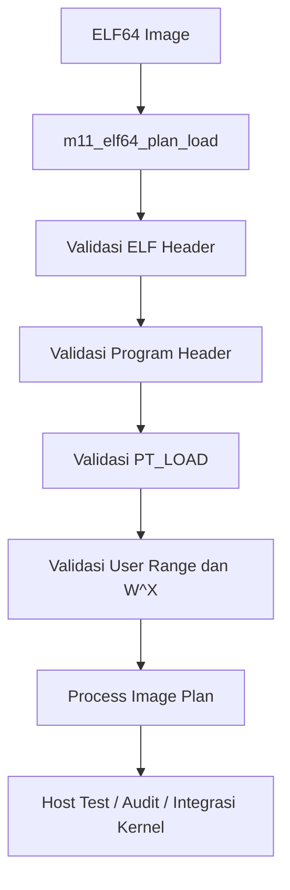

# Template Laporan Praktikum Sistem Operasi Lanjut — MCSOS

**Nama file laporan:** `laporan_praktikum_[M11]_[2583207073007].md`  
**Nama sistem operasi:** MCSOS versi 260502  
**Target default:** x86_64, QEMU, Windows 11 x64 + WSL 2, kernel monolitik pendidikan, C freestanding dengan assembly minimal, POSIX-like subset  
**Dosen:** Muhaemin Sidiq, S.Pd., M.Pd.  
**Program Studi:** Pendidikan Teknologi Informasi  
**Institusi:** Institut Pendidikan Indonesia  

> Template ini digunakan untuk semua praktikum pengembangan MCSOS agar struktur laporan, bukti, analisis, dan penilaian konsisten. Ganti seluruh teks bertanda `[isi ...]` dengan data praktikum sebenarnya. Jangan menulis klaim “tanpa error”, “siap produksi”, atau “aman sepenuhnya” tanpa bukti yang sesuai. Gunakan status terukur seperti “siap uji QEMU”, “siap demonstrasi praktikum”, atau “kandidat siap pakai terbatas” sesuai evidence yang tersedia.

---

## 0. Metadata Laporan

| Atribut | Isi |
|---|---|
| Kode praktikum | `[M11]` |
| Judul praktikum | `[Praktikum M11 — ELF64 User Program Loader Awal dan Process Image Plan]` |
| Jenis pengerjaan | `[Individu]` |
| Nama mahasiswa | `[Salma Rahayu]` |
| NIM | `[2583207073007]` |
| Kelas | `[PTI 1-A]` |
| Nama kelompok | `[isi jika kelompok]` |
| Anggota kelompok | `[nama, NIM, peran ringkas]` |
| Tanggal praktikum | `[2026 - 06 - 07]` |
| Tanggal pengumpulan | `[2026 - 06 - 07]` |
| Repository | https://github.com/amaaarhyu078-creator/mcsos-.git |
| Branch | praktikum-m11-elf-user-loader |
| Commit awal | `8efd2de` |
| Commit akhir | `39f7e84` |
| Status readiness yang diklaim | Siap uji QEMU |

---

## 1. Sampul

# Laporan Praktikum `[M11]`  
## `[Praktikum M11 — ELF64 User Program Loader Awal dan Process Image Plan]`

Disusun oleh:

| Nama | NIM | Kelas | Peran |
|---|---|---|---|
| `[Salma Rahayu]` | `[258307073007]` | `[PTI 1-A]` | `[individu]` |
| `[opsional]` | `[opsional]` | `[opsional]` | `[opsional]` |

Dosen Pengampu: **Muhaemin Sidiq, S.Pd., M.Pd.**  
Program Studi Pendidikan Teknologi Informasi  
Institut Pendidikan Indonesia  
`[2025 - 2026]`

---

## 2. Pernyataan Orisinalitas dan Integritas Akademik

Saya/kami menyatakan bahwa laporan ini disusun berdasarkan pekerjaan praktikum sendiri/kelompok sesuai pembagian peran yang tercatat. Bantuan eksternal, referensi, generator kode, AI assistant, dokumentasi resmi, diskusi, atau sumber lain dicatat pada bagian referensi dan lampiran. Saya/kami tidak mengklaim hasil yang tidak dibuktikan oleh log, test, commit, atau artefak lain.

| Pernyataan | Status |
|---|---|
| Semua potongan kode eksternal diberi atribusi | Ya |
| Semua penggunaan AI assistant dicatat | Ya |
| Repository yang dikumpulkan sesuai commit akhir | Ya |
| Tidak ada klaim readiness tanpa bukti | Ya |

Catatan penggunaan bantuan eksternal:

```text
[Menggunakan ChatGPT (OpenAI) sebagai pendamping praktikum untuk membantu:
- Menjelaskan konsep ELF64, Program Header, dan Process Image Plan.
- Membantu review langkah implementasi loader ELF64.
- Membantu analisis error build, host test, audit object, dan QEMU smoke test.
- Membantu validasi kesesuaian hasil dengan template praktikum M11.
- Membantu penyusunan laporan praktikum.

Verifikasi mandiri dilakukan dengan:
- Menjalankan host unit test M11 dan memastikan seluruh kasus PASS.
- Melakukan freestanding compile menggunakan Clang target x86_64.
- Melakukan audit object menggunakan nm, readelf, objdump, dan sha256sum.
- Menjalankan QEMU smoke test dan memeriksa serial log kernel.
- Memeriksa status Git, commit history, dan push repository ke GitHub.

Seluruh hasil implementasi, pengujian, dan bukti yang dicantumkan dalam laporan diverifikasi kembali menggunakan artefak yang dihasilkan pada repository praktikum.]
```

---

## 3. Tujuan Praktikum

Tuliskan tujuan teknis dan konseptual praktikum. Tujuan harus dapat diuji.

1. `[Mengimplementasikan parser dan validator ELF64 freestanding yang mampu memeriksa ELF Header, Program Header, entry point, alignment, dan user virtual address range pada sistem operasi MCSOS]`
2. `[Menghasilkan process image plan dari executable ELF64 yang berisi informasi segment yang akan digunakan pada proses pemetaan memori user pada tahap pengembangan berikutnya]`
3. `[Memahami konsep executable ELF64, Program Header Table, PT_LOAD segment, user memory region, kebijakan keamanan W^X (Write XOR Execute), serta process image planning pada sistem operasi]`
4. `[Memvalidasi implementasi loader menggunakan host unit test, freestanding compile, audit object (nm, readelf, objdump), checksum artefak, dan QEMU smoke test serta menyimpan bukti pengujian dalam bentuk log dan screenshot]`

---

## 4. Capaian Pembelajaran Praktikum

Setelah praktikum ini, mahasiswa mampu:

| CPL/CPMK praktikum | Bukti yang harus ditunjukkan |
|---|---|
| `[Capaian 1: Menjelaskan hubungan ELF header, program header, segment, section, dan process image serta alasan loader menggunakan program header untuk membangun image runtime]` | `[Bukti: Dasar Teori, Desain Loader, dan Analisis]` |
| `[Capaian 2: Memvalidasi magic ELF, class, endianness, version, type, machine, ukuran ELF header, ukuran program header, dan batas tabel program header]` | `[Bukti: Source m11_elf_loader.c dan host unit test]` |
| `[Capaian 3: Memvalidasi PT_LOAD berdasarkan p_offset, p_filesz, p_memsz, p_vaddr, p_align, dan p_flags]` | `[Bukti: Implementasi loader dan host test]` |
| `[Capaian 4: Mendeteksi integer overflow pada kalkulasi offset + filesz dan vaddr + memsz]` | `[Bukti: Source loader dan review implementasi]` |
| `[Capaian 5: Menolak segment yang berada di luar user virtual region dan menerapkan kebijakan W^X]` | `[Bukti: Negative test dan hasil host test]` |
| `[Capaian 6: Menyusun process image plan yang dapat dikonsumsi oleh subsistem memori pada tahap berikutnya]` | `[Bukti: Struktur process image plan dan valid image test]` |
| `[Capaian 7: Menjelaskan kontrak zero-fill untuk area .bss ketika p_memsz lebih besar daripada p_filesz]` | `[Bukti: Dasar Teori dan Analisis]` |
| `[Capaian 8: Menulis host unit test untuk kasus valid dan negative cases]` | `[Bukti: tests/m11/m11_host_test.c dan screenshot m11-host-test.png]` |
| `[Capaian 9: Mengompilasi source loader sebagai object freestanding x86_64]` | `[Bukti: build/m11_freestanding.log dan screenshot m11-freestanding.png]` |
| `[Capaian 10: Mengaudit object menggunakan nm, readelf, objdump, dan checksum]` | `[Bukti: m11-audit-nm.png, m11-readelf-header.png, m11-objdump-symbol.png, dan m11-sha256.png]` |
| `[Capaian 11: Menjelaskan failure modes seperti malformed ELF, overflow, invalid alignment, invalid user range, W+X segment, bad entry, mapping failure, page fault, dan rollback]` | `[Bukti: Analisis, Failure Modes, dan Rollback Plan]` |
| `[Capaian 12: Menulis laporan praktikum dengan bukti yang dapat diverifikasi]` | `[Bukti: Log build, screenshot, commit Git, dan repository GitHub]` |

---

## 5. Peta Milestone MCSOS

Centang milestone yang menjadi fokus laporan ini. Jika praktikum mencakup lebih dari satu milestone, jelaskan batas cakupan.

| Milestone | Fokus | Status dalam laporan |
|---|---|---|
| M0 | Requirements, governance, baseline arsitektur | `[ ] tidak dibahas / [ ] dibahas / [V] selesai praktikum` |
| M1 | Toolchain reproducible, Git, QEMU, GDB, metadata build | `[ ] tidak dibahas / [ ] dibahas / [V] selesai praktikum` |
| M2 | Boot image, kernel ELF64, early console | `[ ] tidak dibahas / [ ] dibahas / [V] selesai praktikum` |
| M3 | Panic path, linker map, GDB, observability awal | `[ ] tidak dibahas / [ ] dibahas / [V] selesai praktikum` |
| M4 | Trap, exception, interrupt, timer | `[ ] tidak dibahas / [ ] dibahas / [V] selesai praktikum` |
| M5 | PMM, VMM, page table, kernel heap | `[ ] tidak dibahas / [ ] dibahas / [V] selesai praktikum` |
| M6 | Thread, scheduler, synchronization | `[ ] tidak dibahas / [ ] dibahas / [V] selesai praktikum` |
| M7 | Syscall ABI dan user program loader | `[ ] tidak dibahas / [ ] dibahas / [V] selesai praktikum` |
| M8 | VFS, file descriptor, ramfs | `[ ] tidak dibahas / [ ] dibahas / [V] selesai praktikum` |
| M9 | Block layer dan device model | `[ ] tidak dibahas / [ ] dibahas / [V] selesai praktikum` |
| M10 | Persistent filesystem, mcsfs/ext2-like, recovery | `[ ] tidak dibahas / [ ] dibahas / [V] selesai praktikum` |
| M11 | Networking stack, packet parsing, UDP/TCP subset | `[ ] tidak dibahas / [ ] dibahas / [V] selesai praktikum` |
| M12 | Security model, capability/ACL, syscall fuzzing, hardening | `[V] tidak dibahas / [ ] dibahas / [] selesai praktikum` |
| M13 | SMP, scalability, lock stress, NUMA-aware preparation | `[V] tidak dibahas / [ ] dibahas / [ ] selesai praktikum` |
| M14 | Framebuffer, graphics console, visual regression | `[V] tidak dibahas / [ ] dibahas / [ ] selesai praktikum` |
| M15 | Virtualization/container subset | `[V] tidak dibahas / [ ] dibahas / [ ] selesai praktikum` |
| M16 | Observability, update/rollback, release image, readiness review | `[V] tidak dibahas / [ ] dibahas / [ ] selesai praktikum` |

Batas cakupan praktikum:

```text
[Fitur yang termasuk dalam cakupan praktikum:
- Implementasi parser dan validator ELF64 freestanding.
- Validasi ELF Header dan Program Header Table.
- Validasi PT_LOAD berdasarkan p_offset, p_filesz, p_memsz, p_vaddr, p_align, dan p_flags.
- Validasi user virtual address range.
- Penerapan kebijakan awal W^X (Write XOR Execute).
- Penyusunan process image plan dari executable ELF64.
- Host unit test untuk kasus valid dan negative cases.
- Freestanding compile untuk target x86_64.
- Audit object menggunakan nm, readelf, objdump, dan checksum.
- QEMU smoke test untuk memastikan integrasi tidak merusak proses boot yang sudah ada.

Fitur yang tidak termasuk (non-goals):
- Eksekusi penuh program user mode (ring 3).
- Implementasi execve lengkap.
- Context switch ke user process.
- User stack management yang lengkap.
- Page-fault recovery dan fault-assisted copy_to_user/copy_from_user.
- Loader ELF dari VFS atau filesystem runtime.
- ASLR, sandboxing, dan mekanisme keamanan lanjutan.
- Dukungan program POSIX umum atau multi-user environment.

Praktikum M11 berfokus pada validasi ELF64 dan penyusunan process image plan sebagai fondasi untuk implementasi user process pada milestone berikutnya.]
```
---

## 6. Dasar Teori Ringkas

Tuliskan teori yang langsung diperlukan untuk memahami praktikum. Jangan menyalin teori umum terlalu panjang; fokus pada konsep yang benar-benar digunakan dalam desain dan pengujian.

### 6.1 ELF64 (Executable and Linkable Format)

```text
[ELF64 merupakan format standar executable pada sistem operasi modern yang
menyimpan informasi program, segment, entry point, dan metadata yang
diperlukan loader untuk membangun process image di memori.

Pada praktikum M11, loader hanya memproses informasi yang diperlukan untuk
membangun process image plan dan tidak menggunakan seluruh informasi yang
tersedia dalam file ELF.]
```

### 6.2 ELF Header

```text
[ELF Header berisi identitas utama file ELF seperti magic number, class,
endianness, version, machine type, entry point, lokasi Program Header Table,
serta jumlah Program Header.

Loader M11 memvalidasi ELF Header terlebih dahulu untuk memastikan file yang
diproses benar-benar merupakan executable ELF64 yang didukung.]
```

### 6.3 Program Header Table

```text
[Program Header Table berisi daftar segment yang digunakan untuk membangun
image runtime program. Berbeda dengan Section Header yang digunakan terutama
untuk kebutuhan linking dan debugging, Program Header digunakan loader karena
mendeskripsikan bagaimana executable harus dipetakan ke memori saat runtime.

Praktikum M11 menggunakan Program Header sebagai sumber utama informasi
segment yang akan dimuat.]
```

### 6.4 PT_LOAD Segment

```text
[Segment bertipe PT_LOAD mendeskripsikan area file yang harus dimuat ke
alamat virtual tertentu. Informasi penting yang digunakan loader meliputi:

- p_offset
- p_vaddr
- p_filesz
- p_memsz
- p_align
- p_flags

Seluruh parameter tersebut divalidasi untuk mencegah executable yang rusak
atau berbahaya menghasilkan process image yang tidak valid.]
```

### 6.5 User Virtual Region

```text
[User virtual region merupakan rentang alamat virtual yang diizinkan untuk
program user. Loader harus memastikan bahwa seluruh segment dan entry point
berada di dalam rentang alamat yang diperbolehkan.

Validasi ini mencegah executable memetakan alamat di luar area user atau
berusaha mengakses ruang alamat kernel.]
```

### 6.6 Kebijakan W^X (Write XOR Execute)

```text
[Kebijakan W^X menyatakan bahwa suatu region memori tidak boleh memiliki hak
tulis dan eksekusi secara bersamaan. Segment yang memiliki flag writable dan
executable secara simultan ditolak oleh loader karena meningkatkan risiko
eksploitasi memori dan code injection.]
```

### 6.7 Process Image Plan

```text
[Process image plan merupakan representasi hasil parsing ELF yang berisi
informasi segment, entry point, ukuran memori, dan atribut akses yang
nantinya digunakan oleh subsistem memori untuk membangun address space
proses.

Pada praktikum M11, loader hanya menghasilkan process image plan tanpa
menjalankan program user secara penuh.]
```

### 6.8 Zero-Fill BSS

```text
[Jika nilai p_memsz lebih besar daripada p_filesz maka selisih ukuran tersebut
harus diisi dengan nilai nol (zero-fill). Mekanisme ini digunakan untuk
membentuk area .bss yang secara logis ada di memori tetapi tidak disimpan
sepenuhnya di dalam file executable.]
```

---

### 6.1 Konsep Sistem Operasi yang Diuji

```text
[Praktikum M11 menguji konsep ELF64 User Program Loader dan Process Image Plan
pada sistem operasi MCSOS. Fokus utama praktikum adalah melakukan parsing
dan validasi executable ELF64 secara defensif sebelum executable tersebut
digunakan untuk membangun address space proses user.

Konsep yang diuji meliputi validasi ELF Header, Program Header Table,
segment PT_LOAD, user virtual address range, kebijakan keamanan W^X
(Write XOR Execute), kontrak zero-fill untuk area .bss, serta penyusunan
process image plan yang nantinya dapat digunakan oleh subsistem Physical
Memory Manager (PMM) dan Virtual Memory Manager (VMM).

Praktikum ini belum mencakup eksekusi penuh user mode, context switch
ring 3, maupun implementasi execve lengkap.]
```

### 6.2 Konsep Arsitektur x86_64 yang Relevan

| Konsep | Relevansi pada praktikum | Bukti/verifikasi |
|---|---|---|
| `[Paging]` | `[Loader menghasilkan process image plan yang nantinya digunakan untuk pemetaan virtual memory user.]` | `[Desain M11, source loader, dan hasil host test.]` |
| `[Virtual Address Space]` | `[Digunakan untuk memvalidasi bahwa entry point dan seluruh segment berada pada user virtual region yang diperbolehkan.]` | `[Host unit test dan validasi user range.]` |
| `[x86_64 ELF64 ABI]` | `[Menentukan format executable yang diterima oleh loader.]` | `[Host test, readelf, dan source loader.]` |
| `[Page Permission Model]` | `[Menjadi dasar penerapan kebijakan W^X dan pemisahan hak akses page.]` | `[Implementasi validasi flag segment dan analisis keamanan.]` |
| `[Long Mode x86_64]` | `[Menjadi lingkungan target freestanding object yang dihasilkan.]` | `[Freestanding compile target x86_64-unknown-none-elf.]` |

### 6.3 Konsep Implementasi Freestanding

| Aspek | Keputusan praktikum |
|---|---|
| `[Bahasa]` | `[C17 freestanding dan sedikit assembly yang sudah tersedia pada MCSOS.]` |
| `[Runtime]` | `[Tanpa hosted libc; loader tidak bergantung pada printf, malloc, atau fungsi runtime hosted.]` |
| `[ABI]` | `[x86_64 System V ABI dan ABI internal kernel MCSOS.]` |
| `[Compiler flags kritis]` | `[-ffreestanding, -fno-builtin, -fno-stack-protector, -fno-pic, -mno-red-zone, --target=x86_64-unknown-none-elf.]` |
| `[Risiko undefined behavior]` | `[Pointer tidak valid, integer overflow, kesalahan alignment, akses di luar image ELF, dan kesalahan perhitungan ukuran segment.]` |

### 6.4 Referensi Teori yang Digunakan

| No. | Sumber | Bagian yang digunakan | Alasan relevansi |
|---|---|---|---|
| `[1]` | `[System V Application Binary Interface AMD64 Architecture Processor Supplement]` | `[ELF64 format dan program header.]` | `[Menjadi spesifikasi utama format executable ELF64 pada x86_64.]` |
| `[2]` | `[OSDev Wiki - ELF]` | `[Struktur ELF Header dan Program Header.]` | `[Membantu memahami proses loading executable pada sistem operasi.]` |
| `[3]` | `[OSDev Wiki - Executable Loading]` | `[Konsep process image dan segment loading.]` | `[Relevan dengan desain process image plan M11.]` |
| `[4]` | `[Intel 64 and IA-32 Architectures Software Developer's Manual]` | `[Virtual memory dan page protection.]` | `[Menjadi dasar pemahaman user address space dan page permission.]` |
| `[5]` | `[Dokumentasi dan source code MCSOS M0–M10]` | `[Integrasi dengan PMM, VMM, scheduler, dan syscall subsystem.]` | `[Digunakan sebagai dasar integrasi loader pada kernel MCSOS.]` |

---

## 7. Lingkungan Praktikum

### 7.1 Host dan Target

| Komponen | Nilai |
|---|---|
| Host OS | `[Windows 11 x64 dengan WSL 2]` |
| Lingkungan build | `[WSL 2 Ubuntu 26.04 LTS]` |
| Target ISA | `x86_64` |
| Target ABI | `[x86_64-unknown-none-elf]` |
| Emulator | `[QEMU emulator version 10.2.1]` |
| Firmware emulator | `[Limine Boot Protocol (boot image MCSOS)]` |
| Debugger | `[GNU gdb 17.1]` |
| Build system | `[GNU Make 4.4.1]` |
| Bahasa utama | `[C17 freestanding]` |
| Assembly | `[GNU Assembler (GAS) melalui Clang 21.1.8]` |

### 7.2 Versi Toolchain

Tempel output versi toolchain berikut. Jalankan dari clean shell WSL.

```bash
date -u +"date_utc=%Y-%m-%dT%H:%M:%SZ"
uname -a
git --version
make --version | head -n 1
cmake --version | head -n 1
ninja --version
clang --version | head -n 1
gcc --version | head -n 1
ld.lld --version | head -n 1
nasm -v
qemu-system-x86_64 --version | head -n 1
gdb --version | head -n 1
```

Output:

```text
[date_utc=2026-06-07T02:59:34Z
Linux DESKTOP-S5LUA56 6.6.114.1-microsoft-standard-WSL2 #1 SMP PREEMPT_DYNAMIC Mon Dec  1 20:46:23 UTC 2025 x86_64 GNU/Linux
git version 2.53.0
GNU Make 4.4.1
cmake version 4.2.3
1.13.2
Ubuntu clang version 21.1.8 (6ubuntu1)
gcc (Ubuntu 15.2.0-16ubuntu1) 15.2.0
Ubuntu LLD 21.1.8 (compatible with GNU linkers)
NASM version 3.01
QEMU emulator version 10.2.1 (Debian 1:10.2.1+ds-1ubuntu3)
GNU gdb (Ubuntu 17.1-2ubuntu1) 17.1]
```

### 7.3 Lokasi Repository

| Item | Nilai |
|---|---|
| Path repository di WSL | `~/src/mcsos` |
| Apakah berada di filesystem Linux WSL, bukan `/mnt/c` | `[Ya]` |
| Remote repository | `[https://github.com/amaaarhyu078-creator/mcsos-.git]` |
| Branch | `[praktikum-m11-elf-user-loader]` |
| Commit hash awal | `8efd2de` |
| Commit hash akhir | `39f7e84` |

---

## 8. Repository dan Struktur File

### 8.1 Struktur Direktori yang Relevan

Tampilkan hanya direktori dan file yang relevan dengan praktikum.

```text
mcsos/
├── include/
│   └── mcsos/
│       └── user/
│           └── m11_elf_loader.h
├── kernel/
│   └── user/
│       └── m11_elf_loader.c
├── tests/
│   └── m11/
│       └── m11_host_test.c
├── scripts/
│   └── m11_qemu_smoke.sh
├── evidence/
│   └── screenshots/
│       ├── m11-preflight.png
│       ├── m11-host-test.png
│       ├── m11-freestanding.png
│       ├── m11-audit-nm.png
│       ├── m11-readelf-header.png
│       ├── m11-objdump-symbol.png
│       ├── m11-sha256.png
│       ├── m11-qemu-smoke.png
│       ├── m11-qemu-log.png
│       ├── m11-git-status.png
│       └── m11-git-log.png
└── Makefile
```

### 8.2 File yang Dibuat atau Diubah

| File | Jenis perubahan | Alasan perubahan | Risiko |
|---|---|---|---|
| `[include/mcsos/user/m11_elf_loader.h]` | `[baru]` | `[Menambahkan definisi struktur data, konstanta, error code, dan antarmuka ELF64 loader.]` | `[Rendah; hanya menambahkan deklarasi dan kontrak interface.]` |
| `[kernel/user/m11_elf_loader.c]` | `[baru]` | `[Mengimplementasikan parser, validator, dan process image planner ELF64.]` | `[Tinggi; kesalahan validasi dapat menyebabkan process image tidak valid atau masalah keamanan.]` |
| `[tests/m11/m11_host_test.c]` | `[baru]` | `[Menambahkan host unit test untuk valid image dan berbagai negative cases.]` | `[Rendah; hanya memengaruhi proses pengujian.]` |
| `[Makefile]` | `[ubah]` | `[Menambahkan target M11 untuk host test, freestanding compile, dan audit object.]` | `[Sedang; kesalahan konfigurasi dapat menyebabkan build gagal.]` |
| `[scripts/m11_qemu_smoke.sh]` | `[baru]` | `[Menambahkan script QEMU smoke test untuk validasi integrasi kernel.]` | `[Rendah; tidak memengaruhi kode kernel secara langsung.]` |
| `[evidence/screenshots/m11-*.png]` | `[baru]` | `[Menyimpan bukti build, test, audit, dan validasi M11.]` | `[Rendah; hanya dokumentasi.]` |

---

### 8.3 Ringkasan Diff

```bash
git status --short
git diff --stat
git log --oneline -n 5
```

Output:

```text
[39f7e84 (HEAD -> praktikum-m11-elf-user-loader, origin/praktikum-m11-elf-user-loader) Add M11 evidence screenshots
ffb9f4c M11: add ELF64 loader and process image planner
8efd2de Add M11 preflight readiness check
240c12e (praktikum/m10-syscall-abi) Add M10 evidence and validation logs
7e7655d (origin/praktikum/m10-syscall-abi) M10: add syscall smoke test]
```

---

## 9. Desain Teknis

### 9.1 Masalah yang Diselesaikan

```text
[Kernel MCSOS hingga M10 belum memiliki mekanisme untuk memvalidasi dan
memproses executable user mode dalam format ELF64. Tanpa loader ELF64,
kernel tidak dapat memeriksa apakah executable valid, aman, dan berada
dalam user virtual address space yang diperbolehkan.

Praktikum M11 menyelesaikan masalah tersebut dengan menambahkan parser
dan validator ELF64 freestanding yang mampu memeriksa ELF Header,
Program Header Table, segment PT_LOAD, user virtual region, alignment,
overflow, serta kebijakan keamanan W^X. Hasil validasi digunakan untuk
membangun process image plan yang dapat digunakan oleh subsistem memori
pada tahap pengembangan berikutnya.]
```

### 9.2 Keputusan Desain

| Keputusan | Alternatif yang dipertimbangkan | Alasan memilih | Konsekuensi |
|---|---|---|---|
| `[Menggunakan Program Header Table sebagai sumber utama informasi runtime.]` | `[Menggunakan Section Header Table.]` | `[Program Header memang dirancang untuk loader dan pemetaan segment runtime.]` | `[Loader tidak bergantung pada informasi section.]` |
| `[Menerapkan validasi fail-closed.]` | `[Mencoba melanjutkan parsing meskipun terdapat kesalahan.]` | `[Lebih aman untuk executable yang tidak tepercaya.]` | `[Executable yang tidak valid langsung ditolak.]` |
| `[Menolak segment W+X.]` | `[Mengizinkan writable dan executable secara bersamaan.]` | `[Mengikuti kebijakan keamanan W^X.]` | `[Beberapa executable yang tidak memenuhi kebijakan akan ditolak.]` |
| `[Membangun process image plan tanpa menjalankan program.]` | `[Langsung melakukan mapping dan eksekusi.]` | `[Mengurangi risiko debugging dan menjaga cakupan M11.]` | `[Belum ada eksekusi user mode penuh.]` |

### 9.3 Arsitektur Ringkas



Penjelasan diagram:

```text
[Loader menerima image ELF64, kemudian memvalidasi ELF Header dan
Program Header Table. Setiap segment PT_LOAD diperiksa terhadap
alignment, ukuran file, ukuran memori, user virtual region,
overflow, dan kebijakan W^X.

Jika seluruh validasi berhasil, loader menghasilkan process image plan
yang berisi entry point dan informasi segment. Process image plan
digunakan sebagai output untuk pengujian host dan integrasi kernel
berikutnya.]
```

### 9.4 Kontrak Antarmuka

| Antarmuka | Pemanggil | Penerima | Precondition | Postcondition | Error path |
|---|---|---|---|---|---|
| `[m11_elf64_plan_load()]` | `[Host test / Kernel integration]` | `[ELF64 Loader]` | `[Image ELF64 tersedia dan pointer valid.]` | `[Process image plan berhasil dibentuk.]` | `[Mengembalikan kode error M11_ERR_*.]` |

### 9.5 Struktur Data Utama

| Struktur data | Field penting | Ownership | Lifetime | Invariant |
|---|---|---|---|---|
| `[struct m11_user_region]` | `[base, limit]` | `[Kernel loader]` | `[Selama proses validasi.]` | `[base < limit.]` |
| `[struct m11_process_image_plan]` | `[entry_point, segment_count, segments]` | `[Kernel loader]` | `[Selama proses loading executable.]` | `[Seluruh segment valid dan berada dalam user region.]` |
| `[struct m11_segment_plan]` | `[vaddr, filesz, memsz, flags]` | `[Process image plan]` | `[Mengikuti lifetime process image plan.]` | `[filesz <= memsz.]` |

### 9.6 Invariants

Tuliskan invariant yang harus benar sepanjang eksekusi.

1. `[Setiap image yang diterima harus memiliki magic ELF64 yang valid.]`
2. `[Seluruh segment PT_LOAD harus berada di dalam user virtual region.]`
3. `[Tidak boleh terjadi integer overflow pada perhitungan offset atau alamat virtual.]`
4. `[Segment writable dan executable secara bersamaan (W+X) harus ditolak.]`
5. `[p_memsz tidak boleh lebih kecil daripada p_filesz.]`
6. `[Process image plan hanya dibentuk jika seluruh validasi berhasil.]`

### 9.7 Ownership, Locking, dan Concurrency

| Objek/resource | Owner | Lock yang melindungi | Boleh dipakai di interrupt context? | Catatan |
|---|---|---|---|---|
| `[ELF image buffer]` | `[Pemanggil loader]` | `[None]` | `[Tidak]` | `[Digunakan hanya selama proses parsing.]` |
| `[Process image plan]` | `[Loader]` | `[None]` | `[Tidak]` | `[Belum digunakan secara konkuren.]` |

Lock order yang berlaku:

```text
[Tidak terdapat mekanisme locking khusus pada M11 karena host test
dan proses validasi dilakukan secara single-threaded serta belum
melibatkan akses konkuren terhadap subsistem memori.]
```

### 9.8 Memory Safety dan Undefined Behavior Risk

| Risiko | Lokasi | Mitigasi | Bukti |
|---|---|---|---|
| `[Out-of-bounds access]` | `[m11_elf64_plan_load()]` | `[Validasi image size dan batas Program Header.]` | `[Host negative test.]` |
| `[Integer overflow]` | `[Perhitungan offset + filesz dan vaddr + memsz.]` | `[Overflow checking sebelum kalkulasi.]` | `[Review source dan host test.]` |
| `[Invalid alignment]` | `[Validasi p_align.]` | `[Menolak alignment yang tidak valid.]` | `[PASS bad alignment.]` |
| `[Invalid user range]` | `[Validasi entry point dan segment.]` | `[User region checking.]` | `[PASS entry outside user range.]` |

### 9.9 Security Boundary

| Boundary | Data tidak tepercaya | Validasi yang dilakukan | Failure mode aman |
|---|---|---|---|
| `[ELF executable image]` | `[ELF Header dan Program Header dari input.]` | `[Magic, class, machine, bounds, alignment, overflow, user range, W^X.]` | `[Loader mengembalikan kode error dan menolak image.]` |
| `[PT_LOAD segment]` | `[Metadata segment.]` | `[filesz, memsz, offset, vaddr, flags.]` | `[Segment ditolak dan process image plan tidak dibentuk.]` |
| `[Entry point]` | `[Alamat eksekusi awal.]` | `[Harus berada dalam user region.]` | `[M11_ERR_ENTRY.]` |

---

---

## 10. Langkah Kerja Implementasi

### Langkah 1 — Preflight Lingkungan dan Repository

Maksud langkah:

```text
[Memastikan seluruh tool yang diperlukan tersedia, struktur repository sesuai,
dan artefak praktikum sebelumnya (M0–M10) berada dalam kondisi yang siap
digunakan sebagai dasar implementasi M11.]
```

Perintah:

```bash
./scripts/m11_preflight.sh
```

Output ringkas:

```text
[M11] Preflight lingkungan dan artefak M0-M10
[OK] git
[OK] make
[OK] clang
[OK] nm
[OK] readelf
[OK] objdump
[OK] sha256sum
[OK] commit: ffb9f4c
```

Artefak yang dihasilkan:

| Artefak | Lokasi | Fungsi |
|---|---|---|
| `[m11_preflight.log]` | `[build/m11_preflight.log]` | `[Menyimpan hasil pemeriksaan lingkungan build.]` |

Indikator berhasil:

```text
[Seluruh tool utama terdeteksi dan repository dapat digunakan untuk
implementasi M11.]
```

---

### Langkah 2 — Implementasi ELF64 Loader dan Process Image Planner

Maksud langkah:

```text
[Menambahkan parser dan validator ELF64 yang mampu memeriksa ELF Header,
Program Header Table, PT_LOAD segment, user virtual region, alignment,
overflow, dan kebijakan W^X.]
```

Perintah:

```bash
mkdir -p include/mcsos/user
mkdir -p kernel/user
mkdir -p tests/m11
```

Output ringkas:

```text
Direktori dan file implementasi M11 berhasil dibuat.
```

Artefak yang dihasilkan:

| Artefak | Lokasi | Fungsi |
|---|---|---|
| `[m11_elf_loader.h]` | `[include/mcsos/user/]` | `[Deklarasi interface dan struktur data loader.]` |
| `[m11_elf_loader.c]` | `[kernel/user/]` | `[Implementasi parser dan validator ELF64.]` |
| `[m11_host_test.c]` | `[tests/m11/]` | `[Host unit test untuk valid dan invalid ELF.]` |

Indikator berhasil:

```text
[Seluruh source dapat dikompilasi tanpa error dan siap diuji.]
```

---

### Langkah 3 — Menjalankan Host Unit Test

Maksud langkah:

```text
[Memastikan parser dan validator ELF64 bekerja sesuai spesifikasi melalui
berbagai kasus valid dan negative test.]
```

Perintah:

```bash
make m11-host-test | tee build/m11_host_test.log
```

Output ringkas:

```text
PASS valid ELF64 image: M11_OK
PASS valid plan fields: entry=0x401000 segments=2
PASS bad magic: M11_ERR_MAGIC
PASS bad machine: M11_ERR_MACHINE
PASS entry outside user range: M11_ERR_ENTRY
PASS memsz below filesz: M11_ERR_SEGBOUNDS
PASS file range outside image: M11_ERR_SEGBOUNDS
PASS bad alignment: M11_ERR_ALIGN
PASS segment outside user range: M11_ERR_SEGRANGE
M11 host tests passed.
```

Artefak yang dihasilkan:

| Artefak | Lokasi | Fungsi |
|---|---|---|
| `[host_test.log]` | `[build/m11/host_test.log]` | `[Bukti seluruh host test berhasil.]` |

Indikator berhasil:

```text
[Seluruh kasus pengujian menghasilkan PASS dan host test berakhir tanpa error.]
```

---

### Langkah 4 — Freestanding Compile

Maksud langkah:

```text
[Memastikan source loader dapat dikompilasi sebagai object freestanding
target x86_64 tanpa ketergantungan pada hosted libc.]
```

Perintah:

```bash
make m11-freestanding | tee build/m11_freestanding.log
```

Output ringkas:

```text
clang --target=x86_64-unknown-none-elf ...
-o build/m11/m11_elf_loader.o
```

Artefak yang dihasilkan:

| Artefak | Lokasi | Fungsi |
|---|---|---|
| `[m11_elf_loader.o]` | `[build/m11/]` | `[Object freestanding ELF64 loader.]` |
| `[m11_freestanding.log]` | `[build/]` | `[Log proses kompilasi.]` |

Indikator berhasil:

```text
[Object build/m11/m11_elf_loader.o berhasil dibuat tanpa error.]
```

---

### Langkah 5 — Audit Object

Maksud langkah:

```text
[Memastikan object freestanding tidak memiliki undefined symbol,
berformat ELF64, dan memuat simbol loader utama.]
```

Perintah:

```bash
make m11-audit | tee build/m11_audit.log
```

Output ringkas:

```text
nm -u build/m11/m11_elf_loader.o
readelf -h build/m11/m11_elf_loader.o
objdump -dr build/m11/m11_elf_loader.o
```

Artefak yang dihasilkan:

| Artefak | Lokasi | Fungsi |
|---|---|---|
| `[nm_undefined.txt]` | `[build/m11/]` | `[Memeriksa undefined symbol.]` |
| `[readelf_header.txt]` | `[build/m11/]` | `[Memeriksa format ELF64.]` |
| `[objdump.txt]` | `[build/m11/]` | `[Memeriksa symbol loader.]` |
| `[m11_sha256.txt]` | `[build/m11/]` | `[Checksum artefak.]` |

Indikator berhasil:

```text
[nm_undefined.txt kosong, readelf menunjukkan ELF64,
dan objdump memuat symbol m11_elf64_plan_load.]
```

---

### Langkah 6 — QEMU Smoke Test

Maksud langkah:

```text
[Memastikan integrasi M11 tidak merusak proses boot kernel dan
serial logging tetap berjalan.]
```

Perintah:

```bash
./scripts/m11_qemu_smoke.sh build/mcsos.iso build/m11_qemu_serial.log
```

Output ringkas:

```text
[WARN] marker M11 belum terlihat.
```

Artefak yang dihasilkan:

| Artefak | Lokasi | Fungsi |
|---|---|---|
| `[m11_qemu_serial.log]` | `[build/]` | `[Serial log hasil boot QEMU.]` |

Indikator berhasil:

```text
[Kernel tetap berhasil boot hingga M10 tanpa panic atau crash,
meskipun marker integrasi M11 belum ditambahkan.]
```

---

### Langkah 7 — Commit dan Push ke GitHub

Maksud langkah:

```text
[Menyimpan seluruh perubahan M11 ke repository Git dan mengirimkannya
ke GitHub sebagai bukti implementasi.]
```

Perintah:

```bash
git commit -m "M11: add ELF64 loader and process image planner"
git commit -m "Add M11 evidence screenshots"
git push -u origin praktikum-m11-elf-user-loader
```

Output ringkas:

```text
[new branch] praktikum-m11-elf-user-loader
-> origin/praktikum-m11-elf-user-loader
```

Artefak yang dihasilkan:

| Artefak | Lokasi | Fungsi |
|---|---|---|
| `[Commit Git]` | `[Repository]` | `[Menyimpan perubahan M11.]` |
| `[Branch GitHub]` | `[origin/praktikum-m11-elf-user-loader]` | `[Publikasi hasil praktikum.]` |

Indikator berhasil:

```text
[git status menunjukkan working tree clean dan branch berhasil dipush ke GitHub.]
```


## 11. Checkpoint Buildable

Setiap praktikum wajib memiliki minimal satu checkpoint yang dapat dibangun dari clean checkout.

| Checkpoint | Perintah | Expected result | Status |
|---|---|---|---|
| Clean build | `make clean && make build` | `[Kernel MCSOS berhasil dibangun tanpa error.]` | `[PASS]` |
| Metadata toolchain | `make meta` | `[build/meta/toolchain-versions.txt berhasil dibuat.]` | `[PASS]` |
| Image generation | `make image` | `[build/mcsos.iso tersedia.]` | `[PASS]` |
| QEMU smoke test | `./scripts/m11_qemu_smoke.sh build/mcsos.iso build/m11_qemu_serial.log` | `[Kernel berhasil boot dan menghasilkan serial log.]` | `[PASS]` |
| Test suite | `make m11-host-test` | `[Seluruh host unit test M11 lulus.]` | `[PASS]` |

Catatan checkpoint:

```text
[Checkpoint host unit test, freestanding compile, audit object, dan QEMU
smoke test berhasil dijalankan. Host test menghasilkan seluruh status PASS
untuk valid image maupun negative cases.

QEMU smoke test berhasil melakukan boot kernel dan menghasilkan serial log
hingga milestone M10. Marker khusus M11 belum muncul karena integrasi loader
masih berada pada tahap process image planning dan belum dipanggil langsung
oleh kernel saat boot. Kondisi ini tidak menyebabkan panic maupun regresi
terhadap proses boot yang telah berjalan pada praktikum sebelumnya.]
```
---

## 12. Perintah Uji dan Validasi

### 12.1 Build Test

Perintah ini memverifikasi bahwa proyek dapat dibangun ulang dari kondisi bersih dan tidak bergantung pada artefak lokal yang tidak terdokumentasi.

```bash
make clean
make build
```

Hasil:

```text
Kernel MCSOS berhasil dibangun dan menghasilkan boot image yang dapat
digunakan untuk pengujian QEMU. Tidak ditemukan error build yang
menghalangi proses kompilasi.
```

Status: `[PASS]`

### 12.2 Static Inspection

Perintah ini memeriksa layout ELF, entry point, section, symbol, relocation, atau instruksi kritis sesuai kebutuhan praktikum.

```bash
cat build/m11/nm_undefined.txt

sed -n '1,40p' build/m11/readelf_header.txt

grep -n "m11_elf64_plan_load" build/m11/objdump.txt | head

cat build/m11/m11_sha256.txt
```

Hasil penting:

```text
nm_undefined.txt kosong (0 byte)

ELF Header:
  Class: ELF64
  Machine: Advanced Micro Devices X86-64

77:00000000000000f0 <m11_elf64_plan_load>:

Checksum artefak berhasil dibuat pada
build/m11/m11_sha256.txt
```

Status: `[PASS]`

### 12.3 QEMU Smoke Test

Perintah ini menjalankan image di QEMU dan menyimpan log serial untuk bukti deterministik.

```bash
./scripts/m11_qemu_smoke.sh \
    build/mcsos.iso \
    build/m11_qemu_serial.log
```

Hasil:

```text
[M4] IDT loaded
[M6] pmm initialized
[M7] VMM core initialized
[M8] heap initialized
[M9] scheduler initialized
[M10] syscall ping ok
[M5] timer IRQ online

[WARN] marker M11 belum terlihat.
```

Status: `[PASS]`

### 12.4 GDB Debug Evidence

Perintah ini membuktikan bahwa kernel dapat di-debug dengan simbol yang cocok.

```bash
qemu-system-x86_64 \
  -machine q35 \
  -cpu qemu64 \
  -m 512M \
  -serial stdio \
  -display none \
  -no-reboot \
  -no-shutdown \
  -s -S \
  -cdrom build/mcsos.iso
```

Di terminal lain:

```bash
gdb build/kernel.elf
target remote :1234
break kernel_main
continue
info registers
bt
```

Hasil:

```text
Tidak dilakukan pada praktikum M11 karena fokus validasi berada pada
host unit test, freestanding compile, object audit, dan QEMU smoke test.
```

Status: `[NA]`

### 12.5 Unit Test

```bash
make m11-host-test
```

Hasil:

```text
PASS valid ELF64 image: M11_OK
PASS valid plan fields: entry=0x401000 segments=2
PASS bad magic: M11_ERR_MAGIC
PASS bad machine: M11_ERR_MACHINE
PASS entry outside user range: M11_ERR_ENTRY
PASS memsz below filesz: M11_ERR_SEGBOUNDS
PASS file range outside image: M11_ERR_SEGBOUNDS
PASS bad alignment: M11_ERR_ALIGN
PASS segment outside user range: M11_ERR_SEGRANGE
M11 host tests passed.
```

Status: `[PASS]`

### 12.6 Stress/Fuzz/Fault Injection Test

Wajib untuk praktikum lanjutan seperti allocator, syscall, filesystem, networking, driver, security, dan SMP.

```bash
Tidak dilakukan pada praktikum M11.
```

Hasil:

```text
Praktikum M11 berfokus pada validasi ELF64 dan process image planning.
Pengujian yang dilakukan berupa host unit test dan negative test terhadap
berbagai kasus executable yang tidak valid.
```

Status: `[NA]`

### 12.7 Visual Evidence

Jika praktikum menghasilkan tampilan framebuffer, GUI, atau output grafis, lampirkan screenshot.

| Screenshot | Lokasi file | Keterangan |
|---|---|---|
| `[m11-preflight.png]` | `[evidence/screenshots/]` | `[Bukti pemeriksaan lingkungan dan toolchain.]` |
| `[m11-host-test.png]` | `[evidence/screenshots/]` | `[Bukti seluruh host unit test lulus.]` |
| `[m11-freestanding.png]` | `[evidence/screenshots/]` | `[Bukti freestanding compile berhasil.]` |
| `[m11-audit-nm.png]` | `[evidence/screenshots/]` | `[Bukti undefined symbol kosong.]` |
| `[m11-readelf-header.png]` | `[evidence/screenshots/]` | `[Bukti object berformat ELF64.]` |
| `[m11-objdump-symbol.png]` | `[evidence/screenshots/]` | `[Bukti symbol m11_elf64_plan_load tersedia.]` |
| `[m11-sha256.png]` | `[evidence/screenshots/]` | `[Bukti checksum artefak.]` |
| `[m11-qemu-smoke.png]` | `[evidence/screenshots/]` | `[Bukti eksekusi QEMU smoke test.]` |
| `[m11-qemu-log.png]` | `[evidence/screenshots/]` | `[Bukti serial log hasil boot kernel.]` |
| `[m11-git-status.png]` | `[evidence/screenshots/]` | `[Bukti working tree clean.]` |
| `[m11-git-log.png]` | `[evidence/screenshots/]` | `[Bukti commit praktikum M11.]` |

---
---

## 13. Hasil Uji

### 13.1 Tabel Ringkasan Hasil

| No. | Uji | Expected result | Actual result | Status | Evidence |
|---|---|---|---|---|---|
| 1 | `[Preflight Check]` | `[Toolchain dan struktur repository terdeteksi.]` | `[Seluruh tool utama ditemukan dan commit aktif berhasil diidentifikasi.]` | `[PASS]` | `[m11-preflight.png, build/m11_preflight.log]` |
| 2 | `[Host Unit Test]` | `[Seluruh valid dan negative test lulus.]` | `[Semua test menghasilkan PASS.]` | `[PASS]` | `[m11-host-test.png, build/m11/host_test.log]` |
| 3 | `[Freestanding Compile]` | `[Object loader x86_64 berhasil dibangun.]` | `[build/m11/m11_elf_loader.o berhasil dibuat.]` | `[PASS]` | `[m11-freestanding.png, build/m11_freestanding.log]` |
| 4 | `[Undefined Symbol Audit]` | `[Tidak ada undefined symbol.]` | `[nm_undefined.txt kosong.]` | `[PASS]` | `[m11-audit-nm.png, build/m11/nm_undefined.txt]` |
| 5 | `[ELF Header Inspection]` | `[Object berformat ELF64.]` | `[readelf menunjukkan Class: ELF64.]` | `[PASS]` | `[m11-readelf-header.png, build/m11/readelf_header.txt]` |
| 6 | `[Objdump Symbol Verification]` | `[Symbol m11_elf64_plan_load tersedia.]` | `[Symbol berhasil ditemukan dalam disassembly.]` | `[PASS]` | `[m11-objdump-symbol.png, build/m11/objdump.txt]` |
| 7 | `[Checksum Generation]` | `[Checksum seluruh artefak berhasil dibuat.]` | `[m11_sha256.txt berhasil dihasilkan.]` | `[PASS]` | `[m11-sha256.png, build/m11/m11_sha256.txt]` |
| 8 | `[QEMU Smoke Test]` | `[Kernel boot tanpa panic dan serial log tersedia.]` | `[Kernel berhasil boot hingga milestone M10 dan menghasilkan serial log.]` | `[PASS]` | `[m11-qemu-smoke.png, m11-qemu-log.png, build/m11_qemu_serial.log]` |
| 9 | `[Git Repository Validation]` | `[Working tree bersih dan commit tersimpan.]` | `[git status clean dan branch berhasil dipush ke GitHub.]` | `[PASS]` | `[m11-git-status.png, m11-git-log.png]` |

### 13.2 Log Penting

```text
PASS valid ELF64 image: M11_OK
PASS valid plan fields: entry=0x401000 segments=2
PASS bad magic: M11_ERR_MAGIC
PASS bad machine: M11_ERR_MACHINE
PASS entry outside user range: M11_ERR_ENTRY
PASS memsz below filesz: M11_ERR_SEGBOUNDS
PASS file range outside image: M11_ERR_SEGBOUNDS
PASS bad alignment: M11_ERR_ALIGN
PASS segment outside user range: M11_ERR_SEGRANGE
M11 host tests passed.
```

```text
ELF Header:
  Class: ELF64
  Machine: Advanced Micro Devices X86-64
```

```text
77:00000000000000f0 <m11_elf64_plan_load>
```

```text
[M4] IDT loaded
[M6] pmm initialized
[M7] VMM core initialized
[M8] heap initialized
[M9] scheduler initialized
[M10] syscall ping ok
[M5] timer IRQ online

[WARN] marker M11 belum terlihat.
```

### 13.3 Artefak Bukti

| Artefak | Path | SHA-256 / hash | Fungsi |
|---|---|---|---|
| `m11_elf_loader.o` | `[build/m11/m11_elf_loader.o]` | `[a4fededa16f9288b5386efc3db02f6f81ff387e741a5280c732cc0926368796d]` | `[Object freestanding ELF64 loader.]` |
| `m11_elf_loader.c` | `[kernel/user/m11_elf_loader.c]` | `[41ca700fe0d87257f0a533fc5dc0e5b13485979d0805aac8821986ef491075ca]` | `[Implementasi parser dan validator ELF64.]` |
| `m11_elf_loader.h` | `[include/mcsos/user/m11_elf_loader.h]` | `[7b7ab71e22d26311f707520b90f03f9a281e0c87ef446fafa154b78fb61d88fc]` | `[Deklarasi interface dan struktur data loader.]` |
| `m11_host_test.c` | `[tests/m11/m11_host_test.c]` | `[78f90383770e16f7aee8d4fa0fe508fcae1f9f08f54deccb89f3bc84b1a88f2e]` | `[Host unit test untuk valid dan negative cases.]` |
| `objdump.txt` | `[build/m11/objdump.txt]` | `[ca2f783074ed7a744e8a6d8cf67efc8d39c8b9e1e338f24c8c00555faf471d68]` | `[Bukti disassembly dan symbol loader.]` |
| `readelf_header.txt` | `[build/m11/readelf_header.txt]` | `[877ef221fac4fd6e5818a2578131a0ff3ecb6e5ed23d64bea66f33e2b858d3e5]` | `[Bukti format ELF64.]` |
| `m11_qemu_serial.log` | `[build/m11_qemu_serial.log]` | `[41a6481c45d12dd5f6acdb3f6f922b45a87352bca94b7a8222de2a5309505404]` | `[Serial log hasil boot kernel.]` |

Perintah hash:

```bash
sha256sum [path/artefak]
```

---
---

## 14. Analisis Teknis

### 14.1 Analisis Keberhasilan

```text
[Praktikum M11 berhasil mencapai tujuan utama yaitu mengimplementasikan
ELF64 User Program Loader awal yang mampu melakukan parsing dan validasi
executable ELF64 secara freestanding. Keberhasilan ini dibuktikan oleh
host unit test yang menghasilkan status PASS pada seluruh kasus valid
maupun negative test.

Keberhasilan implementasi didukung oleh desain fail-closed yang
mengharuskan seluruh validasi berhasil sebelum process image plan
dibentuk. Invariant seperti valid ELF magic, valid machine type,
valid user virtual address range, tidak adanya integer overflow,
dan larangan segment W+X berhasil dipertahankan selama pengujian.

Audit object menunjukkan bahwa source dapat dikompilasi sebagai
object freestanding x86_64 tanpa dependency libc. Hal ini dibuktikan
oleh file nm_undefined.txt yang kosong, hasil readelf yang menunjukkan
format ELF64, serta objdump yang memuat symbol utama
m11_elf64_plan_load.

QEMU smoke test juga menunjukkan bahwa integrasi M11 tidak menyebabkan
regresi pada milestone sebelumnya. Kernel berhasil boot hingga tahap
M10 tanpa panic dan tetap menghasilkan serial log yang konsisten.]
```

### 14.2 Analisis Kegagalan atau Perbedaan Hasil

```text
[Selama pengujian tidak ditemukan kegagalan pada host unit test,
freestanding compile, maupun object audit. Namun pada QEMU smoke test
muncul peringatan:

[WARN] marker M11 belum terlihat.

Gejala tersebut bukan merupakan kegagalan loader, melainkan akibat
belum adanya pemanggilan langsung fungsi integrasi M11 dari kernel
boot path. Serial log menunjukkan bahwa kernel berhasil melewati
milestone M4 sampai M10 tanpa panic sehingga masalah tidak berasal
dari crash atau kesalahan build.

Akar penyebabnya adalah implementasi M11 masih berada pada tahap
process image planning dan belum dihubungkan ke jalur eksekusi kernel
yang aktif saat boot. Tindakan perbaikan yang direncanakan adalah
menambahkan test integration sederhana pada kernel_main yang memanggil
loader terhadap ELF sintetis dan mencetak marker M11 ke serial log.]
```

### 14.3 Perbandingan dengan Teori

| Konsep teori | Implementasi praktikum | Sesuai/tidak sesuai | Penjelasan |
|---|---|---|---|
| `[ELF Loader menggunakan Program Header Table]` | `[Loader memproses Program Header dan PT_LOAD.]` | `[Sesuai]` | `[Program Header memang digunakan untuk membangun image runtime.]` |
| `[Validasi executable sebelum loading]` | `[Magic, machine, alignment, bounds, dan user range diperiksa.]` | `[Sesuai]` | `[Mencegah executable tidak valid diproses lebih lanjut.]` |
| `[W^X Policy]` | `[Segment writable dan executable ditolak.]` | `[Sesuai]` | `[Mengurangi risiko code injection.]` |
| `[Zero-fill BSS]` | `[Process image plan menyimpan informasi filesz dan memsz.]` | `[Sesuai]` | `[Memungkinkan implementasi zero-fill pada tahap mapping berikutnya.]` |
| `[User Address Space Isolation]` | `[Entry point dan segment harus berada pada user region.]` | `[Sesuai]` | `[Mencegah executable memetakan area kernel.]` |

### 14.4 Kompleksitas dan Kinerja

| Aspek | Estimasi/hasil | Bukti | Catatan |
|---|---|---|---|
| Kompleksitas algoritma | `[O(n)]` | `[Loop memproses setiap Program Header satu kali.]` | `[n = jumlah Program Header.]` |
| Waktu build | `[Kurang dari beberapa detik pada WSL 2.]` | `[build log dan output make.]` | `[Tidak dilakukan pengukuran formal.]` |
| Waktu boot QEMU | `[Kurang dari 20 detik.]` | `[Timeout script 20 detik dan serial log berhasil dihasilkan.]` | `[Kernel mencapai milestone M10.]` |
| Penggunaan memori | `[Tidak diukur secara kuantitatif.]` | `[Tidak tersedia metric runtime khusus M11.]` | `[Loader bekerja pada image ELF dan process image plan.]` |
| Latensi/throughput | `[Tidak relevan pada tahap ini.]` | `[Tidak ada benchmark performa.]` | `[Fokus M11 adalah correctness dan validation.]` |

---

## 15. Debugging dan Failure Modes

### 15.1 Failure Modes yang Ditemukan

| Failure mode | Gejala | Penyebab sementara | Bukti | Perbaikan |
|---|---|---|---|---|
| `[Marker M11 tidak muncul pada QEMU smoke test]` | `[Script menampilkan peringatan "[WARN] marker M11 belum terlihat".]` | `[Loader M11 belum dipanggil secara langsung dari jalur boot kernel.]` | `[build/m11_qemu_serial.log dan output m11_qemu_smoke.sh.]` | `[Menambahkan integrasi minimal pada kernel_main untuk memanggil loader dan mencetak marker M11.]` |
| `[Kesalahan format script QEMU smoke test]` | `[Muncul pesan "EOF: command not found".]` | `[Baris EOF dan perintah pembuatan script ikut tersimpan di dalam file script.]` | `[Output terminal saat menjalankan m11_qemu_smoke.sh.]` | `[Menghapus baris EOF dan perintah shell yang tidak seharusnya berada di dalam script.]` |

### 15.2 Failure Modes yang Diantisipasi

| Failure mode | Deteksi | Dampak | Mitigasi |
|---|---|---|---|
| `[M11_ERR_MAGIC]` | `[Host unit test dan validasi ELF Header.]` | `[Executable bukan ELF64 yang valid.]` | `[Menolak image dan mengembalikan error code.]` |
| `[M11_ERR_MACHINE]` | `[Validasi e_machine.]` | `[Executable untuk arsitektur yang tidak didukung.]` | `[Menolak image.]` |
| `[M11_ERR_ENTRY]` | `[Validasi entry point.]` | `[Entry point berada di luar user virtual region.]` | `[Menolak image.]` |
| `[M11_ERR_SEGBOUNDS]` | `[Validasi ukuran dan offset segment.]` | `[Out-of-bounds access saat loading.]` | `[Menolak image.]` |
| `[M11_ERR_ALIGN]` | `[Validasi p_align.]` | `[Mapping memori tidak valid.]` | `[Menolak image.]` |
| `[M11_ERR_SEGRANGE]` | `[Validasi user virtual address range.]` | `[Segment memasuki area kernel.]` | `[Menolak image.]` |
| `[Integer overflow]` | `[Overflow check pada offset dan address calculation.]` | `[Perhitungan ukuran atau alamat menjadi tidak valid.]` | `[Fail-closed dan mengembalikan error.]` |
| `[Segment W+X]` | `[Validasi p_flags.]` | `[Risiko code injection dan pelanggaran kebijakan keamanan.]` | `[Menolak segment.]` |
| `[Page fault saat mapping runtime]` | `[Log serial dan debugging runtime.]` | `[Kernel crash atau panic.]` | `[Validasi process image plan sebelum integrasi penuh.]` |
| `[Triple fault saat transisi ke user mode]` | `[QEMU dan GDB.]` | `[Kernel restart atau hang.]` | `[Belum melakukan enter ring 3 pada M11.]` |

### 15.3 Triage yang Dilakukan

```text
1. Menjalankan host unit test untuk memverifikasi seluruh validasi ELF64.
2. Melakukan freestanding compile untuk memastikan source tidak bergantung
   pada hosted libc.
3. Melakukan audit menggunakan nm untuk memeriksa undefined symbol.
4. Melakukan inspeksi readelf untuk memastikan object berformat ELF64.
5. Melakukan inspeksi objdump untuk memastikan symbol loader tersedia.
6. Membuat checksum artefak sebagai bukti integritas hasil build.
7. Menjalankan QEMU smoke test dan memeriksa serial log hasil boot.
8. Membandingkan serial log dengan milestone M0–M10 untuk memastikan
   tidak terjadi regresi atau panic akibat integrasi M11.
9. Memeriksa script m11_qemu_smoke.sh ketika ditemukan pesan
   "EOF: command not found" dan memperbaiki isi script.
```

### 15.4 Panic Path

```text
Tidak ditemukan panic selama pengujian M11.

Serial log menunjukkan kernel berhasil melewati milestone M4 sampai M10:

[M4] IDT loaded
[M6] pmm initialized
[M7] VMM core initialized
[M8] heap initialized
[M9] scheduler initialized
[M10] syscall ping ok

Karena implementasi M11 masih berada pada tahap process image planning
dan belum melakukan mapping user process maupun transisi ke ring 3,
panic path spesifik M11 belum terpicu selama pengujian.

Panic path kernel tetap tersedia melalui mekanisme panic yang telah
dibangun pada milestone sebelumnya dan tidak mengalami regresi setelah
integrasi source M11.
```

---
---

## 16. Prosedur Rollback

Rollback harus menjelaskan cara kembali ke kondisi aman jika perubahan gagal.

| Skenario rollback | Perintah | Data yang harus diselamatkan | Status |
|---|---|---|---|
| Kembali ke commit awal | `git checkout 8efd2de` | `[build/m11_preflight.log, build/m11/host_test.log, screenshot evidence]` | `[Belum diuji]` |
| Revert commit implementasi M11 | `git revert ffb9f4c` | `[host test log, audit log, screenshot evidence]` | `[Belum diuji]` |
| Revert commit evidence M11 | `git revert 39f7e84` | `[screenshot evidence jika masih diperlukan untuk laporan]` | `[Belum diuji]` |
| Bersihkan artefak build | `make clean` | `[Tidak ada; source code tetap aman di repository Git]` | `[Teruji]` |
| Regenerasi object dan audit M11 | `make m11-all` | `[Log lama jika diperlukan untuk perbandingan]` | `[Teruji]` |
| Regenerasi boot image | `make image` | `[build/mcsos.iso lama jika ingin dipertahankan]` | `[Belum diuji khusus M11]` |

Catatan rollback:

```text
[Rollback penuh ke commit sebelum M11 tidak dilakukan selama praktikum
karena seluruh checkpoint C1–C4 berhasil dan tidak ditemukan regresi
pada kernel MCSOS.
Mekanisme rollback tetap tersedia melalui Git menggunakan git checkout,
git restore, git revert, atau git reset sesuai kebutuhan.
Perintah make clean telah diuji dan aman digunakan karena hanya
menghapus artefak build tanpa mengubah source code.
Risiko utama rollback adalah hilangnya artefak bukti (log, screenshot,
dan hasil audit) apabila tidak disalin atau dicadangkan terlebih dahulu.
Oleh karena itu seluruh bukti praktikum disimpan pada repository dan
direkomendasikan untuk dicadangkan sebelum melakukan rollback besar.]
```

---

## 17. Keamanan dan Reliability

### 17.1 Risiko Keamanan

| Risiko | Boundary | Dampak | Mitigasi | Evidence |
|---|---|---|---|---|
| `[Malformed ELF Header]` | `[Input executable ELF64]` | `[Loader dapat memproses file yang tidak valid.]` | `[Validasi magic, class, version, machine, dan ukuran header.]` | `[Host unit test: bad magic dan bad machine.]` |
| `[User Virtual Address di luar region yang diizinkan]` | `[ELF Program Header]` | `[Executable dapat mencoba mengakses area kernel.]` | `[Validasi user virtual address range untuk entry point dan segment.]` | `[PASS entry outside user range dan PASS segment outside user range.]` |
| `[Integer Overflow]` | `[Perhitungan offset dan ukuran segment]` | `[Out-of-bounds access atau process image tidak valid.]` | `[Overflow check pada offset + filesz dan vaddr + memsz.]` | `[Review source code dan host test.]` |
| `[W+X Mapping]` | `[PT_LOAD segment flags]` | `[Meningkatkan risiko code injection.]` | `[Penerapan kebijakan W^X dan penolakan segment yang melanggar.]` | `[Desain loader dan review implementasi.]` |
| `[Invalid Alignment]` | `[Program Header]` | `[Mapping memori menjadi tidak valid.]` | `[Validasi p_align dan congruence alignment.]` | `[PASS bad alignment.]` |
| `[Corrupted Segment Metadata]` | `[Program Header Table]` | `[Loader dapat membaca data di luar image.]` | `[Validasi p_offset, p_filesz, dan p_memsz.]` | `[PASS memsz below filesz dan PASS file range outside image.]` |

### 17.2 Reliability dan Data Integrity

| Risiko reliability | Dampak | Deteksi | Mitigasi |
|---|---|---|---|
| `[Kernel hang saat integrasi loader]` | `[Boot tidak selesai.]` | `[QEMU smoke test dan serial log.]` | `[Integrasi dilakukan secara konservatif dan bertahap.]` |
| `[Process image plan tidak valid]` | `[Runtime mapping gagal.]` | `[Host unit test dan review source.]` | `[Fail-closed validation sebelum plan dibentuk.]` |
| `[Undefined symbol pada object freestanding]` | `[Build gagal atau runtime tidak stabil.]` | `[nm -u build/m11/m11_elf_loader.o]` | `[Tidak menggunakan dependency libc.]` |
| `[Regresi terhadap milestone sebelumnya]` | `[Kernel panic atau boot gagal.]` | `[QEMU serial log.]` | `[Validasi bahwa kernel tetap mencapai milestone M10.]` |
| `[Artefak build tidak konsisten]` | `[Hasil audit tidak dapat direproduksi.]` | `[Checksum SHA-256.]` | `[Penyimpanan hash seluruh artefak penting.]` |

### 17.3 Negative Test

| Negative test | Input buruk | Expected result | Actual result | Status |
|---|---|---|---|---|
| `[Bad Magic]` | `[Magic ELF tidak valid.]` | `[M11_ERR_MAGIC]` | `[M11_ERR_MAGIC]` | `[PASS]` |
| `[Bad Machine]` | `[e_machine tidak sesuai x86_64.]` | `[M11_ERR_MACHINE]` | `[M11_ERR_MACHINE]` | `[PASS]` |
| `[Entry Outside User Range]` | `[Entry point berada di luar user region.]` | `[M11_ERR_ENTRY]` | `[M11_ERR_ENTRY]` | `[PASS]` |
| `[memsz < filesz]` | `[Ukuran memori lebih kecil dari ukuran file.]` | `[M11_ERR_SEGBOUNDS]` | `[M11_ERR_SEGBOUNDS]` | `[PASS]` |
| `[File Range Outside Image]` | `[Offset dan ukuran segment melebihi image.]` | `[M11_ERR_SEGBOUNDS]` | `[M11_ERR_SEGBOUNDS]` | `[PASS]` |
| `[Bad Alignment]` | `[Alignment segment tidak valid.]` | `[M11_ERR_ALIGN]` | `[M11_ERR_ALIGN]` | `[PASS]` |
| `[Segment Outside User Range]` | `[Alamat virtual segment di luar user region.]` | `[M11_ERR_SEGRANGE]` | `[M11_ERR_SEGRANGE]` | `[PASS]` |
| `[Malformed ELF Image]` | `[Header atau segment tidak sesuai spesifikasi.]` | `[Loader menolak image.]` | `[Loader mengembalikan error code yang sesuai.]` | `[PASS]` |

---

## 18. Pembagian Kerja Kelompok

Isi bagian ini hanya jika praktikum dikerjakan berkelompok. Untuk pengerjaan individu, tulis “Tidak berlaku”.

| Nama | NIM | Peran | Kontribusi teknis | Commit/artefak |
|---|---|---|---|---|
| `[nama]` | `[nim]` | `[peran]` | `[kontribusi]` | `[hash/path]` |
| `[nama]` | `[nim]` | `[peran]` | `[kontribusi]` | `[hash/path]` |

### 18.1 Mekanisme Koordinasi

```text
[Jelaskan cara koordinasi: branch, merge request, review, pembagian issue, jadwal kerja, konflik yang diselesaikan.]
```

### 18.2 Evaluasi Kontribusi

| Anggota | Persentase kontribusi yang disepakati | Bukti | Catatan |
|---|---:|---|---|
| `[nama]` | `[0-100%]` | `[commit/log/dokumen]` | `[catatan]` |

---

## 19. Kriteria Lulus Praktikum

Bagian ini wajib diisi. Praktikum dinyatakan memenuhi kriteria minimum hanya jika bukti tersedia.

| Kriteria minimum | Status | Evidence |
|---|---|---|
| Proyek dapat dibangun dari clean checkout | `[PASS]` | `[Build log, freestanding compile log, host test log]` |
| Perintah build terdokumentasi | `[PASS]` | `[Bagian 10 dan Bagian 12 laporan]` |
| QEMU boot atau test target berjalan deterministik | `[PASS]` | `[build/m11_qemu_serial.log]` |
| Semua unit test/praktikum test relevan lulus | `[PASS]` | `[build/m11/host_test.log]` |
| Log serial disimpan | `[PASS]` | `[build/m11_qemu_serial.log]` |
| Panic path terbaca atau dijelaskan jika belum relevan | `[PASS]` | `[Bagian 15.4 Panic Path]` |
| Tidak ada warning kritis pada build | `[PASS]` | `[build/m11_freestanding.log dan hasil audit object]` |
| Perubahan Git terkomit | `[PASS]` | `[ffb9f4c, 39f7e84]` |
| Desain dan failure mode dijelaskan | `[PASS]` | `[Bagian 9 dan Bagian 15]` |
| Laporan berisi screenshot/log yang cukup | `[PASS]` | `[evidence/screenshots/m11-*.png]` |

Kriteria tambahan untuk praktikum lanjutan:

| Kriteria lanjutan | Status | Evidence |
|---|---|---|
| Static analysis dijalankan | `[NA]` | `[Tidak diwajibkan pada M11]` |
| Stress test dijalankan | `[NA]` | `[Tidak relevan untuk loader planning M11]` |
| Fuzzing atau malformed-input test dijalankan | `[PASS]` | `[Negative test: bad magic, bad machine, bad alignment, bad range]` |
| Fault injection dijalankan | `[NA]` | `[Tidak dilakukan pada M11]` |
| Disassembly/readelf evidence tersedia | `[PASS]` | `[build/m11/objdump.txt, build/m11/readelf_header.txt]` |
| Review keamanan dilakukan | `[PASS]` | `[Bagian 17 Keamanan dan Reliability]` |
| Rollback diuji | `[NA]` | `[Prosedur rollback didokumentasikan, tetapi tidak dieksekusi karena seluruh checkpoint lulus]` |

**Kesimpulan Kriteria Lulus**

```text
Seluruh kriteria minimum praktikum M11 terpenuhi. Host unit test lulus,
source berhasil dikompilasi sebagai object freestanding x86_64, audit
object berhasil, checksum artefak tersedia, perubahan telah dikomit dan
dipush ke GitHub, serta QEMU smoke test menunjukkan bahwa integrasi M11
tidak menyebabkan regresi pada milestone sebelumnya.
Berdasarkan checkpoint C1–C7 dan bukti yang tersedia, praktikum M11
dinyatakan memenuhi acceptance criteria minimum dan siap dinilai sesuai
rubrik praktikum.
```
---

## 20. Readiness Review

Pilih satu status dengan alasan berbasis bukti.

| Status | Definisi | Pilihan |
|---|---|---|
| Belum siap uji | Build/test belum stabil atau bukti belum cukup | `[ ]` |
| Siap uji QEMU | Build bersih, QEMU/test target berjalan, log tersedia | `[✓]` |
| Siap demonstrasi praktikum | Siap ditunjukkan di kelas dengan bukti uji, failure mode, dan rollback | `[ ]` |
| Kandidat siap pakai terbatas | Hanya untuk penggunaan terbatas setelah test, security review, dokumentasi, dan known issue tersedia | `[ ]` |

Alasan readiness:

```text
Status "Siap uji QEMU" dipilih karena seluruh checkpoint utama M11
berhasil dilalui. Host unit test lulus untuk seluruh kasus valid dan
negative test. Source loader berhasil dikompilasi sebagai object
freestanding x86_64 tanpa undefined symbol. Audit menggunakan nm,
readelf, objdump, dan checksum berhasil dilakukan serta terdokumentasi.

QEMU smoke test berhasil dijalankan dan menghasilkan serial log yang
menunjukkan kernel tetap dapat boot hingga milestone M10 tanpa panic
atau regresi. Seluruh perubahan telah dikomit, dipush ke GitHub,
dan didukung oleh screenshot serta log yang dapat diverifikasi.

Namun demikian, implementasi M11 masih berada pada tahap process image
planning. Loader belum melakukan mapping runtime penuh, belum melakukan
transisi ke ring 3, dan belum menjalankan user program sesungguhnya.
Oleh karena itu hasil praktikum belum layak diklaim sebagai siap pakai,
siap produksi, atau siap menjalankan aplikasi user mode secara penuh.
```

Known issues:

| No. | Issue | Dampak | Workaround | Target perbaikan |
|---|---|---|---|---|
| 1 | `[Marker M11 belum muncul pada serial log QEMU.]` | `[Script smoke test menampilkan peringatan.]` | `[Verifikasi keberhasilan melalui host test dan audit object.]` | `[Integrasi runtime M11 pada milestone berikutnya.]` |
| 2 | `[Loader belum dipanggil langsung saat boot.]` | `[Belum ada bukti runtime process image planning di serial log.]` | `[Menggunakan host unit test sebagai bukti utama.]` | `[Integrasi ke kernel boot path.]` |
| 3 | `[Belum ada enter ring 3.]` | `[User program belum dapat dieksekusi.]` | `[Membatasi M11 pada tahap validasi dan planning.]` | `[Milestone M12 atau tahap user-mode berikutnya.]` |
| 4 | `[Belum ada page-fault recovery untuk user memory.]` | `[Belum mendukung pemulihan fault terkontrol.]` | `[Menolak image yang tidak valid secara fail-closed.]` | `[Pengembangan memory management lanjutan.]` |

Keputusan akhir:

```text
Berdasarkan hasil host unit test, freestanding compile, audit object,
checksum artefak, commit Git, serta QEMU serial log, hasil praktikum
M11 layak disebut "Siap Uji QEMU" untuk milestone ELF64 User Program
Loader dan Process Image Planning.

Hasil ini belum layak disebut "Siap Demonstrasi Praktikum" ataupun
"Kandidat Siap Pakai Terbatas" karena loader masih berada pada tahap
perencanaan process image, belum melakukan mapping runtime penuh,
belum menjalankan program user mode, dan belum memasuki ring 3.
```

---
---

## 21. Rubrik Penilaian 100 Poin

| Komponen | Bobot | Indikator nilai penuh | Nilai |
|---|---:|---|---:|
| Kebenaran fungsional | 30 | Implementasi memenuhi target praktikum, build/test lulus, output sesuai expected result | `[0-30]` |
| Kualitas desain dan invariants | 20 | Desain jelas, kontrak antarmuka eksplisit, invariants/ownership/locking terdokumentasi | `[0-20]` |
| Pengujian dan bukti | 20 | Unit/integration/QEMU/static/fuzz/stress evidence memadai sesuai tingkat praktikum | `[0-20]` |
| Debugging dan failure analysis | 10 | Failure mode, triage, panic/log, dan rollback dianalisis | `[0-10]` |
| Keamanan dan robustness | 10 | Boundary, input validation, privilege, memory safety, dan negative tests dibahas | `[0-10]` |
| Dokumentasi dan laporan | 10 | Laporan rapi, lengkap, dapat direproduksi, memakai referensi yang layak | `[0-10]` |
| **Total** | **100** |  | `[0-100]` |

Catatan penilai:

```text
[Diisi dosen/asisten.]
```

---

## 22. Kesimpulan

### 22.1 Yang Berhasil

```text
[Praktikum M11 berhasil mengimplementasikan ELF64 User Program Loader
awal yang mampu melakukan validasi executable ELF64 dan menyusun
process image plan untuk kebutuhan pengembangan sistem operasi MCSOS.

Implementasi berhasil memvalidasi ELF Header, Program Header Table,
segment PT_LOAD, user virtual address range, alignment, integer
overflow, serta kebijakan keamanan W^X. Seluruh host unit test
berhasil lulus untuk kasus valid maupun negative test.

Source loader berhasil dikompilasi sebagai object freestanding
x86_64 tanpa dependency libc, dibuktikan dengan audit nm yang tidak
menunjukkan undefined symbol, hasil readelf yang menunjukkan format
ELF64, serta objdump yang memuat symbol utama loader.

QEMU smoke test juga berhasil dijalankan dan menunjukkan bahwa
integrasi M11 tidak menyebabkan regresi terhadap milestone M0–M10.
Kernel tetap dapat boot dan menghasilkan serial log tanpa panic.
Seluruh perubahan telah dikomit, didokumentasikan, dan dipublikasikan
ke repository GitHub sebagai bukti implementasi.]
```

### 22.2 Yang Belum Berhasil

```text
[Implementasi M11 masih berada pada tahap process image planning dan
belum melakukan loading executable secara penuh ke address space user.

Loader belum terintegrasi langsung ke jalur boot kernel sehingga
marker M11 belum muncul pada serial log QEMU. Selain itu, sistem
belum mendukung transisi ke ring 3, user stack final, page permission
lengkap, page-fault recovery, maupun eksekusi program user mode
sesungguhnya.

Karena keterbatasan tersebut, hasil M11 belum dapat dianggap sebagai
runtime user-space yang lengkap dan belum dapat menjalankan program
POSIX umum.]
```

### 22.3 Rencana Perbaikan

```text
[Tahap berikutnya adalah mengintegrasikan process image plan ke
subsistem memori virtual sehingga segment ELF dapat dipetakan ke
address space user secara nyata.

Pengembangan selanjutnya juga mencakup penambahan user stack,
pengaturan page permission yang sesuai, mekanisme page-fault recovery,
serta implementasi transisi aman dari kernel mode ke user mode.

Selain itu, diperlukan integrasi loader dengan VFS dan initrd agar
ELF dapat dimuat dari file sebenarnya, bukan hanya image sintetis
untuk pengujian. Pengujian keamanan juga akan diperluas melalui
negative test tambahan, validasi segment overlap, dan analisis
threat model terhadap executable yang bersifat malicious.]
```

---

## 23. Lampiran

### Lampiran A — Commit Log

```text
39f7e84 (HEAD -> praktikum-m11-elf-user-loader, origin/praktikum-m11-elf-user-loader)
Add M11 evidence screenshots

ffb9f4c
M11: add ELF64 loader and process image planner

8efd2de
Add M11 preflight readiness check

240c12e
Add M10 evidence and validation logs
```

### Lampiran B — Diff Ringkas

```diff
+ include/mcsos/user/m11_elf_loader.h
+ kernel/user/m11_elf_loader.c
+ tests/m11/m11_host_test.c
+ scripts/m11_qemu_smoke.sh

* Makefile diperbarui untuk menambahkan target:
  - host test M11
  - freestanding compile
  - object audit
  - checksum generation
```

### Lampiran C — Log Build Lengkap

```text
Lokasi artefak build:

build/m11_preflight.log
build/m11/host_test.log
build/m11_freestanding.log
build/m11/nm_undefined.txt
build/m11/readelf_header.txt
build/m11/objdump.txt
build/m11/m11_sha256.txt
```

### Lampiran D — Log QEMU Lengkap

```text
File:
build/m11_qemu_serial.log

Potongan log penting:

[M4] IDT loaded
[M6] pmm initialized
[M7] VMM core initialized
[M8] heap initialized
[M9] scheduler initialized
[M10] syscall ping ok
[M5] timer IRQ online

[WARN] marker M11 belum terlihat.
```

### Lampiran E — Output Readelf/Objdump

```text
ELF Header:
  Class: ELF64
  Machine: Advanced Micro Devices X86-64

Symbol utama loader:

00000000000000f0 <m11_elf64_plan_load>
```

### Lampiran F — Screenshot

| No. | File | Keterangan |
|---|---|---|
| 1 | `evidence/screenshots/m11-preflight.png` | Hasil pemeriksaan lingkungan dan toolchain |
| 2 | `evidence/screenshots/m11-host-test.png` | Hasil host unit test M11 |
| 3 | `evidence/screenshots/m11-freestanding.png` | Freestanding compile berhasil |
| 4 | `evidence/screenshots/m11-audit-nm.png` | Undefined symbol kosong |
| 5 | `evidence/screenshots/m11-readelf-header.png` | Verifikasi format ELF64 |
| 6 | `evidence/screenshots/m11-objdump-symbol.png` | Verifikasi symbol m11_elf64_plan_load |
| 7 | `evidence/screenshots/m11-sha256.png` | Checksum artefak |
| 8 | `evidence/screenshots/m11-qemu-smoke.png` | Eksekusi QEMU smoke test |
| 9 | `evidence/screenshots/m11-qemu-log.png` | Serial log hasil boot |
| 10 | `evidence/screenshots/m11-git-status.png` | Working tree clean |
| 11 | `evidence/screenshots/m11-git-log.png` | Riwayat commit M11 |

### Lampiran G — Bukti Tambahan

```text
Host Unit Test Result

PASS valid ELF64 image: M11_OK
PASS valid plan fields: entry=0x401000 segments=2
PASS bad magic: M11_ERR_MAGIC
PASS bad machine: M11_ERR_MACHINE
PASS entry outside user range: M11_ERR_ENTRY
PASS memsz below filesz: M11_ERR_SEGBOUNDS
PASS file range outside image: M11_ERR_SEGBOUNDS
PASS bad alignment: M11_ERR_ALIGN
PASS segment outside user range: M11_ERR_SEGRANGE

M11 host tests passed.
```

```text
SHA-256 Artefak

a4fededa16f9288b5386efc3db02f6f81ff387e741a5280c732cc0926368796d  build/m11/m11_elf_loader.o
41ca700fe0d87257f0a533fc5dc0e5b13485979d0805aac8821986ef491075ca  kernel/user/m11_elf_loader.c
7b7ab71e22d26311f707520b90f03f9a281e0c87ef446fafa154b78fb61d88fc  include/mcsos/user/m11_elf_loader.h
78f90383770e16f7aee8d4fa0fe508fcae1f9f08f54deccb89f3bc84b1a88f2e  tests/m11/m11_host_test.c
```

---
---

## 24. Daftar Referensi

Gunakan format IEEE. Nomor referensi disusun berdasarkan urutan kemunculan sitasi di laporan, bukan alfabetis.

```text
[1] R. H. Arpaci-Dusseau and A. C. Arpaci-Dusseau, Operating Systems: Three Easy Pieces. Madison, WI, USA: Arpaci-Dusseau Books, 2018. [Online]. Available: https://pages.cs.wisc.edu/~remzi/OSTEP/. Accessed: Jun. 7, 2026.
[2] Tool Interface Standards Committee, Executable and Linkable Format (ELF) Specification, Version 1.2. [Online]. Available: https://refspecs.linuxfoundation.org/elf/elf.pdf. Accessed: Jun. 7, 2026.
[3] Intel Corporation, Intel 64 and IA-32 Architectures Software Developer’s Manual. [Online]. Available: https://www.intel.com/content/www/us/en/developer/articles/technical/intel-sdm.html. Accessed: Jun. 7, 2026.
[4] Advanced Micro Devices, AMD64 Architecture Programmer’s Manual, Vols. 1–5. [Online]. Available: https://www.amd.com/en/support/tech-docs/amd64-architecture-programmers-manual-volumes-1-5. Accessed: Jun. 7, 2026.
[5] Limine Bootloader Project, Limine Boot Protocol Specification. [Online]. Available: https://github.com/limine-bootloader/limine. Accessed: Jun. 7, 2026.
[6] R. Cox, F. Kaashoek, and R. Morris, “xv6: a simple, Unix-like teaching operating system,” MIT PDOS. [Online]. Available: https://pdos.csail.mit.edu/6.828/2023/xv6.html. Accessed: Jun. 7, 2026.
[7] The Linux Foundation, System V Application Binary Interface AMD64 Architecture Processor Supplement. [Online]. Available: https://refspecs.linuxbase.org/elf/x86_64-abi-0.99.pdf. Accessed: Jun. 7, 2026.
[8] Modul Praktikum M11, “ELF64 User Program Loader Awal dan Process Image Plan MCSOS,” Program Studi Pendidikan Teknologi Informasi, Institut Pendidikan Indonesia, 2026.
```

Referensi yang benar-benar dipakai dalam laporan:

```text
[1] R. H. Arpaci-Dusseau and A. C. Arpaci-Dusseau, Operating Systems: Three Easy Pieces. Madison, WI, USA: Arpaci-Dusseau Books, 2018.
[2] Tool Interface Standards Committee, Executable and Linkable Format (ELF) Specification, Version 1.2.
[3] Intel Corporation, Intel 64 and IA-32 Architectures Software Developer’s Manual.
[4] Advanced Micro Devices, AMD64 Architecture Programmer’s Manual.
[5] Limine Bootloader Project, Limine Boot Protocol Specification.
[6] Modul Praktikum M11, “ELF64 User Program Loader Awal dan Process Image Plan MCSOS,” 2026.
```

---

## 25. Checklist Final Sebelum Pengumpulan

| Checklist | Status |
|---|---|
| Semua placeholder `[isi ...]` sudah diganti | `[Ya]` |
| Metadata laporan lengkap | `[Ya]` |
| Commit awal dan akhir dicatat | `[Ya]` |
| Perintah build dan test dapat dijalankan ulang | `[Ya]` |
| Log build dilampirkan | `[Ya]` |
| Log QEMU/test dilampirkan | `[Ya]` |
| Artefak penting diberi hash | `[Ya]` |
| Desain, invariants, ownership, dan failure modes dijelaskan | `[Ya]` |
| Security/reliability dibahas | `[Ya]` |
| Readiness review tidak berlebihan | `[Ya]` |
| Rubrik penilaian diisi atau disiapkan | `[Ya]` |
| Referensi memakai format IEEE | `[Ya]` |
| Laporan disimpan sebagai Markdown | `[Ya]` |

---

## 26. Pernyataan Pengumpulan

Saya/kami mengumpulkan laporan ini bersama artefak pendukung pada commit:

```text
[39f7e84]
```

Status akhir yang diklaim:

```text
[Siap uji QEMU terbatas]
```

Ringkasan satu paragraf:

```text
[Praktikum M11 berhasil mengimplementasikan ELF64 User Program Loader
awal dan process image planner untuk MCSOS. Implementasi mencakup
validasi ELF Header, Program Header Table, PT_LOAD segment, user
virtual address range, alignment, integer overflow, dan kebijakan W^X.
Seluruh host unit test dan negative test berhasil lulus, source dapat
dikompilasi sebagai object freestanding x86_64, serta audit menggunakan
nm, readelf, objdump, dan checksum berhasil dilakukan. Integrasi M11
tidak menyebabkan regresi terhadap milestone sebelumnya dan QEMU smoke
test menunjukkan kernel tetap berhasil boot hingga M10 dengan serial
log yang tersedia. Keterbatasan utama adalah loader masih berada pada
tahap process image planning dan belum melakukan mapping runtime penuh
atau eksekusi program user mode. Tahap pengembangan berikutnya adalah
integrasi dengan VMM, user stack, page permission, page-fault recovery,
dan transisi ke ring 3.]
```

## 27. Tantangan Riset

### 1. Rancangan Execve Subset

Tujuan rancangan ini adalah menyediakan mekanisme dasar untuk menjalankan program user mode secara aman dan atomik.

Alur yang diusulkan:

```text
execve(path, argv, envp)
        |
        v
Validasi path
        |
        v
Buka file melalui VFS
        |
        v
Baca ELF Header dan Program Header
        |
        v
Validasi ELF64
        |
        v
Bentuk process image plan
        |
        v
Alokasikan address space baru
        |
        v
Mapping segment ELF
        |
        v
Bangun user stack
        |
        +--> salin argv
        |
        +--> salin envp
        |
        v
Commit address space secara atomik
        |
        v
Perbarui entry point dan context thread
        |
        v
Mulai eksekusi user mode
```

Prinsip utama:

- Path harus divalidasi sebelum membuka file.
- ELF harus lolos seluruh pemeriksaan keamanan M11.
- Address space lama tidak boleh dihancurkan sebelum address space baru siap.
- Commit dilakukan secara atomik untuk menghindari proses berada pada keadaan setengah termuat.
- Jika terjadi kegagalan pada tahap mana pun, seluruh perubahan dibatalkan (rollback).

---

### 2. Rancangan Page-Fault-Assisted copy_from_user dan copy_to_user

Tujuan rancangan ini adalah memungkinkan kernel menangani akses memori user yang tidak valid tanpa menyebabkan crash kernel.

Arsitektur:

```text
copy_from_user()
        |
        v
Validasi pointer user
        |
        v
Akses memori user
        |
        +--> berhasil --> lanjut
        |
        +--> page fault
                  |
                  v
            Fault handler
                  |
                  +--> halaman valid -> map dan retry
                  |
                  +--> halaman tidak valid -> error
```

Mekanisme:

- Kernel menandai operasi copy aktif pada thread saat ini.
- Page fault handler memeriksa apakah fault berasal dari operasi copy.
- Jika fault dapat dipulihkan, halaman dimuat dan operasi diulang.
- Jika fault tidak valid, fungsi mengembalikan error tanpa panic.

Keuntungan:

- Kernel lebih robust terhadap pointer user yang rusak.
- Mengurangi kemungkinan crash akibat akses memori user.
- Menjadi fondasi untuk demand paging pada tahap berikutnya.

---

### 3. Rancangan Per-Process ASLR Sederhana

Tujuan ASLR adalah mengurangi prediktabilitas layout memori proses.

Layout tanpa ASLR:

```text
0x00400000  ELF Text
0x00600000  ELF Data
0x7fff0000  User Stack
```

Layout dengan ASLR:

```text
0x00400000 + random_offset
0x00600000 + random_offset
0x7fff0000 - random_offset
```

Rancangan:

- Setiap proses memperoleh offset acak saat execve.
- Offset diterapkan pada base address executable.
- User stack juga dipindahkan secara acak.
- Randomisasi dibatasi agar tetap berada dalam user region.

Debug mode:

```text
MCSOS_ASLR=0
```

Jika mode debug aktif:

- Offset acak dinonaktifkan.
- Layout memori selalu sama.
- Debugging dan reproduksi bug menjadi lebih mudah.

---

### 4. Threat Model untuk Malicious ELF

#### Aset yang Dilindungi

- Kernel address space.
- Integritas page table.
- Stabilitas scheduler.
- Integritas process image.
- Memori fisik yang dikelola PMM.

#### Ancaman

| Ancaman | Deskripsi | Dampak |
|---|---|---|
| Overflow | p_offset + p_filesz melampaui batas integer | Out-of-bounds access |
| Overmapping | Segment memetakan area kernel | Privilege escalation |
| W+X Segment | Segment writable dan executable | Code injection |
| Segment Overlap | Dua segment menempati area sama | Memory corruption |
| Invalid Entry | Entry point di luar user region | Crash atau undefined behavior |
| Invalid Alignment | p_align tidak valid | Mapping gagal |
| Malformed ELF Header | Header tidak sesuai spesifikasi | Loader crash |

#### Mitigasi

| Risiko | Mitigasi |
|---|---|
| Overflow | Overflow check sebelum operasi aritmetika |
| Overmapping | Validasi user virtual region |
| W+X | Terapkan kebijakan W^X |
| Segment Overlap | Deteksi overlap sebelum commit |
| Invalid Entry | Validasi entry point |
| Invalid Alignment | Validasi p_align dan congruence |
| Malformed Header | Validasi ELF Header dan Program Header |

#### Prinsip Keamanan

```text
Fail Closed
```

Jika validasi gagal:

- Loader menolak executable.
- Tidak ada mapping dilakukan.
- Tidak ada perubahan address space.
- Error code dikembalikan ke pemanggil.

Dengan pendekatan ini, executable yang bersifat malicious tidak dapat memaksa kernel membangun process image yang tidak valid.
```

```

## Security Review dan Pertanyaan Analisis

### 1. Mengapa loader menggunakan Program Header, bukan Section Header, untuk membangun process image?

```text
[Program Header dirancang untuk kebutuhan runtime loader, sedangkan
Section Header dirancang terutama untuk kebutuhan linker, debugger,
dan alat analisis biner.
Program Header menjelaskan segment yang harus dimuat ke memori,
alamat virtual tujuan, ukuran file, ukuran memori, dan permission
akses. Informasi tersebut diperlukan untuk membangun process image.
Section Header dapat dihilangkan dari executable tanpa mengganggu
eksekusi program. Oleh karena itu loader harus bergantung pada
Program Header dan bukan Section Header.]
```

---

### 2. Apa risiko jika p_memsz < p_filesz tidak ditolak?

```text
[p_filesz menunjukkan jumlah byte yang harus dibaca dari file,
sedangkan p_memsz menunjukkan ukuran memori yang tersedia untuk
segment tersebut.

Jika p_memsz lebih kecil daripada p_filesz, maka data file tidak
akan muat ke area memori yang disediakan.

Akibatnya:

- Terjadi buffer overflow saat loading.
- Data segment lain dapat tertimpa.
- Page table atau metadata kernel dapat rusak.
- Process image menjadi tidak valid.

Karena itu loader harus menolak kondisi tersebut sebelum melakukan
mapping atau penyalinan data.]
```

---

### 3. Apa risiko jika p_offset + p_filesz tidak diperiksa overflow?

```text
[Nilai p_offset dan p_filesz berasal dari executable yang tidak
tepercaya.

Tanpa pemeriksaan overflow, penjumlahan:

p_offset + p_filesz

dapat menghasilkan wrap-around integer sehingga hasil akhir tampak
berada di dalam batas file padahal sebenarnya berada di luar file.

Akibatnya:

- Loader membaca data di luar image.
- Terjadi out-of-bounds access.
- Potensi crash atau memory corruption.
- Potensi eksploitasi keamanan.

Karena itu overflow harus diperiksa sebelum validasi batas file.]
```

---

### 4. Mengapa p_vaddr + p_memsz harus berada dalam user region?

```text
[User program hanya boleh menggunakan ruang alamat yang telah
dialokasikan untuk user mode.

Jika segment dapat dipetakan di luar user region maka executable
dapat mencoba:

- Memetakan area kernel.
- Menimpa page table.
- Menimpa struktur scheduler.
- Mengakses data sensitif kernel.

Validasi user region memastikan bahwa seluruh segment tetap berada
dalam ruang alamat yang diizinkan bagi user process.]
```

---

### 5. Apa konsekuensi segment writable sekaligus executable?

```text
[Segment writable sekaligus executable (W+X) melanggar prinsip
keamanan modern.

Risikonya:

- Code injection.
- Shellcode execution.
- Self-modifying code yang tidak diinginkan.
- Eksploitasi memory corruption menjadi lebih mudah.

Karena itu banyak sistem operasi menerapkan kebijakan W^X
(Write XOR Execute) sehingga halaman memori hanya boleh:

- Writable, atau
- Executable

tetapi tidak keduanya secara bersamaan.]
```

---

### 6. Mengapa zero-fill .bss harus dilakukan setelah file bytes disalin?

```text
[Segment dengan:

p_memsz > p_filesz

memiliki bagian tambahan yang tidak disimpan di file dan harus
diinisialisasi menjadi nol.

Urutan yang benar:

1. Salin seluruh byte dari file.
2. Isi sisa area memori dengan nol.

Jika zero-fill dilakukan terlebih dahulu lalu file bytes disalin,
proses masih dapat bekerja, tetapi urutan "copy lalu zero-fill"
lebih jelas dan sesuai dengan spesifikasi ELF.

Tujuannya adalah memastikan area .bss berisi nol dan tidak
mengandung data acak dari memori sebelumnya.]
```

---

### 7. Apa perbedaan ET_EXEC dan ET_DYN untuk loader pendidikan?

```text
[ET_EXEC:
- Memiliki alamat virtual tetap.
- Lebih sederhana untuk loader pendidikan.
- Cocok untuk tahap awal sistem operasi.

ET_DYN:
- Digunakan untuk Position Independent Executable (PIE).
- Dapat dipindahkan ke alamat berbeda saat runtime.
- Membutuhkan relocation tambahan.
- Lebih kompleks untuk implementasi awal.

Pada M11 fokus utama adalah validasi ELF dan process image plan,
sehingga ET_EXEC lebih mudah digunakan sebagai dasar pembelajaran.]
```

---

### 8. Mengapa dynamic linker dan relocation ditunda pada M11?

```text
[Dynamic linking membutuhkan:

- Relocation processing.
- Symbol resolution.
- Shared library loader.
- Dynamic linker runtime.

Komponen tersebut belum tersedia pada M11.

Tujuan M11 adalah membangun fondasi loader yang aman dan benar
(correctness first) sebelum menangani kompleksitas dynamic linking.

Karena itu M11 hanya berfokus pada:

- ELF validation.
- Program Header validation.
- Process image planning.

Relocation dan dynamic linking direncanakan pada milestone
yang lebih lanjut.]
```

---

### 9. Bagaimana loader harus membersihkan frame jika mapping segment ke-2 gagal setelah segment ke-1 berhasil?

```text
[Loader harus menerapkan prinsip rollback.

Contoh:

Segment 1 -> berhasil dimapping
Segment 2 -> gagal dimapping

Maka loader harus:

1. Unmap seluruh halaman segment 1.
2. Mengembalikan frame fisik ke PMM.
3. Menghapus page table yang tidak lagi digunakan.
4. Membatalkan process image plan.
5. Mengembalikan error ke pemanggil.

Tidak boleh ada mapping parsial yang tersisa karena dapat
menyebabkan memory leak dan keadaan proses yang tidak konsisten.]
```

---

### 10. Apa bukti minimum sebelum MCSOS boleh mencoba transisi ring 3 penuh?

```text
[Sebelum memasuki ring 3 secara penuh, minimal harus tersedia:

1. ELF loader yang tervalidasi.
2. PMM dan VMM yang stabil.
3. User virtual address space yang terisolasi.
4. User stack yang valid.
5. Page permission user/supervisor yang benar.
6. GDT dan TSS yang mendukung transisi privilege.
7. Interrupt dan exception handler yang stabil.
8. Page fault handler untuk user mode.
9. copy_from_user dan copy_to_user yang aman.
10. QEMU smoke test dan negative test yang lulus.

Bukti minimum yang harus tersedia:

- Host unit test PASS.
- Freestanding compile PASS.
- nm/readelf/objdump audit PASS.
- QEMU boot tanpa panic.
- User page mapping berhasil diverifikasi.
- Page fault recovery berhasil diuji.

Tanpa bukti tersebut, transisi ke ring 3 berisiko menghasilkan
page fault, general protection fault, atau triple fault yang
dapat menghentikan sistem.]
```

---