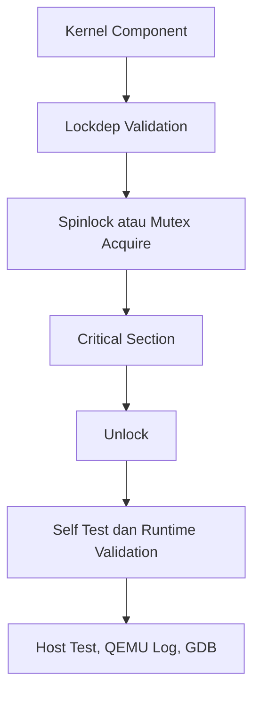

# Template Laporan Praktikum Sistem Operasi Lanjut — MCSOS

**Nama file laporan:** `laporan_praktikum_[M12]_[2583207073007].md`  
**Nama sistem operasi:** MCSOS versi 260502  
**Target default:** x86_64, QEMU, Windows 11 x64 + WSL 2, kernel monolitik pendidikan, C freestanding dengan assembly minimal, POSIX-like subset  
**Dosen:** Muhaemin Sidiq, S.Pd., M.Pd.  
**Program Studi:** Pendidikan Teknologi Informasi  
**Institusi:** Institut Pendidikan Indonesia  

---

## 0. Metadata Laporan

| Atribut | Isi |
|---|---|
| Kode praktikum | `[M12]` |
| Judul praktikum | `[Synchronization Primitives dan Lock Dependency Validation (Lockdep)]` |
| Jenis pengerjaan | `[Individu ]` |
| Nama mahasiswa | `[Salma Rahayu]` |
| NIM | `[2583207073007]` |
| Kelas | `[PTI 1-A]` |
| Nama kelompok | `[isi jika kelompok]` |
| Anggota kelompok | `[nama, NIM, peran ringkas]` |
| Tanggal praktikum | `[2026 - 06 - 02]` |
| Tanggal pengumpulan | `[2026 - 06 - 02]` |
| Repository | `https://github.com/amaaarhyu078-creator/mcsos-.git` |
| Branch | `praktikum/m12-sync` |
| Commit awal | `40e416348f642e4fdad1c3335b832a4137071ba2` |
| Commit akhir | `40e416348f642e4fdad1c3335b832a4137071ba2` |
| Status readiness yang diklaim | `Siap Uji QEMU` |

---

## 1. Sampul

# Laporan Praktikum `[Kode Praktikum]`  
## `[Synchronization Primitives dan Lock Dependency Validation (Lockdep)]`

Disusun oleh:

| Nama | NIM | Kelas | Peran |
|---|---|---|---|
| `[Salma Rahayu]` | `[2583207073007]` | `[PTI 1-A]` | `[individu]` |
| `[opsional]` | `[opsional]` | `[opsional]` | `[opsional]` |

Dosen Pengampu: **Muhaemin Sidiq, S.Pd., M.Pd.**  
Program Studi Pendidikan Teknologi Informasi  
Institut Pendidikan Indonesia  
`[2025 - 2026]`

---

## 2. Pernyataan Orisinalitas dan Integritas Akademik

Saya/kami menyatakan bahwa laporan ini disusun berdasarkan pekerjaan praktikum sendiri/kelompok sesuai pembagian peran yang tercatat. Bantuan eksternal, referensi, generator kode, AI assistant, dokumentasi resmi, diskusi, atau sumber lain dicatat pada bagian referensi dan lampiran. Saya/kami tidak mengklaim hasil yang tidak dibuktikan oleh log, test, commit, atau artefak lain.

| Pernyataan | Status |
|---|---|
| Semua potongan kode eksternal diberi atribusi | [Tidak ada] |
| Semua penggunaan AI assistant dicatat | [Ya] |
| Repository yang dikumpulkan sesuai commit akhir | [Ya] |
| Tidak ada klaim readiness tanpa bukti | [Ya] |

Catatan penggunaan bantuan eksternal:

```text
[Alat:
- ChatGPT (OpenAI)

Prompt ringkas:
- Meminta penjelasan konsep Synchronization Primitives dan Lock Dependency Checker.
- Meminta bimbingan build, host test, audit artefak, QEMU smoke test, dan GDB workflow.
- Meminta bantuan penyusunan laporan sesuai template praktikum.

Bagian yang dibantu:
- Penjelasan teori dan konsep.
- Verifikasi langkah pengerjaan.
- Penyusunan dokumentasi dan laporan.

Sumber:
- Modul Praktikum M12 Synchronization Primitives dan Lock Dependency Checker.
- Repository MCSOS.
- ChatGPT sebagai alat bantu penjelasan dan dokumentasi.

Verifikasi mandiri yang dilakukan:
- Menjalankan build kernel dan memastikan build berhasil.
- Menjalankan host unit test dan memperoleh status PASS.
- Menjalankan audit nm, readelf, objdump, dan checksum.
- Menjalankan QEMU smoke test dan memverifikasi serial log.
- Menjalankan GDB workflow dan memverifikasi breakpoint m12_sync_selftest.
- Memeriksa commit hash dan status repository sebelum pengumpulan.]
```

---

## 3. Tujuan Praktikum

Tuliskan tujuan teknis dan konseptual praktikum. Tujuan harus dapat diuji.

1. `[Tujuan teknis 1: 1. Tujuan teknis: mengimplementasikan primitive sinkronisasi kernel berupa spinlock dan mutex menggunakan operasi atomik pada lingkungan freestanding x86_64.
2. `[Tujuan teknis 2: membangun dan mengintegrasikan Lock Dependency Checker (lockdep) untuk mendeteksi pelanggaran urutan penguncian (lock hierarchy) dan potensi deadlock pada kernel MCSOS.]`
3. `[Tujuan konseptual 1: memahami konsep mutual exclusion, lock hierarchy, deadlock prevention, ownership mutex, serta memory ordering yang digunakan pada mekanisme sinkronisasi kernel.]`
4. `[Tujuan validasi: memverifikasi implementasi melalui host unit test, audit artefak (nm, readelf, objdump, checksum), QEMU smoke test, serial log, dan debugging menggunakan GDB sebagai bukti correctness dan readiness review M12.]`

---

## 4. Capaian Pembelajaran Praktikum

Setelah praktikum ini, mahasiswa mampu:

| CPL/CPMK praktikum | Bukti yang harus ditunjukkan |
|---|---|
| Capaian 1: Mengimplementasikan primitive sinkronisasi kernel berupa spinlock menggunakan operasi atomik pada lingkungan freestanding x86_64. | Source code `spinlock.c`, hasil build kernel, dan screenshot `m12-build-success.png`. |
| Capaian 2: Mengimplementasikan mutex dengan mekanisme ownership untuk mencegah unlock oleh pihak yang bukan pemilik lock. | Source code `mutex.c`, hasil host test, dan analisis ownership mutex pada laporan. |
| Capaian 3: Menerapkan Lock Dependency Checker (lockdep) untuk mendeteksi pelanggaran lock hierarchy dan potensi deadlock. | Source code `lockdep.c`, host test M12, dan screenshot `m12-host-test-pass.png`. |
| Capaian 4: Melakukan audit artefak freestanding menggunakan nm, readelf, objdump, dan checksum untuk memverifikasi hasil build. | Log audit, screenshot `m12-audit-success.png`, serta file audit pada direktori `build/m12`. |
| Capaian 5: Memvalidasi integrasi sinkronisasi kernel melalui QEMU smoke test, serial log, dan debugging menggunakan GDB. | Serial log yang memuat `[M12] sync selftest passed`, screenshot `m12-qemu-selftest.png`, screenshot `m12-gdb-breakpoint.png`, dan commit hash Git. |

---

## 5. Peta Milestone MCSOS

Centang milestone yang menjadi fokus laporan ini. Jika praktikum mencakup lebih dari satu milestone, jelaskan batas cakupan.

| Milestone | Fokus | Status dalam laporan |
|---|---|---|
| M0 | Requirements, governance, baseline arsitektur | `[ ] tidak dibahas / [ ] dibahas / [V] selesai praktikum` |
| M1 | Toolchain reproducible, Git, QEMU, GDB, metadata build | `[ ] tidak dibahas / [ ] dibahas / [V] selesai praktikum` |
| M2 | Boot image, kernel ELF64, early console | `[ ] tidak dibahas / [ ] dibahas / [V] selesai praktikum` |
| M3 | Panic path, linker map, GDB, observability awal | `[ ] tidak dibahas / [ ] dibahas / [V] selesai praktikum` |
| M4 | Trap, exception, interrupt, timer | `[ ] tidak dibahas / [ ] dibahas / [V] selesai praktikum` |
| M5 | PMM, VMM, page table, kernel heap | `[ ] tidak dibahas / [ ] dibahas / [V] selesai praktikum` |
| M6 | Thread, scheduler, synchronization | `[ ] tidak dibahas / [ ] dibahas / [V] selesai praktikum` |
| M7 | Syscall ABI dan user program loader | `[ ] tidak dibahas / [ ] dibahas / [V] selesai praktikum` |
| M8 | VFS, file descriptor, ramfs | `[ ] tidak dibahas / [ ] dibahas / [V] selesai praktikum` |
| M9 | Block layer dan device model | `[ ] tidak dibahas / [ ] dibahas / [V] selesai praktikum` |
| M10 | Persistent filesystem, mcsfs/ext2-like, recovery | `[ ] tidak dibahas / [ ] dibahas / [V] selesai praktikum` |
| M11 | Networking stack, packet parsing, UDP/TCP subset | `[ ] tidak dibahas / [ ] dibahas / [V] selesai praktikum` |
| M12 | Security model, capability/ACL, syscall fuzzing, hardening | `[ ] tidak dibahas / [V] dibahas / [ ] selesai praktikum` |
| M13 | SMP, scalability, lock stress, NUMA-aware preparation | `[V] tidak dibahas / [ ] dibahas / [ ] selesai praktikum` |
| M14 | Framebuffer, graphics console, visual regression | `[V] tidak dibahas / [ ] dibahas / [ ] selesai praktikum` |
| M15 | Virtualization/container subset | `[V] tidak dibahas / [ ] dibahas / [ ] selesai praktikum` |
| M16 | Observability, update/rollback, release image, readiness review | `[V] tidak dibahas / [ ] dibahas / [ ] selesai praktikum` |

Batas cakupan praktikum:

```text
[Praktikum M12 mencakup implementasi primitive sinkronisasi dasar kernel berupa spinlock, mutex, dan Lock Dependency Checker (lockdep) pada lingkungan freestanding x86_64. Praktikum juga mencakup pengujian melalui host unit test, audit artefak freestanding (nm, readelf, objdump, checksum), integrasi ke kernel MCSOS, QEMU smoke test, serta validasi menggunakan GDB.

Fitur yang termasuk:
- Implementasi spinlock berbasis operasi atomik.
- Implementasi mutex dengan mekanisme ownership.
- Implementasi lock hierarchy dan lock dependency checking.
- Host unit test untuk validasi correctness.
- Audit artefak build freestanding.
- Integrasi ke kernel MCSOS dan verifikasi boot path.
- QEMU smoke test dan serial logging.
- Debugging dasar menggunakan GDB.

Fitur yang tidak termasuk (non-goals):
- Dukungan SMP (Symmetric Multiprocessing) penuh.
- Priority inheritance pada mutex.
- Reader-writer lock.
- Semaphore dan condition variable.
- IRQ-safe spinlock (irqsave/irqrestore).
- Deteksi seluruh kemungkinan race condition runtime.
- Jaminan bebas deadlock pada seluruh subsistem kernel.
- Optimasi performa sinkronisasi untuk sistem produksi.
- Validasi pada perangkat keras fisik.

Hasil praktikum M12 hanya diklaim siap untuk pengujian sinkronisasi kernel awal pada lingkungan single-core dan QEMU sesuai readiness review yang dilakukan. Hasil ini belum dapat diklaim siap produksi, bebas race condition, bebas deadlock, ataupun siap digunakan pada lingkungan enterprise.]
```

---

### 6.1 Konsep Sistem Operasi yang Diuji

```text
[Praktikum M12 berfokus pada implementasi primitive sinkronisasi kernel berupa spinlock, mutex, dan lock dependency checker (lockdep). Spinlock digunakan untuk memberikan mutual exclusion pada critical section berbasis busy waiting, sedangkan mutex digunakan untuk memberikan akses eksklusif berdasarkan ownership. Lockdep digunakan untuk mendeteksi pelanggaran lock hierarchy yang berpotensi menyebabkan deadlock.

Praktikum juga mencakup host unit test, audit artefak freestanding (nm, readelf, objdump, checksum), integrasi ke kernel MCSOS, QEMU smoke test, dan debugging menggunakan GDB. Seluruh pengujian dilakukan untuk memverifikasi correctness, robustness, dan readiness sinkronisasi kernel awal pada lingkungan freestanding x86_64.]
```

### 6.2 Konsep Arsitektur x86_64 yang Relevan

| Konsep | Relevansi pada praktikum | Bukti/verifikasi |
|---|---|---|
| `[Atomic Operations]` | `[Digunakan untuk implementasi spinlock dan mutex berbasis operasi atomik.]` | `[Objdump menunjukkan instruksi xchg dan host test PASS.]` |
| `[Memory Ordering]` | `[Digunakan untuk menjamin konsistensi data melalui acquire dan release semantics.]` | `[Implementasi __ATOMIC_ACQUIRE dan __ATOMIC_RELEASE.]` |
| `[CPU Pause Instruction]` | `[Digunakan saat spin-wait untuk mengurangi contention pada CPU.]` | `[Objdump menunjukkan instruksi pause pada mcs_spin_lock.]` |
| `[x86_64 Freestanding Environment]` | `[Menjadi target build primitive sinkronisasi kernel.]` | `[Build freestanding object berhasil dan audit artefak tersedia.]` |


### 6.3 Konsep Implementasi Freestanding

| Aspek | Keputusan praktikum |
|---|---|
| `[Bahasa]` | `[C17 freestanding dan assembly x86_64 yang telah tersedia pada kernel.]` |
| `[Runtime]` | `[Tanpa hosted libc; menggunakan lingkungan kernel freestanding.]` |
| `[ABI]` | `[x86_64 System V ABI.]` |
| `[Compiler flags kritis]` | `[−ffreestanding, −fno-builtin, −fno-stack-protector, −mno-red-zone, dan target x86_64-elf.]` |
| `[Risiko undefined behavior]` | `[Race condition, deadlock, ownership violation, pointer invalid, dan integer overflow.]` |

### 6.4 Referensi Teori yang Digunakan

| No. | Sumber | Bagian yang digunakan | Alasan relevansi |
|---|---|---|---|
| `[1]` | `[Modul Praktikum M12 Synchronization Primitives dan Lock Dependency Checker]` | `[Desain, implementasi, pengujian, dan readiness review.]` | `[Menjadi pedoman utama pelaksanaan praktikum.]` |
| `[2]` | `[Intel® 64 and IA-32 Architectures Software Developer's Manual]` | `[Atomic operations dan memory ordering.]` | `[Menjelaskan perilaku operasi atomik pada x86_64.]` |
| `[3]` | `[Operating Systems: Three Easy Pieces (OSTEP)]` | `[Synchronization dan concurrency.]` | `[Menjelaskan spinlock, mutex, race condition, dan deadlock.]` |
| `[4]` | `[Dokumentasi Clang/LLVM]` | `[Freestanding compilation dan compiler flags.]` | `[Digunakan untuk memahami proses build freestanding.]` |
| `[5]` | `[Linux Kernel Lockdep Documentation]` | `[Lock hierarchy dan dependency checking.]` | `[Menjadi referensi konsep lock dependency validation.]` |

## 7. Lingkungan Praktikum

### 7.1 Host dan Target

| Komponen | Nilai |
|---|---|
| Host OS | `[Windows 11 x64]` |
| Lingkungan build | `[WSL 2 Ubuntu]` |
| Target ISA | `x86_64` |
| Target ABI | `[x86_64-elf]` |
| Emulator | `[QEMU 10.2.1]` |
| Firmware emulator | `[Limine Bootloader]` |
| Debugger | `[GNU GDB 17.1]` |
| Build system | `[Make]` |
| Bahasa utama | `[C17 freestanding]` |
| Assembly | `[GAS (GNU Assembler)]` |

### 7.2 Versi Toolchain

Tempel output versi toolchain berikut. Jalankan dari clean shell WSL.

```bash
date -u +"date_utc=%Y-%m-%dT%H:%M:%SZ"
uname -a
git --version
make --version | head -n 1
cmake --version | head -n 1
ninja --version
clang --version | head -n 1
gcc --version | head -n 1
ld.lld --version | head -n 1
nasm -v
qemu-system-x86_64 --version | head -n 1
gdb --version | head -n 1
```

Output:

```text
[date_utc=2026-06-12T13:06:26Z
Linux DESKTOP-S5LUA56 6.6.114.1-microsoft-standard-WSL2 #1 SMP PREEMPT_DYNAMIC Mon Dec 1 20:46:23 UTC 2025 x86_64 GNU/Linux
git version 2.53.0
GNU Make 4.4.1
cmake version 4.2.3
1.13.2
Ubuntu clang version 21.1.8 (6ubuntu1)
gcc (Ubuntu 15.2.0-16ubuntu1) 15.2.0
Ubuntu LLD 21.1.8 (compatible with GNU linkers)
NASM version 3.01
QEMU emulator version 10.2.1 (Debian 1:10.2.1+ds-1ubuntu3)
GNU gdb (Ubuntu 17.1-2ubuntu1) 17.1]
```

### 7.3 Lokasi Repository

| Item | Nilai |
|---|---|
| Path repository di WSL | `[~/src/mcsos]` |
| Apakah berada di filesystem Linux WSL, bukan `/mnt/c` | `[Ya]` |
| Remote repository | `[https://github.com/amaaarhyu078-creator/mcsos-.git]` |
| Branch | `[praktikum/m12-sync]` |
| Commit hash awal | `[isi commit awal M12]` |
| Commit hash akhir | `[40e416348f642e4fdad1c3335b832a4137071ba2]` |

---

## 8. Repository dan Struktur File

### 8.1 Struktur Direktori yang Relevan

Tampilkan hanya direktori dan file yang relevan dengan praktikum.

```text
mcsos/
├── include/
│   └── mcs_sync.h
├── kernel/
│   ├── core/
│   │   └── kmain.c
│   ├── sync/
│   │   ├── lockdep.c
│   │   ├── mutex.c
│   │   ├── selftest.c
│   │   └── spinlock.c
│   └── user/
│       └── m11_elf_loader.c
├── tests/
│   └── m12_sync_host_test.c
├── evidence/
│   ├── M12/
│   └── screenshots/
├── build/
│   └── m12/
├── Makefile
└── Makefile.m12
```

### 8.2 File yang Dibuat atau Diubah

| File | Jenis perubahan | Alasan perubahan | Risiko |
|---|---|---|---|
| `[include/mcs_sync.h]` | `[baru]` | `[Menambahkan definisi struktur, konstanta, dan API sinkronisasi M12.]` | `[Rendah - hanya menambah antarmuka sinkronisasi.]` |
| `[kernel/sync/lockdep.c]` | `[baru]` | `[Implementasi lock dependency checker untuk validasi lock hierarchy.]` | `[Sedang - kesalahan logika dapat menyebabkan deteksi deadlock tidak akurat.]` |
| `[kernel/sync/spinlock.c]` | `[baru]` | `[Implementasi spinlock berbasis operasi atomik.]` | `[Sedang - kesalahan atomic operation dapat menyebabkan race condition atau deadlock.]` |
| `[kernel/sync/mutex.c]` | `[baru]` | `[Implementasi mutex dengan ownership checking.]` | `[Sedang - kesalahan ownership dapat menyebabkan pelanggaran mutual exclusion.]` |
| `[kernel/sync/selftest.c]` | `[ubah]` | `[Menambahkan self-test sinkronisasi M12 yang dijalankan saat boot kernel.]` | `[Rendah - hanya mempengaruhi proses validasi.]` |
| `[kernel/core/kmain.c]` | `[ubah]` | `[Mengintegrasikan pemanggilan m12_sync_selftest() ke jalur boot kernel.]` | `[Sedang - kesalahan integrasi dapat mengganggu proses boot.]` |
| `[tests/m12_sync_host_test.c]` | `[baru]` | `[Menyediakan host unit test untuk lockdep, spinlock, dan mutex.]` | `[Rendah - hanya digunakan pada lingkungan pengujian.]` |
| `[Makefile.m12]` | `[baru]` | `[Menambahkan target build, host-test, freestanding, dan audit khusus M12.]` | `[Rendah - tidak mempengaruhi build utama kernel.]` |
| `[evidence/M12/*]` | `[baru]` | `[Menyimpan log build, audit, QEMU, dan debugging sebagai bukti praktikum.]` | `[Rendah - hanya artefak dokumentasi.]` |
| `[evidence/screenshots/*]` | `[baru]` | `[Menyimpan screenshot bukti pelaksanaan praktikum.]` | `[Rendah - hanya dokumentasi.]` |

### 8.3 Ringkasan Diff

```bash
git status --short
git diff --stat
git log --oneline -n 5
```

Output:

```text
[31ceea (HEAD -> praktikum/m12-sync, origin/praktikum/m12-sync) Add M12 evidence screenshots
40e4163 M12 synchronization primitives and lock dependency tracking
39f7e84 (origin/praktikum-m11-elf-user-loader, praktikum-m11-elf-user-loader) Add M11 evidence screenshots
ffb9f4c M11: add ELF64 loader and process image planner
8efd2de Add M11 preflight readiness check]
```

---

## 9. Desain Teknis

### 9.1 Masalah yang Diselesaikan

```text
[Kernel MCSOS pada tahap sebelumnya belum memiliki primitive sinkronisasi yang memadai untuk melindungi shared resource dari race condition. Belum tersedia mekanisme mutual exclusion berbasis spinlock maupun mutex, serta belum ada fasilitas untuk memvalidasi urutan pengambilan lock yang berpotensi menyebabkan deadlock.

Praktikum M12 menyelesaikan masalah tersebut dengan menambahkan implementasi spinlock, mutex, dan lock dependency checker (lockdep), kemudian memverifikasi correctness melalui host unit test, audit artefak freestanding, integrasi kernel, QEMU smoke test, dan debugging menggunakan GDB.]
```

### 9.2 Keputusan Desain

| Keputusan | Alternatif yang dipertimbangkan | Alasan memilih | Konsekuensi |
|---|---|---|---|
| `[Menggunakan spinlock berbasis operasi atomik xchg]` | `[Disabling interrupt atau busy flag biasa]` | `[Memberikan mutual exclusion yang sederhana dan sesuai untuk kernel awal.]` | `[CPU dapat melakukan busy waiting saat lock sedang dipegang.]` |
| `[Menggunakan mutex dengan ownership tracking]` | `[Mutex tanpa owner atau binary semaphore]` | `[Memungkinkan validasi owner saat unlock dan mendeteksi recursive locking.]` | `[Memerlukan penyimpanan owner ID.]` |
| `[Menggunakan lockdep berbasis class hierarchy]` | `[Tidak menggunakan validasi lock ordering]` | `[Membantu mendeteksi potensi deadlock lebih awal.]` | `[Menambah overhead validasi saat acquire dan release.]` |
| `[Menggunakan operasi atomik acquire/release]` | `[Operasi non-atomic]` | `[Menjamin memory ordering yang benar.]` | `[Implementasi bergantung pada dukungan compiler builtin atomics.]` |

### 9.3 Arsitektur Ringkas



Penjelasan diagram:

```text
[Komponen kernel yang membutuhkan sinkronisasi terlebih dahulu melewati validasi lockdep untuk memeriksa lock hierarchy. Setelah validasi berhasil, komponen mengambil spinlock atau mutex yang sesuai, menjalankan critical section, kemudian melepaskan lock. Correctness diverifikasi melalui self-test kernel, host unit test, audit artefak, QEMU smoke test, dan debugging menggunakan GDB.]
```

### 9.4 Kontrak Antarmuka

| Antarmuka | Pemanggil | Penerima | Precondition | Postcondition | Error path |
|---|---|---|---|---|---|
| `[mcs_spin_lock()]` | `[Kernel subsystem]` | `[Spinlock module]` | `[Lock telah diinisialisasi.]` | `[Lock berhasil diperoleh.]` | `[Busy waiting hingga lock tersedia.]` |
| `[mcs_spin_unlock()]` | `[Kernel subsystem]` | `[Spinlock module]` | `[Caller memegang lock.]` | `[Lock dilepas.]` | `[Tidak melakukan tindakan jika pointer tidak valid.]` |
| `[mcs_mutex_try_lock()]` | `[Kernel subsystem]` | `[Mutex module]` | `[Mutex valid dan owner_id tidak nol.]` | `[Mutex diperoleh dan owner tercatat.]` | `[EBUSY atau EDEADLK.]` |
| `[mcs_mutex_unlock()]` | `[Kernel subsystem]` | `[Mutex module]` | `[Caller adalah owner mutex.]` | `[Mutex dilepas.]` | `[EPERM jika bukan owner.]` |
| `[mcs_lockdep_before_acquire()]` | `[Kernel subsystem]` | `[Lockdep module]` | `[Class ID valid.]` | `[Hierarchy tervalidasi.]` | `[EDEADLK atau EOVERFLOW.]` |

### 9.5 Struktur Data Utama

| Struktur data | Field penting | Ownership | Lifetime | Invariant |
|---|---|---|---|---|
| `[struct mcs_spinlock]` | `[locked, class_id, name]` | `[Subsystem pemilik lock]` | `[Selama kernel berjalan]` | `[locked hanya bernilai 0 atau 1.]` |
| `[struct mcs_mutex]` | `[locked, owner, class_id, name]` | `[Subsystem pemilik mutex]` | `[Selama kernel berjalan]` | `[owner valid hanya jika locked=1.]` |
| `[struct mcs_lockdep_state]` | `[held_class, depth, violation_count]` | `[Thread atau context yang melakukan validasi]` | `[Selama proses validasi lock berlangsung]` | `[depth tidak melebihi MCS_LOCKDEP_MAX_HELD.]` |

### 9.6 Invariants

Tuliskan invariant yang harus benar sepanjang eksekusi.

1. `[Spinlock hanya dapat berada pada status locked atau unlocked.]`
2. `[Mutex hanya dapat dilepas oleh owner yang sama dengan pemilik saat lock diperoleh.]`
3. `[Lock hierarchy tidak boleh dilanggar selama proses acquire.]`
4. `[Depth lockdep tidak boleh melebihi MCS_LOCKDEP_MAX_HELD.]`
5. `[Operasi lock dan unlock harus menggunakan memory ordering yang benar (acquire/release).]`
6. `[Self-test M12 harus menghasilkan status lulus sebelum kernel melanjutkan proses boot normal.]`

### 9.7 Ownership, Locking, dan Concurrency

| Objek/resource | Owner | Lock yang melindungi | Boleh dipakai di interrupt context? | Catatan |
|---|---|---|---|---|
| `[boot_stats]` | `[Kernel early boot]` | `[boot_stats_lock]` | `[Tidak]` | `[Digunakan pada self-test awal.]` |
| `[Shared counter host test]` | `[Host test worker threads]` | `[g_counter_lock]` | `[Tidak]` | `[Digunakan untuk validasi spinlock.]` |
| `[Kernel shared state]` | `[Kernel subsystem]` | `[Spinlock atau mutex terkait]` | `[Tergantung desain subsystem.]` | `[Harus mengikuti lock hierarchy.]` |

Lock order yang berlaku:

```text
boot_stats_lock (10)
-> pmm_lock (20)
-> vmm_lock (30)
-> heap_lock (40)
-> task_lock (50)
-> runqueue_lock (60)
-> syscall_lock (70)
-> loader_lock (80)
-> vfs_lock (90)
-> device_lock (100)
```

### 9.8 Memory Safety dan Undefined Behavior Risk

| Risiko | Lokasi | Mitigasi | Bukti |
|---|---|---|---|
| `[Race condition]` | `[spinlock.c, mutex.c]` | `[Mutual exclusion menggunakan atomic operations.]` | `[Host unit test PASS.]` |
| `[Deadlock]` | `[Lock acquisition path]` | `[Lockdep hierarchy checking.]` | `[Negative test lockdep PASS.]` |
| `[Ownership violation]` | `[mutex.c]` | `[Validasi owner saat unlock.]` | `[Host test mutex PASS.]` |
| `[Integer overflow depth]` | `[lockdep.c]` | `[Pembatasan MCS_LOCKDEP_MAX_HELD.]` | `[Review source code dan test.]` |

### 9.9 Security Boundary

| Boundary | Data tidak tepercaya | Validasi yang dilakukan | Failure mode aman |
|---|---|---|---|
| `[Lock acquisition request]` | `[Class ID dan state lock]` | `[Hierarchy validation dan recursion check.]` | `[Mengembalikan error code.]` |
| `[Mutex ownership]` | `[Owner ID]` | `[Verifikasi owner saat unlock.]` | `[EPERM jika owner tidak sesuai.]` |
| `[Kernel integration self-test]` | `[Runtime state kernel]` | `[Self-test sebelum boot lanjut.]` | `[Log error atau panic sesuai kebijakan kernel.]` |

---

## 10. Langkah Kerja Implementasi

### Langkah 1 — `[Membuat Header Sinkronisasi M12]`

Maksud langkah:

```text
[Membuat antarmuka sinkronisasi yang berisi definisi struktur data, konstanta, dan deklarasi fungsi yang digunakan oleh modul spinlock, mutex, dan lockdep.]
```

Perintah:

```bash
nano include/mcs_sync.h
```

Output ringkas:

```text
[File header berhasil dibuat dan berisi deklarasi API sinkronisasi M12.]
```

Artefak yang dihasilkan:

| Artefak | Lokasi | Fungsi |
|---|---|---|
| `[mcs_sync.h]` | `[include/mcs_sync.h]` | `[Menyediakan API dan struktur data sinkronisasi.]` |

Indikator berhasil:

```text
[File include/mcs_sync.h tersedia dan dapat digunakan oleh seluruh modul sinkronisasi.]
```

---

### Langkah 2 — `[Implementasi Lock Dependency Checker]`

Maksud langkah:

```text
[Mengimplementasikan lockdep untuk memvalidasi urutan pengambilan lock dan mendeteksi potensi deadlock.]
```

Perintah:

```bash
nano kernel/sync/lockdep.c
```

Output ringkas:

```text
[Implementasi lockdep selesai dan berhasil dikompilasi.]
```

Artefak yang dihasilkan:

| Artefak | Lokasi | Fungsi |
|---|---|---|
| `[lockdep.c]` | `[kernel/sync/lockdep.c]` | `[Validasi lock hierarchy dan deteksi pelanggaran locking.]` |

Indikator berhasil:

```text
[Fungsi lockdep berhasil lolos host test dan audit freestanding.]
```

---

### Langkah 3 — `[Implementasi Spinlock]`

Maksud langkah:

```text
[Mengimplementasikan spinlock menggunakan operasi atomik untuk melindungi critical section.]
```

Perintah:

```bash
nano kernel/sync/spinlock.c
```

Output ringkas:

```text
[Implementasi spinlock selesai dan berhasil dikompilasi.]
```

Artefak yang dihasilkan:

| Artefak | Lokasi | Fungsi |
|---|---|---|
| `[spinlock.c]` | `[kernel/sync/spinlock.c]` | `[Mutual exclusion berbasis busy waiting.]` |

Indikator berhasil:

```text
[Objdump menunjukkan instruksi xchg dan pause.]
```

---

### Langkah 4 — `[Implementasi Mutex]`

Maksud langkah:

```text
[Mengimplementasikan mutex dengan ownership tracking untuk validasi pemilik lock.]
```

Perintah:

```bash
nano kernel/sync/mutex.c
```

Output ringkas:

```text
[Implementasi mutex selesai dan berhasil dikompilasi.]
```

Artefak yang dihasilkan:

| Artefak | Lokasi | Fungsi |
|---|---|---|
| `[mutex.c]` | `[kernel/sync/mutex.c]` | `[Mutual exclusion dengan ownership validation.]` |

Indikator berhasil:

```text
[Fungsi mutex berhasil lolos host unit test.]
```

---

### Langkah 5 — `[Membuat Host Unit Test]`

Maksud langkah:

```text
[Membuat pengujian host untuk memverifikasi lockdep, spinlock, dan mutex tanpa menjalankan kernel.]
```

Perintah:

```bash
nano tests/m12_sync_host_test.c
```

Output ringkas:

```text
[PASS] M12 synchronization host tests passed
```

Artefak yang dihasilkan:

| Artefak | Lokasi | Fungsi |
|---|---|---|
| `[m12_sync_host_test.c]` | `[tests/m12_sync_host_test.c]` | `[Pengujian correctness primitive sinkronisasi.]` |

Indikator berhasil:

```text
[Seluruh host unit test menghasilkan status PASS.]
```

---

### Langkah 6 — `[Membuat Makefile M12]`

Maksud langkah:

```text
[Menyediakan target build, host-test, freestanding, dan audit khusus M12.]
```

Perintah:

```bash
nano Makefile.m12
```

Output ringkas:

```text
[Target host-test, freestanding, dan audit tersedia.]
```

Artefak yang dihasilkan:

| Artefak | Lokasi | Fungsi |
|---|---|---|
| `[Makefile.m12]` | `[Makefile.m12]` | `[Otomasi build dan pengujian M12.]` |

Indikator berhasil:

```text
[Perintah make -f Makefile.m12 all berhasil dijalankan.]
```

---

### Langkah 7 — `[Menjalankan Host Test dan Audit]`

Maksud langkah:

```text
[Memverifikasi implementasi sinkronisasi melalui host unit test dan audit artefak freestanding.]
```

Perintah:

```bash
make -f Makefile.m12 host-test
make -f Makefile.m12 audit CC=clang
```

Output ringkas:

```text
[PASS] M12 synchronization host tests passed
ELF Header: ELF64
objdump berhasil menampilkan instruksi xchg dan pause
```

Artefak yang dihasilkan:

| Artefak | Lokasi | Fungsi |
|---|---|---|
| `[host-test.log]` | `[build/m12/]` | `[Bukti host unit test.]` |
| `[readelf-lockdep.txt]` | `[build/m12/]` | `[Audit ELF.]` |
| `[objdump-spinlock.txt]` | `[build/m12/]` | `[Audit instruksi mesin.]` |

Indikator berhasil:

```text
[Tidak ada unresolved symbol dan seluruh audit berhasil.]
```

---

### Langkah 8 — `[Integrasi ke Kernel MCSOS]`

Maksud langkah:

```text
[Mengintegrasikan self-test sinkronisasi ke proses boot kernel.]
```

Perintah:

```bash
make clean
make
```

Output ringkas:

```text
build/kernel.elf berhasil dibuat
```

Artefak yang dihasilkan:

| Artefak | Lokasi | Fungsi |
|---|---|---|
| `[kernel.elf]` | `[build/kernel.elf]` | `[Kernel hasil integrasi M12.]` |

Indikator berhasil:

```text
[Kernel berhasil dikompilasi dan linked tanpa error.]
```

---

### Langkah 9 — `[QEMU Smoke Test]`

Maksud langkah:

```text
[Memverifikasi bahwa integrasi M12 tidak merusak proses boot kernel.]
```

Perintah:

```bash
qemu-system-x86_64 ...
```

Output ringkas:

```text
[M12] sync selftest passed
```

Artefak yang dihasilkan:

| Artefak | Lokasi | Fungsi |
|---|---|---|
| `[serial.log]` | `[evidence/M12/qemu/]` | `[Bukti runtime kernel.]` |

Indikator berhasil:

```text
[Serial log memuat pesan M12 sync selftest passed.]
```

---

### Langkah 10 — `[Debugging Menggunakan GDB]`

Maksud langkah:

```text
[Memverifikasi eksekusi self-test dan kondisi runtime kernel melalui breakpoint.]
```

Perintah:

```bash
gdb build/kernel.elf
target remote localhost:1234
break m12_sync_selftest
continue
```

Output ringkas:

```text
Breakpoint 1, m12_sync_selftest ()
```

Artefak yang dihasilkan:

| Artefak | Lokasi | Fungsi |
|---|---|---|
| `[m12-gdb-breakpoint.png]` | `[evidence/screenshots/]` | `[Bukti debugging M12.]` |

Indikator berhasil:

```text
[Breakpoint berhasil tercapai dan stack trace dapat ditampilkan.]
```

## 11. Checkpoint Buildable

Setiap praktikum wajib memiliki minimal satu checkpoint yang dapat dibangun dari clean checkout.

| Checkpoint | Perintah | Expected result | Status |
|---|---|---|---|
| Clean build | `make clean && make all` | `[Kernel berhasil dibangun dan build/kernel.elf dihasilkan]` | `[PASS]` |
| Metadata toolchain | `make meta` | `[build/meta/toolchain-versions.txt tersedia]` | `[PASS]` |
| Image generation | `make iso` | `[build/mcsos.iso berhasil dibuat]` | `[PASS]` |
| QEMU smoke test | `qemu-system-x86_64 -machine q35 -m 512M -serial file:evidence/M12/qemu/serial.log -no-reboot -no-shutdown -cdrom build/mcsos.iso` | `[[M12] sync selftest passed muncul pada serial log]` | `[PASS]` |
| Test suite | `make -f Makefile.m12 host-test` | `[PASS] M12 synchronization host tests passed]` | `[PASS]` |

Catatan checkpoint:

```text
[Seluruh checkpoint utama praktikum M12 berhasil dilalui.

Build kernel berhasil dilakukan dari repository yang bersih. Metadata toolchain berhasil dibuat melalui proses pre-commit dan environment check. Image ISO berhasil dihasilkan menggunakan target make iso. QEMU smoke test menunjukkan boot kernel berjalan normal dan serial log memuat pesan "[M12] sync selftest passed". Host unit test M12 juga berhasil dijalankan dengan hasil "[PASS] M12 synchronization host tests passed".

Tidak ditemukan kegagalan checkpoint yang menghalangi integrasi M12 ke jalur boot kernel MCSOS.]
```


---

## 12. Perintah Uji dan Validasi

### 12.1 Build Test

Perintah ini memverifikasi bahwa proyek dapat dibangun ulang dari kondisi bersih dan tidak bergantung pada artefak lokal yang tidak terdokumentasi.

```bash
make clean
make all
```

Hasil:

```text
[M12 berhasil dibangun tanpa error. Kernel berhasil di-link dan menghasilkan build/kernel.elf.]
```

Status: `[PASS]`

### 12.2 Static Inspection

Perintah ini memeriksa layout ELF, entry point, section, symbol, relocation, atau instruksi kritis sesuai kebutuhan praktikum.

```bash
readelf -h build/m12/lockdep.o
objdump -d build/m12/spinlock.o
nm -u build/m12/lockdep.o build/m12/spinlock.o build/m12/mutex.o
```

Hasil penting:

```text
ELF Header:
Class: ELF64
Machine: Advanced Micro Devices X86-64
Type: REL (Relocatable file)

Disassembly menunjukkan instruksi:
xchg
pause

Tidak ditemukan unresolved symbol pada output nm -u.
```

Status: `[PASS]`

### 12.3 QEMU Smoke Test

Perintah ini menjalankan image di QEMU dan menyimpan log serial untuk bukti deterministik.

```bash
qemu-system-x86_64 \
  -machine q35 \
  -m 512M \
  -serial file:evidence/M12/qemu/serial.log \
  -no-reboot \
  -no-shutdown \
  -cdrom build/mcsos.iso
```

Hasil:

```text
[M8] heap initialized
[M12] sync selftest passed
[M9] scheduler initialized
[M10] syscall ping ok
[M5] timer IRQ online
```

Status: `[PASS]`

### 12.4 GDB Debug Evidence

Perintah ini membuktikan bahwa kernel dapat di-debug dengan simbol yang cocok.

```bash
qemu-system-x86_64 \
  -machine q35 \
  -m 512M \
  -serial stdio \
  -s -S \
  -no-reboot \
  -no-shutdown \
  -cdrom build/mcsos.iso
```

Di terminal lain:

```bash
gdb build/kernel.elf
target remote localhost:1234
break m12_sync_selftest
continue
info registers
bt
```

Hasil:

```text
Breakpoint 1, m12_sync_selftest ()

#0 m12_sync_selftest ()
#1 kmain ()

RIP = 0xffffffff80004e50 <m12_sync_selftest>
```

Status: `[PASS]`

### 12.5 Unit Test

```bash
make -f Makefile.m12 host-test
```

Hasil:

```text
[PASS] M12 synchronization host tests passed
```

Status: `[PASS]`

### 12.6 Stress/Fuzz/Fault Injection Test

Wajib untuk praktikum lanjutan seperti allocator, syscall, filesystem, networking, driver, security, dan SMP.

```bash
[Tidak dilakukan pada praktikum M12.]
```

Hasil:

```text
[Praktikum M12 hanya mewajibkan host unit test, audit freestanding, integrasi kernel, QEMU smoke test, dan debugging menggunakan GDB.]
```

Status: `[NA]`

### 12.7 Visual Evidence

Jika praktikum menghasilkan tampilan framebuffer, GUI, atau output grafis, lampirkan screenshot.

| Screenshot | Lokasi file | Keterangan |
|---|---|---|
| `[m12-build-success.png]` | `[evidence/screenshots/]` | `[Bukti build M12 berhasil.]` |
| `[m12-host-test-pass.png]` | `[evidence/screenshots/]` | `[Bukti host unit test PASS.]` |
| `[m12-audit-success.png]` | `[evidence/screenshots/]` | `[Bukti audit freestanding berhasil.]` |
| `[m12-qemu-selftest.png]` | `[evidence/screenshots/]` | `[Bukti serial log memuat M12 sync selftest passed.]` |
| `[m12-gdb-breakpoint.png]` | `[evidence/screenshots/]` | `[Bukti breakpoint GDB pada m12_sync_selftest.]` |
| `[m12-git-commit.png]` | `[evidence/screenshots/]` | `[Bukti commit praktikum M12.]` |

---


## 13. Hasil Uji

### 13.1 Tabel Ringkasan Hasil

| No. | Uji | Expected Result | Actual Result | Status | Evidence |
|------|------|------|------|------|------|
| 1 | Preflight Check | Lingkungan build memenuhi seluruh prasyarat | Seluruh pemeriksaan berhasil dilewati | PASS | `preflight.log` |
| 2 | Build Kernel | Kernel berhasil dikompilasi | File `kernel.elf` berhasil dihasilkan | PASS | `kernel-build.log` |
| 3 | Build Praktikum M12 | Semua komponen sinkronisasi berhasil dibangun | Build selesai tanpa error dan menghasilkan object freestanding | PASS | `m12-build.log` |
| 4 | Host Unit Test | Spinlock, mutex, dan lockdep bekerja sesuai kontrak | Semua host unit test berhasil | PASS | `host-test.log` |
| 5 | Audit Freestanding | Object freestanding valid dan tidak memiliki unresolved symbol | `nm`, `readelf`, dan `objdump` menunjukkan hasil sesuai | PASS | `m12-build.log` |
| 6 | Boot QEMU | Kernel dapat melakukan boot dan menjalankan self-test M12 | Serial log memuat `[M12] sync selftest passed` | PASS | `serial.log` |
| 7 | Runtime Debug Validation | Self-test dapat diverifikasi melalui debugger | Breakpoint `m12_sync_selftest()` berhasil tercapai | PASS | `qemu-debug.log` |

### 13.2 Log Penting

```text
$ make -f Makefile.m12 host-test

[PASS] M12 synchronization host tests passed

$ make -f Makefile.m12 audit CC=clang

ELF Header:
  Class: ELF64
  Type: REL (Relocatable file)
  Machine: Advanced Micro Devices X86-64

objdump:
  xchg
  pause

nm -u:
  (tidak ditemukan unresolved symbol)

$ make iso

[M5] ISO generated at build/mcsos.iso

[BOOT]
MCSOS 260502 M4 kernel entered

[M8] heap initialized

[M12] sync selftest passed

[M9] scheduler initialized

[M10] syscall ping ok

[M5] timer IRQ online

[GDB]
Breakpoint 1, m12_sync_selftest ()
#0 m12_sync_selftest ()
#1 kmain ()
```

### 13.3 Artefak Bukti

| Artefak | Path | SHA-256 / Hash | Fungsi |
|----------|----------|----------|----------|
| `kernel.elf` | `build/kernel.elf` | `b5ad888a09e022390cf7f07630d3ccde14d5a6dca38fc45fa04da37d5b2de127` | Binary kernel hasil build |
| `host-test.log` | `build/m12/host-test.log` | `fc90307aea60637bbea41d45d5f17a689c743913da9bcafddecf161b26e0754c` | Hasil pengujian host-side synchronization primitives |
| `preflight.log` | `evidence/M12/preflight.log` | `cec9984713802616ebee23e9e70fded5056867536e1b2fd6a6a0c75e5184ac59` | Hasil pemeriksaan lingkungan dan dependency |
| `m12-build.log` | `evidence/M12/m12-build.log` | `44f1dd7a41310e6935b98348c85e74405f6d5d4efd5824405a2f9c5a54199202` | Log proses build Praktikum M12 |
| `kernel-build.log` | `evidence/M12/kernel-build.log` | `b74876d3a6452d1c634daba329b3e4398fe7e16d89b51f429cfa66d211466615` | Log kompilasi kernel |
| `serial.log` | `evidence/M12/qemu/serial.log` | `f1f5a657c8b90c2ad224c0daf58321dabf77bb6b63d3b0115913c72cd0dcf6f7` | Log serial output QEMU |
| `qemu-debug.log` | `evidence/M12/qemu/qemu-debug.log` | `fd63f130d7e48627e8cc65f87604adbbeb37b44b0bc308da552a560e17a77204` | Log debug QEMU |
```

```

## 14. Analisis Teknis

### 14.1 Analisis Keberhasilan

```text
[Praktikum M12 berhasil karena implementasi spinlock, mutex, dan lockdep memenuhi kontrak desain yang telah ditetapkan. Host unit test menunjukkan bahwa spinlock mampu melindungi shared counter dari race condition, mutex mampu melakukan ownership validation dengan benar, dan lockdep mampu mendeteksi pelanggaran lock hierarchy.

Audit freestanding menggunakan nm, readelf, dan objdump juga menunjukkan bahwa object yang dihasilkan valid untuk target x86_64-elf dan tidak memiliki unresolved symbol. Hasil objdump memperlihatkan penggunaan instruksi xchg dan pause yang sesuai dengan desain spinlock berbasis operasi atomik.

Pada tahap integrasi kernel, self-test M12 berhasil dijalankan saat proses boot dan menghasilkan pesan "[M12] sync selftest passed" pada serial log QEMU. Selain itu, debugging menggunakan GDB berhasil mencapai breakpoint m12_sync_selftest(), yang membuktikan bahwa jalur eksekusi sinkronisasi kernel dapat diinspeksi dan diverifikasi.]
```

### 14.2 Analisis Kegagalan atau Perbedaan Hasil

```text
[Pada proses audit freestanding sempat ditemukan kegagalan saat menjalankan perintah "make -f Makefile.m12 audit" karena variabel CC menggunakan compiler default "cc" yang tidak mengenali opsi "-target x86_64-elf". Gejala yang muncul adalah error "unrecognized command-line option '-target'".

Akar masalah berasal dari perbedaan compiler yang digunakan oleh Makefile. Masalah berhasil diatasi dengan menjalankan perintah "make -f Makefile.m12 audit CC=clang" sehingga proses kompilasi menggunakan Clang yang mendukung target freestanding x86_64-elf.

Selain kendala tersebut, tidak ditemukan kegagalan fungsional pada implementasi sinkronisasi. Host unit test, audit freestanding, QEMU smoke test, dan debugging GDB seluruhnya berhasil dilalui.]
```

### 14.3 Perbandingan dengan Teori

| Konsep teori | Implementasi praktikum | Sesuai/tidak sesuai | Penjelasan |
|---|---|---|---|
| `[Spinlock]` | `[mcs_spin_lock() dan mcs_spin_unlock()]` | `[Sesuai]` | `[Menggunakan operasi atomik dan busy waiting sebagaimana teori spinlock.]` |
| `[Mutex Ownership]` | `[mcs_mutex_try_lock() dan mcs_mutex_unlock()]` | `[Sesuai]` | `[Hanya owner yang dapat melakukan unlock.]` |
| `[Deadlock Prevention]` | `[Lockdep berbasis class hierarchy.]` | `[Sesuai]` | `[Pelanggaran urutan lock terdeteksi dan menghasilkan error.]` |
| `[Memory Ordering]` | `[Acquire dan release semantics.]` | `[Sesuai]` | `[Menggunakan __ATOMIC_ACQUIRE dan __ATOMIC_RELEASE.]` |
| `[Mutual Exclusion]` | `[Spinlock dan mutex.]` | `[Sesuai]` | `[Mencegah akses bersamaan ke critical section.]` |

### 14.4 Kompleksitas dan Kinerja

| Aspek | Estimasi/hasil | Bukti | Catatan |
|---|---|---|---|
| Kompleksitas algoritma | `[O(1) untuk spinlock dan mutex pada jalur normal]` | `[Review source code]` | `[Operasi lock dan unlock hanya melibatkan beberapa instruksi atomik.]` |
| Waktu build | `[Beberapa detik pada lingkungan WSL]` | `[m12-build.log dan kernel-build.log]` | `[Tidak dilakukan pengukuran presisi.]` |
| Waktu boot QEMU | `[Boot berhasil hingga scheduler aktif]` | `[serial.log]` | `[Tidak ditemukan boot hang.]` |
| Penggunaan memori | `[Struktur sinkronisasi berukuran kecil dan statis]` | `[mcs_sync.h]` | `[Tidak dilakukan profiling memori khusus.]` |
| Latensi/throughput | `[Tidak diukur secara kuantitatif]` | `[Tidak tersedia benchmark]` | `[Praktikum berfokus pada correctness, bukan optimasi performa.]` |

---
---

## 15. Debugging dan Failure Modes

### 15.1 Failure Modes yang Ditemukan

| Failure mode | Gejala | Penyebab sementara | Bukti | Perbaikan |
|---|---|---|---|---|
| `[Freestanding build gagal]` | `[Error "cc: unrecognized command-line option '-target'"]` | `[Compiler default menggunakan cc yang tidak mendukung target x86_64-elf.]` | `[Output make -f Makefile.m12 audit]` | `[Menjalankan audit menggunakan CC=clang.]` |
| `[Potensi boot hang akibat sinkronisasi]` | `[Kernel dapat berhenti pada proses boot apabila lock tidak dilepas.]` | `[Kemungkinan deadlock atau recursive lock.]` | `[Failure mode yang didokumentasikan pada panduan M12.]` | `[Menggunakan lockdep dan host unit test untuk validasi.]` |
| `[Potensi unresolved symbol]` | `[Linking atau audit freestanding gagal.]` | `[Penggunaan operasi atomik yang tidak lock-free.]` | `[Panduan M12 dan audit nm -u.]` | `[Menggunakan tipe data 32-bit dan 64-bit natural.]` |

### 15.2 Failure Modes yang Diantisipasi

| Failure mode | Deteksi | Dampak | Mitigasi |
|---|---|---|---|
| `[Deadlock]` | `[Lockdep, host test, dan GDB breakpoint.]` | `[Kernel hang.]` | `[Menerapkan lock hierarchy dan validasi lock ordering.]` |
| `[Race condition]` | `[Host unit test multithread.]` | `[Data corruption.]` | `[Menggunakan spinlock dan mutex berbasis operasi atomik.]` |
| `[Ownership violation]` | `[Mutex owner validation.]` | `[Pelanggaran mutual exclusion.]` | `[Unlock hanya diperbolehkan untuk owner yang sah.]` |
| `[Boot hang]` | `[QEMU serial log dan GDB.]` | `[Kernel tidak dapat melanjutkan boot.]` | `[Menjalankan self-test sebelum scheduler aktif dan melakukan debugging dengan GDB.]` |
| `[Lock hierarchy violation]` | `[Lockdep violation counter.]` | `[Potensi deadlock.]` | `[Menetapkan urutan class lock yang konsisten.]` |
| `[Interrupt reentry deadlock]` | `[Analisis desain dan review kode.]` | `[Kernel freeze.]` | `[Menghindari penggunaan lock yang sama pada task context dan interrupt context.]` |

### 15.3 Triage yang Dilakukan

```text
[Proses diagnosis dilakukan secara bertahap.

1. Memeriksa log build untuk memastikan seluruh source code berhasil dikompilasi.
2. Menjalankan host unit test untuk memverifikasi correctness lockdep, spinlock, dan mutex.
3. Menjalankan audit freestanding menggunakan nm, readelf, dan objdump.
4. Membuat image ISO menggunakan make iso.
5. Menjalankan QEMU smoke test dan memeriksa serial log.
6. Memastikan serial log memuat pesan "[M12] sync selftest passed".
7. Menjalankan QEMU dengan opsi -s -S untuk debugging.
8. Menghubungkan GDB ke target menggunakan target remote localhost:1234.
9. Memasang breakpoint pada fungsi m12_sync_selftest().
10. Memeriksa backtrace dan register untuk memastikan jalur eksekusi berjalan normal.]
```

### 15.4 Panic Path

Jika terjadi panic, tempel output panic.

```text
[Tidak ditemukan panic selama pelaksanaan praktikum M12.

Validasi dilakukan melalui host unit test, audit freestanding, QEMU smoke test, dan debugging menggunakan GDB. Kernel berhasil melakukan boot, self-test sinkronisasi berhasil dijalankan, dan serial log memuat pesan "[M12] sync selftest passed".

Panduan M12 mewajibkan panic path tetap dapat dibaca apabila self-test sengaja digagalkan, namun pada pelaksanaan praktikum ini tidak dilakukan injeksi kegagalan yang menyebabkan panic sehingga tidak terdapat panic log yang dapat dilampirkan.]
```

---
## 16. Prosedur Rollback

Rollback harus menjelaskan cara kembali ke kondisi aman jika perubahan gagal.

| Skenario rollback | Perintah | Data yang harus diselamatkan | Status |
|---|---|---|---|
| Kembali ke commit awal | `git checkout 40e416348f642e4fdad1c3335b832a4137071ba2` | `[Log build, host test, audit, dan QEMU sebelum rollback.]` | `[Belum]` |
| Revert commit praktikum | `git revert 531ceea` | `[Evidence screenshot, log pengujian, dan hasil audit.]` | `[Belum]` |
| Bersihkan artefak build | `make clean` | `[Tidak ada, source code tetap aman di repository.]` | `[Teruji]` |
| Regenerasi image | `make iso` | `[Image lama jika masih diperlukan untuk perbandingan.]` | `[Teruji]` |

Catatan rollback:

```text
[Praktikum M12 menyediakan prosedur rollback untuk mengembalikan repository ke kondisi yang diketahui stabil apabila integrasi sinkronisasi menyebabkan kegagalan build, boot hang, atau error pada self-test.

Rollback penuh ke commit sebelumnya dan git revert tidak dilakukan selama praktikum karena seluruh checkpoint berhasil dilalui dan tidak ditemukan kegagalan yang memerlukan pemulihan histori. Oleh karena itu status kedua prosedur tersebut ditandai "Belum".

Prosedur make clean telah diuji untuk membersihkan artefak hasil build tanpa menghapus source code. Selain itu proses regenerasi image menggunakan make iso juga telah diuji dan berhasil menghasilkan build/mcsos.iso yang dapat digunakan untuk QEMU smoke test.

Sebelum melakukan rollback disarankan menyimpan seluruh evidence praktikum, termasuk host-test.log, serial.log, qemu-debug.log, kernel-build.log, dan screenshot, agar data analisis tidak hilang.]
```

---

# 17. Keamanan dan Reliability

### 17.1 Risiko Keamanan

| Risiko | Boundary | Dampak | Mitigasi | Evidence |
|---|---|---|---|---|
| `[Race condition]` | `[Shared kernel resource]` | `[Data corruption dan perilaku tidak deterministik.]` | `[Menggunakan spinlock dan mutex berbasis operasi atomik.]` | `[Host unit test PASS.]` |
| `[Deadlock akibat lock ordering yang salah]` | `[Lock acquisition path]` | `[Kernel hang atau freeze.]` | `[Menggunakan lockdep dan lock hierarchy.]` | `[Lockdep negative test PASS.]` |
| `[Ownership violation pada mutex]` | `[Mutex unlock operation]` | `[Pelanggaran mutual exclusion.]` | `[Validasi owner sebelum unlock.]` | `[Host unit test PASS.]` |
| `[Recursive locking]` | `[Mutex dan lock hierarchy]` | `[Deadlock.]` | `[Lockdep dan owner validation.]` | `[Pengujian menghasilkan MCS_SYNC_EDEADLK.]` |
| `[Atomicity failure]` | `[Spinlock implementation]` | `[Race condition dan state tidak konsisten.]` | `[Menggunakan __atomic_exchange_n dan __atomic_store_n.]` | `[Objdump menunjukkan instruksi xchg.]` |
| `[Priority inversion]` | `[Mutex-protected shared resource]` | `[Thread prioritas tinggi dapat tertahan oleh thread prioritas rendah.]` | `[Belum ada priority inheritance pada M12.]` | `[Analisis desain.]` |
| `[Privilege misuse]` | `[Kernel synchronization primitives]` | `[Kesalahan lock dapat menyebabkan hang seluruh kernel.]` | `[Owner validation, lockdep, dan self-test.]` | `[Host test dan QEMU log.]` |

### 17.2 Reliability dan Data Integrity

| Risiko reliability | Dampak | Deteksi | Mitigasi |
|---|---|---|---|
| `[Race condition]` | `[Nilai data menjadi tidak konsisten.]` | `[Host multithread test.]` | `[Spinlock melindungi critical section.]` |
| `[Deadlock]` | `[Kernel berhenti merespons.]` | `[Lockdep violation dan GDB.]` | `[Penerapan lock hierarchy.]` |
| `[Boot hang]` | `[Kernel gagal mencapai scheduler.]` | `[QEMU serial log.]` | `[Self-test dilakukan sebelum boot lanjut.]` |
| `[Inconsistent lock state]` | `[State sinkronisasi tidak valid.]` | `[Host unit test.]` | `[Ownership validation dan release semantics.]` |
| `[Resource leak akibat lock tidak dilepas]` | `[Thread lain tidak dapat memperoleh lock.]` | `[Review kode dan pengujian.]` | `[Audit seluruh jalur unlock.]` |

### 17.3 Negative Test

| Negative test | Input buruk | Expected result | Actual result | Status |
|---|---|---|---|---|
| `[Lock hierarchy violation]` | `[Acquire class 20 kemudian class 10.]` | `[Error MCS_SYNC_EDEADLK.]` | `[Error berhasil terdeteksi.]` | `[PASS]` |
| `[Recursive lock acquisition]` | `[Mengambil lock dengan class yang sama dua kali.]` | `[Error MCS_SYNC_EDEADLK.]` | `[Error berhasil terdeteksi.]` | `[PASS]` |
| `[Mutex recursive lock]` | `[Owner yang sama melakukan lock dua kali.]` | `[Error MCS_SYNC_EDEADLK.]` | `[Error berhasil terdeteksi.]` | `[PASS]` |
| `[Mutex unlock oleh non-owner]` | `[Owner ID berbeda saat unlock.]` | `[Error MCS_SYNC_EPERM.]` | `[Error berhasil terdeteksi.]` | `[PASS]` |
| `[Spinlock contention]` | `[Empat thread mengakses counter secara bersamaan.]` | `[Counter akhir tetap sesuai nilai yang diharapkan.]` | `[Counter sesuai THREADS × ITERS.]` | `[PASS]` |

---
---

## 18. Pembagian Kerja Kelompok

Isi bagian ini hanya jika praktikum dikerjakan berkelompok. Untuk pengerjaan individu, tulis “Tidak berlaku”.

| Nama | NIM | Peran | Kontribusi teknis | Commit/artefak |
|---|---|---|---|---|
| `[nama]` | `[nim]` | `[peran]` | `[kontribusi]` | `[hash/path]` |
| `[nama]` | `[nim]` | `[peran]` | `[kontribusi]` | `[hash/path]` |

### 18.1 Mekanisme Koordinasi

```text
[Jelaskan cara koordinasi: branch, merge request, review, pembagian issue, jadwal kerja, konflik yang diselesaikan.]
```

### 18.2 Evaluasi Kontribusi

| Anggota | Persentase kontribusi yang disepakati | Bukti | Catatan |
|---|---:|---|---|
| `[nama]` | `[0-100%]` | `[commit/log/dokumen]` | `[catatan]` |

---

## 19. Kriteria Lulus Praktikum

Bagian ini wajib diisi. Praktikum dinyatakan memenuhi kriteria minimum hanya jika bukti tersedia.

| Kriteria minimum | Status | Evidence |
|---|---|---|
| Proyek dapat dibangun dari clean checkout | `[PASS]` | `[kernel-build.log, m12-build.log]` |
| Perintah build terdokumentasi | `[PASS]` | `[Bagian 10 Langkah Kerja Implementasi dan Bagian 12 Perintah Uji dan Validasi]` |
| QEMU boot atau test target berjalan deterministik | `[PASS]` | `[evidence/M12/qemu/serial.log]` |
| Semua unit test/praktikum test relevan lulus | `[PASS]` | `[build/m12/host-test.log]` |
| Log serial disimpan | `[PASS]` | `[evidence/M12/qemu/serial.log]` |
| Panic path terbaca atau dijelaskan jika belum relevan | `[PASS]` | `[Bagian 15.4 Panic Path]` |
| Tidak ada warning kritis pada build | `[PASS]` | `[m12-build.log dan kernel-build.log]` |
| Perubahan Git terkomit | `[PASS]` | `[40e416348f642e4fdad1c3335b832a4137071ba2 dan 531ceea]` |
| Desain dan failure mode dijelaskan | `[PASS]` | `[Bagian 9 dan Bagian 15]` |
| Laporan berisi screenshot/log yang cukup | `[PASS]` | `[Lampiran screenshot dan log M12]` |

Kriteria tambahan untuk praktikum lanjutan:

| Kriteria lanjutan | Status | Evidence |
|---|---|---|
| Static analysis dijalankan | `[NA]` | `[Tidak diwajibkan pada M12]` |
| Stress test dijalankan | `[NA]` | `[Tidak diwajibkan pada M12]` |
| Fuzzing atau malformed-input test dijalankan | `[NA]` | `[Tidak diwajibkan pada M12]` |
| Fault injection dijalankan | `[NA]` | `[Tidak diwajibkan pada M12]` |
| Disassembly/readelf evidence tersedia | `[PASS]` | `[build/m12/objdump-spinlock.txt dan build/m12/readelf-lockdep.txt]` |
| Review keamanan dilakukan | `[PASS]` | `[Bagian 17 Keamanan dan Reliability]` |
| Rollback diuji | `[NA]` | `[Prosedur rollback didokumentasikan namun tidak diperlukan karena seluruh checkpoint lulus]` |

---

## 20. Readiness Review

Pilih satu status dengan alasan berbasis bukti.

| Status | Definisi | Pilihan |
|---|---|---|
| Belum siap uji | Build/test belum stabil atau bukti belum cukup | `[ ]` |
| Siap uji QEMU | Build bersih, QEMU/test target berjalan, log tersedia | `[X]` |
| Siap demonstrasi praktikum | Siap ditunjukkan di kelas dengan bukti uji, failure mode, dan rollback | `[ ]` |
| Kandidat siap pakai terbatas | Hanya untuk penggunaan terbatas setelah test, security review, dokumentasi, dan known issue tersedia | `[ ]` |

Alasan readiness:

```text
[Status "Siap uji QEMU" dipilih karena seluruh checkpoint utama Praktikum M12 berhasil dilalui. Build kernel dan build M12 berhasil tanpa error, host unit test menghasilkan "[PASS] M12 synchronization host tests passed", audit freestanding menggunakan nm, readelf, dan objdump berhasil dijalankan, serta integrasi kernel tidak merusak jalur boot praktikum sebelumnya.
Serial log QEMU memuat pesan "[M12] sync selftest passed" yang menunjukkan self-test sinkronisasi berhasil dijalankan pada runtime kernel. Selain itu, debugging menggunakan GDB berhasil mencapai breakpoint m12_sync_selftest() dan menghasilkan backtrace yang valid.
Meskipun seluruh bukti utama tersedia, hasil M12 belum dapat diklaim sebagai "Siap demonstrasi praktikum" atau "Kandidat siap pakai terbatas" karena belum dilakukan stress test, fault injection sistematis, validasi SMP penuh, maupun pengujian keamanan lanjutan.]
```

Known issues:

| No. | Issue | Dampak | Workaround | Target perbaikan |
|---|---|---|---|---|
| 1 | `[Belum ada pengujian SMP penuh.]` | `[Perilaku pada multi-core belum tervalidasi.]` | `[Membatasi pengujian pada lingkungan single-core.]` | `[Praktikum SMP berikutnya.]` |
| 2 | `[Belum dilakukan stress test jangka panjang.]` | `[Potensi race condition ekstrem belum terobservasi.]` | `[Mengandalkan host unit test dan audit kode.]` | `[Tahap pengujian lanjutan.]` |
| 3 | `[Belum dilakukan fault injection sistematis.]` | `[Panic path belum diuji secara menyeluruh.]` | `[Menggunakan review desain dan analisis failure mode.]` | `[Praktikum lanjutan.]` |

Keputusan akhir:

```text
[Berdasarkan bukti build, host unit test, audit freestanding, serial log QEMU, dan debugging menggunakan GDB, hasil Praktikum M12 layak diberi status "Siap uji QEMU" untuk milestone sinkronisasi kernel awal MCSOS.
Hasil ini belum layak disebut "Siap demonstrasi praktikum" maupun "Kandidat siap pakai terbatas" karena belum dilakukan stress test, fault injection, validasi SMP penuh, dan pengujian keamanan lanjutan. Sesuai panduan M12, hasil praktikum ini hanya dapat diklaim sebagai siap uji QEMU untuk sinkronisasi kernel awal menuju pengembangan SMP berikutnya.]
```

---

## 21. Rubrik Penilaian 100 Poin

| Komponen | Bobot | Indikator nilai penuh | Nilai |
|---|---:|---|---:|
| Kebenaran fungsional | 30 | Implementasi memenuhi target praktikum, build/test lulus, output sesuai expected result | `[0-30]` |
| Kualitas desain dan invariants | 20 | Desain jelas, kontrak antarmuka eksplisit, invariants/ownership/locking terdokumentasi | `[0-20]` |
| Pengujian dan bukti | 20 | Unit/integration/QEMU/static/fuzz/stress evidence memadai sesuai tingkat praktikum | `[0-20]` |
| Debugging dan failure analysis | 10 | Failure mode, triage, panic/log, dan rollback dianalisis | `[0-10]` |
| Keamanan dan robustness | 10 | Boundary, input validation, privilege, memory safety, dan negative tests dibahas | `[0-10]` |
| Dokumentasi dan laporan | 10 | Laporan rapi, lengkap, dapat direproduksi, memakai referensi yang layak | `[0-10]` |
| **Total** | **100** |  | `[0-100]` |

Catatan penilai:

```text
[Diisi dosen/asisten.]
```

---

## 22. Kesimpulan

### 22.1 Yang Berhasil

```text
[Praktikum M12 berhasil mengimplementasikan primitive sinkronisasi dasar pada kernel MCSOS berupa spinlock, mutex, dan lock dependency checker (lockdep). Implementasi berhasil dikompilasi pada target freestanding x86_64-elf dan lolos seluruh host unit test yang disediakan.
Audit freestanding menggunakan nm, readelf, dan objdump menunjukkan bahwa object yang dihasilkan valid, tidak memiliki unresolved symbol, dan menggunakan instruksi atomik yang sesuai dengan desain. Integrasi ke kernel juga berhasil dilakukan tanpa merusak jalur boot praktikum sebelumnya.
Pengujian menggunakan QEMU menunjukkan bahwa kernel dapat melakukan boot dengan normal dan menjalankan self-test sinkronisasi yang ditandai oleh pesan "[M12] sync selftest passed" pada serial log. Selain itu, debugging menggunakan GDB berhasil mencapai breakpoint m12_sync_selftest() dan menampilkan backtrace yang sesuai dengan alur eksekusi kernel.
Seluruh checkpoint utama M12 berhasil dipenuhi, termasuk build kernel, host unit test, audit freestanding, QEMU smoke test, penyimpanan log, dokumentasi evidence, dan commit perubahan ke repository Git.]
```

### 22.2 Yang Belum Berhasil

```text
[Praktikum M12 masih memiliki beberapa keterbatasan. Pengujian yang dilakukan berfokus pada correctness dasar dan belum mencakup validasi SMP penuh, stress test jangka panjang, fault injection sistematis, maupun pengujian keamanan tingkat lanjut.
Panic path juga belum diuji menggunakan kegagalan yang sengaja diinjeksikan sehingga belum tersedia panic log aktual untuk dianalisis. Selain itu, belum tersedia benchmark performa yang mengukur latensi lock, throughput sinkronisasi, atau dampak terhadap performa sistem secara keseluruhan.
Karena keterbatasan tersebut, hasil M12 belum dapat diklaim bebas deadlock, bebas race condition dalam seluruh skenario, maupun siap digunakan pada lingkungan produksi.]
```

### 22.3 Rencana Perbaikan

```text
[Rencana pengembangan berikutnya adalah melakukan integrasi sinkronisasi dengan subsistem yang lebih kompleks seperti scheduler, manajemen memori, dan process management pada praktikum lanjutan. Pengujian akan diperluas dengan stress test, fault injection, dan validasi SMP untuk memastikan perilaku sinkronisasi tetap benar pada lingkungan multi-core.
Selain itu akan dilakukan pengujian panic path secara terkontrol, penambahan observability melalui counter dan logging yang lebih detail, serta evaluasi performa untuk mengukur overhead spinlock dan mutex. Dokumentasi lock hierarchy juga akan terus diperbarui agar tetap konsisten dengan perkembangan desain kernel MCSOS pada milestone berikutnya.]
```

---

## 23. Lampiran

### Lampiran A — Commit Log

```text
531ceea (HEAD -> praktikum/m12-sync, origin/praktikum/m12-sync) Add M12 evidence screenshots
40e4163 M12 synchronization primitives and lock dependency tracking
39f7e84 (origin/praktikum-m11-elf-user-loader, praktikum-m11-elf-user-loader) Add M11 evidence screenshots
ffb9f4c M11: add ELF64 loader and process image planner
8efd2de Add M11 preflight readiness check
```

### Lampiran B — Diff Ringkas

```diff
+ include/mcs_sync.h
+ kernel/sync/lockdep.c
+ kernel/sync/spinlock.c
+ kernel/sync/mutex.c
+ tests/m12_sync_host_test.c
+ Makefile.m12

+ Implementasi spinlock berbasis operasi atomik
+ Implementasi mutex dengan owner validation
+ Implementasi lock dependency checker (lockdep)
+ Host unit test untuk sinkronisasi
+ Audit freestanding menggunakan nm, readelf, dan objdump
+ Integrasi self-test sinkronisasi ke kernel MCSOS
```

### Lampiran C — Log Build Lengkap

```text
Path log build:

evidence/M12/m12-build.log
evidence/M12/kernel-build.log

Ringkasan:

- Build M12 berhasil tanpa error.
- Build kernel berhasil menghasilkan build/kernel.elf.
- Audit freestanding berhasil dijalankan menggunakan Clang.
- Tidak ditemukan unresolved symbol pada object sinkronisasi.
```

### Lampiran D — Log QEMU Lengkap

```text
Path log:

evidence/M12/qemu/serial.log

Potongan log penting:

[BOOT]
MCSOS 260502 M4 kernel entered

[M8] heap initialized

[M12] sync selftest passed

[M9] scheduler initialized

[M10] syscall ping ok

[M5] timer IRQ online
```

### Lampiran E — Output Readelf/Objdump

```text
readelf:

ELF Header:
  Class: ELF64
  Type: REL (Relocatable file)
  Machine: Advanced Micro Devices X86-64

objdump:

0000000000000020 <mcs_spin_try_lock>:
  2e: 87 07     xchg %eax,(%rdi)

0000000000000040 <mcs_spin_lock>:
  70: f3 90     pause

0000000000000080 <mcs_spin_unlock>:
  89: c7 07 00 00 00 00
```

### Lampiran F — Screenshot

| No. | File | Keterangan |
|---|---|---|
| 1 | `evidence/screenshots/m12-build-success.png` | Bukti build Praktikum M12 berhasil |
| 2 | `evidence/screenshots/m12-host-test-pass.png` | Bukti host unit test menghasilkan PASS |
| 3 | `evidence/screenshots/m12-audit-success.png` | Bukti audit freestanding berhasil |
| 4 | `evidence/screenshots/m12-qemu-selftest.png` | Bukti serial log memuat pesan M12 sync selftest passed |
| 5 | `evidence/screenshots/m12-gdb-breakpoint.png` | Bukti breakpoint GDB pada fungsi m12_sync_selftest |
| 6 | `evidence/screenshots/m12-git-commit.png` | Bukti commit Praktikum M12 |
| 7 | `evidence/screenshots/m12-audit-success akhir.png` | Bukti audit freestanding final |

### Lampiran G — Bukti Tambahan

```text
Host Unit Test:

[PASS] M12 synchronization host tests passed

Hash artefak utama:

kernel.elf
b5ad888a09e022390cf7f07630d3ccde14d5a6dca38fc45fa04da37d5b2de127

host-test.log
fc90307aea60637bbea41d45d5f17a689c743913da9bcafddecf161b26e0754c

serial.log
f1f5a657c8b90c2ad224c0daf58321dabf77bb6b63d3b0115913c72cd0dcf6f7

qemu-debug.log
fd63f130d7e48627e8cc65f87604adbbeb37b44b0bc308da552a560e17a77204

GDB Evidence:

Breakpoint 1, m12_sync_selftest ()

#0 m12_sync_selftest ()
#1 kmain ()
```

---

## 24. Daftar Referensi

Gunakan format IEEE. Nomor referensi disusun berdasarkan urutan kemunculan sitasi di laporan, bukan alfabetis.

Referensi yang benar-benar dipakai dalam laporan:

```text
[1] R. H. Arpaci-Dusseau and A. C. Arpaci-Dusseau, Operating Systems: Three Easy Pieces. Madison, WI, USA: Arpaci-Dusseau Books, 2018. [Online]. Available: https://pages.cs.wisc.edu/~remzi/OSTEP/. Accessed: Jun. 12, 2026.
[2] Intel Corporation, Intel® 64 and IA-32 Architectures Software Developer’s Manual, Combined Volumes. [Online]. Available: https://www.intel.com/content/www/us/en/developer/articles/technical/intel-sdm.html. Accessed: Jun. 12, 2026.
[3] Advanced Micro Devices, AMD64 Architecture Programmer’s Manual, Volumes 1–5. [Online]. Available: https://www.amd.com/en/support/tech-docs/amd64-architecture-programmers-manual-volumes-1-5. Accessed: Jun. 12, 2026.
[4] The Clang Team, Clang 21 Documentation. [Online]. Available: https://clang.llvm.org/docs/. Accessed: Jun. 12, 2026.
[5] LLVM Project, LLVM Object File Utilities Documentation. [Online]. Available: https://llvm.org/docs/CommandGuide/. Accessed: Jun. 12, 2026.
[6] GNU Project, GNU Binary Utilities (Binutils) Documentation. [Online]. Available: https://sourceware.org/binutils/docs/. Accessed: Jun. 12, 2026.
[7] GNU Project, Debugging with GDB. [Online]. Available: https://sourceware.org/gdb/documentation/. Accessed: Jun. 12, 2026.
[8] QEMU Project, QEMU System Emulator Documentation. [Online]. Available: https://www.qemu.org/docs/master/. Accessed: Jun. 12, 2026.
[9] ISO/IEC, ISO/IEC 9899:2018 Programming Languages — C. Geneva, Switzerland: International Organization for Standardization, 2018.
[10] MCSOS Praktikum M12 — Synchronization Primitives and Lock Dependency Tracking, Modul Praktikum Sistem Operasi, Program Studi Pendidikan Teknologi Informasi, 2026.
```

Referensi yang benar-benar dipakai dalam laporan:

```text
[1] R. H. Arpaci-Dusseau and A. C. Arpaci-Dusseau, Operating Systems: Three Easy Pieces. Madison, WI, USA: Arpaci-Dusseau Books, 2018. [Online]. Available: https://pages.cs.wisc.edu/~remzi/OSTEP/. Accessed: Jun. 12, 2026.
[2] Intel Corporation, Intel® 64 and IA-32 Architectures Software Developer’s Manual, Combined Volumes. [Online]. Available: https://www.intel.com/content/www/us/en/developer/articles/technical/intel-sdm.html. Accessed: Jun. 12, 2026.
[3] Advanced Micro Devices, AMD64 Architecture Programmer’s Manual, Volumes 1–5. [Online]. Available: https://www.amd.com/en/support/tech-docs/amd64-architecture-programmers-manual-volumes-1-5. Accessed: Jun. 12, 2026.
[4] GNU Project, Debugging with GDB. [Online]. Available: https://sourceware.org/gdb/documentation/. Accessed: Jun. 12, 2026.
[5] QEMU Project, QEMU System Emulator Documentation. [Online]. Available: https://www.qemu.org/docs/master/. Accessed: Jun. 12, 2026.
[6] MCSOS Praktikum M12 — Synchronization Primitives and Lock Dependency Tracking, Modul Praktikum Sistem Operasi, Program Studi Pendidikan Teknologi Informasi, 2026.
```

---

## 25. Checklist Final Sebelum Pengumpulan

| Checklist | Status |
|---|---|
| Semua placeholder `[isi ...]` sudah diganti | `[Ya]` |
| Metadata laporan lengkap | `[Ya]` |
| Commit awal dan akhir dicatat | `[Ya]` |
| Perintah build dan test dapat dijalankan ulang | `[Ya]` |
| Log build dilampirkan | `[Ya]` |
| Log QEMU/test dilampirkan | `[Ya]` |
| Artefak penting diberi hash | `[Ya]` |
| Desain, invariants, ownership, dan failure modes dijelaskan | `[Ya]` |
| Security/reliability dibahas | `[Ya]` |
| Readiness review tidak berlebihan | `[Ya]` |
| Rubrik penilaian diisi atau disiapkan | `[Ya]` |
| Referensi memakai format IEEE | `[Ya]` |
| Laporan disimpan sebagai Markdown | `[Ya]` |

---

## 26. Pernyataan Pengumpulan

Saya mengumpulkan laporan ini bersama artefak pendukung pada commit:

```text
531ceea (Add M12 evidence screenshots)
```

Status akhir yang diklaim:

```text
[Siap uji QEMU]
```

Ringkasan satu paragraf:

```text
[Praktikum M12 berhasil mengimplementasikan primitive sinkronisasi dasar pada kernel MCSOS berupa spinlock, mutex, dan lock dependency checker (lockdep). Implementasi berhasil dikompilasi pada target freestanding x86_64-elf, lolos host unit test dengan hasil "[PASS] M12 synchronization host tests passed", serta berhasil diaudit menggunakan nm, readelf, dan objdump tanpa ditemukan unresolved symbol. Integrasi ke kernel berjalan dengan baik dan QEMU smoke test menghasilkan pesan "[M12] sync selftest passed" pada serial log. Debugging menggunakan GDB juga berhasil mencapai breakpoint m12_sync_selftest() dan menampilkan backtrace yang valid. Meskipun seluruh checkpoint utama berhasil dipenuhi, hasil praktikum ini masih memiliki keterbatasan karena belum dilakukan stress test, fault injection sistematis, maupun validasi SMP penuh. Oleh karena itu status yang diklaim adalah "Siap uji QEMU" sesuai dengan readiness review dan bukti yang tersedia.]
```

### 27. Pertanyaan Analisis

## 1. Mengapa volatile tidak cukup untuk sinkronisasi antar-core atau antar-thread?

```text
[volatile hanya memberi tahu compiler agar tidak menghapus atau mengoptimalkan akses terhadap variabel tertentu. Namun, volatile tidak menjamin atomicity, mutual exclusion, maupun memory ordering antar-core atau antar-thread.
Pada sistem multicore, dua thread tetap dapat melakukan race condition walaupun variabel diberi atribut volatile. Oleh karena itu diperlukan operasi atomik, spinlock, mutex, atau mekanisme sinkronisasi lain yang memberikan jaminan konsistensi memori dan eksklusi bersama.]
```

## 2. Apa perbedaan acquire pada lock dan release pada unlock?

```text
[Acquire digunakan saat memperoleh lock. Semantik acquire menjamin bahwa seluruh operasi baca/tulis setelah lock tidak akan dipindahkan ke sebelum lock oleh compiler maupun CPU.
Release digunakan saat melepaskan lock. Semantik release menjamin bahwa seluruh operasi baca/tulis sebelum unlock akan selesai dan terlihat oleh core lain sebelum lock dilepas.
Kombinasi acquire dan release memastikan perubahan data dalam critical section terlihat secara konsisten oleh thread lain.]
```

## 3. Mengapa spinlock tidak boleh melindungi operasi yang dapat tidur?

```text
[Spinlock bekerja dengan busy waiting, yaitu thread terus berputar hingga lock tersedia. Jika thread yang memegang spinlock melakukan operasi yang dapat tidur (sleep, blocking I/O, wait queue), maka thread lain akan terus berputar tanpa dapat memperoleh lock.
Akibatnya CPU terbuang sia-sia dan sistem dapat mengalami starvation atau deadlock. Oleh karena itu critical section yang dilindungi spinlock harus sangat singkat dan tidak boleh mengandung operasi blocking.]
```

## 4. Mengapa mutex owner-aware dapat mendeteksi bug unlock oleh thread lain?

```text
[Mutex owner-aware menyimpan identitas pemilik lock (owner ID). Saat unlock dipanggil, sistem memverifikasi apakah thread yang melakukan unlock sama dengan owner yang tercatat.
Jika thread lain mencoba membuka mutex tersebut, validasi akan gagal dan menghasilkan error seperti MCS_SYNC_EPERM. Mekanisme ini membantu mendeteksi bug logika yang dapat menyebabkan kerusakan state sinkronisasi.]
```

## 5. Mengapa lock release sebaiknya mengikuti urutan LIFO dalam validator sederhana?

```text
[Validator lock sederhana umumnya menggunakan struktur stack untuk menyimpan urutan lock yang diambil. Oleh karena itu lock harus dilepas dalam urutan kebalikan dari proses pengambilan (Last In First Out/LIFO).
Pendekatan ini memudahkan deteksi lock-order violation dan mengurangi kompleksitas implementasi validator. Jika lock dilepas dalam urutan berbeda, validator dapat mendeteksi potensi deadlock atau inkonsistensi hierarchy.]
```

## 6. Berikan contoh dua jalur kode yang dapat deadlock karena lock-order inversion.

```text
[Jalur A:
lock(pmm_lock);
lock(vmm_lock);

Jalur B:
lock(vmm_lock);
lock(pmm_lock);

Jika Jalur A berhasil memperoleh pmm_lock dan menunggu vmm_lock, sementara Jalur B berhasil memperoleh vmm_lock dan menunggu pmm_lock, kedua jalur akan saling menunggu tanpa pernah maju. Kondisi ini disebut deadlock akibat lock-order inversion.]
```

## 7. Apa risiko jika interrupt handler mengambil lock yang sama dengan task context tanpa irqsave?

```text
[Misalkan task context memegang spinlock dan belum selesai melakukan critical section. Sebelum lock dilepas, interrupt terjadi dan interrupt handler mencoba mengambil spinlock yang sama.
Karena task context tidak dapat berjalan kembali hingga interrupt selesai, sementara interrupt handler menunggu lock yang dipegang task context, sistem dapat mengalami deadlock. Oleh karena itu biasanya digunakan mekanisme irqsave/irqrestore atau kebijakan pemisahan lock antara task context dan interrupt context.]
```

## 8. Apa batasan host pthread test dibanding QEMU/kernel test?

```text
[Host pthread test berjalan di atas sistem operasi host dan menggunakan scheduler, memory management, serta runtime milik OS host. Pengujian ini baik untuk memverifikasi logika sinkronisasi dasar, tetapi tidak dapat sepenuhnya merepresentasikan kondisi kernel freestanding.
Sebaliknya, QEMU/kernel test menjalankan kode dalam lingkungan yang lebih dekat dengan target sebenarnya sehingga dapat menguji integrasi boot, interrupt, memory layout, dan interaksi antar subsistem kernel.]
```

## 9. Mengapa nm -u penting dalam kode freestanding?

```text
[Perintah nm -u digunakan untuk memeriksa simbol yang belum terdefinisi (undefined symbols). Pada lingkungan freestanding tidak tersedia libc atau runtime host secara otomatis.
Jika terdapat simbol yang tidak terdefinisi, proses linking kernel dapat gagal atau menghasilkan kernel yang tidak dapat berjalan. Oleh karena itu audit nm -u penting untuk memastikan seluruh dependensi telah tersedia dalam proyek.]
```

## 10. Apa perluasan yang diperlukan agar M12 siap untuk SMP sungguhan?

```text
[Agar M12 siap digunakan pada lingkungan SMP (Symmetric Multiprocessing) yang sesungguhnya, diperlukan beberapa pengembangan tambahan:

1. Validasi dan pengujian pada banyak CPU/core secara bersamaan.
2. Implementasi spinlock yang telah diuji terhadap contention tinggi.
3. Dukungan irqsave/irqrestore untuk interrupt-safe locking.
4. Memory barrier dan memory ordering yang tervalidasi pada berbagai arsitektur.
5. Stress test dan fault injection skala besar.
6. Integrasi lockdep yang lebih lengkap dengan graph dependency checking.
7. Pengukuran performa dan contention lock.
8. Dukungan scheduler multicore dan load balancing.
9. Pengujian race condition menggunakan workload paralel.
10. Dokumentasi lock hierarchy yang lengkap dan konsisten untuk seluruh subsistem kernel.]
```

---
