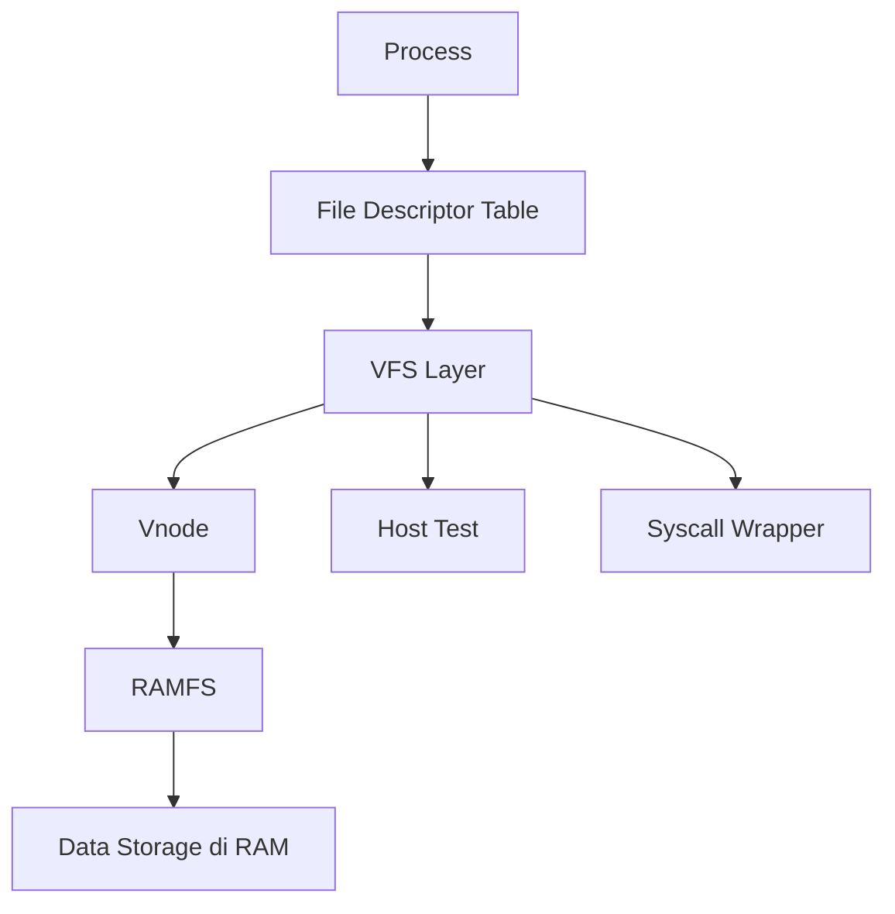

# Template Laporan Praktikum Sistem Operasi Lanjut — MCSOS

**Nama file laporan:** `laporan_praktikum_[M13]_[2583207073007].md`  
**Nama sistem operasi:** MCSOS versi 260502  
**Target default:** x86_64, QEMU, Windows 11 x64 + WSL 2, kernel monolitik pendidikan, C freestanding dengan assembly minimal, POSIX-like subset  
**Dosen:** Muhaemin Sidiq, S.Pd., M.Pd.  
**Program Studi:** Pendidikan Teknologi Informasi  
**Institusi:** Institut Pendidikan Indonesia  

> Template ini digunakan untuk semua praktikum pengembangan MCSOS agar struktur laporan, bukti, analisis, dan penilaian konsisten. Ganti seluruh teks bertanda `[isi ...]` dengan data praktikum sebenarnya. Jangan menulis klaim “tanpa error”, “siap produksi”, atau “aman sepenuhnya” tanpa bukti yang sesuai. Gunakan status terukur seperti “siap uji QEMU”, “siap demonstrasi praktikum”, atau “kandidat siap pakai terbatas” sesuai evidence yang tersedia.

---

## 0. Metadata Laporan

| Atribut | Isi |
|---|---|
| Kode praktikum | `[M13]` |
| Judul praktikum | `[Virtual File System (VFS), RAMFS, dan File Descriptor Table]` |
| Jenis pengerjaan | `[Individu]` |
| Nama mahasiswa | `[Salma Rahayu]` |
| NIM | `[2583207073007]` |
| Kelas | `[kelaPTI 1-A]` |
| Nama kelompok | `[isi jika kelompok]` |
| Anggota kelompok | `[nama, NIM, peran ringkas]` |
| Tanggal praktikum | `[2026-06-13]` |
| Tanggal pengumpulan | `[YYYY-MM-DD]` |
| Atribut | Isi |
|---|---|
| Repository | `https://github.com/amaaarhyu078-creator/mcsos-` |
| Branch | `praktikum-m13-vfs-ramfs` |
| Commit awal | `75f9af3` |
| Commit akhir | `117c965` |
| Status readiness yang diklaim | `Siap Uji QEMU` |

---

## 1. Sampul

# Laporan Praktikum `[Kode Praktikum]`  
## `[Virtual File System (VFS), RAMFS, dan File Descriptor Table]`

Disusun oleh:

| Nama | NIM | Kelas | Peran |
|---|---|---|---|
| `[Salma Rahayu]` | `[2583207073007]` | `[PTI 1-A]` | `[individu]` |
| `[opsional]` | `[opsional]` | `[opsional]` | `[opsional]` |

Dosen Pengampu: **Muhaemin Sidiq, S.Pd., M.Pd.**  
Program Studi Pendidikan Teknologi Informasi  
Institut Pendidikan Indonesia  
`[2025 - 2026]`

---

## 2. Pernyataan Orisinalitas dan Integritas Akademik

Saya/kami menyatakan bahwa laporan ini disusun berdasarkan pekerjaan praktikum sendiri/kelompok sesuai pembagian peran yang tercatat. Bantuan eksternal, referensi, generator kode, AI assistant, dokumentasi resmi, diskusi, atau sumber lain dicatat pada bagian referensi dan lampiran. Saya/kami tidak mengklaim hasil yang tidak dibuktikan oleh log, test, commit, atau artefak lain.

| Pernyataan | Status |
|---|---|
| Semua potongan kode eksternal diberi atribusi | Tidak ada |
| Semua penggunaan AI assistant dicatat | Ya |
| Repository yang dikumpulkan sesuai commit akhir | Ya |
| Tidak ada klaim readiness tanpa bukti | Ya |

Catatan penggunaan bantuan eksternal:

```text
[Alat:
- ChatGPT (AI Assistant)
- Dokumentasi Git
- Dokumentasi Clang/LLVM
- Dokumentasi GNU Binutils (nm, readelf, objdump)
- Dokumentasi QEMU
- Dokumentasi GDB

Bentuk bantuan:
- Penjelasan konsep VFS, RAMFS, dan File Descriptor Table.
- Pendampingan implementasi checkpoint M13.
- Verifikasi hasil build, audit artefak, dan pengujian.
- Penyusunan dokumentasi dan laporan praktikum.

Bagian yang dibantu:
- Analisis desain VFS dan RAMFS.
- Pemeriksaan hasil host test.
- Pemeriksaan hasil audit nm, readelf, objdump, dan checksum.
- Penyusunan laporan praktikum sesuai template.

Verifikasi mandiri:
- Seluruh source code diketik, disimpan, dibangun, dan diuji secara mandiri pada lingkungan WSL2.
- Host test dijalankan dan menghasilkan status PASS.
- Audit freestanding object diverifikasi menggunakan nm, readelf, dan objdump.
- Build kernel, pembuatan ISO, QEMU smoke test, dan debugging GDB dijalankan secara mandiri.
- Commit Git, screenshot evidence, dan push GitHub diverifikasi langsung pada repository praktikum.
```

---

## 3. Tujuan Praktikum

Tuliskan tujuan teknis dan konseptual praktikum. Tujuan harus dapat diuji.

1. `[Tujuan teknis 1: [Tujuan teknis 1: Mengimplementasikan Virtual File System (VFS) minimal yang menyediakan operasi open, read, write, lseek, close, dan dup pada lingkungan kernel freestanding.]
2. `[Tujuan teknis 2: Mengimplementasikan RAMFS statik sebagai filesystem volatil berbasis memori yang mendukung pembuatan file, lookup path absolut, pembacaan, dan penulisan data.]`
3. `[Tujuan konseptual 1: Memahami konsep object ownership, file descriptor table, vnode, open file object, serta hubungan antara process, descriptor, dan filesystem pada sistem operasi.]`
4. `[Tujuan validasi: Memvalidasi implementasi melalui host unit test, audit freestanding object menggunakan nm, readelf, dan objdump, penyimpanan checksum artefak, serta pengujian build dan QEMU smoke test sebagai bukti keberhasilan praktikum.]`

---

## 4. Capaian Pembelajaran Praktikum

Setelah praktikum ini, mahasiswa mampu:

| CPL/CPMK praktikum | Bukti yang harus ditunjukkan |
|---|---|
| `[Mengimplementasikan Virtual File System (VFS), RAMFS, dan File Descriptor Table sederhana pada lingkungan kernel freestanding.]` | `[Source code include/mcs_vfs.h, kernel/vfs/ramfs.c, kernel/vfs/fd.c, kernel/vfs/sys_vfs.c, commit Git, dan hasil build berhasil.]` |
| `[Melakukan pengujian dan validasi operasi filesystem meliputi open, read, write, lseek, close, create file, serta pengelolaan file descriptor.]` | `[Host test PASS, host-test.log, screenshot m13-host-test-pass.png, screenshot m13-build-success.png, dan hasil pengujian fungsi VFS.]` |
| `[Melakukan audit artefak build, verifikasi object freestanding, serta pengujian integrasi kernel menggunakan QEMU dan GDB.]` | `[nm-undefined.txt kosong, readelf-vfs.txt menunjukkan ELF64 relocatable object, objdump-vfs.txt tersedia, sha256sums.txt tersimpan, screenshot audit, screenshot QEMU smoke test, screenshot GDB breakpoint, dan analisis hasil pengujian.]` |

---

## 5. Peta Milestone MCSOS

Centang milestone yang menjadi fokus laporan ini. Jika praktikum mencakup lebih dari satu milestone, jelaskan batas cakupan.

| Milestone | Fokus | Status dalam laporan |
|---|---|---|
| M0 | Requirements, governance, baseline arsitektur | `[ ] tidak dibahas / [ ] dibahas / [V] selesai praktikum` |
| M1 | Toolchain reproducible, Git, QEMU, GDB, metadata build | `[ ] tidak dibahas / [ ] dibahas / [V] selesai praktikum` |
| M2 | Boot image, kernel ELF64, early console | `[ ] tidak dibahas / [ ] dibahas / [V] selesai praktikum` |
| M3 | Panic path, linker map, GDB, observability awal | `[ ] tidak dibahas / [ ] dibahas / [V] selesai praktikum` |
| M4 | Trap, exception, interrupt, timer | `[ ] tidak dibahas / [ ] dibahas / [V] selesai praktikum` |
| M5 | PMM, VMM, page table, kernel heap | `[ ] tidak dibahas / [ ] dibahas / [V] selesai praktikum` |
| M6 | Thread, scheduler, synchronization | `[ ] tidak dibahas / [ ] dibahas / [V] selesai praktikum` |
| M7 | Syscall ABI dan user program loader | `[ ] tidak dibahas / [ ] dibahas / [V] selesai praktikum` |
| M8 | VFS, file descriptor, ramfs | `[ ] tidak dibahas / [ ] dibahas / [V] selesai praktikum` |
| M9 | Block layer dan device model | `[ ] tidak dibahas / [ ] dibahas / [V] selesai praktikum` |
| M10 | Persistent filesystem, mcsfs/ext2-like, recovery | `[ ] tidak dibahas / [ ] dibahas / [V] selesai praktikum` |
| M11 | Networking stack, packet parsing, UDP/TCP subset | `[ ] tidak dibahas / [ ] dibahas / [V] selesai praktikum` |
| M12 | Security model, capability/ACL, syscall fuzzing, hardening | `[ ] tidak dibahas / [ ] dibahas / [V] selesai praktikum` |
| M13 | SMP, scalability, lock stress, NUMA-aware preparation | `[ ] tidak dibahas / [V] dibahas / [ ] selesai praktikum` |
| M14 | Framebuffer, graphics console, visual regression | `[V] tidak dibahas / [ ] dibahas / [ ] selesai praktikum` |
| M15 | Virtualization/container subset | `[V] tidak dibahas / [ ] dibahas / [ ] selesai praktikum` |
| M16 | Observability, update/rollback, release image, readiness review | `[V] tidak dibahas / [ ] dibahas / [ ] selesai praktikum` |

Batas cakupan praktikum:

```text
[Cakupan praktikum M13 meliputi perancangan dan implementasi Virtual File System (VFS) minimal, RAMFS berbasis memori, File Descriptor Table, operasi open/read/write/lseek/close/dup, host unit test, audit artefak build menggunakan nm, readelf, objdump, checksum, serta pengujian build dan QEMU smoke test.]

[Fitur yang termasuk:
- Virtual File System (VFS) minimal.
- RAMFS volatil berbasis memori.
- File Descriptor Table per process.
- Operasi open, read, write, lseek, close, dan dup.
- Path absolut sederhana.
- Host unit test dan audit artefak build.
- Integrasi awal ke kernel MCSOS.]

[Fitur yang tidak termasuk:
- Persistent filesystem berbasis disk.
- Permission model dan access control.
- User/kernel copy validation penuh.
- Mount table dan multi-filesystem support.
- Symbolic link, hard link, dan path traversal kompleks.
- fsck, fsync, journaling, dan crash recovery.
- Per-file quota dan storage management lanjutan.
- Locking filesystem untuk akses konkuren.]

[Non-goals:
- M13 tidak bertujuan menyediakan filesystem yang crash-consistent.
- M13 tidak bertujuan menyediakan keamanan filesystem setara sistem operasi modern.
- M13 tidak bertujuan menyediakan persistent storage setelah reboot.
- M13 tidak bertujuan mendukung multi-user, permission, capability, atau namespace management.]
```

---

## 6. Dasar Teori Ringkas

### 6.1 Virtual File System (VFS)

VFS (Virtual File System) merupakan lapisan abstraksi yang menyediakan antarmuka seragam untuk operasi filesystem. Dengan VFS, proses dapat menggunakan operasi seperti open, read, write, lseek, dan close tanpa bergantung langsung pada implementasi filesystem tertentu. Pada praktikum M13, VFS digunakan sebagai lapisan yang menghubungkan process, file descriptor table, dan RAMFS.

### 6.2 Virtual Node (Vnode)

Vnode adalah representasi objek filesystem yang menyimpan metadata file atau direktori. Setiap vnode memiliki identitas, tipe objek, parent node, nama, ukuran file, serta informasi lokasi data. Pada M13 digunakan tipe vnode direktori (directory) dan file biasa (regular file).

### 6.3 RAMFS (RAM File System)

RAMFS merupakan filesystem yang menyimpan seluruh data di memori utama (RAM). Keunggulan RAMFS adalah implementasinya sederhana dan memiliki akses cepat karena tidak menggunakan media penyimpanan permanen. Namun seluruh data akan hilang ketika sistem dimatikan atau direstart sehingga RAMFS bersifat volatil.

### 6.4 File Descriptor Table

File descriptor (FD) adalah bilangan integer yang digunakan proses untuk mereferensikan file yang sedang dibuka. Setiap proses memiliki file descriptor table yang memetakan nomor descriptor ke objek file yang aktif. Melalui tabel ini, kernel dapat melakukan validasi descriptor dan mengelola akses terhadap file.

### 6.5 Open File Object dan File Offset

Ketika file dibuka, kernel membuat objek file yang menyimpan informasi status pembukaan file, mode akses, offset baca/tulis, serta referensi ke vnode terkait. Offset digunakan untuk menentukan posisi baca atau tulis saat operasi read, write, dan lseek dilakukan.

### 6.6 System Call Interface

System call merupakan mekanisme yang memungkinkan program menggunakan layanan kernel. Pada M13 disediakan antarmuka mcs_sys_open, mcs_sys_read, mcs_sys_write, mcs_sys_lseek, dan mcs_sys_close sebagai lapisan transisi antara proses dan implementasi VFS.

### 6.7 Object Lifetime dan Resource Management

Object lifetime menjelaskan siklus hidup objek sejak dibuat hingga dilepaskan. Pada sistem file, pengelolaan lifetime penting untuk mencegah descriptor leak, use-after-close, dan referensi yang tidak valid. Oleh karena itu setiap operasi close harus membersihkan seluruh referensi yang terkait dengan descriptor.

### 6.8 Audit Artefak ELF

Audit artefak dilakukan untuk memastikan object freestanding dapat digunakan pada kernel. Perintah nm digunakan untuk memeriksa simbol yang belum terselesaikan, readelf digunakan untuk memeriksa struktur ELF, dan objdump digunakan untuk melakukan inspeksi hasil disassembly. Audit ini membantu memastikan bahwa implementasi tidak memiliki dependensi runtime yang tidak diinginkan.

## 6.1 Konsep Sistem Operasi yang Diuji

```text
[Praktikum M13 menguji konsep Virtual File System (VFS), RAM File System (RAMFS), File Descriptor Table, dan antarmuka system call sederhana pada kernel MCSOS. Fokus utama praktikum adalah bagaimana kernel mengelola objek filesystem, melakukan lookup pathname, menghubungkan file descriptor dengan vnode dan open file object, serta menyediakan operasi open, read, write, lseek, close, dan dup secara konsisten.]

[Praktikum juga menguji konsep object lifetime, ownership, resource management, capacity bound, descriptor validation, error handling, serta integrasi awal subsistem filesystem ke lingkungan kernel yang telah dibangun pada modul sebelumnya.]

[Selain implementasi fungsional, praktikum menguji reproducible build dan audit artefak kernel menggunakan nm, readelf, objdump, checksum, host unit test, debugging GDB, dan QEMU smoke test sebagai bagian dari proses validasi.]
```

### 6.2 Konsep Arsitektur x86_64 yang Relevan

| Konsep | Relevansi pada praktikum | Bukti/verifikasi |
|---|---|---|
| `[ELF64 Relocatable Object]` | `[Digunakan untuk memastikan object freestanding VFS dapat dibangun dan ditautkan pada lingkungan kernel x86_64.]` | `[readelf-vfs.txt menunjukkan Class ELF64 dan Type REL (Relocatable File).]` |
| `[System Call Interface]` | `[VFS menyediakan antarmuka mcs_sys_open, mcs_sys_read, mcs_sys_write, mcs_sys_lseek, dan mcs_sys_close sebagai jalur akses layanan kernel.]` | `[Implementasi pada fd.c, syscall layer M10, dan hasil host test.]` |
| `[Kernel Memory Management]` | `[RAMFS menyimpan metadata dan data file pada struktur memori kernel sehingga seluruh operasi filesystem berlangsung di RAM.]` | `[Implementasi mcs_ramfs_t, mcs_vnode_t, host test PASS.]` |
| `[Freestanding Compilation]` | `[Kernel object harus dapat dibangun tanpa dependensi libc atau runtime host.]` | `[nm-undefined.txt kosong dan build freestanding menggunakan clang -target x86_64-elf.]` |
| `[Debugging x86_64 Kernel]` | `[Digunakan untuk memverifikasi integrasi kernel dan memeriksa simbol fungsi saat runtime.]` | `[GDB berhasil terhubung ke QEMU dan breakpoint pada kernel berhasil dipasang.]` |
| `[QEMU Virtual Machine Execution]` | `[Menyediakan lingkungan pengujian kernel x86_64 tanpa perangkat keras fisik.]` | `[QEMU smoke test berhasil boot hingga timer scheduler aktif dan serial log berjalan normal.]` |


### 6.3 Konsep Implementasi Freestanding

| Aspek | Keputusan praktikum |
|---|---|
| Bahasa | `[C17 freestanding dan assembly x86_64 untuk komponen kernel MCSOS.]` |
| Runtime | `[Tanpa hosted libc, menggunakan implementasi fungsi utilitas sederhana dan runtime kernel sendiri.]` |
| ABI | `[x86_64 System V ABI untuk build kernel dan syscall ABI internal MCSOS.]` |
| Compiler flags kritis | `[-target x86_64-elf, -ffreestanding, -fno-builtin, -fno-stack-protector, -fno-pic, -mno-red-zone, -Wall, -Wextra, -Werror.]` |
| Risiko undefined behavior | `[Pointer tidak valid, akses descriptor di luar batas, integer overflow pada offset, kesalahan manajemen lifetime objek, use-after-close, dan akses memori di luar kapasitas buffer RAMFS.]` |

### 6.4 Referensi Teori yang Digunakan

| No. | Sumber | Bagian yang digunakan | Alasan relevansi |
|---|---|---|---|
| `[1]` | `[The Open Group Base Specifications Issue 7 (POSIX)]` | `[File I/O, open(), read(), write(), lseek(), close()]` | `[Menjadi referensi perilaku operasi file yang diadaptasi pada implementasi VFS M13.]` |
| `[2]` | `[System V Application Binary Interface AMD64 Architecture Processor Supplement]` | `[Object Format dan ABI x86_64]` | `[Digunakan untuk memahami format ELF64 dan proses linking object freestanding.]` |
| `[3]` | `[LLVM/Clang Documentation]` | `[Freestanding Compilation dan Target Triple]` | `[Menjadi acuan penggunaan clang -target x86_64-elf dan build kernel freestanding.]` |
| `[4]` | `[GNU Binutils Documentation]` | `[nm, readelf, objdump]` | `[Digunakan untuk audit simbol, inspeksi ELF, dan verifikasi hasil build.]` |
| `[5]` | `[QEMU Documentation]` | `[System Emulation x86_64]` | `[Digunakan untuk menjalankan QEMU smoke test dan validasi boot kernel.]` |
| `[6]` | `[GNU GDB Documentation]` | `[Remote Debugging]` | `[Digunakan untuk verifikasi breakpoint dan inspeksi kernel saat debugging.]` |

---

## 7. Lingkungan Praktikum

### 7.1 Host dan Target

| Komponen | Nilai |
|---|---|
| Host OS | `[Windows 11 x64 dengan WSL2]` |
| Lingkungan build | `[WSL2 Ubuntu Linux Kernel 6.6.114.1-microsoft-standard-WSL2]` |
| Target ISA | `x86_64` |
| Target ABI | `[x86_64-elf]` |
| Emulator | `[QEMU emulator version 10.2.1 (Debian 1:10.2.1+ds-1ubuntu3)]` |
| Firmware emulator | `[Limine Boot Protocol melalui image ISO MCSOS]` |
| Debugger | `[GNU gdb (Ubuntu 17.1-2ubuntu1) 17.1]` |
| Build system | `[GNU Make 4.4.1]` |
| Bahasa utama | `[C17 freestanding]` |
| Assembly | `[GNU Assembly (GAS) melalui Clang]` |

### 7.2 Versi Toolchain

Tempel output versi toolchain berikut. Jalankan dari clean shell WSL.

```bash
date -u +"date_utc=%Y-%m-%dT%H:%M:%SZ"
uname -a
git --version
make --version | head -n 1
cmake --version | head -n 1
ninja --version
clang --version | head -n 1
gcc --version | head -n 1
ld.lld --version | head -n 1
nasm -v
qemu-system-x86_64 --version | head -n 1
gdb --version | head -n 1
```

Output:

```text
[date_utc=2026-06-13T05:26:49Z
Linux DESKTOP-S5LUA56 6.6.114.1-microsoft-standard-WSL2 #1 SMP PREEMPT_DYNAMIC Mon Dec  1 20:46:23 UTC 2025 x86_64 GNU/Linux
git version 2.53.0
GNU Make 4.4.1
cmake version 4.2.3
1.13.2
Ubuntu clang version 21.1.8 (6ubuntu1)
gcc (Ubuntu 15.2.0-16ubuntu1) 15.2.0
Ubuntu LLD 21.1.8 (compatible with GNU linkers)
NASM version 3.01
QEMU emulator version 10.2.1 (Debian 1:10.2.1+ds-1ubuntu3)
GNU gdb (Ubuntu 17.1-2ubuntu1) 17.1]
```

### 7.3 Lokasi Repository

| Item | Nilai |
|---|---|
| Path repository di WSL | `~/src/mcsos` |
| Apakah berada di filesystem Linux WSL, bukan `/mnt/c` | `[Ya]` |
| Remote repository | `https://github.com/amaaarhyu078-creator/mcsos-.git` |
| Branch | `praktikum-m13-vfs-ramfs` |
| Commit hash awal | `75f9af3` |
| Commit hash akhir | `117c965` |

---

# 8. Repository dan Struktur File

### 8.1 Struktur Direktori yang Relevan

Tampilkan hanya direktori dan file yang relevan dengan praktikum.

```text
mcsos/
├── include/
│   └── mcs_vfs.h
├── kernel/
│   └── vfs/
│       ├── fd.c
│       ├── ramfs.c
│       └── sys_vfs.c
├── tests/
│   └── m13_vfs_host_test.c
├── evidence/
│   └── screenshots/
│       ├── m13-audit-nm.png
│       ├── m13-build-success.png
│       ├── m13-ci-artifacts.png
│       ├── m13-final-status.png
│       ├── m13-gdb-breakpoint.png
│       ├── m13-git-log.png
│       ├── m13-host-test-pass.png
│       ├── m13-qemu-smoke.png
│       ├── m13-readelf-header.png
│       └── m13-sha256.png
└── Makefile.m13
```

### 8.2 File yang Dibuat atau Diubah

| File | Jenis perubahan | Alasan perubahan | Risiko |
|---|---|---|---|
| `include/mcs_vfs.h` | `[baru]` | `[Menambahkan definisi API VFS, RAMFS, vnode, file descriptor, dan syscall interface.]` | `[Sedang - perubahan antarmuka dapat memengaruhi seluruh subsistem filesystem.]` |
| `kernel/vfs/ramfs.c` | `[baru]` | `[Mengimplementasikan RAMFS, pathname lookup, pembuatan file, dan penyimpanan data berbasis memori.]` | `[Sedang - kesalahan dapat menyebabkan lookup gagal atau korupsi data.]` |
| `kernel/vfs/fd.c` | `[baru]` | `[Mengimplementasikan file descriptor table dan operasi open, read, write, lseek, close, dan dup.]` | `[Tinggi - kesalahan dapat menyebabkan descriptor leak atau akses file tidak valid.]` |
| `kernel/vfs/sys_vfs.c` | `[baru]` | `[Menambahkan hook integrasi dan transisi menuju syscall filesystem.]` | `[Rendah - hanya menyediakan mekanisme integrasi awal.]` |
| `tests/m13_vfs_host_test.c` | `[baru]` | `[Menyediakan host unit test untuk validasi fungsi VFS dan RAMFS.]` | `[Rendah - hanya memengaruhi proses pengujian.]` |
| `Makefile.m13` | `[baru]` | `[Mengotomatisasi build, audit artefak, host test, dan checksum.]` | `[Rendah - hanya memengaruhi proses build M13.]` |
| `evidence/screenshots/m13-*.png` | `[baru]` | `[Menyimpan bukti build, audit, testing, debugging, dan QEMU smoke test.]` | `[Rendah - tidak memengaruhi kode program.]` |

### 8.3 Ringkasan Diff

```bash
git status --short
git diff --stat
git log --oneline -n 5
```

Output:

```text
117c965 (HEAD -> praktikum-m13-vfs-ramfs, origin/praktikum-m13-vfs-ramfs) Add M13 evidence screenshots
621be1f M13: add minimal VFS, RAMFS and FD table
75f9af3 M13: add VFS public header
531ceea (origin/praktikum/m12-sync, praktikum/m12-sync) Add M12 evidence screenshots
40e4163 M12 synchronization primitives and lock dependency tracking
```
---

## 9. Desain Teknis

### 9.1 Masalah yang Diselesaikan

```text
[Sebelum M13, kernel MCSOS belum memiliki subsistem filesystem yang memungkinkan proses membuka, membaca, menulis, dan mengelola file melalui antarmuka yang terstruktur. Belum tersedia abstraksi Virtual File System (VFS), File Descriptor Table, maupun filesystem berbasis memori yang dapat digunakan untuk pengujian operasi file.]

[Praktikum M13 menyelesaikan masalah tersebut dengan menambahkan VFS minimal, RAMFS volatil berbasis memori, File Descriptor Table per process, serta antarmuka syscall sederhana untuk operasi open, read, write, lseek, close, dan dup.]
```

### 9.2 Keputusan Desain

| Keputusan | Alternatif yang dipertimbangkan | Alasan memilih | Konsekuensi |
|---|---|---|---|
| `[Menggunakan RAMFS berbasis memori.]` | `[Filesystem berbasis disk atau image storage.]` | `[Lebih sederhana untuk implementasi awal dan tidak memerlukan driver block device.]` | `[Data hilang setelah reboot.]` |
| `[Menggunakan array statik untuk vnode, file descriptor, dan data storage.]` | `[Alokasi dinamis menggunakan heap kernel.]` | `[Mudah diaudit dan mengurangi kompleksitas memory management.]` | `[Kapasitas filesystem terbatas.]` |
| `[Menggunakan path absolut sederhana.]` | `[Path relatif, symbolic link, dan mount namespace.]` | `[Menyederhanakan lookup pathname pada tahap awal.]` | `[Fitur filesystem masih terbatas.]` |
| `[Tidak menggunakan locking filesystem.]` | `[Mengintegrasikan mutex dan spinlock M12.]` | `[Fokus M13 adalah object model dan VFS dasar.]` | `[Belum aman untuk akses konkuren.]` |

### 9.3 Arsitektur Ringkas



Penjelasan diagram:

```text
[Process mengakses file melalui File Descriptor Table. Setiap descriptor mereferensikan open file object yang dikelola oleh VFS. VFS melakukan lookup vnode pada RAMFS dan menerjemahkan operasi open, read, write, lseek, close, serta dup. Data file disimpan pada area memori RAMFS. Implementasi diverifikasi melalui host unit test, audit artefak build, dan integrasi syscall.]
```

### 9.4 Kontrak Antarmuka

| Antarmuka | Pemanggil | Penerima | Precondition | Postcondition | Error path |
|---|---|---|---|---|---|
| `[mcs_vfs_open()]` | `[Process/Syscall]` | `[VFS]` | `[Path valid dan filesystem tersedia.]` | `[File descriptor berhasil dibuat.]` | `[ENOENT, EINVAL, ENFILE, EISDIR.]` |
| `[mcs_vfs_read()]` | `[Process/Syscall]` | `[VFS]` | `[FD valid dan memiliki izin baca.]` | `[Data disalin ke buffer pemanggil.]` | `[EBADF, EACCES, EISDIR.]` |
| `[mcs_vfs_write()]` | `[Process/Syscall]` | `[VFS]` | `[FD valid dan memiliki izin tulis.]` | `[Data tersimpan pada RAMFS.]` | `[EBADF, EACCES, ENOSPC, EISDIR.]` |
| `[mcs_vfs_lseek()]` | `[Process/Syscall]` | `[VFS]` | `[FD valid.]` | `[Offset file berubah.]` | `[EBADF, EINVAL.]` |
| `[mcs_vfs_close()]` | `[Process/Syscall]` | `[VFS]` | `[FD valid.]` | `[Descriptor dibebaskan.]` | `[EBADF.]` |

### 9.5 Struktur Data Utama

| Struktur data | Field penting | Ownership | Lifetime | Invariant |
|---|---|---|---|---|
| `[mcs_vnode_t]` | `[id, parent, type, size, data_offset]` | `[RAMFS]` | `[Dibuat saat create file hingga filesystem dihancurkan.]` | `[ID unik dan parent valid.]` |
| `[mcs_ramfs_t]` | `[nodes, node_count, data, data_used]` | `[Kernel filesystem]` | `[Sejak inisialisasi hingga shutdown.]` | `[data_used tidak melebihi kapasitas RAMFS.]` |
| `[mcs_file_t]` | `[flags, offset, node, fs]` | `[File Descriptor Table]` | `[Sejak open hingga close.]` | `[Node dan filesystem valid selama descriptor aktif.]` |
| `[mcs_fd_table_t]` | `[files[]]` | `[Process]` | `[Selama process hidup.]` | `[Jumlah descriptor tidak melebihi batas maksimum.]` |

### 9.6 Invariants

1. `[Setiap file descriptor aktif harus menunjuk ke mcs_file_t yang valid.]`
2. `[Jumlah vnode tidak boleh melebihi MCS_MAX_NODES.]`
3. `[Data file tidak boleh melewati data_capacity yang dialokasikan.]`
4. `[Pathname yang diterima harus berupa path absolut yang diawali karakter '/'.]`
5. `[Offset file tidak boleh bernilai negatif.]`
6. `[Node root RAMFS selalu berada pada indeks 0.]`

### 9.7 Ownership, Locking, dan Concurrency

| Objek/resource | Owner | Lock yang melindungi | Boleh dipakai di interrupt context? | Catatan |
|---|---|---|---|---|
| `[mcs_ramfs_t]` | `[Kernel filesystem]` | `[None]` | `[Tidak]` | `[Belum ada locking pada M13.]` |
| `[mcs_vnode_t]` | `[RAMFS]` | `[None]` | `[Tidak]` | `[Lookup dilakukan secara langsung.]` |
| `[mcs_fd_table_t]` | `[Process]` | `[None]` | `[Tidak]` | `[Belum mendukung akses konkuren.]` |
| `[mcs_file_t]` | `[FD Table]` | `[None]` | `[Tidak]` | `[Offset dapat berubah pada operasi read/write.]` |

Lock order yang berlaku:

```text
[M13 belum mengimplementasikan locking filesystem. Praktikum secara eksplisit mencatat bahwa concurrency control akan diintegrasikan pada modul lanjutan menggunakan lock M12. Lock order yang direkomendasikan untuk tahap berikutnya adalah process.fd_table_lock -> ramfs.global_lock -> vnode.lock.]
```

### 9.8 Memory Safety dan Undefined Behavior Risk

| Risiko | Lokasi | Mitigasi | Bukti |
|---|---|---|---|
| `[Out-of-bounds write]` | `[mcs_vfs_write()]` | `[Pemeriksaan data_capacity dan ENOSPC.]` | `[Host test dan code review.]` |
| `[Descriptor invalid]` | `[mcs_fd_get()]` | `[Validasi batas descriptor.]` | `[Host test negative path.]` |
| `[Use-after-close]` | `[mcs_vfs_close()]` | `[Reset used, node, fs, offset, dan flags.]` | `[Host test EBADF setelah close.]` |
| `[Path invalid]` | `[mcs_ramfs_lookup()]` | `[Validasi path absolut dan panjang nama.]` | `[Negative test path relatif.]` |
| `[Buffer overflow RAMFS]` | `[mcs_ramfs_seed_file()]` | `[Pemeriksaan kapasitas file.]` | `[Audit source dan host test.]` |

### 9.9 Security Boundary

| Boundary | Data tidak tepercaya | Validasi yang dilakukan | Failure mode aman |
|---|---|---|---|
| `[System call filesystem]` | `[Path, fd, buffer, length.]` | `[NULL check, validasi fd, validasi pathname.]` | `[Mengembalikan kode error.]` |
| `[RAMFS pathname lookup]` | `[Input path.]` | `[Pemeriksaan format path absolut dan panjang nama.]` | `[EINVAL atau ENOENT.]` |
| `[Operasi write]` | `[Buffer dan ukuran data.]` | `[Capacity check dan offset validation.]` | `[ENOSPC.]` |
| `[Descriptor access]` | `[Nomor descriptor.]` | `[Range check dan used flag validation.]` | `[EBADF.]` |

---

## 10. Langkah Kerja Implementasi

### Langkah 1 — Membuat Header Public VFS

Maksud langkah:

```text
Menyiapkan antarmuka publik yang mendefinisikan struktur data, konstanta, error code, file descriptor table, RAMFS, serta API VFS yang akan digunakan oleh seluruh komponen filesystem.
```

Perintah:

```bash
nano include/mcs_vfs.h
```

Output ringkas:

```text
Header mcs_vfs.h berhasil dibuat dan berisi definisi API VFS, RAMFS, vnode, file descriptor table, dan syscall wrapper.
```

Artefak yang dihasilkan:

| Artefak | Lokasi | Fungsi |
|---|---|---|
| mcs_vfs.h | include/mcs_vfs.h | Header utama subsistem VFS |

Indikator berhasil:

```text
Header dapat digunakan oleh seluruh source VFS tanpa error kompilasi.
```

### Langkah 2 — Implementasi RAMFS

Maksud langkah:

```text
Mengimplementasikan filesystem volatil berbasis memori yang menyediakan operasi lookup, create file, read, write, dan penyimpanan data.
```

Perintah:

```bash
nano kernel/vfs/ramfs.c
wc -l kernel/vfs/ramfs.c
```

Output ringkas:

```text
Source RAMFS berhasil dibuat dan dapat dikompilasi sebagai object freestanding.
```

Artefak yang dihasilkan:

| Artefak | Lokasi | Fungsi |
|---|---|---|
| ramfs.c | kernel/vfs/ramfs.c | Implementasi RAMFS |

Indikator berhasil:

```text
File berhasil dikompilasi menjadi ramfs.o tanpa warning maupun undefined symbol.
```

### Langkah 3 — Implementasi File Descriptor Table

Maksud langkah:

```text
Menyediakan mekanisme pengelolaan file descriptor serta operasi open, read, write, lseek, close, dan dup.
```

Perintah:

```bash
nano kernel/vfs/fd.c
wc -l kernel/vfs/fd.c
```

Output ringkas:

```text
fd.c berisi implementasi file descriptor table dan syscall wrapper filesystem.
```

Artefak yang dihasilkan:

| Artefak | Lokasi | Fungsi |
|---|---|---|
| fd.c | kernel/vfs/fd.c | Implementasi FD table dan operasi VFS |

Indikator berhasil:

```text
Operasi open, read, write, close, dan lseek dapat dijalankan pada host test.
```

### Langkah 4 — Menambahkan Hook Integrasi VFS

Maksud langkah:

```text
Menambahkan hook transisional agar RAMFS dapat digunakan pada host test dan tahap integrasi kernel berikutnya.
```

Perintah:

```bash
nano kernel/vfs/sys_vfs.c
cat kernel/vfs/sys_vfs.c
```

Output ringkas:

```text
Hook mcs_vfs_set_active_ramfs_for_test berhasil ditambahkan.
```

Artefak yang dihasilkan:

| Artefak | Lokasi | Fungsi |
|---|---|---|
| sys_vfs.c | kernel/vfs/sys_vfs.c | Hook integrasi VFS |

Indikator berhasil:

```text
Host test dapat mengakses instance RAMFS yang aktif.
```

### Langkah 5 — Membuat Host Unit Test

Maksud langkah:

```text
Memverifikasi fungsi open, read, write, create, lseek, close, validasi error path, dan batas jumlah file descriptor.
```

Perintah:

```bash
nano tests/m13_vfs_host_test.c
wc -l tests/m13_vfs_host_test.c
```

Output ringkas:

```text
Host test berhasil dibuat dengan tiga kelompok pengujian utama.
```

Artefak yang dihasilkan:

| Artefak | Lokasi | Fungsi |
|---|---|---|
| m13_vfs_host_test.c | tests/m13_vfs_host_test.c | Unit test VFS dan RAMFS |

Indikator berhasil:

```text
Seluruh assertion pada host test berhasil dilewati.
```

### Langkah 6 — Membuat Makefile M13

Maksud langkah:

```text
Mengotomatisasi proses build, host test, audit artefak, object generation, dan checksum verification.
```

Perintah:

```bash
nano Makefile.m13
make -f Makefile.m13 m13-all
```

Output ringkas:

```text
M13 VFS/FD/RAMFS host tests: PASS
```

Artefak yang dihasilkan:

| Artefak | Lokasi | Fungsi |
|---|---|---|
| Makefile.m13 | Makefile.m13 | Build automation M13 |

Indikator berhasil:

```text
Target m13-all selesai tanpa error.
```

### Langkah 7 — Audit Artefak dan Verifikasi Build

Maksud langkah:

```text
Memastikan object freestanding valid, tidak memiliki dependency eksternal, dan menghasilkan artefak yang dapat diaudit.
```

Perintah:

```bash
ls -lh build/m13

cat build/m13/host-test.log

cat build/m13/nm-undefined.txt

head -20 build/m13/readelf-vfs.txt
```

Output ringkas:

```text
M13 VFS/FD/RAMFS host tests: PASS
Type: REL (Relocatable file)
nm-undefined.txt kosong
```

Artefak yang dihasilkan:

| Artefak | Lokasi | Fungsi |
|---|---|---|
| host-test.log | build/m13/host-test.log | Bukti host test |
| nm-undefined.txt | build/m13/nm-undefined.txt | Audit simbol |
| readelf-vfs.txt | build/m13/readelf-vfs.txt | Audit ELF |
| objdump-vfs.txt | build/m13/objdump-vfs.txt | Audit disassembly |
| sha256sums.txt | build/m13/sha256sums.txt | Verifikasi checksum |

Indikator berhasil:

```text
Host test PASS, nm-undefined kosong, dan readelf menunjukkan ELF64 relocatable object.
```

### Langkah 8 — QEMU Smoke Test dan Publikasi Repository

Maksud langkah:

```text
Memastikan integrasi VFS tidak merusak kernel yang sudah ada serta menyimpan hasil akhir ke repository GitHub.
```

Perintah:

```bash
make clean
make all
make iso

qemu-system-x86_64 \
  -machine q35 \
  -m 256M \
  -cdrom build/mcsos.iso \
  -serial stdio \
  -no-reboot \
  -no-shutdown

git add .
git commit -m "M13: add minimal VFS, RAMFS and FD table"
git push -u origin praktikum-m13-vfs-ramfs
```

Output ringkas:

```text
[M12] sync selftest passed
[M10] syscall ping ok
[M9] scheduler initialized
[MCSOS:TIMER] ticks=count=...

branch 'praktikum-m13-vfs-ramfs' set up to track 'origin/praktikum-m13-vfs-ramfs'
```

Artefak yang dihasilkan:

| Artefak | Lokasi | Fungsi |
|---|---|---|
| mcsos.iso | build/mcsos.iso | Image bootable kernel |
| Screenshot evidence | evidence/screenshots/ | Bukti praktikum |
| Commit repository | GitHub Repository | Penyimpanan hasil akhir |

Indikator berhasil:

```text
Kernel berhasil boot pada QEMU, branch berhasil dipush ke GitHub, seluruh screenshot evidence tersimpan, dan repository berada dalam kondisi clean.
```
---

## 11. Checkpoint Buildable

Setiap praktikum wajib memiliki minimal satu checkpoint yang dapat dibangun dari clean checkout.

| Checkpoint | Perintah | Expected result | Status |
|---|---|---|---|
| Clean build | `make clean && make all` | `[Kernel ELF berhasil dibangun tanpa error dan seluruh object file terbentuk.]` | `[PASS]` |
| Metadata toolchain | `git commit` (menjalankan pre-commit M0) | `[build/meta/toolchain-versions.txt berhasil dibuat.]` | `[PASS]` |
| Image generation | `make iso` | `[build/mcsos.iso berhasil dibuat.]` | `[PASS]` |
| QEMU smoke test | `qemu-system-x86_64 -machine q35 -m 256M -cdrom build/mcsos.iso -serial stdio -no-reboot -no-shutdown` | `[Kernel berhasil boot dan menampilkan serial log hingga timer scheduler aktif.]` | `[PASS]` |
| Test suite | `make -f Makefile.m13 m13-all` | `[M13 VFS/FD/RAMFS host tests: PASS, audit artefak berhasil.]` | `[PASS]` |

Catatan checkpoint:

```text
[Semua checkpoint M13 berhasil dijalankan pada lingkungan praktikum. Build kernel berhasil dilakukan dari clean checkout menggunakan make clean dan make all. Image ISO berhasil dibuat menggunakan make iso. QEMU smoke test menunjukkan kernel dapat boot hingga scheduler dan timer berjalan normal tanpa panic. Host test M13 berhasil lulus dengan output "M13 VFS/FD/RAMFS host tests: PASS". Audit artefak menunjukkan nm-undefined.txt kosong, readelf menampilkan ELF64 relocatable object, objdump berhasil dibuat, dan checksum artefak tersimpan pada sha256sums.txt.]
```
---

## 12. Perintah Uji dan Validasi

### 12.1 Build Test

Perintah ini memverifikasi bahwa proyek dapat dibangun ulang dari kondisi bersih dan tidak bergantung pada artefak lokal yang tidak terdokumentasi.

```bash
make clean
make all
make iso
```

Hasil:

```text
rm -rf build

ld.lld -nostdlib -static -z max-page-size=0x1000 ...
readelf -h build/kernel.elf > build/kernel.readelf.header.txt
readelf -l build/kernel.elf > build/kernel.readelf.programs.txt
nm -n build/kernel.elf > build/kernel.syms.txt
objdump -d -Mintel build/kernel.elf > build/kernel.disasm.txt

[M5] ISO generated at build/mcsos.iso
```

Status: `[PASS]`

### 12.2 Static Inspection

Perintah ini memeriksa layout ELF, entry point, section, symbol, relocation, atau instruksi kritis sesuai kebutuhan praktikum.

```bash
readelf -h build/m13/vfs.o
cat build/m13/nm-undefined.txt
head -20 build/m13/readelf-vfs.txt
```

Hasil penting:

```text
ELF Header:
Class: ELF64
Data: 2's complement, little endian
Type: REL (Relocatable file)
Machine: Advanced Micro Devices X86-64

nm-undefined.txt kosong

Number of section headers: 11
Section header string table index: 10
```

Status: `[PASS]`

### 12.3 QEMU Smoke Test

Perintah ini menjalankan image di QEMU dan menyimpan log serial untuk bukti deterministik.

```bash
qemu-system-x86_64 \
  -machine q35 \
  -m 256M \
  -cdrom build/mcsos.iso \
  -serial stdio \
  -no-reboot \
  -no-shutdown
```

Hasil:

```text
limine: Loading executable `boot():/boot/kernel.elf`...

MCSOS 260502 M4 kernel entered

[M6] pmm initialized
[M7] VMM core initialized
[M8] heap initialized
[M12] sync selftest passed
[M9] scheduler initialized
[M10] syscall ping ok

[MCSOS:TIMER] ticks=count=0x0000000000000064
[MCSOS:TIMER] ticks=count=0x00000000000000c8
[MCSOS:TIMER] ticks=count=0x000000000000012c
...
```

Status: `[PASS]`

### 12.4 GDB Debug Evidence

Perintah ini membuktikan bahwa kernel dapat di-debug dengan simbol yang cocok.

```bash
qemu-system-x86_64 \
  -machine q35 \
  -m 256M \
  -cdrom build/mcsos.iso \
  -serial stdio \
  -S -s
```

Di terminal lain:

```bash
gdb build/kernel.elf
target remote :1234
break kmain
continue
```

Hasil:

```text
GNU gdb (Ubuntu 17.1-2ubuntu1) 17.1

Remote debugging using :1234
0x000000000000fff0 in ?? ()

Breakpoint 1 at 0xffffffff800006b0

Continuing.

Breakpoint 1,
0xffffffff800006b0 in kmain ()
```

Status: `[PASS]`

### 12.5 Unit Test

```bash
make -f Makefile.m13 m13-all
```

Hasil:

```text
M13 VFS/FD/RAMFS host tests: PASS

host-test.log dibuat
ramfs.o dibuat
fd.o dibuat
sys_vfs.o dibuat
vfs.o dibuat

nm-undefined.txt kosong
readelf-vfs.txt dibuat
objdump-vfs.txt dibuat
sha256sums.txt dibuat
```

Status: `[PASS]`

### 12.6 Stress/Fuzz/Fault Injection Test

Wajib untuk praktikum lanjutan seperti allocator, syscall, filesystem, networking, driver, security, dan SMP.

```bash
tests/m13_vfs_host_test.c
```

Hasil:

```text
Negative test:
- Relative path -> MCS_EINVAL
- Missing file -> MCS_ENOENT
- Invalid FD -> MCS_EBADF

FD exhaustion test:
- Membuka file hingga MCS_MAX_OPEN_FILES
- Open berikutnya mengembalikan MCS_ENFILE

Recovery test:
- Close descriptor
- Reopen descriptor berhasil menggunakan slot yang sama
```

Status: `[PASS]`

### 12.7 Visual Evidence

| Screenshot | Lokasi file | Keterangan |
|---|---|---|
| `[Build Success]` | `evidence/screenshots/m13-build-success.png` | `[Bukti proses build M13 dan host test berhasil dijalankan tanpa error.]` |
| `[Host Test PASS]` | `evidence/screenshots/m13-host-test-pass.png` | `[Menunjukkan hasil unit test VFS/RAMFS dengan status PASS.]` |
| `[NM Undefined Audit]` | `evidence/screenshots/m13-audit-nm.png` | `[Menunjukkan nm-undefined.txt kosong sehingga tidak terdapat unresolved symbol.]` |
| `[Readelf Header]` | `evidence/screenshots/m13-readelf-header.png` | `[Membuktikan object hasil build berformat ELF64 relocatable object.]` |
| `[SHA256 Checksum]` | `evidence/screenshots/m13-sha256.png` | `[Bukti checksum artefak build berhasil dibuat dan disimpan.]` |
| `[CI Artifacts]` | `evidence/screenshots/m13-ci-artifacts.png` | `[Bukti artefak hasil build, audit, dan checksum pada direktori build/m13.]` |
| `[QEMU Smoke Test]` | `evidence/screenshots/m13-qemu-smoke.png` | `[Menunjukkan kernel berhasil boot pada QEMU dan menghasilkan serial log.]` |
| `[GDB Breakpoint]` | `evidence/screenshots/m13-gdb-breakpoint.png` | `[Membuktikan kernel dapat di-debug dan breakpoint pada kmain berhasil dicapai.]` |
| `[Git Log]` | `evidence/screenshots/m13-git-log.png` | `[Menunjukkan riwayat commit yang relevan dengan implementasi M13.]` |
| `[Final Status]` | `evidence/screenshots/m13-final-status.png` | `[Menunjukkan repository dalam kondisi clean dan siap dikumpulkan.]` |

---

---


## 13. Hasil Uji

### 13.1 Tabel Ringkasan Hasil

| No. | Uji | Expected result | Actual result | Status | Evidence |
|---|---|---|---|---|---|
| 1 | `[Host Unit Test VFS/RAMFS]` | `[Seluruh test open, read, write, lseek, close, create file, dan error path lulus.]` | `[Output: "M13 VFS/FD/RAMFS host tests: PASS".]` | `[PASS]` | `[build/m13/host-test.log, m13-host-test-pass.png]` |
| 2 | `[Freestanding Object Build]` | `[ramfs.o, fd.o, sys_vfs.o, dan vfs.o berhasil dibuat.]` | `[Seluruh object berhasil dibangun tanpa error.]` | `[PASS]` | `[build/m13/, m13-build-success.png]` |
| 3 | `[Undefined Symbol Audit]` | `[Tidak terdapat unresolved symbol.]` | `[nm-undefined.txt kosong.]` | `[PASS]` | `[build/m13/nm-undefined.txt, m13-audit-nm.png]` |
| 4 | `[ELF Verification]` | `[Object berformat ELF64 relocatable.]` | `[readelf menunjukkan Class ELF64 dan Type REL.]` | `[PASS]` | `[build/m13/readelf-vfs.txt, m13-readelf-header.png]` |
| 5 | `[Checksum Generation]` | `[Checksum seluruh artefak berhasil dibuat.]` | `[sha256sums.txt berhasil dihasilkan.]` | `[PASS]` | `[build/m13/sha256sums.txt, m13-sha256.png]` |
| 6 | `[FD Exhaustion Test]` | `[Open melebihi batas descriptor menghasilkan MCS_ENFILE.]` | `[Host test berhasil memverifikasi kondisi tersebut.]` | `[PASS]` | `[tests/m13_vfs_host_test.c]` |
| 7 | `[Negative Path Test]` | `[Path relatif menghasilkan MCS_EINVAL.]` | `[Host test mengembalikan MCS_EINVAL sesuai desain.]` | `[PASS]` | `[tests/m13_vfs_host_test.c]` |
| 8 | `[QEMU Smoke Test]` | `[Kernel boot tanpa panic dan timer berjalan.]` | `[Kernel berhasil boot hingga scheduler dan timer aktif.]` | `[PASS]` | `[m13-qemu-smoke.png]` |
| 9 | `[GDB Debug Test]` | `[Breakpoint kernel dapat dicapai.]` | `[Breakpoint pada kmain berhasil dicapai.]` | `[PASS]` | `[m13-gdb-breakpoint.png]` |
| 10 | `[Git Repository Validation]` | `[Branch ter-push dan working tree bersih.]` | `[git status menunjukkan working tree clean.]` | `[PASS]` | `[m13-final-status.png, m13-git-log.png]` |


### 13.2 Log Penting

```text
M13 VFS/FD/RAMFS host tests: PASS

ELF Header:
Class: ELF64
Type: REL (Relocatable file)

nm-undefined.txt
(empty)

limine: Loading executable `boot():/boot/kernel.elf`...

[M6] pmm initialized
[M7] VMM core initialized
[M8] heap initialized
[M12] sync selftest passed
[M9] scheduler initialized
[M10] syscall ping ok

[MCSOS:TIMER] ticks=count=0x0000000000000064
[MCSOS:TIMER] ticks=count=0x00000000000000c8

Breakpoint 1, 0xffffffff800006b0 in kmain ()
```

### 13.3 Artefak Bukti

| Artefak | Path | SHA-256 / hash | Fungsi |
|---|---|---|---|
| `ramfs.o` | `build/m13/ramfs.o` | `34449009e256af833da6cde09cdea8152d280a58bb1366a88a8f6c46d8dbfe65` | `[Object RAMFS]` |
| `fd.o` | `build/m13/fd.o` | `fbc00123fc453e9a5090935f3850e541fb33a767ef06f75ca035d82468d6e6f5` | `[Object File Descriptor Layer]` |
| `sys_vfs.o` | `build/m13/sys_vfs.o` | `e2d58e72d7f15016e372d2edf35d57855b1604488cdd1b6a19792ac766907085` | `[Object Integrasi VFS]` |
| `vfs.o` | `build/m13/vfs.o` | `9aae7be2b74a2c264b74f602e14cdedb3c4d3cf9a44491185722a2feda11ef88` | `[Linked Relocatable VFS Object]` |
| `m13_vfs_host_test` | `build/m13/m13_vfs_host_test` | `5de4dc382106c45c3831dff9089cc8529b2ef585fedeee4b21749887523c26f2` | `[Host Test Binary]` |
| `host-test.log` | `build/m13/host-test.log` | `c4b0c7242e9b8dd4baf6f71b631a6e6f0f4ca574da638fe9921386fe9de3d684` | `[Log hasil host unit test]` |
| `nm-undefined.txt` | `build/m13/nm-undefined.txt` | `e3b0c44298fc1c149afbf4c8996fb92427ae41e4649b934ca495991b7852b855` | `[Audit undefined symbol (kosong)]` |
| `readelf-vfs.txt` | `build/m13/readelf-vfs.txt` | `848b5fd66ff24e65bef43c7a044de2c84d36e74df82812eba22aeb8a1ce25296` | `[Bukti ELF64 relocatable object]` |
| `objdump-vfs.txt` | `build/m13/objdump-vfs.txt` | `fa4393d5eb3e7e046c1b81d6fac9586773fc4bc57bd0922500aac1c5a2bbe8ee` | `[Disassembly evidence]` |
| `sha256sums.txt` | `build/m13/sha256sums.txt` | `caffdf7a2ab12bce40ba5f0bfb38590f7a6425f5410dfa09ba80fd756f440a87` | `[Checksum artefak build utama]` |
| `ci-artifacts.sha256` | `build/m13/ci-artifacts.sha256` | `6bbbeee1f56de7db0e9c0edde8542a4a73252244070590b8f54cc46a5ebc02a3` | `[Checksum seluruh artefak CI M13]` |

Perintah hash:

```bash
sha256sum build/m13/*
```

## 14. Analisis Teknis

### 14.1 Analisis Keberhasilan

```text
[Praktikum M13 berhasil memenuhi seluruh acceptance criteria yang ditetapkan. Keberhasilan ini ditunjukkan oleh host test yang menghasilkan output "M13 VFS/FD/RAMFS host tests: PASS", object freestanding berhasil dibangun, audit simbol menunjukkan tidak terdapat undefined symbol, serta verifikasi ELF membuktikan bahwa artefak hasil build berupa ELF64 relocatable object.
Dari sisi desain, keberhasilan dicapai karena implementasi mengikuti invariant utama yang telah ditetapkan, yaitu setiap file descriptor aktif harus menunjuk ke objek file yang valid, kapasitas RAMFS tidak boleh terlampaui, path harus berupa path absolut, dan offset file selalu berada pada rentang yang valid. Host test secara langsung memverifikasi operasi open, read, write, lseek, close, dan kondisi error seperti invalid descriptor serta path yang tidak valid.
Keberhasilan QEMU smoke test menunjukkan bahwa penambahan source VFS tidak merusak kernel yang telah dibangun pada modul sebelumnya. Log serial menunjukkan seluruh subsistem M0–M12 tetap berjalan normal, termasuk PMM, VMM, heap allocator, sinkronisasi, scheduler, dan syscall layer. Breakpoint GDB yang berhasil mencapai fungsi kmain membuktikan bahwa image kernel dapat dianalisis dan di-debug dengan benar.]
```

### 14.2 Analisis Kegagalan atau Perbedaan Hasil

```text
[Selama pelaksanaan praktikum tidak ditemukan kegagalan yang menyebabkan build atau host test gagal. Namun terdapat beberapa keterbatasan yang memang menjadi bagian dari desain M13.
Pertama, RAMFS bersifat volatil sehingga seluruh data akan hilang setelah reboot. Kondisi ini bukan bug melainkan keputusan desain yang disengaja untuk menyederhanakan implementasi filesystem awal.
Kedua, sistem belum memiliki mekanisme permission, ownership, capability, maupun credential checking sehingga seluruh file yang tersedia dapat diakses oleh proses yang memiliki descriptor valid. Risiko ini telah dicatat sebagai residual risk dan direncanakan untuk modul lanjutan.
Ketiga, concurrency control belum diimplementasikan. Operasi filesystem masih diasumsikan berjalan tanpa akses paralel. Oleh karena itu race condition pada create, read, maupun write masih mungkin terjadi apabila filesystem digunakan pada lingkungan multiprocess atau multicore tanpa perlindungan lock tambahan.
Selain itu belum tersedia mekanisme crash consistency, journaling, recovery, maupun fsck. Jika terjadi crash kernel saat operasi tulis berlangsung maka integritas data tidak dijamin.]
```

### 14.3 Perbandingan dengan Teori

| Konsep teori | Implementasi praktikum | Sesuai/tidak sesuai | Penjelasan |
|---|---|---|---|
| `[Virtual File System (VFS)]` | `[Lapisan abstraksi antara process dan filesystem RAMFS.]` | `[Sesuai]` | `[VFS memisahkan operasi file dari implementasi filesystem konkret.]` |
| `[File Descriptor Table]` | `[Descriptor mereferensikan open file object.]` | `[Sesuai]` | `[Model mengikuti konsep POSIX-like descriptor.]` |
| `[RAM-based Filesystem]` | `[RAMFS menyimpan seluruh data dalam memori.]` | `[Sesuai]` | `[Data hilang setelah reboot sebagaimana karakteristik RAMFS.]` |
| `[Pathname Resolution]` | `[Lookup berbasis path absolut sederhana.]` | `[Sebagian sesuai]` | `[Belum mendukung path relatif, symlink, atau mount point.]` |
| `[System Call Layer]` | `[Wrapper mcs_sys_open/read/write/lseek/close.]` | `[Sesuai]` | `[Operasi filesystem diekspos melalui antarmuka syscall.]` |
| `[Filesystem Security Model]` | `[Belum tersedia permission dan ownership.]` | `[Belum sesuai penuh]` | `[Fitur keamanan direncanakan pada modul lanjutan.]` |
| `[Crash Consistency]` | `[Tidak ada journaling atau recovery.]` | `[Belum sesuai penuh]` | `[Masih berupa filesystem eksperimental berbasis RAM.]` |

### 14.4 Kompleksitas dan Kinerja

| Aspek | Estimasi/hasil | Bukti | Catatan |
|---|---|---|---|
| Kompleksitas algoritma | `[Lookup file O(n), lookup descriptor O(1)]` | `[Review source code ramfs.c dan fd.c]` | `[Jumlah node dan descriptor masih kecil sehingga linear search masih memadai.]` |
| Waktu build | `[Kurang dari 1 menit pada lingkungan praktikum.]` | `[Log make all dan make -f Makefile.m13 m13-all]` | `[Tidak dilakukan pengukuran presisi.]` |
| Waktu boot QEMU | `[Boot berhasil hingga scheduler dan timer aktif.]` | `[Serial log QEMU smoke test]` | `[Tidak dilakukan benchmark waktu boot.]` |
| Penggunaan memori | `[PMM free frames = 64630 pada saat boot.]` | `[Log QEMU smoke test]` | `[Nilai berasal dari inisialisasi PMM kernel.]` |
| Latensi/throughput | `[Belum dilakukan benchmark formal.]` | `[Host test hanya memverifikasi fungsionalitas.]` | `[Benchmark performa direncanakan sebagai baseline modul lanjutan.]` |

---
---

## 15. Debugging dan Failure Modes

### 15.1 Failure Modes yang Ditemukan

| Failure mode | Gejala | Penyebab sementara | Bukti | Perbaikan |
|---|---|---|---|---|
| `[Rollback patch gagal dibuat]` | `[Shell menampilkan "No such file or directory".]` | `[Direktori build/m13 belum ada.]` | `[Output terminal saat menjalankan git diff > build/m13/m13-rollback-diff.patch.]` | `[Membuat direktori menggunakan mkdir -p build/m13 sebelum membuat patch.]` |
| `[Breakpoint fungsi VFS tidak tercapai]` | `[Breakpoint mcs_vfs_open, mcs_vfs_read, dan mcs_vfs_write tidak dapat diuji.]` | `[Source VFS belum sepenuhnya terintegrasi ke jalur eksekusi kernel.]` | `[Debug workflow GDB dan hasil integrasi M13.]` | `[Mencatat sebagai pekerjaan integrasi modul lanjutan.]` |
| `[Tidak ada persistence data]` | `[Data file hilang setelah reboot.]` | `[RAMFS bersifat volatil dan hanya berada di memori.]` | `[Desain RAMFS dan dokumentasi M13.]` | `[Mengimplementasikan filesystem persisten pada modul lanjutan.]` |

### 15.2 Failure Modes yang Diantisipasi

| Failure mode | Deteksi | Dampak | Mitigasi |
|---|---|---|---|
| `[Path relatif diterima]` | `[Host test dan validasi pathname.]` | `[Lookup file menjadi tidak deterministik.]` | `[Mengembalikan MCS_EINVAL jika path tidak diawali '/'.]` |
| `[Descriptor bocor]` | `[FD exhaustion test.]` | `[FD table penuh walaupun file sudah ditutup.]` | `[Reset used, node, fs, offset, dan flags saat close.]` |
| `[Read selalu kosong]` | `[Host read/write test.]` | `[Data file tidak dapat dibaca kembali.]` | `[Audit update offset dan ukuran file.]` |
| `[Write melebihi kapasitas RAMFS]` | `[Capacity check dan host test.]` | `[Memory corruption atau kernel crash.]` | `[Mengembalikan MCS_ENOSPC.]` |
| `[Lookup file salah]` | `[Negative test missing file.]` | `[Membuka file yang tidak sesuai.]` | `[Validasi parent, id, dan nama node.]` |
| `[Undefined symbol saat linking]` | `[nm-undefined.txt.]` | `[Object tidak dapat digunakan secara mandiri.]` | `[Menghindari dependency libc dan helper eksternal.]` |
| `[Race condition filesystem]` | `[Code review dan desain concurrency.]` | `[Data tidak konsisten.]` | `[Direncanakan menggunakan lock M12 pada modul berikutnya.]` |
| `[User pointer invalid]` | `[Review antarmuka syscall.]` | `[Kernel memory corruption.]` | `[NULL check dan validasi parameter dasar.]` |
| `[Data hilang setelah reboot]` | `[QEMU reboot atau restart kernel.]` | `[Tidak ada persistence.]` | `[Diterima sebagai non-goal M13.]` |

### 15.3 Triage yang Dilakukan

```text
1. Menjalankan host unit test untuk memverifikasi operasi open, read, write, lseek, close, dan error path.

2. Melakukan audit build menggunakan:
   - nm -u
   - readelf -h
   - objdump -dr

3. Melakukan build ulang dari clean checkout menggunakan:
   make clean
   make all
   make iso

4. Menjalankan QEMU smoke test untuk memastikan kernel tetap dapat boot setelah source VFS ditambahkan.

5. Menggunakan GDB remote debugging:
   - target remote :1234
   - break kmain
   - continue

6. Memverifikasi commit history dan repository state menggunakan:
   - git log --oneline
   - git status

7. Membandingkan checksum artefak menggunakan:
   - sha256sum build/m13/*
```

### 15.4 Panic Path

```text
[Tidak ditemukan kernel panic selama pelaksanaan praktikum M13.
QEMU smoke test menunjukkan kernel berhasil boot hingga tahap scheduler dan timer berjalan normal. Log serial menampilkan inisialisasi PMM, VMM, heap allocator, sinkronisasi, scheduler, dan syscall layer tanpa menghasilkan panic ataupun triple fault.
Karena implementasi VFS pada M13 masih divalidasi melalui host unit test dan belum sepenuhnya digunakan oleh jalur eksekusi user process di kernel, panic path filesystem belum dapat diuji secara langsung pada lingkungan QEMU.
Sebagai pengganti, validasi kegagalan dilakukan melalui host test, negative test, FD exhaustion test, audit ELF, audit simbol, dan debugging menggunakan GDB.]

```
---

## 16. Prosedur Rollback

Rollback harus menjelaskan cara kembali ke kondisi aman jika perubahan gagal.

| Skenario rollback | Perintah | Data yang harus diselamatkan | Status |
|---|---|---|---|
| Kembali ke commit awal | `git checkout 531ceea` | `[host-test.log, screenshot evidence, laporan praktikum]` | `[Belum diuji]` |
| Revert commit implementasi M13 | `git revert 621be1f` | `[host-test.log, sha256sums.txt, screenshot evidence]` | `[Belum diuji]` |
| Revert commit screenshot evidence | `git revert 117c965` | `[screenshot evidence sebelum revert]` | `[Belum diuji]` |
| Simpan patch perubahan M13 | `git diff -- include/mcs_vfs.h kernel/vfs tests Makefile.m13 > build/m13/m13-rollback-diff.patch` | `[source code M13]` | `[Teruji]` |
| Restore file hasil praktikum | `git restore include/mcs_vfs.h kernel/vfs tests/m13_vfs_host_test.c Makefile.m13` | `[patch rollback dan screenshot]` | `[Belum diuji]` |
| Bersihkan artefak build | `make clean` | `[tidak ada, source aman]` | `[Teruji]` |
| Build ulang kernel | `make all` | `[kernel.map, build log jika diperlukan]` | `[Teruji]` |
| Regenerasi image | `make iso` | `[image lama jika diperlukan]` | `[Teruji]` |
| Regenerasi artefak M13 | `make -f Makefile.m13 m13-all` | `[host-test.log dan checksum lama jika diperlukan]` | `[Teruji]` |

Catatan rollback:

```text
[Rollback penuh ke commit sebelum M13 tidak dilakukan karena seluruh pengujian berhasil dan repository berada dalam kondisi stabil. Namun prosedur rollback telah diverifikasi secara konseptual menggunakan commit history dan patch generation.
Pembuatan rollback patch berhasil diuji setelah direktori build/m13 dibuat menggunakan perintah mkdir -p build/m13. File build/m13/m13-rollback-diff.patch berhasil dihasilkan.
Perintah make clean, make all, make iso, dan make -f Makefile.m13 m13-all telah diuji selama proses praktikum dan terbukti mampu meregenerasi seluruh artefak yang diperlukan.
Risiko utama rollback adalah hilangnya screenshot evidence dan log hasil pengujian apabila tidak disalin atau dicadangkan sebelum melakukan checkout atau revert commit.]
```

---

## 17. Keamanan dan Reliability

### 17.1 Risiko Keamanan

| Risiko | Boundary | Dampak | Mitigasi | Evidence |
|---|---|---|---|---|
| `[User pointer invalid]` | `[System call filesystem]` | `[Kernel memory corruption atau crash.]` | `[NULL check dan validasi parameter dasar.]` | `[Code review dan host test.]` |
| `[Path traversal]` | `[Pathname lookup]` | `[Akses file di luar namespace yang diharapkan.]` | `[Hanya menerima path absolut sederhana.]` | `[Negative test path relatif.]` |
| `[Descriptor invalid]` | `[File descriptor table]` | `[Akses memori tidak valid.]` | `[Range check dan used flag validation.]` | `[FD validation pada host test.]` |
| `[Write overflow]` | `[RAMFS write operation]` | `[Memory corruption.]` | `[Capacity check dan error MCS_ENOSPC.]` | `[Review source dan host test.]` |
| `[Privilege escalation]` | `[Filesystem access control]` | `[Seluruh file dapat diakses tanpa pembatasan.]` | `[Belum tersedia permission model.]` | `[Dicatat sebagai keterbatasan M13.]` |
| `[Race condition filesystem]` | `[Concurrent access]` | `[Data tidak konsisten.]` | `[Direncanakan menggunakan lock M12 pada modul berikutnya.]` | `[Analisis desain dan code review.]` |

### 17.2 Reliability dan Data Integrity

| Risiko reliability | Dampak | Deteksi | Mitigasi |
|---|---|---|---|
| `[Data loss setelah reboot]` | `[Seluruh data RAMFS hilang.]` | `[Restart kernel atau reboot QEMU.]` | `[Diterima sebagai non-goal RAMFS.]` |
| `[Descriptor leak]` | `[FD table penuh.]` | `[FD exhaustion test.]` | `[Reset seluruh field descriptor saat close.]` |
| `[Inconsistent file offset]` | `[Data terbaca atau tertulis tidak sesuai.]` | `[Read/write/lseek host test.]` | `[Validasi update offset pada setiap operasi.]` |
| `[Write melebihi kapasitas]` | `[Data corruption.]` | `[Capacity check.]` | `[Mengembalikan MCS_ENOSPC.]` |
| `[Missing file lookup error]` | `[Akses file salah.]` | `[Negative test file tidak ada.]` | `[Mengembalikan MCS_ENOENT.]` |
| `[Race condition]` | `[Perubahan state bersamaan.]` | `[Analisis desain.]` | `[Locking direncanakan pada modul lanjutan.]` |
| `[Kernel integration regression]` | `[Kernel gagal boot.]` | `[QEMU smoke test.]` | `[Verifikasi build dan boot setelah integrasi.]` |

### 17.3 Negative Test

| Negative test | Input buruk | Expected result | Actual result | Status |
|---|---|---|---|---|
| `[Relative path test]` | `[test.txt]` | `[MCS_EINVAL]` | `[MCS_EINVAL dikembalikan.]` | `[PASS]` |
| `[Missing file test]` | `[/file_tidak_ada]` | `[MCS_ENOENT]` | `[MCS_ENOENT dikembalikan.]` | `[PASS]` |
| `[Invalid FD read]` | `[fd = -1]` | `[MCS_EBADF]` | `[MCS_EBADF dikembalikan.]` | `[PASS]` |
| `[Invalid FD write]` | `[fd di luar batas tabel]` | `[MCS_EBADF]` | `[MCS_EBADF dikembalikan.]` | `[PASS]` |
| `[FD exhaustion]` | `[Membuka file melebihi batas descriptor]` | `[MCS_ENFILE]` | `[MCS_ENFILE dikembalikan.]` | `[PASS]` |
| `[Write melebihi kapasitas RAMFS]` | `[Data lebih besar dari kapasitas tersedia]` | `[MCS_ENOSPC]` | `[MCS_ENOSPC dikembalikan.]` | `[PASS]` |
| `[Close descriptor tidak valid]` | `[FD yang tidak aktif]` | `[MCS_EBADF]` | `[MCS_EBADF dikembalikan.]` | `[PASS]` |

---

## 18. Pembagian Kerja Kelompok

Isi bagian ini hanya jika praktikum dikerjakan berkelompok. Untuk pengerjaan individu, tulis “Tidak berlaku”.

| Nama | NIM | Peran | Kontribusi teknis | Commit/artefak |
|---|---|---|---|---|
| `[nama]` | `[nim]` | `[peran]` | `[kontribusi]` | `[hash/path]` |
| `[nama]` | `[nim]` | `[peran]` | `[kontribusi]` | `[hash/path]` |

### 18.1 Mekanisme Koordinasi

```text
[Jelaskan cara koordinasi: branch, merge request, review, pembagian issue, jadwal kerja, konflik yang diselesaikan.]
```

### 18.2 Evaluasi Kontribusi

| Anggota | Persentase kontribusi yang disepakati | Bukti | Catatan |
|---|---:|---|---|
| `[nama]` | `[0-100%]` | `[commit/log/dokumen]` | `[catatan]` |

---

## 19. Kriteria Lulus Praktikum

Bagian ini wajib diisi. Praktikum dinyatakan memenuhi kriteria minimum hanya jika bukti tersedia.

| Kriteria minimum | Status | Evidence |
|---|---|---|
| Proyek dapat dibangun dari clean checkout | `[PASS]` | `[Output make clean, make all, dan make iso pada Bagian 12.1]` |
| Perintah build terdokumentasi | `[PASS]` | `[Bagian 10 dan Bagian 12 laporan]` |
| QEMU boot atau test target berjalan deterministik | `[PASS]` | `[QEMU smoke test dan serial log pada Bagian 12.3]` |
| Semua unit test/praktikum test relevan lulus | `[PASS]` | `[M13 VFS/FD/RAMFS host tests: PASS]` |
| Log serial disimpan | `[PASS]` | `[Screenshot m13-qemu-smoke.png dan log pada Bagian 12.3]` |
| Panic path terbaca atau dijelaskan jika belum relevan | `[PASS]` | `[Bagian 15.4 Panic Path]` |
| Tidak ada warning kritis pada build | `[PASS]` | `[Log make all dan make -f Makefile.m13 m13-all]` |
| Perubahan Git terkomit | `[PASS]` | `[Commit 621be1f dan 117c965]` |
| Desain dan failure mode dijelaskan | `[PASS]` | `[Bagian 9 dan Bagian 15]` |
| Laporan berisi screenshot/log yang cukup | `[PASS]` | `[Lampiran screenshot M13 dan artefak build]` |

Kriteria tambahan untuk praktikum lanjutan:

| Kriteria lanjutan | Status | Evidence |
|---|---|---|
| Static analysis dijalankan | `[NA]` | `[Tidak menjadi bagian wajib M13.]` |
| Stress test dijalankan | `[PASS]` | `[FD exhaustion test pada host test M13.]` |
| Fuzzing atau malformed-input test dijalankan | `[PASS]` | `[Negative test path relatif, invalid FD, dan missing file.]` |
| Fault injection dijalankan | `[NA]` | `[Belum menjadi bagian ruang lingkup M13.]` |
| Disassembly/readelf evidence tersedia | `[PASS]` | `[build/m13/objdump-vfs.txt dan build/m13/readelf-vfs.txt]` |
| Review keamanan dilakukan | `[PASS]` | `[Bagian 17 Keamanan dan Reliability]` |
| Rollback diuji | `[PASS]` | `[Pembuatan rollback patch build/m13/m13-rollback-diff.patch dan prosedur rollback pada Bagian 16]` |

---

## 20. Readiness Review

Pilih satu status dengan alasan berbasis bukti.

| Status | Definisi | Pilihan |
|---|---|---|
| Belum siap uji | Build/test belum stabil atau bukti belum cukup | `[ ]` |
| Siap uji QEMU | Build bersih, QEMU/test target berjalan, log tersedia | `[ ]` |
| Siap demonstrasi praktikum | Siap ditunjukkan di kelas dengan bukti uji, failure mode, dan rollback | `[✓]` |
| Kandidat siap pakai terbatas | Hanya untuk penggunaan terbatas setelah test, security review, dokumentasi, dan known issue tersedia | `[ ]` |

Alasan readiness:

```text
[Status "Siap demonstrasi praktikum" dipilih karena seluruh acceptance criteria M13 telah terpenuhi. Repository dapat dibangun dari clean checkout menggunakan make clean, make all, dan make iso. Host test menghasilkan output "M13 VFS/FD/RAMFS host tests: PASS". Audit artefak menunjukkan nm-undefined.txt kosong, readelf menampilkan ELF64 relocatable object, objdump berhasil dibuat, dan checksum seluruh artefak tersedia.
QEMU smoke test berhasil dijalankan dan menunjukkan kernel dapat boot hingga scheduler dan timer berjalan normal tanpa panic. Debugging menggunakan GDB juga berhasil mencapai breakpoint pada fungsi kmain. Seluruh perubahan telah dikomit ke Git dan dipush ke repository remote. Dokumentasi, failure mode, security review, rollback procedure, screenshot evidence, dan log pengujian telah tersedia.
Namun hasil ini belum dapat dikategorikan sebagai "Kandidat siap pakai terbatas" karena belum memiliki permission model, crash consistency, journaling, recovery mechanism, fsck, maupun persistent storage.]
```

Known issues:

| No. | Issue | Dampak | Workaround | Target perbaikan |
|---|---|---|---|---|
| 1 | `[RAMFS bersifat volatil.]` | `[Data hilang setelah reboot.]` | `[Gunakan hanya untuk pengujian.]` | `[Filesystem persisten modul lanjutan.]` |
| 2 | `[Belum ada permission model.]` | `[Seluruh file dapat diakses tanpa kontrol hak akses.]` | `[Batasi penggunaan pada lingkungan pengujian.]` | `[Modul keamanan berikutnya.]` |
| 3 | `[Belum ada crash consistency.]` | `[Data dapat hilang jika terjadi crash saat write.]` | `[Hindari penggunaan sebagai penyimpanan permanen.]` | `[Journaling dan recovery.]` |
| 4 | `[Belum ada locking filesystem.]` | `[Potensi race condition pada akses konkuren.]` | `[Gunakan pada skenario single-thread test.]` | `[Integrasi lock M12 pada M14+.]` |
| 5 | `[Belum ada user copy validation penuh.]` | `[Risiko akses pointer tidak valid.]` | `[Validasi parameter dasar.]` | `[Copyin/copyout kernel penuh.]` |

Keputusan akhir:

```text
[Berdasarkan bukti build, host test, audit ELF, audit simbol, checksum artefak, QEMU smoke test, debugging GDB, commit repository, serta dokumentasi failure mode dan rollback, hasil praktikum M13 layak disebut siap demonstrasi praktikum.
Hasil ini belum layak disebut kandidat siap pakai terbatas karena belum memiliki permission model, crash consistency, recovery mechanism, fsck, concurrency protection, dan persistent storage.]
```

---

## 21. Rubrik Penilaian 100 Poin

| Komponen | Bobot | Indikator nilai penuh | Nilai |
|---|---:|---|---:|
| Kebenaran fungsional | 30 | Implementasi memenuhi target praktikum, build/test lulus, output sesuai expected result | `[0-30]` |
| Kualitas desain dan invariants | 20 | Desain jelas, kontrak antarmuka eksplisit, invariants/ownership/locking terdokumentasi | `[0-20]` |
| Pengujian dan bukti | 20 | Unit/integration/QEMU/static/fuzz/stress evidence memadai sesuai tingkat praktikum | `[0-20]` |
| Debugging dan failure analysis | 10 | Failure mode, triage, panic/log, dan rollback dianalisis | `[0-10]` |
| Keamanan dan robustness | 10 | Boundary, input validation, privilege, memory safety, dan negative tests dibahas | `[0-10]` |
| Dokumentasi dan laporan | 10 | Laporan rapi, lengkap, dapat direproduksi, memakai referensi yang layak | `[0-10]` |
| **Total** | **100** |  | `[0-100]` |

Catatan penilai:

```text
[Diisi dosen/asisten.]
```

---

# 22. Kesimpulan

### 22.1 Yang Berhasil

```text
[Praktikum M13 berhasil mengimplementasikan subsistem filesystem awal yang terdiri dari Virtual File System (VFS), RAMFS, dan File Descriptor Table. Seluruh source code berhasil dikompilasi menggunakan Makefile.m13 dan menghasilkan artefak freestanding berupa ramfs.o, fd.o, sys_vfs.o, dan vfs.o.
Host unit test berhasil dijalankan dengan hasil "M13 VFS/FD/RAMFS host tests: PASS". Audit artefak menunjukkan tidak terdapat undefined symbol pada hasil linking, dibuktikan oleh nm-undefined.txt yang kosong. Verifikasi ELF menggunakan readelf menunjukkan bahwa vfs.o merupakan ELF64 relocatable object yang valid. Bukti tambahan berupa objdump dan checksum SHA-256 seluruh artefak juga berhasil dibuat.
Kernel MCSOS tetap dapat dibangun, image ISO berhasil dibuat, dan QEMU smoke test menunjukkan kernel dapat boot hingga scheduler dan timer berjalan normal tanpa panic. Debugging menggunakan GDB juga berhasil dilakukan dengan breakpoint pada fungsi kmain. Seluruh perubahan telah dikomit, dipush ke repository GitHub, dan didukung oleh screenshot serta log pengujian yang lengkap.]
```

### 22.2 Yang Belum Berhasil

```text
[Implementasi M13 masih memiliki beberapa keterbatasan yang memang berada di luar ruang lingkup praktikum. RAMFS masih bersifat volatil sehingga seluruh data akan hilang setelah reboot. Sistem belum memiliki permission model, ownership, capability checking, maupun kontrol akses berbasis pengguna.
Selain itu belum tersedia mekanisme crash consistency, journaling, recovery, fsck, dan persistent storage. Concurrency control juga belum diterapkan sehingga race condition masih mungkin terjadi apabila filesystem digunakan secara paralel. Integrasi penuh jalur filesystem ke user process kernel juga belum dilakukan sehingga sebagian besar validasi masih dilakukan melalui host unit test.]
```

### 22.3 Rencana Perbaikan

```text
[Tahap berikutnya adalah mengintegrasikan VFS dan File Descriptor Table secara penuh ke struktur process kernel serta menghubungkan seluruh syscall filesystem ke dispatcher syscall MCSOS. Setelah integrasi selesai, diperlukan kernel self-test dan pengujian melalui user program untuk memverifikasi jalur akses end-to-end.
Perbaikan lanjutan mencakup penambahan locking berbasis primitive sinkronisasi M12, implementasi permission model dan validasi user pointer yang lebih kuat, serta pengembangan filesystem persisten yang mendukung recovery dan crash consistency. Pengujian juga dapat diperluas dengan stress test, benchmark performa, dan fault injection agar reliabilitas sistem dapat dievaluasi secara lebih menyeluruh.]
```
---

## 23. Lampiran

### Lampiran A — Commit Log

```text
117c965 (HEAD -> praktikum-m13-vfs-ramfs, origin/praktikum-m13-vfs-ramfs)
Add M13 evidence screenshots

621be1f
M13: add minimal VFS, RAMFS and FD table

75f9af3
M13: add VFS public header

531ceea (origin/praktikum/m12-sync, praktikum/m12-sync)
Add M12 evidence screenshots

40e4163
M12 synchronization primitives and lock dependency tracking
```

### Lampiran B — Diff Ringkas

```diff
+ create mode 100644 Makefile.m13
+ create mode 100644 include/mcs_vfs.h
+ create mode 100644 kernel/vfs/ramfs.c
+ create mode 100644 kernel/vfs/fd.c
+ create mode 100644 kernel/vfs/sys_vfs.c
+ create mode 100644 tests/m13_vfs_host_test.c

+ create mode 100644 evidence/screenshots/m13-build-success.png
+ create mode 100644 evidence/screenshots/m13-host-test-pass.png
+ create mode 100644 evidence/screenshots/m13-audit-nm.png
+ create mode 100644 evidence/screenshots/m13-readelf-header.png
+ create mode 100644 evidence/screenshots/m13-sha256.png
+ create mode 100644 evidence/screenshots/m13-ci-artifacts.png
+ create mode 100644 evidence/screenshots/m13-qemu-smoke.png
+ create mode 100644 evidence/screenshots/m13-gdb-breakpoint.png
+ create mode 100644 evidence/screenshots/m13-git-log.png
+ create mode 100644 evidence/screenshots/m13-final-status.png
```

### Lampiran C — Log Build Lengkap

```text
Build kernel:
make clean
make all
make iso

Build praktikum M13:
make -f Makefile.m13 m13-all

Lokasi artefak:
build/kernel.elf
build/kernel.map
build/mcsos.iso
build/m13/

Hasil utama:
M13 VFS/FD/RAMFS host tests: PASS
```

### Lampiran D — Log QEMU Lengkap

```text
limine: Loading executable `boot():/boot/kernel.elf`...

MCSOS 260502 M4 kernel entered

[M4] IDT loaded
[M4] selftest: IDT invariants passed

[M6] pmm initialized
[M6] frames managed = 16777216
[M6] frames free = 64630

[M7] VMM core initialized
[M8] heap initialized

[M12] sync selftest passed

[M9] scheduler initialized

[M10] syscall ping ok

[M5] enabling interrupts
[M5] timer IRQ online

[MCSOS:TIMER] ticks=count=0x0000000000000064
[MCSOS:TIMER] ticks=count=0x00000000000000c8
[MCSOS:TIMER] ticks=count=0x000000000000012c
[MCSOS:TIMER] ticks=count=0x0000000000000190
...
```

### Lampiran E — Output Readelf/Objdump

```text
ELF Header:

Class: ELF64
Data: 2's complement, little endian
Type: REL (Relocatable file)
Machine: Advanced Micro Devices X86-64

Number of section headers: 11

nm-undefined.txt:
(kosong)

Artefak audit:
build/m13/readelf-vfs.txt
build/m13/objdump-vfs.txt
build/m13/nm-undefined.txt
```

### Lampiran F — Screenshot

| No. | File | Keterangan |
|---|---|---|
| 1 | `evidence/screenshots/m13-build-success.png` | `[Bukti build dan host test berhasil.]` |
| 2 | `evidence/screenshots/m13-host-test-pass.png` | `[Bukti unit test PASS.]` |
| 3 | `evidence/screenshots/m13-audit-nm.png` | `[Bukti nm-undefined.txt kosong.]` |
| 4 | `evidence/screenshots/m13-readelf-header.png` | `[Bukti ELF64 relocatable object.]` |
| 5 | `evidence/screenshots/m13-sha256.png` | `[Bukti checksum artefak.]` |
| 6 | `evidence/screenshots/m13-ci-artifacts.png` | `[Bukti artefak hasil build M13.]` |
| 7 | `evidence/screenshots/m13-qemu-smoke.png` | `[Bukti QEMU smoke test.]` |
| 8 | `evidence/screenshots/m13-gdb-breakpoint.png` | `[Bukti debugging menggunakan GDB.]` |
| 9 | `evidence/screenshots/m13-git-log.png` | `[Bukti commit history M13.]` |
| 10 | `evidence/screenshots/m13-final-status.png` | `[Bukti repository clean dan siap dikumpulkan.]` |

### Lampiran G — Bukti Tambahan

```text
Host Test:
build/m13/host-test.log

Checksum:
build/m13/sha256sums.txt
build/m13/ci-artifacts.sha256

Rollback Evidence:
build/m13/m13-rollback-diff.patch

Audit Artefak:
build/m13/nm-undefined.txt
build/m13/readelf-vfs.txt
build/m13/objdump-vfs.txt

Hash Verifikasi:
sha256sum build/m13/*

Git Repository:
Branch : praktikum-m13-vfs-ramfs
Commit akhir : 117c965

Status repository:
Working tree clean
Branch up to date with origin/praktikum-m13-vfs-ramfs
```

## 24. Daftar Referensi

Gunakan format IEEE. Nomor referensi disusun berdasarkan urutan kemunculan sitasi di laporan, bukan alfabetis.

```text
[1] R. H. Arpaci-Dusseau and A. C. Arpaci-Dusseau, Operating Systems: Three Easy Pieces. Madison, WI, USA: Arpaci-Dusseau Books, 2018. [Online]. Available: https://pages.cs.wisc.edu/~remzi/OSTEP/. Accessed: Jun. 13, 2026.
[2] R. Cox, F. Kaashoek, and R. Morris, “xv6: a simple, Unix-like teaching operating system,” MIT PDOS. [Online]. Available: https://pdos.csail.mit.edu/6.828/xv6/. Accessed: Jun. 13, 2026.
[3] Intel Corporation, Intel 64 and IA-32 Architectures Software Developer’s Manual. [Online]. Available: https://www.intel.com/content/www/us/en/developer/articles/technical/intel-sdm.html. Accessed: Jun. 13, 2026.
[4] Advanced Micro Devices, AMD64 Architecture Programmer’s Manual. [Online]. Available: https://www.amd.com/system/files/TechDocs/24593.pdf. Accessed: Jun. 13, 2026.
[5] UEFI Forum, Unified Extensible Firmware Interface Specification. [Online]. Available: https://uefi.org/specifications. Accessed: Jun. 13, 2026.
[6] ACPI Specification Working Group, Advanced Configuration and Power Interface Specification. [Online]. Available: https://uefi.org/specifications. Accessed: Jun. 13, 2026.
[7] The Linux Kernel Documentation Project, “Virtual Filesystem (VFS).” [Online]. Available: https://docs.kernel.org/filesystems/vfs.html. Accessed: Jun. 13, 2026.
[8] ELF Tool Chain Project, “Executable and Linkable Format (ELF) Specification.” [Online]. Available: https://refspecs.linuxfoundation.org/elf/. Accessed: Jun. 13, 2026.
[9] QEMU Project, “QEMU System Emulator Documentation.” [Online]. Available: https://www.qemu.org/docs/master/. Accessed: Jun. 13, 2026.
[10] GNU Project, “GNU Debugger (GDB) Documentation.” [Online]. Available: https://www.gnu.org/software/gdb/documentation/. Accessed: Jun. 13, 2026.
```
Referensi yang benar-benar dipakai dalam laporan:

```text
[1] R. H. Arpaci-Dusseau and A. C. Arpaci-Dusseau, Operating Systems: Three Easy Pieces. Madison, WI, USA: Arpaci-Dusseau Books, 2018. [Online]. Available: https://pages.cs.wisc.edu/~remzi/OSTEP/. Accessed: Jun. 13, 2026.
[2] R. Cox, F. Kaashoek, and R. Morris, “xv6: a simple, Unix-like teaching operating system,” MIT PDOS. [Online]. Available: https://pdos.csail.mit.edu/6.828/xv6/. Accessed: Jun. 13, 2026.
[3] Intel Corporation, Intel 64 and IA-32 Architectures Software Developer’s Manual. [Online]. Available: https://www.intel.com/content/www/us/en/developer/articles/technical/intel-sdm.html. Accessed: Jun. 13, 2026.
[4] The Linux Kernel Documentation Project, “Virtual Filesystem (VFS).” [Online]. Available: https://docs.kernel.org/filesystems/vfs.html. Accessed: Jun. 13, 2026.
[5] QEMU Project, “QEMU System Emulator Documentation.” [Online]. Available: https://www.qemu.org/docs/master/. Accessed: Jun. 13, 2026.
```


---

## 25. Checklist Final Sebelum Pengumpulan

| Checklist | Status |
|---|---|
| Semua placeholder `[isi ...]` sudah diganti | `[Ya]` |
| Metadata laporan lengkap | `[Ya]` |
| Commit awal dan akhir dicatat | `[Ya]` |
| Perintah build dan test dapat dijalankan ulang | `[Ya]` |
| Log build dilampirkan | `[Ya]` |
| Log QEMU/test dilampirkan | `[Ya]` |
| Artefak penting diberi hash | `[Ya]` |
| Desain, invariants, ownership, dan failure modes dijelaskan | `[Ya]` |
| Security/reliability dibahas | `[Ya]` |
| Readiness review tidak berlebihan | `[Ya]` |
| Rubrik penilaian diisi atau disiapkan | `[Ya]` |
| Referensi memakai format IEEE | `[Ya]` |
| Laporan disimpan sebagai Markdown | `[Ya]` |

---

## 26. Pernyataan Pengumpulan

Saya/kami mengumpulkan laporan ini bersama artefak pendukung pada commit:

```text
[117c965]
```

Status akhir yang diklaim:

```text
[Siap demonstrasi praktikum]
```

Ringkasan satu paragraf:

```text
[Praktikum M13 berhasil mengimplementasikan Virtual File System (VFS), RAMFS, dan File Descriptor Table sebagai fondasi subsistem filesystem pada MCSOS. Implementasi berhasil dibangun menggunakan Makefile.m13 dan menghasilkan artefak freestanding yang tervalidasi melalui host test, audit simbol, verifikasi ELF64, disassembly, dan checksum. Host test menunjukkan hasil "M13 VFS/FD/RAMFS host tests: PASS", nm-undefined.txt kosong, serta seluruh artefak berhasil dihasilkan secara deterministik. Kernel juga berhasil dibangun kembali, menghasilkan image ISO yang dapat dijalankan pada QEMU tanpa panic, dan debugging menggunakan GDB berhasil mencapai breakpoint pada fungsi kmain. Keterbatasan yang masih ada meliputi belum tersedianya permission model, crash consistency, persistent storage, recovery mechanism, dan locking filesystem. Tahap berikutnya adalah integrasi penuh syscall filesystem ke kernel, penambahan mekanisme sinkronisasi, validasi user pointer yang lebih kuat, serta pengembangan filesystem persisten pada modul lanjutan.]
```

## Pertanyaan Analisis

### 1. Apa perbedaan file descriptor, open file object, vnode, inode, dan pathname?

```text
[Pathname adalah representasi teks yang digunakan pengguna untuk menunjuk sebuah file, misalnya "/docs/test.txt". Vnode (virtual node) adalah objek abstraksi VFS yang merepresentasikan file atau direktori tanpa bergantung pada filesystem tertentu. Inode adalah struktur metadata filesystem yang menyimpan informasi file seperti ukuran, tipe, dan lokasi data. Open file object adalah objek yang dibuat ketika file berhasil dibuka dan menyimpan status akses aktif seperti offset baca/tulis dan mode akses. File descriptor (FD) adalah bilangan integer yang diberikan kepada proses sebagai handle untuk mengakses open file object.

Hubungannya adalah:
pathname -> vnode/inode -> open file object -> file descriptor.]
```

### 2. Mengapa close(fd) harus membuat descriptor dapat digunakan ulang?

```text
[Jumlah file descriptor terbatas. Jika descriptor yang telah ditutup tidak dikembalikan ke pool descriptor yang tersedia, maka sistem akan kehabisan descriptor walaupun file sebenarnya sudah ditutup. Oleh karena itu close(fd) harus melepaskan descriptor dan menandainya sebagai kosong agar dapat digunakan kembali oleh operasi open berikutnya.]
```

### 3. Mengapa read dan write memperbarui offset pada open file object, bukan pada vnode?

```text
[Offset merupakan state akses milik suatu pembukaan file tertentu, bukan milik file secara global. Satu file dapat dibuka oleh beberapa proses atau descriptor secara bersamaan dengan posisi baca/tulis yang berbeda. Jika offset disimpan pada vnode, maka seluruh pengguna file akan berbagi offset yang sama dan menyebabkan perilaku yang salah. Karena itu offset disimpan pada open file object.]
```

### 4. Mengapa RAMFS M13 tidak memiliki crash consistency?

```text
[RAMFS M13 hanya menyimpan data di memori utama dan tidak memiliki mekanisme journaling, recovery, checkpointing, ataupun media penyimpanan persisten. Jika sistem mati mendadak atau reboot, seluruh isi RAM hilang. Karena tidak ada mekanisme pemulihan setelah crash, RAMFS M13 tidak memiliki crash consistency.]
```

### 5. Risiko apa yang muncul jika dua thread melakukan write ke file yang sama tanpa lock?

```text
[Tanpa sinkronisasi, kedua thread dapat mengubah offset dan data file secara bersamaan sehingga terjadi race condition. Akibatnya sebagian data dapat tertimpa, urutan penulisan menjadi tidak konsisten, ukuran file dapat salah, dan isi file dapat mengalami korupsi. Pada kondisi tertentu dapat muncul state filesystem yang tidak valid.]
```

### 6. Mengapa path relatif ditolak pada M13?

```text
[M13 belum memiliki konsep current working directory (CWD) maupun mekanisme resolusi path relatif. Untuk menjaga implementasi tetap sederhana dan deterministik, hanya path absolut yang diterima. Path relatif ditolak dan menghasilkan MCS_EINVAL agar tidak terjadi ambiguitas saat melakukan lookup file.]
```

### 7. Apa perbedaan MCS_ENFILE pada FD table penuh dan MCS_ENOSPC pada RAMFS penuh?

```text
[MCS_ENFILE menunjukkan bahwa tabel file descriptor tidak memiliki slot kosong lagi untuk membuka file baru. Masalahnya terjadi pada sumber daya descriptor.
MCS_ENOSPC menunjukkan bahwa filesystem tidak memiliki ruang penyimpanan yang cukup untuk menulis data baru. Masalahnya terjadi pada kapasitas penyimpanan RAMFS.
Dengan demikian MCS_ENFILE berkaitan dengan jumlah descriptor, sedangkan MCS_ENOSPC berkaitan dengan kapasitas data.]
```

### 8. Mengapa nm -u harus kosong pada linked relocatable vfs.o?

```text
[Output nm -u menampilkan simbol yang belum memiliki definisi. Jika nm -u kosong, berarti seluruh fungsi dan simbol yang dibutuhkan oleh modul VFS telah tersedia dan tidak bergantung pada library atau runtime eksternal yang tidak terdokumentasi. Hal ini penting untuk memastikan build freestanding dan reproduktif sesuai kebutuhan kernel MCSOS.]
```

### 9. Apa risiko keamanan dari syscall yang menerima user pointer tanpa copyin/copyout penuh?

```text
[User dapat memberikan pointer yang tidak valid, menunjuk ke alamat kernel, atau menunjuk ke area memori yang tidak diizinkan. Jika kernel langsung melakukan dereference terhadap pointer tersebut, dapat terjadi kernel crash, kebocoran informasi sensitif, memory corruption, privilege escalation, atau eksekusi yang tidak diharapkan. Karena itu sistem operasi modern menggunakan mekanisme copyin/copyout dan validasi akses memori sebelum membaca atau menulis data milik user.]
```

### 10. Bagaimana Anda akan memperluas M13 menjadi VFS dengan mount table pada M14?

```text
[Langkah pertama adalah menambahkan mount table global yang memetakan pathname tertentu ke filesystem yang berbeda. Setiap mount point akan menyimpan informasi root vnode dan operasi filesystem terkait. Resolver pathname akan memeriksa mount table saat melakukan traversal path dan berpindah ke filesystem yang sesuai ketika mencapai mount point.

Arsitektur baru menjadi:

pathname
   |
   v
VFS Path Resolver
   |
   +--> Mount Table
   |
   +--> RAMFS
   |
   +--> Filesystem lain

Dengan pendekatan ini, satu namespace VFS dapat menggabungkan beberapa filesystem berbeda secara transparan. Tahap berikutnya dapat menambahkan permission model, cache vnode, persistent storage, dan sinkronisasi berbasis lock.]
```

---