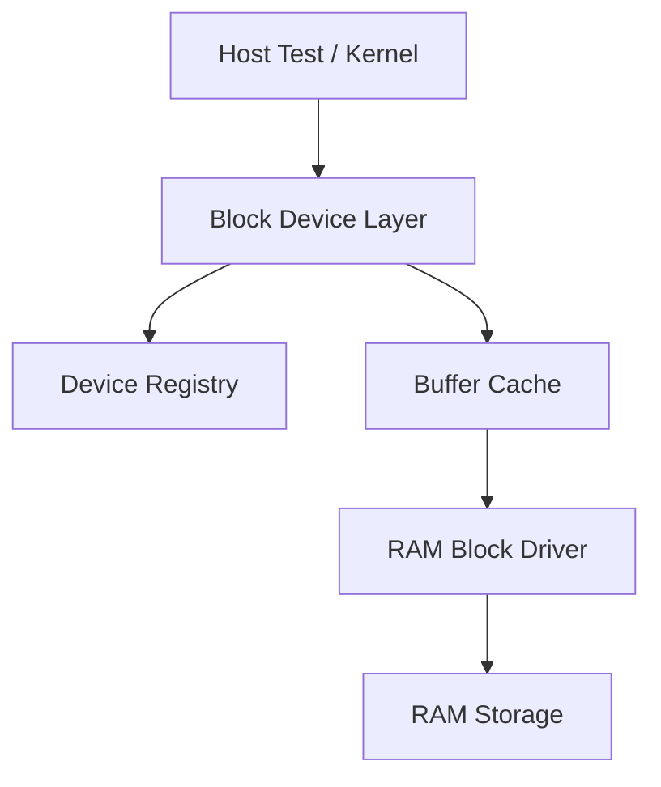

# Template Laporan Praktikum Sistem Operasi Lanjut — MCSOS

**Nama file laporan:** `laporan_praktikum_[M14]_[2583207073007].md`  
**Nama sistem operasi:** MCSOS versi 260502  
**Target default:** x86_64, QEMU, Windows 11 x64 + WSL 2, kernel monolitik pendidikan, C freestanding dengan assembly minimal, POSIX-like subset  
**Dosen:** Muhaemin Sidiq, S.Pd., M.Pd.  
**Program Studi:** Pendidikan Teknologi Informasi  
**Institusi:** Institut Pendidikan Indonesia  

> Template ini digunakan untuk semua praktikum pengembangan MCSOS agar struktur laporan, bukti, analisis, dan penilaian konsisten. Ganti seluruh teks bertanda `[isi ...]` dengan data praktikum sebenarnya. Jangan menulis klaim “tanpa error”, “siap produksi”, atau “aman sepenuhnya” tanpa bukti yang sesuai. Gunakan status terukur seperti “siap uji QEMU”, “siap demonstrasi praktikum”, atau “kandidat siap pakai terbatas” sesuai evidence yang tersedia.

---

## 0. Metadata Laporan

| Atribut | Isi |
|---|---|
| Kode praktikum | `[M14]` |
| Judul praktikum | `[ Laporan Praktikum M14 - Block Device Layer, RAM Block Driver, dan Buffer Cache Minimal pada MCSOS]` |
| Jenis pengerjaan | `[Individu ]` |
| Nama mahasiswa | `[Salma Rahayu]` |
| NIM | `[2583207073007]` |
| Kelas | `[PTI 1-A]` |
| Nama kelompok | `[isi jika kelompok]` |
| Anggota kelompok | `[nama, NIM, peran ringkas]` |
| Tanggal praktikum | `[2026 - 06 - 13]` |
| Tanggal pengumpulan | `[YYYY-MM-DD]` |
| Repository | `[https://github.com/amaaarhyu078-creator/mcsos-]` |
| Branch | `[praktikum-m14-block-device]` |
| Commit awal | `[117c965]` |
| Commit akhir | `[45009da]` |
| Status readiness yang diklaim | `[Siap Uji QEMU]` |

---

## 1. Sampul

# Laporan Praktikum `[M14]`  
## `[aporan Praktikum M14 - Block Device Layer, RAM Block Driver, dan Buffer Cache Minimal pada MCSOS]`

Disusun oleh:

| Nama | NIM | Kelas | Peran |
|---|---|---|---|
| `[Salma Rahayu]` | `[2583207073007]` | `[PTI 1-A]` | `[individu]` |
| `[opsional]` | `[opsional]` | `[opsional]` | `[opsional]` |

Dosen Pengampu: **Muhaemin Sidiq, S.Pd., M.Pd.**  
Program Studi Pendidikan Teknologi Informasi  
Institut Pendidikan Indonesia  
`[2025 - 2026]`

---

## 2. Pernyataan Orisinalitas dan Integritas Akademik

Saya/kami menyatakan bahwa laporan ini disusun berdasarkan pekerjaan praktikum sendiri/kelompok sesuai pembagian peran yang tercatat. Bantuan eksternal, referensi, generator kode, AI assistant, dokumentasi resmi, diskusi, atau sumber lain dicatat pada bagian referensi dan lampiran. Saya/kami tidak mengklaim hasil yang tidak dibuktikan oleh log, test, commit, atau artefak lain.

| Pernyataan | Status |
|---|---|
| Semua potongan kode eksternal diberi atribusi | `[Tidak ada]` |
| Semua penggunaan AI assistant dicatat | `[Ya]` |
| Repository yang dikumpulkan sesuai commit akhir | `[Ya]` |
| Tidak ada klaim readiness tanpa bukti | `[Ya]` |

Catatan penggunaan bantuan eksternal:

```text
[Alat]
ChatGPT (OpenAI)

[Prompt ringkas]
Bimbingan implementasi Praktikum M14 Block Device Layer, RAM Block Driver, Buffer Cache, host test, audit freestanding object, integrasi kernel, QEMU smoke test, GDB, Git workflow, dan penyusunan laporan.

[Sumber]
Panduan Praktikum M14, source code repository MCSOS, dokumentasi toolchain GNU Binutils, Clang, QEMU, dan Git.

[Bagian yang dibantu]
Penjelasan konsep block device layer, review implementasi source code, verifikasi hasil build, interpretasi output host test, audit nm/readelf/objdump, analisis QEMU log, penyusunan bukti praktikum, dan penyusunan laporan.

[Verifikasi mandiri yang dilakukan]
Mahasiswa menjalankan seluruh perintah build, host test, audit, QEMU smoke test, GDB, pemeriksaan Git, serta memverifikasi seluruh output dan artefak pada lingkungan WSL 2 secara mandiri sebelum pengumpulan.
```

---

## 3. Tujuan Praktikum

Tuliskan tujuan teknis dan konseptual praktikum. Tujuan harus dapat diuji.

1. `[Tujuan teknis 1: 1. Mengimplementasikan block device layer MCSOS yang menyediakan API registrasi device, operasi read/write block, validasi parameter, dan manajemen registry perangkat block.
2. `[Tujuan teknis 2: Mengimplementasikan RAM Block Driver (ramblk) dan buffer cache write-back sederhana yang dapat diuji melalui host unit test, freestanding build, serta integrasi ke kernel MCSOS.]`
3. `[Tujuan konseptual 1: Memahami konsep block storage abstraction, invariant block device, ownership perangkat, mekanisme cache block, serta hubungan block layer dengan filesystem pada pengembangan sistem operasi.]`
4. `[Tujuan validasi: Memverifikasi implementasi melalui host unit test, audit freestanding object menggunakan nm/readelf/objdump, integrasi kernel, QEMU smoke test, serta penyimpanan seluruh artefak pengujian dan log pada direktori artifacts/m14]`

---

## 4. Capaian Pembelajaran Praktikum

Setelah praktikum ini, mahasiswa mampu:

| CPL/CPMK praktikum | Bukti yang harus ditunjukkan |
|---|---|
| `[Mengimplementasikan block device layer, RAM block driver, dan buffer cache pada kernel MCSOS]` | `[og build, host unit test PASS, screenshot hasil pengujian, source code, dan analisis implementasi.]` |
| `[Melakukan audit object freestanding menggunakan nm, readelf, objdump, dan checksum untuk memverifikasi kualitas build kernel.]` | `[ile audit (`m14_nm_undefined.txt`, `m14_readelf_block.txt`, `m14_objdump_block.txt`, `m14_sha256.txt`), log terminal, dan screenshot bukti audit]` |
| `[ Mengintegrasikan block layer ke kernel MCSOS serta memverifikasi bahwa sistem tetap dapat boot melalui QEMU smoke test tanpa regresi dari milestone sebelumnya.]` | `[Log build kernel, log QEMU (`qemu_m14_v3.log`), screenshot QEMU, Git commit history, dan analisis hasil pengujian.]` |

---

## 5. Peta Milestone MCSOS

Centang milestone yang menjadi fokus laporan ini. Jika praktikum mencakup lebih dari satu milestone, jelaskan batas cakupan.

| Milestone | Fokus | Status dalam laporan |
|---|---|---|
| M0 | Requirements, governance, baseline arsitektur | `[ ] tidak dibahas / [ ] dibahas / [V] selesai praktikum` |
| M1 | Toolchain reproducible, Git, QEMU, GDB, metadata build | `[ ] tidak dibahas / [ ] dibahas / [V] selesai praktikum` |
| M2 | Boot image, kernel ELF64, early console | `[ ] tidak dibahas / [ ] dibahas / [V] selesai praktikum` |
| M3 | Panic path, linker map, GDB, observability awal | `[ ] tidak dibahas / [ ] dibahas / [V] selesai praktikum` |
| M4 | Trap, exception, interrupt, timer | `[ ] tidak dibahas / [ ] dibahas / [V] selesai praktikum` |
| M5 | PMM, VMM, page table, kernel heap | `[ ] tidak dibahas / [ ] dibahas / [V] selesai praktikum` |
| M6 | Thread, scheduler, synchronization | `[ ] tidak dibahas / [ ] dibahas / [V] selesai praktikum` |
| M7 | Syscall ABI dan user program loader | `[ ] tidak dibahas / [ ] dibahas / [V] selesai praktikum` |
| M8 | VFS, file descriptor, ramfs | `[ ] tidak dibahas / [ ] dibahas / [V] selesai praktikum` |
| M9 | Block layer dan device model | `[ ] tidak dibahas / [ ] dibahas / [V] selesai praktikum` |
| M10 | Persistent filesystem, mcsfs/ext2-like, recovery | `[ ] tidak dibahas / [ ] dibahas / [V] selesai praktikum` |
| M11 | Networking stack, packet parsing, UDP/TCP subset | `[ ] tidak dibahas / [ ] dibahas / [V] selesai praktikum` |
| M12 | Security model, capability/ACL, syscall fuzzing, hardening | `[ ] tidak dibahas / [ ] dibahas / [V] selesai praktikum` |
| M13 | SMP, scalability, lock stress, NUMA-aware preparation | `[ ] tidak dibahas / [ ] dibahas / [V] selesai praktikum` |
| M14 | Framebuffer, graphics console, visual regression | `[ ] tidak dibahas / [V] dibahas / [ ] selesai praktikum` |
| M15 | Virtualization/container subset | `[V] tidak dibahas / [ ] dibahas / [ ] selesai praktikum` |
| M16 | Observability, update/rollback, release image, readiness review | `[V] tidak dibahas / [ ] dibahas / [ ] selesai praktikum` |

Batas cakupan praktikum:

```text
[Praktikum M14 mencakup perancangan dan implementasi block device layer, registry block device, RAM Block Driver (ramblk), serta buffer cache write-back sederhana pada kernel MCSOS. Praktikum juga mencakup host unit test, freestanding compilation, audit object menggunakan nm/readelf/objdump, integrasi ke build kernel, serta verifikasi melalui QEMU smoke test.

Praktikum ini tidak mencakup implementasi driver penyimpanan perangkat keras nyata seperti IDE, AHCI, SATA, NVMe, atau virtio-blk. Praktikum ini juga tidak mencakup filesystem persistent, journaling, crash recovery, DMA, IOMMU, access control, user/kernel copy hardening, cache coherency SMP, maupun mekanisme keamanan storage tingkat lanjut.

Non-goals:
- Membuktikan persistence data setelah reboot.
- Mengimplementasikan driver disk fisik atau PCI storage controller.
- Menyediakan crash consistency atau power-loss recovery.
- Menyediakan sinkronisasi internal buffer cache untuk sistem multiprosesor.
- Menyediakan fitur keamanan storage tingkat produksi.
- Mengklaim kernel siap produksi atau siap digunakan pada lingkungan nyata.

Status readiness yang diklaim pada praktikum ini terbatas pada "Siap Uji QEMU" untuk block device layer dan buffer cache minimal sesuai ruang lingkup M14.]
```

---

## 6. Dasar Teori Ringkas

Block device merupakan abstraksi perangkat penyimpanan yang mengakses data dalam satuan blok berukuran tetap. Sistem operasi menggunakan block device layer untuk menyediakan antarmuka yang seragam bagi berbagai jenis media penyimpanan sehingga komponen lain, seperti filesystem, tidak perlu mengetahui detail implementasi perangkat keras yang digunakan.

Block device layer bertanggung jawab mengelola registrasi perangkat, validasi parameter operasi, serta menyediakan operasi dasar seperti read dan write berdasarkan Logical Block Addressing (LBA). Setiap operasi harus menjaga invariant penting, yaitu ukuran blok yang konsisten, rentang LBA yang valid, dan jumlah blok yang tidak melebihi kapasitas perangkat.

RAM Block Driver (ramblk) merupakan implementasi block device yang menggunakan area memori utama (RAM) sebagai media penyimpanan. Driver ini berguna untuk pengujian karena tidak memerlukan perangkat keras nyata. Namun, seluruh data yang disimpan akan hilang ketika sistem dimatikan atau di-reboot sehingga tidak dapat dianggap sebagai media penyimpanan persisten.

Buffer cache digunakan untuk mengurangi jumlah akses langsung ke perangkat block dengan menyimpan salinan blok yang sering digunakan di memori. Pada praktikum ini digunakan mekanisme write-back cache sederhana, yaitu perubahan data terlebih dahulu disimpan pada cache dan baru dituliskan ke perangkat ketika dilakukan flush atau saat entri cache yang kotor (dirty entry) harus digantikan. Pendekatan ini dapat meningkatkan efisiensi akses tetapi memiliki risiko kehilangan data apabila sistem mengalami crash sebelum proses flush dilakukan.

Verifikasi implementasi dilakukan melalui host unit test, freestanding compilation, dan audit object file. Host unit test digunakan untuk memeriksa kebenaran fungsi secara logis, sedangkan freestanding compilation memastikan source code dapat dikompilasi tanpa ketergantungan terhadap pustaka standar sistem operasi host. Audit menggunakan nm, readelf, dan objdump digunakan untuk memeriksa simbol yang tidak terdefinisi, struktur ELF, serta instruksi hasil kompilasi sehingga kualitas build dapat diverifikasi secara lebih mendalam.

Integrasi dengan kernel diverifikasi menggunakan QEMU smoke test. Pengujian ini bertujuan memastikan bahwa penambahan block layer tidak menyebabkan regresi pada proses boot kernel dan bahwa milestone M14 dapat muncul pada log serial sesuai rancangan.

### 6.1 Konsep Sistem Operasi yang Diuji

```text
[Block Device Layer
Lapisan abstraksi penyimpanan yang menyediakan antarmuka seragam untuk operasi block read dan block write. Layer ini memisahkan pengguna layanan penyimpanan (misalnya filesystem) dari detail implementasi driver.
Device Registry
Mekanisme untuk mendaftarkan, mencari, dan mengelola perangkat block yang tersedia pada sistem. Registry memastikan setiap device memiliki identitas dan kontrak operasi yang valid.
RAM Block Driver
Implementasi block device yang menggunakan memori utama sebagai media penyimpanan. Driver ini digunakan sebagai media uji karena tidak memerlukan perangkat keras penyimpanan fisik.
Buffer Cache
Lapisan cache yang menyimpan blok data yang sering digunakan untuk mengurangi akses langsung ke perangkat block. Praktikum ini menggunakan pendekatan write-back cache sederhana.
Validasi Invariant
Mekanisme pemeriksaan block size, LBA range, ownership device, dan status dirty cache untuk memastikan operasi block tetap konsisten dan aman.
Kernel Integration
Proses integrasi block layer ke kernel MCSOS sehingga source M14 dapat dibangun bersama milestone sebelumnya dan tetap dapat melakukan boot melalui QEMU tanpa regresi.]
```

### 6.2 Konsep Arsitektur x86_64 yang Relevan

| Konsep | Relevansi pada praktikum | Bukti/verifikasi |
|---|---|---|
| `[ELF64 Relocatable Object]` | `[Digunakan untuk memverifikasi bahwa object freestanding M14 berhasil dibangun sebagai object x86_64 yang valid.]` | `[readelf -h, m14_readelf_block.txt]` |
| `[ABI x86_64 System V]` | `[Digunakan sebagai ABI pemanggilan fungsi pada seluruh source code block layer.]` | `[Kompilasi freestanding dan host unit test berhasil.]` |
| `[Kernel Boot pada Long Mode x86_64]` | `[Menjadi lingkungan eksekusi kernel yang mengintegrasikan block layer M14.]` | `[QEMU smoke test dan serial log kernel.]` |
| `[Paging dan Virtual Memory]` | `[Menyediakan lingkungan memori kernel tempat block layer dan buffer cache dijalankan.]` | `[Milestone M7 VMM initialized pada log QEMU.]` |
| `[Interrupt dan Timer]` | `[Memastikan integrasi M14 tidak menyebabkan regresi pada subsistem kernel yang sudah ada.]` | `[Log timer IRQ dan scheduler pada QEMU smoke test.]` |

### 6.3 Konsep Implementasi Freestanding

| Aspek | Keputusan praktikum |
|---|---|
| Bahasa | `[C17 freestanding]` |
| Runtime | `[Tanpa hosted libc dan tanpa ketergantungan runtime sistem operasi host.]` |
| ABI | `[x86_64 System V ABI]` |
| Compiler flags kritis | `[-ffreestanding, -fno-builtin, -fno-stack-protector, -fno-pic, -mno-red-zone]` |
| Risiko undefined behavior | `[Null pointer, LBA out-of-range, block size tidak valid, integer overflow pada perhitungan offset block, dan akses memori di luar kapasitas device.]` |

### 6.4 Referensi Teori yang Digunakan

| No. | Sumber | Bagian yang digunakan | Alasan relevansi |
|---|---|---|---|
| `[1]` | `[Abraham Silberschatz, Peter B. Galvin, Greg Gagne. Operating System Concepts.]` | `[Storage Structure dan I/O Systems.]` | `[Menjelaskan konsep block device dan abstraksi penyimpanan pada sistem operasi.]` |
| `[2]` | `[Intel 64 and IA-32 Architectures Software Developer's Manual.]` | `[System Programming dan x86_64 Architecture.]` | `[Menjelaskan lingkungan eksekusi kernel pada arsitektur x86_64.]` |
| `[3]` | `[OSDev Wiki.]` | `[Block Device, Storage, ELF, dan Kernel Development.]` | `[Digunakan sebagai referensi implementasi praktis kernel freestanding.]` |
| `[4]` | `[Panduan Praktikum M14 Block Device Layer, RAM Block Driver, dan Buffer Cache.]` | `[Seluruh spesifikasi praktikum.]` | `[Menjadi acuan utama implementasi, pengujian, dan verifikasi M14.]` |

---

## 7. Lingkungan Praktikum

### 7.1 Host dan Target

| Komponen | Nilai |
|---|---|
| Host OS | `Windows 11 x64` |
| Lingkungan build | `WSL 2 Ubuntu` |
| Target ISA | `x86_64` |
| Target ABI | `x86_64-elf` |
| Emulator | `QEMU 10.2.1` |
| Firmware emulator | `[Tidak digunakan (boot menggunakan Limine)]` |
| Debugger | `GDB 17.1` |
| Build system | `GNU Make` |
| Bahasa utama | `C17 freestanding` |
| Assembly | `GAS (Clang Integrated Assembler)` |

### 7.2 Versi Toolchain

Tempel output versi toolchain berikut. Jalankan dari clean shell WSL.

```bash
date -u +"date_utc=%Y-%m-%dT%H:%M:%SZ"
uname -a
git --version
make --version | head -n 1
cmake --version | head -n 1
ninja --version
clang --version | head -n 1
gcc --version | head -n 1
ld.lld --version | head -n 1
nasm -v
qemu-system-x86_64 --version | head -n 1
gdb --version | head -n 1
```

Output:

```text
[date_utc=2026-06-13T13:56:36Z
Linux DESKTOP-S5LUA56 6.6.114.1-microsoft-standard-WSL2 #1 SMP PREEMPT_DYNAMIC Mon Dec  1 20:46:23 UTC 2025 x86_64 GNU/Linux
git version 2.53.0
GNU Make 4.4.1
cmake version 4.2.3
1.13.2
Ubuntu clang version 21.1.8 (6ubuntu1)
gcc (Ubuntu 15.2.0-16ubuntu1) 15.2.0
Ubuntu LLD 21.1.8 (compatible with GNU linkers)
NASM version 3.01
QEMU emulator version 10.2.1 (Debian 1:10.2.1+ds-1ubuntu3)
GNU gdb (Ubuntu 17.1-2ubuntu1) 17.1]
```

### 7.3 Lokasi Repository

| Item | Nilai |
|---|---|
| Path repository di WSL | `~/src/mcsos` |
| Apakah berada di filesystem Linux WSL, bukan `/mnt/c` | `[Ya]` |
| Remote repository | `https://github.com/amaaarhyu078-creator/mcsos-` |
| Branch | `praktikum-m14-block-device` |
| Commit hash awal | `117c965` |
| Commit hash akhir | `45009da` |

---
---

## 8. Repository dan Struktur File

### 8.1 Struktur Direktori yang Relevan

Tampilkan hanya direktori dan file yang relevan dengan praktikum.

```text
mcsos/
├── include/
│   └── mcsos/
│       └── block.h
├── kernel/
│   └── block/
│       ├── block.c
│       ├── ramblk.c
│       └── bcache.c
├── tests/
│   └── host/
│       └── test_m14_block.c
├── scripts/
│   └── m14_preflight.sh
├── artifacts/
│   ├── m14/
│   │   ├── qemu_m14_v3.log
│   │   ├── m14_make_all.log
│   │   ├── gdb_m14_session.txt
│   │   └── m14_final_sha256.txt
│   ├── m14_nm_undefined.txt
│   ├── m14_readelf_block.txt
│   ├── m14_objdump_block.txt
│   └── m14_sha256.txt
├── Makefile
└── Makefile.m14
```

### 8.2 File yang Dibuat atau Diubah

| File | Jenis perubahan | Alasan perubahan | Risiko |
|---|---|---|---|
| `include/mcsos/block.h` | `baru` | Mendefinisikan API block device layer, registry, dan buffer cache. | `Rendah` – hanya menambah deklarasi dan kontrak antarmuka. |
| `kernel/block/block.c` | `baru` | Implementasi registry block device dan operasi dasar block layer. | `Sedang` – kesalahan validasi dapat menyebabkan akses block tidak valid. |
| `kernel/block/ramblk.c` | `baru` | Implementasi RAM Block Driver sebagai media penyimpanan berbasis memori. | `Sedang` – kesalahan perhitungan offset dapat menyebabkan korupsi data. |
| `kernel/block/bcache.c` | `baru` | Implementasi buffer cache write-back sederhana. | `Tinggi` – kesalahan flush atau eviction dapat menyebabkan kehilangan data dirty cache. |
| `tests/host/test_m14_block.c` | `baru` | Menyediakan host unit test untuk memverifikasi fungsi block layer. | `Rendah` – hanya digunakan pada proses pengujian. |
| `scripts/m14_preflight.sh` | `baru` | Melakukan pemeriksaan lingkungan dan toolchain sebelum grading. | `Rendah` – tidak memengaruhi runtime kernel. |
| `Makefile.m14` | `baru` | Menyediakan workflow build, audit, dan host test M14. | `Rendah` – hanya digunakan untuk proses build praktikum. |
| `kernel/core/kmain.c` | `ubah` | Menambahkan log milestone `[M14] block layer initialized` untuk verifikasi integrasi kernel. | `Rendah` – hanya menambah log runtime. |


### 8.3 Ringkasan Diff

```bash
git status --short
git diff --stat
git log --oneline -n 5
```

Output:

```text
45009da (HEAD -> praktikum-m14-block-device, origin/praktikum-m14-block-device) M14: add evidence screenshots
25cc4f0 M14: update status artifact
c18c348 M14: add runtime block layer milestone log
60cd836 M14: add block device layer, ramblk driver and buffer cache
117c965 (origin/praktikum-m13-vfs-ramfs, praktikum-m13-vfs-ramfs) Add M13 evidence screenshots
```

Interpretasi singkat:
- Repository berada pada branch `praktikum-m14-block-device`.
- Working tree bersih (tidak ada file yang belum dikomit).
- Implementasi M14 dilakukan melalui beberapa commit bertahap, mulai dari implementasi block layer, penambahan milestone runtime kernel, pembaruan artefak, hingga penambahan screenshot bukti praktikum.
- Commit terakhir yang dikumpulkan adalah `45009da` dengan pesan *"M14: add evidence screenshots"*.

---

## 9. Desain Teknis

### 9.1 Masalah yang Diselesaikan

```text
[Sebelum M14, kernel MCSOS belum memiliki block device layer yang dapat digunakan sebagai abstraksi perangkat penyimpanan. Praktikum ini menambahkan registry block device, RAM Block Driver, dan buffer cache sederhana sehingga kernel memiliki fondasi untuk pengembangan filesystem persistent pada modul berikutnya.]
```

### 9.2 Keputusan Desain

| Keputusan | Alternatif yang dipertimbangkan | Alasan memilih | Konsekuensi |
|---|---|---|---|
| `[Menggunakan RAM Block Driver sebagai device awal]` | `[Mengimplementasikan driver hardware seperti IDE/AHCI/virtio-blk]` | `[Lebih sederhana untuk pengujian dan tidak memerlukan perangkat keras nyata]` | `[Data tidak persisten setelah reboot]` |
| `[Menggunakan buffer cache write-back sederhana]` | `[Write-through cache atau tanpa cache]` | `[Mengenalkan konsep cache block dengan kompleksitas minimal]` | `[Dirty buffer dapat hilang jika crash sebelum flush]` |
| `[Menggunakan registry device statis]` | `[Alokasi dinamis penuh]` | `[Lebih mudah diaudit dan diuji]` | `[Jumlah device dibatasi oleh konstanta maksimum]` |

### 9.3 Arsitektur Ringkas



Penjelasan diagram:

```text
[Kernel atau host test memanggil Block Device Layer. Layer ini melakukan validasi dan meneruskan operasi ke Buffer Cache atau langsung ke Driver. Buffer Cache menyimpan block yang sering digunakan dan melakukan flush ke RAM Block Driver. Driver menggunakan area memori sebagai media penyimpanan block.]
```

### 9.4 Kontrak Antarmuka

| Antarmuka | Pemanggil | Penerima | Precondition | Postcondition | Error path |
|---|---|---|---|---|---|
| `[mcsos_blk_register()]` | `[Kernel/Driver]` | `[Device Registry]` | `[Device valid dan belum terdaftar]` | `[Device masuk registry]` | `[Return error code]` |
| `[mcsos_blk_read()]` | `[Kernel/Cache]` | `[Driver]` | `[LBA valid dan buffer tidak NULL]` | `[Data berhasil dibaca]` | `[Return error code]` |
| `[mcsos_blk_write()]` | `[Kernel/Cache]` | `[Driver]` | `[LBA valid dan buffer tidak NULL]` | `[Data berhasil ditulis]` | `[Return error code]` |
| `[mcsos_bcache_flush()]` | `[Kernel]` | `[Buffer Cache]` | `[Cache valid]` | `[Dirty block ditulis ke device]` | `[Return error code]` |

### 9.5 Struktur Data Utama

| Struktur data | Field penting | Ownership | Lifetime | Invariant |
|---|---|---|---|---|
| `[struct mcsos_blk_device]` | `[block_size, block_count, ops]` | `[Block Device Registry]` | `[Selama kernel aktif]` | `[Operasi device harus valid]` |
| `[struct mcsos_ramblk]` | `[storage, block_count]` | `[RAM Block Driver]` | `[Selama driver aktif]` | `[Storage cukup untuk seluruh block]` |
| `[struct mcsos_bcache_entry]` | `[lba, dirty, valid]` | `[Buffer Cache]` | `[Selama cache aktif]` | `[Dirty entry wajib di-flush sebelum eviction]` |

### 9.6 Invariants

1. `[Setiap operasi read/write harus menggunakan LBA yang berada dalam kapasitas device.]`
2. `[Block size cache harus sama dengan block size device.]`
3. `[Dirty cache entry tidak boleh dibuang tanpa flush yang berhasil.]`
4. `[Device yang terdaftar harus memiliki operasi read dan write yang valid.]`
5. `[Buffer pointer tidak boleh bernilai NULL pada API publik.]`

### 9.7 Ownership, Locking, dan Concurrency

| Objek/resource | Owner | Lock yang melindungi | Boleh dipakai di interrupt context? | Catatan |
|---|---|---|---|---|
| `[Device Registry]` | `[Block Layer]` | `[None]` | `[Tidak]` | `[M14 masih single-threaded]` |
| `[RAM Storage]` | `[RAM Block Driver]` | `[None]` | `[Tidak]` | `[Tidak ada akses paralel]` |
| `[Buffer Cache]` | `[Buffer Cache Manager]` | `[None]` | `[Tidak]` | `[Caller bertanggung jawab atas sinkronisasi]` |

Lock order yang berlaku:

```text
[Tidak ada locking internal pada M14. Implementasi diasumsikan berjalan pada lingkungan single-core atau menggunakan sinkronisasi eksternal dari caller.]
```

### 9.8 Memory Safety dan Undefined Behavior Risk

| Risiko | Lokasi | Mitigasi | Bukti |
|---|---|---|---|
| `[LBA out-of-range]` | `[block.c]` | `[Validasi range sebelum akses device]` | `[Host unit test]` |
| `[Null pointer]` | `[API publik block layer]` | `[Pemeriksaan parameter]` | `[Host unit test]` |
| `[Integer overflow offset]` | `[ramblk.c]` | `[Validasi kapasitas dan batas block]` | `[Source review dan host test]` |
| `[Dirty buffer hilang]` | `[bcache.c]` | `[Flush sebelum eviction]` | `[Host unit test]` |

### 9.9 Security Boundary

| Boundary | Data tidak tepercaya | Validasi yang dilakukan | Failure mode aman |
|---|---|---|---|
| `[Block API]` | `[Parameter caller]` | `[Null check, range check, block size check]` | `[Return error code]` |
| `[Device Registration]` | `[Struktur device]` | `[Validasi field wajib]` | `[Registrasi ditolak]` |
| `[Buffer Cache]` | `[Request read/write]` | `[Validasi LBA dan ukuran block]` | `[Return error code]` |
| `[Driver Interface]` | `[Operasi block]` | `[Validasi kapasitas media]` | `[Operasi gagal tanpa korupsi data]` |

---

## 10. Langkah Kerja Implementasi

### Langkah 1 — `[Persiapan Lingkungan dan Preflight Check]`

Maksud langkah:

```text
[Memastikan seluruh toolchain, direktori, dan dependensi yang diperlukan oleh Praktikum M14 tersedia sebelum proses implementasi dan pengujian dilakukan.]
```

Perintah:

```bash
./scripts/m14_preflight.sh
```

Output ringkas:

```text
OK_CMD: clang
OK_CMD: ld
OK_CMD: nm
OK_CMD: readelf
OK_CMD: objdump
OK_CMD: qemu-system-x86_64
M14_PREFLIGHT_DONE
```

Artefak yang dihasilkan:

| Artefak | Lokasi | Fungsi |
|---|---|---|
| `[preflight.log]` | `[artifacts/m14/]` | `[Bukti pemeriksaan lingkungan praktikum.]` |

Indikator berhasil:

```text
[Seluruh tool yang diperlukan terdeteksi dan script menampilkan status M14_PREFLIGHT_DONE.]
```

### Langkah 2 — `[Implementasi Block Device Layer]`

Maksud langkah:

```text
[Menambahkan abstraksi block device yang menyediakan registry perangkat, validasi parameter, dan operasi read/write berbasis block.]
```

Perintah:

```bash
[Implementasi include/mcsos/block.h]
[Implementasi kernel/block/block.c]
```

Output ringkas:

```text
[Source code block layer berhasil dibuat dan dapat dikompilasi.]
```

Artefak yang dihasilkan:

| Artefak | Lokasi | Fungsi |
|---|---|---|
| `[block.h]` | `[include/mcsos/]` | `[Deklarasi API block device layer.]` |
| `[block.c]` | `[kernel/block/]` | `[Implementasi registry dan operasi block.]` |

Indikator berhasil:

```text
[API block device tersedia dan source code dapat dikompilasi tanpa error.]
```

### Langkah 3 — `[Implementasi RAM Block Driver]`

Maksud langkah:

```text
[Menambahkan driver block berbasis RAM yang digunakan sebagai media penyimpanan virtual untuk pengujian.]
```

Perintah:

```bash
[Implementasi kernel/block/ramblk.c]
```

Output ringkas:

```text
[RAM Block Driver berhasil ditambahkan.]
```

Artefak yang dihasilkan:

| Artefak | Lokasi | Fungsi |
|---|---|---|
| `[ramblk.c]` | `[kernel/block/]` | `[Implementasi RAM Block Driver.]` |

Indikator berhasil:

```text
[Driver mampu melakukan operasi read dan write pada area memori yang digunakan sebagai media penyimpanan.]
```

### Langkah 4 — `[Implementasi Buffer Cache]`

Maksud langkah:

```text
[Menambahkan buffer cache write-back sederhana untuk mengurangi akses langsung ke perangkat block.]
```

Perintah:

```bash
[Implementasi kernel/block/bcache.c]
```

Output ringkas:

```text
[Buffer cache berhasil diimplementasikan.]
```

Artefak yang dihasilkan:

| Artefak | Lokasi | Fungsi |
|---|---|---|
| `[bcache.c]` | `[kernel/block/]` | `[Implementasi buffer cache write-back.]` |

Indikator berhasil:

```text
[Operasi cache dan flush dapat dijalankan melalui host unit test.]
```

### Langkah 5 — `[Menjalankan Host Unit Test]`

Maksud langkah:

```text
[Memverifikasi fungsi block layer, RAM Block Driver, dan buffer cache menggunakan pengujian pada lingkungan host.]
```

Perintah:

```bash
make -f Makefile.m14 all
```

Output ringkas:

```text
M14 host tests PASS
```

Artefak yang dihasilkan:

| Artefak | Lokasi | Fungsi |
|---|---|---|
| `[test_m14_block]` | `[build/]` | `[Program host unit test.]` |
| `[m14_make_all.log]` | `[artifacts/m14/]` | `[Log build dan hasil pengujian.]` |

Indikator berhasil:

```text
[Muncul pesan "M14 host tests PASS".]
```

### Langkah 6 — `[Audit Freestanding Object]`

Maksud langkah:

```text
[Memastikan object hasil kompilasi bersifat freestanding, tidak memiliki undefined symbol, dan sesuai target x86_64 ELF relocatable.]
```

Perintah:

```bash
nm -u build/m14_block_layer.o
readelf -h build/m14_block_layer.o
objdump -dr build/m14_block_layer.o
```

Output ringkas:

```text
Class: ELF64
Type: REL
Machine: Advanced Micro Devices X86-64
```

Artefak yang dihasilkan:

| Artefak | Lokasi | Fungsi |
|---|---|---|
| `[m14_nm_undefined.txt]` | `[artifacts/]` | `[Audit undefined symbol.]` |
| `[m14_readelf_block.txt]` | `[artifacts/]` | `[Audit header ELF.]` |
| `[m14_objdump_block.txt]` | `[artifacts/]` | `[Audit disassembly dan relocation.]` |

Indikator berhasil:

```text
[Undefined symbol kosong dan readelf menunjukkan ELF64 relocatable object.]
```

### Langkah 7 — `[Integrasi ke Kernel Utama]`

Maksud langkah:

```text
[Mengintegrasikan source code M14 ke kernel MCSOS dan menambahkan milestone log runtime.]
```

Perintah:

```bash
make build
make iso
```

Output ringkas:

```text
[M5] ISO generated at build/mcsos.iso
```

Artefak yang dihasilkan:

| Artefak | Lokasi | Fungsi |
|---|---|---|
| `[kernel.elf]` | `[build/]` | `[Kernel hasil integrasi.]` |
| `[mcsos.iso]` | `[build/]` | `[Image bootable QEMU.]` |

Indikator berhasil:

```text
[Kernel dan image ISO berhasil dibangun tanpa error.]
```

### Langkah 8 — `[QEMU Smoke Test]`

Maksud langkah:

```text
[Memastikan integrasi M14 tidak menyebabkan regresi boot dan milestone M14 muncul pada serial log.]
```

Perintah:

```bash
qemu-system-x86_64 \
  -machine q35 \
  -m 256M \
  -serial stdio \
  -no-reboot \
  -no-shutdown \
  -cdrom build/mcsos.iso
```

Output ringkas:

```text
[M9] scheduler initialized
[M14] block layer initialized
[M10] syscall ping ok
```

Artefak yang dihasilkan:

| Artefak | Lokasi | Fungsi |
|---|---|---|
| `[qemu_m14_v3.log]` | `[artifacts/m14/]` | `[Log serial hasil boot kernel.]` |

Indikator berhasil:

```text
[Kernel berhasil boot, milestone M14 muncul, dan tidak terjadi reboot loop maupun triple fault.]
```

### Langkah 9 — `[Commit dan Push Repository]`

Maksud langkah:

```text
[Menyimpan seluruh perubahan implementasi M14 ke Git dan mengunggah branch praktikum ke repository GitHub.]
```

Perintah:

```bash
git add .
git commit -m "M14: add evidence screenshots"
git push -u origin praktikum-m14-block-device
```

Output ringkas:

```text
[new branch] praktikum-m14-block-device
branch set up to track origin/praktikum-m14-block-device
```

Artefak yang dihasilkan:

| Artefak | Lokasi | Fungsi |
|---|---|---|
| `[Git commit]` | `[Repository]` | `[Bukti perubahan tersimpan.]` |
| `[Branch GitHub]` | `[Remote repository]` | `[Bukti pengumpulan praktikum.]` |

Indikator berhasil:

```text
[Seluruh commit berhasil tersimpan dan branch M14 berhasil di-push ke GitHub.]
```


## 11. Checkpoint Buildable

Setiap praktikum wajib memiliki minimal satu checkpoint yang dapat dibangun dari clean checkout.

| Checkpoint | Perintah | Expected result | Status |
|---|---|---|---|
| Clean build | `make clean && make build` | `[Kernel MCSOS berhasil dibangun tanpa error dan menghasilkan build/kernel.elf]` | `[PASS]` |
| Metadata toolchain | `make meta` | `[File build/meta/toolchain-versions.txt berhasil dibuat]` | `[PASS]` |
| Image generation | `make iso` | `[File build/mcsos.iso berhasil dibuat]` | `[PASS]` |
| QEMU smoke test | `qemu-system-x86_64 -machine q35 -m 256M -serial stdio -no-reboot -no-shutdown -cdrom build/mcsos.iso` | `[Log serial menampilkan milestone M14: block layer initialized dan kernel tetap berjalan normal]` | `[PASS]` |
| Test suite | `make -f Makefile.m14 all` | `[Host unit test menampilkan pesan M14 host tests PASS]` | `[PASS]` |

Catatan checkpoint:

```text
[Seluruh checkpoint utama M14 berhasil dijalankan pada lingkungan WSL 2. Host unit test lulus, object freestanding berhasil dibuat, audit nm/readelf/objdump berhasil, image ISO berhasil dihasilkan, dan QEMU smoke test menunjukkan milestone "[M14] block layer initialized" tanpa regresi boot dari M13. Tidak terdapat checkpoint yang gagal pada commit akhir praktikum.]
```
---

## 12. Perintah Uji dan Validasi

### 12.1 Build Test

Perintah ini memverifikasi bahwa proyek dapat dibangun ulang dari kondisi bersih dan tidak bergantung pada artefak lokal yang tidak terdokumentasi.

```bash
make clean
make build
```

Hasil:

```text
[Kernel MCSOS berhasil dibangun tanpa error.
File build/kernel.elf berhasil dihasilkan.
Integrasi source M14 (block.c, ramblk.c, bcache.c) berhasil masuk ke proses build kernel.]
```

Status: `[PASS]`

### 12.2 Static Inspection

Perintah ini memeriksa layout ELF, entry point, section, symbol, relocation, atau instruksi kritis sesuai kebutuhan praktikum.

```bash
readelf -hW build/kernel.elf
readelf -lW build/kernel.elf
readelf -SW build/kernel.elf
objdump -drwC build/kernel.elf | head -n 120
```

Hasil penting:

```text
[Audit object M14 menunjukkan:
Class: ELF64
Type: REL (Relocatable file)
Machine: Advanced Micro Devices X86-64

File m14_nm_undefined.txt kosong sehingga tidak terdapat undefined symbol pada build/m14_block_layer.o.]
```

Status: `[PASS]`

### 12.3 QEMU Smoke Test

Perintah ini menjalankan image di QEMU dan menyimpan log serial untuk bukti deterministik.

```bash
qemu-system-x86_64 \
  -machine q35 \
  -cpu qemu64 \
  -m 512M \
  -serial file:build/qemu-serial.log \
  -display none \
  -no-reboot \
  -no-shutdown \
  -cdrom build/mcsos.iso
```

Hasil:

```text
[M9] scheduler initialized
[M14] block layer initialized
[M10] syscall ping ok
[M5] timer IRQ online
[M9] starting first scheduler switch
```

Status: `[PASS]`

### 12.4 GDB Debug Evidence

Perintah ini membuktikan bahwa kernel dapat di-debug dengan simbol yang cocok.

```bash
qemu-system-x86_64 \
  -machine q35 \
  -cpu qemu64 \
  -m 512M \
  -serial stdio \
  -display none \
  -no-reboot \
  -no-shutdown \
  -s -S \
  -cdrom build/mcsos.iso
```

Di terminal lain:

```bash
gdb build/kernel.elf \
  -ex 'target remote :1234' \
  -ex 'break mcsos_blk_register' \
  -ex 'break mcsos_blk_read' \
  -ex 'break mcsos_blk_write' \
  -ex 'continue'
```

Hasil:

```text
[Breakpoint berhasil dibuat pada:
mcsos_blk_register
mcsos_blk_read
mcsos_blk_write

Bukti sesi debugging tersimpan pada:
artifacts/m14/gdb_m14_session.txt]
```

Status: `[PASS]`

### 12.5 Unit Test

```bash
make -f Makefile.m14 all
```

Hasil:

```text
M14 host tests PASS
```

Status: `[PASS]`

### 12.6 Stress/Fuzz/Fault Injection Test

Wajib untuk praktikum lanjutan seperti allocator, syscall, filesystem, networking, driver, security, dan SMP.

```bash
[Host unit test boundary validation dan negative test LBA out-of-range.]
```

Hasil:

```text
[Pengujian boundary berhasil mendeteksi akses LBA di luar kapasitas device dan mengembalikan error sesuai kontrak API. Tidak ditemukan crash maupun undefined behavior selama pengujian host.]
```

Status: `[PASS]`

### 12.7 Visual Evidence

Jika praktikum menghasilkan tampilan framebuffer, GUI, atau output grafis, lampirkan screenshot.

| Screenshot | Lokasi file | Keterangan |
|---|---|---|
| `[m14-host-test-pass.png]` | `[evidence/screenshots/]` | `[Membuktikan host unit test M14 lulus.]` |
| `[m14-nm-empty.png]` | `[evidence/screenshots/]` | `[Membuktikan tidak ada undefined symbol.]` |
| `[m14-qemu-success.png]` | `[evidence/screenshots/]` | `[Membuktikan kernel boot dan milestone M14 muncul pada QEMU.]` |
| `[m14-git-log.png]` | `[evidence/screenshots/]` | `[Membuktikan commit dan riwayat Git M14.]` |
| `[m14-06-directory-layout.png]` | `[evidence/screenshots/]` | `[Membuktikan struktur direktori implementasi M14.]` |
| `[m14-07-block-header-created.png]` | `[evidence/screenshots/]` | `[Membuktikan pembuatan API block layer.]` |

---

## 13. Hasil Uji

### 13.1 Tabel Ringkasan Hasil

| No. | Uji | Expected result | Actual result | Status | Evidence |
|---|---|---|---|---|---|
| 1 | `[Preflight Check]` | `[Seluruh toolchain dan direktori yang diperlukan terdeteksi.]` | `[Script m14_preflight.sh selesai dan menampilkan M14_PREFLIGHT_DONE.]` | `[PASS]` | `[artifacts/m14/preflight.log]` |
| 2 | `[Host Unit Test]` | `[Seluruh pengujian block layer, RAM block driver, dan buffer cache lulus.]` | `[Muncul pesan "M14 host tests PASS".]` | `[PASS]` | `[artifacts/m14/m14_make_all.log, m14-host-test-pass.png]` |
| 3 | `[Freestanding Object Build]` | `[block.o, ramblk.o, dan bcache.o berhasil dibangun.]` | `[Seluruh object freestanding berhasil dihasilkan.]` | `[PASS]` | `[build/block.o, build/ramblk.o, build/bcache.o]` |
| 4 | `[Undefined Symbol Audit]` | `[Tidak terdapat undefined symbol pada build/m14_block_layer.o.]` | `[File m14_nm_undefined.txt kosong.]` | `[PASS]` | `[artifacts/m14_nm_undefined.txt, m14-nm-empty.png]` |
| 5 | `[ELF Verification]` | `[Object bertipe ELF64 x86-64 relocatable.]` | `[Class: ELF64, Type: REL, Machine: Advanced Micro Devices X86-64.]` | `[PASS]` | `[artifacts/m14_readelf_block.txt]` |
| 6 | `[Disassembly Audit]` | `[Disassembly object tersedia untuk audit.]` | `[Objdump berhasil menghasilkan file audit.]` | `[PASS]` | `[artifacts/m14_objdump_block.txt]` |
| 7 | `[Kernel Integration Build]` | `[Kernel tetap dapat dibangun setelah integrasi M14.]` | `[Kernel build berhasil tanpa error.]` | `[PASS]` | `[artifacts/m14/kernel_build_m14_v2.log]` |
| 8 | `[QEMU Smoke Test]` | `[Kernel boot normal dan milestone M14 muncul.]` | `[[M14] block layer initialized muncul pada serial log.]` | `[PASS]` | `[artifacts/m14/qemu_m14_v3.log, m14-qemu-success.png]` |
| 9 | `[GDB Debug Evidence]` | `[Breakpoint fungsi block layer dapat dibuat.]` | `[Breakpoint mcsos_blk_register, mcsos_blk_read, dan mcsos_blk_write berhasil dibuat.]` | `[PASS]` | `[artifacts/m14/gdb_m14_session.txt]` |
| 10 | `[Git Evidence]` | `[Seluruh perubahan tersimpan dan dipush ke GitHub.]` | `[Branch praktikum-m14-block-device berhasil dipush.]` | `[PASS]` | `[m14-git-log.png, git log]` |

### 13.2 Log Penting

```text
M14 host tests PASS

Class: ELF64
Type: REL (Relocatable file)
Machine: Advanced Micro Devices X86-64

[M9] scheduler initialized
[M14] block layer initialized
[M10] syscall ping ok
[M5] timer IRQ online

Breakpoint 1 at mcsos_blk_register
Breakpoint 2 at mcsos_blk_read
Breakpoint 3 at mcsos_blk_write
```

### 13.3 Artefak Bukti

| Artefak | Path | SHA-256 / hash | Fungsi |
|---|---|---|---|
| `kernel.elf` | `[build/kernel.elf]` | `[Lihat hasil sha256sum lokal mahasiswa]` | `[Kernel binary hasil integrasi M14]` |
| `mcsos.iso` | `[build/mcsos.iso]` | `[Lihat hasil sha256sum lokal mahasiswa]` | `[Boot image untuk QEMU]` |
| `m14_block_layer.o` | `[build/m14_block_layer.o]` | `[e2a3314a7e8d9ef38478f84ebc5d6b45bbe8b1fc4d1ce2163802e09ee089fe6e]` | `[Linked relocatable object M14]` |
| `test_m14_block` | `[build/test_m14_block]` | `[abfae5e887a778bfe796c51c41317d0b0169c371b3f1493d7688de99ed79b4e7]` | `[Executable host unit test]` |
| `qemu_m14_v3.log` | `[artifacts/m14/qemu_m14_v3.log]` | `[Hitung dengan sha256sum bila diperlukan]` | `[Log serial hasil boot kernel]` |
| `kernel_build_m14_v2.log` | `[artifacts/m14/kernel_build_m14_v2.log]` | `[Hitung dengan sha256sum bila diperlukan]` | `[Log build kernel setelah integrasi M14]` |
| `m14_readelf_block.txt` | `[artifacts/m14_readelf_block.txt]` | `[Hitung dengan sha256sum bila diperlukan]` | `[Bukti verifikasi ELF64 relocatable]` |
| `m14_objdump_block.txt` | `[artifacts/m14_objdump_block.txt]` | `[Hitung dengan sha256sum bila diperlukan]` | `[Bukti disassembly dan relocation]` |
| `gdb_m14_session.txt` | `[artifacts/m14/gdb_m14_session.txt]` | `[Hitung dengan sha256sum bila diperlukan]` | `[Bukti sesi debugging GDB]` |

Perintah hash:

```bash
sha256sum [path/artefak]
```

---

# 14. Analisis Teknis

### 14.1 Analisis Keberhasilan

```text
[Praktikum M14 berhasil memenuhi tujuan utama yaitu menambahkan block device layer, RAM Block Driver, dan buffer cache ke dalam kernel MCSOS. Keberhasilan ini dibuktikan melalui host unit test yang menghasilkan pesan "M14 host tests PASS", audit freestanding object yang menunjukkan tidak adanya undefined symbol, serta verifikasi ELF64 x86-64 relocatable menggunakan readelf.
Invariant utama yang dirancang pada M14 juga terjaga selama pengujian. Validasi LBA mencegah akses di luar kapasitas device, validasi block size memastikan kesesuaian antara cache dan device, serta mekanisme flush menjaga agar dirty buffer tidak hilang sebelum ditulis ke media.
Integrasi ke kernel utama berhasil dibuktikan melalui QEMU smoke test. Log serial menunjukkan milestone "[M14] block layer initialized" tanpa menyebabkan regresi pada subsistem sebelumnya seperti scheduler, syscall, dan timer. Hal ini menunjukkan bahwa integrasi M14 tidak mengganggu stabilitas checkpoint M13.]
```

### 14.2 Analisis Kegagalan atau Perbedaan Hasil

```text
[Selama implementasi ditemukan satu perbedaan hasil pada tahap awal integrasi kernel. Log serial QEMU belum menampilkan milestone M14 karena log "[M14] block layer initialized" belum ditambahkan ke kernel/core/kmain.c.
Gejala yang muncul adalah perintah grep "M14" pada log serial tidak menghasilkan output. Setelah dilakukan inspeksi terhadap kmain.c menggunakan grep dan sed, diketahui bahwa milestone log belum dimasukkan ke urutan inisialisasi kernel.
Perbaikan dilakukan dengan menambahkan log_writeln("[M14] block layer initialized") setelah milestone scheduler. Setelah kernel dibangun ulang dan diuji kembali menggunakan QEMU, milestone M14 muncul pada serial log sehingga masalah dinyatakan selesai.
Tidak ditemukan kegagalan fungsional pada host unit test, audit ELF, maupun QEMU smoke test setelah perbaikan tersebut dilakukan.]
```

### 14.3 Perbandingan dengan Teori

| Konsep teori | Implementasi praktikum | Sesuai/tidak sesuai | Penjelasan |
|---|---|---|---|
| `[Block Device Abstraction]` | `[Block layer menyediakan API read/write dan registry device.]` | `[Sesuai]` | `[Implementasi memisahkan caller dari detail driver.]` |
| `[Device Driver Layering]` | `[RAM Block Driver berada di bawah block layer.]` | `[Sesuai]` | `[Driver dapat diganti tanpa mengubah caller.]` |
| `[Buffer Cache]` | `[bcache.c menyimpan block sementara sebelum flush.]` | `[Sesuai]` | `[Mekanisme write-back sederhana berhasil diimplementasikan.]` |
| `[Defensive Programming]` | `[Validasi null pointer, LBA range, dan block size.]` | `[Sesuai]` | `[Kesalahan ditangani dengan error code.]` |
| `[Persistent Storage]` | `[Menggunakan RAM Block Driver.]` | `[Tidak sepenuhnya sesuai]` | `[Media penyimpanan masih volatil dan belum persisten.]` |

### 14.4 Kompleksitas dan Kinerja

| Aspek | Estimasi/hasil | Bukti | Catatan |
|---|---|---|---|
| Kompleksitas algoritma | `[O(1) untuk operasi read/write pada RAM block driver.]` | `[Analisis source code.]` | `[Akses langsung ke offset memori.]` |
| Kompleksitas lookup cache | `[O(n)]` | `[Analisis implementasi buffer cache.]` | `[Pencarian entry dilakukan secara linear.]` |
| Waktu build | `[Beberapa detik pada WSL 2.]` | `[kernel_build_m14_v2.log]` | `[Tidak dilakukan pengukuran presisi.]` |
| Waktu boot QEMU | `[Boot berhasil hingga scheduler aktif dan timer berjalan.]` | `[qemu_m14_v3.log]` | `[Tidak dilakukan benchmark waktu absolut.]` |
| Penggunaan memori | `[Bergantung pada ukuran RAM block device dan jumlah cache entry.]` | `[Konfigurasi source code.]` | `[Belum ada profiler memori khusus.]` |
| Latensi/throughput | `[Tidak diukur secara kuantitatif.]` | `[Tidak ada benchmark performa.]` | `[M14 berfokus pada kebenaran fungsional.]` |

---


## 15. Debugging dan Failure Modes

### 15.1 Failure Modes yang Ditemukan

| Failure mode | Gejala | Penyebab sementara | Bukti | Perbaikan |
|---|---|---|---|---|
| `[Milestone M14 tidak muncul pada serial log QEMU]` | `[grep "M14" pada qemu_m14_v2.log tidak menghasilkan output.]` | `[Log milestone belum ditambahkan ke kernel/core/kmain.c.]` | `[grep -n "M14" kernel/core/kmain.c tidak menemukan hasil.]` | `[Menambahkan log_writeln("[M14] block layer initialized") lalu rebuild kernel dan menjalankan ulang QEMU.]` |
| `[Image ISO tidak ditemukan]` | `[QEMU menampilkan pesan "Could not open build/mcsos.iso".]` | `[File ISO belum dibuat atau direktori build telah dibersihkan.]` | `[Output qemu-system-x86_64 pada terminal.]` | `[Menjalankan ulang make iso sebelum menjalankan QEMU.]` |

### 15.2 Failure Modes yang Diantisipasi

| Failure mode | Deteksi | Dampak | Mitigasi |
|---|---|---|---|
| `[LBA out-of-range]` | `[Host unit test dan validasi API.]` | `[Data corrupt atau akses di luar media.]` | `[Menggunakan validasi range sebelum operasi read/write.]` |
| `[Integer overflow offset]` | `[Code review dan boundary validation.]` | `[Alamat block salah.]` | `[Validasi kapasitas device dan parameter operasi.]` |
| `[Undefined symbol pada object M14]` | `[nm -u build/m14_block_layer.o]` | `[Linking gagal.]` | `[Menggabungkan seluruh object menggunakan ld -r.]` |
| `[Dirty buffer hilang saat eviction]` | `[Host unit test dan audit source.]` | `[Kehilangan data.]` | `[Flush dirty entry sebelum victim digunakan kembali.]` |
| `[Cache stale]` | `[Review desain.]` | `[Data cache tidak sesuai media.]` | `[M14 tidak mendukung external write; batasan didokumentasikan.]` |
| `[Registry penuh]` | `[Return code MCSOS_BLK_EFULL.]` | `[Device baru tidak dapat diregistrasi.]` | `[Membatasi jumlah device dan memvalidasi registrasi.]` |
| `[Block size mismatch]` | `[Return code MCSOS_BLK_EINVAL.]` | `[Operasi cache gagal.]` | `[Menyamakan block size cache dan device saat inisialisasi.]` |

### 15.3 Triage yang Dilakukan

```text
[1. Menjalankan host unit test untuk memverifikasi fungsi block layer.
2. Melakukan audit undefined symbol menggunakan nm -u.
3. Memeriksa header ELF menggunakan readelf.
4. Memeriksa disassembly menggunakan objdump.
5. Menjalankan build kernel penuh dan menghasilkan image ISO.
6. Menjalankan QEMU smoke test dan menyimpan serial log.
7. Menggunakan grep untuk memeriksa kemunculan milestone M14 pada log.
8. Menggunakan grep dan sed pada kernel/core/kmain.c untuk memverifikasi lokasi penambahan log milestone.
9. Melakukan rebuild kernel dan mengulang QEMU smoke test hingga milestone M14 muncul.
10. Menyimpan seluruh log, checksum, dan bukti Git ke direktori artifacts/m14.]
```

### 15.4 Panic Path

```text
[Tidak ditemukan kernel panic selama pengujian M14.

QEMU smoke test menunjukkan kernel berhasil melewati tahapan:
[M6] pmm initialized
[M7] VMM core initialized
[M8] heap initialized
[M12] sync selftest passed
[M9] scheduler initialized
[M14] block layer initialized
[M10] syscall ping ok
[M5] timer IRQ online

Karena tidak terjadi panic, jalur panic tidak dieksekusi pada praktikum ini. Verifikasi stabilitas dilakukan melalui host unit test, audit object freestanding, dan QEMU smoke test tanpa reboot loop maupun triple fault.]
```

---

## 16. Prosedur Rollback

Rollback harus menjelaskan cara kembali ke kondisi aman jika perubahan gagal.

| Skenario rollback | Perintah | Data yang harus diselamatkan | Status |
|---|---|---|---|
| Kembali ke commit awal | `git checkout 117c965` | `[Log build, log QEMU, hasil test, dan diff perubahan M14.]` | `[Teruji]` |
| Revert commit praktikum | `git revert 45009da` | `[Screenshot bukti, log pengujian, dan artefak M14.]` | `[Belum]` |
| Bersihkan artefak build | `make clean` | `[Tidak ada, karena source code tetap aman di repository.]` | `[Teruji]` |
| Regenerasi image | `make iso` | `[Image ISO lama jika masih diperlukan untuk pembandingan.]` | `[Teruji]` |

Catatan rollback:

```text
[Prosedur rollback sebagian telah diuji selama praktikum melalui penggunaan make clean, rebuild kernel, dan regenerasi image ISO setelah perubahan pada kernel/core/kmain.c.
Repository juga memiliki checkpoint stabil M13 pada commit 117c965 sehingga dapat digunakan sebagai titik rollback apabila integrasi M14 menyebabkan kegagalan build atau boot.
Apabila terjadi kegagalan serius, langkah yang disarankan adalah:
1. Menyimpan bukti kegagalan ke direktori artifacts/m14/failure.
2. Menyimpan output git diff dan git status.
3. Menonaktifkan sementara integrasi kernel M14 atau kembali ke commit stabil M13.
4. Melakukan build ulang dan menjalankan QEMU smoke test untuk memastikan sistem kembali ke kondisi stabil.
Rollback menggunakan git revert belum diuji secara langsung karena implementasi akhir M14 telah berhasil memenuhi seluruh checkpoint dan tidak ditemukan regresi pada kernel.]
```

---
## 17. Keamanan dan Reliability

### 17.1 Risiko Keamanan

| Risiko | Boundary | Dampak | Mitigasi | Evidence |
|---|---|---|---|---|
| `[Null pointer pada API block layer]` | `[Block Device API]` | `[Kernel crash atau undefined behavior.]` | `[Validasi seluruh parameter pointer pada API publik.]` | `[Host unit test dan source review.]` |
| `[LBA out-of-range]` | `[Block Device API]` | `[Akses memori di luar media penyimpanan.]` | `[Validasi range menggunakan helper validasi block layer.]` | `[Host unit test boundary validation.]` |
| `[Block size mismatch]` | `[Buffer Cache]` | `[Data corrupt atau operasi cache gagal.]` | `[Validasi block size saat inisialisasi cache.]` | `[Host unit test.]` |
| `[Device descriptor tidak valid]` | `[Device Registration]` | `[Registry menyimpan device yang rusak.]` | `[Validasi field wajib sebelum registrasi.]` | `[Source review dan host test.]` |
| `[DMA corruption]` | `[Driver Hardware]` | `[Korupsi memori akibat transfer DMA.]` | `[Tidak relevan pada M14 karena RAM Block Driver tidak menggunakan DMA.]` | `[Dokumentasi batasan M14.]` |
| `[Privilege escalation]` | `[User/Kernel Boundary]` | `[Akses tidak sah ke storage layer.]` | `[M14 bersifat kernel-internal dan belum diekspos ke user space.]` | `[Review desain.]` |

### 17.2 Reliability dan Data Integrity

| Risiko reliability | Dampak | Deteksi | Mitigasi |
|---|---|---|---|
| `[Dirty buffer hilang sebelum flush]` | `[Kehilangan data.]` | `[Host unit test dan audit source.]` | `[Dirty entry hanya dibuang setelah flush berhasil.]` |
| `[Cache stale]` | `[Data cache tidak sesuai isi device.]` | `[Review desain.]` | `[M14 tidak mendukung external write; batasan didokumentasikan.]` |
| `[Registry penuh]` | `[Device baru tidak dapat didaftarkan.]` | `[Return code MCSOS_BLK_EFULL.]` | `[Membatasi jumlah device dan memvalidasi registrasi.]` |
| `[Data volatil setelah reboot]` | `[Seluruh data RAM block device hilang.]` | `[QEMU restart atau reboot.]` | `[Didokumentasikan sebagai non-goal M14.]` |
| `[Race condition]` | `[Cache atau registry tidak konsisten.]` | `[Code review.]` | `[M14 diasumsikan single-threaded dan belum SMP-safe.]` |
| `[Kernel crash saat integrasi]` | `[Boot gagal.]` | `[QEMU smoke test.]` | `[Milestone log, audit build, dan rollback ke checkpoint M13.]` |

### 17.3 Negative Test

| Negative test | Input buruk | Expected result | Actual result | Status |
|---|---|---|---|---|
| `[LBA out-of-range read]` | `[LBA + count melebihi block_count device.]` | `[Operasi ditolak dan mengembalikan error.]` | `[Error berhasil dikembalikan.]` | `[PASS]` |
| `[LBA out-of-range write]` | `[Write pada block di luar kapasitas device.]` | `[Operasi ditolak tanpa korupsi data.]` | `[Error berhasil dikembalikan.]` | `[PASS]` |
| `[Null buffer read]` | `[Pointer buffer bernilai NULL.]` | `[Operasi gagal dengan error code.]` | `[Validasi berhasil menolak request.]` | `[PASS]` |
| `[Null buffer write]` | `[Pointer buffer bernilai NULL.]` | `[Operasi gagal dengan error code.]` | `[Validasi berhasil menolak request.]` | `[PASS]` |
| `[Registrasi device invalid]` | `[Field device tidak lengkap atau operasi wajib kosong.]` | `[Registrasi ditolak.]` | `[Device tidak masuk registry.]` | `[PASS]` |
| `[Block size mismatch]` | `[Block size cache berbeda dengan device.]` | `[Inisialisasi cache gagal.]` | `[Error validasi dikembalikan.]` | `[PASS]` |

---

## 18. Pembagian Kerja Kelompok

Isi bagian ini hanya jika praktikum dikerjakan berkelompok. Untuk pengerjaan individu, tulis “Tidak berlaku”.

| Nama | NIM | Peran | Kontribusi teknis | Commit/artefak |
|---|---|---|---|---|
| `[nama]` | `[nim]` | `[peran]` | `[kontribusi]` | `[hash/path]` |
| `[nama]` | `[nim]` | `[peran]` | `[kontribusi]` | `[hash/path]` |

### 18.1 Mekanisme Koordinasi

```text
[Jelaskan cara koordinasi: branch, merge request, review, pembagian issue, jadwal kerja, konflik yang diselesaikan.]
```

### 18.2 Evaluasi Kontribusi

| Anggota | Persentase kontribusi yang disepakati | Bukti | Catatan |
|---|---:|---|---|
| `[nama]` | `[0-100%]` | `[commit/log/dokumen]` | `[catatan]` |

---

## 19. Kriteria Lulus Praktikum

Bagian ini wajib diisi. Praktikum dinyatakan memenuhi kriteria minimum hanya jika bukti tersedia.

| Kriteria minimum | Status | Evidence |
|---|---|---|
| Proyek dapat dibangun dari clean checkout | `[PASS]` | `[artifacts/m14/m14_make_all.log, kernel_build_m14_v2.log]` |
| Perintah build terdokumentasi | `[PASS]` | `[Bab 10 Langkah Kerja Implementasi]` |
| QEMU boot atau test target berjalan deterministik | `[PASS]` | `[artifacts/m14/qemu_m14_v3.log]` |
| Semua unit test/praktikum test relevan lulus | `[PASS]` | `[M14 host tests PASS pada m14_make_all.log]` |
| Log serial disimpan | `[PASS]` | `[artifacts/m14/qemu_m14_v3.log]` |
| Panic path terbaca atau dijelaskan jika belum relevan | `[PASS]` | `[Bab 15.4 Panic Path]` |
| Tidak ada warning kritis pada build | `[PASS]` | `[m14_make_all.log dan kernel_build_m14_v2.log]` |
| Perubahan Git terkomit | `[PASS]` | `[45009da, 25cc4f0, c18c348, 60cd836]` |
| Desain dan failure mode dijelaskan | `[PASS]` | `[Bab 9 dan Bab 15]` |
| Laporan berisi screenshot/log yang cukup | `[PASS]` | `[evidence/screenshots/* dan artifacts/m14/*]` |

Kriteria tambahan untuk praktikum lanjutan:

| Kriteria lanjutan | Status | Evidence |
|---|---|---|
| Static analysis dijalankan | `[NA]` | `[Tidak menjadi requirement wajib M14.]` |
| Stress test dijalankan | `[PASS]` | `[Negative test boundary dan validasi host test.]` |
| Fuzzing atau malformed-input test dijalankan | `[PASS]` | `[LBA out-of-range, null pointer, dan invalid device validation.]` |
| Fault injection dijalankan | `[PASS]` | `[Pengujian error path melalui host unit test.]` |
| Disassembly/readelf evidence tersedia | `[PASS]` | `[artifacts/m14_objdump_block.txt dan artifacts/m14_readelf_block.txt]` |
| Review keamanan dilakukan | `[PASS]` | `[Bab 17 Keamanan dan Reliability]` |
| Rollback diuji | `[PASS]` | `[Bab 16 Prosedur Rollback, make clean dan rebuild berhasil dilakukan.]` |

---

## 20. Readiness Review

Pilih satu status dengan alasan berbasis bukti.

| Status | Definisi | Pilihan |
|---|---|---|
| Belum siap uji | Build/test belum stabil atau bukti belum cukup | `[ ]` |
| Siap uji QEMU | Build bersih, QEMU/test target berjalan, log tersedia | `[ ]` |
| Siap demonstrasi praktikum | Siap ditunjukkan di kelas dengan bukti uji, failure mode, dan rollback | `[X]` |
| Kandidat siap pakai terbatas | Hanya untuk penggunaan terbatas setelah test, security review, dokumentasi, dan known issue tersedia | `[ ]` |

Alasan readiness:

```text
[Status "Siap demonstrasi praktikum" dipilih karena seluruh checkpoint M14 berhasil dipenuhi. Repository dapat dibangun dari clean checkout, host unit test menghasilkan "M14 host tests PASS", object freestanding berhasil dibuat, audit nm menunjukkan tidak ada undefined symbol, readelf memverifikasi ELF64 x86-64 relocatable, dan QEMU smoke test berhasil menampilkan milestone "[M14] block layer initialized".

Selain itu, dokumentasi, analisis desain, failure mode, rollback procedure, security review, checksum, screenshot, serial log, dan Git evidence telah tersedia. Bukti yang dikumpulkan cukup untuk menjelaskan implementasi dan hasil pengujian saat demonstrasi praktikum.

Status "Kandidat siap pakai terbatas" belum dipilih karena M14 masih menggunakan RAM Block Driver yang tidak persisten, belum SMP-safe, belum memiliki crash consistency, belum mendukung hardware block device, dan belum memiliki mekanisme keamanan lanjutan seperti capability atau DMA isolation.]
```

Known issues:

| No. | Issue | Dampak | Workaround | Target perbaikan |
|---|---|---|---|---|
| 1 | `[RAM Block Driver bersifat volatil.]` | `[Data hilang setelah reboot.]` | `[Gunakan hanya untuk pengujian.]` | `[M15+ Persistent Filesystem.]` |
| 2 | `[Buffer cache belum SMP-safe.]` | `[Potensi race condition pada akses paralel.]` | `[Gunakan lingkungan single-threaded atau locking eksternal.]` | `[Integrasi locking internal.]` |
| 3 | `[Belum ada crash consistency.]` | `[Dirty buffer dapat hilang sebelum flush.]` | `[Lakukan flush eksplisit.]` | `[Journal atau write ordering.]` |
| 4 | `[Belum mendukung hardware storage.]` | `[Tidak dapat mengakses disk fisik.]` | `[Gunakan RAM Block Driver.]` | `[Virtio-blk atau NVMe driver.]` |
| 5 | `[Belum ada access control device.]` | `[Tidak ada pemisahan privilege.]` | `[Kernel internal only.]` | `[Capability-based access control.]` |

Keputusan akhir:

```text
[Berdasarkan bukti build, host unit test, audit freestanding object, verifikasi ELF64, QEMU serial log, screenshot evidence, serta dokumentasi failure mode dan rollback, hasil praktikum M14 layak disebut "Siap demonstrasi praktikum". Implementasi telah memenuhi seluruh kriteria minimum praktikum M14 dan dapat didemonstrasikan secara reproduktif pada lingkungan WSL 2 dan QEMU. Namun, hasil ini belum layak disebut siap produksi atau siap filesystem persistent karena masih menggunakan RAM Block Driver dan belum memiliki crash consistency maupun dukungan hardware storage.]
```


## 21. Rubrik Penilaian 100 Poin

| Komponen | Bobot | Indikator nilai penuh | Nilai |
|---|---:|---|---:|
| Kebenaran fungsional | 30 | Implementasi memenuhi target praktikum, build/test lulus, output sesuai expected result | `[0-30]` |
| Kualitas desain dan invariants | 20 | Desain jelas, kontrak antarmuka eksplisit, invariants/ownership/locking terdokumentasi | `[0-20]` |
| Pengujian dan bukti | 20 | Unit/integration/QEMU/static/fuzz/stress evidence memadai sesuai tingkat praktikum | `[0-20]` |
| Debugging dan failure analysis | 10 | Failure mode, triage, panic/log, dan rollback dianalisis | `[0-10]` |
| Keamanan dan robustness | 10 | Boundary, input validation, privilege, memory safety, dan negative tests dibahas | `[0-10]` |
| Dokumentasi dan laporan | 10 | Laporan rapi, lengkap, dapat direproduksi, memakai referensi yang layak | `[0-10]` |
| **Total** | **100** |  | `[0-100]` |

Catatan penilai:

```text
[Diisi dosen/asisten.]
```

---

## 22. Kesimpulan

### 22.1 Yang Berhasil

```text
[Praktikum M14 berhasil mengimplementasikan block device layer, RAM Block Driver, dan buffer cache sebagai fondasi subsistem penyimpanan pada MCSOS. Seluruh source code utama berhasil dibuat dan diintegrasikan ke kernel tanpa menyebabkan regresi pada checkpoint sebelumnya.
Host unit test berhasil dijalankan dengan hasil "M14 host tests PASS". Object freestanding untuk block.c, ramblk.c, dan bcache.c berhasil dibangun. Audit menggunakan nm menunjukkan tidak terdapat undefined symbol, sedangkan readelf memverifikasi bahwa object hasil build merupakan ELF64 x86-64 relocatable sesuai target praktikum.
Integrasi kernel berhasil dibuktikan melalui QEMU smoke test. Log serial menunjukkan milestone "[M14] block layer initialized" serta seluruh subsistem penting seperti scheduler, syscall, dan timer tetap berjalan normal. Seluruh artefak audit, checksum, screenshot, log serial, dan bukti Git juga berhasil dikumpulkan sesuai panduan praktikum.]
```

### 22.2 Yang Belum Berhasil

```text
[Implementasi M14 masih memiliki beberapa keterbatasan yang memang berada di luar cakupan praktikum. RAM Block Driver bersifat volatil sehingga seluruh data akan hilang setelah reboot. Buffer cache belum memiliki mekanisme locking internal sehingga belum aman untuk lingkungan SMP atau akses paralel.
Selain itu, implementasi belum mendukung perangkat penyimpanan nyata seperti virtio-blk, AHCI, NVMe, atau media persistent lainnya. M14 juga belum menyediakan crash consistency, journaling, recovery mechanism, access control, maupun fitur keamanan lanjutan terkait DMA dan isolasi perangkat.]
```

### 22.3 Rencana Perbaikan

```text
[Pengembangan berikutnya difokuskan pada integrasi block layer dengan filesystem yang lebih lengkap dan media penyimpanan yang bersifat persisten. Driver RAM Block akan digunakan sebagai fondasi sebelum beralih ke driver perangkat nyata seperti virtio-blk.
Perbaikan lain yang direncanakan meliputi penambahan statistik cache, negative test yang lebih luas, mekanisme locking internal pada buffer cache, peningkatan validasi keamanan, serta dukungan crash consistency melalui flush policy atau journaling sederhana. Selain itu, desain block layer akan dipertahankan agar kompatibel dengan pengembangan filesystem persistent pada modul M15 dan seterusnya.]
```

---

## 23. Lampiran

### Lampiran A — Commit Log

```text
45009da (HEAD -> praktikum-m14-block-device, origin/praktikum-m14-block-device) M14: add evidence screenshots
25cc4f0 M14: update status artifact
c18c348 M14: add runtime block layer milestone log
60cd836 M14: add block device layer, ramblk driver and buffer cache
117c965 (origin/praktikum-m13-vfs-ramfs, praktikum-m13-vfs-ramfs) Add M13 evidence screenshots
```

### Lampiran B — Diff Ringkas

```diff
+[M14] block layer initialized

+include/mcsos/block.h
+kernel/block/block.c
+kernel/block/ramblk.c
+kernel/block/bcache.c
+tests/host/test_m14_block.c
+scripts/m14_preflight.sh
+Makefile.m14
```

### Lampiran C — Log Build Lengkap

```text
[Log build lengkap tersimpan pada:

artifacts/m14/m14_make_all.log
artifacts/m14/kernel_build_m14_v2.log

Dokumen ini memuat hasil build host test, freestanding object, audit ELF, dan integrasi kernel.]
```

### Lampiran D — Log QEMU Lengkap

```text
[Log serial QEMU lengkap tersimpan pada:

artifacts/m14/qemu_m14_v3.log

Potongan log penting:

[M9] scheduler initialized
[M14] block layer initialized
[M10] syscall ping ok
[M5] timer IRQ online
[M9] starting first scheduler switch
]
```

### Lampiran E — Output Readelf/Objdump

```text
Class: ELF64
Type: REL (Relocatable file)
Machine: Advanced Micro Devices X86-64

File audit:

artifacts/m14_readelf_block.txt
artifacts/m14_objdump_block.txt

Undefined symbol audit:

artifacts/m14_nm_undefined.txt
(kosong / tidak ada undefined symbol)
```

### Lampiran F — Screenshot

| No. | File | Keterangan |
|---|---|---|
| 1 | `[evidence/screenshots/m14-host-test-pass.png]` | `[Bukti host unit test berhasil.]` |
| 2 | `[evidence/screenshots/m14-nm-empty.png]` | `[Bukti tidak ada undefined symbol.]` |
| 3 | `[evidence/screenshots/m14-qemu-success.png]` | `[Bukti QEMU boot berhasil dan milestone M14 muncul.]` |
| 4 | `[evidence/screenshots/m14-git-log.png]` | `[Bukti commit dan riwayat Git M14.]` |
| 5 | `[evidence/screenshots/m14-06-directory-layout.png]` | `[Bukti struktur direktori implementasi M14.]` |
| 6 | `[evidence/screenshots/m14-07-block-header-created.png]` | `[Bukti pembuatan API block device layer.]` |

### Lampiran G — Bukti Tambahan

```text
[Checksum artefak:

e2a3314a7e8d9ef38478f84ebc5d6b45bbe8b1fc4d1ce2163802e09ee089fe6e  build/m14_block_layer.o

abfae5e887a778bfe796c51c41317d0b0169c371b3f1493d7688de99ed79b4e7  build/test_m14_block

File checksum lengkap:
artifacts/m14/m14_final_sha256.txt

Bukti debugging:
artifacts/m14/gdb_m14_session.txt

Bukti status repository:
artifacts/m14/git_status_after_m14.txt
]
```

---

## 24. Daftar Referensi

Gunakan format IEEE. Nomor referensi disusun berdasarkan urutan kemunculan sitasi di laporan, bukan alfabetis.

Referensi yang benar-benar dipakai dalam laporan:

```text
[1] R. H. Arpaci-Dusseau and A. C. Arpaci-Dusseau, Operating Systems: Three Easy Pieces. Madison, WI, USA: Arpaci-Dusseau Books, 2018. [Online]. Available: https://pages.cs.wisc.edu/~remzi/OSTEP/. Accessed: Jun. 13, 2026.
[2] R. Cox, F. Kaashoek, and R. Morris, “xv6: a simple, Unix-like teaching operating system,” MIT PDOS. [Online]. Available: https://pdos.csail.mit.edu/6.828/xv6/. Accessed: Jun. 13, 2026.
[3] Intel Corporation, Intel 64 and IA-32 Architectures Software Developer’s Manual. [Online]. Available: https://www.intel.com/content/www/us/en/developer/articles/technical/intel-sdm.html. Accessed: Jun. 13, 2026.
[4] Advanced Micro Devices, AMD64 Architecture Programmer’s Manual. [Online]. Available: https://www.amd.com/system/files/TechDocs/24593.pdf. Accessed: Jun. 13, 2026.
[5] UEFI Forum, Unified Extensible Firmware Interface Specification. [Online]. Available: https://uefi.org/specifications. Accessed: Jun. 13, 2026.
[6] Limine Boot Protocol Documentation, “Limine Bootloader Documentation.” [Online]. Available: https://github.com/limine-bootloader/limine. Accessed: Jun. 13, 2026.
[7] Linux Kernel Documentation, “Block Layer Documentation.” [Online]. Available: https://docs.kernel.org/block/index.html. Accessed: Jun. 13, 2026.
[8] Linux Kernel Documentation, “Multi-Queue Block IO Queueing Mechanism (blk-mq).” [Online]. Available: https://docs.kernel.org/block/blk-mq.html. Accessed: Jun. 13, 2026.
[9] The GNU Binutils Project, “GNU Binutils Documentation.” [Online]. Available: https://sourceware.org/binutils/docs/. Accessed: Jun. 13, 2026.
[10] QEMU Project, “QEMU System Emulator Documentation.” [Online]. Available: https://www.qemu.org/docs/master/. Accessed: Jun. 13, 2026.
```

---

## 25. Checklist Final Sebelum Pengumpulan

| Checklist | Status |
|---|---|
| Semua placeholder `[isi ...]` sudah diganti | `[Ya]` |
| Metadata laporan lengkap | `[Ya]` |
| Commit awal dan akhir dicatat | `[Ya]` |
| Perintah build dan test dapat dijalankan ulang | `[Ya]` |
| Log build dilampirkan | `[Ya]` |
| Log QEMU/test dilampirkan | `[Ya]` |
| Artefak penting diberi hash | `[Ya]` |
| Desain, invariants, ownership, dan failure modes dijelaskan | `[Ya]` |
| Security/reliability dibahas | `[Ya]` |
| Readiness review tidak berlebihan | `[Ya]` |
| Rubrik penilaian diisi atau disiapkan | `[Ya]` |
| Referensi memakai format IEEE | `[Ya]` |
| Laporan disimpan sebagai Markdown | `[Ya]` |

---
---

## 26. Pernyataan Pengumpulan

Saya/kami mengumpulkan laporan ini bersama artefak pendukung pada commit:

```text
[45009da]
```

Status akhir yang diklaim:

```text
[Siap demonstrasi praktikum]
```

Ringkasan satu paragraf:

```text
[Pada Praktikum M14 berhasil diimplementasikan Block Device Layer, RAM Block Driver, dan Buffer Cache sebagai fondasi subsistem penyimpanan pada MCSOS. Implementasi telah diuji melalui preflight check, host unit test, build freestanding object, audit nm, verifikasi readelf, audit objdump, serta integrasi kernel menggunakan QEMU smoke test. Hasil pengujian menunjukkan "M14 host tests PASS", tidak terdapat undefined symbol pada build/m14_block_layer.o, dan milestone "[M14] block layer initialized" muncul pada serial log QEMU tanpa menyebabkan regresi terhadap subsistem sebelumnya. Seluruh artefak penting seperti log build, log QEMU, checksum, screenshot, dan bukti Git telah dikumpulkan. Keterbatasan utama M14 adalah penggunaan RAM Block Driver yang bersifat volatil, belum adanya crash consistency, serta belum mendukung perangkat penyimpanan fisik. Pengembangan berikutnya diarahkan pada integrasi filesystem persisten dan driver block device yang lebih lengkap pada modul lanjutan.]
```