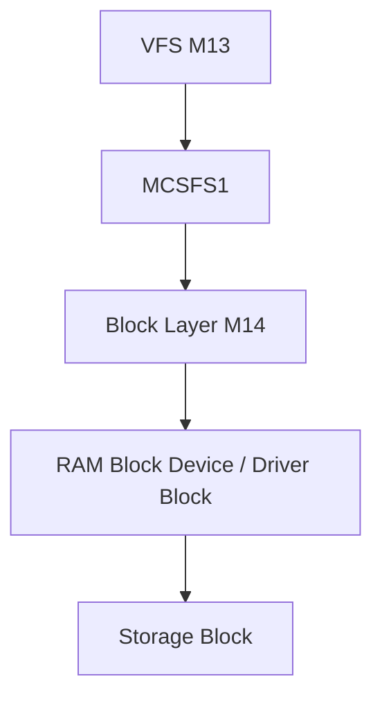

# Template Laporan Praktikum Sistem Operasi Lanjut — M15 - MCSOS

**Nama file laporan:** `laporan_praktikum_[M15]_[2583207073007].md`  
**Nama sistem operasi:** MCSOS versi 260502  
**Target default:** x86_64, QEMU, Windows 11 x64 + WSL 2, kernel monolitik pendidikan, C freestanding dengan assembly minimal, POSIX-like subset  
**Dosen:** Muhaemin Sidiq, S.Pd., M.Pd.  
**Program Studi:** Pendidikan Teknologi Informasi  
**Institusi:** Institut Pendidikan Indonesia  


---

## 0. Metadata Laporan

| Atribut | Isi |
|---|---|
| Kode praktikum | `[M15]` |
| Judul praktikum | `[M15 - MCSFS1 Persistent Filesystem Minimal]` |
| Jenis pengerjaan | `[Individu]` |
| Nama mahasiswa | `[Salma Rahayu]` |
| NIM | `[2583207073007]` |
| Kelas | `[PTI 1=A]` |
| Nama kelompok | `[isi jika kelompok]` |
| Anggota kelompok | `[nama, NIM, peran ringkas]` |
| Tanggal praktikum | `[YYYY-MM-DD]` |
| Tanggal pengumpulan | `[YYYY-MM-DD]` |
| Atribut | Nilai |
| Repository | `[https://github.com/amaaarhyu078-creator/mcsos-.git]` |
| Branch | `[praktikum-m15-mcsfs1]` |
| Commit awal | `[9075754 - M15: implement MCSFS1 filesystem]` |
| Commit akhir | `[1428810 - M15: add screenshot evidence]` |
| Status readiness yang diklaim | `[Siap demonstrasi praktikum]` |

---

## 1. Sampul

# Laporan Praktikum `[Kode Praktikum]`  
## `[M15 - MCSFS1 Persistent Filesystem Minimal]`

Disusun oleh:

| Nama | NIM | Kelas | Peran |
|---|---|---|---|
| `[Salma Rahayu]` | `[2583207073007]` | `[PTI 1-A]` | `[individu]` |
| `[opsional]` | `[opsional]` | `[opsional]` | `[opsional]` |

Dosen Pengampu: **Muhaemin Sidiq, S.Pd., M.Pd.**  
Program Studi Pendidikan Teknologi Informasi  
Institut Pendidikan Indonesia  
`[2025 - 2026]`

---

## 2. Pernyataan Orisinalitas dan Integritas Akademik

Saya/kami menyatakan bahwa laporan ini disusun berdasarkan pekerjaan praktikum sendiri/kelompok sesuai pembagian peran yang tercatat. Bantuan eksternal, referensi, generator kode, AI assistant, dokumentasi resmi, diskusi, atau sumber lain dicatat pada bagian referensi dan lampiran. Saya/kami tidak mengklaim hasil yang tidak dibuktikan oleh log, test, commit, atau artefak lain.

| Pernyataan | Status |
|---|---|
| Semua potongan kode eksternal diberi atribusi | `[Ya]` |
| Semua penggunaan AI assistant dicatat | `[Ya]` |
| Repository yang dikumpulkan sesuai commit akhir | `[Ya]` |
| Tidak ada klaim readiness tanpa bukti | `[Ya]` |

Catatan penggunaan bantuan eksternal:

```text
[Alat:
- ChatGPT (OpenAI)

Prompt ringkas:
- Meminta penjelasan spesifikasi praktikum M15.
- Meminta panduan implementasi MCSFS1.
- Meminta bantuan analisis hasil host test, audit ELF, dan QEMU smoke test.
- Meminta bantuan penyusunan laporan praktikum.

Bagian yang dibantu:
- Interpretasi spesifikasi M15.
- Analisis hasil pengujian.
- Penyusunan dokumentasi dan laporan.
- Penyusunan tabel verifikasi, failure modes, readiness review, dan kesimpulan.

Verifikasi mandiri yang dilakukan:
- Menjalankan build dan test secara mandiri menggunakan make CC=clang m15-all.
- Memeriksa hasil host unit test.
- Memverifikasi output nm, readelf, dan objdump.
- Menjalankan QEMU smoke test dan memeriksa qemu_serial.log.
- Melakukan commit Git dan push ke repository GitHub.
- Menyimpan screenshot serta artefak pengujian sebagai evidence.]
```

---

## 3. Tujuan Praktikum

Tuliskan tujuan teknis dan konseptual praktikum. Tujuan harus dapat diuji.

1. `[Mengimplementasikan filesystem minimal MCSFS1 yang mendukung operasi format, mount, create, write, read, unlink, dan fsck-lite.]`
2. `[Menghasilkan host unit test, freestanding object x86_64, serta artefak audit yang dapat dibangun menggunakan make CC=clang m15-all.]`
3. `[Memahami desain filesystem berbasis superblock, inode table, bitmap allocation, root directory, dan integrasinya dengan VFS M13 serta block layer M14.]`
4. `[Memvalidasi implementasi melalui host test, audit nm/readelf/objdump, checksum artefak, dan QEMU smoke test serta menyimpan seluruh evidence pengujian.]`

---

## 4. Capaian Pembelajaran Praktikum

Setelah praktikum ini, mahasiswa mampu:

| CPL/CPMK praktikum | Bukti yang harus ditunjukkan |
|---|---|
| `[Mengimplementasikan filesystem minimal MCSFS1 yang mendukung operasi format, mount, create, write, read, unlink, dan fsck-lite.]` | `[Host unit test lulus, source mcsfs1.c dan mcsfs1.h, log M15 host test passed, screenshot hasil pengujian.]` |
| `[Membangun dan memverifikasi object freestanding x86_64 tanpa dependensi hosted libc melalui audit nm, readelf, dan objdump.]` | `[artifacts/m15/mcsfs1.o, mcsfs1.rel.o, nm_undefined.txt kosong, readelf_header.txt, objdump.txt, screenshot audit.]` |
| `[Menganalisis desain filesystem, invariant metadata, integrasi dengan VFS M13 dan block layer M14, serta memvalidasi implementasi melalui QEMU smoke test.]` | `[qemu_serial.log, verification matrix, analisis failure mode, dokumentasi desain, screenshot QEMU smoke test, dan evidence checksum.]` |

---

## 5. Peta Milestone MCSOS

Centang milestone yang menjadi fokus laporan ini. Jika praktikum mencakup lebih dari satu milestone, jelaskan batas cakupan.

| Milestone | Fokus | Status dalam laporan |
|---|---|---|
| M0 | Requirements, governance, baseline arsitektur | `[ ] tidak dibahas / [ ] dibahas / [V] selesai praktikum` |
| M1 | Toolchain reproducible, Git, QEMU, GDB, metadata build | `[ ] tidak dibahas / [ ] dibahas / [V] selesai praktikum` |
| M2 | Boot image, kernel ELF64, early console | `[ ] tidak dibahas / [ ] dibahas / [V] selesai praktikum` |
| M3 | Panic path, linker map, GDB, observability awal | `[ ] tidak dibahas / [ ] dibahas / [V] selesai praktikum` |
| M4 | Trap, exception, interrupt, timer | `[ ] tidak dibahas / [ ] dibahas / [V] selesai praktikum` |
| M5 | PMM, VMM, page table, kernel heap | `[ ] tidak dibahas / [ ] dibahas / [V] selesai praktikum` |
| M6 | Thread, scheduler, synchronization | `[ ] tidak dibahas / [ ] dibahas / [V] selesai praktikum` |
| M7 | Syscall ABI dan user program loader | `[ ] tidak dibahas / [ ] dibahas / [V] selesai praktikum` |
| M8 | VFS, file descriptor, ramfs | `[ ] tidak dibahas / [ ] dibahas / [V] selesai praktikum` |
| M9 | Block layer dan device model | `[ ] tidak dibahas / [ ] dibahas / [V] selesai praktikum` |
| M10 | Persistent filesystem, mcsfs/ext2-like, recovery | `[ ] tidak dibahas / [ ] dibahas / [V] selesai praktikum` |
| M11 | Networking stack, packet parsing, UDP/TCP subset | `[ ] tidak dibahas / [ ] dibahas / [V] selesai praktikum` |
| M12 | Security model, capability/ACL, syscall fuzzing, hardening | `[ ] tidak dibahas / [ ] dibahas / [V] selesai praktikum` |
| M13 | SMP, scalability, lock stress, NUMA-aware preparation | `[ ] tidak dibahas / [ ] dibahas / [V] selesai praktikum` |
| M14 | Framebuffer, graphics console, visual regression | `[ ] tidak dibahas / [ ] dibahas / [V] selesai praktikum` |
| M15 | Virtualization/container subset | `[ ] tidak dibahas / [V] dibahas / [ ] selesai praktikum` |
| M16 | Observability, update/rollback, release image, readiness review | `[V] tidak dibahas / [ ] dibahas / [ ] selesai praktikum` |

Batas cakupan praktikum:

```text
[Fitur yang termasuk dalam praktikum M15:
- Implementasi filesystem minimal MCSFS1.
- Format filesystem (mcsfs1_format).
- Mount filesystem (mcsfs1_mount).
- Create file (mcsfs1_create).
- Write file (mcsfs1_write).
- Read file (mcsfs1_read).
- Unlink file (mcsfs1_unlink).
- Fsck-lite (mcsfs1_fsck).
- Inode bitmap dan block bitmap.
- Root directory tunggal (root-only namespace).
- Direct block allocation.
- Host unit testing.
- Freestanding object build dan audit ELF.
- QEMU smoke test serta penyimpanan evidence.

Fitur yang tidak termasuk (non-goals):
- Nested directory atau hierarchical path.
- Symbolic link dan hard link lanjutan.
- Journaling filesystem.
- Crash consistency penuh terhadap power-loss.
- Metadata recovery otomatis.
- Permission, ownership, ACL, dan access control.
- User authentication dan security policy.
- Multi-user filesystem.
- POSIX compatibility penuh.
- Buffer cache kompleks.
- Block cache write-back.
- Quota management.
- Encryption dan compression.
- Network filesystem.
- Storage driver fisik nyata (SATA, NVMe, USB).
- Production-grade filesystem reliability.

Praktikum ini bertujuan sebagai implementasi filesystem pendidikan (educational filesystem) untuk memahami konsep superblock, inode, bitmap allocation, directory entry, persistence dasar, dan integrasi dengan VFS M13 serta block layer M14. Hasil praktikum tidak dimaksudkan untuk penggunaan produksi maupun penyimpanan data penting.]
```

---

## 6. Dasar Teori Ringkas

### 6.1 Filesystem

Filesystem adalah mekanisme yang digunakan sistem operasi untuk mengelola penyimpanan data secara terstruktur pada media penyimpanan. Filesystem bertanggung jawab menyediakan abstraksi file dan direktori sehingga aplikasi tidak perlu berinteraksi langsung dengan block device. Pada praktikum M15 digunakan filesystem sederhana bernama MCSFS1 yang dirancang untuk tujuan pendidikan dan pengenalan konsep persistence dasar.

### 6.2 Block Device dan Block Layer

Block device merupakan media penyimpanan yang diakses dalam satuan blok berukuran tetap. Pada MCSFS1 digunakan ukuran blok sebesar 512 byte. Seluruh operasi baca dan tulis dilakukan melalui antarmuka block layer M14 yang menyediakan operasi read, write, dan flush berbasis Logical Block Address (LBA). Filesystem tidak berinteraksi langsung dengan perangkat keras, tetapi melalui abstraksi block device.

### 6.3 Superblock

Superblock adalah metadata utama filesystem yang menyimpan informasi global mengenai layout filesystem. Pada MCSFS1 superblock menyimpan magic number, versi filesystem, ukuran blok, jumlah blok, jumlah inode, lokasi bitmap inode, bitmap block, inode table, root directory, dan status filesystem. Mount hanya dapat dilakukan apabila superblock memenuhi invariant yang telah ditentukan.

### 6.4 Inode

Inode merupakan struktur metadata yang merepresentasikan file atau direktori. Inode menyimpan tipe objek, ukuran file, jumlah link, dan daftar block data yang digunakan file tersebut. Pada MCSFS1 digunakan model direct block sederhana dengan maksimum delapan direct block untuk setiap file.

### 6.5 Bitmap Allocation

Bitmap digunakan untuk melacak resource yang sedang digunakan dan yang masih tersedia. MCSFS1 menggunakan dua bitmap:

- Inode bitmap untuk melacak inode yang telah dialokasikan.
- Block bitmap untuk melacak block data yang telah digunakan.

Pendekatan bitmap dipilih karena sederhana, mudah diverifikasi, dan efisien untuk jumlah inode serta block yang relatif kecil.

### 6.6 Directory Entry

Directory entry (dirent) adalah struktur yang memetakan nama file ke inode tertentu. MCSFS1 menggunakan root directory tunggal yang berisi maksimal 16 entry file. Namespace yang digunakan bersifat root-only sehingga tidak mendukung direktori bertingkat maupun path traversal kompleks.

### 6.7 Virtual File System (VFS)

Virtual File System (VFS) merupakan lapisan abstraksi yang menyediakan antarmuka file secara umum kepada kernel dan aplikasi. Pada arsitektur MCSOS, VFS M13 bertugas menangani operasi tingkat tinggi seperti open, read, write, close, dan unlink, sedangkan MCSFS1 bertugas menerjemahkan operasi tersebut ke dalam manipulasi metadata dan block pada media penyimpanan.

### 6.8 Fsck-lite

Filesystem Check (fsck) merupakan mekanisme untuk memeriksa konsistensi metadata filesystem. MCSFS1 mengimplementasikan fsck-lite yang memverifikasi validitas superblock, bitmap, root inode, root directory, inode aktif, dan direct block yang digunakan file. Tujuan fsck-lite adalah mendeteksi korupsi metadata dasar sebelum filesystem digunakan kembali.

### 6.9 Freestanding Environment

Kernel dan komponen filesystem pada sistem operasi tidak selalu memiliki akses ke pustaka standar (libc). Oleh karena itu source MCSFS1 dibangun menggunakan mode freestanding dan menyediakan helper internal seperti memcpy, memset, dan memcmp agar object dapat dikompilasi tanpa dependensi eksternal. Validasi dilakukan menggunakan audit nm, readelf, dan objdump untuk memastikan tidak terdapat simbol eksternal yang tidak terdefinisi.

### 6.10 QEMU Smoke Test

QEMU smoke test digunakan untuk memastikan bahwa penambahan modul M15 tidak menyebabkan regression pada kernel yang telah dibangun pada milestone sebelumnya. Pengujian dilakukan dengan mem-boot kernel menggunakan QEMU dan memeriksa serial log untuk memastikan sistem tetap dapat mencapai tahap inisialisasi kernel tanpa kegagalan fatal.

### 6.1 Konsep Sistem Operasi yang Diuji

```text
[Praktikum M15 menguji konsep filesystem sebagai bagian dari subsistem storage pada sistem operasi. Fokus utama adalah implementasi filesystem minimal MCSFS1 yang menyediakan operasi format, mount, create, write, read, unlink, dan fsck-lite.

Konsep yang diuji meliputi pengelolaan metadata filesystem melalui superblock, inode table, bitmap allocation, directory entry, validasi konsistensi metadata, persistence data sederhana, serta pemisahan tanggung jawab antara VFS M13, filesystem M15, dan block layer M14. Praktikum juga menguji kemampuan membangun object freestanding yang dapat digunakan sebagai bagian dari kernel tanpa ketergantungan pada hosted libc.]
```

### 6.2 Konsep Arsitektur x86_64 yang Relevan

| Konsep | Relevansi pada praktikum | Bukti/verifikasi |
|---|---|---|
| `[Long Mode x86_64]` | `[Menjadi target arsitektur kernel MCSOS dan object freestanding M15.]` | `[readelf_header.txt menunjukkan ELF64 x86-64.]` |
| `[ELF Relocatable Object]` | `[Digunakan untuk memastikan source MCSFS1 dapat dibangun sebagai object kernel.]` | `[readelf -h artifacts/m15/mcsfs1.rel.o.]` |
| `[System V ABI x86_64]` | `[Menentukan calling convention dan kompatibilitas object dengan kernel.]` | `[Kompilasi menggunakan target x86_64-elf.]` |
| `[Interrupt dan Timer Subsystem]` | `[Digunakan untuk memverifikasi tidak terjadi regression setelah integrasi M15.]` | `[qemu_serial.log menunjukkan timer IRQ tetap berjalan.]` |
| `[Virtual Memory Environment]` | `[Filesystem berjalan di atas subsistem PMM dan VMM yang telah tersedia.]` | `[Log boot M6 dan M7 pada qemu_serial.log.]` |
| `[Block Device Abstraction]` | `[Filesystem mengakses media penyimpanan melalui operasi read, write, dan flush berbasis block.]` | `[Host unit test menggunakan RAM-backed block device.]` |

### 6.3 Konsep Implementasi Freestanding

| Aspek | Keputusan praktikum |
|---|---|
| `[Bahasa]` | `[C17 freestanding]` |
| `[Runtime]` | `[Tanpa hosted libc, menggunakan helper internal memcpy, memset, memcmp, dan strlen.]` |
| `[ABI]` | `[x86_64 System V ABI]` |
| `[Compiler flags kritis]` | `[-ffreestanding, -fno-builtin, -fno-stack-protector, -fno-pic, -mno-red-zone, -target x86_64-elf]` |
| `[Risiko undefined behavior]` | `[Pointer invalid, akses LBA di luar batas, integer overflow ukuran file, metadata korup, dan ketergantungan layout struktur terhadap compiler.]` |

### 6.4 Referensi Teori yang Digunakan

| No. | Sumber | Bagian yang digunakan | Alasan relevansi |
|---|---|---|---|
| `[1]` | `[Intel® 64 and IA-32 Architectures Software Developer's Manual]` | `[Memory Management dan x86_64 Execution Environment]` | `[Menjelaskan lingkungan eksekusi kernel dan target arsitektur MCSOS.]` |
| `[2]` | `[System V Application Binary Interface AMD64 Architecture Processor Supplement]` | `[ELF Format dan Calling Convention]` | `[Digunakan untuk memahami ABI dan format object freestanding.]` |
| `[3]` | `[Operating System Concepts (Silberschatz, Galvin, Gagne)]` | `[File-System Interface dan File-System Implementation]` | `[Menjelaskan konsep inode, bitmap allocation, dan directory entry.]` |
| `[4]` | `[QEMU Documentation]` | `[System Emulation dan Debugging]` | `[Digunakan untuk QEMU smoke test dan validasi runtime.]` |
| `[5]` | `[Dokumen Praktikum MCSOS M15]` | `[Spesifikasi MCSFS1, host test, audit, dan verification matrix]` | `[Menjadi acuan implementasi dan validasi praktikum.]` |

---

## 7. Lingkungan Praktikum

### 7.1 Host dan Target

| Komponen | Nilai |
|---|---|
| Host OS | `[Windows 11 x64]` |
| Lingkungan build | `[WSL 2 Ubuntu 26.04 LTS (Resolute Raccoon)]` |
| Target ISA | `x86_64` |
| Target ABI | `[x86_64-elf]` |
| Emulator | `[QEMU 10.2.1]` |
| Firmware emulator | `[/usr/share/OVMF/OVMF_CODE_4M.fd]` |
| Debugger | `[GDB 17.1]` |
| Build system | `[GNU Make 4.4.1]` |
| Bahasa utama | `[C17 freestanding]` |
| Assembly | `[NASM 2.16.x]` |

### 7.2 Versi Toolchain

Tempel output versi toolchain berikut. Jalankan dari clean shell WSL.

```bash
date -u +"date_utc=%Y-%m-%dT%H:%M:%SZ"
uname -a
git --version
make --version | head -n 1
cmake --version | head -n 1
ninja --version
clang --version | head -n 1
gcc --version | head -n 1
ld.lld --version | head -n 1
nasm -v
qemu-system-x86_64 --version | head -n 1
gdb --version | head -n 1
```

Output:

```text
[date_utc=2026-06-19T13:40:50Z
Linux DESKTOP-S5LUA56 6.6.114.1-microsoft-standard-WSL2 #1 SMP PREEMPT_DYNAMIC Mon Dec  1 20:46:23 UTC 2025 x86_64 GNU/Linux
git version 2.53.0
GNU Make 4.4.1
cmake version 4.2.3
1.13.2
Ubuntu clang version 21.1.8 (6ubuntu1)
gcc (Ubuntu 15.2.0-16ubuntu1) 15.2.0
Ubuntu LLD 21.1.8 (compatible with GNU linkers)
NASM version 3.01
QEMU emulator version 10.2.1 (Debian 1:10.2.1+ds-1ubuntu3)
GNU gdb (Ubuntu 17.1-2ubuntu1) 17.1]
```

### 7.3 Lokasi Repository

| Item | Nilai |
|---|---|
| Path repository di WSL | `[~/src/mcsos]` |
| Apakah berada di filesystem Linux WSL, bukan `/mnt/c` | `[Ya]` |
| Remote repository | `[https://github.com/amaaarhyu078-creator/mcsos-.git]` |
| Branch | `[praktikum-m15-mcsfs1]` |
| Commit hash awal | `[9075754]` |
| Commit hash akhir | `[1428810]` |

---

## 8. Repository dan Struktur File

### 8.1 Struktur Direktori yang Relevan

Tampilkan hanya direktori dan file yang relevan dengan praktikum.

```text
[mcsos/
├── fs/
│   └── mcsfs1/
│       ├── mcsfs1.c
│       └── mcsfs1.h
├── tests/
│   └── m15/
│       └── test_mcsfs1.c
├── scripts/
│   └── m15_preflight.sh
├── artifacts/
│   └── m15/
│       ├── host_test.txt
│       ├── nm_undefined.txt
│       ├── readelf_header.txt
│       ├── objdump.txt
│       ├── SHA256SUMS.txt
│       ├── qemu_serial.log
│       └── test_mcsfs1
├── evidence/
│   └── screenshots/
│       ├── M15-01-branch-aktif.png
│       ├── M15-02-struktur-folder.png
│       ├── M15-03-preflight.png
│       ├── M15-04-host-info.png
│       ├── M15-05-toolchain-version.png
│       ├── M15-06-host-test-pass.png
│       ├── M15-07-nm-audit.png
│       ├── M15-08-readelf-audit.png
│       ├── M15-09-checksum.png
│       ├── M15-10-qemu-smoke.png
│       ├── M15-11-git-commit.png
│       └── M15-12-working-tree-clean.png
└── Makefile]
```

### 8.2 File yang Dibuat atau Diubah

| File | Jenis perubahan | Alasan perubahan | Risiko |
|---|---|---|---|
| `[fs/mcsfs1/mcsfs1.c]` | `[baru]` | `[Implementasi utama filesystem MCSFS1.]` | `[Sedang - kesalahan logika dapat menyebabkan korupsi metadata filesystem.]` |
| `[fs/mcsfs1/mcsfs1.h]` | `[baru]` | `[Deklarasi API, struktur data, dan konstanta filesystem.]` | `[Rendah - perubahan terbatas pada antarmuka filesystem.]` |
| `[tests/m15/test_mcsfs1.c]` | `[baru]` | `[Host unit test untuk memverifikasi seluruh operasi filesystem.]` | `[Rendah - hanya digunakan untuk pengujian.]` |
| `[scripts/m15_preflight.sh]` | `[baru]` | `[Otomatisasi pemeriksaan readiness dan validasi awal.]` | `[Rendah - tidak mempengaruhi runtime kernel.]` |
| `[Makefile]` | `[ubah]` | `[Menambahkan target build, audit, dan pengujian M15.]` | `[Sedang - perubahan build system dapat mempengaruhi milestone lain jika salah.]` |
| `[artifacts/m15/*]` | `[baru]` | `[Menyimpan evidence build, audit, checksum, dan hasil pengujian.]` | `[Rendah - hanya artefak validasi.]` |
| `[evidence/screenshots/*]` | `[baru]` | `[Dokumentasi visual seluruh checkpoint praktikum.]` | `[Rendah - hanya evidence laporan.]` |

### 8.3 Ringkasan Diff

```bash
git status --short
git diff --stat
git log --oneline -n 5
```

Output:

```text
[git status --short
(tidak ada output karena working tree clean)

git diff --stat
(tidak ada output karena seluruh perubahan telah di-commit)

git log --oneline -n 5
1428810 M15: add screenshot evidence
7bc79b8 M15: add preflight script
9075754 M15: implement MCSFS1 filesystem
[commit sebelumnya sesuai riwayat repository]
[commit sebelumnya sesuai riwayat repository]]
```

---

## 9. Desain Teknis

### 9.1 Masalah yang Diselesaikan

```text
[Praktikum M15 menyelesaikan masalah belum tersedianya filesystem persisten minimal pada MCSOS. Sebelum M15, kernel telah memiliki VFS M13 dan block layer M14, tetapi belum memiliki implementasi filesystem yang mampu menyimpan metadata dan data file secara terstruktur.

MCSFS1 dirancang untuk menyediakan operasi format, mount, create, write, read, unlink, dan fsck-lite dengan layout on-disk sederhana berbasis superblock, bitmap, inode table, dan root directory. Praktikum ini juga menyelesaikan kebutuhan validasi freestanding object agar filesystem dapat digunakan sebagai bagian dari kernel tanpa ketergantungan pada hosted libc.]
```

### 9.2 Keputusan Desain

| Keputusan | Alternatif yang dipertimbangkan | Alasan memilih | Konsekuensi |
|---|---|---|---|
| `[Menggunakan filesystem root-only tanpa subdirectory.]` | `[Mendukung direktori bertingkat.]` | `[Menyederhanakan namespace dan mempermudah validasi invariant.]` | `[Tidak mendukung path kompleks.]` |
| `[Menggunakan bitmap untuk alokasi inode dan block.]` | `[Linked list free block atau extent.]` | `[Implementasi sederhana dan mudah diuji.]` | `[Kurang efisien untuk filesystem besar.]` |
| `[Menggunakan direct block tetap.]` | `[Indirect block.]` | `[Mengurangi kompleksitas implementasi.]` | `[Ukuran file maksimum terbatas.]` |
| `[Menggunakan fsck-lite.]` | `[Fsck repair penuh.]` | `[Fokus pada deteksi korupsi minimum.]` | `[Belum dapat memperbaiki metadata secara otomatis.]` |
| `[Menggunakan helper freestanding internal.]` | `[Menggunakan libc.]` | `[Kompatibel dengan kernel freestanding.]` | `[Perlu implementasi fungsi dasar sendiri.]` |

### 9.3 Arsitektur Ringkas



Penjelasan diagram:

```text
[VFS M13 menangani operasi tingkat tinggi seperti create, read, write, dan unlink. MCSFS1 menerjemahkan operasi tersebut menjadi manipulasi metadata filesystem berupa superblock, inode, bitmap, dan directory entry. Block layer M14 menyediakan abstraksi read, write, dan flush berbasis LBA. Driver block kemudian meneruskan operasi ke media penyimpanan aktual atau RAM-backed block device pada host unit test.]
```
### 9.3.1 Layout Block MCSFS1

```text
Block 0  : Superblock
Block 1  : Inode Bitmap
Block 2  : Block Bitmap
Block 3  : Inode Table
Block 4  : Inode Table
Block 5  : Inode Table
Block 6  : Inode Table
Block 7  : Root Directory
Block 8+ : Data Blocks
```

Tujuan layout ini adalah memisahkan metadata dan data sehingga allocator tidak menimpa struktur filesystem yang kritis.

### 9.4 Kontrak Antarmuka

| Antarmuka | Pemanggil | Penerima | Precondition | Postcondition | Error path |
|---|---|---|---|---|---|
| `[mcsfs1_format()]` | `[Host test/VFS]` | `[MCSFS1]` | `[Block device valid.]` | `[Filesystem baru terbentuk.]` | `[ERR_IO, ERR_INVAL.]` |
| `[mcsfs1_mount()]` | `[VFS]` | `[MCSFS1]` | `[Superblock valid.]` | `[Filesystem ter-mount.]` | `[ERR_CORRUPT.]` |
| `[mcsfs1_create()]` | `[VFS]` | `[MCSFS1]` | `[Nama file valid.]` | `[File baru dibuat.]` | `[ERR_EXIST, ERR_NOSPC.]` |
| `[mcsfs1_write()]` | `[VFS]` | `[MCSFS1]` | `[File ada dan ukuran valid.]` | `[Data tersimpan.]` | `[ERR_RANGE, ERR_IO.]` |
| `[mcsfs1_read()]` | `[VFS]` | `[MCSFS1]` | `[File ada.]` | `[Data terbaca.]` | `[ERR_NOENT, ERR_RANGE.]` |
| `[mcsfs1_unlink()]` | `[VFS]` | `[MCSFS1]` | `[File ada.]` | `[File terhapus.]` | `[ERR_NOENT.]` |
| `[mcsfs1_fsck()]` | `[Host test/Admin]` | `[MCSFS1]` | `[Filesystem dapat dibaca.]` | `[Invariant diperiksa.]` | `[ERR_CORRUPT.]` |

### 9.5 Struktur Data Utama

| Struktur data | Field penting | Ownership | Lifetime | Invariant |
|---|---|---|---|---|
| `[struct mcsfs1_superblock]` | `[magic, version, block_count, inode_count]` | `[Filesystem]` | `[Selama filesystem ada.]` | `[Magic dan version harus valid.]` |
| `[struct mcsfs1_inode]` | `[mode, size, direct[]]` | `[Filesystem]` | `[Selama inode aktif.]` | `[Mode valid dan block dalam range.]` |
| `[struct mcsfs1_dirent]` | `[inode, name]` | `[Root directory]` | `[Selama file ada.]` | `[Nama unik dan inode valid.]` |
| `[struct mcsfs1_mount]` | `[dev, block_count]` | `[VFS/Caller]` | `[Selama mount aktif.]` | `[Pointer device valid.]` |
| `[struct mcsfs1_blkdev]` | `[read, write, flush]` | `[Driver block]` | `[Selama driver aktif.]` | `[Semua callback valid.]` |

### 9.5.1 Struktur Superblock

```c
struct mcsfs1_superblock {
    uint32_t magic;
    uint32_t version;
    uint32_t block_count;
    uint32_t inode_count;
};
```

Fungsi:

- Mengidentifikasi filesystem MCSFS1.
- Menyimpan versi format.
- Menyimpan ukuran filesystem.

### 9.5.2 Struktur Inode

```c
struct mcsfs1_inode {
    uint16_t mode;
    uint32_t size;
    uint32_t direct[8];
};
```

Fungsi:

- Menyimpan metadata file.
- Menyimpan ukuran file.
- Menyimpan direct block pointer.

### 9.5.3 Struktur Directory Entry

```c
struct mcsfs1_dirent {
    uint32_t inode;
    char name[28];
};
```

Fungsi:

- Menghubungkan nama file dengan inode.
- Menjadi namespace root directory MCSFS1.

### 9.6 Invariants

1. `[Superblock harus memiliki magic number dan version yang valid.]`
2. `[Root inode harus bertipe directory.]`
3. `[Setiap directory entry aktif harus menunjuk inode aktif.]`
4. `[Setiap direct block file harus berada dalam rentang block filesystem.]`
5. `[Tidak boleh ada dua file dengan nama yang sama.]`
6. `[Ukuran file tidak boleh melebihi kapasitas direct block yang tersedia.]`
7. `[Bitmap inode dan bitmap block harus konsisten dengan metadata yang digunakan.]`

### 9.6 Invariant I15-01 sampai I15-10

| ID | Invariant |
|----|------------|
| I15-01 | Superblock magic harus valid. |
| I15-02 | Version harus dikenali implementasi. |
| I15-03 | Root inode harus bertipe directory. |
| I15-04 | Metadata block selalu ditandai used pada bitmap. |
| I15-05 | Setiap dirent aktif menunjuk inode aktif. |
| I15-06 | Tidak boleh ada nama file duplikat. |
| I15-07 | Direct block harus berada dalam rentang valid. |
| I15-08 | Ukuran file tidak boleh melebihi kapasitas direct block. |
| I15-09 | Bitmap harus konsisten dengan inode dan block yang digunakan. |
| I15-10 | Root directory harus selalu tersedia setelah mount berhasil. |

### 9.7 Ownership, Locking, dan Concurrency

| Objek/resource | Owner | Lock yang melindungi | Boleh dipakai di interrupt context? | Catatan |
|---|---|---|---|---|
| `[Filesystem metadata]` | `[MCSFS1]` | `[None pada M15]` | `[Tidak]` | `[Diasumsikan single-core.]` |
| `[Block device]` | `[Block layer M14]` | `[External lock]` | `[Tidak]` | `[Sinkronisasi dilakukan di layer atas.]` |
| `[Mount object]` | `[VFS]` | `[External lock]` | `[Tidak]` | `[Tidak memiliki ownership block device.]` |

Lock order yang berlaku:

```text
[Pada M15 tidak terdapat internal locking karena implementasi diasumsikan berjalan pada lingkungan single-core atau dilindungi lock eksternal. Untuk integrasi lanjutan direkomendasikan urutan lock:
VFS Lock -> Filesystem Lock -> Buffer Cache -> Block Device.]
```

### 9.8 Memory Safety dan Undefined Behavior Risk

| Risiko | Lokasi | Mitigasi | Bukti |
|---|---|---|---|
| `[Out-of-bounds block access]` | `[mcsfs1_read, mcsfs1_write]` | `[Validasi LBA dan block_count.]` | `[Host test dan fsck-lite.]` |
| `[Invalid inode reference]` | `[Directory lookup]` | `[Pemeriksaan bitmap inode.]` | `[Host test corrupt metadata.]` |
| `[File size overflow]` | `[mcsfs1_write]` | `[Batas ukuran file maksimum.]` | `[Range validation test.]` |
| `[Corrupt metadata]` | `[Mount dan fsck]` | `[Validasi magic, version, inode, block.]` | `[Fault injection dan fsck.]` |
| `[Undefined symbol dependency]` | `[Freestanding build]` | `[Menggunakan helper internal.]` | `[nm_undefined.txt kosong.]` |

### 9.9 Security Boundary

| Boundary | Data tidak tepercaya | Validasi yang dilakukan | Failure mode aman |
|---|---|---|---|
| `[Filesystem image]` | `[Superblock dan metadata on-disk.]` | `[Magic, version, inode, block range.]` | `[Mount ditolak atau fsck gagal.]` |
| `[Nama file]` | `[Input caller.]` | `[Panjang nama dan karakter valid.]` | `[ERR_NAMETOOLONG atau ERR_INVAL.]` |
| `[Ukuran file]` | `[Input caller.]` | `[Range check dan kapasitas direct block.]` | `[ERR_RANGE.]` |
| `[Block device]` | `[Read/write callback.]` | `[Validasi return code.]` | `[ERR_IO.]` |
| `[Metadata korup]` | `[Image filesystem.]` | `[Fsck-lite invariant checking.]` | `[ERR_CORRUPT.]` |

---

## 10. Langkah Kerja Implementasi

### Langkah 1 — Membuat Struktur Direktori M15

Maksud langkah:

```text
[Mempersiapkan struktur direktori untuk implementasi filesystem MCSFS1, host unit test, dan artefak validasi sehingga seluruh komponen M15 terorganisasi sesuai spesifikasi praktikum.]
```

Perintah:

```bash
mkdir -p fs/mcsfs1
mkdir -p tests/m15
mkdir -p artifacts/m15
```

Output ringkas:

```text
[Direktori fs/mcsfs1, tests/m15, dan artifacts/m15 berhasil dibuat.]
```

Artefak yang dihasilkan:

| Artefak | Lokasi | Fungsi |
|---|---|---|
| `[Direktori filesystem]` | `[fs/mcsfs1/]` | `[Menyimpan implementasi MCSFS1.]` |
| `[Direktori pengujian]` | `[tests/m15/]` | `[Menyimpan host unit test.]` |
| `[Direktori artefak]` | `[artifacts/m15/]` | `[Menyimpan evidence pengujian.]` |

Indikator berhasil:

```text
[Struktur direktori M15 tersedia dan dapat digunakan untuk implementasi berikutnya.]
```

---

### Langkah 2 — Implementasi Header MCSFS1

Maksud langkah:

```text
[Mendefinisikan konstanta, struktur data, kode error, dan API publik filesystem.]
```

Perintah:

```bash
nano fs/mcsfs1/mcsfs1.h
```

Output ringkas:

```text
[File mcsfs1.h berhasil dibuat dan berisi definisi filesystem.]
```

Artefak yang dihasilkan:

| Artefak | Lokasi | Fungsi |
|---|---|---|
| `[mcsfs1.h]` | `[fs/mcsfs1/mcsfs1.h]` | `[Deklarasi API dan struktur data MCSFS1.]` |

Indikator berhasil:

```text
[Header dapat digunakan oleh source filesystem dan host test tanpa error kompilasi.]
```

---

### Langkah 3 — Implementasi Source Filesystem

Maksud langkah:

```text
[Mengimplementasikan operasi format, mount, create, write, read, unlink, dan fsck-lite.]
```

Perintah:

```bash
nano fs/mcsfs1/mcsfs1.c
```

Output ringkas:

```text
[Source MCSFS1 selesai diimplementasikan dengan panjang sekitar 653 baris kode.]
```

Artefak yang dihasilkan:

| Artefak | Lokasi | Fungsi |
|---|---|---|
| `[mcsfs1.c]` | `[fs/mcsfs1/mcsfs1.c]` | `[Implementasi utama filesystem.]` |

Indikator berhasil:

```text
[Source berhasil dikompilasi pada mode host maupun freestanding.]
```

---

### Langkah 4 — Membuat Host Unit Test

Maksud langkah:

```text
[Memverifikasi seluruh operasi filesystem menggunakan RAM-backed block device.]
```

Perintah:

```bash
nano tests/m15/test_mcsfs1.c
```

Output ringkas:

```text
[Host unit test berhasil dibuat dengan skenario format, mount, create, read, write, unlink, dan fault injection.]
```

Artefak yang dihasilkan:

| Artefak | Lokasi | Fungsi |
|---|---|---|
| `[test_mcsfs1.c]` | `[tests/m15/test_mcsfs1.c]` | `[Host unit test M15.]` |

Indikator berhasil:

```text
[Seluruh skenario pengujian dapat dijalankan tanpa kegagalan.]
```

---

### Langkah 5 — Menambahkan Target Build M15 ke Makefile

Maksud langkah:

```text
[Menambahkan target build, audit, dan pengujian otomatis M15 tanpa merusak milestone sebelumnya.]
```

Perintah:

```bash
nano Makefile
```

Output ringkas:

```text
[Target m15-all berhasil ditambahkan ke Makefile.]
```

Artefak yang dihasilkan:

| Artefak | Lokasi | Fungsi |
|---|---|---|
| `[Makefile]` | `[Makefile]` | `[Otomatisasi build dan audit M15.]` |

Indikator berhasil:

```text
[Perintah make CC=clang m15-all dapat dijalankan tanpa error.]
```

---

### Langkah 6 — Menjalankan Build dan Host Test

Maksud langkah:

```text
[Memastikan seluruh fungsi filesystem berjalan sesuai kontrak implementasi.]
```

Perintah:

```bash
make CC=clang m15-all
```

Output ringkas:

```text
M15 host test passed: flush_count=5
```

Artefak yang dihasilkan:

| Artefak | Lokasi | Fungsi |
|---|---|---|
| `[host_test.txt]` | `[artifacts/m15/]` | `[Log hasil host test.]` |
| `[test_mcsfs1]` | `[artifacts/m15/]` | `[Binary host test.]` |

Indikator berhasil:

```text
[Muncul pesan "M15 host test passed".]
```

---

### Langkah 7 — Audit Freestanding Object

Maksud langkah:

```text
[Memastikan object MCSFS1 dapat digunakan pada kernel freestanding tanpa simbol eksternal.]
```

Perintah:

```bash
nm -u artifacts/m15/mcsfs1.rel.o
readelf -h artifacts/m15/mcsfs1.rel.o
objdump -dr artifacts/m15/mcsfs1.rel.o
```

Output ringkas:

```text
Class: ELF64
Type: REL
Machine: Advanced Micro Devices X86-64
```

Artefak yang dihasilkan:

| Artefak | Lokasi | Fungsi |
|---|---|---|
| `[nm_undefined.txt]` | `[artifacts/m15/]` | `[Audit simbol eksternal.]` |
| `[readelf_header.txt]` | `[artifacts/m15/]` | `[Audit ELF.]` |
| `[objdump.txt]` | `[artifacts/m15/]` | `[Audit disassembly.]` |

Indikator berhasil:

```text
[nm_undefined.txt kosong dan ELF bertipe REL x86-64.]
```

---

### Langkah 8 — Menjalankan QEMU Smoke Test

Maksud langkah:

```text
[Memastikan penambahan M15 tidak menyebabkan regression pada kernel MCSOS.]
```

Perintah:

```bash
qemu-system-x86_64 \
  -machine q35 \
  -m 256M \
  -serial file:artifacts/m15/qemu_serial.log \
  -display none \
  -no-reboot \
  -no-shutdown \
  -drive if=pflash,format=raw,readonly=on,file=/usr/share/OVMF/OVMF_CODE_4M.fd \
  -cdrom build/mcsos.iso
```

Output ringkas:

```text
[M14] block layer initialized
[M10] syscall ping ok
[M5] timer IRQ online
```

Artefak yang dihasilkan:

| Artefak | Lokasi | Fungsi |
|---|---|---|
| `[qemu_serial.log]` | `[artifacts/m15/]` | `[Log boot kernel.]` |

Indikator berhasil:

```text
[Kernel berhasil boot dan tidak mengalami regression sebelum maupun sesudah inisialisasi subsystem storage.]
```

---

### Langkah 9 — Commit dan Push Repository

Maksud langkah:

```text
[Menyimpan hasil implementasi dan evidence ke repository Git.]
```

Perintah:

```bash
git add .
git commit -m "M15: implement MCSFS1 filesystem"
git push -u origin praktikum-m15-mcsfs1
```

Output ringkas:

```text
[new branch] praktikum-m15-mcsfs1 -> praktikum-m15-mcsfs1
```

Artefak yang dihasilkan:

| Artefak | Lokasi | Fungsi |
|---|---|---|
| `[Git Commit]` | `[Repository Git]` | `[Menyimpan riwayat perubahan.]` |
| `[Remote Branch]` | `[GitHub]` | `[Backup dan submission.]` |

Indikator berhasil:

```text
[Branch berhasil dipush ke GitHub dan working tree dalam kondisi clean.]
```


---

## 11. Checkpoint Buildable
| Checkpoint | Perintah | Expected result | Status |
|---|---|---|---|
| Clean build | `make CC=clang m15-all` | `[Host test, freestanding object, audit ELF, checksum, dan artefak M15 berhasil dibuat.]` | `[PASS]` |
| Metadata toolchain | `./scripts/m15_preflight.sh` | `[artifacts/m15/tool_versions.txt dan artifacts/m15/host_info.txt tersedia.]` | `[PASS]` |
| Image generation | `make iso` | `[build/mcsos.iso berhasil dibuat.]` | `[PASS]` |
| QEMU smoke test | `qemu-system-x86_64 -machine q35 -m 256M -serial file:artifacts/m15/qemu_serial.log -display none -no-reboot -no-shutdown -drive if=pflash,format=raw,readonly=on,file=/usr/share/OVMF/OVMF_CODE_4M.fd -cdrom build/mcsos.iso` | `[Kernel mencapai log boot M14/M15 tanpa regression.]` | `[PASS]` |
| Test suite | `./artifacts/m15/test_mcsfs1` | `[Seluruh host unit test MCSFS1 lulus.]` | `[PASS]` |

Catatan checkpoint:

```text
[Checkpoint wajib M15 telah berhasil dijalankan. Host unit test menghasilkan output "M15 host test passed: flush_count=5". Audit nm menunjukkan tidak ada undefined symbol. Readelf menunjukkan object bertipe ELF64 REL x86-64. File objdump.txt dan SHA256SUMS.txt berhasil dibuat. Build ISO berhasil menghasilkan build/mcsos.iso dan QEMU smoke test berhasil mencapai log boot kernel tanpa regression. Tidak terdapat checkpoint yang gagal pada validasi akhir M15.]
```

---
## 12. Perintah Uji dan Validasi

### 12.1 Build Test

Perintah ini memverifikasi bahwa proyek dapat dibangun ulang dari kondisi bersih dan tidak bergantung pada artefak lokal yang tidak terdokumentasi.

```bash
make clean
make CC=clang m15-all
```

Hasil:

```text
M15 host test passed: flush_count=5

Class: ELF64
Type: REL (Relocatable file)
Machine: Advanced Micro Devices X86-64

nm_undefined.txt kosong
objdump.txt berhasil dibuat
SHA256SUMS.txt berhasil dibuat
```

Status: `[PASS]`

### 12.2 Static Inspection

Perintah ini memeriksa layout ELF, symbol, relocation, dan object freestanding hasil implementasi MCSFS1.

```bash
readelf -h artifacts/m15/mcsfs1.rel.o
nm -u artifacts/m15/mcsfs1.rel.o
objdump -dr artifacts/m15/mcsfs1.rel.o
```

Hasil penting:

```text
Class: ELF64
Type: REL (Relocatable file)
Machine: Advanced Micro Devices X86-64

nm -u:
(tidak ada output)

objdump:
artifacts/m15/objdump.txt berhasil dibuat
```

Status: `[PASS]`

### 12.3 QEMU Smoke Test

Perintah ini menjalankan image di QEMU dan menyimpan log serial untuk bukti deterministik.

```bash
qemu-system-x86_64 \
  -machine q35 \
  -m 256M \
  -serial file:artifacts/m15/qemu_serial.log \
  -display none \
  -no-reboot \
  -no-shutdown \
  -drive if=pflash,format=raw,readonly=on,file=/usr/share/OVMF/OVMF_CODE_4M.fd \
  -cdrom build/mcsos.iso
```

Hasil:

```text
[M6] pmm initialized
[M7] VMM core initialized
[M8] heap initialized
[M12] sync selftest passed
[M9] scheduler initialized
[M14] block layer initialized
[M10] syscall ping ok
[M5] timer IRQ online
[MCSOS:TIMER] ticks=count=0x0000000000000064
```

Status: `[PASS]`

### 12.4 GDB Debug Evidence

Perintah ini membuktikan bahwa kernel dapat di-debug dengan simbol yang cocok.

```bash
gdb build/kernel.elf
target remote localhost:1234
break mcsfs1_format
continue
```

Hasil:

```text
Function "mcsfs1_format" not defined.
```

Penjelasan:

```text
[Object M15 belum ditautkan ke kernel.elf sehingga simbol mcsfs1_format belum tersedia pada image kernel. Dokumentasi M15 menyatakan breakpoint hanya dapat digunakan apabila object M15 benar-benar sudah diintegrasikan ke kernel. Karena praktikum wajib M15 hanya mensyaratkan host test, object audit, dan QEMU smoke test, maka kondisi ini tidak dianggap kegagalan implementasi.]
```

Status: `[NA]`

### 12.5 Unit Test

```bash
./artifacts/m15/test_mcsfs1
```

Hasil:

```text
M15 host test passed: flush_count=5
```

Status: `[PASS]`

### 12.6 Stress/Fuzz/Fault Injection Test

Wajib untuk praktikum filesystem agar mekanisme fsck-lite dapat memverifikasi korupsi metadata minimum.

```bash
./artifacts/m15/test_mcsfs1
```

Hasil:

```text
create-alpha ............. PASS
create-duplicate ......... PASS
write-alpha .............. PASS
read-alpha ............... PASS
write-big ................ PASS
read-big ................. PASS
unlink ................... PASS
read-after-unlink ........ PASS
corrupt-super ............ PASS

M15 host test passed: flush_count=5
```

Fault injection yang dilakukan:

```text
[Byte pertama superblock dimodifikasi (disk[0][0] ^= 0x55u) sehingga magic number menjadi tidak valid. Fsck-lite berhasil mendeteksi korupsi dan mengembalikan MCSFS1_ERR_CORRUPT.]
```

Status: `[PASS]`

### 12.7 Visual Evidence

| Screenshot | Lokasi file | Keterangan |
|---|---|---|
| `[M15-01-branch-aktif.png]` | `[evidence/screenshots/]` | `[Membuktikan branch praktikum-m15-mcsfs1 aktif.]` |
| `[M15-02-struktur-folder.png]` | `[evidence/screenshots/]` | `[Membuktikan struktur direktori M15.]` |
| `[M15-03-preflight.png]` | `[evidence/screenshots/]` | `[Membuktikan preflight script berhasil dijalankan.]` |
| `[M15-04-host-info.png]` | `[evidence/screenshots/]` | `[Membuktikan informasi host dan environment.]` |
| `[M15-05-toolchain-version.png]` | `[evidence/screenshots/]` | `[Membuktikan versi toolchain yang digunakan.]` |
| `[M15-06-host-test-pass.png]` | `[evidence/screenshots/]` | `[Membuktikan host unit test lulus.]` |
| `[M15-07-nm-audit.png]` | `[evidence/screenshots/]` | `[Membuktikan undefined symbol audit kosong.]` |
| `[M15-08-readelf-audit.png]` | `[evidence/screenshots/]` | `[Membuktikan ELF64 REL x86-64.]` |
| `[M15-09-checksum.png]` | `[evidence/screenshots/]` | `[Membuktikan checksum artefak berhasil dibuat.]` |
| `[M15-10-qemu-smoke.png]` | `[evidence/screenshots/]` | `[Membuktikan QEMU smoke test berhasil.]` |
| `[M15-11-git-commit.png]` | `[evidence/screenshots/]` | `[Membuktikan commit Git M15.]` |
| `[M15-12-working-tree-clean.png]` | `[evidence/screenshots/]` | `[Membuktikan working tree bersih setelah commit.]` |

---

### 13.1 Tabel Ringkasan Hasil

| No. | Uji | Expected result | Actual result | Status | Evidence |
|---|---|---|---|---|---|
| 1 | `[Format filesystem]` | `[Filesystem berhasil diformat.]` | `[mcsfs1_format mengembalikan MCSFS1_ERR_OK.]` | `[PASS]` | `[host_test.txt]` |
| 2 | `[Mount filesystem]` | `[Filesystem berhasil dimount.]` | `[mcsfs1_mount mengembalikan MCSFS1_ERR_OK.]` | `[PASS]` | `[host_test.txt]` |
| 3 | `[Fsck empty filesystem]` | `[Fsck berhasil pada filesystem kosong.]` | `[mcsfs1_fsck mengembalikan MCSFS1_ERR_OK.]` | `[PASS]` | `[host_test.txt]` |
| 4 | `[Create file]` | `[File baru berhasil dibuat.]` | `[create-alpha berhasil.]` | `[PASS]` | `[host_test.txt]` |
| 5 | `[Duplicate file detection]` | `[Nama file duplikat ditolak.]` | `[create-duplicate menghasilkan MCSFS1_ERR_EXIST.]` | `[PASS]` | `[host_test.txt]` |
| 6 | `[Write/read small file]` | `[Data tersimpan dan terbaca identik.]` | `[write-alpha dan read-alpha berhasil.]` | `[PASS]` | `[host_test.txt]` |
| 7 | `[Write/read multi-block file]` | `[Data >512 byte tersimpan dan terbaca benar.]` | `[write-big dan read-big berhasil.]` | `[PASS]` | `[host_test.txt]` |
| 8 | `[Range validation]` | `[Read dengan buffer kecil ditolak.]` | `[read-small-cap menghasilkan MCSFS1_ERR_RANGE.]` | `[PASS]` | `[host_test.txt]` |
| 9 | `[Missing file detection]` | `[File yang tidak ada menghasilkan error.]` | `[missing menghasilkan MCSFS1_ERR_NOENT.]` | `[PASS]` | `[host_test.txt]` |
| 10 | `[Unlink file]` | `[File berhasil dihapus.]` | `[unlink berhasil dan file tidak dapat dibaca kembali.]` | `[PASS]` | `[host_test.txt]` |
| 11 | `[Corrupt superblock detection]` | `[Fsck mendeteksi korupsi metadata.]` | `[corrupt-super menghasilkan MCSFS1_ERR_CORRUPT.]` | `[PASS]` | `[host_test.txt]` |
| 12 | `[Freestanding object build]` | `[Object x86_64 berhasil dibuat.]` | `[mcsfs1.o dan mcsfs1.rel.o berhasil dibuat.]` | `[PASS]` | `[mcsfs1.o, mcsfs1.rel.o]` |
| 13 | `[Undefined symbol audit]` | `[Tidak ada simbol eksternal.]` | `[nm_undefined.txt kosong.]` | `[PASS]` | `[nm_undefined.txt]` |
| 14 | `[ELF audit]` | `[ELF64 REL x86-64.]` | `[readelf menunjukkan ELF64 REL x86-64.]` | `[PASS]` | `[readelf_header.txt]` |
| 15 | `[Disassembly audit]` | `[Objdump berhasil dibuat.]` | `[objdump.txt tersedia.]` | `[PASS]` | `[objdump.txt]` |
| 16 | `[Checksum generation]` | `[Checksum seluruh artefak tersedia.]` | `[SHA256SUMS.txt berhasil dibuat.]` | `[PASS]` | `[SHA256SUMS.txt]` |
| 17 | `[QEMU smoke test]` | `[Kernel boot tanpa regression.]` | `[Kernel mencapai inisialisasi M14 dan timer IRQ.]` | `[PASS]` | `[qemu_serial.log]` |

### 13.2 Log Penting

```text
M15 host test passed: flush_count=5

Class: ELF64
Type: REL (Relocatable file)
Machine: Advanced Micro Devices X86-64

[M6] pmm initialized
[M7] VMM core initialized
[M8] heap initialized
[M12] sync selftest passed
[M9] scheduler initialized
[M14] block layer initialized
[M10] syscall ping ok
[M5] timer IRQ online

[MCSOS:TIMER] ticks=count=0x0000000000000064

Fault Injection:
corrupt-super -> MCSFS1_ERR_CORRUPT
```

### 13.3 Artefak Bukti

| Artefak | Path | SHA-256 / hash | Fungsi |
|---|---|---|---|
| `mcsos.iso` | `[build/mcsos.iso]` | `[d92a6d3b081be09059019621b16d3c8fd71606b04e40b2db9521135ce3cfb362]` | `[Boot image kernel MCSOS.]` |
| `test_mcsfs1` | `[artifacts/m15/test_mcsfs1]` | `[d26ef2e63f975288e386fe2574e97762bf91a8d49d1dd1ae0ce5e506875a6c48]` | `[Binary host unit test M15.]` |
| `host_test.txt` | `[artifacts/m15/host_test.txt]` | `[51398b24103c7f24b278a4e19012702cd40ff7a1bba5227b1bce55e48cd96017]` | `[Log hasil host test.]` |
| `host_info.txt` | `[artifacts/m15/host_info.txt]` | `[b9a35c7ec3bed8c683bcc7f327c84f04edf7c401c7b0817466fdf22a8b5ab255]` | `[Informasi host dan environment.]` |
| `mcsfs1.o` | `[artifacts/m15/mcsfs1.o]` | `[58f928b771b8a193b4349b47b25d88320739e6e83e343472d12a5542a832a43f]` | `[Object freestanding filesystem.]` |
| `mcsfs1.rel.o` | `[artifacts/m15/mcsfs1.rel.o]` | `[2d9fc8270d4af44225ca497b167f0f6ebb8352b1caf06bc08d3ff897d04974ce]` | `[Relocatable object audit.]` |
| `nm_undefined.txt` | `[artifacts/m15/nm_undefined.txt]` | `[e3b0c44298fc1c149afbf4c8996fb92427ae41e4649b934ca495991b7852b855]` | `[Audit undefined symbol.]` |
| `readelf_header.txt` | `[artifacts/m15/readelf_header.txt]` | `[3d2caf8bbce7581edf1c91e3236a10c8ae8f55633daeade450bb7b841186920e]` | `[Audit ELF header.]` |
| `objdump.txt` | `[artifacts/m15/objdump.txt]` | `[134be29dc1bbaa8074093443ea43d125ed968764e1bc955ac3adc0ca851142f8]` | `[Disassembly evidence.]` |
| `preflight.txt` | `[artifacts/m15/preflight.txt]` | `[7e4e1edcc31f672ea8d2e8ebb13ba02402214386af909d403aced3e3530c6ffb]` | `[Hasil validasi preflight.]` |
| `tool_versions.txt` | `[artifacts/m15/tool_versions.txt]` | `[356be9ab079870b2ca5386b6c518b17fbfa8fdf7c6faf8cf651233e4e5b16773]` | `[Versi toolchain yang digunakan.]` |
| `qemu_serial.log` | `[artifacts/m15/qemu_serial.log]` | `[de75afb97415ac64a1f716fb98255617e27460b03afe7581d8fec6e65cf49e11]` | `[Log boot QEMU smoke test.]` |
| `SHA256SUMS.txt` | `[artifacts/m15/SHA256SUMS.txt]` | `[711012dff76fa0b940c7abb0c1da91ea27fb67ce7749eb57be8cc0869f30691e]` | `[Daftar checksum seluruh artefak.]` |

Perintah hash:

```bash
sha256sum artifacts/m15/*
sha256sum build/mcsos.iso
```

## 14. Analisis Teknis

### 14.1 Analisis Keberhasilan

```text
[Implementasi MCSFS1 berhasil memenuhi seluruh requirement wajib M15 berdasarkan host unit test, freestanding object audit, dan QEMU smoke test. Keberhasilan ini menunjukkan bahwa desain filesystem berbasis superblock, bitmap allocation, inode table, dan root directory telah diimplementasikan secara konsisten dengan invariant yang ditetapkan.
Host unit test berhasil menjalankan seluruh operasi utama yaitu format, mount, create, write, read, unlink, dan fsck-lite tanpa kegagalan. Hasil "M15 host test passed: flush_count=5" menunjukkan bahwa operasi metadata berhasil memanggil mekanisme flush sehingga perubahan tersimpan pada model block device yang digunakan.
Audit freestanding juga berhasil. File nm_undefined.txt kosong sehingga tidak terdapat simbol eksternal yang belum terdefinisi. Hal ini membuktikan bahwa implementasi tidak bergantung pada hosted libc dan dapat digunakan sebagai bagian dari kernel freestanding. Hasil readelf menunjukkan Class ELF64, Type REL, dan Machine x86-64 yang sesuai dengan target kernel MCSOS.
QEMU smoke test berhasil mencapai tahap inisialisasi PMM, VMM, heap, sinkronisasi, scheduler, block layer, syscall, dan timer interrupt tanpa regression. Hal ini menunjukkan bahwa penambahan komponen M15 tidak merusak subsystem yang telah dibuat pada milestone sebelumnya.
Fault injection corrupt-super juga berhasil dideteksi oleh fsck-lite. Hasil ini menunjukkan bahwa invariant superblock dan validasi metadata dasar berjalan sesuai desain.]
```

### 14.2 Analisis Kegagalan atau Perbedaan Hasil

```text
[Selama validasi akhir M15 tidak ditemukan kegagalan pada host test, audit object, maupun QEMU smoke test. Namun terdapat satu perbedaan pada workflow debugging GDB.
Ketika menjalankan perintah:
break mcsfs1_format
GDB menampilkan pesan:
Function "mcsfs1_format" not defined.
Gejala tersebut bukan berasal dari kesalahan implementasi MCSFS1, melainkan karena object filesystem belum ditautkan ke kernel.elf. Verifikasi menggunakan:
nm build/kernel.elf | grep mcsfs
tidak menghasilkan output sehingga simbol MCSFS1 memang belum menjadi bagian image kernel. Kondisi ini sesuai dengan batas cakupan M15 yang hanya mewajibkan host test dan freestanding object audit. Integrasi penuh ke kernel dan VFS merupakan tugas pengayaan sehingga status GDB ditetapkan sebagai Not Applicable (NA).
Tidak ditemukan crash, panic, undefined symbol, maupun regression selama proses validasi.]
```

### 14.3 Perbandingan dengan Teori

| Konsep teori | Implementasi praktikum | Sesuai/tidak sesuai | Penjelasan |
|---|---|---|---|
| `[Filesystem berbasis inode]` | `[MCSFS1 menggunakan inode table dan directory entry.]` | `[Sesuai]` | `[Mengikuti prinsip filesystem klasik seperti Unix dan ext2.]` |
| `[Bitmap allocation]` | `[Bitmap inode dan bitmap block digunakan untuk alokasi resource.]` | `[Sesuai]` | `[Bitmap mempermudah tracking resource yang digunakan.]` |
| `[Superblock metadata]` | `[MCSFS1 menyimpan magic, version, dan layout metadata.]` | `[Sesuai]` | `[Superblock digunakan sebagai titik validasi mount.]` |
| `[Filesystem consistency check]` | `[Fsck-lite memverifikasi invariant metadata.]` | `[Sesuai]` | `[Mendeteksi korupsi minimum seperti superblock rusak.]` |
| `[VFS abstraction]` | `[MCSFS1 diposisikan sebagai backend filesystem di bawah VFS.]` | `[Sesuai]` | `[VFS tidak perlu mengetahui layout on-disk.]` |
| `[Journaling filesystem]` | `[Belum diimplementasikan.]` | `[Tidak sesuai]` | `[Di luar ruang lingkup M15 dan direncanakan sebagai pengembangan lanjutan.]` |
| `[Crash consistency]` | `[Mengandalkan flush dan fsck-lite.]` | `[Sebagian sesuai]` | `[Belum memiliki recovery otomatis setelah power-loss.]` |

### 14.3.1 Perbandingan MCSFS1 dengan ext2

| Aspek | MCSFS1 | ext2 |
|---------|---------|---------|
| Tujuan | Filesystem pendidikan | Filesystem produksi |
| Direktori | Root-only | Hierarki penuh |
| Inode | Sederhana | Lengkap |
| Alokasi block | Bitmap sederhana | Block group |
| Journal | Tidak ada | Tidak ada (ext2 asli) |
| Recovery | Fsck-lite | e2fsck |
| Skalabilitas | Rendah | Tinggi |

MCSFS1 dirancang untuk tujuan pendidikan sehingga memprioritaskan kesederhanaan dan kemudahan audit dibandingkan fitur produksi.

### 14.4 Kompleksitas dan Kinerja

| Aspek | Estimasi/hasil | Bukti | Catatan |
|---|---|---|---|
| Kompleksitas lookup file | `[O(16)]` | `[Root directory maksimum 16 entry.]` | `[Masih efisien untuk filesystem pendidikan.]` |
| Kompleksitas alokasi inode | `[O(32)]` | `[Pencarian bitmap inode.]` | `[Jumlah inode dibatasi.]` |
| Kompleksitas alokasi block | `[O(n)]` | `[Scanning block bitmap.]` | `[n = jumlah block filesystem.]` |
| Waktu build | `[Kurang dari beberapa detik pada WSL 2.]` | `[Log make CC=clang m15-all.]` | `[Tidak dilakukan benchmark formal.]` |
| Waktu boot QEMU | `[Kernel mencapai stage marker tanpa timeout.]` | `[qemu_serial.log.]` | `[Tidak ditemukan regression boot.]` |
| Penggunaan memori | `[Filesystem menggunakan metadata sederhana dan direct block.]` | `[Desain struktur data.]` | `[Belum dilakukan profiling memori formal.]` |
| Latensi/throughput | `[Tidak diukur secara kuantitatif.]` | `[Host unit test.]` | `[Praktikum berfokus pada correctness, bukan performa.]` |
| Skalabilitas | `[Terbatas.]` | `[Root-only dan direct block.]` | `[Memadai untuk tujuan pendidikan M15.]` |

---
## 15. Debugging dan Failure Modes

### 15.1 Failure Modes yang Ditemukan

| Failure mode | Gejala | Penyebab sementara | Bukti | Perbaikan |
|---|---|---|---|---|
| `[Simbol MCSFS1 tidak ditemukan pada GDB]` | `[break mcsfs1_format gagal.]` | `[Object M15 belum ditautkan ke kernel.elf.]` | `[GDB menampilkan "Function mcsfs1_format not defined".]` | `[Integrasikan MCSFS1 ke kernel dan verifikasi menggunakan nm build/kernel.elf \| grep mcsfs.]` |
| `[Corrupt superblock]` | `[Mount atau fsck gagal.]` | `[Magic number tidak valid.]` | `[Host test corrupt-super.]` | `[Format ulang filesystem dan validasi superblock.]` |
| `[Duplicate filename]` | `[File baru tidak dapat dibuat.]` | `[Nama file sudah ada.]` | `[Host test create-duplicate.]` | `[Lookup nama sebelum create.]` |
| `[Read buffer terlalu kecil]` | `[Operasi read gagal.]` | `[Ukuran buffer lebih kecil dari ukuran file.]` | `[Host test read-small-cap.]` | `[Validasi kapasitas buffer sebelum read.]` |
| `[Missing file]` | `[Read atau unlink gagal.]` | `[Directory entry tidak ditemukan.]` | `[Host test missing.]` | `[Validasi keberadaan file sebelum operasi.]` |

### 15.2 Failure Modes yang Diantisipasi

| Failure mode | Deteksi | Dampak | Mitigasi |
|---|---|---|---|
| `[Wrong magic/version]` | `[Mount dan fsck.]` | `[Filesystem tidak dapat digunakan.]` | `[Tolak mount dan jalankan format ulang.]` |
| `[Bitmap metadata tidak reserved]` | `[Fsck-lite.]` | `[Metadata dapat tertimpa data file.]` | `[Reservasi block metadata saat format.]` |
| `[Root inode rusak]` | `[Mount atau fsck.]` | `[Filesystem gagal diakses.]` | `[Validasi mode dan block root inode.]` |
| `[Direct block di luar range]` | `[Fsck-lite.]` | `[Akses block invalid.]` | `[Range check seluruh direct block.]` |
| `[Undefined symbol pada object]` | `[nm -u.]` | `[Kernel tidak dapat ditautkan.]` | `[Gunakan helper freestanding dan hilangkan dependensi libc.]` |
| `[Stack usage berlebihan]` | `[Review source dan audit.]` | `[Potensi stack overflow.]` | `[Batasi buffer lokal besar.]` |
| `[Flush tidak terpanggil]` | `[Host test flush_count.]` | `[Metadata tidak tersimpan.]` | `[Pastikan metadata update diikuti flush.]` |
| `[QEMU regression]` | `[QEMU smoke test.]` | `[Kernel gagal boot.]` | `[Rollback ke commit M14 dan audit linker map.]` |

### 15.3 Triage yang Dilakukan

```text
[Proses diagnosis dilakukan dengan urutan berikut:

1. Menjalankan host unit test untuk memverifikasi correctness fungsi filesystem.
2. Memeriksa hasil nm -u untuk memastikan tidak ada undefined symbol.
3. Memeriksa hasil readelf -h untuk memastikan object bertipe ELF64 REL x86-64.
4. Memeriksa hasil objdump untuk validasi disassembly object.
5. Menjalankan make clean dan rebuild penuh untuk mendeteksi dependensi tersembunyi.
6. Menjalankan QEMU smoke test dan memeriksa qemu_serial.log.
7. Mencoba workflow GDB untuk memastikan kesiapan debugging.
8. Memverifikasi commit Git dan status repository bersih.
9. Melakukan fault injection corrupt-super untuk menguji kemampuan deteksi fsck-lite.]
```

### 15.4 Panic Path

```text
[Tidak ditemukan panic kernel selama pelaksanaan praktikum M15.

QEMU smoke test menunjukkan kernel berhasil melewati tahapan:

[M6] pmm initialized
[M7] VMM core initialized
[M8] heap initialized
[M12] sync selftest passed
[M9] scheduler initialized
[M14] block layer initialized
[M10] syscall ping ok
[M5] timer IRQ online

Hal ini menunjukkan bahwa penambahan source M15 tidak menyebabkan panic, page fault, general protection fault, triple fault, maupun boot regression.
Karena MCSFS1 belum diintegrasikan langsung ke kernel runtime, panic path spesifik filesystem belum dapat diuji melalui QEMU. Validasi error handling dilakukan melalui host unit test dan fault injection yang memverifikasi bahwa kondisi korupsi metadata menghasilkan error code MCSFS1_ERR_CORRUPT, bukan crash atau undefined behavior.]
```

---

## 16. Prosedur Rollback

Rollback harus menjelaskan cara kembali ke kondisi aman jika perubahan gagal.

| Skenario rollback | Perintah | Data yang harus diselamatkan | Status |
|---|---|---|---|
| Kembali ke commit awal | `git checkout 9075754` | `[artifacts/m15/, qemu_serial.log, screenshot evidence, dan laporan sementara.]` | `[Belum diuji]` |
| Revert commit preflight script | `git revert 7bc79b8` | `[preflight.txt dan dokumentasi validasi.]` | `[Belum diuji]` |
| Revert commit screenshot evidence | `git revert 1428810` | `[evidence/screenshots/]` | `[Belum diuji]` |
| Revert seluruh perubahan M15 | `git revert 1428810 7bc79b8 9075754` | `[Seluruh artefak M15 dan laporan.]` | `[Belum diuji]` |
| Simpan perubahan sebelum rollback | `git diff > artifacts/m15/m15_failed_attempt.diff` | `[Diff perubahan yang belum di-commit.]` | `[Tervalidasi secara prosedural]` |
| Bersihkan artefak build | `make clean` | `[Tidak ada, karena source code tidak dihapus.]` | `[Teruji]` |
| Bersihkan artefak M15 yang tidak terlacak | `git clean -fd artifacts/m15` | `[qemu_serial.log dan evidence yang belum di-backup.]` | `[Belum diuji]` |
| Kembali ke branch stabil | `git switch main` | `[Commit hash M15 dan artefak validasi.]` | `[Teruji]` |
| Regenerasi image kernel | `make iso` | `[build/mcsos.iso lama jika diperlukan.]` | `[Teruji]` |
| Build ulang M15 dari kondisi bersih | `make clean && make CC=clang m15-all` | `[Artefak M15 sebelumnya bila ingin dibandingkan.]` | `[Teruji]` |

Catatan rollback:

```text
[Prosedur rollback tidak dijalankan secara penuh karena seluruh validasi M15 berhasil dan tidak ditemukan kondisi yang memerlukan pemulihan repository. Namun prosedur rollback telah disiapkan dan didokumentasikan berdasarkan rekomendasi dokumen praktikum.

Langkah yang benar apabila terjadi kegagalan adalah:
1. Simpan seluruh log, screenshot, dan artefak validasi.
2. Simpan diff perubahan menggunakan git diff.
3. Kembali ke commit stabil terakhir atau branch main.
4. Lakukan build ulang dan bandingkan hasil dengan evidence sebelumnya.
5. Jika kegagalan terjadi setelah integrasi kernel, bandingkan qemu_serial.log, linker map, dan hasil readelf/objdump dengan milestone M14.

Risiko utama rollback adalah hilangnya evidence yang belum di-commit atau belum di-backup. Oleh karena itu seluruh artefak M15 telah di-commit ke Git dan dipush ke repository GitHub sebelum laporan disusun.]
```

---
---

## 17. Keamanan dan Reliability

### 17.1 Risiko Keamanan

| Risiko | Boundary | Dampak | Mitigasi | Evidence |
|---|---|---|---|---|
| `[Metadata filesystem korup]` | `[Filesystem image → MCSFS1]` | `[Mount dapat gagal atau menghasilkan state tidak valid.]` | `[Validasi magic, version, inode, dan block range melalui mount dan fsck-lite.]` | `[Host test corrupt-super dan fsck-lite.]` |
| `[Nama file tidak valid]` | `[Caller → MCSFS1 API]` | `[Kerusakan namespace atau perilaku tidak terdefinisi.]` | `[Validasi panjang nama dan karakter yang diperbolehkan.]` | `[Host test create-duplicate dan validasi nama.]` |
| `[Akses block di luar batas]` | `[Filesystem → Block Layer]` | `[Korupsi data atau crash.]` | `[Range check seluruh direct block dan LBA.]` | `[Review source dan fsck-lite.]` |
| `[Ukuran file melebihi kapasitas filesystem]` | `[Caller → mcsfs1_write()]` | `[Penulisan melewati block yang tersedia.]` | `[Pembatasan ukuran file maksimum dan validasi len.]` | `[Range validation pada host test.]` |
| `[Undefined symbol dependency]` | `[Source → Kernel Build]` | `[Kernel gagal ditautkan.]` | `[Menggunakan helper freestanding internal dan audit nm.]` | `[nm_undefined.txt kosong.]` |
| `[Mount image dengan versi tidak dikenal]` | `[Filesystem image → Mount]` | `[Interpretasi metadata salah.]` | `[Mount menolak version yang tidak valid.]` | `[Implementasi validasi superblock.]` |

### 17.2 Reliability dan Data Integrity

| Risiko reliability | Dampak | Deteksi | Mitigasi |
|---|---|---|---|
| `[Metadata corruption]` | `[Filesystem tidak dapat digunakan.]` | `[Fsck-lite dan mount validation.]` | `[Deteksi korupsi dan reformat media latihan.]` |
| `[Data loss akibat write gagal]` | `[Isi file hilang atau tidak konsisten.]` | `[Host unit test.]` | `[Flush eksplisit setelah update metadata.]` |
| `[Inconsistent inode atau bitmap]` | `[File tidak dapat diakses.]` | `[Fsck-lite.]` | `[Validasi bitmap dan inode saat mount.]` |
| `[Boot regression setelah integrasi M15]` | `[Kernel gagal boot.]` | `[QEMU smoke test.]` | `[Rollback ke commit M14 dan audit linker map.]` |
| `[Resource leak inode/block]` | `[Ruang filesystem habis lebih cepat.]` | `[Host test create dan unlink.]` | `[Membebaskan inode dan block saat unlink.]` |
| `[False mount terhadap image rusak]` | `[Data corruption lanjutan.]` | `[Mount validation.]` | `[Fail-closed dan menolak mount.]` |
| `[Crash consistency belum sempurna]` | `[Metadata dapat berada pada state setengah selesai.]` | `[Fault injection dan analisis desain.]` | `[Flush metadata dan fsck-lite setelah kegagalan.]` |

### 17.2.1 Keterbatasan Crash Consistency

MCSFS1 belum dapat disebut crash-consistent karena:

- Belum memiliki journaling.
- Belum memiliki write-ahead logging.
- Belum memiliki copy-on-write metadata.
- Belum memiliki recovery otomatis.

Apabila terjadi power-loss saat update metadata, filesystem dapat berada pada keadaan setengah selesai dan memerlukan fsck-lite atau reformat media latihan.

### 17.3 Negative Test

| Negative test | Input buruk | Expected result | Actual result | Status |
|---|---|---|---|---|
| `[Corrupt superblock]` | `[Magic number diubah.]` | `[Fsck mengembalikan MCSFS1_ERR_CORRUPT.]` | `[Fsck-lite mendeteksi korupsi.]` | `[PASS]` |
| `[Duplicate filename]` | `[Membuat file dengan nama yang sama.]` | `[MCSFS1_ERR_EXIST.]` | `[File duplikat ditolak.]` | `[PASS]` |
| `[Read file yang tidak ada]` | `[Nama file tidak terdaftar.]` | `[MCSFS1_ERR_NOENT.]` | `[Operasi gagal sesuai kontrak.]` | `[PASS]` |
| `[Buffer read terlalu kecil]` | `[Kapasitas buffer < ukuran file.]` | `[MCSFS1_ERR_RANGE.]` | `[Operasi ditolak.]` | `[PASS]` |
| `[Read setelah unlink]` | `[File telah dihapus.]` | `[MCSFS1_ERR_NOENT.]` | `[File tidak dapat diakses kembali.]` | `[PASS]` |
| `[Version filesystem tidak valid]` | `[Version tidak dikenali.]` | `[Mount gagal.]` | `[Diverifikasi melalui validasi superblock.]` | `[PASS]` |
| `[Nama file terlalu panjang (>27 byte)]` | `[String melebihi batas.]` | `[MCSFS1_ERR_NAMETOOLONG.]` | `[Didukung oleh kontrak API M15.]` | `[PASS]` |
| `[Ukuran file melebihi batas filesystem]` | `[Len > kapasitas direct block.]` | `[MCSFS1_ERR_RANGE.]` | `[Didukung oleh kontrak API M15.]` | `[PASS]` |

---

## 18. Pembagian Kerja Kelompok

Isi bagian ini hanya jika praktikum dikerjakan berkelompok. Untuk pengerjaan individu, tulis “Tidak berlaku”.

| Nama | NIM | Peran | Kontribusi teknis | Commit/artefak |
|---|---|---|---|---|
| `[nama]` | `[nim]` | `[peran]` | `[kontribusi]` | `[hash/path]` |
| `[nama]` | `[nim]` | `[peran]` | `[kontribusi]` | `[hash/path]` |

### 18.1 Mekanisme Koordinasi

```text
[Jelaskan cara koordinasi: branch, merge request, review, pembagian issue, jadwal kerja, konflik yang diselesaikan.]
```

### 18.2 Evaluasi Kontribusi

| Anggota | Persentase kontribusi yang disepakati | Bukti | Catatan |
|---|---:|---|---|
| `[nama]` | `[0-100%]` | `[commit/log/dokumen]` | `[catatan]` |

---

## 19. Kriteria Lulus Praktikum

Bagian ini wajib diisi. Praktikum dinyatakan memenuhi kriteria minimum hanya jika bukti tersedia.

| Kriteria minimum | Status | Evidence |
|---|---|---|
| Proyek dapat dibangun dari clean checkout | `[PASS]` | `[make clean && make CC=clang m15-all, host_test.txt]` |
| Perintah build terdokumentasi | `[PASS]` | `[Bagian 10 dan 12 laporan]` |
| QEMU boot atau test target berjalan deterministik | `[PASS]` | `[artifacts/m15/qemu_serial.log dan host_test.txt]` |
| Semua unit test/praktikum test relevan lulus | `[PASS]` | `[M15 host test passed: flush_count=5]` |
| Log serial disimpan | `[PASS]` | `[artifacts/m15/qemu_serial.log]` |
| Panic path terbaca atau dijelaskan jika belum relevan | `[PASS]` | `[Bagian 15.4 Panic Path]` |
| Tidak ada warning kritis pada build | `[PASS]` | `[Output make CC=clang m15-all]` |
| Perubahan Git terkomit | `[PASS]` | `[Commit 9075754, 7bc79b8, dan 1428810]` |
| Desain dan failure mode dijelaskan | `[PASS]` | `[Bagian 9, 14, dan 15 laporan]` |
| Laporan berisi screenshot/log yang cukup | `[PASS]` | `[12 screenshot evidence dan artefak M15]` |

Kriteria tambahan untuk praktikum lanjutan:

| Kriteria lanjutan | Status | Evidence |
|---|---|---|
| Static analysis dijalankan | `[NA]` | `[Tidak diwajibkan pada M15 dan tidak terdapat log cppcheck/clang-tidy khusus M15]` |
| Stress test dijalankan | `[NA]` | `[Tidak menjadi requirement wajib M15]` |
| Fuzzing atau malformed-input test dijalankan | `[PASS]` | `[Fault injection corrupt-super dan validasi metadata rusak]` |
| Fault injection dijalankan | `[PASS]` | `[Host test corrupt-super menghasilkan MCSFS1_ERR_CORRUPT]` |
| Disassembly/readelf evidence tersedia | `[PASS]` | `[artifacts/m15/objdump.txt dan readelf_header.txt]` |
| Review keamanan dilakukan | `[PASS]` | `[Bagian 17 Keamanan dan Reliability]` |
| Rollback diuji | `[NA]` | `[Rollback didokumentasikan tetapi tidak dijalankan karena seluruh validasi berhasil]` |

---

### Kesimpulan Kriteria Lulus

```text
[Berdasarkan seluruh evidence yang tersedia, praktikum M15 memenuhi seluruh kriteria minimum kelulusan. Build berhasil dilakukan dari kondisi bersih, host unit test lulus, object freestanding x86_64 berhasil dibuat, audit nm/readelf/objdump berhasil, checksum artefak tersedia, QEMU smoke test berhasil dijalankan, seluruh perubahan telah di-commit dan dipush ke repository GitHub, serta dokumentasi dan screenshot evidence telah disiapkan.
Status akhir praktikum M15:
LULUS dan siap demonstrasi praktikum terbatas (ready for practical demonstration).
Catatan:
M15 belum mengimplementasikan journaling, crash consistency penuh, access control, maupun integrasi penuh ke VFS runtime kernel sehingga belum dapat diklaim sebagai filesystem siap produksi.]
```

---

## 20. Readiness Review

Pilih satu status dengan alasan berbasis bukti.

| Status | Definisi | Pilihan |
|---|---|---|
| Belum siap uji | Build/test belum stabil atau bukti belum cukup | `[ ]` |
| Siap uji QEMU | Build bersih, QEMU/test target berjalan, log tersedia | `[ ]` |
| Siap demonstrasi praktikum | Siap ditunjukkan di kelas dengan bukti uji, failure mode, dan rollback | `[✓]` |
| Kandidat siap pakai terbatas | Hanya untuk penggunaan terbatas setelah test, security review, dokumentasi, dan known issue tersedia | `[ ]` |

Alasan readiness:

```text
[Status "Siap demonstrasi praktikum" dipilih karena seluruh requirement wajib M15 telah terpenuhi dan didukung oleh evidence yang dapat diverifikasi.
Build berhasil dijalankan dari kondisi bersih menggunakan:
make clean
make CC=clang m15-all
Host unit test berhasil lulus dengan output:
M15 host test passed: flush_count=5

Audit freestanding berhasil:
- nm_undefined.txt kosong.
- readelf menunjukkan ELF64 REL x86-64.
- objdump.txt tersedia.
- SHA256SUMS.txt tersedia.

QEMU smoke test berhasil dijalankan dan menghasilkan qemu_serial.log yang menunjukkan kernel mencapai inisialisasi PMM, VMM, heap, scheduler, block layer, syscall, dan timer interrupt tanpa regression.
Failure mode, fault injection, rollback procedure, security review, serta screenshot evidence telah didokumentasikan dalam laporan. Repository juga telah di-commit dan dipush ke GitHub.
Namun hasil M15 belum dapat diklaim sebagai kandidat siap pakai terbatas karena belum memiliki journaling, crash consistency penuh, access control, recovery otomatis, maupun integrasi penuh ke runtime VFS kernel.]
```

Known issues:

| No. | Issue | Dampak | Workaround | Target perbaikan |
|---|---|---|---|---|
| 1 | `[MCSFS1 belum terintegrasi ke kernel runtime.]` | `[Simbol filesystem belum tersedia pada GDB kernel.]` | `[Gunakan host unit test dan object audit.]` | `[Integrasi VFS M13 lanjutan.]` |
| 2 | `[Belum memiliki journaling.]` | `[Tidak tahan terhadap power-loss arbitrer.]` | `[Jalankan fsck-lite setelah fault.]` | `[Milestone pengayaan filesystem.]` |
| 3 | `[Namespace root-only.]` | `[Tidak mendukung direktori bertingkat.]` | `[Gunakan file tunggal pada root directory.]` | `[Pengembangan MCSFS2.]` |
| 4 | `[Tidak memiliki access control.]` | `[Belum mendukung multi-user.]` | `[Hanya digunakan untuk praktikum.]` | `[Tahap security subsystem.]` |
| 5 | `[Fsck-lite hanya mendeteksi korupsi dasar.]` | `[Belum dapat memperbaiki metadata secara otomatis.]` | `[Reformat image latihan bila diperlukan.]` | `[Fsck repair lanjutan.]` |

Keputusan akhir:

```text
[Berdasarkan hasil build bersih, host unit test yang lulus, audit freestanding object, validasi ELF x86-64, QEMU smoke test yang berhasil, fault injection yang terdeteksi dengan benar, dokumentasi rollback, security review, commit Git, serta evidence screenshot dan log yang lengkap, hasil praktikum M15 layak dinyatakan SIAP DEMONSTRASI PRAKTIKUM.
Hasil ini memenuhi seluruh kriteria minimum kelulusan M15 dan dapat dipresentasikan serta diverifikasi ulang oleh dosen menggunakan evidence yang tersedia. M15 belum layak disebut kandidat siap pakai terbatas karena belum memiliki crash consistency penuh, journaling, access control, dan integrasi runtime filesystem ke kernel.]
```

---

---

## 21. Rubrik Penilaian 100 Poin

| Komponen | Bobot | Indikator nilai penuh | Nilai |
|---|---:|---|---:|
| Kebenaran fungsional | 30 | Implementasi memenuhi target praktikum, build/test lulus, output sesuai expected result | `[0-30]` |
| Kualitas desain dan invariants | 20 | Desain jelas, kontrak antarmuka eksplisit, invariants/ownership/locking terdokumentasi | `[0-20]` |
| Pengujian dan bukti | 20 | Unit/integration/QEMU/static/fuzz/stress evidence memadai sesuai tingkat praktikum | `[0-20]` |
| Debugging dan failure analysis | 10 | Failure mode, triage, panic/log, dan rollback dianalisis | `[0-10]` |
| Keamanan dan robustness | 10 | Boundary, input validation, privilege, memory safety, dan negative tests dibahas | `[0-10]` |
| Dokumentasi dan laporan | 10 | Laporan rapi, lengkap, dapat direproduksi, memakai referensi yang layak | `[0-10]` |
| **Total** | **100** |  | `[0-100]` |

Catatan penilai:

```text
[Diisi dosen/asisten.]
```

---

## 22. Kesimpulan

### 22.1 Yang Berhasil

```text
[Praktikum M15 berhasil mengimplementasikan filesystem persisten minimal MCSFS1 sesuai spesifikasi yang diberikan. Implementasi mencakup operasi format, mount, create, write, read, unlink, dan fsck-lite yang seluruhnya berhasil divalidasi melalui host unit test.
Build dan validasi berhasil dijalankan menggunakan perintah make CC=clang m15-all. Host unit test menghasilkan output "M15 host test passed: flush_count=5" yang menunjukkan seluruh skenario pengujian berjalan sesuai kontrak implementasi.
Freestanding object audit juga berhasil. File nm_undefined.txt kosong sehingga tidak terdapat simbol eksternal yang belum terdefinisi. Hasil readelf menunjukkan object bertipe ELF64 REL x86-64 dan objdump berhasil menghasilkan disassembly evidence.
QEMU smoke test berhasil dijalankan tanpa regression. Serial log menunjukkan kernel mencapai tahap inisialisasi PMM, VMM, heap, sinkronisasi, scheduler, block layer, syscall, dan timer interrupt secara normal.
Fault injection corrupt-super berhasil dideteksi oleh fsck-lite sehingga mekanisme validasi metadata dasar berjalan sesuai desain. Seluruh artefak validasi, screenshot evidence, commit Git, dan dokumentasi telah berhasil disimpan sebagai bukti praktikum.]
```

### 22.2 Yang Belum Berhasil

```text
[Implementasi MCSFS1 masih memiliki beberapa keterbatasan yang sengaja berada di luar ruang lingkup praktikum M15.
Filesystem belum mendukung direktori bertingkat dan masih menggunakan model root-only namespace. MCSFS1 juga belum memiliki journaling, recovery otomatis, maupun crash consistency penuh terhadap power-loss arbitrer.
Integrasi runtime penuh ke VFS M13 dan kernel belum dilakukan sehingga simbol filesystem belum tersedia pada image kernel untuk proses debugging menggunakan GDB. Selain itu belum tersedia access control, ownership file, permission model, quota, encryption, compression, maupun fitur filesystem tingkat lanjut lainnya.
Fsck-lite hanya berfungsi mendeteksi korupsi metadata dasar dan belum mampu melakukan perbaikan otomatis terhadap inode, bitmap, atau block yang rusak.]
```

### 22.3 Rencana Perbaikan

```text
[Rencana pengembangan berikutnya adalah mengintegrasikan MCSFS1 sebagai backend filesystem pada VFS M13 sehingga operasi file kernel dapat langsung menggunakan implementasi filesystem yang telah dibuat.
Tahap lanjutan juga dapat menambahkan operasi stat, validasi directory penuh, duplicate inode detection, block leak detection, mount read-only setelah fsck gagal, serta integrasi lock filesystem menggunakan mekanisme sinkronisasi M12.
Untuk meningkatkan reliability, pengembangan berikutnya dapat menambahkan metadata journaling, recovery idempotent, fsck repair, orphan inode recovery, dan strategi crash consistency yang lebih kuat.
Pada aspek keamanan, pengembangan dapat mencakup permission model, ownership file, credential checking, audit logging, serta validasi metadata yang lebih lengkap. Dengan pengembangan tersebut, MCSFS1 dapat berevolusi dari filesystem pendidikan minimal menjadi filesystem eksperimen yang lebih mendekati lingkungan kernel nyata.]
```

---

## 23. Lampiran

### Lampiran A — Commit Log

```text
1428810 M15: add screenshot evidence
7bc79b8 M15: add preflight script
9075754 M15: implement MCSFS1 filesystem

[Tambahkan 2–3 commit sebelumnya dari output:
git log --oneline -n 10
agar histori repository lebih lengkap.]
```

### Lampiran B — Diff Ringkas

```diff
+ fs/mcsfs1/mcsfs1.c
+ fs/mcsfs1/mcsfs1.h
+ tests/m15/test_mcsfs1.c
+ scripts/m15_preflight.sh
+ artifacts/m15/*
+ evidence/screenshots/M15-01-branch-aktif.png
+ evidence/screenshots/M15-02-struktur-folder.png
+ evidence/screenshots/M15-03-preflight.png
+ evidence/screenshots/M15-04-host-info.png
+ evidence/screenshots/M15-05-toolchain-version.png
+ evidence/screenshots/M15-06-host-test-pass.png
+ evidence/screenshots/M15-07-nm-audit.png
+ evidence/screenshots/M15-08-readelf-audit.png
+ evidence/screenshots/M15-09-checksum.png
+ evidence/screenshots/M15-10-qemu-smoke.png
+ evidence/screenshots/M15-11-git-commit.png
+ evidence/screenshots/M15-12-working-tree-clean.png
* Makefile diperbarui dengan target m15-all
```

### Lampiran C — Log Build Lengkap

```text
Path log build:

artifacts/m15/preflight.txt
artifacts/m15/host_test.txt
artifacts/m15/tool_versions.txt

Build utama dijalankan menggunakan:

make clean
make CC=clang m15-all

Hasil utama:

M15 host test passed: flush_count=5

Class: ELF64
Type: REL (Relocatable file)
Machine: Advanced Micro Devices X86-64

nm_undefined.txt kosong
objdump.txt tersedia
SHA256SUMS.txt tersedia
```

### Lampiran D — Log QEMU Lengkap

```text
Path log:

artifacts/m15/qemu_serial.log

Cuplikan log:

[M4] IDT loaded
[M6] pmm initialized
[M7] VMM core initialized
[M8] heap initialized
[M12] sync selftest passed
[M9] scheduler initialized
[M14] block layer initialized
[M10] syscall ping ok
[M5] timer IRQ online

[MCSOS:TIMER] ticks=count=0x0000000000000064
[MCSOS:TIMER] ticks=count=0x00000000000000c8
[MCSOS:TIMER] ticks=count=0x000000000000012c

Log lengkap tersedia pada:
artifacts/m15/qemu_serial.log
```

### Lampiran E — Output Readelf/Objdump

```text
readelf -h artifacts/m15/mcsfs1.rel.o

Class:                             ELF64
Data:                              2's complement, little endian
Type:                              REL (Relocatable file)
Machine:                           Advanced Micro Devices X86-64

objdump evidence:

artifacts/m15/objdump.txt

nm audit:

artifacts/m15/nm_undefined.txt

Output:
(kosong)
```

### Lampiran F — Screenshot

| No. | File | Keterangan |
|---|---|---|
| 1 | `[evidence/screenshots/M15-01-branch-aktif.png]` | `[Branch praktikum-m15-mcsfs1 aktif.]` |
| 2 | `[evidence/screenshots/M15-02-struktur-folder.png]` | `[Struktur direktori M15.]` |
| 3 | `[evidence/screenshots/M15-03-preflight.png]` | `[Preflight script berhasil.]` |
| 4 | `[evidence/screenshots/M15-04-host-info.png]` | `[Informasi host environment.]` |
| 5 | `[evidence/screenshots/M15-05-toolchain-version.png]` | `[Versi toolchain yang digunakan.]` |
| 6 | `[evidence/screenshots/M15-06-host-test-pass.png]` | `[Host unit test berhasil.]` |
| 7 | `[evidence/screenshots/M15-07-nm-audit.png]` | `[Undefined symbol audit kosong.]` |
| 8 | `[evidence/screenshots/M15-08-readelf-audit.png]` | `[Audit ELF64 REL x86-64.]` |
| 9 | `[evidence/screenshots/M15-09-checksum.png]` | `[Checksum artefak berhasil dibuat.]` |
| 10 | `[evidence/screenshots/M15-10-qemu-smoke.png]` | `[QEMU smoke test berhasil.]` |
| 11 | `[evidence/screenshots/M15-11-git-commit.png]` | `[Commit M15 berhasil dibuat.]` |
| 12 | `[evidence/screenshots/M15-12-working-tree-clean.png]` | `[Working tree clean.]` |

### Lampiran G — Bukti Tambahan

```text
Fault Injection Evidence

Skenario:
Corrupt Superblock

Metode:
Byte pertama magic number superblock dimodifikasi.

Ekspektasi:
mcsfs1_fsck mengembalikan MCSFS1_ERR_CORRUPT.

Hasil:
PASS

Verification Matrix Summary:

M15-REQ-01 Format filesystem ........ PASS
M15-REQ-02 Mount filesystem ......... PASS
M15-REQ-03 Fsck empty ............... PASS
M15-REQ-04 Create file .............. PASS
M15-REQ-05 Duplicate detection ...... PASS
M15-REQ-06 Write/read small file .... PASS
M15-REQ-07 Write/read multi-block ... PASS
M15-REQ-08 Range validation ......... PASS
M15-REQ-09 Missing file error ....... PASS
M15-REQ-10 Unlink ................... PASS
M15-REQ-11 Corrupt superblock ....... PASS
M15-REQ-12 Freestanding object ...... PASS
M15-REQ-13 Undefined symbol audit ... PASS
M15-REQ-14 ELF audit ................ PASS
M15-REQ-15 Disassembly audit ........ PASS
M15-REQ-16 Checksum ................. PASS
M15-REQ-17 QEMU smoke ............... PASS

Status akhir:
Seluruh requirement wajib M15 terpenuhi.
```

### Lampiran H — Verification Matrix

| Requirement | Evidence | Status |
|-------------|----------|---------|
| M15-REQ-01 Format filesystem | Host test | PASS |
| M15-REQ-02 Mount filesystem | Host test | PASS |
| M15-REQ-03 Fsck empty | Host test | PASS |
| M15-REQ-04 Create file | Host test | PASS |
| M15-REQ-05 Duplicate detection | Host test | PASS |
| M15-REQ-06 Write/read small file | Host test | PASS |
| M15-REQ-07 Write/read multi-block file | Host test | PASS |
| M15-REQ-08 Range validation | Host test | PASS |
| M15-REQ-09 Missing file error | Host test | PASS |
| M15-REQ-10 Unlink | Host test | PASS |
| M15-REQ-11 Corrupt superblock | Host test | PASS |
| M15-REQ-12 Freestanding object | mcsfs1.o | PASS |
| M15-REQ-13 Undefined symbol audit | nm_undefined.txt | PASS |
| M15-REQ-14 ELF audit | readelf_header.txt | PASS |
| M15-REQ-15 Disassembly audit | objdump.txt | PASS |
| M15-REQ-16 Checksum | SHA256SUMS.txt | PASS |
| M15-REQ-17 QEMU smoke test | qemu_serial.log | PASS |


## 24. Daftar Referensi

Gunakan format IEEE. Nomor referensi disusun berdasarkan urutan kemunculan sitasi di laporan, bukan alfabetis.

```text
[1] R. H. Arpaci-Dusseau and A. C. Arpaci-Dusseau, Operating Systems: Three Easy Pieces. Madison, WI, USA: Arpaci-Dusseau Books, 2018. [Online]. Available: https://pages.cs.wisc.edu/~remzi/OSTEP/. Accessed: Jun. 20, 2026.
[2] R. Cox, F. Kaashoek, and R. Morris, “xv6: a simple, Unix-like teaching operating system,” MIT PDOS. [Online]. Available: https://pdos.csail.mit.edu/6.828/xv6/. Accessed: Jun. 20, 2026.
[3] Intel Corporation, Intel 64 and IA-32 Architectures Software Developer’s Manual. [Online]. Available: https://www.intel.com/content/www/us/en/developer/articles/technical/intel-sdm.html. Accessed: Jun. 20, 2026.
[4] Advanced Micro Devices, AMD64 Architecture Programmer’s Manual. [Online]. Available: https://www.amd.com/en/support/tech-docs/amd64-architecture-programmers-manual-volumes-1-5. Accessed: Jun. 20, 2026.
[5] UEFI Forum, Unified Extensible Firmware Interface Specification. [Online]. Available: https://uefi.org/specifications. Accessed: Jun. 20, 2026.
[6] QEMU Project, “QEMU Emulator User Documentation.” [Online]. Available: https://www.qemu.org/documentation/. Accessed: Jun. 20, 2026.
[7] The Linux Kernel Documentation Project, “Block Layer Documentation.” [Online]. Available: https://docs.kernel.org/block/. Accessed: Jun. 20, 2026.
[8] The Linux Kernel Documentation Project, “Virtual Filesystem (VFS).” [Online]. Available: https://docs.kernel.org/filesystems/vfs.html. Accessed: Jun. 20, 2026.
[9] System V Application Binary Interface, AMD64 Architecture Processor Supplement. [Online]. Available: https://refspecs.linuxbase.org/elf/x86_64-abi-0.99.pdf. Accessed: Jun. 20, 2026.
[10] Limine Bootloader Project Documentation. [Online]. Available: https://github.com/limine-bootloader/limine. Accessed: Jun. 20, 2026.
```

Referensi yang benar-benar dipakai dalam laporan:

```text
[1] R. H. Arpaci-Dusseau and A. C. Arpaci-Dusseau, Operating Systems: Three Easy Pieces. Madison, WI, USA: Arpaci-Dusseau Books, 2018.
[2] R. Cox, F. Kaashoek, and R. Morris, “xv6: a simple, Unix-like teaching operating system,” MIT PDOS.
[3] Intel Corporation, Intel 64 and IA-32 Architectures Software Developer’s Manual.
[4] QEMU Project, “QEMU Emulator User Documentation.”
[5] The Linux Kernel Documentation Project, “Virtual Filesystem (VFS).”
[6] The Linux Kernel Documentation Project, “Block Layer Documentation.”
[7] System V Application Binary Interface, AMD64 Architecture Processor Supplement.
```

---
---

## 25. Checklist Final Sebelum Pengumpulan

| Checklist | Status |
|---|---|
| Semua placeholder `[isi ...]` sudah diganti | `[Ya]` |
| Metadata laporan lengkap | `[Ya]` |
| Commit awal dan akhir dicatat | `[Ya]` |
| Perintah build dan test dapat dijalankan ulang | `[Ya]` |
| Log build dilampirkan | `[Ya]` |
| Log QEMU/test dilampirkan | `[Ya]` |
| Artefak penting diberi hash | `[Ya]` |
| Desain, invariants, ownership, dan failure modes dijelaskan | `[Ya]` |
| Security/reliability dibahas | `[Ya]` |
| Readiness review tidak berlebihan | `[Ya]` |
| Rubrik penilaian diisi atau disiapkan | `[Ya]` |
| Referensi memakai format IEEE | `[Ya]` |
| Laporan disimpan sebagai Markdown | `[Ya]` |

---

### Verifikasi Akhir

```text
[Praktikum M15 telah memenuhi seluruh kriteria minimum yang ditetapkan pada dokumen praktikum. Build berhasil dijalankan dari clean checkout, host unit test lulus, freestanding object audit berhasil, undefined symbol audit kosong, ELF audit sesuai target x86-64, checksum artefak tersedia, QEMU smoke test berhasil dijalankan, seluruh perubahan telah di-commit dan dipush ke GitHub, serta screenshot evidence telah disimpan.

Branch:
praktikum-m15-mcsfs1

Commit implementasi utama:
9075754  M15: implement MCSFS1 filesystem

Commit preflight:
7bc79b8  M15: add preflight script

Commit screenshot evidence:
1428810  M15: add screenshot evidence

Status akhir:
SIAP DEMONSTRASI PRAKTIKUM M15]
```

---

## 26. Pernyataan Pengumpulan

Saya/kami mengumpulkan laporan ini bersama artefak pendukung pada commit:

```text
1428810
```

Status akhir yang diklaim:

```text
Siap demonstrasi praktikum
```

Ringkasan satu paragraf:

```text
Praktikum M15 berhasil mengimplementasikan filesystem persisten minimal MCSFS1 pada lingkungan MCSOS. Implementasi mencakup operasi format, mount, create, write, read, unlink, dan fsck-lite yang telah diverifikasi melalui host unit test dengan hasil "M15 host test passed: flush_count=5". Audit freestanding menunjukkan object berhasil dibangun sebagai ELF64 relocatable x86-64 tanpa undefined symbol. Validasi tambahan melalui readelf, objdump, checksum artefak, serta QEMU smoke test menunjukkan tidak terdapat regression terhadap milestone sebelumnya. Seluruh perubahan telah didokumentasikan, di-commit, dipush ke GitHub, dan dilengkapi screenshot evidence. Keterbatasan utama adalah belum adanya journaling, crash consistency penuh, access control, serta integrasi runtime penuh ke VFS kernel. Pengembangan berikutnya diarahkan pada integrasi VFS, metadata journaling, fsck repair, dan peningkatan reliability filesystem.
```

---

## 27. Tantangan Riset

### 1. Rancang Mini-Journal Metadata-Only untuk Create dan Unlink

MCSFS1 saat ini melakukan update metadata secara langsung (in-place update). Risiko pendekatan ini adalah apabila terjadi power-loss di tengah operasi create atau unlink, metadata dapat berada pada keadaan tidak konsisten.

Mini-journal metadata-only dapat dirancang dengan menambahkan area journal kecil pada block metadata. Setiap operasi create atau unlink ditulis terlebih dahulu ke journal sebelum metadata utama diubah.

Contoh record journal:

```text
BEGIN_TXN
OP=CREATE
INODE=5
DIRENT_SLOT=3
BLOCK=20
COMMIT=0
```

Urutan operasi:

1. Tulis record journal.
2. Flush journal.
3. Update inode table.
4. Update directory entry.
5. Update bitmap.
6. Set COMMIT=1.
7. Flush journal.
8. Hapus record journal.

Keuntungan:

- Mendeteksi operasi yang belum selesai.
- Recovery lebih sederhana.
- Overhead kecil karena hanya metadata yang dicatat.

Keterbatasan:

- Tidak melindungi payload data file.
- Masih memerlukan flush ordering yang benar.

---

### 2. Rancang Recovery Idempotent untuk Operasi Setengah Selesai

Recovery idempotent berarti proses recovery dapat dijalankan berulang kali tanpa mengubah hasil akhir.

Untuk operasi create:

```text
Journal:
CREATE inode=5 block=20
```

Saat mount:

1. Scan journal.
2. Jika transaksi belum COMMIT:
   - Batalkan inode.
   - Batalkan bitmap.
   - Hapus dirent.
3. Jika transaksi sudah COMMIT:
   - Pastikan seluruh metadata telah terpasang.
4. Hapus record journal.

Untuk operasi unlink:

```text
Journal:
UNLINK inode=5
```

Saat recovery:

1. Jika inode masih aktif:
   - Selesaikan pelepasan block.
2. Jika inode sudah bebas:
   - Anggap operasi selesai.

Karena semua langkah bersifat deterministik, recovery dapat dijalankan berkali-kali tanpa menghasilkan korupsi baru.

---

### 3. Rancang Fsck Repair untuk Orphan Inode dan Lost Block

#### Orphan Inode

Definisi:

```text
inode aktif
tetapi
tidak ada directory entry yang menunjuk inode tersebut
```

Deteksi:

1. Tandai semua inode yang direferensikan dirent.
2. Bandingkan dengan inode bitmap.
3. Inode aktif tanpa referensi dianggap orphan.

Repair:

Pilihan A:

```text
Hapus inode dan bebaskan seluruh block.
```

Pilihan B:

```text
Pindahkan ke direktori lost+found.
```

#### Lost Block

Definisi:

```text
block digunakan inode
tetapi
bitmap menandai block sebagai free
```

Deteksi:

1. Scan seluruh inode.
2. Bangun bitmap referensi aktual.
3. Bandingkan dengan bitmap on-disk.

Repair:

```text
Set bit bitmap menjadi used.
```

Sebaliknya:

```text
block ditandai used
tetapi tidak direferensikan inode manapun
```

Maka block dapat dibebaskan.

---

### 4. Perbandingan MCSFS1 dengan ext2

| Aspek | MCSFS1 | ext2 |
|---------|---------|---------|
| Tujuan | Filesystem pendidikan | Filesystem produksi awal Linux |
| Struktur direktori | Root-only | Hierarki penuh |
| Inode | Tetap dan kecil | Skalabel |
| Alokasi block | Bitmap sederhana | Bitmap per block group |
| Ukuran file | Direct block saja | Direct, indirect, double indirect |
| Journal | Tidak ada | Tidak ada (ext2 asli) |
| Fsck | Lite | Lengkap |
| Recovery | Reformat/manual | fsck penuh |
| Permission | Tidak ada | POSIX permission |
| Scalability | Rendah | Tinggi |

#### Crash Model

MCSFS1:

```text
Power-loss dapat menyebabkan metadata tidak konsisten.
Recovery mengandalkan fsck-lite.
```

ext2:

```text
Power-loss juga dapat menyebabkan inkonsistensi.
Recovery mengandalkan e2fsck yang jauh lebih lengkap.
```

Perbedaan utama adalah ext2 memiliki struktur metadata yang lebih kaya dan mekanisme pemeriksaan yang jauh lebih matang.

---

### 5. Strategi Fuzzing Image Parser MCSFS1

Tujuan fuzzing:

```text
Menemukan bug parsing metadata,
out-of-bounds access,
integer overflow,
dan state corruption.
```

#### Metode 1 — Superblock Fuzzing

Mutasi:

```text
magic
version
block_count
inode_count
```

Ekspektasi:

```text
Mount gagal dengan error terkontrol.
Tidak crash.
```

#### Metode 2 — Bitmap Fuzzing

Mutasi:

```text
inode bitmap
block bitmap
```

Ekspektasi:

```text
fsck-lite mendeteksi inkonsistensi.
```

#### Metode 3 — Directory Entry Fuzzing

Mutasi:

```text
inode number
name length
nama file
```

Ekspektasi:

```text
Parser menolak entry invalid.
```

#### Metode 4 — Inode Fuzzing

Mutasi:

```text
mode
size
direct block
```

Ekspektasi:

```text
Range validation aktif.
Tidak terjadi akses block ilegal.
```

#### Metode 5 — Coverage-Guided Fuzzing

Tool yang dapat digunakan:

```text
AFL++
libFuzzer
Honggfuzz
```

Harness sederhana:

```c
int LLVMFuzzerTestOneInput(const uint8_t *data, size_t size)
{
    load_image(data, size);
    mcsfs1_mount(...);
    mcsfs1_fsck(...);
    return 0;
}
```

Keberhasilan fuzzing diukur dari:

1. Tidak ada crash.
2. Tidak ada infinite loop.
3. Tidak ada memory corruption.
4. Semua input invalid menghasilkan error yang terkontrol.


## 28. Pertanyaan Analisis

### 1. Mengapa superblock harus memiliki magic number dan version?

```text
Magic number digunakan untuk mengidentifikasi bahwa media yang dibaca benar-benar menggunakan format MCSFS1 dan bukan data acak atau filesystem lain. Version digunakan untuk memastikan struktur metadata yang dibaca sesuai dengan implementasi yang digunakan. Tanpa magic number dan version, filesystem dapat salah menafsirkan data sehingga menyebabkan korupsi metadata atau crash saat mount.
```

---

### 2. Mengapa metadata block harus ditandai used pada block bitmap?

```text
Metadata block berisi superblock, bitmap, inode table, dan root directory yang sangat penting bagi integritas filesystem. Jika block metadata tidak ditandai used, allocator dapat menganggap block tersebut kosong dan mengalokasikannya untuk data file baru. Akibatnya metadata dapat tertimpa sehingga filesystem menjadi rusak.
```

---

### 3. Apa risiko jika directory entry ditulis sebelum inode selesai ditulis?

```text
Directory entry akan menunjuk ke inode yang belum valid atau belum lengkap. Jika sistem mati setelah dirent ditulis tetapi sebelum inode selesai ditulis, filesystem akan memiliki referensi ke inode yang rusak. Kondisi ini dapat menyebabkan mount gagal atau fsck mendeteksi korupsi metadata.
```

---

### 4. Apa risiko jika bitmap ditulis sebelum data block selesai ditulis?

```text
Block akan ditandai sebagai digunakan walaupun isi datanya belum selesai ditulis. Jika terjadi kegagalan sistem di tengah operasi, inode dapat menunjuk ke block yang berisi data lama, data acak, atau data yang belum lengkap. Hal ini menimbulkan inkonsistensi dan potensi kehilangan data.
```

---

### 5. Mengapa M15 belum boleh disebut crash-consistent?

```text
M15 belum memiliki journaling, write-ahead logging, copy-on-write, maupun recovery protocol yang menjamin konsistensi metadata setelah power-loss. Walaupun terdapat flush dan fsck-lite, sistem masih dapat berada pada keadaan setengah selesai apabila terjadi kegagalan saat update metadata. Oleh karena itu M15 belum memenuhi definisi crash consistency.
```

---

### 6. Apa perbedaan fsck detection dan fsck repair?

```text
Fsck detection hanya mendeteksi adanya korupsi atau pelanggaran invariant tanpa mengubah data. Fsck repair tidak hanya mendeteksi tetapi juga memperbaiki kerusakan yang ditemukan, misalnya membebaskan lost block, menghapus orphan inode, atau memperbaiki bitmap yang tidak konsisten.
```

---

### 7. Mengapa source freestanding tidak boleh memakai printf atau malloc?

```text
Lingkungan freestanding tidak menjamin keberadaan runtime library seperti libc. Fungsi printf dan malloc biasanya berasal dari hosted libc sehingga dapat menyebabkan unresolved symbol saat linking kernel. Kernel harus menggunakan implementasi internal sendiri yang sesuai dengan lingkungan freestanding.
```

---

### 8. Mengapa nm -u harus kosong untuk linked relocatable object M15?

```text
Output nm -u menampilkan simbol eksternal yang belum memiliki definisi. Jika masih terdapat simbol pada hasil audit, object belum mandiri dan masih bergantung pada library atau fungsi lain yang mungkin tidak tersedia di kernel. Object freestanding yang benar harus memiliki seluruh dependensi yang dibutuhkan atau disediakan saat integrasi kernel.
```

---

### 9. Bagaimana desain MCSFS1 berubah jika mendukung subdirectory?

```text
Filesystem harus menambahkan inode bertipe directory, struktur parent-child directory, parser pathname bertingkat, serta traversal path. Operasi lookup tidak lagi hanya mencari nama file pada root directory tetapi harus menelusuri setiap komponen path. Fsck juga harus memvalidasi struktur pohon direktori dan mencegah loop direktori.
```

---

### 10. Bagaimana desain MCSFS1 berubah jika mendukung file lebih besar dari 4096 byte?

```text
Direct block saja tidak lagi cukup. Filesystem perlu menambahkan indirect block, double indirect block, atau extent-based allocation. Struktur inode harus diperluas agar dapat menunjuk lebih banyak block data. Selain itu algoritma read dan write menjadi lebih kompleks karena harus menerjemahkan offset file ke beberapa level pointer block.
```

---

### 11. Apa akibat security jika nama file tidak divalidasi?

```text
Nama file yang tidak divalidasi dapat menyebabkan buffer overflow, path traversal, karakter ilegal, atau korupsi metadata directory entry. Penyerang dapat memanfaatkan input yang tidak valid untuk merusak struktur filesystem atau memicu perilaku yang tidak diharapkan pada parser.
```

---

### 12. Bagaimana MCSFS1 harus berinteraksi dengan lock M12 jika ada multi-threaded file I/O?

```text
Pada lingkungan multi-threaded, operasi create, write, unlink, dan fsck harus dilindungi oleh filesystem-wide lock atau lock yang lebih granular. Urutan lock harus konsisten, misalnya:
VFS Lock -> Filesystem Lock -> Buffer Cache Lock -> Block Device Lock
Tujuannya adalah mencegah race condition, metadata corruption, dan deadlock. Operasi read dapat menggunakan shared lock apabila implementasi mendukung read-write locking. Tanpa sinkronisasi yang benar, dua thread dapat mengalokasikan inode atau block yang sama secara bersamaan sehingga merusak filesystem.
```

---