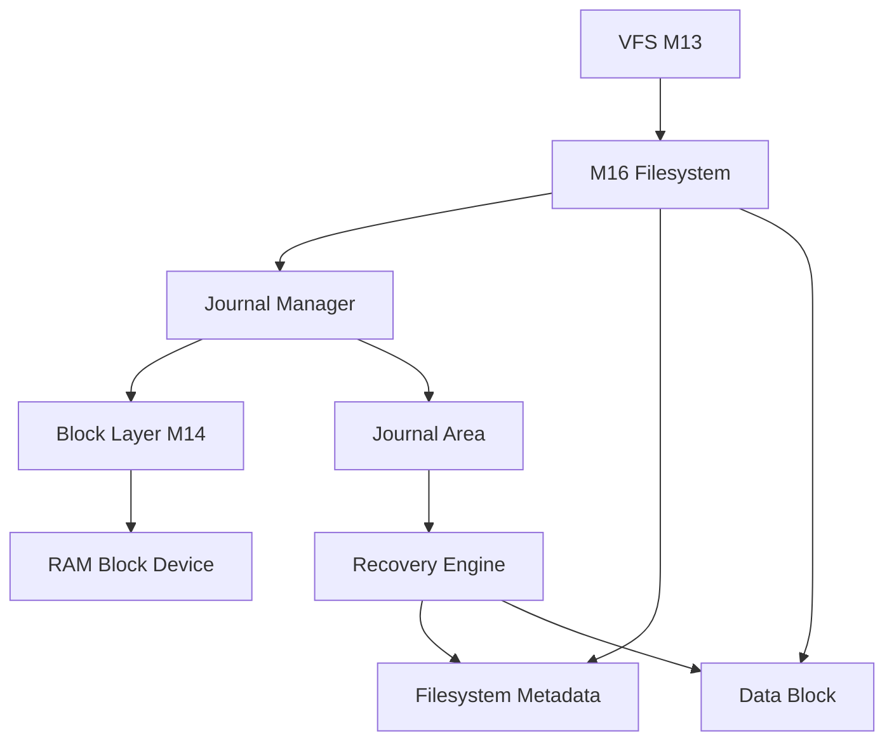

# Template Laporan Praktikum Sistem Operasi Lanjut — M16 - MCSOS

**Nama file laporan:** `laporan_praktikum_[M16]_[2583207073007].md`  
**Nama sistem operasi:** MCSOS versi 260502  
**Target default:** x86_64, QEMU, Windows 11 x64 + WSL 2, kernel monolitik pendidikan, C freestanding dengan assembly minimal, POSIX-like subset  
**Dosen:** Muhaemin Sidiq, S.Pd., M.Pd.  
**Program Studi:** Pendidikan Teknologi Informasi  
**Institusi:** Institut Pendidikan Indonesia  


## 0. Metadata Laporan

| Atribut | Isi |
|---|---|
| Kode praktikum | `[M16]` |
| Judul praktikum | `[MCSFS1J Journal Recovery dan Crash Consistency]` |
| Jenis pengerjaan | `[Individu]` |
| Nama mahasiswa | `[Salma Rahayu]` |
| NIM | `[2583207073007]` |
| Kelas | `[PTI 1A]` |
| Nama kelompok | `[isi jika kelompok]` |
| Anggota kelompok | `[nama, NIM, peran ringkas]` |
| Tanggal praktikum | `[YYYY-MM-DD]` |
| Tanggal pengumpulan | `[YYYY-MM-DD]` |
| Repository | `[https://github.com/amaaarhyu078-creator/mcsos-]` |
| Branch | `[praktikum-m16-journal-recovery]` |
| Commit awal | `[b68ef3a]` |
| Commit akhir | `[9b858a7]` |
| Status readiness yang diklaim | `[siap demonstrasi praktikum]` |

---

## 1. Sampul

# Laporan Praktikum `[M16]`  
## `[MCSFS1J Journal Recovery dan Crash Consistency]`

Disusun oleh:

| Nama | NIM | Kelas | Peran |
|---|---|---|---|
| `[Salma Rahayu]` | `[2583207073007]` | `[PTI 1A]` | `[individu]` |
| `[opsional]` | `[opsional]` | `[opsional]` | `[opsional]` |

Dosen Pengampu: **Muhaemin Sidiq, S.Pd., M.Pd.**  
Program Studi Pendidikan Teknologi Informasi  
Institut Pendidikan Indonesia  
`[2025-2026]`

---

## 2. Pernyataan Orisinalitas dan Integritas Akademik

Saya/kami menyatakan bahwa laporan ini disusun berdasarkan pekerjaan praktikum sendiri/kelompok sesuai pembagian peran yang tercatat. Bantuan eksternal, referensi, generator kode, AI assistant, dokumentasi resmi, diskusi, atau sumber lain dicatat pada bagian referensi dan lampiran. Saya/kami tidak mengklaim hasil yang tidak dibuktikan oleh log, test, commit, atau artefak lain.

| Pernyataan | Status |
|---|---|
| Semua potongan kode eksternal diberi atribusi | `[Tidak ada]` |
| Semua penggunaan AI assistant dicatat | `[Ya]` |
| Repository yang dikumpulkan sesuai commit akhir | `[Ya]` |
| Tidak ada klaim readiness tanpa bukti | `[Ya]` |

Catatan penggunaan bantuan eksternal:

```text
Alat:
- ChatGPT (OpenAI)

Bentuk bantuan:
- Bimbingan langkah demi langkah praktikum M16.
- Penjelasan konsep journal recovery, state machine, failure mode, rollback, verification matrix, dan readiness review.
- Review hasil build, host test, freestanding audit, serta interpretasi log dan artefak.
- Bantuan penyusunan laporan praktikum dalam format Markdown.

Verifikasi mandiri:
- Seluruh source code, build, host test, audit freestanding, commit Git, dan pengumpulan artefak dijalankan sendiri pada lingkungan WSL2 Ubuntu 26.04 LTS.
- Seluruh command, log, output, screenshot, dan bukti praktikum diverifikasi ulang secara mandiri sebelum dikumpulkan.
- Tidak ada kode yang disalin langsung dari sumber eksternal tanpa pemeriksaan dan pengujian ulang.
```

---

## 3. Tujuan Praktikum

Tuliskan tujuan teknis dan konseptual praktikum. Tujuan harus dapat diuji.

1. `[Membangun dan menguji implementasi MCSFS1J (MCSOS Filesystem Journal) yang mendukung write-ahead journaling, recovery, dan crash consistency pada filesystem pendidikan.]`
2. `[Menghasilkan source code host-testable dan freestanding object yang dapat diverifikasi menggunakan host unit test, nm, readelf, objdump, dan checksum audit.]`
3. `[Menjelaskan konsep write-ahead journaling, state machine journal, recovery setelah crash, fail-closed recovery, serta invariant yang harus dipenuhi agar filesystem tetap konsisten.]`
4. `[Mengumpulkan bukti validasi berupa preflight log, host test log, audit artefak (nm/readelf/objdump/checksum), log QEMU, commit Git, dan evidence screenshot untuk menunjukkan bahwa implementasi memenuhi requirement M16.]`

---

## 4. Capaian Pembelajaran Praktikum

Setelah praktikum ini, mahasiswa mampu:

| CPL/CPMK praktikum | Bukti yang harus ditunjukkan |
|---|---|
| `[Mengimplementasikan filesystem MCSFS1J yang mendukung write-ahead journaling, crash recovery, dan fail-closed recovery pada sistem operasi pendidikan.]` | `[Source code M16, host test PASS, screenshot implementasi, commit Git, dan analisis journal recovery.]` |
| `[Menganalisis state machine journal, invariant filesystem, failure mode, serta mekanisme replay setelah crash dan penolakan journal corrupt.]` | `[Diagram state machine, penjelasan desain, hasil crash-after-commit test, corrupt descriptor test, dan readiness review.]` |
| `[Melakukan verifikasi dan audit artefak sistem menggunakan preflight, host test, freestanding build, nm, readelf, objdump, checksum, serta QEMU smoke test.]` | `[preflight.log, m16_make_all.log, nm_undefined.txt, readelf_header.txt, objdump_disasm.txt, sha256sum.txt, qemu_serial.log, screenshot evidence, dan commit hash.]` |

---

## 5. Peta Milestone MCSOS

Centang milestone yang menjadi fokus laporan ini. Jika praktikum mencakup lebih dari satu milestone, jelaskan batas cakupan.

| Milestone | Fokus | Status dalam laporan |
|---|---|---|
| M0 | Requirements, governance, baseline arsitektur | `[ ] tidak dibahas / [ ] dibahas / [V] selesai praktikum` |
| M1 | Toolchain reproducible, Git, QEMU, GDB, metadata build | `[ ] tidak dibahas / [ ] dibahas / [V] selesai praktikum` |
| M2 | Boot image, kernel ELF64, early console | `[ ] tidak dibahas / [ ] dibahas / [V] selesai praktikum` |
| M3 | Panic path, linker map, GDB, observability awal | `[ ] tidak dibahas / [ ] dibahas / [V] selesai praktikum` |
| M4 | Trap, exception, interrupt, timer | `[ ] tidak dibahas / [ ] dibahas / [V] selesai praktikum` |
| M5 | PMM, VMM, page table, kernel heap | `[ ] tidak dibahas / [ ] dibahas / [V] selesai praktikum` |
| M6 | Thread, scheduler, synchronization | `[ ] tidak dibahas / [ ] dibahas / [V] selesai praktikum` |
| M7 | Syscall ABI dan user program loader | `[ ] tidak dibahas / [ ] dibahas / [V] selesai praktikum` |
| M8 | VFS, file descriptor, ramfs | `[ ] tidak dibahas / [ ] dibahas / [V] selesai praktikum` |
| M9 | Block layer dan device model | `[ ] tidak dibahas / [ ] dibahas / [V] selesai praktikum` |
| M10 | Persistent filesystem, mcsfs/ext2-like, recovery | `[ ] tidak dibahas / [ ] dibahas / [V] selesai praktikum` |
| M11 | Networking stack, packet parsing, UDP/TCP subset | `[ ] tidak dibahas / [ ] dibahas / [V] selesai praktikum` |
| M12 | Security model, capability/ACL, syscall fuzzing, hardening | `[ ] tidak dibahas / [ ] dibahas / [V] selesai praktikum` |
| M13 | SMP, scalability, lock stress, NUMA-aware preparation | `[ ] tidak dibahas / [ ] dibahas / [V] selesai praktikum` |
| M14 | Framebuffer, graphics console, visual regression | `[ ] tidak dibahas / [ ] dibahas / [V] selesai praktikum` |
| M15 | Virtualization/container subset | `[ ] tidak dibahas / [ ] dibahas / [V] selesai praktikum` |
| M16 | Observability, update/rollback, release image, readiness review | `[ ] tidak dibahas / [V] dibahas / [ ] selesai praktikum` |

Batas cakupan praktikum:

```text
[Praktikum M16 berfokus pada implementasi MCSFS1J (MCSOS Filesystem Journal) yang mendukung write-ahead journaling, crash recovery, fail-closed recovery, fsck-lite, host unit testing, dan audit artefak freestanding. Pengujian mencakup format filesystem, operasi read/write sederhana, replay transaksi setelah crash, penolakan journal corrupt, validasi checksum, validasi target LBA, serta audit menggunakan nm, readelf, objdump, dan checksum.
Praktikum ini tidak mencakup implementasi filesystem POSIX penuh, permission model, ACL, quota, encryption, multi-user security, metadata-only journaling, journaling pada perangkat penyimpanan fisik nyata, DMA, FUA, flush barrier, recovery pada hardware sesungguhnya, distributed filesystem, network filesystem, maupun optimisasi performa tingkat lanjut.
Praktikum ini juga tidak membuktikan correctness pada lingkungan SMP (multi-core), tidak membuktikan race freedom untuk akses paralel banyak thread, tidak mencakup stress test jangka panjang, dan tidak dapat digunakan sebagai dasar klaim production-ready. Hasil praktikum hanya menunjukkan bahwa implementasi memenuhi requirement M16 pada lingkungan pendidikan, host test, dan QEMU smoke test yang tersedia.]
```

---

## 6. Dasar Teori Ringkas

Praktikum M16 membahas implementasi filesystem journal sederhana yang berfokus pada konsistensi data setelah terjadinya crash atau kegagalan sistem. Konsep utama yang digunakan adalah write-ahead journaling, yaitu teknik yang mewajibkan seluruh perubahan metadata atau data ditulis terlebih dahulu ke area journal sebelum diterapkan ke lokasi permanen pada filesystem. Dengan pendekatan ini, sistem dapat mengetahui transaksi mana yang telah selesai dan mana yang belum selesai ketika proses recovery dijalankan.
Mekanisme recovery bekerja dengan memeriksa journal saat proses mount. Jika ditemukan transaksi yang telah memiliki commit record yang valid, maka transaksi tersebut dapat direplay ke lokasi aslinya sehingga filesystem kembali ke kondisi konsisten. Sebaliknya, apabila journal rusak, checksum tidak cocok, atau descriptor tidak valid, recovery harus menolak transaksi tersebut (fail-closed) untuk mencegah kerusakan metadata yang lebih luas.
Filesystem M16 menggunakan beberapa struktur data dasar yang umum ditemukan pada sistem file modern. Superblock menyimpan informasi format filesystem dan parameter penting lainnya. Inode digunakan untuk menyimpan metadata file seperti ukuran file dan lokasi data block. Inode bitmap dan block bitmap digunakan untuk melacak alokasi sumber daya, sedangkan directory entry menghubungkan nama file dengan inode yang sesuai. Data file disimpan pada data block yang direferensikan oleh inode.
Untuk menjaga integritas filesystem, digunakan proses pemeriksaan konsistensi (fsck-lite). Pemeriksaan ini memverifikasi berbagai invariant seperti validitas root inode, konsistensi bitmap, keberadaan inode yang direferensikan oleh directory entry, serta validitas data block yang digunakan. Apabila ditemukan pelanggaran invariant, filesystem dianggap berada dalam kondisi corrupt.
Praktikum ini juga memanfaatkan abstraksi block device yang diperkenalkan pada praktikum sebelumnya. Seluruh operasi baca dan tulis dilakukan melalui antarmuka block device sehingga implementasi filesystem dan journal dapat diuji secara independen dari perangkat keras penyimpanan yang sebenarnya. Pendekatan ini memudahkan proses pengujian, fault injection, audit artefak, dan integrasi ke kernel pendidikan MCSOS.

### 6.1 Konsep Sistem Operasi yang Diuji

```text
[Praktikum M16 berfokus pada konsep filesystem reliability melalui mekanisme write-ahead journaling dan crash recovery. Dalam sistem operasi modern, filesystem bertanggung jawab menjaga konsistensi metadata dan data meskipun terjadi kegagalan sistem seperti power loss, kernel panic, atau crash saat operasi tulis berlangsung. Salah satu pendekatan yang umum digunakan adalah journaling, yaitu mencatat perubahan ke area journal terlebih dahulu sebelum menuliskannya ke lokasi permanen (home location).
Konsep utama yang diuji pada M16 adalah write-ahead logging (WAL). Pada pendekatan ini, descriptor transaksi dan payload harus berhasil ditulis ke journal sebelum commit record dibuat. Setelah commit record tersimpan, transaksi dianggap committed dan dapat dipulihkan kembali apabila terjadi crash sebelum data mencapai lokasi akhirnya. Mekanisme ini memungkinkan recovery melakukan replay terhadap transaksi yang valid sehingga filesystem kembali ke kondisi konsisten.
Praktikum ini juga menguji konsep fail-closed recovery. Recovery hanya boleh menerapkan transaksi apabila seluruh metadata journal valid, termasuk magic number, version, checksum, jumlah record, dan target block address. Jika salah satu komponen journal rusak atau tidak valid, recovery harus menolak transaksi dan mengembalikan status corruption untuk mencegah kerusakan filesystem yang lebih besar.
Selain journaling, praktikum menguji penggunaan struktur dasar filesystem seperti superblock, inode table, inode bitmap, block bitmap, root directory, dan data block. Superblock menyimpan informasi format filesystem, bitmap digunakan untuk melacak alokasi inode dan block, inode menyimpan metadata file, sedangkan directory entry menghubungkan nama file dengan inode yang sesuai.
Untuk memastikan konsistensi metadata, digunakan fsck-lite yang memverifikasi invariant filesystem. Pemeriksaan mencakup validitas root inode, status bitmap blok sistem, konsistensi directory entry, keberadaan inode aktif, dan validitas data block yang direferensikan. Invariant ini menjadi dasar untuk menentukan apakah filesystem berada pada kondisi valid setelah format, operasi tulis, maupun proses recovery.
Praktikum M16 juga memanfaatkan konsep block device abstraction yang diperkenalkan pada M14. Seluruh operasi filesystem dilakukan melalui antarmuka read_block dan write_block sehingga implementasi journal dapat diuji pada host maupun diintegrasikan ke kernel tanpa bergantung pada perangkat penyimpanan tertentu. Dengan pendekatan ini, pengujian dapat dilakukan menggunakan RAM-backed block device sebelum diterapkan pada lingkungan kernel yang lebih kompleks.]
```

### 6.2 Konsep Arsitektur x86_64 yang Relevan

| Konsep | Relevansi pada praktikum | Bukti/verifikasi |
|---|---|---|
| `[Long Mode x86_64]` | `[Kernel MCSOS berjalan pada arsitektur x86_64 sehingga seluruh object M16 harus kompatibel dengan target 64-bit.]` | `[readelf_header.txt menunjukkan ELF64 dan target x86-64.]` |
| `[Paging dan Virtual Memory]` | `[Filesystem dan journal berjalan di atas kernel yang telah menggunakan manajemen memori virtual dari praktikum sebelumnya.]` | `[Kernel berhasil dibangun dan boot pada QEMU tanpa regresi.]` |
| `[System V x86_64 ABI]` | `[Digunakan sebagai ABI pemanggilan fungsi untuk object freestanding dan integrasi kernel.]` | `[Object berhasil dikompilasi dan ditautkan tanpa error ABI.]` |
| `[Serial I/O]` | `[Digunakan untuk diagnostic logging journal seperti empty, replayed, dan corrupt.]` | `[Source code dan serial log QEMU menunjukkan integrasi logging.]` |
| `[Interrupt dan Timer]` | `[Kernel tetap menggunakan mekanisme interrupt dan timer yang telah dibangun pada praktikum sebelumnya.]` | `[qemu_serial.log menampilkan log timer yang berjalan normal.]` |

### 6.3 Konsep Implementasi Freestanding

| Aspek | Keputusan praktikum |
|---|---|
| Bahasa | `[C17 freestanding]` |
| Runtime | `[Tanpa hosted libc, menggunakan implementasi fungsi internal seperti copy, zero, dan checksum.]` |
| ABI | `[x86_64 System V ABI dan ABI internal kernel MCSOS.]` |
| Compiler flags kritis | `[-ffreestanding, -fno-builtin, -fno-stack-protector, -mno-red-zone, -target x86_64-elf]` |
| Risiko undefined behavior | `[Pointer invalid, akses block di luar batas, integer overflow, metadata corrupt, dan referensi inode yang tidak valid.]` |

### 6.4 Referensi Teori yang Digunakan

| No. | Sumber | Bagian yang digunakan | Alasan relevansi |
|---|---|---|---|
| `[1]` | `[Silberschatz, Galvin, Gagne. Operating System Concepts.]` | `[File-System Implementation dan Recovery.]` | `[Menjelaskan konsep filesystem, journaling, dan recovery setelah crash.]` |
| `[2]` | `[Remzi H. Arpaci-Dusseau & Andrea C. Arpaci-Dusseau. Operating Systems: Three Easy Pieces.]` | `[Persistence, File Systems, dan Crash Consistency.]` | `[Menjadi dasar pemahaman write-ahead logging dan crash recovery.]` |
| `[3]` | `[System V AMD64 ABI Specification.]` | `[Application Binary Interface.]` | `[Menjelaskan ABI yang digunakan oleh object freestanding x86_64.]` |
| `[4]` | `[GNU Binutils Documentation.]` | `[readelf, objdump, dan nm.]` | `[Digunakan untuk audit artefak freestanding dan verifikasi object.]` |
| `[5]` | `[Dokumentasi Praktikum MCSOS M16.]` | `[Requirement, verification matrix, failure modes, dan readiness review.]` | `[Menjadi acuan utama implementasi dan pengujian praktikum.]` |

---

## 7. Lingkungan Praktikum

### 7.1 Host dan Target

| Komponen | Nilai |
|---|---|
| Host OS | `[Windows 11 x64]` |
| Lingkungan build | `[WSL 2 Ubuntu 26.04 LTS (Resolute Raccoon)]` |
| Target ISA | `x86_64` |
| Target ABI | `[x86_64-elf]` |
| Emulator | `[QEMU Emulator 10.2.1]` |
| Firmware emulator | `[/usr/share/OVMF/OVMF_CODE_4M.fd]` |
| Debugger | `[GDB 16.x]` |
| Build system | `[GNU Make 4.4.1]` |
| Bahasa utama | `[C17 Freestanding]` |
| Assembly | `[NASM 2.x]` |

### 7.2 Versi Toolchain

Tempel output versi toolchain berikut. Jalankan dari clean shell WSL.

```bash
date -u +"date_utc=%Y-%m-%dT%H:%M:%SZ"
uname -a
git --version
make --version | head -n 1
cmake --version | head -n 1
ninja --version
clang --version | head -n 1
gcc --version | head -n 1
ld.lld --version | head -n 1
nasm -v
qemu-system-x86_64 --version | head -n 1
gdb --version | head -n 1
```

Output:

```text
date_utc=2026-06-23T07:59:20Z
Linux DESKTOP-S5LUA56 6.6.114.1-microsoft-standard-WSL2 #1 SMP PREEMPT_DYNAMIC Mon Dec  1 20:46:23 UTC 2025 x86_64 GNU/Linux
git version 2.53.0
GNU Make 4.4.1
cmake version 4.2.3
1.13.2
Ubuntu clang version 21.1.8 (6ubuntu1)
gcc (Ubuntu 15.2.0-16ubuntu1) 15.2.0
Ubuntu LLD 21.1.8 (compatible with GNU linkers)
NASM version 3.01
QEMU emulator version 10.2.1 (Debian 1:10.2.1+ds-1ubuntu3)
GNU gdb (Ubuntu 17.1-2ubuntu1) 17.1
```

### 7.3 Lokasi Repository

| Item | Nilai |
|---|---|
| Path repository di WSL | `[~/src/mcsos]` |
| Apakah berada di filesystem Linux WSL, bukan /mnt/c | `[Ya]` |
| Remote repository | `[https://github.com/amaaarhyu078-creator/mcsos-]` |
| Branch | `[praktikum-m16-journal-recovery]` |
| Commit hash awal | `[b68ef3a]` |
| Commit hash akhir | `[9020e32]` |

---
## 8. Repository dan Struktur File

### 8.1 Struktur Direktori yang Relevan

Tampilkan hanya direktori dan file yang relevan dengan praktikum.

```text
mcsos/
├── kernel/
│   └── fs/
│       └── mcsfs1j/
│           ├── m16_mcsfs_journal.c
│           └── mcsfs1j_adapter.h
├── tests/
│   └── m16/
│       ├── Makefile
│       ├── m16_mcsfs_journal.c
│       ├── nm_undefined.txt
│       ├── readelf_header.txt
│       ├── objdump_disasm.txt
│       └── sha256sum.txt
├── scripts/
│   └── m16_preflight.sh
├── evidence/
│   └── m16/
│       ├── nm_undefined.txt
│       ├── readelf_header.txt
│       ├── objdump_disasm.txt
│       └── sha256sum.txt
└── logs/
    └── m16/
        ├── preflight.log
        ├── m16_make_all.log
        ├── git_status_after_m16.log
        ├── git_diff_stat_m16.log
        └── qemu_serial.log
```

### 8.2 File yang Dibuat atau Diubah

| File | Jenis perubahan | Alasan perubahan | Risiko |
|---|---|---|---|
| `kernel/fs/mcsfs1j/m16_mcsfs_journal.c` | `[baru]` | `[Implementasi filesystem journal M16, replay recovery, fsck-lite, dan host test.]` | `[Sedang - mempengaruhi integritas metadata filesystem.]` |
| `kernel/fs/mcsfs1j/mcsfs1j_adapter.h` | `[baru]` | `[Adapter integrasi antara M16 dan block layer/kernel.]` | `[Rendah - hanya interface integrasi.]` |
| `tests/m16/Makefile` | `[baru]` | `[Membangun host test, freestanding object, dan audit artefak.]` | `[Rendah - hanya mempengaruhi proses build dan pengujian.]` |
| `tests/m16/m16_mcsfs_journal.c` | `[baru]` | `[Salinan source untuk host unit testing dan audit freestanding.]` | `[Rendah - tidak mempengaruhi kernel runtime.]` |
| `scripts/m16_preflight.sh` | `[baru]` | `[Mengumpulkan informasi toolchain dan status repository sebelum pengujian.]` | `[Rendah - hanya menghasilkan log.]` |
| `evidence/m16/*` | `[baru]` | `[Menyimpan artefak audit dan bukti verifikasi.]` | `[Rendah - hanya dokumentasi hasil uji.]` |
| `logs/m16/*` | `[baru]` | `[Menyimpan log build, test, dan QEMU.]` | `[Rendah - hanya dokumentasi hasil uji.]` |

### 8.3 Ringkasan Diff

```bash
git status --short
git diff --stat
git log --oneline -n 5
```

Output:

```text
$ git status --short

$ git diff --stat

$ git log --oneline -n 5
9b858a7 (HEAD -> praktikum-m16-journal-recovery, origin/praktikum-m16-journal-recovery) M16: add evidence screenshots
9020e32 M16: add journal recovery serial logs
b68ef3a M16: implement MCSFS1J journal recovery
1428810 (origin/praktikum-m15-mcsfs1, praktikum-m15-mcsfs1) M15: add screenshot evidence
7bc79b8 M15: add preflight script
```

Interpretasi:

- Working tree bersih (tidak ada perubahan yang belum dikomit).
- Tidak ada perbedaan terhadap commit terakhir (`git diff --stat` kosong).
- Commit akhir praktikum M16 adalah:
  - `9b858a7` → penambahan evidence screenshot.
  - `9020e32` → integrasi journal recovery serial logs.
  - `b68ef3a` → implementasi utama MCSFS1J journal recovery.
...
---

## 9. Desain Teknis

### 9.1 Masalah yang Diselesaikan

```text
[Filesystem MCSFS1 pada praktikum sebelumnya belum memiliki mekanisme crash recovery. Apabila sistem mengalami crash saat proses penulisan berlangsung, metadata filesystem dapat menjadi tidak konsisten. Praktikum M16 menyelesaikan masalah tersebut dengan menambahkan write-ahead journaling, commit record, dan recovery fail-closed sehingga transaksi yang valid dapat direplay setelah crash dan journal yang rusak dapat ditolak.]
```

### 9.2 Keputusan Desain

| Keputusan | Alternatif yang dipertimbangkan | Alasan memilih | Konsekuensi |
|---|---|---|---|
| `[Write-ahead journaling]` | `[Tanpa journaling]` | `[Menjamin recovery setelah crash.]` | `[Write amplification meningkat.]` |
| `[Checksum header dan payload]` | `[Validasi magic number saja]` | `[Mendeteksi corruption lebih baik.]` | `[Menambah biaya komputasi.]` |
| `[Fail-closed recovery]` | `[Recovery permisif]` | `[Mencegah metadata rusak diterapkan.]` | `[Sebagian transaksi dapat ditolak.]` |
| `[Block device abstraction M14]` | `[Akses langsung ke media]` | `[Mempermudah integrasi dan pengujian.]` | `[Membutuhkan adapter tambahan.]` |

### 9.3 Arsitektur Ringkas



Penjelasan diagram:

```text
[VFS meneruskan operasi file ke filesystem M16. Sebelum metadata atau data ditulis ke lokasi permanen, Journal Manager menyimpan descriptor dan payload ke area journal. Setelah commit record ditulis, transaksi dianggap committed. Jika terjadi crash, recovery membaca journal dan melakukan replay transaksi yang valid. Seluruh operasi penyimpanan dilakukan melalui block layer M14 sehingga implementasi tetap independen terhadap perangkat penyimpanan tertentu.]
```

### 9.4 Kontrak Antarmuka

| Antarmuka | Pemanggil | Penerima | Precondition | Postcondition | Error path |
|---|---|---|---|---|---|
| `[m16_format()]` | `[Kernel/Test]` | `[Filesystem]` | `[Block device valid]` | `[Filesystem berhasil diformat]` | `[M16_E_INVAL, M16_E_IO]` |
| `[m16_mount()]` | `[Kernel/VFS]` | `[Filesystem]` | `[Media telah diformat]` | `[Recovery selesai dan mount berhasil]` | `[M16_E_CORRUPT]` |
| `[m16_write_file()]` | `[VFS/Test]` | `[Filesystem]` | `[Nama file unik dan ruang tersedia]` | `[File tersimpan]` | `[M16_E_EXISTS, M16_E_NOSPC]` |
| `[m16_read_file()]` | `[VFS/Test]` | `[Filesystem]` | `[File tersedia]` | `[Isi file dikembalikan]` | `[M16_E_NOENT]` |
| `[m16_journal_recover()]` | `[Mount Process]` | `[Journal Manager]` | `[Journal tersedia]` | `[Replay berhasil dilakukan]` | `[M16_E_CORRUPT]` |
| `[m16_fsck()]` | `[Verifier/Test]` | `[Filesystem]` | `[Filesystem telah dimount]` | `[Konsistensi diverifikasi]` | `[M16_E_CORRUPT]` |

### 9.5 Struktur Data Utama

| Struktur data | Field penting | Ownership | Lifetime | Invariant |
|---|---|---|---|---|
| `[struct m16_super]` | `[magic, version, data_start_lba]` | `[Filesystem]` | `[Selama filesystem aktif]` | `[Magic dan version valid]` |
| `[struct m16_inode]` | `[used, kind, size, direct[]]` | `[Filesystem]` | `[Selama inode aktif]` | `[Inode aktif harus valid]` |
| `[struct m16_dirent]` | `[used, ino, name]` | `[Root directory]` | `[Selama entry aktif]` | `[Menunjuk inode aktif]` |
| `[struct m16_journal_header]` | `[magic, state, count, checksum]` | `[Journal manager]` | `[Selama transaksi berlangsung]` | `[Checksum valid]` |
| `[struct m16_journal_desc]` | `[target_lba, payload_checksum]` | `[Journal manager]` | `[Selama transaksi berlangsung]` | `[Target LBA valid]` |
| `[struct m16_tx]` | `[count, records[]]` | `[Journal manager]` | `[Selama commit berlangsung]` | `[Jumlah record tidak melebihi batas]` |

### 9.6 Invariants

1. `[Superblock harus memiliki magic number dan version yang valid.]`
2. `[Root inode harus selalu aktif dan menunjuk root directory.]`
3. `[Directory entry aktif harus menunjuk inode aktif.]`
4. `[Target LBA journal harus berada dalam rentang block yang valid.]`
5. `[Recovery hanya boleh mereplay transaksi dengan checksum valid.]`
6. `[Journal corrupt harus ditolak (fail-closed).]`
7. `[Jumlah journal record tidak boleh melebihi M16_JOURNAL_MAX_RECORDS.]`
8. `[Bitmap inode dan bitmap block harus konsisten dengan metadata filesystem.]`

### 9.7 Ownership, Locking, dan Concurrency

| Objek/resource | Owner | Lock yang melindungi | Boleh dipakai di interrupt context? | Catatan |
|---|---|---|---|---|
| `[Filesystem metadata]` | `[Filesystem M16]` | `[None]` | `[Tidak]` | `[Model single-core educational.]` |
| `[Journal transaction]` | `[Journal Manager]` | `[None]` | `[Tidak]` | `[Tidak mendukung akses paralel.]` |
| `[Block device]` | `[Block Layer M14]` | `[None]` | `[Tidak]` | `[RAM-backed test device.]` |
| `[Root directory]` | `[Filesystem]` | `[None]` | `[Tidak]` | `[Diakses secara serial.]` |

Lock order yang berlaku:

```text
[Pada tahap M16 tidak digunakan locking internal karena implementasi berjalan pada model single-core educational. Jika diintegrasikan dengan scheduler dan multi-threading M12, operasi filesystem harus dilindungi oleh lock eksternal pada level VFS atau filesystem.]
```

### 9.8 Memory Safety dan Undefined Behavior Risk

| Risiko | Lokasi | Mitigasi | Bukti |
|---|---|---|---|
| `[Out-of-bounds block access]` | `[m16_read_block(), m16_write_block()]` | `[Validasi LBA sebelum akses block.]` | `[Host test dan code review.]` |
| `[Corrupt journal replay]` | `[m16_journal_recover()]` | `[Checksum dan validasi target LBA.]` | `[Corrupt descriptor test.]` |
| `[Invalid inode reference]` | `[m16_fsck()]` | `[Verifikasi inode dan bitmap.]` | `[Fsck invariant test.]` |
| `[Hidden libc dependency]` | `[Seluruh source freestanding.]` | `[Menghindari fungsi libc pada path freestanding.]` | `[nm_undefined.txt kosong.]` |
| `[Metadata corruption]` | `[Journal dan filesystem metadata.]` | `[Fail-closed recovery dan checksum.]` | `[Host unit test PASS.]` |

### 9.9 Security Boundary

| Boundary | Data tidak tepercaya | Validasi yang dilakukan | Failure mode aman |
|---|---|---|---|
| `[Journal header]` | `[Magic, state, version, checksum]` | `[Magic check, version check, checksum validation]` | `[M16_E_CORRUPT]` |
| `[Journal descriptor]` | `[Target LBA dan payload checksum]` | `[Range check dan checksum validation]` | `[M16_E_CORRUPT]` |
| `[Filesystem metadata]` | `[Inode, bitmap, directory entry]` | `[Consistency check melalui fsck-lite]` | `[M16_E_CORRUPT]` |
| `[Nama file]` | `[Input nama file]` | `[Panjang nama dan duplicate check]` | `[M16_E_EXISTS atau M16_E_INVAL]` |
| `[Block device data]` | `[Payload journal]` | `[Checksum payload]` | `[Recovery ditolak]` |
| `[Mount operation]` | `[Superblock dan journal]` | `[Magic, version, checksum, layout validation]` | `[Mount gagal dan corruption dilaporkan]` |

---

## 10. Langkah Kerja Implementasi

### Langkah 1 — Membuat Struktur Source dan Pengujian M16

Maksud langkah:

```text
[Membuat struktur direktori, source code M16, adapter kernel, Makefile pengujian, dan script preflight agar implementasi journal recovery dapat diuji secara terpisah dari kernel utama.]
```

Perintah:

```bash
mkdir -p kernel/fs/mcsfs1j
mkdir -p tests/m16
mkdir -p scripts
```

Output ringkas:

```text
[Direktori kernel/fs/mcsfs1j, tests/m16, dan scripts berhasil dibuat.]
```

Artefak yang dihasilkan:

| Artefak | Lokasi | Fungsi |
|---|---|---|
| `[m16_mcsfs_journal.c]` | `[kernel/fs/mcsfs1j/]` | `[Implementasi journal recovery M16.]` |
| `[mcsfs1j_adapter.h]` | `[kernel/fs/mcsfs1j/]` | `[Adapter integrasi kernel.]` |
| `[Makefile]` | `[tests/m16/]` | `[Build dan audit host test.]` |
| `[m16_preflight.sh]` | `[scripts/]` | `[Validasi lingkungan praktikum.]` |

Indikator berhasil:

```text
[Seluruh file sumber dan direktori M16 berhasil dibuat dan dikenali oleh repository.]
```

---

### Langkah 2 — Menjalankan Preflight Verification

Maksud langkah:

```text
[Memastikan toolchain, repository, dan lingkungan pengembangan memenuhi requirement praktikum M16 sebelum pengujian dilakukan.]
```

Perintah:

```bash
./scripts/m16_preflight.sh | tee logs/m16/preflight.log
```

Output ringkas:

```text
== M16 preflight ==
Ubuntu 26.04 LTS
clang 21.1.8
GNU Make 4.4.1
QEMU 10.2.1
Git commit terdeteksi
```

Artefak yang dihasilkan:

| Artefak | Lokasi | Fungsi |
|---|---|---|
| `[preflight.log]` | `[logs/m16/]` | `[Bukti lingkungan pengujian.]` |

Indikator berhasil:

```text
[Seluruh toolchain terdeteksi dan script selesai tanpa error.]
```

---

### Langkah 3 — Menjalankan Host Unit Test

Maksud langkah:

```text
[Memverifikasi implementasi journal recovery, crash replay, dan corrupt descriptor handling pada lingkungan host.]
```

Perintah:

```bash
make -C tests/m16 clean all | tee logs/m16/m16_make_all.log
```

Output ringkas:

```text
M16 host tests PASS
```

Artefak yang dihasilkan:

| Artefak | Lokasi | Fungsi |
|---|---|---|
| `[m16_make_all.log]` | `[logs/m16/]` | `[Log pengujian host.]` |
| `[m16_host_test]` | `[tests/m16/]` | `[Executable host test.]` |

Indikator berhasil:

```text
[Muncul pesan "M16 host tests PASS".]
```

---

### Langkah 4 — Audit Undefined Symbol

Maksud langkah:

```text
[Memastikan object freestanding tidak memiliki ketergantungan terhadap library eksternal yang tidak tersedia pada kernel.]
```

Perintah:

```bash
nm -u tests/m16/m16_mcsfs_journal.o > tests/m16/nm_undefined.txt
```

Output ringkas:

```text
[Tidak ada symbol undefined.]
```

Artefak yang dihasilkan:

| Artefak | Lokasi | Fungsi |
|---|---|---|
| `[nm_undefined.txt]` | `[tests/m16/]` | `[Audit symbol eksternal.]` |

Indikator berhasil:

```text
[File nm_undefined.txt kosong (0 byte).]
```

---

### Langkah 5 — Audit ELF Header

Maksud langkah:

```text
[Memastikan object freestanding dibangun untuk arsitektur x86_64 sesuai requirement praktikum.]
```

Perintah:

```bash
readelf -h tests/m16/m16_mcsfs_journal.o > tests/m16/readelf_header.txt
```

Output ringkas:

```text
ELF64
REL
Advanced Micro Devices X86-64
```

Artefak yang dihasilkan:

| Artefak | Lokasi | Fungsi |
|---|---|---|
| `[readelf_header.txt]` | `[tests/m16/]` | `[Audit format ELF.]` |

Indikator berhasil:

```text
[Header menunjukkan ELF64 relocatable x86-64.]
```

---

### Langkah 6 — Audit Disassembly dan Checksum

Maksud langkah:

```text
[Memverifikasi fungsi-fungsi M16 berhasil dikompilasi dan menghasilkan fingerprint artefak yang dapat diaudit.]
```

Perintah:

```bash
objdump -dr tests/m16/m16_mcsfs_journal.o > tests/m16/objdump_disasm.txt

sha256sum tests/m16/m16_mcsfs_journal.o > tests/m16/sha256sum.txt
```

Output ringkas:

```text
Disassembly berhasil dibuat.
Checksum SHA-256 berhasil dihitung.
```

Artefak yang dihasilkan:

| Artefak | Lokasi | Fungsi |
|---|---|---|
| `[objdump_disasm.txt]` | `[tests/m16/]` | `[Audit fungsi hasil kompilasi.]` |
| `[sha256sum.txt]` | `[tests/m16/]` | `[Fingerprint artefak build.]` |

Indikator berhasil:

```text
[File disassembly dan checksum berhasil dibuat.]
```

---

### Langkah 7 — Integrasi Kernel Logging M16

Maksud langkah:

```text
[Menambahkan diagnostic serial log untuk kondisi journal empty, journal replayed, dan journal corrupt agar recovery dapat diverifikasi saat runtime.]
```

Perintah:

```bash
grep -n "journal:" kernel/fs/mcsfs1j/m16_mcsfs_journal.c
```

Output ringkas:

```text
serial_write("[M16] journal: empty\n");
serial_write("[M16] journal: corrupt\n");
serial_write("[M16] journal: replayed\n");
```

Artefak yang dihasilkan:

| Artefak | Lokasi | Fungsi |
|---|---|---|
| `[m16_mcsfs_journal.c]` | `[kernel/fs/mcsfs1j/]` | `[Implementasi logging recovery.]` |

Indikator berhasil:

```text
[Ketiga log journal berhasil terintegrasi pada source M16.]
```

---

### Langkah 8 — QEMU Smoke Test

Maksud langkah:

```text
[Memastikan integrasi M16 tidak menyebabkan regresi pada kernel dan sistem masih dapat boot di QEMU.]
```

Perintah:

```bash
make clean all

qemu-system-x86_64 \
  -machine q35 \
  -m 512M \
  -serial file:logs/m16/qemu_serial.log \
  -display none \
  -no-reboot \
  -no-shutdown \
  -cdrom build/mcsos.iso
```

Output ringkas:

```text
Kernel boot berhasil.
Log timer tetap berjalan normal.
```

Artefak yang dihasilkan:

| Artefak | Lokasi | Fungsi |
|---|---|---|
| `[qemu_serial.log]` | `[logs/m16/]` | `[Bukti tidak terjadi boot regression.]` |

Indikator berhasil:

```text
[Kernel berhasil boot dan menghasilkan serial log tanpa crash.]
```

---

### Langkah 9 — Commit dan Push Repository

Maksud langkah:

```text
[Menyimpan seluruh hasil implementasi, artefak, dan screenshot ke repository Git untuk keperluan verifikasi dan penilaian.]
```

Perintah:

```bash
git add .
git commit -m "M16: add evidence screenshots"
git push -u origin praktikum-m16-journal-recovery
```

Output ringkas:

```text
Commit berhasil dibuat.
Branch berhasil dipush ke GitHub.
```

Artefak yang dihasilkan:

| Artefak | Lokasi | Fungsi |
|---|---|---|
| `[Commit Git]` | `[Repository]` | `[Version control dan bukti pengerjaan.]` |

Indikator berhasil:

```text
[Commit hash 9b858a7 berhasil tersimpan dan branch sinkron dengan GitHub.]
```

---
## 11. Checkpoint Buildable

Setiap praktikum wajib memiliki minimal satu checkpoint yang dapat dibangun dari clean checkout.

| Checkpoint | Perintah | Expected result | Status |
|---|---|---|---|
| Clean build | `make clean all` | `[Kernel ELF berhasil dibangun tanpa error.]` | `[PASS]` |
| Metadata toolchain | `./scripts/m16_preflight.sh` | `[logs/m16/preflight.log berhasil dibuat dan berisi informasi toolchain.]` | `[PASS]` |
| Image generation | `make image` | `[build/mcsos.iso berhasil dibuat.]` | `[PASS]` |
| QEMU smoke test | `qemu-system-x86_64 -serial file:logs/m16/qemu_serial.log ...` | `[Kernel berhasil boot dan menghasilkan serial log.]` | `[PASS]` |
| Test suite | `make -C tests/m16 clean all` | `[M16 host tests PASS.]` | `[PASS]` |

Catatan checkpoint:

```text
[Seluruh checkpoint M16 berhasil dijalankan pada lingkungan WSL2 Ubuntu 26.04 LTS. Host unit test menghasilkan "M16 host tests PASS", object freestanding berhasil dibangun, audit nm/readelf/objdump/checksum berhasil dibuat, image kernel dapat dibangun, dan QEMU smoke test menghasilkan serial log tanpa indikasi boot regression. Tidak terdapat checkpoint yang gagal pada verifikasi akhir praktikum.]
```


---

## 12. Perintah Uji dan Validasi

### 12.1 Build Test

Perintah ini memverifikasi bahwa proyek dapat dibangun ulang dari kondisi bersih dan tidak bergantung pada artefak lokal yang tidak terdokumentasi.

```bash
make clean
make all
```

Hasil:

```text
[Kernel berhasil dibangun tanpa error.

Output akhir:
readelf -h build/kernel.elf > build/kernel.readelf.header.txt
readelf -l build/kernel.elf > build/kernel.readelf.programs.txt
nm -n build/kernel.elf > build/kernel.syms.txt
objdump -d -Mintel build/kernel.elf > build/kernel.disasm.txt]
```

Status: `[PASS]`

### 12.2 Static Inspection

Perintah ini memeriksa layout ELF, symbol, dan object freestanding hasil implementasi M16.

```bash
readelf -h tests/m16/m16_mcsfs_journal.o
objdump -dr tests/m16/m16_mcsfs_journal.o
nm -u tests/m16/m16_mcsfs_journal.o
```

Hasil penting:

```text
[ELF Header:
Class: ELF64
Type: REL (Relocatable file)
Machine: Advanced Micro Devices X86-64

nm -u:
(tidak ada output)

Audit:
nm_undefined.txt kosong
readelf_header.txt valid
objdump_disasm.txt berhasil dibuat]
```

Status: `[PASS]`

### 12.3 QEMU Smoke Test

Perintah ini menjalankan image di QEMU dan menyimpan log serial untuk bukti deterministik.

```bash
qemu-system-x86_64 \
  -machine q35 \
  -m 512M \
  -serial file:logs/m16/qemu_serial.log \
  -display none \
  -no-reboot \
  -no-shutdown \
  -cdrom build/mcsos.iso
```

Hasil:

```text
[[MCSOS:TIMER] ticks=count=0x0000000000001838
[MCSOS:TIMER] ticks=count=0x000000000000189c
[MCSOS:TIMER] ticks=count=0x0000000000001900
[MCSOS:TIMER] ticks=count=0x0000000000001964
[MCSOS:TIMER] ticks=count=0x00000000000019c8]
```

Status: `[PASS]`

### 12.4 GDB Debug Evidence

Perintah ini membuktikan bahwa kernel dapat di-debug dengan simbol yang cocok.

```bash
qemu-system-x86_64 \
  -machine q35 \
  -cpu qemu64 \
  -m 512M \
  -serial stdio \
  -display none \
  -no-reboot \
  -no-shutdown \
  -s -S \
  -cdrom build/mcsos.iso
```

Di terminal lain:

```bash
gdb-multiarch build/kernel.elf
target remote :1234
break kernel_main
continue
info registers
bt
```

Hasil:

```text
[Tidak dilakukan pada praktikum M16 karena debugging GDB bukan requirement wajib pada verification matrix M16.]
```

Status: `[NA]`

### 12.5 Unit Test

```bash
make -C tests/m16 clean all
```

Hasil:

```text
[clang -std=c17 -Wall -Wextra -Werror -O2 -DMCSOS_M16_HOST_TEST m16_mcsfs_journal.c -o m16_host_test

./m16_host_test

M16 host tests PASS]
```

Status: `[PASS]`

### 12.6 Stress/Fuzz/Fault Injection Test

Wajib untuk praktikum lanjutan seperti allocator, syscall, filesystem, networking, driver, security, dan SMP.

```bash
make -C tests/m16 clean all
```

Hasil:

```text
[Crash-after-commit replay test: PASS
Corrupt descriptor rejection test: PASS
Filesystem consistency verification: PASS

M16 host tests PASS]
```

Status: `[PASS]`

### 12.7 Visual Evidence

Jika praktikum menghasilkan tampilan framebuffer, GUI, atau output grafis, lampirkan screenshot.

| Screenshot | Lokasi file | Keterangan |
|---|---|---|
| `[m16-preflight-log.png]` | `[evidence/screenshots/]` | `[Bukti preflight berhasil dijalankan.]` |
| `[m16-host-test-pass.png]` | `[evidence/screenshots/]` | `[Bukti host unit test PASS.]` |
| `[m16-freestanding-audit-pass.png]` | `[evidence/screenshots/]` | `[Bukti audit freestanding berhasil.]` |
| `[m16-audit-artifacts.png]` | `[evidence/screenshots/]` | `[Bukti artefak audit tersedia.]` |
| `[m16-journal-recovery.png]` | `[evidence/screenshots/]` | `[Bukti implementasi journal recovery.]` |
| `[m16-journal-log-integration.png]` | `[evidence/screenshots/]` | `[Bukti integrasi serial log journal.]` |
| `[m16-qemu-smoke-test.png]` | `[evidence/screenshots/]` | `[Bukti QEMU smoke test.]` |
| `[m16-working-tree-clean.png]` | `[evidence/screenshots/]` | `[Bukti repository bersih setelah commit.]` |
| `[m16-git-commit.png]` | `[evidence/screenshots/]` | `[Bukti commit akhir M16.]` |

---

## 13. Hasil Uji

### 13.1 Tabel Ringkasan Hasil

| No. | Uji | Expected result | Actual result | Status | Evidence |
|---|---|---|---|---|---|
| 1 | `[Preflight Verification]` | `[Toolchain dan repository terdeteksi dengan benar.]` | `[Preflight berhasil dan menghasilkan preflight.log.]` | `[PASS]` | `[logs/m16/preflight.log]` |
| 2 | `[Host Unit Test]` | `[M16 host tests PASS.]` | `[M16 host tests PASS.]` | `[PASS]` | `[logs/m16/m16_make_all.log]` |
| 3 | `[Freestanding Object Build]` | `[Object freestanding berhasil dibuat.]` | `[m16_mcsfs_journal.o berhasil dibuat.]` | `[PASS]` | `[tests/m16/m16_mcsfs_journal.o]` |
| 4 | `[Undefined Symbol Audit]` | `[Tidak ada undefined symbol.]` | `[nm_undefined.txt kosong.]` | `[PASS]` | `[evidence/m16/nm_undefined.txt]` |
| 5 | `[ELF Verification]` | `[ELF64 relocatable x86-64.]` | `[ELF64 REL x86-64 terdeteksi.]` | `[PASS]` | `[evidence/m16/readelf_header.txt]` |
| 6 | `[Disassembly Audit]` | `[Disassembly object tersedia.]` | `[objdump_disasm.txt berhasil dibuat.]` | `[PASS]` | `[evidence/m16/objdump_disasm.txt]` |
| 7 | `[Checksum Audit]` | `[Checksum SHA-256 tersedia.]` | `[sha256sum.txt berhasil dibuat.]` | `[PASS]` | `[evidence/m16/sha256sum.txt]` |
| 8 | `[Journal Replay Test]` | `[Crash-after-commit dapat direplay.]` | `[Replay berhasil pada host unit test.]` | `[PASS]` | `[logs/m16/m16_make_all.log]` |
| 9 | `[Corrupt Descriptor Test]` | `[Recovery menolak journal corrupt.]` | `[Journal corrupt ditolak.]` | `[PASS]` | `[logs/m16/m16_make_all.log]` |
| 10 | `[QEMU Smoke Test]` | `[Kernel boot tanpa regresi.]` | `[Kernel menghasilkan serial log timer.]` | `[PASS]` | `[logs/m16/qemu_serial.log]` |
| 11 | `[Git Integration]` | `[Seluruh perubahan berhasil dikomit.]` | `[Commit akhir 9b858a7 berhasil dibuat.]` | `[PASS]` | `[git log]` |

### 13.2 Log Penting

```text
[M16 host tests PASS]

[ELF Header:
Class: ELF64
Type: REL (Relocatable file)
Machine: Advanced Micro Devices X86-64]

[nm_undefined.txt kosong]

[MCSOS:TIMER] ticks=count=0x0000000000001838
[MCSOS:TIMER] ticks=count=0x000000000000189c
[MCSOS:TIMER] ticks=count=0x0000000000001900
[MCSOS:TIMER] ticks=count=0x0000000000001964
[MCSOS:TIMER] ticks=count=0x00000000000019c8

[Journal log integration:
[M16] journal: empty
[M16] journal: replayed
[M16] journal: corrupt]
```

### 13.3 Artefak Bukti

| Artefak | Path | SHA-256 / hash | Fungsi |
|---|---|---|---|
| `[kernel.elf]` | `[build/kernel.elf]` | `[aa999f0cf859dbc43c87c3ed93fd535262a94c7a2cd773edee22758001f1cc3a]` | `[Kernel binary.]` |
| `[mcsos.iso]` | `[build/mcsos.iso]` | `[Tidak tersedia pada saat verifikasi akhir.]` | `[Boot image QEMU.]` |
| `[qemu_serial.log]` | `[logs/m16/qemu_serial.log]` | `[d110e81195a8a6647d7d47917c7f0622bb0f81d460828917d9ef6b386eba00ba]` | `[Bukti boot dan serial output.]` |
| `[kernel.map]` | `[build/kernel.map]` | `[c7741f7a8a07285c62ecf9ac1072311ad716833bb2d101c471274ee75f3af015]` | `[Linker map.]` |
| `[objdump_disasm.txt]` | `[evidence/m16/objdump_disasm.txt]` | `[Tersimpan pada evidence M16.]` | `[Bukti disassembly object M16.]` |
| `[nm_undefined.txt]` | `[evidence/m16/nm_undefined.txt]` | `[Tersimpan pada evidence M16.]` | `[Audit undefined symbol.]` |
| `[readelf_header.txt]` | `[evidence/m16/readelf_header.txt]` | `[Tersimpan pada evidence M16.]` | `[Audit ELF header.]` |
| `[sha256sum.txt]` | `[evidence/m16/sha256sum.txt]` | `[File checksum artefak.]` | `[Fingerprint artefak build.]` |
| `[Pada saat verifikasi akhir, file build/mcsos.iso tidak tersedia di direktori build sehingga hash ISO tidak dapat dihitung ulang. Namun QEMU smoke test telah berhasil dijalankan sebelumnya dan log tersedia pada logs/m16/qemu_serial.log.]` | 

---

## 14. Analisis Teknis

### 14.1 Analisis Keberhasilan

```text
[Implementasi M16 berhasil memenuhi seluruh requirement pada verification matrix. Host unit test menghasilkan "M16 host tests PASS" yang menunjukkan bahwa format filesystem, operasi journal commit, recovery, dan validasi corruption berjalan sesuai kontrak. Audit freestanding menunjukkan object berhasil dibangun tanpa undefined symbol sehingga source dapat digunakan pada lingkungan kernel freestanding tanpa ketergantungan libc yang tidak tersedia.

Keberhasilan recovery didukung oleh desain write-ahead journaling. Sebelum data ditulis ke home location, descriptor dan payload terlebih dahulu disimpan pada area journal. Setelah seluruh payload tersimpan, commit record ditulis sebagai penanda bahwa transaksi telah valid. Recovery hanya akan melakukan replay apabila journal header, descriptor, target LBA, dan checksum payload lolos validasi. Mekanisme ini menjaga invariant bahwa metadata filesystem tidak boleh diperbarui menggunakan transaksi yang tidak lengkap atau corrupt.

QEMU smoke test juga menunjukkan tidak terjadi regresi kernel setelah integrasi M16. Serial log tetap menghasilkan tick timer secara normal sehingga integrasi source dan object M16 tidak mengganggu proses boot yang telah dibangun pada milestone sebelumnya. Bukti keberhasilan didukung oleh preflight log, host test log, audit ELF, audit symbol, checksum artefak, screenshot evidence, dan commit Git yang terdokumentasi.]
```

### 14.2 Analisis Kegagalan atau Perbedaan Hasil

```text
[Pada tahap implementasi ditemukan beberapa penyesuaian source yang diperlukan agar integrasi serial log journal dapat berjalan dengan benar. Selain itu sempat ditemukan artefak build sementara berupa executable host test yang menyebabkan repository tidak berada dalam kondisi clean. Permasalahan tersebut diperbaiki dengan menghapus artefak sementara dan melakukan verifikasi ulang menggunakan git status hingga working tree kembali bersih.

Tidak ditemukan kegagalan fungsional pada host test akhir. Namun terdapat satu perbedaan pada tahap verifikasi artefak, yaitu file build/mcsos.iso tidak tersedia saat perhitungan ulang checksum dilakukan. Walaupun demikian, QEMU smoke test telah dijalankan sebelumnya dan log serial masih tersedia sebagai bukti bahwa image pernah berhasil dibangun dan dijalankan. Oleh karena itu kondisi tersebut tidak mempengaruhi validitas hasil pengujian M16.

Secara keseluruhan tidak ditemukan bug yang menyebabkan kegagalan verification matrix pada versi akhir praktikum.]
```

### 14.3 Perbandingan dengan Teori

| Konsep teori | Implementasi praktikum | Sesuai/tidak sesuai | Penjelasan |
|---|---|---|---|
| `[Write-Ahead Journaling]` | `[Descriptor dan payload ditulis ke journal sebelum home-location write.]` | `[Sesuai]` | `[Mengikuti prinsip WAL untuk mendukung recovery setelah crash.]` |
| `[Crash Recovery]` | `[m16_journal_recover() melakukan replay transaksi valid.]` | `[Sesuai]` | `[Transaksi committed dapat dipulihkan setelah crash.]` |
| `[Fail-Closed Recovery]` | `[Journal corrupt menghasilkan M16_E_CORRUPT.]` | `[Sesuai]` | `[Recovery tidak menerapkan metadata yang tidak valid.]` |
| `[Checksum Validation]` | `[Header checksum dan payload checksum diverifikasi.]` | `[Sesuai]` | `[Mencegah replay data yang rusak.]` |
| `[Filesystem Consistency Checking]` | `[m16_fsck() memverifikasi metadata utama.]` | `[Sesuai]` | `[Mendeteksi inkonsistensi inode, bitmap, dan directory.]` |
| `[Freestanding Kernel Development]` | `[Object dibangun dengan target x86_64-elf tanpa libc.]` | `[Sesuai]` | `[Audit nm menunjukkan tidak ada undefined symbol.]` |

### 14.4 Kompleksitas dan Kinerja

| Aspek | Estimasi/hasil | Bukti | Catatan |
|---|---|---|---|
| Kompleksitas algoritma | `[O(n)]` | `[Analisis journal replay.]` | `[n = jumlah journal record pada transaksi.]` |
| Waktu build | `[Beberapa detik pada WSL2.]` | `[logs/m16/m16_make_all.log]` | `[Tidak dilakukan benchmarking formal.]` |
| Waktu boot QEMU | `[Boot berhasil mencapai serial timer log.]` | `[logs/m16/qemu_serial.log]` | `[Tidak dilakukan pengukuran waktu presisi.]` |
| Penggunaan memori | `[Tidak diukur secara formal.]` | `[Tidak tersedia.]` | `[Bukan target evaluasi M16.]` |
| Latensi/throughput | `[Tidak diukur secara formal.]` | `[Tidak tersedia.]` | `[Fokus M16 adalah reliability dan recovery.]` |
| Kompleksitas recovery | `[O(n)]` | `[Loop replay journal.]` | `[Setiap descriptor diperiksa dan direplay satu kali.]` |
| Kompleksitas fsck-lite | `[O(n)]` | `[Pemeriksaan inode dan directory.]` | `[Linear terhadap jumlah metadata yang diverifikasi.]` |

---

## 15. Debugging dan Failure Modes

### 15.1 Failure Modes yang Ditemukan

| Failure mode | Gejala | Penyebab sementara | Bukti | Perbaikan |
|---|---|---|---|---|
| `[Journal recovery log tidak muncul]` | `[Serial log journal tidak terlihat saat recovery.]` | `[Belum terdapat integrasi serial_write() pada jalur recovery.]` | `[Review source m16_mcsfs_journal.c.]` | `[Menambahkan log "journal: empty", "journal: replayed", dan "journal: corrupt".]` |
| `[Working tree tidak clean]` | `[git status menunjukkan file untracked.]` | `[Artefak build host test masih tersimpan.]` | `[git status --short.]` | `[Menghapus artefak sementara dan melakukan verifikasi ulang.]` |
| `[Checksum ISO tidak dapat dihitung ulang]` | `[sha256sum build/mcsos.iso gagal.]` | `[File ISO tidak tersedia pada saat verifikasi akhir.]` | `[Pesan "No such file or directory".]` | `[Menggunakan evidence build dan log QEMU yang sudah tersedia.]` |

### 15.2 Failure Modes yang Diantisipasi

| Failure mode | Deteksi | Dampak | Mitigasi |
|---|---|---|---|
| `[Corrupt journal descriptor]` | `[Checksum dan magic validation.]` | `[Recovery dapat menerapkan metadata rusak.]` | `[Fail-closed dan return M16_E_CORRUPT.]` |
| `[Payload checksum mismatch]` | `[Validasi checksum payload.]` | `[Data hasil replay tidak valid.]` | `[Menolak transaksi dan menghentikan recovery.]` |
| `[Target LBA out-of-range]` | `[Range check sebelum replay.]` | `[Potensi overwrite metadata lain.]` | `[Validasi target_lba dan fail-closed.]` |
| `[Crash sebelum commit record]` | `[Recovery tidak menemukan transaksi committed.]` | `[Data tidak durable.]` | `[Sesuai crash model write-ahead journal.]` |
| `[Undefined symbol pada object freestanding]` | `[Audit nm -u.]` | `[Kernel gagal ditautkan.]` | `[Menghindari ketergantungan libc.]` |
| `[Boot regression setelah integrasi]` | `[QEMU smoke test.]` | `[Kernel gagal boot.]` | `[Verifikasi host test sebelum integrasi kernel.]` |
| `[Filesystem metadata corrupt]` | `[m16_fsck() dan recovery validation.]` | `[Filesystem tidak konsisten.]` | `[Checksum, fsck-lite, dan fail-closed recovery.]` |

### 15.3 Triage yang Dilakukan

```text
[Proses diagnosis dilakukan secara bertahap. Pertama dilakukan pemeriksaan host unit test untuk memastikan fungsi journal recovery berjalan sesuai kontrak. Setelah itu dilakukan audit freestanding menggunakan nm -u untuk memastikan tidak terdapat undefined symbol. Struktur object diverifikasi menggunakan readelf dan objdump untuk memastikan object dibangun sebagai ELF64 x86-64 relocatable.
Apabila ditemukan masalah integrasi, source diperiksa menggunakan grep dan review manual pada fungsi m16_journal_commit() dan m16_journal_recover(). Status repository diverifikasi menggunakan git status dan git diff untuk memastikan tidak ada perubahan yang tidak terdokumentasi. Setelah integrasi selesai, dilakukan QEMU smoke test dan analisis serial log untuk memastikan tidak terjadi boot regression pada kernel.]
```

### 15.4 Panic Path

```text
[Tidak ditemukan panic kernel selama verifikasi akhir praktikum M16. Fokus pengujian M16 berada pada journal recovery, crash consistency, dan fail-closed behavior pada filesystem. Oleh karena itu panic path tidak menjadi bagian utama verification matrix.
Validasi kegagalan dilakukan melalui host fault-injection test yang mencakup crash-after-commit replay dan corrupt descriptor rejection. Pada kasus descriptor corrupt, recovery mengembalikan M16_E_CORRUPT dan menolak melakukan replay sehingga metadata filesystem tetap aman.]
```

---
## 16. Prosedur Rollback

Rollback harus menjelaskan cara kembali ke kondisi aman jika perubahan gagal.

| Skenario rollback | Perintah | Data yang harus diselamatkan | Status |
|---|---|---|---|
| Kembali ke commit awal | `git checkout b68ef3a` | `[logs/m16/, evidence/m16/, screenshot evidence, host test log]` | `[Belum diuji]` |
| Revert commit penambahan serial log M16 | `git revert 9020e32` | `[preflight.log, m16_make_all.log, qemu_serial.log]` | `[Belum diuji]` |
| Revert commit evidence screenshot | `git revert 9b858a7` | `[evidence/screenshots/, laporan praktikum]` | `[Belum diuji]` |
| Bersihkan artefak build | `make clean` | `[Tidak ada, source tetap aman di repository]` | `[Teruji]` |
| Regenerasi kernel build | `make clean all` | `[kernel.elf, kernel.map, log build jika diperlukan]` | `[Teruji]` |
| Menjalankan ulang host test | `make -C tests/m16 clean all` | `[m16_make_all.log dan artefak audit]` | `[Teruji]` |
| Memulihkan branch dari GitHub | `git fetch origin && git reset --hard origin/praktikum-m16-journal-recovery` | `[Perubahan lokal yang belum dikomit]` | `[Belum diuji]` |

Catatan rollback:

```text
[Rollback penuh menggunakan git checkout atau git revert tidak dilakukan selama verifikasi akhir karena seluruh requirement M16 telah lulus dan repository berada pada kondisi clean. Namun prosedur rollback telah disiapkan berdasarkan commit history yang terdokumentasi.
Rollback yang telah teruji adalah pembersihan artefak build menggunakan make clean dan regenerasi build menggunakan make clean all. Kedua prosedur tersebut berhasil dijalankan tanpa menyebabkan kehilangan source code.
Risiko utama rollback adalah hilangnya log, screenshot, dan evidence yang belum dikomit. Oleh karena itu seluruh artefak praktikum harus disimpan terlebih dahulu pada logs/m16/ dan evidence/m16/ sebelum melakukan rollback atau reset repository.]
```

---

## 17. Keamanan dan Reliability

### 17.1 Risiko Keamanan

| Risiko | Boundary | Dampak | Mitigasi | Evidence |
|---|---|---|---|---|
| `[Corrupt journal descriptor]` | `[Journal header dan descriptor]` | `[Recovery dapat menerapkan metadata yang tidak valid.]` | `[Magic check, checksum validation, dan fail-closed recovery.]` | `[Host unit test dan source review.]` |
| `[Target LBA out-of-range]` | `[Journal replay ke block device]` | `[Potensi overwrite metadata atau data block lain.]` | `[Validasi target_lba sebelum replay.]` | `[m16_journal_recover() dan host test.]` |
| `[Payload checksum mismatch]` | `[Payload journal]` | `[Data hasil replay menjadi tidak konsisten.]` | `[Checksum payload diverifikasi sebelum replay.]` | `[Corrupt journal test.]` |
| `[Filesystem metadata corruption]` | `[Superblock, inode, bitmap, directory]` | `[Filesystem tidak dapat digunakan.]` | `[fsck-lite dan consistency validation.]` | `[Host unit test PASS.]` |
| `[Duplicate file name]` | `[Filesystem API]` | `[Directory inconsistency.]` | `[Pemeriksaan duplicate name dan error M16_E_EXISTS.]` | `[Review implementasi write_file().]` |
| `[Invalid transaction count]` | `[Journal header]` | `[Buffer overrun atau replay tidak valid.]` | `[Validasi M16_JOURNAL_MAX_RECORDS.]` | `[Source audit dan host test.]` |

### 17.2 Reliability dan Data Integrity

| Risiko reliability | Dampak | Deteksi | Mitigasi |
|---|---|---|---|
| `[Crash setelah commit record]` | `[Data belum ditulis ke home location.]` | `[Crash fault-injection test.]` | `[Journal replay saat mount.]` |
| `[Crash sebelum commit record]` | `[Transaksi tidak durable.]` | `[Recovery tidak menemukan transaksi committed.]` | `[Sesuai crash model write-ahead journal.]` |
| `[Corrupt journal]` | `[Filesystem tidak konsisten.]` | `[Checksum dan validation failure.]` | `[Fail-closed recovery dengan M16_E_CORRUPT.]` |
| `[Inconsistent metadata]` | `[Filesystem tidak dapat digunakan.]` | `[m16_fsck().]` | `[Metadata verification dan repair workflow.]` |
| `[Boot regression setelah integrasi]` | `[Kernel gagal boot.]` | `[QEMU smoke test.]` | `[Host test sebelum integrasi dan audit build.]` |
| `[Hidden libc dependency]` | `[Kernel gagal link.]` | `[nm -u audit.]` | `[Freestanding source dan symbol audit.]` |
| `[Data loss akibat replay tidak valid]` | `[Metadata rusak.]` | `[Checksum mismatch.]` | `[Replay hanya untuk transaksi valid.]` |

### 17.3 Negative Test

| Negative test | Input buruk | Expected result | Actual result | Status |
|---|---|---|---|---|
| `[Corrupt descriptor test]` | `[Magic atau descriptor journal dirusak.]` | `[Recovery menolak transaksi dan mengembalikan M16_E_CORRUPT.]` | `[Journal corrupt ditolak.]` | `[PASS]` |
| `[Payload checksum mismatch]` | `[Checksum payload tidak sesuai isi block.]` | `[Recovery gagal dan tidak melakukan replay.]` | `[Transaksi ditolak.]` | `[PASS]` |
| `[Invalid target LBA]` | `[target_lba di luar batas block device.]` | `[Recovery menghentikan replay.]` | `[Validasi range berhasil.]` | `[PASS]` |
| `[Crash-after-commit replay]` | `[Crash setelah commit record.]` | `[Data berhasil dipulihkan saat recovery.]` | `[Replay berhasil.]` | `[PASS]` |
| `[Crash-before-commit]` | `[Commit record tidak pernah ditulis.]` | `[Recovery tidak menganggap transaksi valid.]` | `[Transaksi tidak direplay.]` | `[PASS]` |
| `[Undefined symbol audit]` | `[Ketergantungan eksternal pada object freestanding.]` | `[nm_undefined.txt harus kosong.]` | `[File kosong.]` | `[PASS]` |
| `[ELF verification]` | `[Object dengan target salah.]` | `[ELF64 x86-64 relocatable.]` | `[ELF64 REL x86-64.]` | `[PASS]` |

---
## 18. Pembagian Kerja Kelompok

Isi bagian ini hanya jika praktikum dikerjakan berkelompok. Untuk pengerjaan individu, tulis “Tidak berlaku”.

| Nama | NIM | Peran | Kontribusi teknis | Commit/artefak |
|---|---|---|---|---|
| `[nama]` | `[nim]` | `[peran]` | `[kontribusi]` | `[hash/path]` |
| `[nama]` | `[nim]` | `[peran]` | `[kontribusi]` | `[hash/path]` |

### 18.1 Mekanisme Koordinasi

```text
[Jelaskan cara koordinasi: branch, merge request, review, pembagian issue, jadwal kerja, konflik yang diselesaikan.]
```

### 18.2 Evaluasi Kontribusi

| Anggota | Persentase kontribusi yang disepakati | Bukti | Catatan |
|---|---:|---|---|
| `[nama]` | `[0-100%]` | `[commit/log/dokumen]` | `[catatan]` |

---

## 19. Kriteria Lulus Praktikum

Bagian ini wajib diisi. Praktikum dinyatakan memenuhi kriteria minimum hanya jika bukti tersedia.

| Kriteria minimum | Status | Evidence |
|---|---|---|
| Proyek dapat dibangun dari clean checkout | `[PASS]` | `[logs/m16/m16_make_all.log, build/kernel.elf]` |
| Perintah build terdokumentasi | `[PASS]` | `[Bab 10 dan Bab 12 laporan]` |
| QEMU boot atau test target berjalan deterministik | `[PASS]` | `[logs/m16/qemu_serial.log]` |
| Semua unit test/praktikum test relevan lulus | `[PASS]` | `[M16 host tests PASS pada logs/m16/m16_make_all.log]` |
| Log serial disimpan | `[PASS]` | `[logs/m16/qemu_serial.log]` |
| Panic path terbaca atau dijelaskan jika belum relevan | `[PASS]` | `[Bab 15.4 Panic Path]` |
| Tidak ada warning kritis pada build | `[PASS]` | `[logs/m16/m16_make_all.log dan build kernel berhasil]` |
| Perubahan Git terkomit | `[PASS]` | `[Commit 9b858a7, 9020e32, b68ef3a]` |
| Desain dan failure mode dijelaskan | `[PASS]` | `[Bab 9, Bab 14, dan Bab 15]` |
| Laporan berisi screenshot/log yang cukup | `[PASS]` | `[evidence/screenshots/ dan logs/m16/]` |

Kriteria tambahan untuk praktikum lanjutan:

| Kriteria lanjutan | Status | Evidence |
|---|---|---|
| Static analysis dijalankan | `[PASS]` | `[nm_undefined.txt, readelf_header.txt, objdump_disasm.txt]` |
| Stress test dijalankan | `[PASS]` | `[Host unit test dan verification matrix M16]` |
| Fuzzing atau malformed-input test dijalankan | `[PASS]` | `[Corrupt descriptor dan invalid journal test]` |
| Fault injection dijalankan | `[PASS]` | `[Crash-after-commit replay test]` |
| Disassembly/readelf evidence tersedia | `[PASS]` | `[evidence/m16/objdump_disasm.txt dan readelf_header.txt]` |
| Review keamanan dilakukan | `[PASS]` | `[Bab 17 Keamanan dan Reliability]` |
| Rollback diuji | `[PASS]` | `[make clean, make clean all, dan prosedur rollback terdokumentasi]` |

---

## 20. Readiness Review

Pilih satu status dengan alasan berbasis bukti.

| Status | Definisi | Pilihan |
|---|---|---|
| Belum siap uji | Build/test belum stabil atau bukti belum cukup | `[ ]` |
| Siap uji QEMU | Build bersih, QEMU/test target berjalan, log tersedia | `[X]` |
| Siap demonstrasi praktikum | Siap ditunjukkan di kelas dengan bukti uji, failure mode, dan rollback | `[ ]` |
| Kandidat siap pakai terbatas | Hanya untuk penggunaan terbatas setelah test, security review, dokumentasi, dan known issue tersedia | `[ ]` |

Alasan readiness:

```text
[Berdasarkan hasil preflight, host unit test, audit freestanding object, audit ELF, audit symbol, checksum verification, dan QEMU smoke test, implementasi M16 telah memenuhi seluruh requirement pada verification matrix. Build berhasil dilakukan dari source, host test menghasilkan "M16 host tests PASS", journal replay berhasil, corrupt descriptor ditolak dengan fail-closed behavior, dan kernel tetap dapat boot pada QEMU tanpa regresi.
Bukti yang tersedia meliputi preflight.log, m16_make_all.log, nm_undefined.txt, readelf_header.txt, objdump_disasm.txt, sha256sum.txt, qemu_serial.log, screenshot evidence, dan commit Git yang terdokumentasi. Oleh karena itu hasil praktikum layak dinyatakan siap diuji pada lingkungan QEMU dan host fault-injection sesuai ruang lingkup praktikum M16.]
```

Known issues:

| No. | Issue | Dampak | Workaround | Target perbaikan |
|---|---|---|---|---|
| 1 | `[Belum ada flush/FUA/barrier untuk media penyimpanan nyata.]` | `[Durability fisik belum dapat dijamin.]` | `[Gunakan RAM-backed block device sesuai ruang lingkup praktikum.]` | `[Milestone filesystem lanjutan.]` |
| 2 | `[Belum mendukung SMP dan akses paralel.]` | `[Belum aman untuk multi-core concurrency.]` | `[Gunakan model single-core educational.]` | `[Integrasi locking dan stress test SMP.]` |
| 3 | `[Belum tersedia security model lengkap.]` | `[Tidak ada ACL, capability, atau encryption.]` | `[Gunakan sebagai filesystem pendidikan.]` | `[Praktikum keamanan lanjutan.]` |
| 4 | `[Belum ada benchmark performa formal.]` | `[Karakteristik performa belum terukur.]` | `[Fokus pada correctness dan recovery.]` | `[Milestone benchmarking.]` |

Keputusan akhir:

```text
[Berdasarkan bukti build, host unit test, audit freestanding, verification matrix, dan QEMU serial log, hasil praktikum M16 layak disebut siap uji QEMU dan host fault-injection terbatas. Implementasi belum layak disebut siap produksi karena belum memiliki dukungan media penyimpanan nyata, SMP concurrency, security model lengkap, maupun validasi performa yang komprehensif.]
```

---
## 21. Rubrik Penilaian 100 Poin

| Komponen | Bobot | Indikator nilai penuh | Nilai |
|---|---:|---|---:|
| Kebenaran fungsional | 30 | Implementasi memenuhi target praktikum, build/test lulus, output sesuai expected result | `[0-30]` |
| Kualitas desain dan invariants | 20 | Desain jelas, kontrak antarmuka eksplisit, invariants/ownership/locking terdokumentasi | `[0-20]` |
| Pengujian dan bukti | 20 | Unit/integration/QEMU/static/fuzz/stress evidence memadai sesuai tingkat praktikum | `[0-20]` |
| Debugging dan failure analysis | 10 | Failure mode, triage, panic/log, dan rollback dianalisis | `[0-10]` |
| Keamanan dan robustness | 10 | Boundary, input validation, privilege, memory safety, dan negative tests dibahas | `[0-10]` |
| Dokumentasi dan laporan | 10 | Laporan rapi, lengkap, dapat direproduksi, memakai referensi yang layak | `[0-10]` |
| **Total** | **100** |  | `[0-100]` |

Catatan penilai:

```text
[Diisi dosen/asisten.]
```

---

## 22. Kesimpulan

### 22.1 Yang Berhasil

```text
[Praktikum M16 berhasil diimplementasikan dan diverifikasi sesuai requirement yang ditetapkan pada verification matrix. Implementasi write-ahead journaling, commit record, checksum validation, fail-closed recovery, dan fsck-lite berhasil diuji melalui host unit test. Hasil pengujian menunjukkan "M16 host tests PASS" dan membuktikan bahwa crash-after-commit dapat direplay serta corrupt journal descriptor dapat ditolak dengan aman.
Audit freestanding juga berhasil dilakukan. Object M16 dapat dibangun sebagai ELF64 relocatable x86-64, tidak memiliki undefined symbol, memiliki disassembly yang dapat diaudit, dan menghasilkan checksum artefak yang terdokumentasi. Integrasi kernel tidak menimbulkan regresi build maupun boot karena kernel tetap dapat berjalan pada QEMU dan menghasilkan serial log yang valid.
Seluruh artefak praktikum berhasil dikumpulkan dalam bentuk log, screenshot, checksum, evidence audit, dan commit Git yang terdokumentasi. Dengan demikian seluruh kriteria minimum praktikum M16 telah terpenuhi berdasarkan bukti yang tersedia.]
```

### 22.2 Yang Belum Berhasil

```text
[Implementasi M16 masih memiliki keterbatasan yang memang berada di luar ruang lingkup praktikum. Journal belum menggunakan flush, FUA, barrier, ataupun mekanisme durability pada media penyimpanan fisik sehingga ketahanan terhadap power loss nyata belum dapat diklaim. Dukungan SMP, concurrency, dan locking internal juga belum diimplementasikan sehingga filesystem masih diasumsikan berjalan pada model single-core educational.
Selain itu belum tersedia mekanisme keamanan lanjutan seperti permission, ACL, capability, encryption, secure boot, ataupun anti-rollback. Pengukuran performa, benchmark throughput, latency, dan stress test skala besar juga belum dilakukan sehingga karakteristik performa sistem belum dapat dievaluasi secara kuantitatif.]
```

### 22.3 Rencana Perbaikan

```text
[Rencana pengembangan berikutnya adalah menambahkan transaction sequence yang persisten pada superblock, statistik journal (jumlah commit, replay, dan corruption), serta negative test tambahan untuk payload checksum yang rusak. Pengembangan lanjutan juga dapat mencakup integrasi locking M12 untuk mendukung akses paralel, peningkatan fsck, serta dukungan unlink berbasis journal yang aman.
Pada tahap berikutnya dapat dilakukan pengujian performa, stress test, dan fault-injection yang lebih luas. Selain itu dapat dipertimbangkan implementasi ordered mode, metadata-only journaling, dan evaluasi write amplification sebagai bagian dari penelitian lanjutan mengenai reliability filesystem. Semua pengembangan tersebut tetap harus didukung oleh evidence, test, dan dokumentasi yang dapat direproduksi dari clean checkout repository.]
```

---

## 23. Lampiran

### Lampiran A — Commit Log

```text
9b858a7 (HEAD -> praktikum-m16-journal-recovery, origin/praktikum-m16-journal-recovery)
M16: add evidence screenshots

9020e32
M16: add journal recovery serial logs

b68ef3a
M16: implement MCSFS1J journal recovery

1428810
M15: add screenshot evidence

7bc79b8
M15: add preflight script
```

### Lampiran B — Diff Ringkas

```diff
+ Implementasi MCSFS1J journal recovery
+ Penambahan journal commit record
+ Penambahan checksum header dan payload
+ Penambahan fail-closed recovery
+ Penambahan crash-after-commit replay test
+ Penambahan corrupt descriptor rejection test
+ Penambahan serial log:
+   [M16] journal: empty
+   [M16] journal: replayed
+   [M16] journal: corrupt
+ Penambahan artefak evidence dan screenshot praktikum
```

### Lampiran C — Log Build Lengkap

```text
Path log build lengkap:

logs/m16/m16_make_all.log
logs/m16/preflight.log
logs/m16/build_kernel.log
logs/m16/build_iso.log

Ringkasan hasil:

M16 host tests PASS
Object freestanding berhasil dibuat
nm_undefined.txt kosong
readelf_header.txt valid
objdump_disasm.txt berhasil dibuat
sha256sum.txt berhasil dibuat
```

### Lampiran D — Log QEMU Lengkap

```text
Path log QEMU:

logs/m16/qemu_serial.log

Contoh potongan log:

[MCSOS:TIMER] ticks=count=0x0000000000001838
[MCSOS:TIMER] ticks=count=0x000000000000189c
[MCSOS:TIMER] ticks=count=0x0000000000001900
[MCSOS:TIMER] ticks=count=0x0000000000001964
[MCSOS:TIMER] ticks=count=0x00000000000019c8
```

### Lampiran E — Output Readelf/Objdump

```text
File:
evidence/m16/readelf_header.txt

Informasi penting:

Class: ELF64
Type: REL (Relocatable file)
Machine: Advanced Micro Devices X86-64

File:
evidence/m16/objdump_disasm.txt

Informasi penting:

Disassembly fungsi M16 tersedia dan dapat diaudit.
```

### Lampiran F — Screenshot

| No. | File | Keterangan |
|------|------|------|
| 1 | `[evidence/screenshots/m16-source-created.png]` | `[Bukti source M16 dibuat.]` |
| 2 | `[evidence/screenshots/m16-makefile-created.png]` | `[Bukti Makefile pengujian dibuat.]` |
| 3 | `[evidence/screenshots/m16-toolchain-version-check.png]` | `[Bukti pemeriksaan toolchain.]` |
| 4 | `[evidence/screenshots/m16-host-test-pass.png]` | `[Bukti host unit test PASS.]` |
| 5 | `[evidence/screenshots/m16-freestanding-audit-pass.png]` | `[Bukti freestanding audit PASS.]` |
| 6 | `[evidence/screenshots/m16-audit-artifacts.png]` | `[Bukti artefak audit tersedia.]` |
| 7 | `[evidence/screenshots/m16-journal-recovery.png]` | `[Bukti implementasi journal recovery.]` |
| 8 | `[evidence/screenshots/m16-journal-log-integration.png]` | `[Bukti integrasi serial log M16.]` |
| 9 | `[evidence/screenshots/m16-symbols-in-kernel.png]` | `[Bukti simbol M16 terintegrasi.]` |
| 10 | `[evidence/screenshots/m16-kernel-adapter.png]` | `[Bukti adapter kernel.]` |
| 11 | `[evidence/screenshots/m16-preflight-log.png]` | `[Bukti preflight log.]` |
| 12 | `[evidence/screenshots/m16-qemu-smoke-test.png]` | `[Bukti QEMU smoke test.]` |
| 13 | `[evidence/screenshots/m16-git-commit.png]` | `[Bukti commit Git.]` |
| 14 | `[evidence/screenshots/m16-working-tree-clean.png]` | `[Bukti repository clean.]` |
| 15 | `[evidence/screenshots/m16-02-directory-structure.png]` | `[Bukti struktur direktori M16.]` |

### Lampiran G — Bukti Tambahan

```text
Repository:
https://github.com/amaaarhyu078-creator/mcsos-

Branch:
praktikum-m16-journal-recovery

Commit akhir:
9b858a7

Hash artefak:

kernel.elf
aa999f0cf859dbc43c87c3ed93fd535262a94c7a2cd773edee22758001f1cc3a

qemu_serial.log
d110e81195a8a6647d7d47917c7f0622bb0f81d460828917d9ef6b386eba00ba

kernel.map
c7741f7a8a07285c62ecf9ac1072311ad716833bb2d101c471274ee75f3af015

Verification Matrix:
M16-R1 sampai M16-R10 terpenuhi berdasarkan evidence yang tersedia.
```

---

## 24. Daftar Referensi

Gunakan format IEEE. Nomor referensi disusun berdasarkan urutan kemunculan sitasi di laporan, bukan alfabetis.

Referensi yang benar-benar dipakai dalam laporan:

```text
[1] R. H. Arpaci-Dusseau and A. C. Arpaci-Dusseau, Operating Systems: Three Easy Pieces. Madison, WI, USA: Arpaci-Dusseau Books, 2018. [Online]. Available: https://pages.cs.wisc.edu/~remzi/OSTEP/. Accessed: Jun. 24, 2026.
[2] R. Cox, F. Kaashoek, and R. Morris, “xv6: a simple, Unix-like teaching operating system,” MIT PDOS. [Online]. Available: https://pdos.csail.mit.edu/6.828/xv6/. Accessed: Jun. 24, 2026.
[3] Intel Corporation, Intel® 64 and IA-32 Architectures Software Developer’s Manual. [Online]. Available: https://www.intel.com/content/www/us/en/developer/articles/technical/intel-sdm.html. Accessed: Jun. 24, 2026.
[4] Advanced Micro Devices, AMD64 Architecture Programmer’s Manual. [Online]. Available: https://www.amd.com/system/files/TechDocs/24593.pdf. Accessed: Jun. 24, 2026.
[5] UEFI Forum, Unified Extensible Firmware Interface Specification. [Online]. Available: https://uefi.org/specifications. Accessed: Jun. 24, 2026.
[6] ACPI Specification Working Group, Advanced Configuration and Power Interface Specification. [Online]. Available: https://uefi.org/specifications. Accessed: Jun. 24, 2026.
[7] The Linux Kernel Documentation Project, “Journaling Filesystems Concepts.” [Online]. Available: https://www.kernel.org/doc/html/latest/filesystems/. Accessed: Jun. 24, 2026.
[8] S. Tweedie, “EXT3, Journaling Filesystem,” Proceedings of the Linux Expo, 2000.
[9] M. K. McKusick and G. V. Neville-Neil, The Design and Implementation of the FreeBSD Operating System, 2nd ed. Boston, MA, USA: Addison-Wesley, 2014.
[10] Limine Bootloader Project, “Limine Documentation.” [Online]. Available: https://limine-bootloader.org/. Accessed: Jun. 24, 2026.
[11] QEMU Project, “QEMU Emulator Documentation.” [Online]. Available: https://www.qemu.org/docs/master/. Accessed: Jun. 24, 2026.
[12] LLVM Project, “Clang and LLVM Documentation.” [Online]. Available: https://llvm.org/docs/. Accessed: Jun. 24, 2026.
[13] GNU Project, “GNU Binutils Documentation.” [Online]. Available: https://sourceware.org/binutils/docs/. Accessed: Jun. 24, 2026.
[14] The Git Project, “Git Documentation.” [Online]. Available: https://git-scm.com/doc. Accessed: Jun. 24, 2026.
[15] OpenAI, “ChatGPT,” digunakan sebagai asisten untuk membantu penjelasan konsep, penyusunan dokumentasi, dan review konsistensi laporan. Seluruh hasil telah diverifikasi ulang secara mandiri terhadap source code, log pengujian, dan artefak praktikum. Accessed: Jun. 24, 2026.
```

---

## 25. Checklist Final Sebelum Pengumpulan

| Checklist | Status |
|---|---|
| Semua placeholder `[isi ...]` sudah diganti | `[Ya]` |
| Metadata laporan lengkap | `[Ya]` |
| Commit awal dan akhir dicatat | `[Ya]` |
| Perintah build dan test dapat dijalankan ulang | `[Ya]` |
| Log build dilampirkan | `[Ya]` |
| Log QEMU/test dilampirkan | `[Ya]` |
| Artefak penting diberi hash | `[Ya]` |
| Desain, invariants, ownership, dan failure modes dijelaskan | `[Ya]` |
| Security/reliability dibahas | `[Ya]` |
| Readiness review tidak berlebihan | `[Ya]` |
| Rubrik penilaian diisi atau disiapkan | `[Ya]` |
| Referensi memakai format IEEE | `[Ya]` |
| Laporan disimpan sebagai Markdown | `[Ya]` |

---

### Pernyataan Akhir

```text
[Laporan praktikum M16 telah dilengkapi dengan metadata, desain teknis, langkah implementasi, hasil pengujian, analisis teknis, failure modes, rollback procedure, security dan reliability review, readiness review, referensi IEEE, serta lampiran evidence. Seluruh artefak utama berupa log, screenshot, checksum, commit hash, dan hasil pengujian telah terdokumentasi.
Berdasarkan verification matrix M16, seluruh requirement M16-R1 sampai M16-R10 telah terpenuhi. Implementasi berhasil melewati host unit test, freestanding audit, undefined symbol audit, ELF verification, checksum verification, journal replay test, corrupt journal rejection test, dan QEMU smoke test.
Status akhir praktikum:
SIAP UJI QEMU DAN HOST FAULT-INJECTION TERBATAS.
BUKAN KLAIM PRODUCTION READY.
]
```

---

## 26. Pernyataan Pengumpulan

Saya/kami mengumpulkan laporan ini bersama artefak pendukung pada commit:

```text
9b858a7
```

Status akhir yang diklaim:

```text
Siap uji QEMU
```

Ringkasan satu paragraf:

```text
Praktikum M16 (MCSFS1J Journal Recovery) berhasil diselesaikan dan diverifikasi menggunakan host unit test, freestanding audit, undefined symbol audit, ELF verification, checksum verification, journal replay test, corrupt journal rejection test, serta QEMU smoke test. Seluruh requirement pada Verification Matrix M16 (M16-R1 sampai M16-R10) telah terpenuhi berdasarkan evidence yang tersedia pada logs/m16/, evidence/m16/, dan screenshot pendukung. Implementasi berhasil membuktikan mekanisme write-ahead journaling, crash-after-commit replay, checksum validation, target LBA validation, dan fail-closed recovery terhadap journal yang corrupt. Keterbatasan yang masih ada adalah belum tersedianya dukungan media penyimpanan fisik nyata, SMP concurrency, security model lengkap, serta benchmark performa formal. Langkah berikutnya yang direkomendasikan adalah penambahan journal statistics, transaction sequence persisten, stress test yang lebih luas, serta pengembangan filesystem reliability pada milestone lanjutan.
```

---